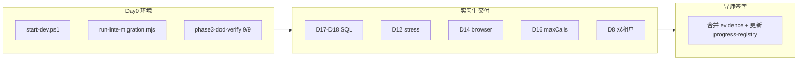

# Phase3 实习生验收清单（D8 / D12 / D14 / D16 / D17–D18）

> ⚠️ **R12 三元组适配声明（2026-07-07 追加）：** 本清单涉及的所有日志、事件、SQL MUST 含三元组 `(tenantId, projectId, pipelineId)`；原文 L25 验收点「每条 Skill 步骤含 runId+tenantId+projectId」缺 pipelineId 已废除。详见 `.cursor/rules/triple-key-iron-law.mdc`。

> **文档定位**：阶段三 DoD 剩余条目的**操作 SOP + 提交物模板**。  
> **权威 DoD 定义**：[`11、全链条第三阶段开发计划.md`](./11、全链条第三阶段开发计划.md) §7  
> **已自动化（勿重复劳动）**：`node scripts/phase3-dod-verify.mjs` 已覆盖 D1/D6/D7/D10/D13/D15/D19 等 9 项。

---

## 1. 适用范围与分工

| 任务 | DoD | 负责人 | 导师必须复核 |
|------|-----|--------|--------------|
| A | D17–D18 CallLog 对账 | 实习生 | SQL 结果 + 偏差说明 |
| B | D12 并发压测 | 实习生 | 失败是否环境/真 bug |
| C | D14 浏览器泄漏 | 实习生 | 截图路径与时效 |
| D | D16 maxCalls 门禁 | 实习生写用例/脚本 | **代码 review + 429 语义** |
| E | D8 双租户隔离 | 实习生跑流程 | **安全签字（泄漏=一票否决）** |



---

## 2. Day 0 — 环境门禁（全员必做）

### 2.1 启动与迁移

```powershell
# 唯一启动入口（禁止直接 dotnet run / npm run dev）
powershell -ExecutionPolicy Bypass -File D:\JNPF-v52\start-dev.ps1

# Phase1–3 DDL（幂等，可重复执行）
node D:\JNPF-v52\scripts\run-inte-migration.mjs

# 基线：阶段三 API 子集必须全绿
node D:\JNPF-v52\scripts\phase3-dod-verify.mjs
```

**通过标准**：最后一行 `summary 9/9`，报告路径 `.claude/evidence/phase3-dod-verify.json`。

### 2.2 配置文件

| 文件 | 说明 |
|------|------|
| `backend/application/JNPF.API.Entry/Configurations/ConnectionStrings.json` | 本地 SQL Server（gitignore，勿提交） |
| `scripts/.jnpf-session.json` | 登录 Token 缓存（gitignore） |

### 2.3 遇阻升级（必须找导师）

- `phase3-dod-verify` 非 9/9  
- 迁移报列已存在以外的错误  
- API `:5000` / 前端 `:3100` 无法访问  

---

## 3. 任务 A — D17–D18 CallLog 对账

### 3.1 目标

| # | 条款 | 验收点 |
|---|------|--------|
| D17 | 单次 MaxTokens | `db-design-skill` 单次请求 `MaxTokens ≤ ai_skill_llm_policy.F_MaxTokensPerCall`（默认 8192）；可选：临时改为 1024 再跑一轮 |
| D18 | 项目 token 累加 | `ai_projects.F_TokenConsumed` ≈ 同项目 CallLog 的 `SUM(F_PROMPT_TOKENS + F_COMPLETION_TOKENS)` |

### 3.2 操作步骤

**Step 1 — 创建 pipeline 并跑 design（或单 Skill）**

```powershell
node D:\JNPF-v52\scripts\lib\jnpf-auth.mjs --json
# 记录 pipelineId，下文替换 {PID}
node D:\JNPF-v52\scripts\jnpf-api.mjs POST /api/studio/pipeline/execute/create "{\"name\":\"Intern-D18\",\"userRequirement\":\"$(('x'*800))\"}"
# simulate IR-1 + IR-2（快速路径，不等 LLM）
node D:\JNPF-v52\scripts\jnpf-api.mjs POST /api/studio/ir/{PID}/simulate "{\"eventType\":\"SkeletonCreated\"}"
node D:\JNPF-v52\scripts\jnpf-api.mjs POST /api/studio/ir/{PID}/simulate "{\"eventType\":\"EventSpecConfirmed\",\"fragmentId\":\"eventspec:BE-001\"}"
node D:\JNPF-v52\scripts\jnpf-api.mjs POST /api/studio/skills/design/{PID}/run "{}"
# 等待 2–5 分钟，或只跑 db-design：
# node scripts/jnpf-api.mjs POST /api/studio/skills/db-design/{PID}/run "{}"
```

**Step 2 — 记录跑前/跑后 `F_TokenConsumed`**

在 SSMS 或 `sqlcmd` 执行（`{PID}` = pipelineId，`{TENANT}` = 当前租户，admin 默认 `0` 或库内实际值）：

```sql
-- D18-1：项目侧消耗
SELECT F_Id, F_TenantId, F_TokenConsumed, F_TokenBudget, F_LlmBudgetStatus
FROM ai_projects
WHERE F_Id = '{PID}';

-- D18-2：CallLog 聚合（阶段三列 F_ProjectId / F_SkillId / F_RunId）
SELECT
    F_ProjectId,
    F_SkillId,
    COUNT(*) AS call_count,
    SUM(ISNULL(F_PROMPT_TOKENS, 0) + ISNULL(F_COMPLETION_TOKENS, 0)) AS log_tokens
FROM BASE_AI_CALL_LOG
WHERE F_ProjectId = '{PID}'
  AND F_TENANT_ID = '{TENANT}'
GROUP BY F_ProjectId, F_SkillId
ORDER BY F_SkillId;

-- D18-3：总和对账
SELECT
    p.F_TokenConsumed AS project_consumed,
    ISNULL(SUM(ISNULL(c.F_PROMPT_TOKENS, 0) + ISNULL(c.F_COMPLETION_TOKENS, 0)), 0) AS log_sum,
    p.F_TokenConsumed - ISNULL(SUM(ISNULL(c.F_PROMPT_TOKENS, 0) + ISNULL(c.F_COMPLETION_TOKENS, 0)), 0) AS delta
FROM ai_projects p
LEFT JOIN BASE_AI_CALL_LOG c
    ON c.F_ProjectId = p.F_Id AND c.F_TENANT_ID = p.F_TenantId
WHERE p.F_Id = '{PID}'
GROUP BY p.F_TokenConsumed;
```

**Step 3 — D17（MaxTokensPerCall）**

```sql
SELECT F_SkillId, F_MaxTokensPerCall
FROM ai_skill_llm_policy
WHERE F_SkillId = 'db-design-skill';
```

对最近一条 db-design CallLog，检查 `F_REQUEST_BODY` 中 `maxTokens` / `MaxTokens` 字段 ≤ 策略值。

可选加压（需导师批准后再改，测完恢复）：

```sql
UPDATE ai_skill_llm_policy SET F_MaxTokensPerCall = 1024 WHERE F_SkillId = 'db-design-skill';
-- 跑 db-design 后再查 F_REQUEST_BODY
UPDATE ai_skill_llm_policy SET F_MaxTokensPerCall = 8192 WHERE F_SkillId = 'db-design-skill';
```

### 3.3 通过标准

| 项 | 通过 | 不通过 |
|----|------|--------|
| D18 | `\|delta\| ≤ 100` 或导师认可偏差原因（如 LLM 未真正调用、仅 fallback） | delta 巨大且无说明 |
| D17 | 请求 MaxTokens ≤ 策略值；若有 1024 压测，实测 ≤ 1024 | 请求值大于策略 |

### 3.4 提交物

新建：`docs/AI原生开发/1、多用户多任务并行/evidence/phase3-d17-d18-{姓名}-{YYYYMMDD}.md`

```markdown
# D17–D18 验收记录
- 执行人：
- pipelineId：
- tenantId：
- 执行时间：

## D18 对账
| 字段 | 值 |
|------|-----|
| F_TokenConsumed | |
| CallLog SUM | |
| delta | |

## D17 MaxTokens
- policy F_MaxTokensPerCall：
- 抽样 F_Id（CallLog）：
- 请求体 MaxTokens：

## 结论
- [ ] D17 PASS / FAIL
- [ ] D18 PASS / FAIL
- 备注：
```

附：SQL 结果截图或 `.txt` 导出。

---

## 4. 任务 B — D12 并发压测

### 4.1 命令

```powershell
node D:\JNPF-v52\scripts\phase2.5-stress-e2e.mjs
# 时间紧时可跳过完整 Analyst 长链路：
node D:\JNPF-v52\scripts\phase2.5-stress-e2e.mjs --skip-full-e2e
```

### 4.2 通过标准

- 进程 **exit code 0**
- 报告：`.claude/evidence/phase2.5-stress-report.json` 中 G 项与并发相关用例为 `pass: true`
- **D12 专项**：同租户 4 条 pipeline 并行 design 时，第 4 条应 **429 配额** 或明确排队；**不同 pipeline 的 IR 事件不得串**

### 4.3 提交物

- 终端完整输出（或重定向到 `evidence/phase3-d12-stress-{日期}.log`）
- `phase2.5-stress-report.json` 副本或路径引用

**失败时**：不要擅自改 Guard 逻辑 → 记录失败 ID + 响应体 → 找导师。

---

## 5. 任务 C — D14 浏览器内存 / SSE 泄漏

### 5.1 前置

- 前端 `:3100` 已启动（`start-dev.ps1`）
- Playwright 已安装（项目 skill：`.claude/skills/playwright/SKILL.md`）

### 5.2 命令

```powershell
node D:\JNPF-v52\scripts\phase2.5-d16-browser.mjs
# 可选：切换次数
$env:D16_SWITCH_COUNT=10
node D:\JNPF-v52\scripts\phase2.5-d16-browser.mjs
```

### 5.3 通过标准

- 脚本 exit 0  
- `.claude/evidence/` 下存在 **业务截图** PNG：  
  - 文件大小 **> 5KB**  
  - 修改时间在运行后 **30 分钟内**  
  - 非 `playwright-smoke.png`  
- 操作路径：Studio → 切换 pipeline ≥10 次 → 离开页面；无 console 中 EventSource 无限重连

### 5.4 提交物

- 截图文件名 + 操作步骤 3–5 句  
- 若 Playwright 未安装：写明原因，**不得**伪造截图

---

## 6. 任务 D — D16 Skill 调用次数上限

### 6.1 背景

- 策略表：`ai_skill_llm_policy`，`architect-skill` 默认 `F_MaxLlmCalls = 3`  
- 门禁类：`SkillLlmBudgetGuard`（`backend/modularity/inteAssistant/JNPF.InteAssistant/Llm/SkillLlmBudgetGuard.cs`）  
- 第 4 次同 `runId` 调用应 **429**，body `data.code = LLM_CALL_LIMIT_EXCEEDED`

> 当前 `ArchitectSkillService` MVP 单次 run 仅 1 次 LLM 调用，**API  alone 难以触发第 4 次**。实习生推荐路径：**PhaseB 单元测试**（导师 review 后合并）。

### 6.2 推荐实现（单元测试）

文件：`backend/tests/JNPF.Tests.PhaseB/IrPhase3Tests.cs`

验收逻辑（伪代码，实现时交导师 review）：

1. 构造 `SkillLlmBudgetGuard`（或 mock DB 返回 architect policy maxCalls=3）  
2. 同一 `runId` 连续 `AcquireAsync` + `ExecuteAsync` 3 次 → 成功  
3. 第 4 次 `AcquireAsync` → 抛出 429，`code == LLM_CALL_LIMIT_EXCEEDED`

验证命令：

```powershell
cd D:\JNPF-v52\backend\tests\JNPF.Tests.PhaseB
dotnet run
# 或
cd D:\JNPF-v52\backend
dotnet test --filter Phase3
```

### 6.3 可选（导师已提供 dev hook 时）

若后续增加 `POST /api/studio/dev/llm/guard-smoke` 等 dev 端点，再补 API 脚本；**未交付前不要用 curl 猜接口**。

### 6.4 通过标准

- 单元测试或脚本 **exit 0**  
- 明确证据：第 4 次拒绝 + 错误码 `LLM_CALL_LIMIT_EXCEEDED`  
- SSE：`SkillProgress` / error 事件含 maxCalls 提示（有则记录，无则标注「未观测」）

### 6.5 提交物

- PR 或 patch 说明（改了哪些文件）  
- `dotnet run` 输出片段含 `[Phase3] All design skill tests passed.`

---

## 7. 任务 E — D8 双租户隔离

### 7.1 前置

向导师索取 **第二租户测试账号**（Tenant B）。禁止用生产账号。

### 7.2 操作步骤

**租户 A（admin）**

1. 创建 pipeline `PA`，simulate / 跑 design，记录事件类型列表  
2. `GET /api/studio/ir/{PA}/events` → 保存 JSON  

**租户 B（账号 B，Header 仍 `jnpf-origin: pc`）**

3. 创建 pipeline `PB`  
4. `GET /api/studio/ir/{PA}/events` → **必须 403/404 或空，不得出现 A 的 Skeleton/设计事件**  
5. `GET /api/studio/ir/{PB}/events` → 仅 B 自己的数据  

```powershell
# 账号 B 登录（示例，密码问导师）
$env:JNPF_ACCOUNT="tenant_b_user"
$env:JNPF_PASSWORD="***"
node scripts/lib/jnpf-auth.mjs --json
node scripts/jnpf-api.mjs GET /api/studio/ir/{PA}/events
```

### 7.3 通过标准

| 检查 | 预期 |
|------|------|
| B 读 A 的 IR | 失败或无数据 |
| B 的 pipeline 列表 | 不含 A 的 PA |
| 同 ID 猜测 | B 不能通过枚举 PA 访问 A 快照 |

**一票否决**：任意一条 cross-tenant 数据可见 → **FAIL**，立即上报导师。

### 7.4 提交物

- 两份 API 响应体（脱敏）  
- checklist 签字（见 §9）  

---

## 8. 禁止事项

- 禁止手点浏览器登录做 API 测试（用 `jnpf-auth.mjs`）  
- 禁止提交 `ConnectionStrings.json`、Token、真实密码  
- 禁止未导师 review 修改 `SkillLlmBudgetGuard` / `DesignSkillOrchestrator` 核心逻辑  
- 禁止复用旧截图冒充 D14 证据  
- 禁止在 D8 未通过时标记 PASS  

---

## 9. 总验收签字表（导师填写）

| 任务 | DoD | 实习生 | 日期 | 导师结论 | 证据路径 |
|------|-----|--------|------|----------|----------|
| A | D17–D18 | | | ☐ PASS ☐ FAIL | |
| B | D12 | | | ☐ PASS ☐ FAIL | |
| C | D14 | | | ☐ PASS ☐ FAIL | |
| D | D16 | | | ☐ PASS ☐ FAIL | |
| E | D8 | | | ☐ PASS ☐ FAIL | |

**阶段三剩余 DoD 收口条件**：  
`phase3-dod-verify.mjs` 9/9 **且** 上表 E 项 D8 导师签字 **且** A–D 无 FAIL。

导师收口后更新：`docs/progress-registry.yaml` → `current_focus` 移除对应待办。

---

## 10. 速查索引

| 资源 | 路径 |
|------|------|
| 阶段三计划 | `docs/AI原生开发/1、多用户多任务并行/11、全链条第三阶段开发计划.md` |
| API 自动化 | `scripts/phase3-dod-verify.mjs` |
| DB 迁移 | `scripts/run-inte-migration.mjs` |
| SQL 工具 | `scripts/lib/jnpf-db.mjs` |
| 压测 | `scripts/phase2.5-stress-e2e.mjs` |
| 浏览器 D16/D14 | `scripts/phase2.5-d16-browser.mjs` |
| API 说明 | `scripts/README-api-cli.md` |
| Phase3 DDL | `backend/modularity/inteAssistant/Migrations/20260801_Phase3_Design_Skills.sql` |

---

## 本节关键代码路径索引

| 类 | 路径 |
|----|------|
| `SkillLlmBudgetGuard` | `backend/modularity/inteAssistant/JNPF.InteAssistant/Llm/SkillLlmBudgetGuard.cs` |
| `LlmBudgetApiService` | `backend/modularity/inteAssistant/JNPF.InteAssistant/LlmBudgetApiService.cs` |
| `DesignSkillsApiService` | `backend/modularity/inteAssistant/JNPF.InteAssistant/Skills/DesignSkillsApiService.cs` |
| `IrPhase3Tests` | `backend/tests/JNPF.Tests.PhaseB/IrPhase3Tests.cs` |

## 本节核心表清单

- **ai_projects** — `F_TokenConsumed`、`F_TokenBudget`、`F_LlmBudgetStatus`  
- **BASE_AI_CALL_LOG** — `F_ProjectId`、`F_SkillId`、`F_RunId`、`F_PROMPT_TOKENS`、`F_COMPLETION_TOKENS`  
- **ai_skill_llm_policy** — `F_SkillId`、`F_MaxLlmCalls`、`F_MaxTokensPerCall`
