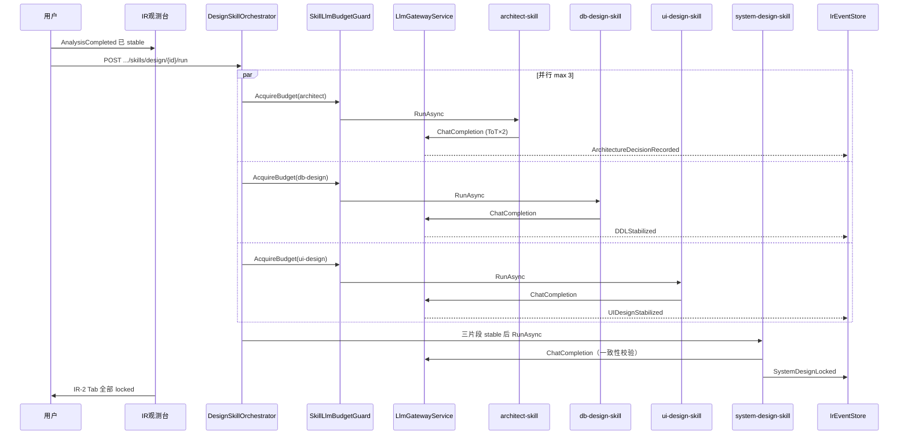

# 全链条第三阶段开发计划

> ⛔ **输入契约更新（2026-07-10）— 设计四 Skill 正文仍有效，S2 前置已更换**  
> **S2 现行标准：** [`25`](./25、需求分析子链重构方案书（修订版）.md) §6 + [`26`](./26、需求分析重构-第一阶段开发计划（数据基座与SA编译增强）.md)/[`27`](./27、需求分析重构-第二阶段开发计划（三轮循环与矩阵题）.md)/[`28`](./28、需求分析重构-第三阶段开发计划（需求分析书与质量验收）.md)。  
> **启动设计前 MUST：** `AnalysisCompleted.finalized=true` + 实体字段可读 **`ai_entity_field`**（禁止各自 parse IR-1 JSON 当唯一字段源）。  
> **9 号**旧「PM→Analyst→sa-service」主链已 supersede，不得再作本阶段前置施工依据。  
> **设计四 Skill 的 DAG / BudgetGuard / IR-2 Schema 正文可继续按本文实施**，仅改输入门禁与字段源。

> ⚠️ **R12 三元组适配声明（2026-07-07 追加）：** 本文档上下文中 `projectId` 出现处，运行时 MUST 与 `(tenantId, pipelineId)` 共同组成三元组（详见 `.cursor/rules/triple-key-iron-law.mdc`）。原文隐含的「projectId 即 pipelineId」假设仅适用于 greenfield WorkMode 自锚定场景，bugfix/enhancement 模式下两者不同。

> 文档编号：11 | 版本：v1.1（S2 契约对齐） | 周期：W5-W6（10 个工作日）  
> 上级总体计划：[`7、skills构建方案.md`](./7、skills构建方案.md) §2 阶段三  
> 前置依赖：**25 §6 + 28 验收**（`finalized` + `ai_entity_field`）；Harness/§14 仍可参考 [`9`](./9、全链条第二阶段开发计划.md)；可选 [`10`](./10、Phase2.5运行时加固施工包.md) G1–G8（运行时 NFR）  
> 文档定位：**全链条第 3 阶段可执行蓝图（设计四 Skill）**；S2 输入形态以 25–28 为准

---

## 文档索引

| 章节 | 内容 |
|---|---|
| §0 | 阶段定位与边界 |
| §1 | 现有资产锚点 |
| §2 | 提交需求页 E2E 集成中枢（设计四 Skill） |
| §3 | 两周冲刺计划（D1-D10） |
| §4 | 后端组件详细设计 |
| §5 | 数据模型 DDL（阶段三） |
| §6 | IR Schema v1 扩展（IR-2） |
| §7 | Definition of Done（D1-D20） |
| §8 | 任务依赖图 |
| §9 | 与阶段四衔接 |
| §10 | 风险与缓解 |
| §11 | 工程 Ticket 清单 |
| §12 | 阶段二/2.5 → 阶段三切换检查表 |
| §15 | **质量红线（NFR）— 含 LLM 调用控制** |

---

## 0. 阶段定位

### 0.1 在全链条中的位置

```
全链条 6 阶段
────────────────────────────────────────────────────────────
阶段一 W1-W2  ✅ IR 基础设施 + IR 观测台
阶段二 W3-W4  ✅ 现行：25+26–28 三轮编排 + Round3 Finalize（9 号旧主链已 supersede）
Phase 2.5     ☐ 条件触发 — 文档 10（运行时 NFR，非 S2 业务主链）
阶段三 W5-W6  ← 本文档：架构 / DB / UI / 总体设计四 Skill → IR-2
阶段四 W7-W8     开发 + 测试 Skill
阶段五 W9-W10    部署 + Bug 修复 + 全链路联调
阶段六 W11-W12   生产加固（Token Budget 四级降级 / OTel / etcd）
────────────────────────────────────────────────────────────
```

阶段三要回答的核心问题：**`AnalysisCompleted(finalized=true)` + `ai_entity_field` 能否驱动 4 个设计 Skill 并行/串行产出 IR-2，且全程可观测、可预算、不越界、不泄漏？**

### 0.2 核心策略（延续阶段一/二）

> **不做「后台设计 Skill 建完再挂 UI」。**  
> 阶段三第一天订阅 `AnalysisCompleted`，在 IR 观测台可见「运行设计 Skill」；**UI 与 REST/SSE API 模式不变**，只增 Skill 与 IR-2 事件类型。

同时交付：

1. **设计四 Skill**：`architect-skill` + `db-design-skill` + `ui-design-skill`（并行）→ `system-design-skill`（串行汇总）
2. **DesignSkillOrchestrator**：AnalysisCompleted 触发 DAG；3 并行 + 1 串行
3. **ConstraintEngine MVP**：分层违规检测 + 冲突报告 IR 事件
4. **SkillLlmBudgetGuard MVP**：**所有设计 Skill 的 LLM 调用统一门禁**（阶段三新增第五条质量生命线）
5. **IR-2 Schema**：Architecture / DDL / FormPageIR / SystemDesignLocked

### 0.3 阶段三目标（对照总体计划）

| 总体目标 | 阶段三贡献 |
|---|---|
| 目标一：10 个 Skills | 累计 6 个（+architect/db/ui/system-design）；复用 `IBaseSkill` + Harness |
| 目标二：完整链条 | Finalize 的 AnalysisCompleted → IR-2 locked；为阶段四 codegen 提供输入 |
| 目标三：SA / 需求分析 | 不再扩展 S2；消费 `finalized` + `ai_entity_field`（25 §6） |
| 目标四：四要素融合 | ContextBuilder 扩展 IR-2 片段裁剪 + 种子模板 |
| 目标五：多用户并行 | 3 设计 Skill 并行 + 租户/项目隔离 + **LLM 预算 per project** |
| 目标六：架构识别 | **ConstraintEngine** 首版；分层方向违规报告 |

### 0.4 阶段边界（不做什么）

| 不做 | 留给 |
|---|---|
| C# / Vue 代码生成 | 阶段四 `developer-skill` |
| VisualDev 原生 JSON 直写 | 阶段四 `ir1-to-visualdev-mapper` + `.vm` |
| Token Budget **四级降级**（绿/黄/红/熔断） | 阶段六 |
| OpenTelemetry 跨进程 Trace | 阶段六 |
| etcd 软路由 | 阶段六 |
| ConstraintEngine 完整图传播 | 阶段三 MVP 仅规则表 + 分层方向 |
| 每个架构候选强制 HITL | 阶段三 MVP：Top-1 自动锁定 + Dev 切换候选 |

### 0.5 阶段三交付物总览

```
提交需求页 — IR 观测台扩展 IR-2 Tab + 设计 Skill 进度
    │
    ├── AnalysisCompleted（阶段二）→ DesignSkillOrchestrator 自动/手动触发
    ├── architect-skill（并行）→ ArchitectureDecisionRecorded
    ├── db-design-skill（并行）→ DDLStabilized
    ├── ui-design-skill（并行）→ UIDesignStabilized
    ├── system-design-skill（串行）→ SystemDesignLocked（IR-2 完成）
    └── ConstraintEngine → ConstraintViolationReported（违规时）

后端
    ├── Skills/ArchitectSkillService, DbDesignSkillService, UiDesignSkillService, SystemDesignSkillService
    ├── Skills/DesignSkillOrchestrator.cs
    ├── Constraints/ConstraintEngineService.cs
    ├── Llm/SkillLlmBudgetGuard.cs + LlmCallPolicy.cs    ← 阶段三 LLM 控制核心
    └── Ir 事件扩展 + IR-2 Schema

阶段三 DoD
    └── stable IR-1 → 4 Skill → IR-2 locked
        → 双租户隔离 → LLM 预算不超限 → 手工平台零影响
```

---

## 1. 现有资产锚点（禁止重复造轮子）

### 1.1 阶段一/二已交付（直接复用）

| 资产 | 路径 | 阶段三用法 |
|---|---|---|
| SkillHarness | `Skills/SkillHarness.cs` | 4 个设计 Skill 统一执行 |
| SkillRegistry | `Skills/SkillRegistry.cs` | 注册 4 Skill + Orchestrator |
| ContextBuilder | `Skills/ContextBuilderService.cs` | 读 IR-1 EventSpec + 架构片段 |
| TenantGuard | `Infrastructure/Security/TenantGuard.cs` | 全路径 fail-closed |
| SkillRunGuard | 阶段二 P2-R02 | 单 pipeline 互斥 |
| SkillExecutionScope | 阶段二/2.5 P2.5-B01 | AsyncLocal runId 透传 |
| IrEventStore / Projection | `Ir/IrEventStoreService.cs` 等 | 设计事件 Append + Rebuild |
| SSE Hub | `PipelineSseChannelHub.cs` | skill_progress / ir_event |
| ai_projects | `F_TokenBudget` / `F_TokenConsumed` | **LLM 预算真相源** |

### 1.2 LLM 网关（阶段三 MUST 统一入口）

| 资产 | 路径 | 阶段三用法 |
|---|---|---|
| **ILlmGatewayService** | `LlmGatewayService.cs` | **唯一** LLM 调用入口；禁止 Skill 内直接 HttpClient 调 Provider |
| **BASE_AI_CALL_LOG** | `AiCallLogEntity` | 每次调用审计；阶段三扩展 runId/skillId/projectId |
| **Provider 熔断** | `LlmGatewayService._failureCounts` | 已有 GAP-2；设计 Skill 复用 |
| **StudioUsageService** | `Studio/StudioUsageService.cs` | 用量汇总；阶段三对接项目级 budget |
| **ModelProviderService** | `Studio/ModelProviderService.cs` | Provider/Model 配置；路由策略读取 |

**现状缺口（阶段三必须补齐）：**

- `WriteCallLogAsync` 未写入 `F_PROMPT_TOKENS` / `F_COMPLETION_TOKENS` 到实体字段（【待源码验证】调用链是否在其他分支写入）
- 调用日志**未关联** `runId` / `skillId` / `projectId`
- `ai_projects.F_TokenConsumed` **未在每次 LLM 调用后原子累加**
- 各 Agent 硬编码 `MaxTokens = 4096`，无 Skill 级策略

### 1.3 前端 IR 类型体系

| 资产 | 路径 | 阶段三用法 |
|---|---|---|
| **FormPageIR** | `jnpf-web-vue3/src/core/ir/types.ts` | ui-design-skill 产出目标格式 |
| **ir.schema.json** | `jnpf-web-vue3/src/core/ir/ir.schema.json` | Schema 校验 + LLM json_mode |
| **validator** | `jnpf-web-vue3/src/core/ir/validator.ts` | UI Skill ValidateOutput |
| **IrObservatoryPanel** | `views/studio/components/` | 扩展 IR-2 Tab |

### 1.4 API 契约

**已有（不变）：** 阶段二全部 `/api/studio/skills/*`、`/api/studio/ir/*`、SSE events

**阶段三新增：**

```
POST   /api/studio/skills/design/{pipelineId}/run           ← 触发 DesignSkillOrchestrator（全流程）
POST   /api/studio/skills/architect/{pipelineId}/run
POST   /api/studio/skills/db-design/{pipelineId}/run
POST   /api/studio/skills/ui-design/{pipelineId}/run
POST   /api/studio/skills/system-design/{pipelineId}/run
GET    /api/studio/skills/design/{pipelineId}/status        ← DAG 进度 + LLM 用量
GET    /api/studio/llm/budget/{projectId}                   ← 项目 Token 预算余量
POST   /api/studio/ir/{projectId}/constraints/check         ← ConstraintEngine 手动校验（Dev）
```

---

## 2. 提交需求页 E2E 集成中枢（设计四 Skill）

### 2.1 用户旅程



### 2.2 布局改造

| 区域 | 阶段三增量 |
|---|---|
| IR 观测台 · 快照 | 新增 IR-2 子 Tab：Architecture / DDL / FormPageIR / SystemDesign |
| IR 观测台 · 门控 | 4 Skill 进度 + Constraint 违规计数 |
| IR 观测台 · 诊断 | **LLM 预算余量**、本 run 已消耗 token、各 Skill 调用次数 |
| 对话区 | 「运行设计 Skill」主按钮；架构候选 Dev 切换（可选） |

**新建/改造文件：**

| 文件 | 动作 |
|---|---|
| `components/ir/IrDesignProgress.vue` | 新建：4 Skill DAG 进度 |
| `components/ir/Ir2SnapshotTab.vue` | 新建：IR-2 片段浏览 |
| `components/ir/IrLlmBudgetPanel.vue` | 新建：预算余量 + 调用明细 |
| `api/studio/designSkills.ts` | 新建 |
| `composables/useDesignSkills.ts` | 新建：Orchestrator 状态机 |

### 2.3 触发条件

```
AnalysisCompleted（payload.finalized == true）  ← 25/26/27 Round 3 工程保障完成
    ∧ ai_entity_field 可读（三元组定位，声明 3）
    → 自动触发（可配置）或用户点击「运行设计 Skill」
    → DesignSkillOrchestrator.ValidatePreconditions:
        finalized=true
        ∧（可选）质量门控 PassesGate（28：综合分≥60 / 无 CRITICAL）
        ∧ F_TokenConsumed < F_TokenBudget × 0.95（预留 5% 给 system-design）
    → 并行启动 architect + db + ui（字段源：ai_entity_field，禁止各自 parse IR-1 JSON 当唯一源）
    → 三者均 stable → system-design-skill
    → SystemDesignLocked → ai_projects.F_CurrentPhase = 'design-complete'
```

---

## 3. 两周冲刺计划

### Sprint 1（D1-D3）：LLM 门禁 + Orchestrator + Architect

| 天 | 任务 | 后端 | 前端 | 当日 E2E 验收 |
|---|---|---|---|---|
| D1 | SkillLlmBudgetGuard + LlmCallPolicy | `Llm/SkillLlmBudgetGuard.cs` | — | 超 budget 调用 → 429 + SSE error |
| D2 | DesignSkillOrchestrator 骨架 | DAG 调度 + AnalysisCompleted 订阅 | — | 手动触发 → 3 Skill 排队 |
| D3 | architect-skill MVP | ToT N=2 → ArchitectureDecisionRecorded | IrDesignProgress | 观测台见架构事件 |

### Sprint 2（D4-D6）：DB + UI 并行 Skill

| 天 | 任务 | 后端 | 前端 | 当日 E2E 验收 |
|---|---|---|---|---|
| D4 | db-design-skill | DDL 生成 + SQL 语法校验 | IR-2 DDL Tab | DDL 可在 SQL Server 执行 |
| D5 | ui-design-skill | FormPageIR 产出 + validator | IR-2 UI Tab | FormPageIR 通过 validator |
| D6 | 三 Skill 真并行 | Orchestrator max=3 | 诊断 Tab LLM 用量 | 3 Skill 同时跑，token 累加正确 |

### Sprint 3（D7-D8）：SystemDesign + ConstraintEngine

| 天 | 任务 | 后端 | 前端 | 当日 E2E 验收 |
|---|---|---|---|---|
| D7 | system-design-skill | 一致性校验 + SystemDesignLocked | — | 三片段 stable 后锁定 |
| D8 | ConstraintEngine MVP | 分层违规规则 | 违规 toast | DB 调 Controller → 冲突报告 |

### Sprint 4（D9-D10）：DoD + 质量红线

| 天 | 任务 | 后端 | 前端 | 当日 E2E 验收 |
|---|---|---|---|---|
| D9 | IR-2 Schema 注册 + 回归 | Schema + 单测 | — | 全事件类型校验通过 |
| D10 | DoD D1-D20 | 双租户 + LLM 压测 | 截图归档 | 手工平台零影响 |

---

## 4. 后端组件详细设计

### 4.1 目录结构

```
backend/modularity/inteAssistant/JNPF.InteAssistant/
├── Skills/
│   ├── DesignSkillOrchestrator.cs
│   ├── ArchitectSkillService.cs
│   ├── DbDesignSkillService.cs
│   ├── UiDesignSkillService.cs
│   └── SystemDesignSkillService.cs
├── Constraints/
│   └── ConstraintEngineService.cs
├── Llm/
│   ├── SkillLlmBudgetGuard.cs
│   ├── LlmCallPolicy.cs
│   └── LlmGatewayExtensions.cs          ← runId/skillId 写入 CallLog
├── Ir/
│   └── IrSchemaValidator.cs             ← 扩展 IR-2
└── DesignSkillsApiService.cs

Migrations/20260801_Phase3_Design_Skills.sql
```

### 4.2 DesignSkillOrchestrator

```csharp
public sealed class DesignSkillOrchestrator
{
    // 订阅 AnalysisCompleted 或 POST /design/run 手动触发
    public async Task RunAsync(long pipelineId, CancellationToken ct)
    {
        // 1. TenantGuard + IR-1 stable 校验
        // 2. SkillLlmBudgetGuard.ValidateProjectBudget(projectId) — 预检 95%
        // 3. Parallel: architect + db-design + ui-design (max 3, SemaphoreSlim per project)
        // 4. await all → system-design-skill
        // 5. ConstraintEngine.RunAsync → 若有 critical 违规，SystemDesignLocked 降级为 draft
    }
}
```

### 4.3 四 Skill 职责边界（禁止越界）

| Skill | 输入 | 产出 IR 事件 | 禁止 |
|---|---|---|---|
| **architect-skill** | `finalized` AnalysisCompleted + **ai_entity_field**（及 IR 片段摘要） | `ArchitectureDecisionRecorded` | 写 DDL / FormPageIR；parse IR-1 JSON 当唯一字段源 |
| **db-design-skill** | **ai_entity_field** + 架构片段 | `DDLStabilized` | 改业务规则 / UI 布局 |
| **ui-design-skill** | **ai_entity_field** + 角色矩阵 | `UIDesignStabilized`（FormPageIR） | 改表结构 / 架构模式 |
| **system-design-skill** | 三片段 stable | `SystemDesignLocked` | 重新生成架构/DDL/UI（须走 FragmentInvalidated） |
| **ConstraintEngine** | IR-2 全片段 | `ConstraintViolationReported` | 自动修复违规（仅报告） |

### 4.4 architect-skill（ToT MVP）

```
ContextBuilder(IR-1 EventSpecs + entityDrafts)
  → LlmCallPolicy: maxCalls=3, maxTokensPerCall=8192, modelTier=strong
  → ToT: 2 个架构候选（分层 vs CQRS 等）
  → 领域评分 Top-1
  → IrSchemaValidator(ArchitectureDecisionRecorded)
  → yield AppendAsync
```

### 4.5 db-design-skill

```
ContextBuilder(IR-1 entityDrafts + roleMatrix)
  → LlmCallPolicy: maxCalls=2, maxTokensPerCall=8192
  → 生成 SQL Server DDL
  → 本地语法校验（SqlSugar/Dapper 解析或 EXPLAIN）
  → 外键与 IR-1 entityDrafts 一致性检查
  → AppendAsync(DDLStabilized)
```

### 4.6 ui-design-skill

```
ContextBuilder(IR-1 confirmedFields + 角色)
  → LlmCallPolicy: maxCalls=2, maxTokensPerCall=4096, responseFormat=json
  → 产出 FormPageIR（对齐 types.ts）
  → validator.ts 等价 C# 校验（或调用前端校验 API Dev）
  → AppendAsync(UIDesignStabilized)
```

### 4.7 system-design-skill

```
ValidateInput: architect + ddl + ui 均 stable
  → LlmCallPolicy: maxCalls=1, maxTokensPerCall=4096, modelTier=strong
  → 交叉一致性：实体名、字段类型、接口契约
  → ConstraintEngine 结果合并
  → AppendAsync(SystemDesignLocked) 或 FragmentInvalidated（冲突时）
```

### 4.8 ConstraintEngine MVP

| 规则 ID | 检测 | 严重级 |
|---|---|---|
| C-001 | DB 层引用 Controller（分层违规） | critical |
| C-002 | UI 字段无 IR-1 来源 | warning |
| C-003 | DDL 表名与 entityDrafts.tableName 不一致 | critical |
| C-004 | 架构模式与模块划分矛盾 | warning |

---

## 5. 数据模型 DDL（阶段三）

### 5.1 `ai_llm_call_ext`（扩展调用审计，或 ALTER BASE_AI_CALL_LOG）

```sql
-- 优先 ALTER BASE_AI_CALL_LOG（若列不存在）
IF NOT EXISTS (SELECT 1 FROM sys.columns WHERE object_id = OBJECT_ID('BASE_AI_CALL_LOG') AND name = 'F_RunId')
    ALTER TABLE [dbo].[BASE_AI_CALL_LOG] ADD [F_RunId] NVARCHAR(50) NULL;

IF NOT EXISTS (SELECT 1 FROM sys.columns WHERE object_id = OBJECT_ID('BASE_AI_CALL_LOG') AND name = 'F_SkillId')
    ALTER TABLE [dbo].[BASE_AI_CALL_LOG] ADD [F_SkillId] NVARCHAR(100) NULL;

IF NOT EXISTS (SELECT 1 FROM sys.columns WHERE object_id = OBJECT_ID('BASE_AI_CALL_LOG') AND name = 'F_ProjectId')
    ALTER TABLE [dbo].[BASE_AI_CALL_LOG] ADD [F_ProjectId] NVARCHAR(50) NULL;

CREATE INDEX [IX_ai_call_log_project]
    ON [dbo].[BASE_AI_CALL_LOG] ([F_TenantId], [F_ProjectId], [F_CreatorTime] DESC);
```

### 5.2 `ai_projects` 扩展

```sql
IF NOT EXISTS (SELECT 1 FROM sys.columns WHERE object_id = OBJECT_ID('ai_projects') AND name = 'F_DesignCompletedAt')
    ALTER TABLE [dbo].[ai_projects] ADD [F_DesignCompletedAt] DATETIME2(7) NULL;

IF NOT EXISTS (SELECT 1 FROM sys.columns WHERE object_id = OBJECT_ID('ai_projects') AND name = 'F_LlmBudgetStatus')
    ALTER TABLE [dbo].[ai_projects] ADD [F_LlmBudgetStatus] NVARCHAR(20) NOT NULL DEFAULT 'green';
    -- green / yellow / red / exhausted（阶段三仅 green/exhausted；yellow/red 留阶段六）
```

### 5.3 `ai_skill_llm_policy`（Skill 级 LLM 策略配置）

```sql
CREATE TABLE [dbo].[ai_skill_llm_policy] (
    [F_Id]              NVARCHAR(50)    NOT NULL,
    [F_SkillId]         NVARCHAR(100)   NOT NULL,
    [F_MaxLlmCalls]     INT             NOT NULL DEFAULT 3,
    [F_MaxTokensPerCall] INT            NOT NULL DEFAULT 8192,
    [F_MaxTotalTokens]  INT             NOT NULL DEFAULT 50000,
    [F_ModelTier]       NVARCHAR(20)    NOT NULL DEFAULT 'strong',  -- fast / strong
    [F_TimeoutMs]       INT             NOT NULL DEFAULT 120000,
    [F_CreatedAt]       DATETIME2(7)    NOT NULL DEFAULT GETUTCDATE(),
    CONSTRAINT [PK_ai_skill_llm_policy] PRIMARY KEY ([F_Id]),
    CONSTRAINT [UQ_skill_llm_policy] UNIQUE ([F_SkillId])
);
```

**种子数据（阶段三）：**

| F_SkillId | MaxLlmCalls | MaxTotalTokens | ModelTier |
|---|---|---|---|
| architect-skill | 3 | 80000 | strong |
| db-design-skill | 2 | 60000 | strong |
| ui-design-skill | 2 | 40000 | strong |
| system-design-skill | 1 | 20000 | strong |
| pm-skill | 3 | 40000 | strong |
| analyst-skill | 0* | 0 | — |

\* analyst-skill 主路径走 sa-service；C# 侧 MaxLlmCalls=0 表示禁止直连 Gateway（强制走 Adapter）

---

## 6. IR Schema v1 扩展（IR-2）

**TypeScript：** `jnpf-web-vue3/src/core/ir/schema/v1/`（扩展）  
**C# 镜像：** `JNPF.InteAssistant.Entitys/Ir/Schema/`

### 6.1 新增片段类型

| FragmentType | 产出 Skill | 稳定性 |
|---|---|---|
| `IR2_Architecture` | architect-skill | stable → locked |
| `IR2_DDL` | db-design-skill | stable → locked |
| `IR2_FormPageIR` | ui-design-skill | stable → locked |
| `IR2_SystemDesign` | system-design-skill | locked |

### 6.2 新增事件类型

`ArchitectureDecisionRecorded`、`DDLStabilized`、`UIDesignStabilized`、`SystemDesignLocked`、`ConstraintViolationReported`、`DesignSkillCompleted`

### 6.3 SystemDesignLocked 完整性门禁

```
SystemDesignLocked 仅当：
  IR2_Architecture stable
  ∧ IR2_DDL stable
  ∧ IR2_FormPageIR stable
  ∧ ConstraintEngine critical 违规数 == 0
  ∧ SkillLlmBudgetGuard 未 exhausted
```

---

## 7. Definition of Done（D1-D20）

> 测试需求：阶段二同款 800～1500 字需求，已完成 AnalysisCompleted。

| # | 条款 | 操作路径 | 预期结果 |
|---|---|---|---|
| D1 | 设计 Skill 触发 | AnalysisCompleted 后「运行设计 Skill」 | 事件流出现 4 类设计事件 |
| D2 | 架构 ToT | 查看 IR-2 Architecture | ≥2 候选记录；Top-1 stable |
| D3 | DDL 可执行 | 复制 DDL 到 SSMS | 无语法错误；表名与 IR-1 一致 |
| D4 | FormPageIR | IR-2 UI Tab | 通过 `validator.ts` 等价校验 |
| D5 | 三 Skill 并行 | 诊断 Tab | architect/db/ui 同时 running；互不阻塞 |
| D6 | SystemDesignLocked | 三片段 stable 后 | 事件流 SystemDesignLocked；phase=design-complete |
| D7 | Constraint 违规 | Dev 注入分层违规 DDL | ConstraintViolationReported + critical |
| D8 | 双租户隔离 | 两账号各跑设计全流程 | IR-2 互不可见 |
| D9 | 手工平台零影响 | VisualDev + 工作流 | 功能不变 |
| D10 | 未 Finalize 拒绝 | 无 `finalized=true` 时跑 design | API 400 / Oops.Bah |
| **质量红线 D11-D20** | | | |
| D11 | 结构化日志 | 跑完全流程查 Serilog | 每条 LLM 调用含 runId+skillId+projectId |
| D12 | 并发隔离 | 同租户 4 pipeline 并行 design | 第 4 条 429（Quota）或排队；IR 不串 |
| D13 | SystemDesign 完整性 | 缺 UI 片段时触发 system-design | SystemDesignLocked **拒绝** |
| D14 | 内存泄漏 | 切换 pipeline ×10 + 离开页面 | 同阶段二 D16 |
| D15 | **LLM 预算预检** | F_TokenConsumed ≥ budget×0.95 | design/run → 429 `LLM_BUDGET_EXHAUSTED` |
| D16 | **Skill 调用次数上限** | architect ToT 第 4 次调用 | Guard 拒绝；SSE 提示 maxCalls |
| D17 | **单次 MaxTokens** | 配置 maxTokensPerCall=1024 跑 db-design | 请求 MaxTokens≤1024（查 CallLog） |
| D18 | **项目 token 累加** | 跑完 design 查 ai_projects | F_TokenConsumed 增加 ≈ CallLog 之和 |
| D19 | **S2 主链无 sa-service 依赖** | Round3 Finalize + 设计触发 | compile 主链不要求 sa-service；agent 九步仅回归 |
| D20 | **模型路由 MVP** | Constraint 校验步骤 | 使用 fast tier；ToT 使用 strong tier |

**阶段三通过：D1-D20 全部绿灯。**

---

## 8. 任务依赖图

```
D1 SkillLlmBudgetGuard + LlmCallPolicy + CallLog 扩展
    ↓
D2 DesignSkillOrchestrator
    ↓
┌──────────────┬──────────────┬──────────────┐
D3 architect   D4 db-design  D5 ui-design
└──────┬───────┴──────┬───────┴──────┬───────┘
       ↓              ↓              ↓
              D6 三 Skill 真并行 + LLM 累加
                     ↓
              D7 system-design-skill
                     ↓
              D8 ConstraintEngine
                     ↓
              D9 IR-2 Schema + D10 DoD D1-D20
```

---

## 9. 与阶段四衔接

| 阶段四需要 | 阶段三交付 |
|---|---|
| locked IR-2 SystemDesign | D6 |
| FormPageIR 可直接驱动 .vm | D4 |
| DDL → Entity 映射 | D3 |
| Constraint 报告作 arch-guard 输入 | D7/D8 |
| LLM 预算未 exhausted | D15-D18 |

**阶段四第一天：** 订阅 `SystemDesignLocked` → 激活 `developer-skill` — **复用 SkillHarness + SkillLlmBudgetGuard**。

---

## 10. 风险与缓解

| 风险 | 缓解 |
|---|---|
| 3 设计 Skill 并行 Token 爆炸 | SkillLlmBudgetGuard + per-skill maxCalls；Orchestrator 预检 95% budget |
| architect ToT 质量不稳定 | N=2 MVP；Dev 候选切换；阶段六 Eval |
| FormPageIR 格式漂移 | validator 硬门禁；json_mode + Schema |
| DDL 与 SQL Server 方言 | 限定 SQL Server 语法模板；语法校验 |
| system-design 阻塞 | critical 违规 → 明确报告；不 silent fail |
| 与阶段二 Harness 行为不一致 | 复用 SkillHarness；不新建执行链路 |

---

## 11. 工程 Ticket 清单

| Ticket | 标题 | 估时 | 依赖 |
|---|---|---|---|
| **LLM 控制（阶段三核心）** | | | |
| P3-L01 | `SkillLlmBudgetGuard` + 项目 budget 原子累加 | 1d | 阶段二 Harness |
| P3-L02 | `LlmCallPolicy` + `ai_skill_llm_policy` DDL | 0.5d | L01 |
| P3-L03 | `LlmGatewayExtensions` — CallLog 写 runId/skillId/tokens | 0.5d | L01 |
| P3-L04 | 模型路由 MVP（fast/strong tier） | 0.5d | L02 |
| **Orchestrator** | | | |
| P3-B01 | `DesignSkillOrchestrator` + API | 1d | 阶段二 B13 |
| P3-B02 | `ArchitectSkillService` ToT N=2 | 1.5d | L02,B01 |
| P3-B03 | `DbDesignSkillService` + SQL 校验 | 1.5d | L02,B01 |
| P3-B04 | `UiDesignSkillService` + FormPageIR | 1.5d | L02,B01 |
| P3-B05 | `SystemDesignSkillService` + 完整性门禁 | 1d | B02,B03,B04 |
| P3-B06 | `ConstraintEngineService` MVP | 1d | B03,B04 |
| **Schema + DDL** | | | |
| P3-B07 | Phase3 DDL + Entity + policy 种子 | 0.5d | — |
| P3-B08 | IR-2 Schema + 事件类型注册 | 0.5d | B07 |
| **前端** | | | |
| P3-F01 | IrDesignProgress + useDesignSkills | 1d | B01 |
| P3-F02 | Ir2SnapshotTab + IrLlmBudgetPanel | 1d | L01,F01 |
| P3-F03 | 「运行设计 Skill」+ SSE 扩展 | 0.5d | F01 |
| **质量红线** | | | |
| P3-R01 | 日志：LLM 调用全链路 runId（复验 §14） | 0.5d | L03 |
| P3-R02 | 并发：三 Skill 并行 + Quota 复验 | 0.5d | B01 |
| P3-R03 | SystemDesignLockedCompletenessGate 单测 | 0.5d | B05 |
| P3-R04 | 泄漏审计复跑 D14 | 0.5d | — |
| P3-R05 | LLM 压测：budget 429 + maxCalls 门禁 | 0.5d | L01-L04 |
| **集成** | | | |
| P3-Q01 | DoD D1-D20 验收 + 截图 | 1d | 全部 |
| P3-P01 | ir1-to-visualdev-mapper 预研（可选） | 1d | Q01 |

**合计：约 20 人日（2 周 × 2 人：1 后端 Skill + 1 前端/LLM 并行）。**

---

## 12. 阶段二/2.5 → 阶段三切换检查表

| 检查项 | 来源 | 状态 |
|---|---|---|
| `AnalysisCompleted.finalized=true` | 25 §6 / 26–28 | ☐ |
| `ai_entity_field` 三元组可读 | Round 3 投影 / 声明 3 | ☐ |
| `02-requirement-spec.md` 为新渲染器产物 | 28 Renderer；禁止旧模板覆盖 | ☐ |
| 质量/一致性 API 可用（可选门控） | 28 `QualityApiService` | ☐ |
| SkillHarness + SkillRunGuard 就位 | 文档 9 P2-R01/R02（历史仍复用） | ☐ |
| `ai_projects.F_TokenBudget` 已初始化 | 阶段一 DDL | ☐ |
| `ILlmGatewayService` 可用 | `LlmGatewayService.cs` | ☐ |
| （档案）阶段二 D1–D16 / Phase 2.5 G1–G8 | 文档 9/10 — 仅 NFR 参考 | ☐ |

**切换动作（Day 1）：** 注册 4 设计 Skill；IrObservatoryPanel 增加 IR-2 Tab；**Day 1 上午必须先合 P3-L01**（LLM 门禁），再跑任何设计 Skill。

---

## 15. 质量红线（NFR）与运行时分层

> **阶段三是「4 Skill 并行 + LLM 密集」阶段，第五条生命线 LLM 调用控制为阻塞项。**  
> 完整三层分工见 [`9、全链条第二阶段开发计划.md`](./9、全链条第二阶段开发计划.md) §14.1 与 [`7、skills构建方案.md`](./7、skills构建方案.md) §阶段六。

### 15.1 能力分层总表（五条生命线）

| 维度 | 阶段三 MUST | Phase 2.5 / 阶段二已交付 | 阶段六 |
|---|---|---|---|
| **1. 日志** | LLM 调用纳入 runId/skillId；设计 Skill phase 日志 | §14 SkillExecutionLogger | OpenTelemetry |
| **2. 并发/隔离** | 3 设计 Skill 并行 per project；TenantGuard；Quota | SkillRunGuard、PipelineQuota | 租户资源池 |
| **3. 业务边界/完整性** | 四 Skill 职责矩阵；SystemDesignLocked 门禁 | AnalysisCompleted 门禁 | Skill DAG Eval |
| **4. 内存泄漏** | Orchestrator 取消 + SSE 复验 | P2-R04 | 7×24 监控 |
| **5. LLM 调用控制** | **SkillLlmBudgetGuard MVP** | ContextBuilder 8K 裁剪 | 四级降级 |

### 15.2 LLM 调用控制（阶段三 MUST — 第五条生命线）

#### 15.2.1 设计原则

对齐 [`6、agent运行时.md`](./6、agent运行时.md) 硬终止四闸；阶段三实现 **Skill-local 子集**：

| 硬闸 | 阶段三实现 | 配置来源 |
|---|---|---|
| **max_llm_calls** | 每 Skill Run 调用次数上限 | `ai_skill_llm_policy.F_MaxLlmCalls` |
| **max_tokens** | 单次 + Skill 累计 | `F_MaxTokensPerCall` / `F_MaxTotalTokens` |
| **max_duration** | HTTP TimeoutMs + SkillHarness CT | `F_TimeoutMs` / BackgroundTaskRunner |
| **max_tool_calls** | 阶段三无 MCP 工具；**预留** 0 | 阶段六 |

**统一入口铁律：** 所有设计 Skill **必须**经 `SkillLlmBudgetGuard.ExecuteAsync(...)` 包装后调用 `ILlmGatewayService`；**禁止** Skill 内 `new HttpClient()` 直连 Provider。

#### 15.2.2 SkillLlmBudgetGuard 流程

```
SkillLlmBudgetGuard.AcquireAsync(projectId, skillId, runId, ct)
  → 读 ai_projects.F_TokenConsumed / F_TokenBudget
  → 读 ai_skill_llm_policy（本 Skill maxCalls / maxTotalTokens）
  → 若 project consumed ≥ budget → throw LlmBudgetExhaustedException (429)
  → 若 skillRun.callCount ≥ maxLlmCalls → throw LlmCallLimitException
  → 若 skillRun.tokens ≥ maxTotalTokens → throw LlmSkillTokenLimitException
  → 返回 LlmCallSlot（含 ModelTier、MaxTokens、TimeoutMs）

try {
  await _llmGateway.ChatCompletionAsync(request with slot limits, ct)
} finally {
  → 原子 UPDATE ai_projects SET F_TokenConsumed += tokensUsed
  → 写 BASE_AI_CALL_LOG（F_RunId, F_SkillId, F_ProjectId, tokens）
  → 若 consumed ≥ budget × 0.95 → F_LlmBudgetStatus = 'yellow'（仅标记，不降级）
}
```

#### 15.2.3 模型路由 MVP（P3-L04）

| ModelTier | 适用步骤 | Provider 选择 |
|---|---|---|
| **fast** | Constraint 规则校验、格式转换、摘要 | 配置 `LlmRouting:FastProvider`（如 MiMo/小模型） |
| **strong** | architect ToT、DDL 生成、system-design 一致性 | 默认 Provider（如 DeepSeek） |

**禁止：** 重试循环中使用 strong tier 超过 `MaxRetries` 次（沿用 Gateway 熔断）。

#### 15.2.4 与现有资产对接

| 资产 | 阶段三改造 |
|---|---|
| `LlmGatewayService.WriteCallLogAsync` | 写入 PromptTokens/CompletionTokens + runId/skillId/projectId |
| `AiProjectEntity.TokenConsumed` | 每次成功后 `+= tokensUsed`（SQL 原子更新） |
| `AiProjectEntity.TokenBudget` | 默认 500_000；可通过 API 调整 |
| `StudioUsageService` | 增加 `?projectId=` 过滤 |
| `SkillHarness` | PM/Architect 等 Skill 的 LLM 调用统一走 Guard |

#### 15.2.5 LLM 相关 Ticket

- **P3-L01～L04**：见 §11
- **P3-R05**：LLM 压测验收 D15–D20

#### 15.2.6 推迟到阶段六（不阻塞阶段三 DoD）

- Token Budget **四级降级**（绿/黄/红/熔断）及 partial result 策略
- 租户级**日配额**与计费
- LLM-as-Judge Eval Pipeline
- 动态模型路由（基于负载/成本反馈）
- max_tool_calls 工具链治理

### 15.3 日志（继承 + 扩展）

- 复用阶段二 `SkillExecutionLogger` + `SkillExecutionScope`
- **新增** LLM 专用日志事件：`LlmCallStart` / `LlmCallComplete` / `LlmCallRejected`（含 reason=budget|maxCalls|timeout）
- 前端 `IrLlmBudgetPanel` 展示当前 run 的调用明细（来自 `GET .../llm/budget/{projectId}`）

### 15.4 并发、上下文与隔离

| # | 机制 | 阶段三要求 |
|---|---|---|
| I1 | 设计 Skill 并行上限 | `DesignSkillOrchestrator`：`SemaphoreSlim(3)` **per projectId** |
| I2 | 与 Analyst 并行隔离 | 不同 projectId 互不影响；同 project 设计 Orchestrator 与 Analyst 互斥（SkillRunGuard） |
| I3 | LLM 并发 | 阶段三不限制 Gateway 全局并发；**项目 budget** 为硬限制 |
| I4 | Context 裁剪 | ContextBuilder 读 IR-1 时对设计 Skill 限制 12K tokens 估算 |

### 15.5 业务边界与完整性

- **SystemDesignLockedCompletenessGate**（P3-R03）：缺任一 IR-2 片段 → 拒绝锁定
- **ConstraintEngine critical** 未清零 → SystemDesignLocked 写 draft 或拒绝（可配置 strict 模式）
- 各 Skill `ValidateInput` / `ValidateOutput`：**Harness hard-fail**（继承阶段二）

### 15.6 内存泄漏

- 复跑阶段二 D16 / 文档 10 G6
- **新增：** `DesignSkillOrchestrator` 取消时 `CancelTask` 三个并行 Skill + `SkillLlmBudgetGuard.ReleaseSlot`
- 前端 `useDesignSkills`：pipeline 切换 abort + disconnect（同 Phase 2.5 F01）

### 15.7 质量红线依赖图

```
P3-L01 SkillLlmBudgetGuard          ← Day 1 阻塞
    ├── P3-L02 LlmCallPolicy
    ├── P3-L03 CallLog 扩展
    └── P3-L04 模型路由
            ↓
P3-B01 DesignSkillOrchestrator
    ├── P3-B02/B03/B04 三 Skill 并行
    ├── P3-R01 日志
    ├── P3-R02 并发隔离
    └── P3-R05 LLM 压测
            ↓
P3-B05 SystemDesign + P3-R03 完整性
            ↓
P3-Q01 DoD D1-D20
```

---

*文档版本 v1.0 | 2026-07-04*  
*系列文档：8 阶段一；9 阶段二；10 Phase 2.5；**11 阶段三**（本文档）*
