# Phase4 实习生验收清单（D8–D16 验收 / 证据采集）

> **文档定位**：阶段四 DoD 中**可脚本化、可截图、可跑流程**条目的操作 SOP + 提交物模板。  
> **权威 DoD 定义**：[`12、全链条第四阶段开发计划.md`](./12、全链条第四阶段开发计划.md) §7、§3.2、§15  
> **阶段三实习生清单**：[`11-附、Phase3-实习生验收清单.md`](./11-附、Phase3-实习生验收清单.md)（**G3 未签字阻塞本阶段 D16 总验收**）  
> **已自动化（勿重复劳动）**：`phase4-d3-sandbox-gate.mjs`（D3）、PhaseB `dotnet run`（D4–D7 回归）；`phase4-green-path.mjs`（D14）；`phase4-dod-verify.mjs`（D15–D16）。

---

## 0. 编号对照（避免与阶段三混淆）

| 编号 | 阶段三 `11-附` | 阶段四本文 |
|------|----------------|------------|
| **D8** | 双租户隔离（安全签字） | **TesterSkill 验收**（`tester-skill` + `TestSuiteGenerated`） |
| **D14** | 浏览器 SSE 泄漏 | **leave-simple Green path 联调** |
| **D16** | maxCalls 门禁 | **阶段四总 DoD**（`phase4-dod-verify.mjs` exit 0） |

阶段三 **E 项 D8 双租户**仍为安全红线；阶段四 **Q4 租户 SQL** 在 D15–D16 脚本中复验。

---

## 1. 适用范围与分工

| 任务 | 阶段四 Day | 负责人 | 导师必须复核 |
|------|------------|--------|--------------|
| **A** | D8–D9 Tester 回归 | 实习生跑 PhaseB / API | **TestSuite 场景数、schema 合规** |
| **B** | D10 ArchGuard 脚本 | 实习生跑 profile + 填 evidence | **Critical 阻断 tester（A3）** |
| **C** | D11–D12 宿主 build | 实习生跑 inject 脚本 | **全工程 build exit 0** |
| **D** | D13 IR-3 Tab | 实习生 Playwright 截图 | **SSE 6 条铁律 + R1 心跳** |
| **E** | D14 Green path | 实习生按 SOP 联调 + 截图 | **端到端可复现** |
| **F** | D15–D16 DoD | 实习生跑 `phase4-dod-verify` | **总签字 + progress-registry** |
| **—** | D8–D12 核心编码 | **导师/核心开发** | Tester / Orchestrator / Host 主链 PR |

```mermaid
flowchart LR
  subgraph prep [Day0 基线]
    P1[start-dev.ps1]
    P2[PhaseB 28/28]
    P3[phase3-dod 9/9]
  end
  subgraph mentor [导师主链 D8-D12]
    M1[TesterSkillService]
    M2[Orchestrator 接 tester]
    M3[codegen-host-demo]
  end
  subgraph intern [实习生 D8-D16]
    A[A/B Tester+Arch 证据]
    C[C 宿主 build]
    D[D IR-3 Tab]
    E[E Green path]
    F[F phase4-dod]
  end
  subgraph gate [D16 总验收]
    G[G3 11-附 签字]
    R[导师签字表 §10]
  end
  prep --> mentor --> intern --> gate
```



**实习生不得独立修改（仅可提 PR 草稿，必须导师 merge）：**

- `DeveloperSkillOrchestrator.cs` / `SkillHarness.cs`
- `ArchGuardService.cs` / `arch-guard-rules.yaml`
- `IrProjectionEngine.cs`（promote / TestSuite 投影）
- `.vm` 模板（改后须更新 `expected-hashes.json`）

---

## 2. Day 0 — 环境门禁（全员必做）

### 2.1 启动与基线

```powershell
# 唯一启动入口
powershell -ExecutionPolicy Bypass -File D:\JNPF-v52\start-dev.ps1

# DDL 幂等
node D:\JNPF-v52\scripts\run-inte-migration.mjs

# 阶段三 DoD（G3 前置）
node D:\JNPF-v52\scripts\phase3-dod-verify.mjs

# 阶段四 D0–D7 回归（必须 28/28）
cd D:\JNPF-v52\backend\tests\JNPF.Tests.PhaseB
dotnet run
```

**通过标准：**

| 检查 | 预期 |
|------|------|
| `phase3-dod-verify.mjs` | 最后一行 `summary 9/9` |
| PhaseB | `28 通过, 0 失败` |
| API 冒烟 | `node scripts/jnpf-api.mjs GET /api/oauth/CurrentUser` → 200 |

### 2.2 配置文件

| 文件 | 说明 |
|------|------|
| `backend/application/JNPF.API.Entry/Configurations/ConnectionStrings.json` | 本地 SQL Server（gitignore） |
| `scripts/.jnpf-session.json` | Token 缓存（gitignore） |

### 2.3 遇阻升级（必须找导师）

- PhaseB 任一 D4–D7 用例 FAIL  
- `phase3-dod-verify` 非 9/9  
- `:5000` / `:3100` 不可访问  
- sandbox build 超 300s 且非首次 NuGet restore  

---

## 3. 任务 A — D8–D9 TesterSkill 验收

> **前置**：导师已交付 `TesterSkillService`、`TestSuiteGenerated` 投影、Orchestrator 在 promote 后启动 `tester-skill`。  
> **契约**：`openspec/specs/studio-ir/tester-skill-input.schema.json`（Q1）

### 3.1 目标（DoD §7 D4）

| 样本 | derivationMode | 最少场景数 |
|------|----------------|------------|
| `leave-simple` | `field-only` | **≥ 3** |
| `leave-with-flow` | `field-and-state-machine` | **≥ 5** |

### 3.2 PhaseB 单跑（无浏览器）

```powershell
cd D:\JNPF-v52\backend\tests\JNPF.Tests.PhaseB

# 导师交付后应有对应入口，示例：
dotnet run -- tester-skill
dotnet run -- leave-simple-tester
dotnet run -- leave-with-flow-tester
```

**通过标准**：exit 0；控制台含 `[Phase4] Tester skill tests passed.`

### 3.3 API 路径（Orchestrator 全链）

```powershell
node D:\JNPF-v52\scripts\lib\jnpf-auth.mjs --json

# 1. 创建 pipeline（IR-2 locked 前置由导师或 simulate 准备）
# 2. 触发 developer 编排（含 codegen + sandbox + arch + promote + tester）
node D:\JNPF-v52\scripts\jnpf-api.mjs POST /api/studio/skills/developer/{PID}/run "{}"

# 3. 轮询状态（间隔 ≥5s，超时 30min）
node D:\JNPF-v52\scripts\jnpf-api.mjs GET /api/studio/skills/developer/{PID}/status

# 4. 断言 IR 事件
node D:\JNPF-v52\scripts\jnpf-api.mjs GET /api/studio/ir/{PID}/events
node D:\JNPF-v52\scripts\jnpf-api.mjs GET /api/studio/ir/{PID}/snapshots
```

**通过标准（Green 子集）：**

| 事件 / 快照 | 预期 |
|-------------|------|
| `CodeGenerated` | 存在，draft |
| `CodegenBuildValidated` | sandboxBuild.passed = true |
| `CodeGeneratedStablePromoted` | IR3 stability = stable |
| `TestSuiteGenerated` | 存在，fragmentType = `IR3_TestSuite` |
| `ArchViolationDetected` | **不得**出现在 Critical 阻断后的成功链 |

### 3.4 提交物

路径：`docs/AI原生开发/1、多用户多任务并行/evidence/phase4-d8-tester-{姓名}-{YYYYMMDD}.md`

```markdown
# D8–D9 Tester 验收记录
- 执行人：
- pipelineId：
- 执行时间：

## leave-simple（field-only）
- 场景数：
- derivationMode：
- PhaseB / API：PASS / FAIL

## leave-with-flow（field-and-state-machine）
- 场景数：
- 状态机转移用例数：
- PhaseB / API：PASS / FAIL

## 结论
- [ ] D8 PASS / FAIL
- [ ] D9 PASS / FAIL
- 备注：
```

---

## 4. 任务 B — D10 ArchGuard 可复现脚本（Q2）

> **前置**：导师交付 `scripts/phase4-d5-arch-guard.mjs` 及 `templates/_violations/` 违规模板。

### 4.1 命令

```powershell
# profile 名以导师交付为准
node D:\JNPF-v52\scripts\phase4-d5-arch-guard.mjs --profile ag001-ddl-controller-ref
node D:\JNPF-v52\scripts\phase4-d5-arch-guard.mjs --profile ag002-no-tenant-filter
```

### 4.2 通过标准（DoD §7 D5）

| 断言 | 预期 |
|------|------|
| developer orchestrator | **failed** / aborted |
| `ArchViolationDetected` | 存在 |
| `TestSuiteGenerated` | **不存在** |
| `AbortSkillChainException` | phase = `ArchAbort`（日志或 API status） |

### 4.3 提交物

- 终端输出或 `.claude/evidence/phase4-d5-arch-guard-{profile}.json`
- 两份 profile 各一份记录

**失败时**：不要改 `arch-guard-rules.yaml` → 记录响应体 → 找导师。

---

## 5. 任务 C — D11–D12 宿主全量 build（P4-B06）

> **前置**：导师交付 `workspace/codegen-host-demo/`、`scripts/codegen-inject-host.mjs`、`scripts/codegen-init-workspace.ps1`。

### 5.1 命令

```powershell
# 首次 NuGet 预还原（可能 5–10 分钟）
powershell -ExecutionPolicy Bypass -File D:\JNPF-v52\scripts\codegen-init-workspace.ps1

# 注入 generated 树并全工程 build
node D:\JNPF-v52\scripts\codegen-inject-host.mjs --tenant {TENANT} --project leave-simple
# 或导师指定参数
```

### 5.2 通过标准（DoD §7 D10）

- `dotnet build` 宿主解决方案 **exit 0**
- 日志含 `Build succeeded`；无 CS 错误
- 非仅 sandbox 子 csproj（须为 **宿主全工程**）

### 5.3 提交物

- build 日志前 50 行 + 末尾 30 行（或完整重定向 `.log`）
- 注入后目录树截图（`workspace/codegen-host-demo/Modules/Generated/`）

---

## 6. 任务 D — D13 IR-3 Tab + SSE 心跳（P4-F01）

> **前置**：导师交付 `IrObservatoryPanel.vue` 新增 **IR-3** Tab 及 `IR3_GeneratedCode` / `IR3_TestSuite` 展示。

### 6.1 操作步骤

1. `start-dev.ps1` 启动 `:3100` + `:5000`  
2. Studio 打开已有 **IR-2 locked + developer 已跑完** 的 pipeline  
3. 打开 **IR 观测台 → IR-3 Tab**  
4. 确认可见：`GeneratedCode` stability、TestSuite 场景列表、sandboxBuild 状态  
5. 保持页面 **≥2 分钟**，观察 SSE 连接（控制台无无限重连）

### 6.2 Playwright（推荐）

```powershell
# 按 .claude/skills/playwright/SKILL.md 执行；产出：
# .claude/evidence/phase4-d13-ir3-tab-{YYYYMMDD}.png
```

**通过标准：**

| 项 | 预期 |
|----|------|
| 截图 | PNG **> 5KB**，mtime **30 分钟内**，非 smoke 占位图 |
| SSE | 使用 `buildEventSourceUrl()` + `?token=`；重连 ≤5 次 |
| 心跳 | 文档 R1：30s ping（有则记录时间戳，无则标注「待导师交付」） |

### 6.3 提交物

- 截图路径 + 3–5 句操作路径  
- Network 中 SSE 一条 200 记录（可选截图）

---

## 7. 任务 E — D14 leave-simple Green path 联调

### 7.1 端到端步骤（可脚本化部分由导师补 `phase4-green-path.mjs`）

| Step | 动作 | 验证 |
|------|------|------|
| 1 | IR-2 设计链 locked（或 simulate + design run） | snapshots 含 `IR2_SystemDesign` locked |
| 2 | `POST .../skills/developer/{PID}/run` | status → `promoted` |
| 3 | events 含 promote + TestSuite | 见任务 A §3.3 |
| 4 | `workspace/generated/{tenant}/{project}/backend/` | Entity + Service 三模板存在 |
| 5 | PhaseB sandbox-gate 或 D3 脚本 | exit 0 |
| 6 | （可选）宿主 inject build | 任务 C 通过 |

```powershell
node D:\JNPF-v52\scripts\phase4-d3-sandbox-gate.mjs
node D:\JNPF-v52\scripts\jnpf-api.mjs GET /api/studio/skills/developer/{PID}/status
```

### 7.2 通过标准

- 上述 Step 1–5 **同一 pipelineId** 可复现  
- 无 `CodegenFailed` / 无未处理的 `ArchViolationDetected` Critical  
- 导师现场确认「可演示」

### 7.3 提交物

`docs/AI原生开发/1、多用户多任务并行/evidence/phase4-d14-green-path-{姓名}-{YYYYMMDD}.md`：

- pipelineId、tenantId、各 Step 时间戳  
- events 类型列表（粘贴 JSON 数组的 eventType 字段）  
- 至少 1 张 Studio 或 IR-3 Tab 截图  

---

## 8. 任务 F — D15–D16 阶段四总 DoD

### 8.1 前置硬门禁

| # | 条件 | 负责人 |
|---|------|--------|
| G3 | [`11-附`](./11-附、Phase3-实习生验收清单.md) §9 导师签字完成 | 导师 |
| G1 | A1 `codegen-partial-class.md` 架构师签字 | 架构师 |
| A–E | 本文 §10 签字表无 FAIL | 导师 |

### 8.2 命令

```powershell
# 导师交付后
node D:\JNPF-v52\scripts\phase4-dod-verify.mjs

# 回归兜底
cd D:\JNPF-v52\backend\tests\JNPF.Tests.PhaseB && dotnet run
node D:\JNPF-v52\scripts\phase4-d3-sandbox-gate.mjs
```

**通过标准（文档 12 §504）：**

- `phase4-dod-verify.mjs` **exit 0**  
- 宿主全量 build pass（任务 C）  
- D14 Green path 可复现（任务 E）  
- §15 六条生命线抽样无 FAIL（脚本报告内）

### 8.3 提交物

- `.claude/evidence/phase4-dod-verify.json`  
- 更新 `docs/progress-registry.yaml`（**由导师**改 version / current_day）

---

## 9. 禁止事项

- ❌ 手点浏览器做 API 登录（用 `jnpf-auth.mjs`）  
- ❌ 提交 ConnectionStrings、Token、密码  
- ❌ 未导师 review 修改 Orchestrator / ArchGuard / `.vm`  
- ❌ Critical>0 仍标记 tester PASS（**A3 红线**）  
- ❌ 复用旧截图冒充 D13/D14  
- ❌ G3（阶段三 11-附）未签字即声称阶段四 D16 完成  
- ❌ 仅 sandbox 子 csproj build 通过即声称 D10/D12 完成  

---

## 10. 总验收签字表（导师填写）

| 任务 | 阶段四 Day | 实习生 | 日期 | 导师结论 | 证据路径 |
|------|------------|--------|------|----------|----------|
| A | D8–D9 Tester | | | ☐ PASS ☐ FAIL ☐ N/A | |
| B | D10 Arch 脚本 | | | ☐ PASS ☐ FAIL ☐ N/A | |
| C | D11–D12 宿主 | | | ☐ PASS ☐ FAIL ☐ N/A | |
| D | D13 IR-3 Tab | | | ☐ PASS ☐ FAIL ☐ N/A | |
| E | D14 Green path | | | ☐ PASS ☐ FAIL ☐ N/A | |
| F | D15–D16 DoD | | | ☐ PASS ☐ FAIL | |
| G3 | 阶段三 11-附 | — | | ☐ PASS ☐ FAIL | |

**阶段四 D16 收口条件（与文档 12 一致）：**

1. 上表 **F = PASS** 且 **G3 = PASS**  
2. `phase4-dod-verify.mjs` exit 0  
3. 宿主全量 build + D14 Green path 导师复验通过  

导师收口后更新：`docs/progress-registry.yaml` → `current_phase` 含「阶段四 D16 ✅」。

---

## 11. 速查索引

| 资源 | 路径 |
|------|------|
| 阶段四计划 | `docs/AI原生开发/1、多用户多任务并行/12、全链条第四阶段开发计划.md` |
| partial 策略 A1 | `docs/AI原生开发/1、多用户多任务并行/12-附、codegen-partial-class.md` |
| Tester 输入 Q1 | `openspec/specs/studio-ir/tester-skill-input.schema.json` |
| ArchGuard A2 | `backend/modularity/inteAssistant/JNPF.InteAssistant/Codegen/arch-guard-rules.yaml` |
| D3 sandbox | `scripts/phase4-d3-sandbox-gate.mjs` |
| PhaseB 全量 | `backend/tests/JNPF.Tests.PhaseB` → `dotnet run` |
| API CLI | `scripts/README-api-cli.md` |
| Playwright | `.claude/skills/playwright/SKILL.md` |
| 阶段三 DoD | `scripts/phase3-dod-verify.mjs` |
| 进度注册 | `docs/progress-registry.yaml` |

**待导师交付脚本（交付前任务 B/C/F 标 N/A）：**

| 脚本 | 用途 |
|------|------|
| `scripts/phase4-d5-arch-guard.mjs` | D10 Q2 违规模板 |
| `scripts/codegen-inject-host.mjs` | D11–D12 宿主注入 |
| `scripts/phase4-dod-verify.mjs` | D15–D16 总 DoD |
| `scripts/phase4-green-path.mjs` | D14 可选一键联调 |

---

## 12. 本节核心表清单

- **ai_ir_events** — 事件溯源（`CodeGenerated` / `TestSuiteGenerated` / `ArchViolationDetected` 等）  
- **ai_ir_fragment_snapshots** — IR-3 `IR3_GeneratedCode`（draft→stable→invalidated）、`IR3_TestSuite`  
- **ai_projects** — pipeline 与 tenant 绑定  
- **ai_skill_runs** — developer / tester 运行状态  
- **BASE_AI_CALL_LOG** — tester 自然语言 rules 若走 LLM fast（maxCalls=2）

## 13. 本节关键代码路径索引

| 类 / 文件 | 路径 | 阶段四职责 |
|-----------|------|------------|
| `DeveloperSkillOrchestrator` | `Skills/DeveloperSkillOrchestrator.cs` | promote 后启动 tester |
| `DeveloperSkillsApiService` | `Skills/DeveloperSkillsApiService.cs` | `POST/GET .../skills/developer/{id}/` |
| `ArchGuardService` | `Codegen/ArchGuardService.cs` | Critical → 禁止 tester |
| `IrProjectionEngine` | `Ir/IrProjectionEngine.cs` | promote / TestSuite 投影 |
| `TesterSkillService` | `Skills/TesterSkillService.cs` | 【待导师交付 D8】 |
| `CodegenManifestBuilder` | `Codegen/CodegenManifestBuilder.cs` | stable promote payload |
| `IrObservatoryPanel.vue` | `jnpf-web-vue3/src/views/studio/components/IrObservatoryPanel.vue` | IR-3 Tab ✅ D13 |
| `phase4-green-path.mjs` | `scripts/phase4-green-path.mjs` | D14 Green path HTTP E2E |
| `phase4-dod-verify.mjs` | `scripts/phase4-dod-verify.mjs` | D15–D16 总 DoD |
| `IrPhase4PromoteTests` | `backend/tests/JNPF.Tests.PhaseB/IrPhase4PromoteTests.cs` | D7 回归 |
| `IrPhase4ArchGuardTests` | `backend/tests/JNPF.Tests.PhaseB/IrPhase4ArchGuardTests.cs` | D6 回归 |

---

**文档版本：** v1.0 | **对齐：** 阶段四计划 v2.1 | **更新：** 2026-07-04
