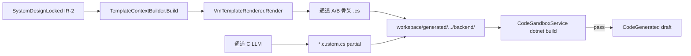
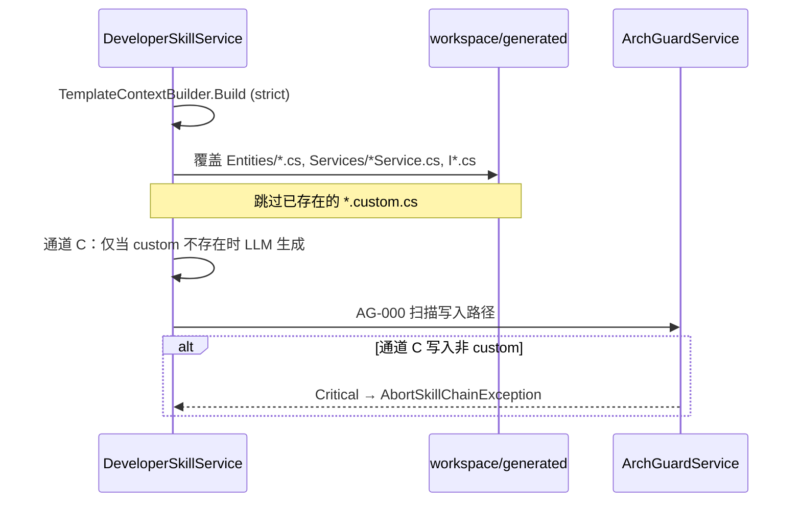

# 代码生成 Partial Class 物理隔离策略（A1）

> ⚠️ **R12 三元组适配声明（2026-07-07 追加）：** 本文档涉及的所有生成物路径 MUST 四层 `StudioWorkspace/{tenantId}/{projectId}/{pipelineId}/generated/`（R12 Layer 4）。详见 `.cursor/rules/triple-key-iron-law.mdc`（宪法级，永远生效）。

> 文档编号：12-附 | 版本：v1.0 | 阶段四 D2 阻断项  
> 上级：[`12、全链条第四阶段开发计划.md`](./12、全链条第四阶段开发计划.md) §4.1、§4.6  
> 关联：`Ir2CodegenContext` · `VmTemplateRenderer` · `ArchGuardService` · `CodeSandboxService`

---

## 0. 文档目的

**回答一个问题：** `.vm` 生成的骨架与用户/LLM 扩展代码的边界在哪里？重跑 developer-skill 时哪些文件会被覆盖、哪些必须保留？

**不回答：** DeveloperSkillService 实现细节（D4 起）、Vue 页面生成（阶段五）。

---

## 1. 三通道落盘总览

| 通道 | 产出 | 写入路径 | 重生成策略 | LLM |
|---|---|---|---|---|
| **A** | Entity / DTO 骨架 | `Entities/*.cs` | **整文件覆盖** | 否 |
| **B** | Service / IService 骨架 | `Services/*Service.cs`、`Interfaces/I*Service.cs` | **整文件覆盖** | 否 |
| **C** | 业务方法体 | **仅** `Services/*Service.custom.cs` | **永不覆盖** | 是（maxCalls=5） |



---

## 2. 目录约定（唯一合法树）

根路径（gitignore）：

```
StudioWorkspace/{tenantId}/{projectId}/{pipelineId}/generated/backend/    （R12 四层路径，2026-07-07 修订）
├── Entities/
│   └── {ClassName}Entity.cs              ← 通道 A，[GeneratedCode]
├── Entitys/Dto/{ClassName}/              ← 通道 A，.vm 渲染（CrInput 等）
├── Interfaces/
│   └── I{ClassName}Service.cs            ← 通道 B，[GeneratedCode]
└── Services/
    ├── {ClassName}Service.cs             ← 通道 B，[GeneratedCode] partial class 声明
    └── {ClassName}Service.custom.cs      ← 通道 C ONLY；Harness 白名单路径
```

**类与方法索引：**

| 步骤 | 类 | 方法 | 说明 |
|---|---|---|---|
| 构建上下文 | `TemplateContextBuilder` | `Build(IrSnapshot, Ir2CodegenBuildOptions)` | 严格模式缺片段 → `TemplateContextBuildException`（API 层 `Oops.Bah`） |
| 渲染 | `VmTemplateRenderer` | `Render(templateId, Ir2CodegenContext)` | 每 artifact 一次 ViewEngine |
| 落盘 | `DeveloperSkillService` 【D4】 | `WriteGeneratedFilesAsync(...)` | 仅写上表路径 |
| 通道 C | `DeveloperSkillService` 【D4】 | `AppendCustomPartialAsync(...)` | 仅 `*.custom.cs` |
| 门禁 | `ArchGuardService` | `ScanAsync(workspacePath)` | 读 `arch-guard-rules.yaml`，AG-000 |

模板根：`backend/application/JNPF.API.Entry/wwwroot/Template/`  
锁定模板 ID：见 `VmTemplateIds.LockedBackendTemplates`（`1-SingleTable/Entity.cs.vm` 等）。

---

## 3. 文件级策略（覆盖 vs 保留）

### 3.1 全量覆盖（通道 A/B）

| 文件模式 | partial | 文件头标记 | IR-2 变更后 |
|---|---|---|---|
| `Entities/{Name}Entity.cs` | 否（单一类） | `// <auto-generated>` | 整文件重生成 |
| `Interfaces/I{Name}Service.cs` | 否 | 同上 | 整文件重生成 |
| `Services/{Name}Service.cs` | **是**（`partial class`） | 同上 + `[GeneratedCode]` | 整文件重生成 |
| `Entitys/Dto/**` | 否 | 同上 | 整文件重生成 |

**禁止：** 在以上文件中手写业务逻辑、在 `#region UserCode` 内嵌用户代码（**不采用** `#region UserCode` 保护策略——见 §4）。

### 3.2 永不覆盖（通道 C）

| 文件 | 规则 |
|---|---|
| `Services/{Name}Service.custom.cs` | developer-skill **创建一次**；后续 run **跳过 Write** |
| 命名 | 必须与 `{Name}Service.cs` 中 `partial class {Name}Service` 同名 |
| 命名空间 | 与基座 Service 一致：`JNPF.{NameSpace}` |

**custom 文件头模板：**

```csharp
// <manual-code channel="C" do-not-regenerate="true">
namespace JNPF.OaLeave;

public partial class LeaveRequestService
{
    // LLM 或用户扩展的方法体
}
```

### 3.3 宿主工程合并（P4-B06 / A6）

| 阶段 | 动作 | 脚本/类 |
|---|---|---|
| sandbox build | 仅 `workspace/generated/...` 内 csproj | `CodeSandboxService.ValidateBuildAsync` |
| 宿主 demo | 复制/链接到 `workspace/codegen-host-demo/Modules/Generated/` | `scripts/codegen-inject-host.mjs` |
| 合并原则 | **custom.cs 与 generated 一并注入**；宿主不得单独编译仅骨架 | DoD D10 |

---

## 4. 为何不用 `#region UserCode`

| 方案 | 问题 |
|---|---|
| `#region UserCode` 内嵌 | `.vm` 重渲染时 Razor 引擎整文件输出，region 无法可靠 merge |
| Git merge driver | 运维成本高，AI 流水线不可预期 |
| **独立 `*.custom.cs` partial** | 与 C# 编译模型一致；ArchGuard AG-000 可路径白名单 |

**裁决：** 唯一合法用户/LLM 扩展载体 = `*.custom.cs`。

---

## 5. 重跑 developer-skill 时的行为



| 场景 | 行为 |
|---|---|
| IR-2 DDL 增列 | 重渲染 Entity + Service 骨架；**custom 不动** |
| IR-2 改表名 | 骨架文件名可能变；**旧 custom 需人工迁移**（ArchGuard-W02 警告） |
| 通道 C 重复 run | 若 custom 已存在 → **不调用 LLM**，日志 `custom-already-present` |
| 用户删除 custom | 下次 run 可重新 LLM 生成（受 budget 约束） |

---

## 6. IR-3 `CodeGenerated` payload 契约（含 TemplateVersion）

**事件类型：** `CodeGenerated` · **FragmentType：** `IR3_GeneratedCode` · **初始 stability：** `draft`

**Payload 必填字段（D4 实现）：**

```json
{
  "context": "https://schema.jnpf.ai/ir/v1",
  "stabilityState": "draft",
  "artifactRoot": "StudioWorkspace/{tenantId}/{projectId}/{pipelineId}/generated/backend",  // R12 四层路径
  "templateVersions": [
    {
      "templateId": "1-SingleTable/Entity.cs.vm",
      "sha256": "3dd6e30e336aa2a3...",
      "renderedPath": "Entities/LeaveRequestEntity.cs"
    }
  ],
  "syntaxCheck": { "passed": true, "validator": "CodegenSyntaxValidator" },
  "sandboxBuild": { "passed": false, "note": "promote 前由 CodeSandboxService 更新" }
}
```

| 字段 | 来源 |
|---|---|
| `templateVersions[].sha256` | 与 `TemplateRenderSamples/expected-hashes.json` 同算法；**模板或 Ir2CodegenContext 变更必须更新 hash** |
| `syntaxCheck` | `CodegenSyntaxValidator.EnsureValidSyntax`；失败 → `CodegenFailed`，**不** 进入 sandbox |
| promote stable | 仅 sandbox build + arch critical=0 后 `CodeGeneratedStablePromoted` |

**阶段五回溯：** 部署脚本校验 `templateVersions` 与当前 `expected-hashes.json` 一致，否则拒绝 promote 到生产。

---

## 7. 与 ArchGuard / Tester 的边界

| 组件 | 职责 | 不做什么 |
|---|---|---|
| `CodegenSyntaxValidator` | Roslyn 语法树 | 不替代 build |
| `CodeSandboxService` | `dotnet build` | 不扫描架构 |
| `ArchGuardService` | `arch-guard-rules.yaml` | Critical → **不** 启动 tester |
| `TesterSkillService` | 结构化场景 | **不** 替 arch 擦屁股 |

---

## 8. 本节核心表清单

| 表 | 用途 |
|---|---|
| **AI_IR_EVENTS** | 追加 `CodeGenerated` / `CodegenFailed` / `CodeGeneratedStablePromoted` |
| **AI_IR_FRAGMENT_SNAPSHOT** | `IR3_GeneratedCode` draft → stable 投影 |
| **AI_SKILL_RUN** | developer-skill run 状态；failed 时含 arch/syntax 原因 |

---

## 9. 本节关键代码路径索引

| 路径 | 说明 |
|---|---|
| `Codegen/TemplateContext/Ir2CodegenContext.cs` | 强类型上下文 |
| `Codegen/TemplateContextBuilder.cs` | IR-2 → Context；`StrictMode` |
| `Codegen/VmTemplateRenderer.cs` | .vm 渲染 |
| `Codegen/CodegenSyntaxValidator.cs` | 语法门禁 |
| `Codegen/arch-guard-rules.yaml` | AG 规则唯一配置源 |
| `Codegen/VmTemplateIds.cs` | 锁定 3 模板 |
| `tests/.../TemplateRenderSamples/` | Hash 快照契约 |
| `DeveloperSkillService.cs` | 【D4 新建】 |

---

## 10. 验收检查（A1 DoD）

- [ ] 本文档经架构师签字
- [ ] `ArchGuardService` 实现读取 `arch-guard-rules.yaml` 时引用本文 §2 路径白名单
- [ ] `DeveloperSkillService` PR 描述必须链接本文
- [ ] Hash 变更 CI：`dotnet run -- generate-hashes` + 提交 `expected-hashes.json`

---

**签字：** _______________  **日期：** _______________
