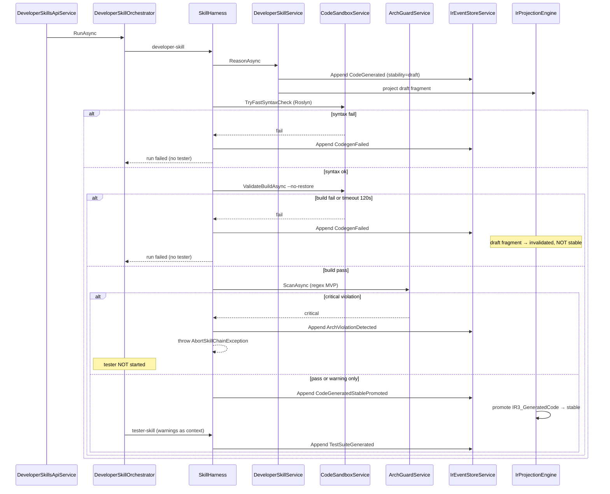
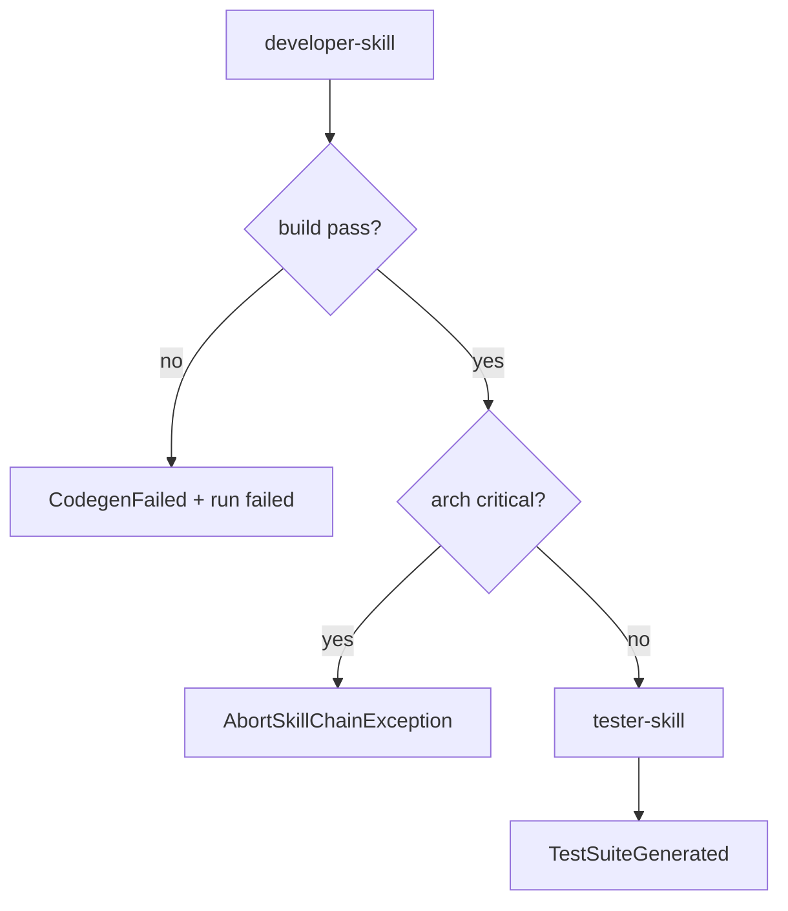

# 全链条第四阶段开发计划

> 文档编号：12 | 版本：**v2.1（节奏校准版）** | 基准周期：**D0-D3 缓冲 3d + D4-D16 冲刺 13d**（共 16 工作日）  
> **v2.1 变更（2026-07-04）：** D0-D2 阻断项已交付并压缩完成；§3/§8/§12 按实际进度与架构审判路线图重排；A5 sandbox 门禁拆为「Roslyn ✅ / dotnet build → D3」  
> 上级总体计划：[`7、skills构建方案.md`](./7、skills构建方案.md) §2 阶段四  
> 前置依赖：[`11、全链条第三阶段开发计划.md`](./11、全链条第三阶段开发计划.md) D6/D7/D10 + IR-2 `SystemDesignLocked`；[`11-附、Phase3-实习生验收清单.md`](./11-附、Phase3-实习生验收清单.md) 导师签字  
> 后续文档：[`13、全链条第五阶段开发计划.md`](./13、全链条第五阶段开发计划.md)  
> **v2.0 变更：** 融合架构/工程/质量/风险双线审核意见；修正 DAG/事件时序/估时/模板契约/ArchGuard 降级方案  
> **实习生 SOP：** [`12-附、Phase4-实习生验收清单.md`](./12-附、Phase4-实习生验收清单.md)（D8–D16 验收 / 证据采集）

---

## 文档索引

| 章节 | 内容 |
|---|---|
| §0 | 阶段定位与边界（含前端范围决策） |
| §1 | 现有资产锚点 + **TemplateContext 契约（A5）** |
| §2 | E2E 集成中枢（**含异常分支时序图 A3/A4/E4**） |
| §3 | **D0-D3 缓冲 + D4-D16 冲刺** + **§3.3 节奏校准（v2.1）** |
| §4 | 后端组件详细设计（**A1-A6 整改落盘**） |
| §5 | 数据模型 DDL（IR-3） |
| §6 | IR Schema + **投影/stability 状态机（A4/E5）** |
| §7 | Definition of Done（**D5 可复现脚本 Q2**） |
| §8 | 任务依赖图 |
| §9 | 与阶段五衔接（**宿主注入原型 A6**） |
| §10 | 风险与缓解（**R2 无循环依赖**） |
| §11 | 工程 Ticket 清单（**E3 重算**） |
| §12 | 阶段三 → 阶段四切换检查表 + **前置阻断项** |
| §13 | **整改优先级与执行时间线** |
| §15 | **六条质量生命线（NFR）— 阶段四 MUST** |

---

## 0. 阶段定位

### 0.1 审核结论与守住的亮点（不改）

**总体评价（v1.0）：B-** — 骨架可用，但存在「铁轨铺到一半」的依赖空洞。**v2.0 目标：A- 可执行。**

**必须守住的亮点：**

- IR-3 stable 门禁：**build 失败 → 不 promote stable**
- LLM 三通道：骨架 `.vm`（A/B 零 LLM）；仅方法体补全走通道 C，`maxCalls=5`
- Sandbox 隔离：`workspace/{tenant}/{project}`、120s 超时、`Kill(entireTree: true)`
- DoD 与 `phase4-dod-verify.mjs` exit 0 挂钩

### 0.2 核心策略（v2.0 修订）

> **禁止在 §13 前置阻断项未 green 前启动 D4 编码冲刺。**

| # | 交付 | 说明 |
|---|---|---|
| 1 | `developer-skill` | `.vm` → C# Entity/Service + **FormPageIR 制品 JSON**（非 Vue SFC） |
| 2 | `code-sandbox` | Roslyn 前置 + `dotnet build --no-restore` + NuGet 预还原 |
| 3 | `tester-skill` | 结构化字段确定性推导 + 自然语言 rules 走 LLM fast（Q1） |
| 4 | `arch-guard` | **正则/路径约定 MVP**（非 Roslyn）；Critical → 中断链 |
| 5 | **P4-B06** | 宿主 demo 工程注入 + 全量 `dotnet build`（A6） |
| 6 | IR-3 Schema | draft → promote stable 状态机（A4） |

### 0.3 阶段边界 — **前端范围决策（Q3）**

| 阶段四 **做** | 阶段四 **不做**（推迟阶段五） |
|---|---|
| 后端 C# codegen + sandbox | Vue SFC / 页面 `.vue` 文件生成 |
| FormPageIR → **VisualDev 可消费 JSON 制品**（mapper 雏形） | 前端 `pnpm type-check` sandbox |
| IR 观测台 **IR-3 Tab**（只读展示 + SSE） | 前端 TesterSkill E2E 场景执行 |
| 后端 ArchGuard + 租户 SQL 扫描（Q4） | Playwright 页面级 codegen 验收 |

**标题口径：** 阶段四 =「**后端 codegen + IR-3 制品**」；不再承诺「Vue 页面源码生成」。

### 0.4 其他边界

| 不做 | 留给 |
|---|---|
| Roslyn 架构分析器全量 | 阶段六 `JNPF.Analyzers` 扩展 |
| 生产部署 | 阶段五 `deploy-skill` |
| Token 四级降级 | 阶段六 |

---

## 1. 现有资产锚点

### 1.1 后端（复用，略 — 同 v1.0 §1.1）

关键新增复用：**ConstraintEngine C-001** 正则逻辑 → ArchGuard 复用，不另起炉灶。

### 1.2 代码生成边界（R3）— **模板契约冻结（A5）**

| 资产 | 路径 | v2.0 状态 |
|---|---|---|
| 后端 Service 模板 | `application/JNPF.API.Entry/wwwroot/Template/` 下 `*.vm` | **已锁定 3 ID**（`VmTemplateIds.cs`） |
| FormPageIR 映射 | `Codegen/Ir1ToFormPageArtifactMapper.cs` 【新建】 | 输出 JSON 制品，非 `.vue` |
| 生成物根目录 | `workspace/generated/{tenantId}/{projectId}/` | gitignore |
| A5 强类型上下文 | `Codegen/TemplateContext/Ir2CodegenContext.cs` | ✅ 已交付 |
| Hash 快照门禁 | `tests/.../TemplateRenderSamples/expected-hashes.json` | ✅ 9 条；模板变更须 regenerate |
| 语法门禁 | `Codegen/CodegenSyntaxValidator.cs` | ✅ Roslyn；fail → **D4** 接 `CodegenFailed` |
| dotnet sandbox build | `CodeSandboxService` | ✅ **D3-GATE** |

**TemplateContext 契约（D0-D3 — 2026-07-04 状态）：**

- C# 强类型：`Codegen/TemplateContext/Ir2CodegenContext.cs` — ✅
- JSON Schema：`openspec/specs/studio-ir/codegen-context.schema.json` — ✅
- 3 份请假 IR-2 样本 + 渲染快照 — ✅ PhaseB 23/23
- **dotnet sandbox build 通过** — ✅ D3-GATE

**VmTemplateRenderer：** JNPF ViewEngine（`.vm` 后缀，Razor 引擎）；每 artifact 一次调用。

### 1.3 前端（范围收窄）

| 组件 | 阶段四 |
|---|---|
| `IrObservatoryPanel.vue` | IR-3 Tab（事件/快照/制品路径） |
| `useDeveloperSkills.ts` | SSE + cancel；**R1 心跳** |
| Vue 页面生成 | **阶段五** |

---

## 2. E2E 集成中枢

### 图 2-1 SystemDesignLocked → IR-3 时序（**含异常分支 A3/A4/E4**）



**A4 铁律：** `CodeGenerated` 初始 **draft**；**仅** build+arch critical 清零后 `PromoteToStable`；禁止在 build 前 append stable 快照。

**A3 铁律：** ArchGuard **Critical** → `AbortSkillChainException` → Harness `run failed` → **不** 启动 tester；**Warning** 才传入 TesterSkill 上下文。

---

## 3. 执行计划（D0-D16）

### 3.1 D0-D3 缓冲期（前置阻断 — §13 🔴）

| Day | 阻断项 | 产出 | v2.1 状态 |
|---|---|---|---|
| D0-D1 | **A5** TemplateContext + 3 样本渲染 + 语法门禁 | `Ir2CodegenContext.cs` + Hash + PhaseB | ✅ **2026-07-04** |
| D1-D2 | **A1** partial class 策略 | [`12-附、codegen-partial-class.md`](./12-附、codegen-partial-class.md) | ✅ 待架构师签字 |
| D1-D2 | **Q1** TesterSkill 输入 Schema | `openspec/specs/studio-ir/tester-skill-input.schema.json` | ✅ |
| D2-D3 | **A2** ArchGuard 规则表 | `Codegen/arch-guard-rules.yaml` | ✅ yaml + **ArchGuardService → D6** |
| **D3** | **P4-B02 余量** sandbox dotnet build | `CodeSandboxService` + `leave-simple` Green | 🔄 **当前焦点** |

> **v2.1 校准：** 原 D0-D3 四项契约文档/代码已在 **2 个日历日** 内完成；**D3 专门留给 sandbox dotnet build**，不再与 A5 混为一谈。  
> **进入 D4 编码条件：** §12.2 四项 ✅ + **D3 leave-simple `dotnet build` exit 0** + A1 文档签字。

### 3.2 D4-D16 冲刺期（13 工作日 — v2.1 重排）

> 相对 v2.0 的主要调整：**Sandbox 提前到 D3**（Developer 主链依赖 build 验证）；**ArchGuard 实现与 Tester 紧随 Developer 骨架**（D6-D8），**宿主注入仍守 D10**；末尾保留 2d 联调缓冲。

| 段 | Day | Ticket | 交付 | 依赖 |
|---|---|---|---|---|
| 缓冲收口 | **D3** | P4-B02 | `CodeSandboxService` MVP · `scripts/codegen-init-workspace.ps1` · `leave-simple` build | A5 ✅ |
| **D4** | **P4-B01a** `DeveloperSkillService` | ✅ | 落盘 + CodeGenerated draft + templateVersions |
| W7 | **D5** | P4-B01b | `DeveloperSkillOrchestrator` + sandbox build 链 | ✅ PhaseB 26/26 |
| W7 | **D6** | P4-B04a | `ArchGuardService` 读 yaml · AG-000～003 · Warning 透传 Tester | ✅ PhaseB 27/27 |
| W8 | **D7** | P4-B05 | `IrProjectionEngine` draft/promote/invalidated · `CodeGeneratedStablePromoted` | ✅ PhaseB 28/28 |
| W8 | **D8-D9** | P4-B03 | `TesterSkillService` · leave-with-flow **≥5** 场景 · field-only 降级 | Q1 · D6 |
| W8 | **D10** | P4-B04b | `scripts/phase4-d5-arch-guard.mjs`（Q2 可复现违规模板） | D6 |
| W8-W9 | **D11-D12** | P4-B06 | `codegen-host-demo` + `codegen-inject-host.mjs` · **宿主全量 build**（D10 DoD） | D3 build |
| W9 | **D13** | P4-F01 | IR-3 Tab + SSE 30s 心跳（R1） | IR-3 事件 |
| W9 | **D14** | 联调 | **leave-simple Green path**：IR-2 locked → codegen → build → test → arch | 上述全部 |
| W9 | **D15-D16** | P4-R01 | `phase4-dod-verify.mjs` exit 0 · §12 全绿 · 文档 17 预检 | D14 |

### 3.3 节奏校准说明（v2.1 — 对照架构审判）

| 维度 | v2.0 原计划 | v2.1 调整后 | 理由 |
|---|---|---|---|
| D0-D3 | 4 天逐项缓冲 | **2 天完成契约 + 1 天 sandbox** | A5/A1/Q1/A2 已交付；避免「文档假 green」 |
| A5 sandbox | 与 TemplateContext 同日 | **拆为 Roslyn（✅）+ dotnet build（D3）** | 渲染合法 ≠ 可编译；B+ 评级挂钩 D3 |
| Developer 启动 | D4 起（阻断后） | **D4 仍起，但必须有 D3 sandbox** | 禁止在沙子上盖 `DeveloperSkillService` |
| Tester vs Arch | Tester D12 晚于 Arch D14 | **Arch D6 实现 → Tester D8** | Critical 必须先于 tester；yaml 已就绪 |
| 首次全链路 Green | 隐含 D16 | **显式 D14 里程碑** | leave-simple 端到端可演示再跑 dod |
| P4-B02 估时 | 3d 整块 | **A5 已耗 1d · 余 2d = D3+D4 联调** | Ticket 清单见 §11 |

**禁止项（节奏红线）：**

- ❌ D3 未 green 前写 `DeveloperSkillService` 主链  
- ❌ `ArchGuardService` 规则散落代码注释（**仅** `arch-guard-rules.yaml`）  
- ❌ Tester 在 Critical>0 时启动（A3）  
- ❌ 修改 `.vm` 不更新 `expected-hashes.json`  

**文档先于代码（D4 起仍有效）：** 实现 PR 必须链接 A1/Q1/A2 三份契约；`TemplateContextBuildException` → API 层 `Oops.Bah`。

---

## 4. 后端组件详细设计

### 4.1 DeveloperSkillService — **含物理隔离（A1）**

**LLM 三通道落盘策略：**

| 通道 | 产出 | 落盘 | 可变 |
|---|---|---|---|
| A/B | Entity/Service 骨架 | `.vm` 渲染 `*.cs`，文件头 `// <auto-generated>` | **不可变**；IR-2 变更 → 整文件重生成 |
| C | 业务方法体 | **仅** `*.custom.cs`（`partial class`） | 可保留；重生成基座不覆盖 custom |

**目录约定：**

```
workspace/generated/{tenant}/{project}/backend/
  ├── Entities/{EntityName}.cs          ← .vm [GeneratedCode]
  ├── Services/{Module}Service.cs     ← .vm [GeneratedCode]
  └── Services/{Module}Service.custom.cs ← 通道 C ONLY；Harness 校验禁止写其他路径
```

**.csproj 包含：** `Codegen/HostProjectTemplate/*.csproj` 模板内 `<Compile Include="**\*.cs" />` + explicit custom。

**ArchGuard 最高优先级规则 AG-000：** 检测到对非 `*.custom.cs` 的通道 C 写入 → **Critical**，`AbortSkillChainException`。

**ValidateInput / ReasonAsync：** 同 v1.0，但 `CodeGenerated` 事件 payload 含 `stabilityState: "draft"`。

### 4.2 CodeSandboxService — **E1/E2 拆解**

**入口：**

```
ValidateBuildAsync(path, ct)
  → TenantPipelineQuotaGuard.TryAcquire(tenant, pipeline)  // E2
  → TryFastSyntaxCheckAsync (Roslyn SyntaxTree parse all .cs)  // E1 前置
  → if fail → return without dotnet
  → WorkspaceInitAsync: 首次 nuget restore 到 workspace/.nuget（一次性）
  → dotnet build {csproj} --no-restore /p:Restore=false
  → JobObject memory limit + CPU affinity  // E2 【Windows Job API】
  → timeout 120s；finally 清理 obj/bin 中间目录（磁盘配额）
```

**NuGet：** 初始化脚本 `scripts/codegen-init-workspace.ps1` 预还原 JNPF 框架包。

### 4.3 TesterSkillService — **Q1 结构化输入**

**输入 Schema（`tester-skill-input.schema.json`）：**

| 字段来源 | 结构化程度 | 推导方式 |
|---|---|---|
| `IR1_EventSpec.confirmedFields[]` | **强结构** | 确定性：必填/null/类型边界 |
| `IR1_EventSpec.businessRules[]` | `source=seed-data` → 结构；`source=inferred` → **LLM fast** | 自然语言 rules：`tester-skill` maxCalls=2 |
| `IR2_SystemDesign.stateMachines[]` | **v2.0 扩展** | 见下 |
| ArchGuard warnings | 上下文 | 写入 TestSuite metadata |

**状态机缺口（Q1）：** 阶段四扩展 `SystemDesignLocked` payload 可选字段 `stateMachines[]`；若缺失 → Tester 仅跑字段级场景，**不**声称状态转移覆盖（DoD D4 降级为 ≥3 场景）。

**输出：** `TestSuiteGenerated`（stable）；**不**替代 ArchGuard 合规职责。

### 4.4 ArchGuardService — **A2 降级 + A3 阻断**

**阶段四范围：** 正则 + 路径约定；**不**新建 Roslyn Analyzer 项目（推迟阶段六，可复用 `tools/JNPF.Analyzers` 【待源码验证】）。

**规则表（`arch-guard-rules.yaml`）：**

| ID | 检测 | 级别 |
|---|---|---|
| AG-000 | 通道 C 写入非 `.custom.cs` | **Critical** |
| AG-001 | `.cs` 内容 `REFERENCES.*Controller`（DDL 目录） | Critical（同 C-001） |
| AG-002 | Service 文件无 `ITenantFilter`/`Tenant` 相关 using+过滤模式 | Critical |
| AG-003 | 生成 SQL 字符串无 `F_TenantId` / `@TenantId` | Critical（Q4） |
| AG-W01 | 命名空间未含模块前缀 | Warning → 传 Tester |

**Critical > 0：** `AbortSkillChainException` — **禁止** `tester-skill` 启动。

### 4.5 DeveloperSkillOrchestrator — **DAG（A3 修正）**



**删除 v1.0 错误描述：** tester **不再**「读 ArchViolation 写 FAILED 替 arch 擦屁股」。

### 4.6 TemplateContextBuilder + VmTemplateRenderer（A5）

**类：** `Codegen/TemplateContextBuilder.cs` → `Ir2CodegenContext`  
**方法：** `Build(IrSnapshot snapshot) → Ir2CodegenContext`  
**渲染：** `VmTemplateRenderer.Render(templateId, context) → string`

**门禁测试：** `TemplateRenderSamplesTests` — 3 IR-2 样本 → 输出 hash 快照 + sandbox build。

### 4.7 宿主工程注入原型（A6 / P4-B06）

**脚本：** `scripts/codegen-inject-host.mjs`  
**宿主：** `workspace/codegen-host-demo/JNPF.Codegen.HostDemo.csproj` 【新建】  
**流程：** 将 `workspace/generated/{tenant}/{project}/backend/` 链接/复制进宿主 `Modules/Generated/` → `dotnet build` 全解决方案  
**D10 DoD：** 宿主 build exit 0（非仅 sandbox 子 csproj）。

---

## 5. 数据模型 DDL

同 v1.0；补充 **ai_projects.F_CodegenHostVerifiedAt** 【可选列】记录宿主 build 通过时间。

---

## 6. IR Schema 与投影策略（A4 / E5）

### 6.1 事件与 stability

| 事件 | FragmentType | 初始 stability | 终态 |
|---|---|---|---|
| `CodeGenerated` | `IR3_GeneratedCode` | **draft** | promote → stable |
| `CodegenFailed` | `IR3_GeneratedCode` | draft | **invalidated**（保留事件，快照标记 invalidated） |
| `CodeGeneratedStablePromoted` | `IR3_GeneratedCode` | — | 触发 promote |
| `ArchViolationDetected` | `IR3_ArchReport` | n/a | 审计事件；**不**参与 Rebuild 快照树 |
| `TestSuiteGenerated` | `IR3_TestSuite` | stable | — |

### 6.2 投影策略（E5）

- **Rebuild：** 全量重放 **ai_ir_events**（与阶段一一致）；IR-3 promote 由事件类型驱动，非增量 diff MVP
- **draft 生命周期：** `CodegenFailed` 后 snapshot.stabilityState=`invalidated`；保留 30 天供审计，Rebuilder 跳过 invalidated 作为当前态
- **ArchViolationDetected：** 仅 **ai_ir_events** 审计；**不** upsert fragment snapshot（避免 stability="—" 污染 Rebuild）

**IrProjectionEngine 改造点：** `ProjectEventAsync` 增加 `CodeGenerated`→draft、`Promote` handler、`ArchViolationDetected`→no-op snapshot。

---

## 7. Definition of Done（修订）

| # | 条款 | 预期 | 验证 |
|---|---|---|---|
| D1 | developer 触发 | `CodeGenerated` draft 存在 | API |
| D2 | `.vm` + partial | 基座 `.cs` + 可选 `.custom.cs` | 目录检查 |
| D3 | sandbox | Roslyn + build pass → **promote stable** | 日志 |
| D4 | tester | ≥3 结构化场景（有 stateMachine 则 ≥5） | IR-3 Tab |
| D5 | arch-guard | **预置违规模板** `templates/_violations/ag001/` → Critical → **无 tester** | `scripts/phase4-d5-arch-guard.mjs`（Q2） |
| D6 | 租户 | workspace + SQL 扫描 | phase4-dod |
| D7-D9 | NFR | §15 | 脚本+日志 |
| D10 | **宿主 build** | inject-host 全工程 exit 0 | P4-B06 |
| D11-D20 | 质量红线 | phase4-dod-verify | exit 0 |

**D5 可复现步骤（Q2）：**

```powershell
# 1. 使用违规模板 profile 跑 developer
node scripts/phase4-d5-arch-guard.mjs --profile ag001-ddl-controller-ref
# 2. 断言：developer run failed；无 TestSuiteGenerated；ArchViolationDetected 存在
# 3. profile ag002-no-tenant-filter 同理
```

---

## 8. 任务依赖图（v2.1）

```
[D0-D2 阻断 ✅] A5 + A1 + Q1 + A2(yaml)
    ↓
[D3 🔄] P4-B02 CodeSandbox dotnet build (leave-simple)
    ↓
P4-B01a DeveloperSkill 落盘 + CodeGenerated draft + templateVersions
    ↓
P4-B01b Orchestrator + AbortSkillChain + CodegenFailed/Syntax
    ↓
P4-B04a ArchGuardService ← arch-guard-rules.yaml
    ↓
P4-B05 IR-3 projection promote/invalidated
    ↓
P4-B03 TesterSkill (Q1 schema)
    ↓
P4-B04b phase4-d5-arch-guard.mjs (Q2)
    ↓
P4-B06 Host inject + full build (A6)  ← D11 硬门禁
    ↓
P4-F01 IR-3 Tab + SSE heartbeat (R1)
    ↓
[D14] leave-simple Green path 联调
    ↓
P4-Q01 phase4-dod-verify.mjs
```

> **v2.1 修正：** P4-B02 的 TemplateContext/VmRenderer/Hash **已完成（A5）**；图中 P4-B02 仅指 **Sandbox E1/E2 余量**。

---

## 9. 与阶段五衔接

| 阶段五需要 | 阶段四交付 |
|---|---|
| 可合并进主库的代码 | **宿主 demo 已验证** 的 generated 树 + inject 脚本 |
| 测试基线 | IR-3 TestSuite |
| Vue 页面源码 | FormPageIR JSON → 阶段五 mapper + 前端 sandbox |

---

## 10. 风险与缓解（R2 修正 — 无循环依赖）

| 风险 | 缓解（v2.0） |
|---|---|
| `.vm` 与 IR-2 字段漂移 | **TemplateContext 强类型 + 编译期测试**（不依赖 arch-guard） |
| sandbox 首次 restore 超 120s | NuGet 预还原 + `--no-restore` + Roslyn 前置过滤 |
| LLM 通道 C 覆盖基座 | AG-000 + 仅 `.custom.cs` |
| 缓解措施依赖未就绪组件 | **已删除**「用 arch-guard 防漂移」类循环引用 |

---

## 11. 工程 Ticket 清单（E3 重算）

| Ticket | 标题 | v2 估时 | **v2.1 剩余** | 备注 |
|---|---|---|---|---|
| P4-L01 | SystemDesignLockedCompletenessGate | 0.5d | 0.5d | D4 与 Developer 并行 |
| P4-B01 | Developer + Orchestrator + AbortSkillChain | 2.5d | **2d** | 拆 D4/D5 |
| P4-B02 | ~~TemplateContext~~ + Sandbox E1/E2 | 3d | **2d** | A5 已闭合 ~1d |
| P4-B03 | TesterSkill + input schema | 1.5d | 1.5d | Q1 schema ✅ |
| P4-B04 | ArchGuard regex + D5/Q4 脚本 | 0.5d | 0.5d | yaml ✅ |
| P4-B05 | IR-3 projection promote | 0.5d | 0.5d | |
| **P4-B06** | **宿主注入 + 全工程 build** | 1.5d | 1.5d | D11 |
| P4-F01 | IR-3 Tab + SSE heartbeat | 1d | 1d | |
| P4-R01 | NFR + phase4-dod-verify | 1d | 1d | D15-D16 |
| **缓冲** | D3 收口 + D14-D16 联调 | 5d | **4d** | D0-D2 节省 1d |
| **合计** | | ~16d | **~15d 剩余** | 自 D3 起计 |

---

## 12. 切换检查表

### 12.1 阶段三完成项

| 检查项 | 状态 |
|---|---|
| 阶段三 D6 SystemDesignLocked | ☐ |
| Phase3 DDL + phase3-dod 9/9 | ☐ |
| 实习生 11-附 导师签字 | ☐ |
| 实习生 **12-附** D8–D16 证据 + 导师签字 | ☐ |

### 12.2 🔴 阶段四前置阻断（D0-D3 — 未完成不得 D4 编码）

| 编号 | 项 | 状态 | 备注 |
|---|---|---|---|
| A5 | TemplateContext + 3 样本 + 语法门禁 | ✅ | Hash 9/9 · **dotnet build → D3-GATE ✅** |
| A1 | partial class 策略文档 | ✅ | [`12-附、codegen-partial-class.md`](./12-附、codegen-partial-class.md) · **待签字** |
| Q1 | TesterSkill input schema | ✅ | `openspec/specs/studio-ir/tester-skill-input.schema.json` |
| A2 | arch-guard-rules.yaml | ✅ | `Codegen/arch-guard-rules.yaml` + `ArchGuardService.cs` |
| **D3-GATE** | leave-simple sandbox `dotnet build` | ✅ | PhaseB `sandbox-gate` + `phase4-d3-sandbox-gate.mjs` exit 0 |

### 12.3 阶段四编码放行条件（v2.1）

| # | 条件 | 状态 |
|---|---|---|
| G1 | §12.2 四项契约 ✅ | ✅（A1 签字待办） |
| G2 | D3 sandbox build exit 0 | ✅ |
| G3 | 阶段三 §12.1 三项（含实习生签字） | ☐ |
| G4 | `phase3-dod-verify.mjs` 9/9 | ✅（2026-07-04 基线） |

**放行判决：** G1+G2 **同时** green → 可启动 **D4 P4-B01a**；G3 不阻塞 D4 编码，但阻塞 **D16 阶段验收**。

---

## 13. 整改优先级与执行时间线

| 优先级 | 编号 | 时间窗口 | v2.1 状态 |
|---|---|---|---|
| 🔴 阻断 | A5, A1, Q1, A2 | D0-D2 | ✅ 契约已落盘 |
| 🔴 阻断 | **D3 sandbox build** | D3 | ✅ D3-GATE green |
| 🟡 冲刺 | P4-B01 Developer 链 | D4-D5 | **可启动（待 A1 签字）** |
| 🟡 冲刺 | P4-B04 ArchGuard 实现 | D6-D10 | yaml 就绪 |
| 🟡 冲刺 | P4-B03 Tester | D8-D9 | schema 就绪 |
| 🟡 冲刺 | A3, A4, E1, Q2, Q4 | D4-D14 | |
| 🟢 建议 | E2, E4, Q3, A6, E5, R1, R2 | 已写入正文 | |

**最终判决（v2.1）：** D3-GATE green + A1 签字 → 启动 D4；D16 验收 = `phase4-dod-verify.mjs` exit 0 **且** 宿主全量 build pass **且** D14 Green path 可复现。

---

## 15. 六条质量生命线（v2.0 增量）

| # | v2.0 关键增量 |
|---|---|
| **1 日志** | 异常链分支各写 phase：`SyntaxCheckFail`/`BuildFail`/`ArchAbort`/`PromoteStable` |
| **2 边界** | AG-000；AbortSkillChain；draft≠stable |
| **3 性能** | Roslyn 前置；`--no-restore`；预还原；模板批渲染评估 |
| **4 内存** | QuotaGuard 入 Sandbox；Job memory limit；SSE **30s ping + max 30min 存活（R1）**；`beforeunload` abort |
| **5 隔离** | Q4：`phase4-dod` SQL 扫描 + SqlSugar 拦截器告警无 tenant 查询 |
| **6 LLM** | 通道 C 仅 `.custom.cs`；tester 自然语言 rules 走 fast tier |

### 15.6 租户 SQL 自动化（Q4）

- `ArchGuard AG-003` 扫描生成 `.cs` 中 SQL 字符串
- `phase4-dod-verify.mjs` 步骤 `scanGeneratedSqlForTenantFilter`
- SqlSugar：`Aop.OnLogExecuting` 告警缺失 tenant 条件 【配置项 `Studio:WarnSqlWithoutTenant`】

---

## 本节核心表清单

- **ai_ir_events** / **ai_ir_fragment_snapshots** / **ai_projects** / **ai_skill_runs** / **ai_skill_llm_policy** / **BASE_AI_CALL_LOG**

## 本节关键代码路径索引

- `SkillHarness.cs` — 捕获 `AbortSkillChainException`
- `IrProjectionEngine.cs` — draft/promote/invalidated
- `SkillLlmBudgetGuard.cs` / `TenantPipelineQuotaGuard.cs`
- `ConstraintEngineService.cs` — C-001 正则复用
- `tools/JNPF.Analyzers/` 【待源码验证 — 阶段六】
- `Codegen/TemplateContext/Ir2CodegenContext.cs` — ✅ A5
- `Codegen/arch-guard-rules.yaml` — ✅ A2 yaml
- `docs/.../12-附、codegen-partial-class.md` — ✅ A1
- `openspec/specs/studio-ir/tester-skill-input.schema.json` — ✅ Q1
- `Ir/IrProjectionEngine.cs` — ✅ D7 promote stable
- `Codegen/ArchGuardService.cs` — ✅ D6 读 yaml · AG-000～003
- `Skills/DeveloperSkillOrchestrator.cs` / `Codegen/DeveloperCodegenSandboxGate.cs` — ✅ D5
- `Skills/DeveloperSkillService.cs` — ✅ D4
- `Codegen/CodeSandboxService.cs` / `CodegenWorkspaceWriter.cs` — ✅ D3
- `scripts/codegen-init-workspace.ps1` / `scripts/phase4-d3-sandbox-gate.mjs` — ✅ D3
