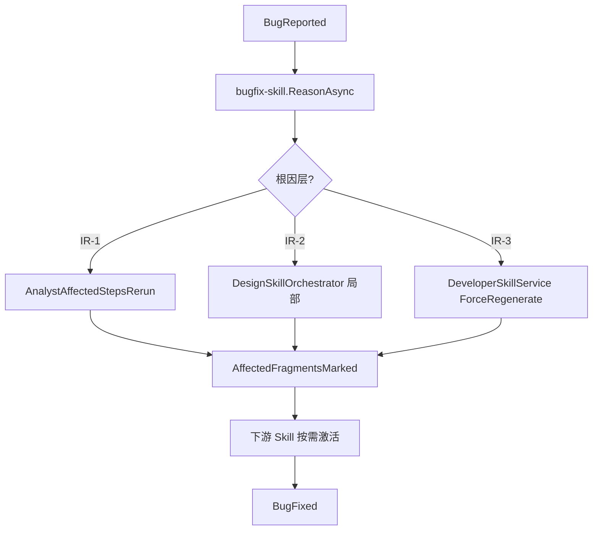

# 全链条第五阶段开发计划

> 文档编号：13 | 版本：v1.0 | 周期：W9-W10（10 个工作日）  
> 上级：[`7、skills构建方案.md`](./7、skills构建方案.md) §2 阶段五  
> 前置：[`12、全链条第四阶段开发计划.md`](./12、全链条第四阶段开发计划.md) IR-3 stable + build 通过  
> 后续：[`14、全链条第六阶段开发计划.md`](./14、全链条第六阶段开发计划.md)

---

## 0. 阶段定位

**核心问题：** IR-3 制品能否一键部署验证，且 Bug 修复只重算受影响 IR 片段（事件溯源），两租户并行无串味？

**交付：** `deploy-skill`、`bugfix-skill`、`ir-diff-engine`、全链路 E2E 套件（请假审批）。

### 0.1 组件清单

| 组件 | 路径（规划） | 职责 |
|---|---|---|
| `deploy-skill` | `Skills/DeploySkillService.cs` | 发布验证 + `DeploymentVerified` 事件 |
| `bugfix-skill` | `Skills/BugfixSkillService.cs` | `BugReported` → 根因定位 → 增量重算 |
| `ir-diff-engine` | `Ir/IrDiffEngine.cs` | 片段 diff → `AffectedFragmentsMarked` |
| `e2e-integration-tests` | `scripts/phase5-fullchain-e2e.mjs` | 单 projectId 全链路 |

### 0.2 阶段边界

| 不做 | 留给 |
|---|---|
| Token 四级降级 | 阶段六 |
| Eval / 人工抽检 | 阶段七 |
| 10 Skill 齐备交付 | 阶段八 |

---

## 1. 资产锚点

| 已有 | 用法 |
|---|---|
| `IrEventStoreService.AppendAsync` | Bug 修复只追加事件，不删历史 |
| `EventSpecRevisionPlanner` | 影响 SA 步骤裁剪模式复用于 diff |
| `AnalystAffectedStepsRerunService` | IR-1 层重跑模板 |
| `DesignSkillOrchestrator` | IR-2 层局部重算入口 |
| `start-dev.ps1` / Docker compose | deploy 验证环境 |

---

## 2. Bug 修复事件流（图 2-1）

---

## 3. 冲刺计划（W9-W10）

| Day | 交付 |
|---|---|
| D1-D2 | `IrDiffEngine` + 单元测试 |
| D3-D4 | `BugfixSkillService` + API |
| D5-D6 | `DeploySkillService` + 部署验证脚本 |
| D7-D8 | `phase5-fullchain-e2e.mjs` |
| D9-D10 | DoD D1-D20 + 文档 17 预检 |

---

## 4. 后端设计要点

### 4.1 IrDiffEngine

**方法：** `IrDiffEngine.CompareAsync(projectId, tenantId, fromVersion, toVersion)`  
**输出：** `IrDiffResult`（`added[]` / `changed[]` / `invalidated[]` fragmentId）  
**边界：** 空 diff → 不触发重算；locked 片段 default 不 invalidate unless `ForceUnlock` flag 【导师审批】

### 4.2 BugfixSkillService

**ValidateInput：** 存在 `BugReported` 或 API 传入 `bugPayload`  
**ReasonAsync 步骤：**

1. 查询 **ai_ir_events** 按 fragmentId 关联
2. 分类根因层（规则表 + 可选 LLM fast tier **经 Guard**）
3. Append `BugRootCauseLocated`、`AffectedFragmentsMarked`
4. 调用对应 Rerun 服务（**不**全链路重跑）

### 4.3 DeploySkillService

**输入：** IR-3 GeneratedCode stable + TestReport pass  
**动作：** 调用现有 Docker/脚本 【待源码验证 `docker-compose.production.yml`】  
**输出：** `DeploymentVerified` / `DeploymentFailed`

---

## 5. DDL

**文件：** `Migrations/20260829_Phase5_Deploy_Bugfix.sql`

- **ai_projects** 扩展：`F_DeploymentVerifiedAt`、`F_LastBugfixAt`
- **ai_skill_llm_policy** 种子：`deploy-skill`(maxCalls=1)、`bugfix-skill`(maxCalls=3, fast)

---

## 6. DoD（D1-D20 摘要）

| # | 条款 | 预期 |
|---|---|---|
| D1 | 全链路单 project | PM→…→Deploy 事件连续 |
| D2 | 时间旅行 | Rebuild 任意 sequence 快照正确 |
| D3 | 字段级 Bug | 只重算 db+dev+test；arch/ui IR 不变 |
| D4 | 双租户 | 两 project 事件流 Trace 独立 |
| D5-D20 | 六条 NFR | §15 + `phase5-dod-verify.mjs` |

---

## 7. Ticket 清单

| Ticket | 估时 |
|---|---|
| P5-B01 IrDiffEngine | 1.5d |
| P5-B02 BugfixSkillService | 2d |
| P5-B03 DeploySkillService | 1.5d |
| P5-Q01 fullchain E2E | 1d |
| P5-R01 NFR 自检 | 1d |

---

## 15. 六条质量生命线（阶段五 MUST）

| # | 维度 | 阶段五增量 |
|---|---|---|
| **1 日志** | Bug 链路每步 `LogPhase`：`RootCauseLocate`/`DiffCompute`/`RerunPlan`/`DeployVerify` |
| **2 边界** | 无根因不 append BugFixed；deploy 失败不 mark verified；diff 空集拒绝 rerun |
| **3 性能** | Diff 1000 事件 <500ms；Bugfix 重算范围 ≤3 个 Skill |
| **4 内存** | 全链路 E2E 脚本串行 pipeline，不并行泄漏 EventSource |
| **5 隔离** | Bugfix 只读同 tenant project；Rerun 禁止跨 tenant 调 Orchestrator |
| **6 LLM** | bugfix 根因推断 maxCalls=3 fast；deploy-skill **零 LLM** |

**本节核心表清单：** **ai_ir_events**、**ai_ir_fragment_snapshots**、**ai_projects**、**ai_skill_runs**

**本节关键代码路径索引：** `IrEventStoreService.cs`、`AnalystAffectedStepsRerunService.cs`、`DesignSkillOrchestrator.cs`
