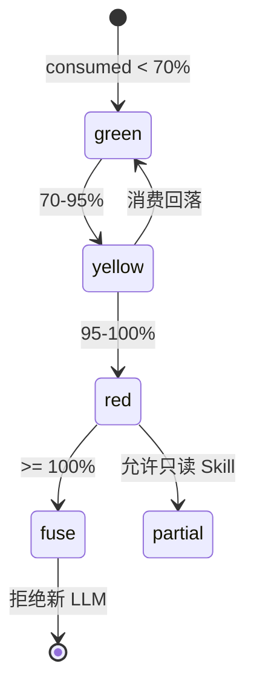

# 全链条第六阶段开发计划

> 文档编号：14 | 版本：v1.0 | 周期：W11-W12（10 个工作日）  
> 上级：[`7、skills构建方案.md`](./7、skills构建方案.md) §2 阶段六  
> 前置：[`13、全链条第五阶段开发计划.md`](./13、全链条第五阶段开发计划.md) 全链路 E2E 通过  
> 后续：[`15、全链条第七阶段开发计划.md`](./15、全链条第七阶段开发计划.md)

---

## 0. 阶段定位

**核心问题：** 10 并发 project 下 Token 可控、Trace 可追、Worker 崩溃可恢复，且 **不重复** 阶段二 §14 / Phase 2.5 已交付的 Skill-local 能力？

### 0.1 三层运行时分工（强制）

| 层级 | 文档 | 范围 |
|---|---|---|
| Skill-local | 文档 9 §14 | SkillExecutionLogger、TenantGuard、SkillRunGuard |
| Phase 2.5 | 文档 10 | TenantPipelineQuotaGuard、SkillExecutionScope |
| **平台级（本文档）** | 文档 6 | Token 四级降级、OTel、etcd 软路由、Worker 恢复 |

### 0.2 交付清单

| 加固项 | 实现类（规划） |
|---|---|
| Token Budget 四级 | `Llm/TokenBudgetTierService.cs` |
| OpenTelemetry | `Infrastructure/Telemetry/StudioActivitySource.cs` |
| etcd 软路由 | `Runtime/EtcdRouteTableSync.cs` + **ai_route_table** |
| Worker 崩溃恢复 | `Runtime/SkillWorkerRecoveryService.cs` |
| 模型路由优化 | 扩展 `LlmGatewayService` + 配置 |

---

## 1. Token Budget 四级降级（图 2-1）

**状态字段：** **ai_projects.F_LlmBudgetStatus**（已有）扩展枚举 `green|yellow|red|fuse`

**SkillLlmBudgetGuard 改造：**

- `ValidateProjectBudgetAsync` 读 tier → yellow 禁 strong tier；red 仅 fast；fuse 429
- partial result：Orchestrator 跳过 LLM Skill，SSE 推送 `BudgetDegraded`

**边界：** 原子 UPDATE 防并发超卖；tier 变更写 **ai_ir_events** `BudgetTierChanged` 审计

---

## 2. OpenTelemetry 接入

**W3C traceparent：** HTTP 入站 `JNPF.API.Entry` → `SkillHarness.RunAsync` → `SkillLlmBudgetGuard` → `LlmGatewayService`

| Span 名 | 属性 |
|---|---|
| `skill.run` | skillId, runId, projectId, tenantId |
| `llm.call` | model, promptTokens, completionTokens |
| `ir.append` | eventType, fragmentId |

**与 SkillExecutionLogger 关系：** runId 写入 Span `baggage`；**不**替换 Serilog，双写

**前端：** 不在本阶段强制；TraceId 可在 API 响应头 `X-Trace-Id` 供支持排查

---

## 3. etcd 软路由与多 Worker

**表：** **ai_route_table**（阶段一 DDL 已有）

**EtcdRouteTableSync：** 定时心跳 **ai_route_table.F_LastHeartbeat**；studio-preview 路由 【待源码验证 `GeneratedProjectService`】

**Worker 恢复：** 检测 **ai_skill_runs** `status=running` 且 `StartedAt` 超时 → mark `failed` + 可选 `ResumeFromSnapshot` 事件

---

## 4. 冲刺与 Ticket

| Ticket | 内容 | 估时 |
|---|---|---|
| P6-L01 | TokenBudgetTierService + Guard 集成 | 2d |
| P6-O01 | OpenTelemetry + ActivitySource | 2d |
| P6-R01 | etcd 心跳 + route 同步 | 1.5d |
| P6-W01 | SkillWorkerRecoveryService | 1d |
| P6-Q01 | 10 并发压测 + phase6-verify.mjs | 1.5d |

---

## 5. DoD（摘要）

| # | 预期 |
|---|---|
| D1 | 10 并发 project 无崩溃 |
| D2 | Worker kill 后从最后 stable 快照恢复 |
| D3 | 冗余工具调用 >3 次告警 【阶段七 Eval 预研】 |
| D4 | fuse 时 partial result，不中断 Harness |
| D5-D20 | §15 脚本 exit 0 |

---

## 15. 六条质量生命线（阶段六 MUST）

| # | 维度 | 阶段六增量 |
|---|---|---|
| **1 日志** | OTel Span + Serilog 关联字段 `TraceId`/`SpanId`；tier 变更审计事件 |
| **2 边界** | fuse 禁止新 LLM；recovery 不重复 append 同一 runId 成功事件 |
| **3 性能** | 10 并发 design+dev 总 Token ≤ 租户日配额；Rebuild 100 事件仍 <200ms |
| **4 内存** | Worker 进程池上限；Hangfire job 过期清理 |
| **5 隔离** | etcd route 按 tenant；recovery 只恢复同 tenant run |
| **6 LLM** | **四级降级完整落地**；strong/fast 路由按 tier 自动切换 |

**推迟明确写死：** LLM-as-Judge、Skill 排行榜 → 阶段七

**本节核心表清单：** **ai_projects**、**ai_route_table**、**ai_skill_runs**、**BASE_AI_CALL_LOG**

**本节关键代码路径索引：** `SkillLlmBudgetGuard.cs`、`LlmGatewayService.cs`、`PipelineSchedulingModule.cs`
