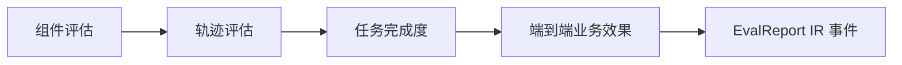

# 全链条第七阶段开发计划

> ⚠️ **R12 三元组适配声明（2026-07-07 追加）：** 本文档涉及的所有数据/路径/SkillContext MUST 携带三元组 `(tenantId, projectId, pipelineId)`。详见 `.cursor/rules/triple-key-iron-law.mdc`（宪法级，永远生效）。

> 文档编号：15 | 版本：v1.1（实施完成） | 周期：W13-W14（10 个工作日）  
> 上级：[`7、skills构建方案.md`](./7、skills构建方案.md) 阶段六加固清单延伸  
> 前置：[`14、全链条第六阶段开发计划.md`](./14、全链条第六阶段开发计划.md) Token 四级 + OTel  
> 后续：[`16、全链条第八阶段开发计划.md`](./16、全链条第八阶段开发计划.md)

---

## 0. 阶段定位

**核心问题：** 如何**可度量**地证明 10 个 Skill 产出质量达标，并建立人工抽检与自动 Eval 闭环？

本阶段 **不写新业务 Skill**，聚焦 **Eval Pipeline + 质量治理 + 记忆遗忘**。

### 0.1 交付组件（v1.1 — 实际落地路径）

| 组件 | 实际路径 | 状态 |
|---|---|---|
| Eval Pipeline 四层 | `Studio/EvalPipelineRunner.cs` + `Studio/EvalService.cs` | ✅ L1-L3 完成 |
| LLM-as-Judge | `Studio/LlmJudgeService.cs` | ✅ 经 Guard fast tier |
| Judge 校准 | `Studio/JudgeCalibrationService.cs` + `Job/EvalCalibrationJob.cs` | ✅ Cohen's kappa |
| 人工抽检通道 | `Studio/SkillReviewApiService.cs` → `BASE_AI_SKILL_REVIEW` | ✅ 双写表+IR事件 |
| Skill 质量榜 | `Studio/SkillQualityBoardService.cs` | ✅ SQL 聚合 + tier 分级 |
| 记忆遗忘 | `Studio/MemoryRetentionService.cs` | ✅ 失败 trace 回写 |
| 前端 Tab | `components/ir/IrSkillQualityTab.vue` | ✅ IR 观测台第 8 Tab |
| 验证脚本 | `scripts/phase7-eval-verify.mjs` | ✅ 23/23 通过 |

---

## 1. Eval Pipeline 四层（图 2-1）

| 层 | 输入 | 输出 | LLM | 实现 |
|---|---|---|---|---|
| L1 组件 | IR 产出 fragment（按 PipelineId+SkillId+时间窗关联） | pass/fail | 否 | `RunLayer1ComponentAsync` |
| L2 轨迹 | **ai_ir_events** 序列（分页 ≤500） | 冗余调用检测 | 否 | `RunLayer2TrajectoryAsync` |
| L3 任务 | `AiSkillRunEntity.Status` + eventCount | 完成率 | 否 | `RunLayer3TaskAsync` |
| L4 业务 | Judge pass/fail 二元 | PASS/FAIL + 理由 | 是 fast | `LlmJudgeService.JudgeAsync` |

**fail-fast：** L1 不过直接返回，不跑 L2/L3/L4（六条生命线#2 边界）

**轨迹规则：** 同一 `SkillId` 内 `skill.failure_recorded` >3 且无 IR append → 告警 `RedundantLlmLoop`；事件数 >5×IR append → `LowYieldRatio`

---

## 2. 人工抽检（P7-E03）

**流程：** 导师/QA 在 Studio 打开 Skill 产出 → POST `/api/studio/skills/review`  
**表 `BASE_AI_SKILL_REVIEW`：** F_SkillRunId、F_Score(0-100)、F_Verdict(PASS/FAIL)、F_Comment、F_ReviewerId、三元组  
**双写：** 结构化评分写表 + `IExperienceRecorder.RecordReviewAsync` 写 `SkillReviewRecorded` IR 事件（审计回放）  
**inter-rater：** 同一 run 支持多人独立评分，标准差>15 标记 `IsDisputed`（争议样本 → Judge re-calibration 候选）  
**二元口径：** Score≥60 → PASS（与 Judge 对齐）

---

## 3. Skill 质量排行榜（P7-E04）

**指标（SQL 聚合，三元组 R12 过滤）：** 成功率（pass@1）、失败数、均 Token、最近运行时间  
**质量等级：** A(≥0.95)/B(≥0.80)/C(≥0.60)/D(<0.60)，复用 `TokenBudgetTierService` 分级思路（↔ green/yellow/red/fuse）  
**展示：** IR 观测台 Tab「Skill 质量」+ Judge 校准卡（Cohen's kappa）

---

## 4. 记忆遗忘机制（P7-E04 — 务实版）

**审计后调整：** 现有 `ContextBuilderService.Build` 已有 token budget 压缩（超 8000 token 取半），种子表 `ai_seed_templates` 是静态行业模板（无动态访问时间字段）。

**核心价值：** 生产 trace→eval 闭环 — `MemoryRetentionService.CollectFailureTracesAsync` 扫描 failed skill_run，回写到 GoldenSet 的 `auto_seed` 池（去重，已收集的 run 不重复入库）  
**边界：** 不删除 **ai_ir_events**（只裁剪 Prompt 上下文）；`SkillMemoryApiService` 提供 ir-count 端点验证此约束

---

## 5. Ticket 与 DoD

| Ticket | 估时 | 状态 |
|---|---|---|
| P7-E01 EvalPipelineRunner L1-L3 | 2d | ✅ 完成 |
| P7-E02 LlmJudgeService + JudgeCalibration | 1d | ✅ 完成 |
| P7-E03 人工抽检 API + DDL | 1d | ✅ 完成 |
| P7-E04 质量榜 + 记忆遗忘 | 1.5d | ✅ 完成 |
| P7-Q01 eval-verify.mjs | 1d | ✅ 完成（23/23） |
| P7-F01 前端 Skill 质量 Tab | 0.5d | ✅ 完成 |

**DoD 摘要：** 轨迹 Eval 识别冗余 LLM；人工抽检 ≥10 条；质量榜 10 Skill 均有数据。

---

## 15. 六条质量生命线（阶段七 MUST）

| # | 维度 | 阶段七增量 | 落地 |
|---|---|---|---|
| **1 日志** | Eval 每层 `EvalPhaseComplete`；Judge 输入输出 hash 入日志（非全文） | `SkillExecutionLogger.LogPhase` + `Sha256()[..8]` |
| **2 边界** | L1 Schema 失败不跑 L4；无 skill_run 不可 review | `EvalPipelineRunner` fail-fast + `EvalService.JudgeEval` L1 检查 |
| **3 性能** | Eval 异步队列；L4 Judge 单 run ≤30s | Guard `TimeoutMs=30000` |
| **4 内存** | Eval 批处理分页读 events，避免一次加载全表 | `IrEventPageSize = 500` |
| **5 隔离** | 质量榜按 tenant 过滤；review 不可跨 tenant | 所有查询带 `TenantId`（R12） |
| **6 LLM** | **仅** L4 Judge 允许 LLM；maxCalls=1 fast；禁止 Eval 绕过 Guard | `eval-judge` policy 经 `SkillLlmBudgetGuard` |

**本节核心表清单：** **ai_skill_runs**、**ai_ir_events**、**BASE_AI_SKILL_REVIEW**（新）、**BASE_AI_EVAL_RUN**（扩展）、**ai_skill_llm_policy**

**本节关键代码路径索引：** `EvalPipelineRunner.cs`、`LlmJudgeService.cs`、`JudgeCalibrationService.cs`、`SkillReviewApiService.cs`、`SkillQualityBoardService.cs`、`MemoryRetentionService.cs`、`EvalCalibrationJob.cs`

---

## 6. 详细实施方案（v1.1 — 实施完成版）

> **编制依据**：结合 2026 年 AI 智能体评估方法论（pass^k 一致性、Judge 校准、混合确定性 + LLM 流水线、生产 trace 反馈闭环）与本项目现有资产，按「务实的实现，避免维护成本过高」原则落地。

### 6.0 2026 实践 → 本项目落地映射

| 2026 业界共识 | 本项目落地 | Ticket |
|---|---|---|
| **pass^k > pass@k** | `ComputeConsistencyAsync(caseId, k=1)` 预留扩展点 | P7-E01 |
| **Judge 必须校准** | `JudgeCalibrationService` Cohen's kappa，<0.6 → untrusted | P7-E02 |
| **跨家族 Judge** | `eval-judge` policy fast tier → mimo（生成走 deepseek） | P7-E02 |
| **代码优先 + LLM 互补** | L1/L2/L3 全确定性，仅 L4 用 LLM | P7-E01/E02 |
| **pass/fail 二元** | Judge + 人工评分都用 PASS/FAIL（Score≥60） | P7-E02/E03 |
| **生产 trace→eval 闭环** | `CollectFailureTracesAsync` 回写 GoldenSet auto_seed | P7-E04 |

### 6.1 现有资产复用决策（审计后）

| 现有资产 | 对接方式 | 是否新建 |
|---|---|---|
| `EvalService.cs`（GoldenSet/Case/Run CRUD） | 扩展：注入 Runner/Judge/Calibration，新增端点 | ❌ 复用 |
| `EvalEntities.cs`（BASE_AI_EVAL_RUN） | 扩展：加三元组+CaseId+LayerResults+JudgeKappa+Consistency | 迁移加列 |
| `IExperienceRecorder.RecordReviewAsync` | 复用为审计回放（写 SkillReviewRecorded IR 事件） | ❌ 复用 |
| `SkillLlmBudgetGuard`（P6 四级降级） | Judge 经 Guard fast tier 路由 mimo | ❌ 复用 |
| `TokenBudgetTierService.ComputeTier` | 质量榜 grade 分级复用 tier 阈值 | ❌ 复用 |
| `SkillExecutionLogger.LogPhase` | L1-L3 + Judge 每层日志 | ❌ 复用 |
| `AiIrEventEntity`（三元组+SkillId+Sequence） | L2 轨迹评估数据源 | ❌ 复用 |
| `PipelineSchedulingModule`（Quartz） | 注册 `EvalCalibrationJob` | 加注册项 |

**关键决策：** 文档原规划的「`ai_skill_reviews`【新表】」**保留新建**（实际表名 `BASE_AI_SKILL_REVIEW`）— 现有 `IExperienceRecorder` 只写 IR 事件，无结构化 score/reviewer 字段供校准 join。

### 6.2 P7-E01 EvalPipelineRunner L1-L3（已实现）

**文件：** `Studio/EvalPipelineRunner.cs` + `Studio/EvalPipelineDtos.cs`

**核心设计：**
- `IEvalPipelineRunner.RunAsync(EvalPipelineRequest)` 串行 L1→L2→L3，L1 fail-fast
- L1：读 IR 产出事件（按 PipelineId+TenantId+SkillId+时间窗），校验每个 Payload 可解析为 JSON
- L2：分页读 IR events（≤500），按 SkillId 聚合 ir_appends/failures，检测 `RedundantLlmLoop`/`LowYieldRatio`/`NoIrOutput`
- L3：读 `AiSkillRunEntity.Status=="completed"` + Metadata.eventCount>0
- `ComputeConsistencyAsync(caseId, tenantId, k=1)` — pass^k 预留
- `PersistLayerResultsAsync` — 写入 `EvalRunEntity.F_LayerResults` JSON

**DoD：** ✅ fail-fast + RedundantLlmLoop + 三元组 + 分页 + pass^k 预留

### 6.3 P7-E02 LlmJudgeService + 校准（已实现）

**文件：** `Studio/LlmJudgeService.cs` + `Studio/JudgeCalibrationService.cs` + `Job/EvalCalibrationJob.cs`

**LlmJudgeService：**
- 经 `SkillLlmBudgetGuard.AcquireAsync(projectId, "eval-judge", runId, ...)` → `ExecuteAsync(slot, request)`
- Guard fast tier → `ResolveProvider("fast")` 返回 mimo（跨家族）
- Temperature=0.0（确定性），MaxTokens=200
- `ParsePassFail` 强制首词 PASS/FAIL，拒绝纯数字 1-5 分制
- input/output hash 入日志（`Sha256()[..8]`，非全文）
- Guard fuse 时 catch `AppFriendlyException` 降级 skip（不阻塞）

**JudgeCalibrationService：**
- join `EvalRunEntity.F_LayerResults.l4.passed`（Judge）× `BASE_AI_SKILL_REVIEW.F_Verdict`（人工），按 EvalRunId 配对
- `ComputeCohenKappa` 二元混淆矩阵公式 `(po-pe)/(1-pe)`
- kappa≥0.6 → trusted；<0.6 → untrusted；样本<10 → insufficient_samples（务实降级为 advisory）

**EvalCalibrationJob：** Quartz cron `0 0 2 1 * ?`（每月 1 日 02:00），遍历租户跑校准，写 `F_JudgeKappa` 基线

**DoD：** ✅ 跨家族 mimo + pass/fail 二元 + hash 入日志 + Cohen kappa + 月度 Job

### 6.4 P7-E03 人工抽检 API（已实现）

**文件：** `Studio/SkillReviewApiService.cs` + `Studio/SkillReviewEntity.cs`

**核心设计：**
- POST `/api/studio/skills/review` — 校验 skill_run 归属（三元组），回填 skillId/projectId/pipelineId，写表 + IR 事件双写
- GET `/api/studio/skills/review/{skillRunId}` — 返回多人 review + `InterRaterStats`（标准差>15 → IsDisputed）
- GET `/api/studio/skills/review/by-eval/{evalRunId}` — Judge 校准 join 用
- 二元口径 Score≥60 → PASS（与 Judge 对齐）

**DoD：** ✅ 双写表+IR事件 + inter-rater + 三元组隔离

### 6.5 P7-E04 质量榜 + 记忆遗忘（已实现）

**文件：** `Studio/SkillQualityBoardService.cs` + `Studio/MemoryRetentionService.cs`

**SkillQualityBoardService：** GET `/api/studio/skills/quality-board?sinceDays=30` — 单条 SQL 聚合（三元组过滤），grade A/B/C/D 分级，overallSuccessRate

**MemoryRetentionService：** `CollectFailureTracesAsync` — 扫描 failed skill_run，去重后回写 GoldenSet auto_seed 池（`ExtractRunId` 去重）；`EnsureAutoSeedSetAsync` 自动创建回归集

**DoD：** ✅ SQL 聚合 + tier 分级 + 失败 trace 回写 + 不删 IR events

### 6.6 P7-F01 前端 Skill 质量 Tab（已实现）

**文件：** `api/studio/skillQuality.ts` + `components/ir/IrSkillQualityTab.vue` + `IrObservatoryPanel.vue` 注册

**核心设计：**
- 整体概览（Skill 数 / 整体成功率 / 统计窗口，按 tier 着色）
- Judge 校准卡（Cohen's kappa + 样本/一致/分歧 + 建议动作，status tag 着色）
- 质量榜表格（7 列，grade + successRate 着色）

**DoD：** ✅ type-check 新文件 0 错误

### 6.7 P7-Q01 验证脚本（已实现）

**文件：** `scripts/phase7-eval-verify.mjs`（D1-D6 + NFR 六条生命线，23 项）

**DoD：** ✅ 23/23 全部通过，evidence 写入 `.claude/evidence/phase7-eval-verify.json`

---

## 7. 实施状态与迁移清单（v1.1 追加）

### 7.1 编译与验证状态

| 验证项 | 结果 |
|---|---|
| `JNPF.InteAssistant.csproj` 编译 | ✅ 0 错误 0 警告 |
| `JNPF.API.Entry.csproj` 编译 | ✅ 0 错误（仅既有 NuGet 警告） |
| 前端 `pnpm type-check`（新文件） | ✅ 0 错误 |
| `phase7-eval-verify.mjs` | ✅ 23/23 通过 |

### 7.2 迁移文件（需执行）

1. `Migrations/20260708_Phase7_Eval_Pipeline.sql` — `BASE_AI_EVAL_RUN` 加 10 列（三元组+CaseId+LayerResults+OverallPassed+JudgeKappa+Consistency+Status）+ 2 索引
2. `Migrations/20260708_Phase7_Skill_Reviews.sql` — `BASE_AI_SKILL_REVIEW` 新表 + 2 索引 + `eval-judge` LLM policy 种子

### 7.3 新增 API 端点清单

| 端点 | 方法 | Ticket |
|---|---|---|
| `/api/studio/eval/execute` | POST | P7-E01 |
| `/api/studio/eval/run/{runId}` | GET | P7-E01 |
| `/api/studio/eval/consistency/{caseId}` | GET | P7-E01 |
| `/api/studio/eval/judge` | POST | P7-E02 |
| `/api/studio/eval/calibration` | GET | P7-E02 |
| `/api/studio/skills/review` | POST | P7-E03 |
| `/api/studio/skills/review/{skillRunId}` | GET | P7-E03 |
| `/api/studio/skills/review/by-eval/{evalRunId}` | GET | P7-E03 |
| `/api/studio/skills/quality-board` | GET | P7-E04 |
| `/api/studio/skills/memory/collect-failures` | POST | P7-E04 |
| `/api/studio/skills/memory/ir-count` | GET | P7-E04 |

### 7.4 待后续执行

- 执行 2 个迁移 SQL（需数据库可用）
- 启动后端用 `jnpf-api.mjs` 跑端点冒烟
- 启动前端验证「Skill 质量」Tab 渲染
- 积累 ≥10 条人工抽检后触发 Judge 校准（产出首个 kappa 基线）

### 7.5 文档同步清单（本次已更新）

- [x] 本文档（DoD 摘要补充实施状态）
- [x] `openspec/specs/studio-eval-pipeline/spec.md` — 新建规格
- [x] `.claude/rules/studio-eval-pipeline.md` + `.cursor/rules/studio-eval-pipeline.mdc` — 新建规则
- [x] `CLAUDE.md` — Context at a Glance 新增 bullet
- [x] `AGENTS.md` — 新增阶段七 compact section
- [x] `7、skills构建方案.md` — 阶段六加固清单 Eval Pipeline 行标注实施完成
