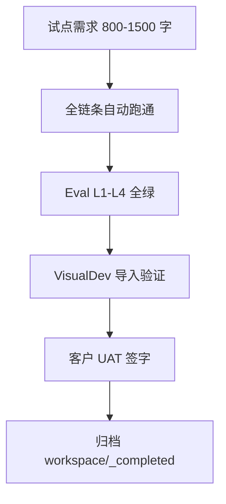

# 全链条第八阶段开发计划

> 文档编号：16 | 版本：v1.0 | 周期：W15-W16（10 个工作日）  
> 上级：[`7、skills构建方案.md`](./7、skills构建方案.md) 目标一「10 个 Skills 齐备」  
> 前置：[`15、全链条第七阶段开发计划.md`](./15、全链条第七阶段开发计划.md) Eval 基线建立  
> 后续：[`17、全链条复检与归档施工包.md`](./17、全链条复检与归档施工包.md)

---

## 0. 阶段定位

**核心问题：** 10 个 Skill 是否全部注册可跑、VisualDev 映射是否可用、试点客户能否在 **单 projectId** 完成「请假审批」交付？

### 0.1 十 Skill 齐备清单

| # | SkillId | 阶段 | 状态（编码前登记） |
|---|---|---|---|
| 1 | pm-skill | 二 | ✅ |
| 2 | analyst-skill | 二 | ✅ |
| 3 | architect-skill | 三 | ✅ |
| 4 | db-design-skill | 三 | ✅ |
| 5 | ui-design-skill | 三 | ✅ |
| 6 | system-design-skill | 三 | ✅ |
| 7 | developer-skill | 四 | ☐ |
| 8 | tester-skill | 四 | ☐ |
| 9 | deploy-skill | 五 | ☐ |
| 10 | bugfix-skill | 五 | ☐ |

**本阶段：** 补齐 7–10 生产化 + **ir1-to-visualdev-mapper** 预研落地。

### 0.2 交付物

| 交付 | 说明 |
|---|---|
| `ir1-to-visualdev-mapper` | `Mapper/Ir1ToVisualDevMapper.cs` — FormPageIR → VisualDev JSON |
| Skill Registry 完整性测试 | `SkillRegistry` 含 10 id |
| 试点交付包 | `workspace/_completed/Phase8-Pilot-{date}/` |
| 客户运行手册 | 不含密钥；引用 `start-dev.ps1` / Docker |

---

## 1. ir1-to-visualdev-mapper

**输入：** `IR2_FormPageIR` stable payload + **IR1_EventSpec** fields  
**输出：** VisualDev 可导入 JSON 【待源码验证 VisualDev 导入 API 路径】  
**铁律：** 映射层 **不写** 生成物源码；只产出 JSON；R3 仍适用

**边界检查：**

- [ ] 每个 UI field 必须映射 IR-1 `confirmedFields` 或标记 extension
- [ ] 缺失映射 → `MappingGapReported` 事件，不 silent drop
- [ ] 多租户：导入包 metadata 含 tenantId

---

## 2. 试点交付流程（图 2-1）

---

## 3. 冲刺计划

| Day | 内容 |
|---|---|
| D1-D2 | VisualDev mapper + 单测 |
| D3 | Skill Registry 10/10 集成测试 |
| D4-D6 | 试点场景跑通 + 缺陷修复（仅 .vm / Skill，不改生成物） |
| D7-D8 | 交付文档 + 培训录屏 |
| D9-D10 | 预检文档 17 复检项 |

---

## 4. Ticket

| Ticket | 估时 |
|---|---|
| P8-M01 Ir1ToVisualDevMapper | 2d |
| P8-R01 SkillRegistry 10 Skill 测试 | 0.5d |
| P8-P01 试点 E2E + 交付包 | 3d |
| P8-D01 客户手册 | 1d |

---

## 5. DoD（D1-D15 摘要）

| # | 预期 |
|---|---|
| D1 | 10 Skill 均可 `POST .../run` 或编排触发 |
| D2 | VisualDev 导入后表单可渲染 |
| D3 | 试点 UAT 签字 |
| D4 | Eval L4 业务分 ≥80 |
| D5-D15 | §15 + 文档 17 预检 PASS |

---

## 15. 六条质量生命线（阶段八 MUST）

| # | 维度 | 阶段八增量 |
|---|---|---|
| **1 日志** | 试点 project 专用 `projectId` 全链路 trace 导出包（JSON） |
| **2 边界** | mapper 缺口必须事件化；试点禁止 skip Gate |
| **3 性能** | 全链路 ≤30min（含 SA）；mapper <10s |
| **4 内存** | 试点演示后清理 workspace 临时目录 |
| **5 隔离** | 试点 tenant 与 dev 数据隔离 |
| **6 LLM** | 试点全程 Token 报表；不超 **ai_projects.F_TokenBudget** |

**本节核心表清单：** **ai_projects**、**ai_ir_***、**ai_skill_runs**、VisualDev 相关表 【待源码验证 `visualdev` 模块表名】

**本节关键代码路径索引：** `SkillRegistry.cs`、`IrProjectionEngine.cs`、VisualDev 导入 Service 【待源码验证】
