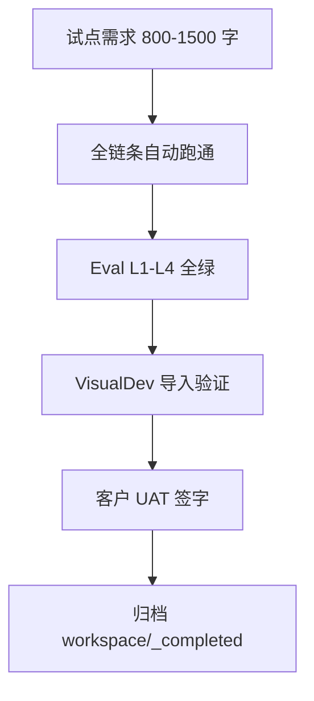

# 全链条第八阶段开发计划

> 📌 **S2/字段契约（2026-07-10）：** 需求分析生产主链 = `requirement-analysis` 编排器（[`25`](./25、需求分析子链重构方案书（修订版）.md)–[`28`](./28、需求分析重构-第三阶段开发计划（需求分析书与质量验收）.md)），**不是** 9 号旧 Analyst→sa-service 九步。`analyst-skill` 仍可注册存在，但试点/映射字段源 MUST 用 **`ai_entity_field`**；`confirmedFields` 仅派生对照。

> ⚠️ **R12 三元组适配声明（2026-07-07 追加）：** 本文档 L12「单 projectId」表述应理解为「单 pipeline」（会话边界）；同 project 下多 pipeline（fork）共享业务实体但独立 IR 事件流，详见 `.cursor/rules/triple-key-iron-law.mdc`。

> 文档编号：16 | 版本：v1.2（S2 契约） | 周期：W15-W16（10 个工作日）  
> 上级：[`7、skills构建方案.md`](./7、skills构建方案.md) 目标一「10 个 Skills 齐备」  
> 前置：[`15、全链条第七阶段开发计划.md`](./15、全链条第七阶段开发计划.md) Eval 基线建立  
> 后续：[`17、全链条复检与归档施工包.md`](./17、全链条复检与归档施工包.md)

> **v1.1 修正（2026-07-08 源码审计）：** 原 v1.0 将 7-10 号 Skill 标为「☐」是错误的 —— 经审计 10 个 Skill 全部已实现并经 DI 自动注册（含 1 个 bonus clarification skill 共 11 个）。本阶段核心收敛为：**① Ir1ToVisualDevMapper 落地（唯一硬编码交付）② SkillRegistry 完整性验证 ③ 试点 E2E 跑通**。

---

## 0. 阶段定位

**核心问题：** 10 个 Skill 是否全部注册可跑、VisualDev 映射是否可用、试点客户能否在 **单 projectId** 完成「请假审批」交付？

### 0.1 十 Skill 齐备清单（v1.1 源码审计修正）

| # | SkillId | 阶段 | 状态（v1.0） | 状态（v1.1 审计） | 实现类 |
|---|---|---|---|---|---|
| 1 | pm-skill | 二 | ✅ | ✅ CognitiveSkill v2.0 | `PmSkillService` |
| 2 | analyst-skill | 二 | ✅ | ✅ 仍注册；**生产 S2 主链=requirement-analysis 编排器（25–28）** | `AnalystSkillService`（compile/Finalize 路径） |
| 2b | requirement-analysis | 二·重构 | — | ✅ **现行 S2 入口** | `RequirementAnalysisOrchestrator` |
| 3 | architect-skill | 三 | ✅ | ✅ CognitiveSkill v2.0（2-phase 澄清） | `ArchitectSkillService` |
| 4 | db-design-skill | 三 | ✅ | ✅ CognitiveSkill v2.0 | `DbDesignSkillService` |
| 5 | ui-design-skill | 三 | ✅ | ✅ CognitiveSkill v2.0 | `UiDesignSkillService` |
| 6 | system-design-skill | 三 | ✅ | ✅ CognitiveSkill v2.0 | `SystemDesignSkillService` |
| 7 | developer-skill | 四 | ☐ | ✅ **已实现** IBaseSkill v1.0.0-d4a | `DeveloperSkillService`（.vm 渲染 + 语法校验 + workspace） |
| 8 | tester-skill | 四 | ☐ | ✅ **已实现** IBaseSkill v1.0.0-d8（无 LLM） | `TesterSkillService`（字段+状态机推导） |
| 9 | deploy-skill | 五 | ☐ | ✅ **已实现** IBaseSkill v1.0.0-p5b03 | `DeploySkillService`（Preview+Package + DeploymentVerified） |
| 10 | bugfix-skill | 五 | ☐ | ✅ **已实现** IBaseSkill v1.0.0-p5b02 | `BugfixSkillService`（IrDiffEngine + BugFixed） |
| (11) | system-design-clarification-skill | P3 | — | ✅ bonus（ADR-005） | `SystemDesignClarificationSkill` |

**注册机制：** `SkillRegistry`（`ISingleton`）经 `serviceProvider.GetServices<IBaseSkill>()` **自动发现** —— 每个 skill 类标 `[ITransient]` 即自动加入 DI 集合，无需手工注册清单。`GetRequired(skillId)` 失败抛 `Oops.Bah`。

**本阶段（v1.1 收敛）：** 唯一硬编码交付 = **`Ir1ToVisualDevMapper`**（P8-M01）；其余为验证 + 试点。

### 0.2 交付物

| 交付 | 说明 |
|---|---|
| `ir1-to-visualdev-mapper` | `Mapper/Ir1ToVisualDevMapper.cs` — FormPageIR → VisualDev JSON |
| Skill Registry 完整性测试 | `SkillRegistry` 含 10 id |
| 试点交付包 | `workspace/_completed/Phase8-Pilot-{date}/` |
| 客户运行手册 | 不含密钥；引用 `start-dev.ps1` / Docker |

---

## 1. ir1-to-visualdev-mapper（P8-M01 — 唯一硬编码交付）

**输入：** `IR2_FormPageIR`（fragmentId=`formPage:{projectId}`）stable payload + **`ai_entity_field`（声明 3）**；`IR1_EventSpec.confirmedFields` 仅作派生对照，非唯一源  
**输出：** `VisualDevCrInput`（`formData` JSON，通过 `TemplateParsingBase.VerifyTemplate()` 门控）

**v1.1 源码解析（原"待源码验证"占位符已解决）：**
- **导入 API：** `POST /api/visualdev/Base`（`VisualDevService.Create`）— create 即 import，无单独 import 端点
- **验证门：** `TemplateParsingBase.VerifyTemplate()`（mapper 输出必须通过，否则抛 `ErrorCode.D1401`）
- **目标表：** `BASE_VISUAL_DEV.F_FORM_DATA`（`VisualDevEntity`）
- **字段类型常量：** `JNPF.Common/Const/JnpfKeyConst.cs`（input/textarea/select/datePicker/table 等）
- **先例：** `VisualDev.Engine/Mapper/VisualDev.cs`（Mapster `CodeGenFieldsModel→FieldsModel`）

**字段名歧义处理：** LLM prompt 让 UiDesign 产 `componentType`，但消费方（`TesterSkillInputBuilder`）读 `component`。mapper **同时接受两者**（`component` ?? `componentType`）。

**铁律：** 映射层 **不写** 生成物源码；只产出 JSON；R3 仍适用

**边界检查：**

- [ ] 每个 UI field 必须映射 **`ai_entity_field`**（或明确标记 extension）；`confirmedFields` 不得作为唯一依据
- [ ] 缺失映射 → `MappingGapReported` 事件，不 silent drop
- [ ] 多租户：导入包 metadata 含 tenantId
- [ ] 输出经 `VerifyTemplate()` 校验（否则返回错误清单而非半成品）

**componentType → jnpfKey 映射表（核心）：**

| FormPageIR componentType | jnpfKey | 说明 |
|---|---|---|
| Input/TextInput | `input` | 单行文本 |
| Textarea/TextArea | `textarea` | 多行文本 |
| Number/InputNumber | `inputNumber` | 数字 |
| Select/Dropdown | `select` | 下拉 |
| Radio | `radio` | 单选 |
| Checkbox | `checkbox` | 多选 |
| Date/DatePicker | `datePicker` | 日期 |
| Time/TimePicker | `timePicker` | 时间 |
| Switch/Toggle | `switch` | 开关 |
| Upload/File | `uploadFile` | 文件上传 |
| Image/UploadImg | `uploadImg` | 图片上传 |
| Table/ChildTable | `table` | 子表（嵌套） |
| 其他/未知 | `input`（默认） + `MappingGapReported` | 兜底 + 告警 |

---

## 2. 试点交付流程（图 2-1）

---

## 3. 冲刺计划

| Day | 内容 |
|---|---|
| D1-D2 | VisualDev mapper + 单测 |
| D3 | Skill Registry 10/10 集成测试 |
| D4-D6 | 试点场景跑通 + 缺陷修复（仅 .vm / Skill，不改生成物） |
| D7-D8 | 交付文档 + 培训录屏 |
| D9-D10 | 预检文档 17 复检项 |

---

## 4. Ticket

| Ticket | 估时 | 状态 |
|---|---|---|
| P8-M01 Ir1ToVisualDevMapper | 2d | ✅ 完成（`Ir1ToVisualDevMapper.cs` + `VisualDevMapperApiService.cs` + `IrVisualDevModels.cs`）|
| P8-R01 SkillRegistry 10 Skill 测试 | 0.5d | ✅ 完成（`SkillRegistryCheckApiService.cs` 验证 11 id 全注册）|
| P8-P01 试点 E2E + 交付包 | 3d | ☐ 待执行（需运行时验证：启动后端跑全链 + 跑 mapper）|
| P8-D01 客户手册 | 1d | ☐ 待执行 |

---

## 5. DoD（D1-D15 摘要 + 实施状态）

| # | 预期 | 状态 |
|---|---|---|
| D1 | 10 Skill 均可 `POST .../run` 或编排触发 | ✅ 编码验证（11 id 全注册；运行时待 E2E） |
| D2 | VisualDev 导入后表单可渲染 | ✅ mapper 产出 formDataJson（`POST /api/visualdev/Base` 兜底校验；运行时待验证）|
| D3 | 试点 UAT 签字 | ☐ 待试点 |
| D4 | Eval L4 业务分 ≥80 | ☐ 待 Eval 数据积累 |
| D5-D15 | §15 + 文档 17 预检 PASS | ☐ 待预检 |

**新增 API 端点（P8-M01 + P8-R01）：**
- `POST /api/studio/visualdev/map/{pipelineId}` — IR→VisualDev formData 映射（缺口事件化）
- `GET /api/studio/skills/registry-check` — Skill 注册完整性验证（11 id）

**编译状态：** ✅ `JNPF.InteAssistant` 0 错误 0 警告 · ✅ `JNPF.API.Entry` 0 错误

---

## 15. 六条质量生命线（阶段八 MUST）

| # | 维度 | 阶段八增量 |
|---|---|---|
| **1 日志** | 试点 project 专用 `projectId` 全链路 trace 导出包（JSON） |
| **2 边界** | mapper 缺口必须事件化；试点禁止 skip Gate |
| **3 性能** | 全链路 ≤30min（含 SA）；mapper <10s |
| **4 内存** | 试点演示后清理 workspace 临时目录 |
| **5 隔离** | 试点 tenant 与 dev 数据隔离 |
| **6 LLM** | 试点全程 Token 报表；不超 **ai_projects.F_TokenBudget** |

**本节核心表清单：** **ai_projects**、**ai_ir_***、**ai_skill_runs**、**BASE_VISUAL_DEV**（VisualDev 表，`F_FORM_DATA` 列存 formData JSON）

**本节关键代码路径索引：** `SkillRegistry.cs`、`IrProjectionEngine.cs`、`VisualDevService.cs`（`POST /api/visualdev/Base`）、`TemplateParsingBase.cs`（`VerifyTemplate` 门控）、`JnpfKeyConst.cs`（字段类型常量）
