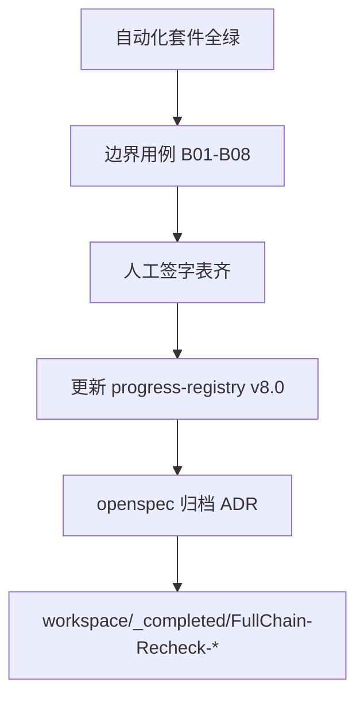

# 全链条复检与归档施工包

> ⚠️ **R12 三元组适配声明（2026-07-07 追加）：** 本文档验收准则中所有日志/事件/SQL MUST 含三元组 `(tenantId, projectId, pipelineId)`；原文 L25 仅列 runId/tenantId/projectId 缺 pipelineId 已废除。详见 `.cursor/rules/triple-key-iron-law.mdc`。

> 文档编号：17 | 版本：v1.0 | 周期：W17（5 个工作日，可与阶段八重叠 2 天）  
> 定位：**全链条 8 阶段完成后的统一复检、回归、归档 Gate** — 不新增业务 Skill  
> 前置：文档 12～16 各阶段 DoD 自称完成；[`11-附、Phase3-实习生验收清单.md`](./11-附、Phase3-实习生验收清单.md) 导师签字  
> 产出：`workspace/_completed/FullChain-Recheck-{YYYYMMDD}/` + 更新 `docs/progress-registry.yaml`

---

## 0. 复检 vs 各阶段 DoD

| 类型 | 范围 | 执行人 |
|---|---|---|
| 阶段 DoD | 单阶段功能 | 开发 + 实习生 |
| **复检（本文档）** | 跨阶段 NFR + 回归 + 归档 | **首席架构师 / QA 负责人** 签字 |

**一票否决：** 六条质量生命线任一红灯 → 不得归档「全链条完成」。

---

## 1. 六条质量生命线 — 全链条复检矩阵

| # | 维度 | 复检方法 | 通过标准 | 脚本/证据 |
|---|---|---|---|---|
| **1** | **日志清晰** | 抽 3 个 project 查 Serilog + **ai_skill_runs** | 100% run 含 runId/tenantId/projectId；失败有 ErrorMessage | 日志片段 + SQL 导出 |
| **2** | **业务边界** | 边界用例清单 §2 | 全部预期错误码，无 silent fail | API 响应 JSON |
| **3** | **性能** | 压测 + Rebuild | 10 并发稳定；Rebuild 100 事件 <200ms | `phase2.5-stress-e2e.mjs` |
| **4** | **内存管理** | D14 浏览器 | pipeline×10 切换无 SSE 泄漏 | `phase2.5-d16-browser.mjs` + PNG |
| **5** | **上下文隔离** | 双租户 D8 | IR/workspace/CallLog 不交叉 | 导师签字表 |
| **6** | **LLM 调用控制** | D15-D19 + CallLog 对账 | 429 语义正确；analyst 零直连；Token 对账 delta≤100 | `phase3-dod-verify.mjs` + 实习生 D17-D18 报告 |

---

## 2. 边界用例清单（维度 2 — 必跑）

| ID | 场景 | API/操作 | 预期 |
|---|---|---|---|
| B01 | IR-1 未 stable 跑 design | `POST .../design/run` | 400 |
| B02 | 预算 96% 跑 design | SQL seed + design/run | 429 `LLM_BUDGET_EXHAUSTED` |
| B03 | 缺 UI 跑 system-design | simulate 缺 FormPageIR | failed，无 SystemDesignLocked |
| B04 | critical 约束 | injectLayerViolation | 无 locked |
| B05 | SystemDesign 未 locked 跑 developer | developer/run | 400 |
| B06 | sandbox build 失败 | 【阶段四】损坏模板 | CodegenFailed，非 stable |
| B07 | Bugfix 空 diff | bugfix 无变更 | 拒绝 BugFixed |
| B08 | fuse tier | 【阶段六】Token 打满 | 新 LLM 拒绝 |

---

## 3. 自动化回归套件（维度 3/4/6）

**执行顺序（单命令块，exit 0 才进入人工签字）：**

```powershell
# 环境
powershell -ExecutionPolicy Bypass -File D:\JNPF-v52\start-dev.ps1
node D:\JNPF-v52\scripts\run-inte-migration.mjs

# 阶段回归
node D:\JNPF-v52\scripts\phase2-skills-e2e.mjs
node D:\JNPF-v52\scripts\phase2-dod-verify.mjs
node D:\JNPF-v52\scripts\phase2.5-stress-e2e.mjs
node D:\JNPF-v52\scripts\phase3-dod-verify.mjs
# 阶段四～八（随开发落地）
# node D:\JNPF-v52\scripts\phase4-dod-verify.mjs
# node D:\JNPF-v52\scripts\phase5-fullchain-e2e.mjs
# node D:\JNPF-v52\scripts\phase6-verify.mjs

# 编译
cd D:\JNPF-v52\backend && dotnet build application/JNPF.API.Entry/JNPF.API.Entry.csproj
cd D:\JNPF-v52\jnpf-web-vue3 && pnpm type-check

# 浏览器泄漏
node D:\JNPF-v52\scripts\phase2.5-d16-browser.mjs
```

**证据目录：** 所有 JSON/PNG/log 复制到 `.claude/evidence/fullchain-recheck-{date}/`

---

## 4. 人工签字项（不可脚本替代）

| 项 | 负责人 | 标准 |
|---|---|---|
| D8 双租户 | 导师 | 无 cross-tenant |
| D9 手工平台零影响 | QA | VisualDev + 工作流路径不变 |
| 试点 UAT | 客户代表 | 文档 16 签字 |
| 架构红线 R1-R10 | 架构师 | [`architecture-redlines.md`](../../../.claude/rules/architecture-redlines.md) 抽检 |

---

## 5. 归档流程（图 2-1）



---

## 6. 复检 DoD（R1-R12）

| # | 条款 | 预期 |
|---|---|---|
| R1 | 自动化套件 | 上述脚本 exit 0 |
| R2 | 六条 NFR 矩阵 | 全 PASS |
| R3 | B01-B08 | 全 PASS |
| R4 | 实习生清单 | 导师签字完成 |
| R5 | 10 Skill Registry | 集成测试 PASS |
| R6 | 无 P0 开放 Bug | issue 清单为空或 waived |
| R7 | progress-registry | current_phase 更新 |
| R8 | evidence 打包 | tar/目录可审计 |
| R9 | 密钥未泄露 | git 扫描 clean |
| R10 | 文档 12-16 与代码一致 | 穿透抽查 5 处类名 |
| R11 | 手工平台回归 | D9 PASS |
| R12 | 首席架构师签字 | 本文档 §7 表 |

**复检通过：R1-R12 全绿。**

---

## 7. 总签字表

| 角色 | 姓名 | 日期 | 结论 |
|---|---|---|---|
| 开发负责人 | | | ☐ PASS ☐ FAIL |
| QA | | | ☐ PASS ☐ FAIL |
| 首席架构师 | | | ☐ PASS ☐ FAIL |

---

## 8. 与各阶段文档映射

| 阶段 | 计划文档 | 验收脚本 |
|---|---|---|
| 三 | 11 | phase3-dod-verify.mjs |
| 四 | 12 | phase4-dod-verify.mjs 【待建】 |
| 五 | 13 | phase5-fullchain-e2e.mjs 【待建】 |
| 六 | 14 | phase6-verify.mjs 【待建】 |
| 七 | 15 | eval-verify.mjs 【待建】 |
| 八 | 16 | 试点 UAT |
| 复检 | 17 | 本章 §3 |

---

## 15. 六条质量生命线（复检 — 汇总 enforcement）

复检阶段 **不实现新代码**，只 **验证** 各阶段 §15 承诺：

1. **日志** — 抽样 3 project，缺失 runId 即 FAIL  
2. **边界** — B01-B08 100%  
3. **性能** — stress + Rebuild 阈值  
4. **内存** — D16 截图有效  
5. **隔离** — D8 + workspace 目录抽查  
6. **LLM** — phase3 D15/D19 + CallLog 对账  

**本节核心表清单：** **ai_skill_runs**、**BASE_AI_CALL_LOG**、**ai_projects**、**ai_ir_events**

**本节关键代码路径索引：** 各阶段计划 §15；`scripts/README-api-cli.md`

---

## 本节核心表清单（文档级）

- **ai_ir_events** / **ai_ir_fragment_snapshots** / **ai_skill_runs** / **BASE_AI_CALL_LOG** / **ai_projects**

## 本节关键代码路径索引（文档级）

- `scripts/phase3-dod-verify.mjs`
- `scripts/phase2.5-stress-e2e.mjs`
- `scripts/phase2.5-d16-browser.mjs`
- `docs/progress-registry.yaml`
