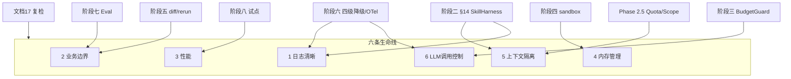

# 全链条第四～八阶段与复检 — 文档总索引

> 版本：v1.1 | 更新：2026-07-04  
> 说明：在原文档 [`7、skills构建方案.md`](./7、skills构建方案.md) 六阶段模型上，将 **阶段四～八 + 复检** 展开为 **6 份可执行开发计划**；六条质量生命线（日志 / 边界 / 性能 / 内存 / 隔离 / LLM）在各文档 **§15** 统一 enforcement。

---

## 文档清单

| 编号 | 文档 | 周期 | 核心交付 |
|---|---|---|---|
| 11 | [全链条第三阶段开发计划](./11、全链条第三阶段开发计划.md) | W5-W6 | 设计四 Skill → IR-2 |
| 11-附 | [Phase3 实习生验收清单](./11-附、Phase3-实习生验收清单.md) | — | D8/D12/D14/D16-D18 |
| **12-附** | [Phase4 实习生验收清单](./12-附、Phase4-实习生验收清单.md) | — | **D8–D16 验收 / 证据**（Tester·Arch·宿主·IR-3·Green·DoD） |
| **12** | [全链条第四阶段开发计划](./12、全链条第四阶段开发计划.md) | **D3-D16 剩余 ~15d** | developer + tester + sandbox + arch-guard → IR-3（**v2.1 节奏校准**） |
| 12-附 | [codegen partial 策略](./12-附、codegen-partial-class.md) | — | A1 通道 A/B/C 落盘 · templateVersions |
| **13** | [全链条第五阶段开发计划](./13、全链条第五阶段开发计划.md) | W9-W10 | deploy + bugfix + ir-diff + 全链路 |
| **14** | [全链条第六阶段开发计划](./14、全链条第六阶段开发计划.md) | W11-W12 | Token 四级 + OTel + etcd + Worker 恢复 |
| **15** | [全链条第七阶段开发计划](./15、全链条第七阶段开发计划.md) | W13-W14 | Eval Pipeline + 质量榜 + 记忆遗忘 |
| **16** | [全链条第八阶段开发计划](./16、全链条第八阶段开发计划.md) | W15-W16 | 10 Skill 齐备 + VisualDev mapper + 试点 |
| **17** | [全链条复检与归档施工包](./17、全链条复检与归档施工包.md) | W17 | 全链条 NFR 矩阵 + 归档 Gate |

---

## 六条质量生命线 — 跨阶段继承关系

| 生命线 | 首建阶段 | 峰值阶段 | 复检 |
|---|---|---|---|
| 日志 | 二 | 六 OTel | 17 §1 抽样 |
| 边界 | 二 Gate | 四～五 | 17 §2 B01-B08 |
| 性能 | 一 Rebuild | 六 10 并发 | stress 脚本 |
| 内存 | 二 D16 | 四 sandbox | d16-browser |
| 隔离 | 二 TenantGuard | 五 diff | D8 双租户 |
| LLM | 三 Guard | 六 四级 | phase3-dod + 对账 |

---

## 编码推进顺序（当前 — 2026-07-04）

1. ✅ 阶段三主干 + `phase3-dod-verify.mjs` 9/9  
2. ✅ 阶段四 D0-D2 阻断契约（A5/A1/Q1/A2 yaml）  
3. 🔄 **D3** — `CodeSandboxService` + `leave-simple` dotnet build（**D3-GATE**）  
4. ☐ A1 文档架构师签字  
5. ☐ **D4 起** — `DeveloperSkillService`（须 D3-GATE green）  
6. ☐ D6-D16 — ArchGuard 实现 · Tester · 宿主 · IR-3 Tab · `phase4-dod-verify.mjs`  
7. ☐ 实习生 11-附 导师签字（阻塞 D16，不阻塞 D4）  
8. ☐ 阶段五～八 sequential  
9. ☐ 文档 17 复检归档  

**当前焦点：** 文档 12 §3.2 **D3** — sandbox build；**禁止**在 D3-GATE 前启动 Developer 主链。

---

## 本节关键代码路径索引

- `backend/modularity/inteAssistant/JNPF.InteAssistant/Skills/SkillHarness.cs`
- `backend/modularity/inteAssistant/JNPF.InteAssistant/Llm/SkillLlmBudgetGuard.cs`
- `scripts/phase3-dod-verify.mjs`
- `docs/progress-registry.yaml`
