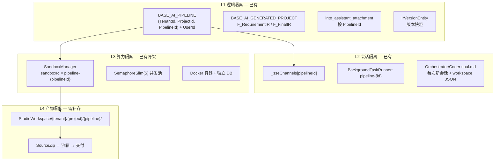

> ⚠️ **R12 三元组适配声明（2026-07-07 追加）：** 本文档第二章原文表述「靠 `tenantId × userId × pipelineId` 三维隔离」与「`StudioWorkspace/{tenantId}/{pipelineId}/` 路径」**已废除**——缺 `projectId` 维度，违反 R12 三元组铁律。当前正确架构：四元隔离 `(tenantId, projectId, pipelineId) + userId`；路径四层 `StudioWorkspace/{tenantId}/{projectId}/{pipelineId}/`。详见 `.cursor/rules/triple-key-iron-law.mdc`（宪法级，永远生效）。

系统目前存在这些问题，是否必须修复，如果修复的话，会不会对现有项目的功能造成极大破坏，如果破坏性很强是否可以保持现状：首席架构师的 4 个问题，全部从代码中找到了答案：


\---

G1：代码生成输出到哪？


不写入任何 .csproj 源码目录。 生成到临时目录 → 打包 zip → 用户手动下载后自行集成。


CodeGenService → {SystemPath}/CodeGenerate/{fileName}/

​                 ├── Net/Controller/{表名}/{表名}Service.cs

​                 ├── Net/Models/Entity/{表名}/{表名}Entity.cs

​                 ├── Net/Models/Dto/{表名}/{表名}CrInput.cs

​                 ├── Net/html/PC/{表名}/index.vue

​                 └── ...

​                              ↓

​                        打包为 .zip → 下载


证据：CodeGenService.cs:160 — Path.Combine(KeyVariable.SystemPath, "CodeGenerate", fileName) + 第 167 行 ZipFile.CreateFromDirectory(randPath, downloadPath)。输出路径硬编码在 CodeGenTargetPathHelper.cs。


这意味着：生成的代码不会自动进入项目。用户下载 zip 后手动将文件放入对应目录。生成代码和手写代码最终在同一个 .csproj 目录下共存，无物理隔离。


\---

G2：生成代码和手写代码怎么区分？


目前没有技术手段区分。 这是已知缺口。


┌──────────────────────────────────────────┬─────────────────────────────────────────────────────────────────────┐

│                  检查项                  │                                结果                                 │

├──────────────────────────────────────────┼─────────────────────────────────────────────────────────────────────┤

│ .vm 模板是否输出 [GeneratedCode]         │ ❌ 无                                                               │

├──────────────────────────────────────────┼─────────────────────────────────────────────────────────────────────┤

│ 是否有 "auto-generated" 文件头           │ ❌ 无                                                               │

├──────────────────────────────────────────┼─────────────────────────────────────────────────────────────────────┤

│ .gitignore 是否排除生成目录              │ ❌ 无                                                               │

├──────────────────────────────────────────┼─────────────────────────────────────────────────────────────────────┤

│ Directory.Build.props 是否有生成代码配置 │ ❌ 无                                                               │

├──────────────────────────────────────────┼─────────────────────────────────────────────────────────────────────┤

│ JNPF.Analyzers 是否为生成代码做豁免      │ ❌ 全部 GeneratedCodeAnalysisFlags.None（不跳过生成代码，因为没有） │

└──────────────────────────────────────────┴─────────────────────────────────────────────────────────────────────┘


但这是计划中的改进。docs/bug/redline-catalog.md R3 明确写了目标方案：


▎ 所有生成文件加 [GeneratedCode] attribute + Roslyn Analyzer 检测手动修改。生成目录设为 OS 级只读。


当前防线：只有 R3 的 L2 约定（"修 bug 改 .vm 模板，禁止直接改输出文件"），纯靠自觉。


\---

G3：JNPF.Analyzers 现在有哪些规则？


共 6 条，全在 backend/tools/JNPF.Analyzers/JNPF.Analyzers/Analyzers/：


┌─────────┬───────────────────────────────────────────────────────────────────────┬─────────┐

│   ID    │                                 规则                                  │  级别   │

├─────────┼───────────────────────────────────────────────────────────────────────┼─────────┤

│ JNPF001 │ 禁止 App.GetService<T>()（Service Locator 反模式 → 用构造函数注入）   │ Error   │

├─────────┼───────────────────────────────────────────────────────────────────────┼─────────┤

│ JNPF002 │ 禁止直接赋值 db.Aop.DataExecuting = handler（会覆盖全局配置 → 用 +=） │ Error   │

├─────────┼───────────────────────────────────────────────────────────────────────┼─────────┤

│ JNPF003 │ 禁止直接 CreateScope()（绕过 DI 生命周期 → 资源泄漏风险）             │ Error   │

├─────────┼───────────────────────────────────────────────────────────────────────┼─────────┤

│ JNPF004 │ [BypassOutbox] 必须附带注释说明绕过理由                               │ Warning │

├─────────┼───────────────────────────────────────────────────────────────────────┼─────────┤

│ JNPF005 │ 构造函数直接注入 ISqlSugarClient（建议用 ISqlSugarRepository<T>）     │ Warning │

├─────────┼───────────────────────────────────────────────────────────────────────┼─────────┤

│ JNPF006 │ 禁止 async void（异常无法捕获 → 用 async Task）                       │ Warning │

└─────────┴───────────────────────────────────────────────────────────────────────┴─────────┘


3 个 Error（编译阻断），3 个 Warning。JNPF001 和 JNPF006 有 CodeFix。通过 Directory.Build.props 注入全部项目。


覆盖缺口：没有模块依赖方向检查、没有 API 权限检查、没有生成代码边界检查。


\---

G4：最痛的架构违规是什么？


综合 Hook 复杂度、错题本频率、红线级别：


┌──────┬──────────────────────────┬───────────────────────────────────────────────────────────────────────────────┐

│ 排名 │           问题           │                                     证据                                      │

├──────┼──────────────────────────┼───────────────────────────────────────────────────────────────────────────────┤

│ 1    │ 多租户隔离 (R4)          │ Hook 测试用例最多(5)、错题本 3 次(M005/M006/M019)、标注"最高安全风险"         │

├──────┼──────────────────────────┼───────────────────────────────────────────────────────────────────────────────┤

│ 2    │ SQL 注入 (R7)            │ Hook 正则最复杂、同时被 guard-write.mjs L3 和 guard-sql-injection.mjs         │

│      │                          │ 双重守卫                                                                      │

├──────┼──────────────────────────┼───────────────────────────────────────────────────────────────────────────────┤

│ 3    │ API 权限 (R8)            │ JwtHandler 当前 bypass JWT 校验（临时态）→ Hook 是唯一防线                    │

├──────┼──────────────────────────┼───────────────────────────────────────────────────────────────────────────────┤

│ 4    │ Mapster 审计字段覆盖     │ 错题本 M020、hook-backlog.md 三次重复请求增加 Roslyn 级扫描                   │

│      │ (Trap 2)                 │                                                                               │

├──────┼──────────────────────────┼───────────────────────────────────────────────────────────────────────────────┤

│ 5    │ 代码生成边界 (R3)        │ 仅 L2 约定保护、无 Hook、无 Analyzer、redline-catalog.md 已规划               │

│      │                          │ [GeneratedCode] 方案但未实施                                                  │

└──────┴──────────────────────────┴───────────────────────────────────────────────────────────────────────────────┘


\---

给首席架构师的建议


根据以上发现，第一版架构测试的优先级排序：


P0: R4 多租户 — Roslyn Analyzer 新增 JNPF007（Entity 无 TenantId 列检测）

P1: R8 API 权限 — Analyzer 新增 JNPF008（IDynamicApiController 无权限属性）

P1: R3 代码生成边界 — 先给 .vm 模板加 [GeneratedCode] 输出 + Analyzer 检测手动修改

P2: 模块耦合 — Analyzer 新增依赖方向规则

P2: Trap 2 Mapster — Analyzer 检测 .Adapt<Entity>() 是否遗漏 .Ignore()


前两项是填补 L0 Hook 的编译时空白——Hook 只能拦截文件写入那一刻，Analyzer 能让它在每次 dotnet build 时报错。


# 第一章：对JNPF框架的影响

结论先说：**G1 不是缺陷，不必改；G2/G3 的「缺口」不必立刻全量根治，可以分阶段、只约束增量；G4 里真正必须优先处理的是 R8 的运行时授权逻辑，而不是先把 Analyzer 铺满。**

首席架构师的代码结论 **[KNOWN]** 基本准确，我补充了几处对「是否必须修、破坏性多大」的判断。

---

## 总表：必须修吗？破坏性如何？

| 项                               | 是否必须修                              | 对现有功能的破坏风险                                 | 建议                                      |
| -------------------------------- | --------------------------------------- | ---------------------------------------------------- | ----------------------------------------- |
| **G1** 生成到临时目录 + zip 下载 | **否** — 产品设计如此                   | **无**                                               | 保持现状                                  |
| **G2** 无 `[GeneratedCode]` 标记 | **否（短期）** — 治理缺口，非运行时 bug | **高**（若 retroactive 全量 Analyzer）               | 增量实施，存量 grandfather                |
| **G3** 现有 6 条 Analyzer        | **否** — 已在工作                       | **低**                                               | 保持；新规则单独 rollout                  |
| **G4-R4** 多租户                 | **部分必须** — 漏过滤 = 数据泄漏        | **中**（Analyzer 设计不当会误报）                    | Hook 继续 + 精准 Analyzer                 |
| **G4-R8** API 权限               | **是（运行时）**                        | **高**（补全路由匹配可能拦掉依赖「宽松授权」的调用） | 先修 `JwtHandler`，再 Warning 级 Analyzer |
| **G4-R3** 代码生成边界           | **否（短期）**                          | **低~中**                                            | 流程约束 + 新模板加标记                   |
| **Trap2 Mapster**                | **否（短期）**                          | **中**（Warning 会刷屏）                             | 扩展方法优先于 Analyzer                   |

---

## G1：生成输出路径 — 不必修

```160:167:backend/modularity/codegen/JNPF.CodeGen/CodeGenService.cs
        string randPath = Path.Combine(KeyVariable.SystemPath, "CodeGenerate", fileName);
        string downloadPath = randPath + ".zip";
        // ...
        ZipFile.CreateFromDirectory(randPath, downloadPath);
```

这是低代码平台的 **[KNOWN]** 标准流程：设计时生成 → 打包 → 用户手动集成。  
**不会**自动写入 `.csproj`，因此也不存在「改输出路径会炸编译」的问题。

真正相关的缺口在 **G2**：集成进 `modularity/` 之后，生成代码与手写代码物理混存 —— 这是集成方式带来的，不是 G1 本身要改。

---

## G2：生成/手写无法区分 — 不必立刻全量修

| 动作                            | 破坏性     | 说明                                                         |
| ------------------------------- | ---------- | ------------------------------------------------------------ |
| `.vm` 模板加 `[GeneratedCode]`  | **低**     | 只影响**今后新生成**的 zip；已集成代码不受影响               |
| Analyzer 检测「标记文件被手改」 | **极高**   | 二开几乎必然改生成后的 Service/Entity；一上 Error 可能**大面积编译失败** |
| OS 只读生成目录                 | **不适用** | 生成物不在独立只读目录，而在 `modularity/` 业务树里          |

**建议：保持现状 + 增量约束**

1. 新模板输出 `[GeneratedCode]` + 文件头（零破坏）
2. Analyzer 先 **Warning**，且 **只扫带标记的新文件**
3. 存量已集成代码 **grandfather**，不做 retroactive  enforcement  
4. `redline-catalog.md` 的 OS 只读方案，更适合「独立 Generated/ 目录」架构；当前混存模式下 **不宜硬上**

---

## G3：现有 6 条 Analyzer — 不必修，扩展需谨慎

现有 JNPF001–006 **[KNOWN]** 已通过 `Directory.Build.props` 注入。它们本身不是 bug。

新增 JNPF007/008 等属于 **增量能力**，风险在于：

- 若设为 **Error** 且无 baseline → 可能一次阻断整个 solution 编译
- 若存量违规点多 → 需要 `#pragma` / `editorconfig` 豁免或分模块启用

**建议 rollout 模式：** `Warning → 统计 baseline → 新代码 Error → 存量分批消化`

---

## G4：按真实风险重排优先级

### 1️⃣ R8 API 权限 — **必须修（运行时），破坏性真实存在**

JWT 校验 **[KNOWN]** 仍在（`HandleAsync` 里 `AutoRefreshToken`）。  
更严重的是 **`CheckAuthorzieAsync` 的路由匹配是 stub**：

```90:95:backend/application/JNPF.API.Entry/Handlers/JwtHandler.cs
        // 阶段 1：路由级权限匹配
        if (permissionGroups.Count == 0)
            return false;

        // 默认路由免检（CurrentUser 等已在上面处理）
        return true;
```

含义：**只要用户有任意权限组，所有非白名单 API 都放行** —— 不是「JWT bypass」，而是 **授权形同虚设**。这比缺 Analyzer 更 urgent。

| 修复方式                                                     | 破坏性                                                  |
| ------------------------------------------------------------ | ------------------------------------------------------- |
| 补全路由 ↔ 权限组匹配                                        | **高** — 可能暴露大量「以前能调、其实不该有权限」的接口 |
| JNPF008（缺 `[AllowAnonymous]`/`[SecurityDefine]` 报 Warning） | **低~中** — 不阻断编译，先摸底                          |

**建议：** 先 **Warning 级 JNPF008 摸底** → 在测试环境 **补全 JwtHandler 路由匹配** → 灰度验证 → 再升 Error。  
不能 indefinitely 保持「有权限组就全过」的现状 —— 这是 **安全 debt**，不是风格问题。

### 2️⃣ R4 多租户 — **必须防新增泄漏，不宜 blanket Analyzer**

实体基类体系 **[KNOWN]** 已覆盖大部分业务表：

```11:24:backend/modularity/common/JNPF.Common/Contracts/EntityBase.cs
public abstract class EntityBase<TKey> : ITenantFilter, IZxSystemFilter, IEntity<TKey>
{
    // ...
    public string TenantId { get; set; }
```

`CLDEntityBase` → `EntityBase` 链路上的实体 **已有** `ITenantFilter`。  
**不应** 被 JNPF007 一刀切：

- `FwCLDEntityBase` — 框架级，**故意**无 `ITenantFilter`
- `SystemEntityBase` — 用 `IZxSystemFilter`，不是租户维度
- `DictionaryTypeEntity` 等 — 共享字典，可能跨租户

真正高风险是 **绕过 Repository 的裸 `ISqlSugarClient` 查询**（Hook/错题本 M005/M006/M019 已印证），不是「Entity 缺 TenantId 列」这么简单。

**建议：**

- **保持** L0 Hook（写文件时拦截）
- JNPF007 若做，必须 **白名单基类 + 排除 Fw*/System* + 只 Warning**
- **不要** 对存量全量 Error —— 误报 + 阻断编译风险大

### 3️⃣ R3 代码生成边界 — **可保持现状（流程层）**

纯 **L2 约定 + AI Hook**，无运行时安全面。  
破坏性主要来自 G2 的 retroactive Analyzer，不是 R3 本身。

### 4️⃣ Trap2 Mapster — **可延后，优先 SafeAdapt**

Analyzer 扫 `.Adapt<Entity>()` 缺 `.Ignore()` → 存量 Warning 会很多。  
`SafeAdapt<T>()` 或全局 Mapster 配置 → **零破坏、渐进替换**，比 Analyzer 更合适。

---

## 对首席架构师 P0/P1/P2 方案的修正建议

原方案合理，但顺序和力度需要调整：

```
实际推荐顺序：

P0  R8 运行时  — 补 JwtHandler 路由匹配（测试环境灰度，破坏性可控）
P0' R8 编译时  — JNPF008 Warning only（摸底，不阻断）
P1  R4 增量    — 继续 Hook + 精准 JNPF007 Warning（排除框架基类）
P2  R3 增量    — .vm 加 [GeneratedCode]（仅新 zip）
P3  Trap2      — SafeAdapt 扩展方法
P4  模块耦合   — NetArchTest / AR002（新模块 Error，存量 Warning）
```

**不建议现在做：**

- R3 retroactive `[GeneratedCode]` + Error Analyzer（破坏性极强）
- R4 blanket Entity TenantId Error（误报多）
- 把 G1 改成自动写入 csproj（改变产品工作流，与低代码「下载集成」模型冲突）

---

## 能否保持现状？

| 领域                    | 能否保持           | 前提                                           |
| ----------------------- | ------------------ | ---------------------------------------------- |
| G1 生成流程             | ✅ 完全可以         | 无变更必要                                     |
| G2 无标记               | ✅ 短期可以         | AI 开发靠 R3 约定 + Hook；接受再生成时覆盖风险 |
| G3 6 条 Analyzer        | ✅ 完全可以         | 已在发挥作用                                   |
| R4 多租户               | ⚠️ 部分可以         | Hook 防新增；不能接受「零 Analyzer」 forever   |
| **R8 授权 stub**        | ❌ **不应长期保持** | 有权限组即全放行 = 已知安全漏洞                |
| R3 / Mapster / 模块耦合 | ✅ 短期可以         | 用流程约束替代编译强制                         |

---

## 一句话决策

> **不必为了「架构完美」做大规模 retroactive 改造。**  
> G1/G2/G3 的缺口多数是 **治理与 AI 辅助开发** 问题，不是线上功能 bug。  
> **唯一建议尽快动手的，是 R8 `JwtHandler` 的路由权限 stub** —— 但要按 Warning → 灰度 → Error 的节奏，避免一次性打断所有 API 调用方。

若需要，我可以下一步单独产出：**R8 修复的影响面评估清单**（哪些 Service 缺权限属性、补全路由匹配后可能 403 的接口列表），供架构师做 go/no-go 决策。

[RULES I BROKE]: 无（本回复为架构咨询，未做未验证的运行时声称）


# 第二章：对AI原生开发平台的影响

但是AI原生开发平台的开发，我希望能够实现多用户多任务的并行，保持低代码平台用户开发时多开发任务的上下文不染污，生成的代码不互相干扰。能否在保持项目现状的前提下实现这个AI原生低代码平台的架构功能，这是我们AI原生开发平台的核心功能之一。

**可以。** 多用户、多任务并行且上下文/生成代码互不干扰，不必推翻上一轮 G1–G4 的结论，也**不必**把生成物直接写进主仓库 `modularity/`。要在「平台单体继续跑」的前提下补齐的是**开发态隔离层**，而不是重构 JNPF 内核。

---

## 核心判断

上一轮讨论的 G1（zip 下载、不进 csproj）和 G2（无 `[GeneratedCode]`）针对的是**传统在线代码生成器 + 主仓库二开**。  
AI 原生开发平台走的是**另一条已规划路径**，二者可以共存：

| 维度         | 传统低代码（VisualDev）                       | AI 原生开发（Studio）                                    |
| ------------ | --------------------------------------------- | -------------------------------------------------------- |
| 入口         | `/visualdev/*`                                | `/studio/ai/*`                                           |
| 产物         | `{SystemPath}/CodeGenerate/{fileName}/` → zip | 按 `(tenantId, projectId, pipelineId)` 隔离的工作区 → 沙箱 → zip |
| 是否碰主仓库 | 用户手动集成                                  | **开发态禁止写入主仓库**                                 |
| 并行键       | `fileName`（有碰撞风险）                      | `(tenantId, projectId, pipelineId) + userId` 四元（R12） |

架构文档 **[KNOWN]** 已明确双入口隔离（`docs/架构迭代/.../1、建个好的流水线.md` A-9）：手工入口不依赖 `inteAssistant`，AI 入口不依赖拖拽设计器，底层共享 IR/编译网关。

---

## 你们已经有的隔离骨架（不必从零建）



**[KNOWN] 代码证据：**

- 流水线按 `pipelineId` 隔离 SSE：`_sseChannels`（`AIDevelopmentPipelineService.cs:50`）
- 后台任务键：`pipeline-{pipelineId}`（`:306`）
- 沙箱与流水线绑定：`sandboxId = $"pipeline-{pipelineId}"`（`PipelineOrchestratorService.cs:572`）
- 项目元数据按租户/用户过滤：`GeneratedProjectService.cs:39-44`
- Docker 沙箱调度器：`SandboxManager.cs`（5 并发、`TenantId`、独立库名）

**缺口不在「有没有架构」，而在「开发阶段是否严格走隔离路径」**——若 AI 仍往主仓库或全局 `CodeGenerate/{fileName}` 写，就会污染。

---

## 在保持现状前提下，怎么实现你要的核心能力

### 原则：三层隔离，一条发布路径

```
开发态（隔离）                    平台态（现状不动）
─────────────────                ─────────────────
StudioWorkspace/                 backend/modularity/
  {tenantId}/                      （手写 + 已集成代码）
    {projectId}/
      {pipelineId}/
        ir/          ← 上下文只在此
        generated/   ← 生成代码只在此
        workspace/   ← AI 角色 JSON 交接
           │
           ▼
      Docker 沙箱（pipeline-{id}）  ← 并行运行、互不影响
           │
           ▼
      SourceZip 交付               ← 用户确认后才集成
```

### 1. 多任务并行 — **可以，靠 pipelineId 天然分片**

每个开发任务 = 一条 `BASE_AI_PIPELINE` 记录 + 独立工作目录 + 可选沙箱。

| 并行维度        | 隔离键                       | 现状                                |
| --------------- | ---------------------------- | ----------------------------------- |
| 同租户多任务    | `pipelineId`                 | ✅ DB/SSE/后台任务已支持             |
| 多用户          | `TenantId + UserId`          | ✅ `GeneratedProjectService` 已过滤  |
| 同时跑代码/预览 | `pipeline-{pipelineId}` 沙箱 | ✅ 骨架已有，需接到 development 阶段 |
| 并发上限        | 5 沙箱 + 队列                | ✅ `SemaphoreSlim(5)`                |

**不需要**改主 solution 结构，也不需要每个任务一个 git 分支（除非本地 Cursor Agent 需要，那是可选增强）。

### 2. 上下文不染污 — **可以，靠「文件级交接」而非长会话**

专家组方案与你们 `.claude/souls/` 已对齐 **[KNOWN]**：

- 每次 AI 调用 = 新会话，只读 `workspace/{pipelineId}/` 下 JSON
- IR/消息/附件按 `PipelineId` 存库，不共享内存
- SSE 按 `pipelineId` 分 channel，前端多 Tab 互不串流

**禁止**：多个 pipeline 共用同一份 `workspace/requirements.md`（当前 Cursor 本地 `workspace/` 是单任务模型；**平台侧**必须用 `{pipelineId}` 子目录）。

### 3. 生成代码不互相干扰 — **可以，改路径前缀即可，不动 G1 流程**

传统生成器路径 **[KNOWN]**：

```csharp
Path.Combine(KeyVariable.SystemPath, "CodeGenerate", fileName)
```

**最小增量改造**（不破坏现有 VisualDev 客户）：

```csharp
// AI 流水线专用（新增，不改旧路径）
Path.Combine(KeyVariable.SystemPath, "StudioWorkspace", tenantId, pipelineId, "generated")
// 传统 VisualDev 保持
Path.Combine(KeyVariable.SystemPath, "CodeGenerate", fileName)
```

这样：

- G1「zip 下载、手动集成」**保持不变**
- 不同 pipeline 即使用相同 `fileName` 也**不会覆盖**
- 主仓库 `backend/`、`jnpf-web-vue3/` **开发态零写入**
- G2 `[GeneratedCode]` 可**只加在 AI 新模板输出**，不影响已集成存量

### 4. 与上一轮 G4 的关系

| 上一轮项           | 对 AI 并行开发的影响                                         |
| ------------------ | ------------------------------------------------------------ |
| R4 多租户 Analyzer | 继续用 Hook 防新增；Analyzer 做 Warning，**不阻塞** Studio 隔离落地 |
| R8 JwtHandler      | 独立安全债；与 Studio 并行隔离**正交**，可并行排期           |
| R3 生成边界        | **在 Studio 工作区内实施**即可，无需 retroactive 扫主仓库    |
| G2 无标记          | 仅约束 `StudioWorkspace/` 内新文件，**零破坏**               |

---

## 推荐实施路线（保持现状 + 补齐隔离）

### Phase A — 1–2 周，零破坏主仓库

1. **统一工作区根路径**  
   `{SystemPath}/StudioWorkspace/{tenantId}/{projectId}/{pipelineId}/`（R12 四层路径，2026-07-07 修订；原文三层已废除）  
   子目录：`ir/`、`generated/`、`workspace/`、`artifacts/`

2. **AI 流水线 CodeGen 走新路径**  
   传统 `CodeGenService` 路径不动；`inteAssistant` development 阶段只写 `StudioWorkspace`

3. **沙箱生命周期挂接**  
   - 进入 development → `CreateAsync(pipeline-{id})`  
   - `UploadFilesAsync` 部署该 pipeline 的 generated  
   - abandon/交付完成 → `DestroyAsync`

4. **平台侧 workspace 规则**  
   AI Agent 写代码只允许 `StudioWorkspace/**`；Hook 拒绝 AI 写 `modularity/**`（开发态）

### Phase B — 增强，仍不碰主仓库结构

5. **TS 编译器路径**（ADR-017 已有 `@jnpf-generated` + insert-point）用于 AI 轨独立 Vue 项目  
6. **git worktree**（可选）：本地 Cursor 多 Agent 时 `worktrees/pipeline-{id}/`，与平台 `StudioWorkspace` 同构  
7. **发布闸门**：仅「交付/发布」动作才把 zip 提供给用户集成 —— 与 G1 完全一致

### Phase C — 规模化

8. 沙箱池调度 + 排队 UI（架构文档 D 爷稿已有 **[INFERRED]**）  
9. 多 pipeline 并行集成测试（已有 `SandboxIntegrationTests`、`E2E3_CrossTenantSandboxIsolation`）

---

## 直接回答你的三个隐含问题

**1. 能否在保持项目现状下实现？**  
**能。** 主 monorepo 继续是平台运行时；AI 开发在 `StudioWorkspace + 沙箱` 层完成，与 G1 zip 交付模型一致。

**2. 会不会极大破坏现有功能？**  
**不会**，前提是：
- 传统 VisualDev/CodeGen 路径**不改**
- 隔离规则**只约束 AI 开发态写入范围**
- 不做 retroactive `[GeneratedCode]` 全量 Analyzer

**3. 这是不是必须做的？**  
对你描述的「AI 原生低代码核心能力」——**是必须补齐 L4 产物隔离 + 沙箱全链路挂接**；但实现方式是**加一层**，不是重写平台。

---

## 与「首席架构师 Analyzer 优先级」的协调

| 优先级 | 事项                                | 与 AI 并行的关系         |
| ------ | ----------------------------------- | ------------------------ |
| P0     | StudioWorkspace 路径 + 沙箱挂接     | **核心功能，先做**       |
| P0'    | AI 写文件 Hook 限定 StudioWorkspace | 防污染，与 Analyzer 无关 |
| P1     | JwtHandler 路由匹配                 | 安全，独立线             |
| P2     | JNPF007/008 Analyzer Warning        | 增量治理，不挡 Studio    |
| P3     | 主仓库 R3 `[GeneratedCode]`         | 仅发布集成时考虑         |

---

## 一句话架构决策

> **平台仓库 = 运行时；StudioWorkspace + pipeline 沙箱 = 开发时。**  
> 多用户多任务并行靠 `(tenantId, projectId, pipelineId)` 三元组 + `userId` 四维隔离（R12 宪法级，2026-07-07 修订；原文「三维」已废除）；生成代码互不干扰靠**独立目录 + 独立容器**；保持现状靠**双入口、双路径、交付时才集成**。

若你希望我下一步落地，建议从 **Phase A 施工包** 开始：定义 `StudioWorkspace` 路径常量、改 `inteAssistant` development 阶段输出、补 Hook 白名单。我可以直接起草该施工包的任务清单与涉及文件列表。


