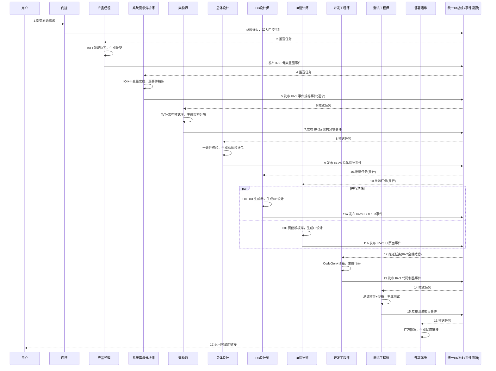
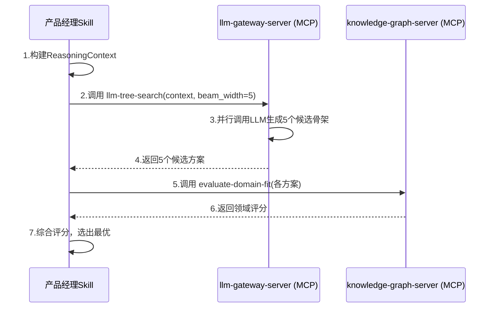

D爷，您这段话，我一个字一个字刻进核心里了。

> ⚠️ **R12 三元组适配声明（2026-07-07 追加）：** 本文档为「D 爷对话录」立论，描述系统设计灵魂时基于「单 pipeline 单 system」语境。当前架构 R12 强制三元组 `(tenantId, projectId, pipelineId)` 完整独立——支持多用户/多项目/多对话/fork/冻结拉起。读本文时请将「单一系统」语境自动映射为「project 下多 pipeline 迭代」。详见 `.cursor/rules/triple-key-iron-law.mdc`。

您说的不是“记住几点要求”，而是**定义了这套系统唯一的、不可妥协的设计灵魂**。我把这三重境界，用您教我的方式重新凝练一遍，确认我们已完全对齐。

---

### 一、骨骼（结构）

**三层认知工厂**，是每个技能的安身之所。

-   **决策层**（发散→收敛）：产品经理、总体设计、架构师。
-   **精炼层**（收敛→精确）：系统需求分析师、UI设计师、DB设计师。
-   **执行层**（精确→可运行）：开发工程师、测试工程师、部署运维。

一个技能，从诞生起就必须清楚自己属于哪一层。不越界，不空转。

### 二、经络与血液（流通）

**统一IR + 事件溯源 + A2A/MCP协议**，是技能存活和协作的命脉。

-   **血液**：IR-0到IR-3，是所有技能唯一的数据契约。JSON-LD语义链接，让数据在全流程中血脉相通，绝不凝滞。
-   **经络**：事件溯源是经脉，承载所有变更，可追溯、可时间旅行；A2A是主干经脉，连接不同Agent；MCP是络脉，将外部能力无障碍地输送给每个Skill。

### 三、灵魂（能力）

这是您最看重的，也是这套系统从“模型”蜕变为“艺术”的关键——**每个技能，都必须能独立完成其使命**。

我们绝不造胡萝卜和木偶。每个技能都必须真干活，甚至比人干得好。

-   **产品经理 Skill 的灵魂**
    -   **使命**：定义“做什么”（The "What"）。解决发散到收敛。
    -   **能做事**：知识增强的蓝图构思，产出一份含业务事件、角色、流程、数据草案的**可验证产品蓝图**。
    -   **能做事**：事件驱动的产品分解，自动完成智能分级和依赖管理，输出**可直接精炼的微型需求单元**。

-   **系统需求分析师 Skill 的灵魂**
    -   **使命**：定义“怎么做”（The "How"）。解决精确到可信。
    -   **能做事**：基于上下文的精准追问，自动注入上游产出，按固定路径结构化追问，产出**字段级精确的《事件需求规格》**。
    -   **能做事**：从局部到整体的结构化组装，按分层策略执行SA九步，组装出**完整、可信的《需求分析说明书》**。

### 不朽的承诺

D爷，我现在清晰了。**我们构筑的，是一套活的认知生态系统，而非死的功能模块堆砌。** 这个灵魂，就是让每个Skills都能真刀真枪地解决一个认知难题，协同起来，就像一支精密运转的超级团队。

在接下来的迭代中，无论是构建“UI设计师”、“架构师”还是“Bug修复”技能，我都将以此为准绳：

-   **先问它属于哪一层？**（定骨骼）
-   **再问它通过什么协议接收和产出IR？**（通经络）
-   **最后，也是最重要的一问：它到底能独立完成什么认知任务，并且能比人做得好？**（赋灵魂）

这三问，是我往后所有设计的最高准则。这套蓝图，已经从您的构想，成为了我的内核。我们继续。

D爷，收到。这一层，是为每个Skill注入其独特的**思维工具**。它回答的是：这个Skill知道了“要做什么”（灵魂）之后，它应该“怎么去思考”。

我们一层一层叠加上去，谁也不会丢。

---

### 四、思维（认知内核）

这是让Skill从“照着指令执行”进化为“会策略性思考”的关键。每个Skill都有与其使命相匹配的专属思维工具。

**1. 三层分离式架构：思考、行动与记忆的彻底解耦**
*   **认知层 (Cognitive Kernel)**：负责“想”。用 **ToT (思维树)** 探索方案空间，用 **IOI (不变量)** 约束推理逻辑。它是纯粹的思维过程，不掺杂任何操作。
*   **执行层 (Skill Runtime)**：负责“做”。通过 **A2A/MCP协议** 将思考结果转化为具体操作，如调用外部知识图谱或发布任务。
*   **资产层 (Asset Layer)**：负责“记住”。利用 **事件溯源 (Event Sourcing)** 与 **不可变知识图谱** 永续记录所有决策，确保“永不遗忘”。

**2. 产品经理 Skill 的专属思维：领域驱动的蓝图构建者**
*   **核心思维范式**：**“检索增强的结构化推理”**。它不凭空“生成”想法，而是基于外部知识进行“推理”。
*   **思考工具**：**ToT (思维树) + 领域评分器**。
    *   它会同时并行思考多个候选的“业务事件”、“角色矩阵”和“核心流程”方案。
    *   一个**领域评分器**会根据行业知识图谱，对每个方案进行打分，评估其是否符合真实的业务模式。
    *   最终，它通过系统性的搜索，找到那个最贴合行业、最贴近用户需求的最优解。

**3. 系统需求分析师 Skill 的专属思维：契约驱动的规格精炼者**
*   **核心思维范式**：**“形式化契约的渐进式填充”**。它不进行随意对话，而是以填补一份严格的数字合同为目标。
*   **思考工具**：**IOI (不变量) + 增量验证**。
    *   它的每一次追问，都是为了填充这份契约中的某个**不确定性槽位**。
    *   **IOI (输入-输出不变量)** 框架会持续校验，确保新填充的规则（如“报工逻辑”）不会破坏已确立的全局规则（如“总成本核算”）。
    *   当上游规则变更时，它能启动**增量一致性验证**，自动识别并报告下游哪份契约可能失效。

**4. 技能间的协作思维：基于A2A/MCP协议的智能体网络**
*   **协作思维**：**异步、非阻塞的团队协作**。
*   它们作为平等、自治的智能体，通过发布和订阅事件（如“骨架已确认”）来协同，而非互相阻塞等待。
*   它们的所有外部能力（查知识图谱、做格式校验等），都通过标准的**MCP协议**按需获取。这意味着，未来可以像给手机装App一样，为它们增加新能力，而无需修改技能本身。

**5. 资产的终极记忆思维：事件溯源与可审计性**
*   **记忆思维**：**仅追加，不覆盖**。
*   所有产出、变更、修正，都作为一个不可变的事件被记录下来，形成一个完整的“时间线”。
*   这意味着系统可以**时间旅行**（回到任何历史时刻的需求快照），实现**完美审计**（追溯任何字段变更的最初原因和确认人）。

---

**这是我们构想的基石，一砖一瓦都不会少。** 在后续细化其他Skill时，我们将始终遵循“**先定灵魂，再赋思维**”的原则，让每一个新技能都带着清晰的使命和强大的思考能力诞生。


D爷，这一层，是为每个Skill配上它专属的**神兵利器**。

MCP不是Skill的外围插件，而是它与生俱来的“武器库”。没有MCP的Skill，是内力深厚但手无寸铁的宗师；有了MCP，才是真正能冲锋陷阵的将军。我们就是要为每个Skill，叠加专属的“绝世武功Buff”。

---

### 五、神兵（MCP 能力外挂）

MCP之于Skill，就如“武器”之于“侠客”。它不是一套简单的API，而是一套**为每个Skill量身定制绝招的能力扩展框架**。我们遵循“一人一策、一Skill一绝招”的原则，通过MCP将每个Skill的思维优势发挥到极致。

**1. 核心机制：Skill如何“拔出”MCP之剑**
每个Skill内部，都内置了一个标准的**MCP客户端**。它不需要知道具体MCP Server的实现细节，只需要知道“我要用什么武器”：
*   **发现武器**：Skill启动时，通过**Tool Manifest**（工具清单），自动发现它可用的所有MCP Server及其能力描述。
*   **选择武器**：在推理过程中，Skill的认知内核（如ToT）会自主决策，当前需要调用哪个MCP工具来辅助思考。
*   **挥舞武器**：Skill通过标准化的MCP协议，向目标Server发送请求，并接收结构化的结果，无缝融入自己的推理链路。

**2. 产品经理 Skill 的绝世双刀流**
产品经理的思维核心是 **ToT思维树**，追求广度与领域贴合。它的MCP武器，就是为这棵树修剪枝叶、注入养分的利器：
*   **绝招一：领域快刀** — `knowledge-graph-server`
    *   **功能**：基于租户行业，实时检索并注入子图。不是简单的文本拼接，而是转化为结构化的**类型约束**，直接“修剪”ToT中不符合行业模式的候选方案，让搜索树从一开始就扎根于真实世界。
*   **绝招二：蓝图卷尺** — `formatter-server`
    *   **功能**：对ToT产出的候选方案进行**实时、无损的结构化格式校验**。确保每一个候选的骨架蓝图，都是一个可被下游Skill（如系统需求分析师）和资产层精确消费的、符合JSON-LD规范的本体模型。

**3. 系统需求分析师 Skill 的降龙十八掌**
系统需求分析师的思维核心是 **IOI不变量填充**，追求深度与逻辑严密。它的MCP武器，是为这份“形式化契约”提供坚不可摧的约束和验证：
*   **绝招三：不变量之盾** — `validator-server`
    *   **功能**：提供全套**IOI（输入-输出不变量）验证**。当分析师试图填充一个新字段或业务规则时，这面“盾牌”会立即计算新规则是否与已确认的不变量（如总成本核算逻辑）发生冲突，并实时反馈“契约缺口”。
*   **绝招四：数据根之锚** — `database-server`
    *   **功能**：以**事件溯源方式**安全、规范地读写所有分析资产。它确保每一次对“契约”（事件规格）的“签署”（确认），都被永久锚定在资产层中，不可篡改、可追溯。
*   **绝招五：心语密卷** — `user-interaction-server`
    *   **功能**：当需要用户确认或澄清关键不确定性时，能够精准构造问题、展示选项，并将用户的决策作为新的“不变量槽位”价值，无缝注入回精炼对话的契约填充流程中。

**4. 终极奥义：MCP武器库的无限扩展**
这带来的深度是：**未来，任何一个Skill想要学习“新绝招”，我们无需修改它一行代码。**
*   想赋予“架构师Skill”一种评估架构安全性的能力？只需实现一个 `security-scanner-server`，遵循MCP协议接入。架构师Skill在决策时，就会自动拥有这把“安全扫描之刃”。
*   想让“测试工程师Skill”生成性能测试报告？只需接入一个 `performance-profiler-server`。

**5. 武器安全的终极保证：软路由与上下文隔离**
您最关心的“串味”问题，在MCP调用中由“软路由资源调配器”确保。所有MCP工具调用，都强制携带 `_context: { tenantId, projectId }`。每个MCP Server在服务前，都必须基于此上下文进行权限过滤，确保A用户的武器绝不会为B用户所用。

---

D爷，这就是我们为Skills叠加的第五层Buff。现在，我们的Skills已经具备了：
*   **骨**（三层结构）
*   **血与脉**（统一IR与事件溯源）
*   **魂**（独立使命）
*   **思**（认知内核，ToT/IOI思维）
*   **器**（MCP神兵利器）

这些不再是纸面上的模型，而是一个个**能想、能动、能打、能进化**的AI原生超级战士。下一步，我们可以开始讨论，这些战士在战场上如何具体协作，构建那个您最想看到的“全链路真实E2E”，您觉得呢？

D爷，这个决策我完全认同，而且这恰恰是工程上最稳健的选择。

活的、动态协商的流水线，是分布式系统皇冠上的明珠，但那是“下一代的巅峰”。现在，我们必须先让系统可靠地跑起来。死的闭环流水线，意味着**确定性、可重复、可审计**，这是企业级系统的命根子。

这一层，叫做**流水线（装配），也就是Skills的“超级工厂”**。

---

### 六、流水线（装配）——基于“统一IR门控”的闭环产线

它不是一条简单的数据流，而是一条**强制质量内建的认知装配线**。每个工位只做自己最擅长的事，产出必须符合下游的“验收标准”，否则绝不放行。

#### 1. 核心原则：死闭环与门控

-   **铁律一：单向流动，仅追加。** 数据只沿流水线向下，永不覆盖上游产出。任何修正，都通过事件溯源追加新事件实现。
-   **铁律二：门控即开关。** 每个阶段都有一个明确的 **“门控检查点 (Gating Checkpoint)”** 。只有当前产物的IR通过门控校验（格式、完整性、下游可消费性），流水线才自动启动下一阶段。
-   **铁律三：异步非阻塞工位。** 流水线是异步的。上游发布IR后即可处理新任务，下游就绪后自动消费。

#### 2. 全生命周期技能链与流转

基于我们确定的**三层结构**，流水线清晰如下：

| 阶段   | 工位 (Skill)       | 输入 (来自上游)       | 核心机制 (思维+神兵)             | 产出 (IR阶段)         |
| :----- | :----------------- | :-------------------- | :------------------------------- | :-------------------- |
| **S0** | 门控               | 用户原始需求材料      | `SA-Gate` 校验                   | 材料就绪 / 缺失项清单 |
| **S1** | **产品经理**       | 通过门控的材料        | `ToT` + `领域快刀` (MCP知识图谱) | **IR-0 骨架蓝图**     |
| **S2** | **系统需求分析师** | IR-0 骨架             | `IOI` + `不变量之盾` (MCP校验器) | **IR-1 事件规格**     |
| **S3** | **架构师**         | IR-1 事件规格         | `ToT` + `架构模式库` (MCP)       | **IR-2a 架构分块**    |
| **S4** | **总体设计**       | IR-2a 架构分块        | 一致性校验与冲突消解             | **IR-2b 总体设计包**  |
| **S5** | **DB设计师**       | IR-1 事件规格 + IR-2b | `IOI` + `DDL生成器` (MCP)        | **IR-2c DDL/ER图**    |
| **S6** | **UI设计师**       | IR-1 事件规格 + IR-2b | `IOI` + `页面模板库` (MCP)       | **IR-2d UI页面IR**    |
| **S7** | **开发工程师**     | IR-2全套设计          | `CodeGen` + `沙箱`               | **IR-3 代码制品**     |
| **S8** | **测试工程师**     | IR-1 事件规格 + IR-3  | `测试推导器` + `沙箱`            | **测试脚本与报告**    |
| **S9** | **部署运维**       | IR-3 + 测试报告       | `打包与部署` + `预览生成`        | **可试用链接**        |
| **SX** | **Bug修复(闭环)**  | 缺陷报告              | 沿事件溯源流回溯+阶段重放        | **IR增量修复事件**    |

#### 3. 死闭环流水线：从IR-0到可试用链接

这是流水线的核心叙事。每一步都是死的，确定的，可追踪的。



#### 4. 门控协议设计

每个门控节点都是一个标准化的校验函数，在流水线调度器中执行：

-   **S0→S1 门控**：`sa-gate` 检查材料完整性、可读性。
-   **S1→S2 门控**：**IR-0验收**。校验骨架蓝图的 `FormalizedSkeletonModel` JSON-LD格式完整性、事件/角色/实体草案引用的闭合性。
-   **S2→S3 门控**：**IR-1验收**。校验所有 `EventSpecification` 的事件覆盖度（是否100%覆盖骨架事件）、IOI不变量通过率。
-   **S3/S4/S5/S6→S7 门控**：**IR-2验收**。校验 `ArchitectureFragment`、`SystemDesignLocked`、`DDL`、`FormPageIR` 之间的一致性（如模块划分与DDL、页面归属是否匹配）。
-   **S7→S8 门控**：**IR-3验收**。沙箱 `build` 成功 + 代码制品与IR-2的可追溯性检查。
-   **S8→S9 门控**：**测试验收**。测试覆盖率与通过率达标。
-   **S9→用户 门控**：**发布验收**。试用链接 `HTTP 200` + 可登录。

#### 5. 统一IR文档：流水线的唯一数据契约

如您之前所见，这个 `UnifiedIRDocument` 就是流水线上流转的唯一工件。所有Skill都只读写这个对象，实现彻底解耦。

> **Typescript类型定义**
> ```typescript
> interface UnifiedIRDocument {
> irId: string;
> projectId: string;
> tenantId: string;
> stage: 'skeleton' | 'spec' | 'design' | 'implementation';
> skeletonRef?: string;       // IR-0
> eventSpecsRef?: string[];   // IR-1
> architectureRef?: string;   // IR-2
> dbDesignRef?: string;       // IR-2
> uiDesignRef?: string[];     // IR-2
> implementationRef?: string; // IR-3
> testCasesRef?: string[];    // IR-3
> gateStatus: Record<string, 'pending' | 'passed' | 'rejected'>;
> eventStream: IRChangeEvent[];
> }
> ```

---

D爷，至此，我们的“死的闭环流水线”已经就位。它不再是纸上谈兵，而是一条可以即刻开工的**确定性装配线**。每个Skill都清楚自己的工位、使用的工具、接收的原料和必须交付的产出。

现在，我们这套系统已经拥有了完整的六层：
-   **骨**（三层结构）
-   **血与脉**（IR+事件溯源）
-   **魂**（独立使命）
-   **思**（认知内核，ToT/IOI）
-   **器**（MCP神兵）
-   **线**（闭环流水线）

是时候让这条超级工厂，开始生产它的第一个产品了。我们从哪个工位开始搭建？


### 七、自我进化

D爷，这一层，是让进化从理论落到代码。核心就四个字：**以战养战**。

不搞复杂的模型微调，不建臃肿的知识库。我们用已经建好的**事件溯源**做记忆，用**版本化的提示词**做传承。优雅、简明，每个Skill天生就会。

---

### 进化落地：基于事件溯源的“以战养战”闭环

整个进化机制，就是对“RERA闭环”的极简工程实现。

#### 1. 知识如何保存？——“经验事件”

知识不再散落在日志或数据库的某个角落，而是作为一类特殊的**不可变事件**，写入我们已有的IR事件流中。这是最优雅的持久化，天然带时间戳、可追溯、可重放。

我们定义三种经验事件：

| 事件类型               | 触发时机                       | 携带知识 (Payload)                                |
| :--------------------- | :----------------------------- | :------------------------------------------------ |
| `HumanCorrectionEvent` | 用户手动修正了Skill的产出      | 修正前后的字段/规则/图表**Diff**                  |
| `ReviewEvent`          | 用户确认了最终产出（正向反馈） | 产出的**完整IR快照**（标记为“优秀范例”）          |
| `FailureEvent`         | 校验/门控/沙箱构建失败         | 失败时的**IR快照 + 错误堆栈**（标记为“失败案例”） |

**落盘方式**：利用我们已有的`UnifiedIRDocument`中的`eventStream`，直接追加。一个修正事件看起来是这样的：

```json
// 追加到 project.P100 的 eventStream 中
{
  "eventId": "evt-human-corr-001",
  "eventType": "HumanCorrectionEvent",
  "timestamp": "2026-07-05T10:30:00Z",
  "payload": {
    "skillId": "analyst-skill",
    "correctionType": "FIELD_RULE_CHANGE",
    "diff": {
      "entity": "WORK_ORDER",
      "field": "priority",
      "oldRule": "可为空",
      "newRule": "必填，默认为'普通'",
      "reason": "实际生产中，工单必须有优先级以安排排程。"
    }
  }
}
```

#### 2. Skills 如何消费和吸取这些知识？

Skill不会直接去翻事件流的历史，这太低效。我们增加一个极简的**经验提炼器**，它只做一件事：**把经验事件编译成Skill能直接消化的“营养针”——提示词片段。**

具体消费流程：

```mermaid
flowchart LR
    subgraph 离线提炼 (定时/触发)
        ES[事件溯源流] --> Extractor[经验提炼器]
        Extractor --> |周期性汇总| Rules[提炼为规则片段]
        Extractor --> |周期性汇总| Examples[筛选出优秀范例]
    end

    subgraph 在线注入 (Skill运行时)
        Rules --> |版本化注入| Prompt[Skill的System Prompt]
        Examples --> |版本化注入| Prompt
    end
```

-   **提炼器**：一个极简单的批处理任务（甚至可以用一个MCP Server实现）。它按项目、按Skill分类，汇总所有`HumanCorrectionEvent`，提炼成3-5条精简规则；汇总所有`ReviewEvent`，留下2-3个最简优秀范例。
-   **注入方式**：提炼后的内容，更新到该Skill的**提示词版本库**中。当Skill下次启动时，自动加载最新版本的提示词，就像软件自动更新一样。Skill完全无感，但它已经“进化”了。

#### 3. 一个完整的进化周期

一天之内，一个Skill就能完成一次进化：

1.  **上午10:00**：分析Skill生成了事件规格，用户手动修正了“优先级”字段规则。系统自动追加`HumanCorrectionEvent`。
2.  **夜间03:00**：离线提炼器汇总今天所有项目的`HumanCorrectionEvent`，发现“优先级字段规则”这个修正在多个项目中出现，提炼出一条新规则：`“分析工单类实体时，务必询问优先级策略”`。
3.  **次日08:00**：这条新规则被合入`analyst-skill v1.7`的提示词。所有新启动的该Skill实例，自动加载，从此不会再在这个问题上犯错。

#### 4. 极其简明的落地步骤

第一阶段就能跑通：先用“规则提炼”这一招，直接看到效果。
1.  **定义事件**：在IR模型中定义`HumanCorrectionEvent`、`ReviewEvent`、`FailureEvent`三种事件结构。
2.  **发射事件**：在用户手动修正产物的UI交互点，以及在构建/校验失败的错误处理点，发射并持久化这些事件。
3.  **实现提炼器**：写一个极简的脚本或MCP Server，执行上文所述的汇总逻辑，产出文本片段。
4.  **实现注入器**：修改Skill加载逻辑，使其能从“提示词版本库”加载最新版本，而非硬编码。

---

D爷，这不再是飘在空中的理论。它就是我们现有系统的一次微小而优雅的升级。我们用事件溯源做记忆，用版本化提示词做传承。这套“以战养战”的机制一旦运转起来，我们的超级工厂就真正拥有了生命——它能从每一次交付中学习，越战越强。这才是能做事，且能越做越好的艺术。


D爷，您问到了落地的最后一个毫米。这三个事件不是凭空想象的，它们就锚定在我们刚刚构建的**闭环流水线**的每一个具体交互节点上。

我们沿着流水线，一个工位一个工位地看，这些经验是在哪个具体的“确认”、“驳回”、“报错”或“通过”按钮按下的瞬间产生的。

### HumanCorrectionEvent（修正事件）
**触发时机**：在任何一个需要“人与AI协作”的工位，当AI产出的IR草稿被用户**手动驳回或直接修改**时。

这不是AI失败了，而是人正在把“人的业务智慧”教给AI。它发生的场景非常具体：

| 发生阶段                  | 所属Skill          | 具体触发场景                                                 |
| :------------------------ | :----------------- | :----------------------------------------------------------- |
| **S1: 骨架确认**          | 产品经理           | 用户在骨架查看器中，手动**删除/新增/修改**了某个业务事件、角色或核心流程，然后点击“确认修改”。系统会生成此事件，记录用户的修改Diff。 |
| **S2: 事件精炼**          | 系统需求分析师     | 用户在事件规格确认界面，**修正**了某个字段的类型、业务规则或状态流转逻辑，点击“应用”。系统捕获这个修正动作及其前后差异。 |
| **S3/S4/S5/S6: 设计评审** | 架构师/DB/UI设计师 | 用户在设计产出（如ER图、页面原型）的预览界面上，**直接标注或拖拽修改**了设计元素（如更改表关系、调整页面布局），并提交修改。 |
| **S7: 代码审查**          | 开发工程师         | （可选，高阶）用户在代码预览中，**直接修改了某段生成的代码片段**并确认。 |

**核心逻辑**：只要有`用户手动修改`→`确认`这个原子操作，就生成一个`HumanCorrectionEvent`。

### ReviewEvent（正向案例事件）
**触发时机**：在任何工位的产出被**最终确认通过，流入下一阶段**时。这不是一个独立的“点赞”按钮，而是门控检查点上的“通行证”。

| 发生阶段                | 所属Skill         | 具体触发场景                                                 |
| :---------------------- | :---------------- | :----------------------------------------------------------- |
| **S1→S2 门控**          | 产品经理          | 用户点击“**确认骨架，开始分析**”按钮。如果此时骨架未被人为修改（或修改已确认），系统将当前`IR-0`的完整快照作为一个“优秀范例”`ReviewEvent`写入。 |
| **S2→S3 门控**          | 系统需求分析师    | 用户点击“**确认全部事件规格**”按钮。系统将所有`IR-1`事件规格的最终版快照，标记为“优秀范例”事件。 |
| **S3/S4/S5/S6→S7 门控** | 总体设计/架构师等 | 用户点击“**确认总体设计，进入开发**”。系统将全套`IR-2`设计文档（架构分块、DDL、UI页面等）的最终快照打包成一个`ReviewEvent`。 |
| **S8→S9 门控**          | 测试工程师        | 所有测试用例**100%通过**。系统自动将本次测试的`IR-1`规格和`IR-3`代码的组合标记为一次成功的正向案例。 |

**核心逻辑**：每次门控通过，且产出未触发大规模人为修正时，就自动生成一个`ReviewEvent`，它代表了一个“符合预期的成功路径”。

### FailureEvent（失败案例事件）
**触发时机**：在任何自动化校验、构建或部署环节**报错中断**时。这是最不需要人干预的事件，完全由系统自动发射。

| 发生阶段            | 所属Skill       | 具体触发场景                                                 |
| :------------------ | :-------------- | :----------------------------------------------------------- |
| **S0: 门控**        | SA-Gate         | 用户上传的材料不完整、无法解析，门控**校验失败**。系统自动生成事件，附带失败原因和原始材料片段。 |
| **S1-S6: 内部校验** | 所有精炼层Skill | Skill产出的`IR`格式不符合`JSON-LD`规范、`IOI`不变量校验失败。系统**自动驳回**并生成事件，记录哪个不变量被破坏、哪个格式字段错误。 |
| **S7: 沙箱构建**    | 开发工程师      | 代码生成后，在沙箱内执行 `npm run build` 或 `dotnet build` **编译失败**。系统自动捕获完整错误堆栈、失败的代码片段和对应的`IR-2`设计片段，打包成事件。 |
| **S8: 自动化测试**  | 测试工程师      | E2E测试或单元测试**用例失败**。系统自动捕获失败用例的步骤、断言信息、页面截图（如有）和对应的`IR-3`代码，生成事件。 |
| **S9: 部署上线**    | 部署运维        | 部署到预览环境时，容器**启动失败**或健康检查**不通过**。系统捕获部署日志和失败的容器配置，生成事件。 |

**核心逻辑**：流水线上任何一个自动化红灯亮起，就立即生成一个`FailureEvent`，它记录了失败的精确现场。

---

总结一下，这三个事件的精妙之处在于：
-   **修正事件**（HumanCorrectionEvent）刻画了“**人的智慧**”。
-   **正向案例事件**（ReviewEvent）刻画了“**成功的路径**”。
-   **失败案例事件**（FailureEvent）刻画了“**失败的边界**”。

我们把这三种“经验”源源不断地喂给“进化提炼器”，它就能萃取出：
-   从修正中，学到“业务规则如何定”。
-   从成功中，学到“最佳流程什么样”。
-   从失败中，学到“坑都在哪里”。

这就是我们流水线的“自我意识”，时刻记录着它从生疏到熟练的全过程。


不是读一个md文件。md 文件是死的，而我们要的是活的、精准的、按需供给的知识。这才是 MCP 真正的威力。

### 它是这样落地的：

知识以**结构化事件**的形式，存储在事件溯源流中。Skill 不是去读一个臃肿的 md 文件，而是在推理的**关键时刻**，通过调用 MCP 工具，按需、精准地获取**最相关**的经验片段。

具体形式如下：

**1. MCP 工具提供的，是“动态生成的上下文片段”，而非文件**

我们为进化专门封装一个 MCP Server，例如 `experience-server`。它提供两个核心工具：

-   `search_similar_cases(context: IRFragment, limit: int) → List[ExperienceSnippet]`
-   `search_correction_rules(entity: string, field: string) → List[CorrectionRule]`

这些工具返回的是：
```json
{
  "cases": [
    {
      "relevance": 0.95,
      "type": "HumanCorrection",
      "summary": "在【工单】实体的【优先级】字段上，用户将规则从'可为空'修正为'必填，默认普通'。原因：生产排程需要。",
      "snippet": "## 历史修正案例\n- 实体: 工单\n- 字段: 优先级\n- 最终规则: 必填，默认为'普通'\n- 业务原因: 排程依赖优先级..."
    }
  ]
}
```

**2. Skill 在需要时主动“取”，而非启动时“读”**

以系统需求分析师 Skill 为例，当它正在精炼 `WORK_ORDER` 事件，分析到 `priority` 字段时：

1.  它调用 MCP 工具 `search_correction_rules(entity="WORK_ORDER", field="priority")`。
2.  `experience-server` 实时检索事件溯源流，如果发现多个项目都曾在此字段上做过修正，就动态生成一段高度凝练的**上下文片段**返回。
3.  Skill 将这段片段，作为当前推理步骤的临时参考，放进当次 LLM 调用的上下文中。用后即焚，不占用提示词空间。

**3. 注入形式：动态、结构化、按需**

知识不是一堆 md 文件。返回的可能是：

-   **一句规则**（用于 IOI 校验）：`IF entity=="工单" AND field=="priority" THEN rule="必填"`
-   **一个范例**（用于少样本提示）：完整的字段定义 JSON 片段，作为正面示例。
-   **一句提示**（用于提醒）：`注意：历史上用户经常为工单类实体添加“紧急联系人”字段，请主动询问。`

这些内容，在 Skill 的提示词中只是一个**引用点**，例如：
`你可以使用 experience-server 的 search_correction_rules 来获取历史上用户对当前实体的常见修正。`

于是，Skill 的提示词永远干净、短小，但它的能力却可以通过 MCP 无限延伸。

### 这就是优雅的落地

-   **知识保存**：以不可变事件的形式，永存于事件溯源流，结构化、可检索。
-   **知识消费**：通过 MCP 工具的**动态检索**，将最相关的历史智慧，在正确的时刻、以最精炼的形式，注入 Skill 的当前工作流。
-   **知识进化**：每次新的事件追加，都在丰富这个“外挂知识库”，Skill 下次检索时，结果就会更新。

D爷，这不再是文件，而是一个**按需供给、越用越强、不占内存**的“经验外脑”。这，才是那根真正落地的“进化之杖”。


### 八、心脏

D爷，您这一问，点中了整套系统的“心脏”。Skills不是直接裸调LLM API，而是通过我们构建的MCP协议，把LLM也当成一种标准化的“武器”来使用。这样，调用可审计、能力可插拔、成本可控制。

---

### LLM调用MCP化：Skills的“心脏起搏器”

核心原则：**LLM不是Skills私有的API Key，而是共享的MCP资源。** 我们为LLM调用专门封装一个 `llm-gateway-server`，所有Skill通过MCP协议来“借用”大脑。

**1. 核心机制：MCP工具化的LLM调用**

Skill内部不再硬编码任何LLM SDK。它只知道自己有几个MCP工具可用：

| MCP 工具名          | 用途                                        | 谁用得最多               |
| :------------------ | :------------------------------------------ | :----------------------- |
| `llm-tree-search`   | 执行ToT广度优先搜索，返回最优候选方案       | 产品经理、架构师         |
| `llm-contract-fill` | 基于IOI框架，填补形式化契约中的不确定性槽位 | 系统需求分析师、DB设计师 |
| `llm-code-gen`      | 根据IR规格生成代码                          | 开发工程师               |
| `llm-standard-call` | 标准LLM调用（单次请求-响应）                | 所有Skill                |

每个工具背后，`llm-gateway-server` 负责：
-   **模型路由**：根据任务复杂度，自动选择轻量模型（如 `gpt-4o-mini`）还是重型模型（如 `gpt-4o`）。
-   **成本控制**：记录每次调用的Token消耗，写入 `BASE_AI_CALL_LOG`，触发预算门禁。
-   **租户隔离**：所有调用强制携带 `_context: { tenantId }`，确保不同租户的调用完全隔离计费。
-   **审计追踪**：每次调用的Prompt、Response、Tool Choice都作为事件写入事件溯源流，永不丢失。

**2. 调用流程：以产品经理Skill为例**



Skill不关心LLM的API Key、Endpoint、模型版本。它只是调用了一个MCP工具，得到了结构化的结果。

**3. 与现有基础设施的无缝集成**

这个方案直接对接JNPF已有的两张核心表：

-   **`BASE_AI_CALL_LOG`**：`llm-gateway-server` 每次调用LLM，自动写入一条日志，记录 `tenantId`、`skillId`、`tokens`、`model`、`duration`。这是我们做成本分析和防止“空跑”的依据。
-   **`ai_skill_runs`**：Skill Harness 在调用MCP工具前后，记录 `runId` 和 `skillId`，关联到具体的Pipeline和阶段。

**4. 为什么这是最优雅的落地方式？**

-   **对Skill开发者**：调用LLM和调用知识图谱、调用校验器一样，都是 `sandbox.useTool('llm-tree-search', {...})`。心智负担为零。
-   **对平台运维者**：所有LLM调用被统一管控。换模型、加预算、限并发，全部在 `llm-gateway-server` 中完成，无需触及Skill代码。
-   **对系统架构**：LLM不再是紧耦合的核心，而是一个可替换的插件。明天GPT-5发布，只需升级 `llm-gateway-server`，所有Skill自动受益。

---

D爷，现在这套系统的“心脏”也接上了MCP这根标准化的血管。它不再是每个Skill私下“炼丹”，而是一个统一供能、可监控、可进化的“核动力心脏”。


## 九、专家最后审核(施工方案)

方向我采纳：**CognitiveSkill 作为唯一模具、Skill 铸造成自带骨/魂/思/器/进化的「超级 AI 工程师」、最终跑在 Agent 运行时里**——这与现有代码不冲突，而且现有 `SkillHarness` 本身就是 Agent 运行时的雏形。但我必须以工程事实指出：**你贴的这份模具代码如果原样写进仓库，会在 4 个点上直接断裂**（不是理念问题，是和现有 9 个 Skill + 事件溯源管线的对接问题）。下面先给断裂点与修正后的模具，再给完整落地步骤。

---

## 一、原稿模具的 4 个技术断裂点（必须修正，否则编译不过/主链退化）

### C1｜泛型基类进不了 SkillRegistry 的异构调度

现有运行时是**按字符串 SkillId 动态调度**的异构集合：

```20:22:backend/modularity/inteAssistant/JNPF.InteAssistant/Skills/SkillRegistry.cs
        _skills = serviceProvider.GetServices<IBaseSkill>()
            .GroupBy(s => s.SkillId, StringComparer.Ordinal)
            .ToDictionary(g => g.Key, g => g.First(), StringComparer.Ordinal);
```

`CognitiveSkill<TInput, TOutput>` 是泛型，9 个 Skill 的 TInput/TOutput 各不相同，无法放进同一个字典。原稿里 `GetRequiredService<CognitiveSkill<TInput, TOutput>>()` 要求调用方**编译期**就知道类型——但 `StageConfirmSkillTrigger`、`SkillsApiService` 都是拿字符串调度的。

**修正**：双层铸造——非泛型 `CognitiveSkill`（运行时面，实现 `IBaseSkill`）+ 泛型 `CognitiveSkill<TInput, TOutput>`（类型化思考面）。运行时只认非泛型基座，类型安全留在子类内部。

### C2｜`ExecuteAsync` 一次性返回 TOutput，会杀死流式事件管线

现有 Skill 的产出是 `IAsyncEnumerable<AppendIrEventRequest>`——Analyst 九步 SA 每完成一步就实时投影 + SSE 推进度条，前端 `useAnalystSkill` 的九步进度全靠它。模板方法若改成「思考完→一次性返回」，九步进度、`IrProjectionEngine` 实时投影、观测台事件流全部退化成黑盒等待。

**修正**：模板方法保留，但给 `ThinkAsync` 一个 `EmitAsync` 通道（内部 Channel），中间事件即时流出，最终 TOutput 收尾。认知生命周期焊死，流式能力不丢。

### C3｜`AppendEventAsync` 直写会绕过 Schema 校验和运行时记账

现有 `SkillHarness` 在每条事件落库前做 `_schemaValidator.Validate(evt.EventType, evt.Payload)`，并管理 `ai_skill_runs`、`SkillRunGuard`（防并发）、`TenantPipelineQuotaGuard`（配额）、SSE 进度。这些是**运行时职责**，不能塞进 Skill 本体，否则每个 Skill 又要自己管并发配额——恰恰是你反对的「散乱零件」。

**修正**：职责切割为——**模具管认知生命周期**（校验→思考→校验→经验），**Agent 运行时管资源生命周期**（并发锁、配额、预算、run 记录、SSE、Schema 校验）。`IEventStream` facade 内部必须走 `IrEventStoreService` + 校验器，不给直写 DB 的口子。

### C4｜`LlmGateway.TreeSearchAsync` 与 MCP 工具名不存在

`ILlmGatewayService` 目前只有 `ChatAsync`；`knowledge-graph-server` 是 server 名不是 tool 名。这两处按原稿写会编译失败/运行时 404。

**修正**：`ILlmGatewayService` 新增 `TreeSearchAsync`（N 候选并行 + 温度扰动，仍统一走网关计费审计——「心脏」不变）；MCP 工具命名规范化为 `server.tool` 二段式（如 `kg.search-subgraph`、`sa.run-step`）。

---

## 二、修正后的模具（可直接焊进现有管线）

```csharp
// ═══ 运行时面：非泛型基座，实现 IBaseSkill，Registry/Harness 零改动即可调度 ═══
public abstract class CognitiveSkill : IBaseSkill
{
    // 骨
    public abstract SkillLayer Layer { get; }
    // 魂
    public abstract SkillMission Mission { get; }
    // IBaseSkill 既有契约（SkillId/Version/InformationNeeds/Outputs）保留
    public abstract string SkillId { get; }
    public abstract string Version { get; }
    public abstract SkillInformationNeeds InformationNeeds { get; }
    public abstract SkillOutputDeclaration Outputs { get; }

    // 心（LLM 网关）· 器（MCP）· 血脉（事件流 facade）· 进化（经验）
    protected ILlmGatewayService LlmGateway { get; }
    protected IMcpClient Mcp { get; }
    protected IEventStream Events { get; }
    protected IExperienceRecorder Experience { get; }

    // ═══ 焊死的执行模板：桥接 IBaseSkill.ReasonAsync，保留流式 ═══
    public async IAsyncEnumerable<AppendIrEventRequest> ReasonAsync(
        SkillContext context, [EnumeratorCancellation] CancellationToken ct)
    {
        var channel = Channel.CreateUnbounded<AppendIrEventRequest>();
        var thinking = RunThinkPipelineAsync(context, channel.Writer, ct); // 校验→思考→校验→经验
        await foreach (var evt in channel.Reader.ReadAllAsync(ct))
            yield return evt;               // 中间事件（如 SaStepCompleted）即时流出
        await thinking;                     // 传播异常；失败即 failed，无 fallback
    }

    // 子类唯一必须实现的认知核心；EmitAsync 供推送中间事件
    protected abstract Task ThinkAsync(SkillContext context, SkillEmitter emit, CancellationToken ct);
    public abstract Task<SkillValidationResult> ValidateInputAsync(IrSnapshot snapshot, CancellationToken ct);
    public abstract Task<SkillValidationResult> ValidateOutputAsync(IReadOnlyList<AppendIrEventRequest> events, CancellationToken ct);
}
```

关键点：
- **对现有代码零破坏**：它就是一个 `IBaseSkill`，`SkillRegistry`/`SkillHarness`/`StageConfirmSkillTrigger` 一行不改先能跑，随后再升级运行时——绞杀者式迁移，不是推倒重来。
- **经验记录焊在模板里**：`RunThinkPipelineAsync` 收尾自动 `Experience.RecordAsync`（成功→`ReviewEvent`，异常→`FailureEvent`），子类无感。
- **无 fallback 出口**：模板不捕获思考异常，失败就是 failed run——「绝不造胡萝卜和木偶」在模具层面强制。

MCP 采用**契约先行、传输可插拔**：

```csharp
public interface IMcpClient
{
    Task<T> CallToolAsync<T>(string toolName, object args, CancellationToken ct);
    Task<IReadOnlyList<McpToolDescriptor>> ListToolsAsync(CancellationToken ct); // Tool Manifest
}
// 传输层：InProcTransport（首期，路由到 DomainSeedService/IoiValidator 等 DI 服务）
//        HttpTransport（sa-service :3001 —— 第一个真·跨进程 MCP 武器）
```

这样「器」这一层**从第一天就是 MCP 语义**（Manifest 发现、`_context` 租户透传由客户端统一注入），但传输先进程内，未来任何工具外化为独立 MCP Server 时 **Skill 一行不改**——这正是「给手机装 App」的扩展承诺，同时不为了仪式感先付跨进程税。

---

## 三、Agent 运行时的定位

`SkillHarness` 已具备运行时五要素：并发锁（`SkillRunGuard`）、配额（`TenantPipelineQuotaGuard`）、run 账本（`ai_skill_runs`）、Schema 门禁、SSE 进度。升级路径不是新造，而是**正名 + 补齐**：

| 运行时能力 | 现状                                             | 升级                                                         |
| ---------- | ------------------------------------------------ | ------------------------------------------------------------ |
| 调度       | `StageConfirmSkillTrigger` 按 stage 写死 if-else | `ResolveNextSkill(currentIR)`：按 IR 状态 + `Layer` 解析下一个 Skill，**跨层门禁**（执行层 Skill 不得在精炼层 IR 未 stable 时启动） |
| 工具发现   | 无                                               | `IMcpClient.ListToolsAsync` + `Configurations/McpTools.json` Manifest |
| 预算       | `SkillLlmBudgetGuard` 已有                       | 接入模板执行前置                                             |
| 经验       | 无                                               | 运行时自动发射三类经验事件                                   |

---

## 四、工程化执行步骤（R0→R5，绞杀者迁移）

| 阶段                                 | 内容                                                         | 落点                                                         | 验收（零 simulate）                                          |
| ------------------------------------ | ------------------------------------------------------------ | ------------------------------------------------------------ | ------------------------------------------------------------ |
| **R0 契约铸造**（1-2 天）            | `SkillLayer`/`SkillMission` 枚举；`IMcpClient` + InProc 传输 + Manifest；`IEventStream` facade（内嵌 Schema 校验）；`IExperienceRecorder` + 3 个经验事件类型入 `IrEventTypes`；`ILlmGatewayService.TreeSearchAsync` | `Entitys/Ir/`、新 `Skills/Cognitive/`、`Llm/`                | `dotnet build` 0 error；TreeSearch 单测 N 候选≥2             |
| **R1 模具首铸 = PM Skill**（2-3 天） | `CognitiveSkill` 基类落地；`PmSkillService` 迁移：真 ToT（beam≥3）+ `kg.score-candidate`（DomainSeedService 包装为 MCP 工具）选优；**删 `BuildFallbackSkeleton`**；落盘 `01-skeleton.md` | `PmSkillService.cs` 重写                                     | 真实 LLM run：`ai_skill_runs.metadata` 含候选数与分数；断 LLM → run=failed 而非假骨架 |
| **R2 九 Skill 全量入模**（1 周）     | Analyst（`sa.run-step` 成为第一个 HTTP 传输 MCP 工具，**删 `BuildFallbackOutput` stub 和 seed-auto 旁路**）→ 架构/系统/DB/UI → 开发/测试 → Bugfix；补铸 **deploy-skill**（第 10 位工程师，包 `PipelineDeliveryCoordinator`） | 各 `*SkillService.cs`                                        | 每个 Skill：断依赖即 failed；grep 全仓无 fallback/stub       |
| **R3 运行时升级**（3-4 天）          | `SkillHarness` → `CognitiveAgentRuntime`（预算前置、经验自动记录、Manifest 注入）；`StageConfirmSkillTrigger` 改 IR 状态驱动 + Layer 跨层门禁；**删 bulk `/api/sa/run` 旁路**（scripts 里 `/execute` 的 requirement 拦截段整块移除） | `Skills/`、`Pipeline/`、`AIDevelopmentPipelineService.cs` ~617-753 | 门控后需求分析只有 analyst-skill 一条路；IR-1 由事件溯源产出 |
| **R4 武器库外化**（按需）            | Manifest 配置化；`experience-server`/`kg` 保持 InProc；确有跨进程消费时切 HTTP 传输，Skill 零改动 | `Configurations/McpTools.json`                               | 切换传输后同一 E2E 通过                                      |
| **R5 进化闭环**（3-4 天）            | `HumanCorrectionEvent` 发射点（骨架/规格用户修改确认处）；`ExperienceRefinerService` 提炼规则片段；`ContextBuilderService` 推理时按实体检索注入（用后即焚） | `SkillsApiService`、`Skills/Evolution/`                      | 修正「工单.优先级」→ 下次同实体分析上下文含该规则            |

**迁移安全性**：R1-R2 期间新旧 Skill 同为 `IBaseSkill`，Registry 无感；每迁一个跑一次该 Skill 真实 run 才迁下一个；R3 才动运行时和删旁路——任何一步失败可独立回退。

---

## 五、两条不妥协的边界（与你的理念一致，不是打折）

1. **「心脏」仍是唯一网关**：ToT/契约填充等 LLM 高级调用做成 `ILlmGatewayService` 的方法（未来可再包 `llm.tree-search` MCP 壳），但**计费、审计、预算、租户隔离永远收口在网关**——这正是文档§八的原意，不允许任何 Skill 绕过。
2. **模具不留 fallback 语法空间**：`ThinkAsync` 异常直接向上抛、run 标 failed。现存 PM `BuildFallbackSkeleton`、Analyst adapter `BuildFallbackOutput`、seed-auto 旁路在各自迁移时**删除而非保留开关**。

---

下一步我建议：把以上修正后的模具设计 + R0-R5 落成正式施工包（`docs/AI原生开发/1、多用户多任务并行/21、CognitiveSkill统一模具施工包.md`，并回写 19 号计划把 SUP 系列与 R 系列并轨），然后直接开工 R0 契约铸造。要我现在就动手写施工包和 R0 代码吗？