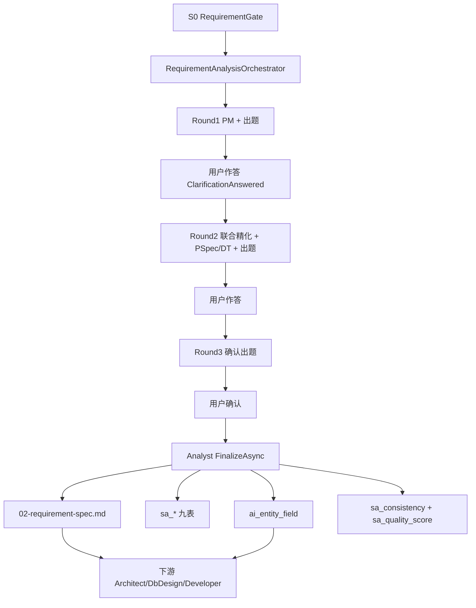

# 需求分析子链重构方案书（修订版）

> **文档性质**：架构总纲（v2.0 极简标准）  
> **版本**：v2.0 | **修订日期**：2026-07-10  
> **状态**：现行实施标准（与 26/27/28 对齐；v1.2 重型管线已废止）  
> **上级约束**：三元组铁律 R12 · ADR-004（S2 compile + C# 物化）· ADR-005（澄清问答）  
> **实施分解**（唯一施工入口）：  
> - [`26、需求分析重构-第一阶段开发计划（数据基座与SA编译增强）.md`](./26、需求分析重构-第一阶段开发计划（数据基座与SA编译增强）.md)  
> - [`27、需求分析重构-第二阶段开发计划（三轮循环与矩阵题）.md`](./27、需求分析重构-第二阶段开发计划（三轮循环与矩阵题）.md)  
> - [`28、需求分析重构-第三阶段开发计划（需求分析书与质量验收）.md`](./28、需求分析重构-第三阶段开发计划（需求分析书与质量验收）.md)

---

## 0. 阅读铁律（后来者必读）

**本文是需求分析子链（S1–S2）的架构总纲。施工细节以 26/27/28 为准；本文与三者冲突时，以 26/27/28 为准。**

| 文档 | 职责 |
|------|------|
| **25（本文）** | 不可协商决策 + 主链路 + 废止清单 + 下游消费契约 |
| **26** | 数据基座（2 表 + 1 VIEW）+ Round 3 工程接线 + LLM 稳定性基建 |
| **27** | 三轮编排器 + PM/联合/确认 prompt + 应用层 LLM 限流/路由 |
| **28** | 需求分析书渲染 + DDD 实时推导 + 一致性/质量评分 + E2E |

### 0.1 对全链条 8–16 号文档的关系

| 文档 | 关系 |
|------|------|
| **9 号（第二阶段）** | 其中 PM/Analyst/sa-service 九步主链描述 **已被本文 + 26–28 取代**；不得再按 9 号旧主链施工 |
| **11 号（第三阶段）** | 设计四 Skill 正文仍有效；**IR-1 / AnalysisCompleted 前置**须按本文 §6 与 28 号验收 |
| **8 / 10 / 12–16** | 非本子链施工包；仅当引用「需求分析产出形态」时，以本文 §6 为准 |

### 0.2 v1.2 → v2.0 废止清单（禁止再实现）

下列项曾出现在本文件 v1.2 正文中，**已全部废止**。后续阶段开发者若按下列方式实现 = 违反现行标准：

| 废止项 | 废止原因 | 现行替代（26/27/28） |
|--------|----------|---------------------|
| 每轮投影 + 每轮 R1–R3 + 每轮 Materializer | 过重；C# 编译毫秒级不值得每轮落库 | **仅 Round 3** 一次性工程保障 |
| `ScannerValidator` 独立模块 + `sa_scanner_validation` | 过度工程 | `LightStructureValidator`（~50 行，内存 WARNING） |
| 确定性出题引擎 + 固定 Q1–Q9 | AI 比规则灵活；行业惯例不问用户 | PM Skill **自主出题**（每轮最多 3 题） |
| `cascadeUpdate` + `sa_event_dependencies` + BFS | C# 全量重编译足够快 | **全量重编译**，无增量依赖图 |
| 5 张 `sa_ddd_*` 表 + 5 个 DDD 增强器 | DDD 是投影维度，不是独立管道 | `DddProjection` **渲染时实时推导**，不落表 |
| `ISaStepEnhancer` / `NoopEnhancer` 等接口族 | 过度抽象 | `Assumption` + `StepEnhancement` 两个 record |
| 独立 `PSpecEnhancer` / `DecisionTableEnhancer` 模块 | 多一次管线 | Round 2 **联合 LLM** 内追加属性 |
| 分批读取 / `RequirementContextBuilder` | 5 事件规模不需要 | 单次读全部内存 SA 产出 |
| M2「SA LLM 分离 + DDD 增强」独立里程碑 | 内容已拆入 27/28 | 无独立 M2 |
| sa-service 写主库做物化 | ADR-004 | Round 3 后 **C# `SaMaterializer`** |

---

## 1. 背景与目标

### 1.1 要解决的问题

| # | 问题 | 现行对策（v2.0） |
|---|------|------------------|
| 1 | PM 只拆骨架、不补行业惯例 | Round 1：PM 作行业专家完善 IR-0，惯例不问用户 |
| 2 | 单线流程、无迭代精化 | 三轮编排器（轻量 for 循环） |
| 3 | 追问浪费用户时间 | 每轮最多 3 题；PM 自主判断问什么 |
| 4 | Analyst 不投影 → 下游断线 | Round 3：`EntityDesignProjector` → **ai_entity_field** |
| 5 | 工程步骤过重拖垮体验 | Round 1/2 **零工程**；Round 3 一次性保障 |

### 1.2 业务目标（不变）

```
质量：  《需求分析说明书》可直接交开发
交互：  ≤ 3 轮 × 3 题；行业惯例不问用户
确定性：SA 7 步纯 C# + PSpec/DT 2 步 LLM 精化（只追加属性）
数据：  Round 3 后 ai_entity_field + sa_* 九表 + assumptions/consistency/quality
性能：  端到端约 9 分钟（含用户作答）；LLM 约 4 次
```

### 1.3 业务优先三问（验收锚点）

- **Q1**：用户在 Studio 提交需求 → 回答最多 9 道澄清题 → 下载《需求分析说明书》  
- **Q2**：产物 = `02-requirement-spec.md` + **ai_entity_field** + **sa_*** 九表 + **sa_assumptions** / **sa_consistency** / **sa_quality_score**  
- **Q3**：`POST /api/studio/skills/requirement-analysis/{id}/run` 三轮闭环 + `GET /api/studio/quality/{id}/score|consistency` + 交付物断言  

---

## 2. 核心架构决策（v2.0 · 不可协商）

### 决策 1：三轮是 AI 迭代精化，不是重型工程管线

```
Round 1：PM 完善 + 自主出 ≤3 题 → SA C# 编译（内存）→ 轻量校验 WARNING → 用户答
Round 2：联合精化（含 PSpec/DT LLM 追加）+ 出 ≤3 题 → SA 全量重编译（内存）→ 用户答
Round 3：确认 LLM + 出 ≤3 题 → 用户确认 → ★ 工程一次性保障（见决策 6）
```

- 编排器：`RequirementAnalysisOrchestrator`（轻量 for 循环，非重型状态机）  
- 挂载点：Analysis 阶段（`POST .../requirement-analysis/{pipelineId}/run`），**不**挂在 S0 `RequirementGateService`  
- 暂停/恢复：复用 ADR-005（`ClarificationRequested` / `ClarificationAnswered`）；stage = `requirement-analysis-round1|2|3`

### 决策 2：产品经理是行业专家

- Round 1 补全行业惯例（不问用户）  
- 只问真正需要业务方决策的模糊点  
- 出题载体：`ClarificationQuestion`（含 `ContextHint` / `DefaultOption` / `QuestionFormat` / `MatrixSubItems`）  
- **禁止**再实现「确定性出题引擎 + 固定 Q1–Q9」

### 决策 3：SA = 7 步 C# + 2 步 LLM 精化

| 类型 | 步骤 | 实现 |
|------|------|------|
| 纯 C# | Scope / DFD / BPM / Dict / ER / StateMachine / UI | `SaNineViewCompiler` |
| LLM 精化 | PSpec / DecisionTable | Round 2 联合 LLM：**只追加** boundaries/exceptions/preconditions/edge_cases |

**宪法二**：LLM 不得增删实体/字段；主体（processSpecs/tables 等）不可变；违规则忽略 + WARNING。

### 决策 4：经典 SA 命名保留

步骤语义仍为 Scope→DFD→BPM→Dict→PSpec→DecisionTable→ER→StateMachine→UI。  
代码侧 IR 步骤名可与 DDD 历史命名并存（`SaStepMapping`），**文档与交付物对外使用经典 SA 名**。

### 决策 5：DDD 是渲染时投影维度（不落表）

- 实现：`DddProjection`（28 号）从 SA 产出 + **ai_entity_field** 实时推导 5 视角  
- 标记 confidence；写入需求分析书 §3  
- **禁止**再建 `sa_ddd_*` 五表或独立 DDD 增强器管线

### 决策 6：仅 Round 3 做工程一次性保障

```
前两轮：Compile → 内存 Assumptions / WARNING → 出题；不投影、不门禁、不 Materializer
第 3 轮用户确认后：
  ① SA 最终全量 C# 编译（必要时从 skeleton 重编译，禁止 compileResult=null 静默跳过）
  ② EntityDesignProjector → PersistAsync（ai_entity_field）
  ③ R1–R3 门禁（Analyst 阶段不要求 DDL/FormPageIR）
  ④ SaMaterializer → sa_* 九表（与投影同事务优先）
  ⑤ sa_assumptions 独立事务（失败告警不阻断）
  ⑥ ConsistencyChecker → sa_consistency
  ⑦ QualityScoreCalculator → sa_quality_score
  ⑧ DddProjection + RequirementDocumentRenderer → 02-requirement-spec.md
```

**禁止**：Round 1/2 写九表或投影；**禁止** `SkillDeliverableCoordinator` 用旧 EventSpec 模板覆盖 Round 3 新渲染器产物。

### 决策 7：全量重编译，无 cascadeUpdate

C# 编译毫秒级；用户改答后重跑编排器即全量 `CompileFromSkeletonJson`。  
Assumptions 跨轮经 IR fragment `IR1_Assumptions` / 事件 `AssumptionsCollected` 持久化，禁止仅靠进程内存。

### 决策 8：三元组完整（R12）

一切写入（IR / **ai_entity_field** / **sa_*** / assumptions / consistency / quality）MUST 带 `(tenantId, projectId, pipelineId)`。  
编排器写 IR 前 MUST 进入 `SkillExecutionScope`，禁止 `PipelineId` 回退为 `projectId`。

---

## 3. 主链路（现行）



### 3.1 关键代码路径

| 能力 | 路径 |
|------|------|
| 三轮编排 | `Skills/RequirementAnalysisOrchestrator.cs` |
| Round 3 工程保障 | `Skills/AnalystSkillService.FinalizeAsync` |
| SA 编译 | `Sa/SaNineViewCompiler.cs` |
| 物化 | `Sa/SaMaterializer.cs` |
| 投影 | `Codegen/EntityDesign/EntityDesignProjector.cs` + `EntityDesignRepository` |
| 轻量校验 | `Gates/LightStructureValidator.cs` |
| 一致性 / 质量 | `Gates/ConsistencyChecker.cs` · `Gates/QualityScoreCalculator.cs` |
| DDD / 渲染 | `Studio/DddProjection.cs` · `Studio/RequirementDocumentRenderer.cs` |
| 质量 API | `Studio/QualityApiService.cs` → `GET /api/studio/quality/{id}/score\|consistency` |
| 前端续跑 | `jnpf-web-vue3/.../skills.ts` `runRequirementAnalysis` + `AiChatPanel` `continue-requirement-analysis` |

### 3.2 LLM 预算（约 4 次）

| 调用 | 时机 |
|------|------|
| PM ToT 骨架 | Round 1 |
| 出题 LLM | Round 1/2/3（编排器 `GenerateRoundClarificationAsync`） |
| 联合精化（含 PSpec/DT） | Round 2 |
| 确认审查 | Round 3 |

基础设施（26）：3 Provider 降级链 · 真熔断 · JSON 修复 · Token 预估。  
应用层（27）：并发限流 · 超时分级 · 按任务路由 Provider。

---

## 4. 数据基座（4 个 DDL 对象）

迁移文件：`backend/modularity/inteAssistant/Migrations/20260708_P9_ReqA.sql`

| 对象 | 类型 | 写入方 |
|------|------|--------|
| **sa_assumptions** | 表 | Round 3 `PersistAssumptionsAsync` |
| **sa_consistency** | 表 | `ConsistencyChecker` |
| **sa_quality_score** | 表 | `QualityScoreCalculator` |
| **sa_entity_fields** | VIEW → **ai_entity_field** | 只读；一致性规则 1 查询源 |

另：既有 **sa_*** 九表由 `SaMaterializer` 写入；既有 **ai_entity_field** 为声明 3 唯一字段源。

**禁止**再建：`sa_scanner_validation`、`sa_event_dependencies`、`sa_ddd_*`、为一致性单独建的 dfd_flows/cspec_roles 物理表。

---

## 5. 需求分析书结构（28 号渲染器）

纯 C#、无 LLM。结构：

```
封面（含质量综合评分）
1. 系统概述
2. 业务事件详细分析（SA 产出）
3. 领域设计增强（DddProjection 5 视角 + confidence）
4. 全局数据模型（ai_entity_field；含 ER 关系）
5. 一致性分析（sa_consistency / findings）
6. 质量评估（sa_quality_score，5 维含 DDD）
附录：状态转换 / 权限矩阵 / 业务规则 / 假设项
```

质量门控口径：综合分 ≥ 60；结构完整度 ≥ 70；无 CRITICAL（与 `QualityScore.PassesGate` 一致）。

---

## 6. 下游消费契约（给 11+ 阶段）

下游（Architect / DbDesign / UI / SystemDesign / Developer）**必须**：

1. 实体字段只读 **ai_entity_field**（或 VIEW **sa_entity_fields**），禁止各自 parse IR JSON 当唯一源  
2. 以 `AnalysisCompleted` 且 `finalized=true` 作为需求分析工程保障完成标志  
3. 交付物以 Round 3 新渲染器写入的 `02-requirement-spec.md` 为准  
4. 查询质量/一致性走 `QualityApiService`（三元组过滤）

下游**禁止**：

- 假设「每轮都有九表快照」  
- 假设存在 `sa_ddd_*` 或 ScannerValidator 表  
- 用旧 `RequirementSpecDocumentService` 覆盖已 finalized 的 02  

---

## 7. 红线（不可违反）

```
红线 1：≤ 3 轮 × 3 题；行业惯例不问用户
红线 2：SA 7 步纯 C#；PSpec/DT 只精化不增删实体字段
红线 3：Round 1/2 零工程步骤（无投影/门禁/Materializer）
红线 4：Round 3 投影+门禁在 Materializer 之前；投影与九表优先同事务
红线 5：DDD 不落物理表；仅渲染时推导
红线 6：无 cascadeUpdate；全量重编译
红线 7：三元组完整；编排器写 IR 必须 SkillExecutionScope
红线 8：Finalize 不得因 pendingEvents=0 静默跳过；不得用旧 02 覆盖新渲染器
```

---

## 8. 实施与验收入口

| 阶段 | 文档 | 验收要点 |
|------|------|----------|
| 数据基座 + LLM 基建 | 26 | DDL；LightStructureValidator；Finalize 接线；降级/熔断/JSON/Token |
| 三轮编排 | 27 | Orchestrator；自主出题；PSpec 真合并；前端 `continue-requirement-analysis` |
| 书 + 质量 | 28 | Renderer；DddProjection；Consistency/Quality 落库；E2E 硬断言 |

推荐命令：

```powershell
dotnet build modularity/inteAssistant/JNPF.InteAssistant/JNPF.InteAssistant.csproj
# 编排器长链（需后端 + LLM）
pnpm vitest run tests/api/studio-requirement-analysis-e2e.test.mjs
```

---

## 附录 A：v1.2 审查意见在 v2.0 下的处置

| 原 v1.2 项 | v2.0 处置 |
|------------|-----------|
| 三轮循环是核心控制流 | **保留**（形态改为轻量 for 循环） |
| SA 7 步零 LLM | **保留** |
| 矩阵题作为问题格式 | **保留为可选格式**（`QuestionFormat`）；非固定 Q1–Q9 |
| 每轮投影/门禁 | **废止** → 仅 Round 3 |
| ScannerValidator | **废止** → LightStructureValidator |
| cascadeUpdate + 依赖图 | **废止** → 全量重编译 |
| DDD 五表 | **废止** → 实时推导 |
| Assumption 追踪 | **保留**（sa_assumptions + IR 跨轮 fragment） |
| ClarificationQuestion DTO 增强 | **保留** |
| 挂载在 RequirementGate | **仍拒绝**（挂 Analysis 编排器） |

---

## 附录 B：文档维护约定

1. 改需求分析子链实现前：先读本文 §2 决策 + 对应 26/27/28 章节。  
2. 若实现偏离本文决策：先修订 26/27/28 与本文，再改代码（禁止「代码偷偷回退到 v1.2」）。  
3. 修订 9/11 号全链条计划时：需求分析章节只允许引用本文与 26–28，禁止复活废止清单中的模块名。
