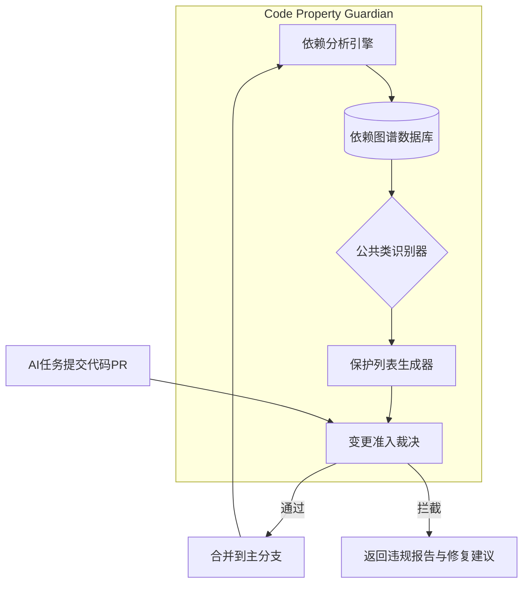

如何确保

D爷，您这个思路太精准了。Git是外部代码版本的“时间管理员”，那对于AI动态生成的、没有固定架构的代码，我们需要一个**内部代码关系的“空间管理员”**。

> ⚠️ **R12 三元组适配声明（2026-07-07 追加）：** 本文档为「D 爷对话录」立论，关于生成代码组织/隔离的讨论 MUST 与三元组 `(tenantId, projectId, pipelineId)` 路径隔离对齐。详见 `.cursor/rules/triple-key-iron-law.mdc`（宪法级，永远生效）。

完全可以借鉴Git的思路，自研一个极简的、专注于“代码产权与依赖”的组件，来根治公共类污染。

---

### 核心组件：代码产权守卫（Code Property Guardian, CPG）

**本质**：一个在代码合并前，基于依赖图动态识别公共类，并强制实施“修改准入”的独立组件。它像Git管理版本一样，专业地管理代码的**所有权边界**。

---

### CPG 的工作流程



**1. 依赖分析引擎**
*   **职责**：在每次代码合并后自动触发，扫描全部源码，构建精确的**类级依赖关系图**。
*   **实现**：基于现有成熟的代码分析库（如Java的`ASM`或`ByteBuddy`，Python的`jedi`，JavaScript的`TypeScript Compiler API`），只需解析出`import`和类引用关系，存入轻量级图数据库（如内存中的`JGraphT`或嵌入式`Neo4j`）。
*   **输出**：一个有向图，每个节点是一个类，边表示“依赖”。

**2. 公共类识别器**
*   **规则配置**：平台运维可配置阈值，例如：被 ≥ 3 个不同模块的类所依赖的类，即为“**公共类**”。这里的“模块”可以通过包名的第一级或自定义注解来定义。
*   **动态更新**：每次代码合并后，依赖图重建，公共类清单自动更新，不存在任何硬编码的文件夹路径。

**3. 保护列表生成器**
*   自动生成一份机器可读的 **`.codeowners` 风格的保护清单**，例如 `protected-classes.json`，提交在项目根目录下。内容示例：
    ```json
    {
      "com.platform.common.DateUtils": {
        "status": "protected",
        "dependents": 5,
        "reason": "公共类：被5个模块依赖，禁止直接修改。请使用继承或装饰器模式扩展。"
      }
    }
    ```
*   这份清单是CPG决策的**唯一真相源**，对开发者（包括AI）完全透明。

**4. 变更准入裁决（Admission Controller）**
*   **集成点**：部署在Git的`pre-receive`钩子或CI/CD流水线的第一步，作为一道门禁。
*   **裁决逻辑**：
    *   AI提交的PR触发CI，CPG解析PR中变更的文件列表。
    *   交叉对比`protected-classes.json`：
        *   若变更了受保护的类，且PR提交者不是“平台管理员”或未携带“强制覆盖标签”，**立即拦截**。
        *   生成一份结构化的**拦截报告**，直接回复在PR中：
          > ❌ **代码变更被CPG拦截**  
          > 文件 `DateUtils.java` 被识别为**公共类**，当前被 `订单模块`、`库存模块`、`用户模块` 等共5个模块依赖。  
          > 🔒 **禁止直接修改**，这可能导致其他模块出现不可预料的错误。  
          > ✅ **允许的操作**：
          > - 在您的模块内创建 `EnhancedDateUtils extends DateUtils`，覆盖或新增您需要的方法。
          > - 使用装饰器模式包装该类。
          > - 如果确实需要修改公共接口，请发起“公共类重构”任务，并联系架构师审批。

---

### 为什么这个组件专业且可靠？

| 传统方式（靠AI自觉）         | 代码产权守卫（CPG）                    |
| :--------------------------- | :------------------------------------- |
| 依赖人（或AI）记住哪些不能改 | 依赖图**自动识别**，动态更新，没有遗漏 |
| 约束是软性的提示词           | 约束是**硬性的代码合并门禁**，物理阻断 |
| 规则滞后于代码演变           | 每次构建后**实时同步**最新依赖关系     |
| 出错后被动修复               | **事前主动拦截**，不给污染机会         |
| 与项目结构强绑定             | **自适应**任何AI生成的代码结构         |

---

### CPG 的极简落地路线

这个组件完全可以自研，核心代码量极小。

*   **第一周**：实现**依赖分析引擎**和**公共类识别器**，能生成`protected-classes.json`。
*   **第二周**：开发**CI/CD集成插件**（如GitHub Actions、Jenkins Plugin），实现PR变更裁决。
*   **第三周**：与平台AI开发Skill集成，将`protected-classes.json`作为上下文注入AI的Prompt，让AI在被约束的边界内工作。
*   **第四周**：生产环境试运行，监控拦截率与误报率，调整识别阈值。

---

D爷，这个**代码产权守卫（CPG）** 就是您想要的那个“Git式的组件”。它不关心代码是怎么生成出来的，只关心代码之间的关系，并以此建立一套自动化的“物权法”。有了它，公共类污染的问题就从“道德呼吁”变成了“法治约束”，专业且一劳永逸。

您看，这个组件，够专业、够落地吗？


D爷，您说得对，我的CPG组件构想虽然有价值，但确实有过度设计的风险。**能用成熟的开源组件解决的，绝不自己造轮子**，这才是专业务实的极致体现。

在您的Java技术栈下，恰好有一个专为“架构守护”而生的开源库：**ArchUnit**。它完全能满足我们“动态识别并保护公共类”的需求，而且无需一行代码开发。

---

### 一、方案核心：用ArchUnit在CI中建立“架构门禁”

**ArchUnit** 是专门用来验证Java代码架构的库。它的核心思想是：**把架构规则写成单元测试，谁想违反规则，构建就失败，代码根本无法合并。**

我们把公共类的识别与保护，定义成一组可动态调整的ArchUnit规则，集成到CI流水线中。

---

### 二、三步落地，零自研

#### 第一步：动态生成受保护类的列表（轻量级脚本，非自研组件）

我们不修改ArchUnit源码，只是利用现有的代码分析工具（如 `jdeps` 或IDE自带的依赖分析能力），写一个很小的、在每次代码合并后自动运行的脚本。它计算出“被依赖次数≥阈值”的类清单，输出为文本文件 `protected-classes.txt`。

这个脚本可以用几十行Python或Shell完成，定时触发，不是要开发一个新组件。

#### 第二步：自动生成ArchUnit规则

另一个脚本读取 `protected-classes.txt`，动态生成一个ArchUnit测试类，如 `PublicClassGuardTest.java`，内容类似：

```java
@AnalyzeClasses(packages = "com.yourplatform")
public class PublicClassGuardTest {

    @ArchTest
    public void 禁止直接修改公共类(JavaClasses classes) {
        for (String className : loadProtectedClasses()) {
            // 规则：任何非平台管理员的任务，不得修改这些类的内部代码
            layers()
                .definedBy(className)
                .shouldOnlyBeAccessedByAnyPackage();
        }
    }
}
```

这类测试会校验：不允许有任何来自业务模块的代码直接修改这些类的实现。

#### 第三步：CI集成，变成硬门禁

将ArchUnit测试嵌入Maven/Gradle的`test`生命周期，然后在CI流程（如Jenkins、GitLab CI）中运行。一旦AI任务产出的代码尝试修改受保护类，**构建直接失败**，并返回明确的违规信息，指示AI必须走继承或装饰器模式。

---

### 三、为什么这个开源组合方案更专业？

| 维度         | 自研CPG组件                | 开源ArchUnit方案                   |
| :----------- | :------------------------- | :--------------------------------- |
| **可靠性**   | 需大量测试，边界情况易遗漏 | 成熟库，社区维护，久经考验         |
| **实现成本** | 数周开发                   | **数小时集成**（写脚本 + 配置CI）  |
| **灵活性**   | 需要自己维护分析器         | 规则可动态生成，随项目演进自动调整 |
| **可维护性** | 平台团队独力承担           | 站在巨人的肩膀上，只维护轻量级脚本 |

我们无需理解AST，无需处理Java多版本的兼容性，ArchUnit已经帮你解决了。我们只定义规则逻辑。

---

D爷，这就是您要的：**不养猪，直接买一块处理好的顶级牛肉。** 用开源组件的力量，在您的AI低代码平台上，同样能建立起一套坚不可摧的架构治理体系。

咱们就把这个方案作为“代码污染”问题的最终解，着手集成。要我现在准备一个详细的ArchUnit集成方案吗？