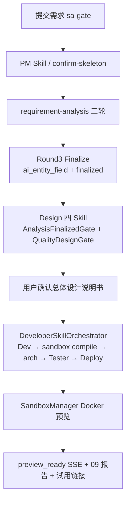
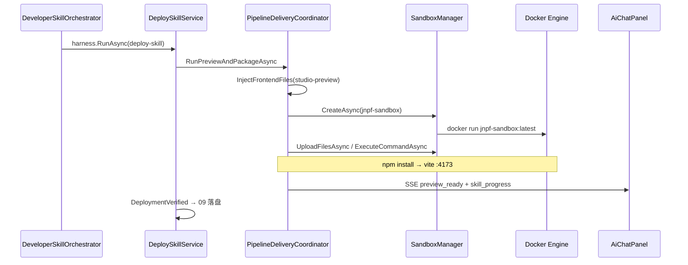

# 30、全链条冲刺开发计划（最后一公里）

> **文档编号：** 30  
> **版本：** v1.0  
> **日期：** 2026-07-10  
> **定位：** AI 原生开发平台「提需求 → 试用链接」全链条跑通的**最后冲刺施工指南与任务对照表**  
> **上级清单：** [`29、战略转移.md`](./29、战略转移.md)  
> **契约锚点：** [`25`](./25、需求分析子链重构方案书（修订版）.md) §6 · [`26`](./26、需求分析重构-第一阶段开发计划（数据基座与SA编译增强）.md)–[`28`](./28、需求分析重构-第三阶段开发计划（需求分析书与质量验收）.md)  
> **进度信源：** `docs/progress-registry.yaml`（本文件落地后以本文件任务 ID 为准更新）

---

## 0. 阶段定位与完成定义

### 0.1 业务目标（Business First）

| # | 问题 | 答案 |
|---|------|------|
| Q1 | 用户做什么？ | Studio 提交需求 → 门控/PM → 三轮需求分析 Finalize → 设计四 Skill → **确认总体设计说明书** → 等待进度 → **打开试用链接** |
| Q2 | 用户拿到什么？ | `00–09` 交付物可下载；聊天区全程 SSE 进度；**可点击的预览 URL** + `09-deployment-report.md` |
| Q3 | 怎么验收？ | **新 pipeline**（非 311 旧基线）从零跑通；`pnpm test:api` 硬断言 + 本机 Docker 预览 200 |

**完成定义（DoD）：** 任意授权用户用一条新 pipeline，无需手点「运行部署」，在确认总体设计后自动完成开发→测试→部署，并在聊天区看到试用链接且链接可打开。

### 0.2 总判断（2026-07-10 实查）

| 结论 | 说明 |
|------|------|
| 旧主链 311 ≠ 新全链已通 | 311 证据覆盖旧 Analyst/compile；新 S2 编排器未成唯一用户主路径 |
| 调度胶水 ≠ 沙箱产品 | Design 确认后 Dev→Test→Deploy + SSE 已接线；**`jnpf-sandbox` 镜像与真预览未通** |
| 29 号 A 文档 ✅ · B 半通 · C 未做 | 本文件把 B 余量 + C + R12 多用户收口编成可执行冲刺包 |

### 0.3 禁止项（冲刺期）

- ❌ 用 pipeline **311** 旧证据宣称「全链条跑通」
- ❌ 在沙箱未通前继续扩 Eval / 模具 / 文档消歧
- ❌ 给门控开逃逸通道；为过测试改断言凑绿（实现完整性铁律）
- ❌ 在 IR 观测台加「运行部署」按钮（部署必须自动）
- ❌ 生产主路径继续默认 `analyst-skill` / `confirm-requirement-spec`（须切到 `requirement-analysis` + Finalize）
- ❌ 三元组缩写 / `ResolveProjectAsync` 返回 pipelineId 冒充 projectId

---

## 1. 现状对照表（29 → 本冲刺）

| 29 项 | 状态 | 本文件任务包 |
|-------|------|--------------|
| A1–A8 文档 | ✅ | 不重做；仅维护 registry 指针 |
| B1 Finalize 门禁 | ✅ 代码 | S0 回归断言纳入 |
| B2 字段唯一源 | ⚠️ Db/Ui/Tester 已；Architect/SystemDesign 未齐 | **W1-T3** |
| B3 Tester | ✅ 基本 | S0 回归 |
| B4 质量门控 | ✅ 代码 | S0 回归 |
| B5 前端续跑 / 主路径 | ⚠️ 双轨 | **W1-T1 / W1-T2** |
| B6 E2E 硬断言 | ❌ | **W1-T4** |
| B7 Bugfix | ❌ 按需 | **W4-T3**（P2） |
| C1 新 pipeline 冒烟 | ❌ | **W3-T1** |
| C2 部署 / 07–09 | ❌ 主缺口 | **W2 全包 + W3-T2** |
| （R12）fork / 用户隔离 / freeze UI | ❌/半通 | **W4** |

---

## 2. 目标主链路（唯一生产路径）



**图 2-1 冲刺目标主链路（类名锚点）**

| 步骤 | 关键类 / API |
|------|-------------|
| 门控 | `RequirementGateService.EvaluateMaturity` · `POST .../sa-gate` |
| PM | `SkillsApiService` confirm-skeleton · **须改** AutoRun → `requirement-analysis` |
| S2 | `RequirementAnalysisOrchestrator` · `POST .../requirement-analysis/{id}/run` |
| Finalize | `AnalystSkillService.FinalizeAsync` / 编排器 Round3 · 投影 **ai_entity_field** |
| 设计 | `DesignSkillOrchestrator` · `AnalysisFinalizedGate` · `QualityDesignGate` |
| 确认设计 | `StageConfirmSkillTrigger` · `PipelineStage.Design` |
| 自动链 | `DeveloperSkillOrchestrator.RunAsync` |
| 部署 | `DeploySkillService` · `PipelineDeliveryCoordinator` · `SandboxManager` |
| 前端 | `AiChatPanel` · `skill_progress` / `preview_ready` |

### 2.1 核心表（数据锚点）

| 表 | 关键字段 | 冲刺用途 |
|----|----------|----------|
| **BASE_AI_PIPELINE** | `F_ID`, `F_TENANT_ID`, `F_PROJECT_ID`, `F_CREATOR_USER_ID`, `F_WORK_MODE`, `F_FROZEN` | 三元组 + 用户隔离 + freeze |
| **ai_entity_field** | `F_TenantId`, `F_ProjectId`, `F_PIPELINE_ID`, 实体/字段列 | 25 §6 唯一字段源 |
| **ai_ir_events** / **ai_ir_fragment_snapshots** | 三元组 + FragmentId | IR 血缘；fork 复制 |
| **BASE_AI_GENERATED_PROJECT** | `F_SandboxUrl`, `F_SourceZipUrl` | 试用链接 / ZIP |
| **sa_quality_score** | 三元组 + `F_TotalScore` | 设计质量门控 |

---

## 3. 冲刺包总览

| 包 | 名称 | 目标 | 预估 | 依赖 |
|----|------|------|------|------|
| **W0** | 基线冻结与对照 | 清单入库、registry 对齐、环境检查 | 0.5d | — |
| **W1** | 统一 S2 主路径 + 契约收口 | 用户只走新编排器；B2/B6 绿 | 2–3d | W0 |
| **W2** | 沙箱部署产品化 | 镜像 + Docker 真预览 + SSE | 3–4d | W0（可与 W1 并行） |
| **W3** | 新 pipeline 全链冒烟 + 07–09 | C1+C2 业务验收 | 2d | W1+W2 |
| **W4** | 多用户 R12 收口 | fork / Creator 隔离 / freeze UI | 2–3d | W3 优先；可后置 |

**建议日历：** W0 →（W1 ∥ W2）→ W3 → W4；每包结束 **节点审批**（29 C3），未口头「继续」不得进下一包。

---

## 4. W0 — 基线冻结与对照（0.5 天）

### 任务对照表

| ID | 任务 | 改什么 | 完成标准 | 状态 |
|----|------|--------|----------|------|
| W0-T1 | 本文件入库 | 本文件 + registry 指针 | 路径存在；`current_focus` 指向 30 | ☐ |
| W0-T2 | 环境检查清单 | Docker / 镜像 / SQL / start-dev | 书面记录：Docker 是否可用、有无 `jnpf-sandbox` 镜像 | ☐ |
| W0-T3 | 双轨入口清单 | 列出仍指向旧 Analyst 的 API/前端调用点 | 清单写入 §4.1（已预填，实施时勾选核实） | ☐ |

### 4.1 双轨入口清单（实施前核实）

| 位置 | 现状 | 目标 |
|------|------|------|
| `SkillsApiService` confirm-skeleton `AutoRunAnalyst` | `RunSkillAsync("analyst-skill")` | 改为调度 `requirement-analysis` 或前端显式 `runRequirementAnalysis` |
| `usePmSkill.ts` | 默认 `autoRunAnalyst: true` | 切到新编排器；文案去掉「九步」 |
| `confirm-requirement-spec` | 旧物化主路径仍活 | 生产确认改为 Finalize 后阶段推进；旧 API 标 deprecated / 仅回归 |
| `useAnalystSkill.ts` | 新旧 API 并存 | 主 UI 只暴露新三轮进度 |

**验收：** `dotnet build` InteAssistant 0 error；W0 清单勾完。

---

## 5. W1 — 统一 S2 主路径 + 契约收口（2–3 天）

> 对应 29：**B5 补完 · B2 余量 · B6**  
> 业务产物：用户确认骨架后进入三轮需求分析，Finalize 后设计可跑；未 Finalize 设计 400。

### 任务对照表

| ID | 任务 | 改什么（穿透） | 完成标准 | 状态 |
|----|------|----------------|----------|------|
| W1-T1 | PM 确认后进新编排器 | `SkillsApiService` confirm-skeleton；`usePmSkill.ts` | 确认骨架后触发 `requirement-analysis/run`，**不再**默认 `analyst-skill` | ☐ |
| W1-T2 | S2 确认 / Finalize 唯一化 | 前端确认流；`RequirementAnalysisOrchestrator` Round3；弱化 `confirm-requirement-spec` 生产入口 | Finalize 后 `finalized=true` + **ai_entity_field** 有行；02 为新渲染器产物 | ☐ |
| W1-T3 | Architect / SystemDesign 读字段源 | `ArchitectSkillService` / `SystemDesignSkillService`（及 Clarification 若需）经 `EntityDesignRepository.ListFieldsAsync` | Prompt/校验引用字段来自投影表；禁止仅 parse IR JSON 当唯一源 | ☐ |
| W1-T4 | Vitest 硬门禁 | `tests/api/studio-s34.test.mjs` 或新建 `studio-s2-finalize-gate.test.mjs` | ① 未 Finalize → 设计 run 拒绝 ② Finalize+有字段 → `canRunDesign=true` ③ 断言字段源相关 status | ☐ |
| W1-T5 | 前端文案 / 进度 | `useAnalystSkill` / `AiChatPanel` / 设计提示 | 无「Analyst 九步」生产文案；三轮进度可感知 | ☐ |

### 验收命令

```powershell
cd D:\JNPF-v52\backend
dotnet build modularity/inteAssistant/JNPF.InteAssistant/JNPF.InteAssistant.csproj
cd D:\JNPF-v52
# 需后端 :5000
$env:E2E_PIPELINE_ID="<新或已 Finalize 的 pipeline>"
pnpm test:api
```

### 节点审批材料（W1 结束）

1. 业务说明：主路径已切新 S2  
2. 五禁令自检  
3. 证据：API 响应截图或 test:api 输出（含门禁用例）  
4. 验收表 W1-T1～T5 勾选  

---

## 6. W2 — 沙箱部署产品化（3–4 天）★ 主缺口

> 对应 29：**C2 核心**  
> 业务产物：本机 Docker 起容器后，Deploy 返回可打开的 `previewUrl`；聊天区 `preview_ready`。

### 6.1 架构要点



**图 6-1 部署时序（冲刺必须跑通）**

### 任务对照表

| ID | 任务 | 改什么（穿透） | 完成标准 | 状态 |
|----|------|----------------|----------|------|
| W2-T1 | 镜像工程 | 新增 `sandbox/` 或 `docker/jnpf-sandbox/Dockerfile`（Node+Vite 工作目录 `/app`，与 `ExecuteCommandAsync` 的 `cd /app` 一致） | `docker build -t jnpf-sandbox:latest` 成功；`docs/sandbox-operations-guide.md` 更新构建步骤 | ☐ |
| W2-T2 | 配置与默认 Image | `SandboxConfig.Image`；`PipelineDeliveryCoordinator.CreateAsync` 显式传 Image；`appsettings` / `StudioPreview:ProjectPath` | 无镜像时 SSE/日志明确「镜像不存在」而非静默失败 | ☐ |
| W2-T3 | 预览链路打通 | `PipelineDeliveryCoordinator.TryStartPreviewAsync`；`SandboxManager.CreateContainerInternalAsync` / `UploadFilesAsync` / `GetSandboxInfoAsync` | 手工或脚本：Create→Upload→npm→vite→HTTP 200；`PreviewUrl` 非空 | ☐ |
| W2-T4 | 无 Vue 产物时的可诊断失败 | codegen 输出路径与 `InjectFrontendFiles` 对齐；失败 message 含「generated 无 vue」 | 缺产物时用户看到明确失败进度，不假死 | ☐ |
| W2-T5 | 进度 SSE 回归 | 已有 `PushDeployProgress` / `PreviewReady`；前端 `AiChatPanel` `preview_ready` | 部署全程聊天区有百分比文案；就绪后出现试用链接 Markdown | ☐ |
| W2-T6 | ZIP 交付 | `StudioWorkspaceHelper.CreateDeliveryZip`；**BASE_AI_GENERATED_PROJECT**.`F_SourceZipUrl` | Deploy 成功后 downloadUrl 可下 | ☐ |

### 验收命令（本机）

```powershell
docker images jnpf-sandbox
# 构建（路径以 W2-T1 落地为准）
# docker build -t jnpf-sandbox:latest <sandbox-dir>

# API 触发 deploy（pipeline 须已有 stable codegen + vue）
node scripts/jnpf-api.mjs POST /api/studio/skills/deploy/<pipelineId>/run
# 或走完整 Orchestrator；观察 SSE / GeneratedProject.F_SandboxUrl
```

### 节点审批材料（W2 结束）

1. 浏览器打开试用链接截图（E1）  
2. `09-deployment-report.md` 内容含 URL  
3. W2-T1～T6 勾选  

---

## 7. W3 — 新 pipeline 全链冒烟 + 07–09（2 天）

> 对应 29：**C1 + C2 收口 / registry step4–step5**

### 任务对照表

| ID | 任务 | 改什么 | 完成标准 | 状态 |
|----|------|--------|----------|------|
| W3-T1 | 新 pipeline 全链剧本 | 文档化步骤 + 可选 `scripts/` 分步或 Vitest drive；**禁止**只跑 311 | 新 ID：门控→PM→三轮 Finalize→设计→确认总体设计→自动链→试用链接 | ☐ |
| W3-T2 | 07/08/09 断言 | `tests/api` 扩展；`SkillDeliverableCoordinator` 已写则补断言 | deliverables 列表含 `07-codegen-manifest` / `08-testsuite` / `09-deployment-report`；content 非空 | ☐ |
| W3-T3 | registry 更新 | `docs/progress-registry.yaml` | `step4_deploy` / `step5_deliverables_07_09` → completed + evidence 路径 | ☐ |
| W3-T4 | 证据归档 | `.claude/evidence/` | 至少：全链 JSON 或截图 + 试用 URL 记录 | ☐ |

### 全链手工/脚本检查清单（W3-T1）

| 步 | 用户操作 / API | 期望产物 |
|----|----------------|----------|
| 1 | 创建 pipeline + 提交需求 | 门控通过或澄清 |
| 2 | PM → confirm-skeleton | `01-skeleton.md`；自动进 requirement-analysis |
| 3 | 三轮作答 / 续跑 | Round3 Finalize；**ai_entity_field** 有数据 |
| 4 | 设计编排 / 确认架构与总体设计 | `03–06`；SystemDesign locked |
| 5 | 确认总体设计（阶段确认） | SSE：codegen→tester→deploy 进度 |
| 6 | 等待 preview_ready | 试用链接可开；`09` 可下载 |

**验收：** 上表 6 步全部 ✓；`pnpm test:api` 对应该 pipeline 绿（含 07–09）。

---

## 8. W4 — 多用户 R12 收口（2–3 天，可后置）

> 29 未单列，但 **三元组铁律** 要求；不做则「多用户多项目多对话」仍虚。

### 任务对照表

| ID | 任务 | 改什么（穿透） | 完成标准 | 状态 |
|----|------|----------------|----------|------|
| W4-T1 | 标准 fork API | `AIDevelopmentPipelineService` 或新方法 `ForkAsync`；复制 IR snapshots + 可选 generated/；`WorkMode` + `SourcePipelineId` | `POST .../pipeline/{id}/fork`；新 pipeline 独立 IR，同 `ProjectId` | ☐ |
| W4-T2 | Creator 列表隔离 | `PipelineEngineService.ListAsync`；`EnsurePipelineTenantAsync` 增 Creator 校验（超管例外） | 同租户用户 A 看不到 B 的 pipeline | ☐ |
| W4-T3 | Bugfix 与 Finalize | `AnalystAffectedStepsRerun` 等与新编排器语义对齐（29 B7） | 增量不覆盖源 pipeline IR；尊重 Finalize | ☐ |
| W4-T4 | freeze/resume 前端 | Studio UI 调已有 `FreezeAsync` / `ResumeAsync` | 用户可冻结/恢复；冻结后写操作有提示 | ☐ |
| W4-T5 | 三元组诊断 | 新增或恢复 `scripts/diagnose-triple-key.mjs` | 脚本 exit 0；文档写入验收命令 | ☐ |

### 验收命令

```powershell
node scripts/diagnose-triple-key.mjs
# fork 后 IR 互不覆盖：按脚本或手工查 ai_ir_fragment_snapshots 三元组
```

---

## 9. 总任务对照总表（打印用）

| ID | 包 | 一句话 | 优先级 | 状态 |
|----|-----|--------|--------|------|
| W0-T1 | W0 | 30 号入库 + registry | P0 | ☐ |
| W0-T2 | W0 | Docker/镜像环境检查 | P0 | ☐ |
| W0-T3 | W0 | 双轨入口核实 | P0 | ☐ |
| W1-T1 | W1 | PM→新编排器 | P0 | ☐ |
| W1-T2 | W1 | Finalize 唯一化 | P0 | ☐ |
| W1-T3 | W1 | Architect/SystemDesign 读 ai_entity_field | P1 | ☐ |
| W1-T4 | W1 | Vitest 门禁硬断言 | P0 | ☐ |
| W1-T5 | W1 | 前端文案/进度 | P1 | ☐ |
| W2-T1 | W2 | jnpf-sandbox Dockerfile | P0 | ☐ |
| W2-T2 | W2 | Image 配置与错误可观测 | P0 | ☐ |
| W2-T3 | W2 | Docker 预览 200 | P0 | ☐ |
| W2-T4 | W2 | 无 Vue 可诊断 | P1 | ☐ |
| W2-T5 | W2 | SSE 进度回归 | P0 | ☐ |
| W2-T6 | W2 | ZIP downloadUrl | P1 | ☐ |
| W3-T1 | W3 | 新 pipeline 全链冒烟 | P0 | ☐ |
| W3-T2 | W3 | 07/08/09 断言 | P1 | ☐ |
| W3-T3 | W3 | registry completed | P1 | ☐ |
| W3-T4 | W3 | evidence 归档 | P1 | ☐ |
| W4-T1 | W4 | fork API | P2 | ☐ |
| W4-T2 | W4 | Creator 隔离 | P2 | ☐ |
| W4-T3 | W4 | Bugfix 对齐 | P2 | ☐ |
| W4-T4 | W4 | freeze UI | P2 | ☐ |
| W4-T5 | W4 | triple-key 诊断脚本 | P2 | ☐ |

---

## 10. 风险与对策

| 风险 | 概率 | 影响 | 对策 |
|------|------|------|------|
| 本机无 Docker / 公司策略禁容器 | 中 | W2 阻塞 | 先定「必须 Docker」或临时 LocalPreview 降级方案（须单独立项，默认不走降级） |
| codegen 不产出 Vue | 中 | 预览永远失败 | W2-T4 + 核对 `CodegenWorkspaceWriter` / 模板；先修产物再部署 |
| 双轨切换漏网旧入口 | 高 | 用户仍走旧 Analyst | W0-T3 清单 + W1-T1/T2 全量 Grep `analyst-skill` 生产调用 |
| 用 311 冒充验收 | 高 | 假完成 | DoD 强制**新 pipeline ID**；registry 写明 ID |
| W1/W2 并行冲突 | 低 | 合并难 | 约定：W1 动 Skills/前端入口；W2 动 Sandbox/Docker；少交叉文件 |
| 沙箱与 SQL Server 租户库 | 中 | 容器起不来 | 按 `docs/sandbox-operations-guide.md` 先通网络与连接串 |

---

## 11. 验证矩阵（声称完成前必跑）

| 层 | 命令 | 覆盖 |
|----|------|------|
| L0 编译 | `dotnet build .../JNPF.InteAssistant.csproj` | W1–W4 |
| L1 API 存活 | `node scripts/jnpf-api.mjs GET /api/oauth/CurrentUser` | 全程 |
| L1 快测 | `E2E_PIPELINE_ID=<新> pnpm test:api` | W1-T4 · W3 |
| L2 部署 | Docker 预览 URL 浏览器打开 | W2 · W3 |
| L3 证据 | `.claude/evidence/` 截图或 JSON | W3-T4 |
| L4 R12 | `diagnose-triple-key.mjs` + fork 抽查 | W4 |

**禁止：** 仅 `dotnet build` 声称冲刺完成。

---

## 12. 关键代码索引（施工导航）

| 领域 | 路径 |
|------|------|
| 阶段确认触发 | `backend/.../Pipeline/StageConfirmSkillTrigger.cs` |
| 自动交付编排 | `backend/.../Skills/DeveloperSkillOrchestrator.cs` |
| 部署 Skill | `backend/.../Skills/DeploySkillService.cs` |
| 预览协调 | `backend/.../Studio/PipelineDeliveryCoordinator.cs` |
| Docker 沙箱 | `backend/.../SandboxManager.cs` · `Interfaces/ISandboxManager.cs` |
| 新 S2 编排 | `backend/.../Skills/RequirementAnalysisOrchestrator.cs` |
| 设计门禁 | `AnalysisFinalizedGate.cs` · `QualityDesignGate.cs` · `DesignSkillOrchestrator.cs` |
| 字段仓库 | `backend/.../Codegen/EntityDesign/EntityDesignRepository.cs` |
| 交付物 07–09 | `backend/.../Studio/SkillDeliverableCoordinator.cs` |
| 前端聊天 SSE | `jnpf-web-vue3/.../AiChatPanel.vue` |
| 开发进度 | `jnpf-web-vue3/.../composables/useDeveloperSkill.ts` |
| 壳工程 | `studio-preview/` |
| 运维说明 | `docs/sandbox-operations-guide.md` |

---

## 13. 与既有文档关系

| 文档 | 关系 |
|------|------|
| **29** | 战略转移清单；本文件是其 **C 批 + B 余量 + R12** 的详细施工展开 |
| **25–28** | S2 契约与实现依据；W1 不得违反 25 §6 / 红线 |
| **11–16** | 历史全链条计划；冲突处以 25+本文件为准 |
| **22 五步计划** | step4/step5 以本文件 W2/W3 为收口指南 |
| **progress-registry** | 任务状态回写本文件 ID + step4/step5 |

---

## 14. 节点审批门禁（强制）

每个 W 包结束后暂停，提交：

1. **业务实现说明**（做了什么、服务哪条用户操作）  
2. **五禁令自检**（实现完整性铁律）  
3. **业务功能证据**（产物/链接/测试输出，非「应该可以」）  
4. **本包任务对照表勾选**  

**未经用户明确「继续 / 通过 / 下一步」不得进入下一 W 包。**

---

## 15. 建议开工第一刀

审核通过后，推荐顺序：

1. **W0**（半天对齐）  
2. **W2-T1 镜像** 与 **W1-T1 切主路径** 并行（两人）或串行先 **W1-T1**（一人）  
3. 禁止先做 W4

---

## 本会话结论（episodic 索引友好）

- **决策：** 最后冲刺按 W0→W1∥W2→W3→W4；DoD=新 pipeline 自动到试用链接  
- **交付物：** `docs/AI原生开发/1、多用户多任务并行/30、全链条冲刺开发计划（最后一公里）.md`  
- **禁止项：** 311 假绿；无镜像宣称部署完成；生产双轨旧 Analyst  
- **待审：** 本文 v1.0 待你审批后开工  
- **下一步：** 审批通过 → 执行 W0-T1/T2  

---

**文档状态：** 待架构师 / 产品审批后进入 `executing-plans`。
