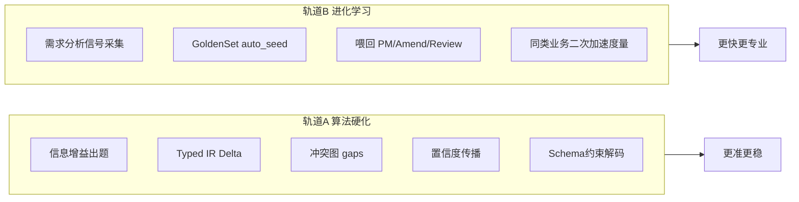

# 32、需求分析算法与进化学习研究包

> **文档编号：** 32  
> **版本：** v1.0  
> **状态：** **业务闭环已验收**（B1 采集 Collected=4；fork Amend 链路证明；A 轨单测+Apply Typed/delta 路径；证据 `.claude/evidence/phase31-32-close.json`）  
> **修订日期：** 2026-07-11  
> **性质：** 在 31 P0 产品闭环之上，做**算法正确性**与**以战养战进化学习**  
> **上游：** [`31`](./31、需求分析增强开发计划（PM专家闭环）.md)（产品正确性）· [`25`](./25、需求分析子链重构方案书（修订版）.md)  
> **阶段七锚点：** [`15`](./15、全链条第七阶段开发计划.md) · `openspec/specs/studio-eval-pipeline` · `MemoryRetentionService` / GoldenSet / Eval L1–L4  
> **原则：** 少新服务、复用阶段七已落地能力；进化学习 = **系统工程闭环**，不是再堆 LLM 轮次

---

## 0. 为何单独开 32

| 包 | 解决什么 | 不解决什么 |
|----|----------|------------|
| **31** | 谁出题、谁终评、硬需求如何回显确认（**产品正确**） | 深层算法；生产→记忆→更快反应 |
| **32（本文）** | 问什么/补丁如何证明/冲突如何计算；**同类业务越做越快越专业**（**算法 + 进化**） | 不替代 31 P0；不重做 Eval 四层 |

**产品判断（已定）：** 31 砍掉的「Amend/force → GoldenSet 回灌」对系统工程极有价值，且与阶段七「生产 trace→eval 闭环」同构——应在 32 **升格为正式轨道**，而不是永久搁置。

### 0.1 业务三问

| # | 答案 |
|---|------|
| Q1 | 用户仍走三轮+Amend；系统在后台从成功/失败/Amend/强制确认中学习 |
| Q2 | 同类行业（如请假/审批）再次分析时：出题更准、惯例更贴、终评 gaps 更少、耗时更短 |
| Q3 | 算法单测 + GoldenSet 回归 + 同垂直包二次 pipeline 对比（题数/分数/Amend 次数） |

### 0.2 与阶段七的关系（必须复用，禁止另起炉灶）

```text
阶段七已有：
  MemoryRetentionService.CollectFailureTracesAsync → GoldenSet auto_seed
  SkillReview / Judge / QualityBoard
  Experience 事件（Review/Failure）焊在 Cognitive 模板

32 要补的缺口：
  ① 需求分析域信号未系统进入 auto_seed（Amend 确认、forceConfirm、<85 gaps、用户纠正回显）
  ② 回灌后未规定「如何喂回 PM 出题 / Amend / Review」（消费契约）
  ③ 算法层（信息增益、Typed Delta、冲突图）可降低对纯 LLM 的依赖
```

**红线（继承 15）：** 记忆遗忘 **不删** `ai_ir_events`；只裁剪 Prompt 上下文 / 增补 GoldenSet。

---

## 1. 双轨目标



| 轨道 | 目标一句话 |
|------|------------|
| **A 算法硬化** | 少靠「再问/再猜」，多靠可计算的选问、补丁、冲突与置信度 |
| **B 进化学习** | 每次交付留下可复用营养；同类业务二次反应更快、更专业 |

---

## 2. 轨道 B — 进化学习（优先于炫技算法）

> 用户明确肯定本轨道价值；且阶段七已铺路。

### 2.1 信号清单（需求分析域）

| 信号 | 来源（31 落地后） | 写入 |
|------|-------------------|------|
| PM 终评 &lt;85 + gaps | `RequirementSpecPmReviewed` | GoldenSet case 或 auto_seed 标签 `req-pm-lowscore` |
| 用户 Amend Propose→纠正 | 纠正前后 understanding 对 | `req-amend-correction`（高价值：教系统「理解偏了」） |
| 用户 Amend Apply 成功 | Applied + 再评升分 | `req-amend-success` |
| forceConfirm | 显式强制 | `req-force-confirm`（慎用：可能是噪声，降权） |
| 设计阶段打回 / Skill 失败 | 既有 failure run | 已有 `CollectFailureTracesAsync`，补 **skillId 过滤 pm/requirement-analysis** |
| 人工 SkillReview | 阶段七抽检 | 已有；挂需求分析 run |

### 2.2 消费契约（喂回何处）

| 消费点 | 如何用进化资产 | 禁止 |
|--------|----------------|------|
| PM `GenerateClarificationAsync` | ContextBuilder / MCP 检索 **同行业 auto_seed 片段**（槽位、易错点） | 把整份旧 02 塞进 prompt |
| `AmendProposeAsync` | 检索「同类纠正」样例，约束理解摘要字段 | 无检索就静默 |
| `ReviewSpecAsync` | 已知高频 gaps 作检查清单（确定性优先） | 仅靠 LLM 回忆 |
| 种子表 | 稳定高频惯例 → 人工/半自动晋升 `ai_seed_templates`（低频） | 自动覆盖种子正文无审 |

### 2.3 工程任务（B 轨）

| # | 任务 | 复用 | 验收 |
|---|------|------|------|
| B1 | 扩展采集：需求分析信号 → GoldenSet auto_seed（去重、三元组） | `MemoryRetentionService` 模式 | 一次 Amend 纠正可查到 seed |
| B2 | 采集 API/Job：可手动 `collect-req-signals` + 可选定时 | `SkillMemoryApiService` 风格 | 命令/API exit 0 |
| B3 | PM/Amend/Review **检索钩子**：Budget 内注入 Top-K 相关 seed | `ContextBuilder` / MCP | 二次同垂直包 prompt 含 seed id 日志 |
| B4 | **加速度量**：同行业第二次 pipeline — Amend 次数、PM 分、出题轮有效答案率 | 对比脚本或 test:api 扩展 | 有基线数字，不空口「更快」 |
| B5 | 与质量榜对齐：pm-skill / requirement-analysis 上榜可下钻到 seed | `SkillQualityBoardService` | Tab 或 API 可见 |

**B 轨不做：** 新向量库；删 IR；自动改生产种子无人工闸。

---

## 3. 轨道 A — 算法硬化

> 来自 31 附录 D；按性价比排序。与 B 轨可并行，但 **B1–B3 建议先于 A 的大改**（先有数据再优化选问）。

### 3.1 A1 — Typed IR Delta（加固 Amend）★ 推荐

**问题：** Apply 后整份 Finalize，难证明「只应用了用户确认的理解」。  

**做法：**

```text
AmendmentUnderstanding
  → 类型化补丁列表：AddEntity | AddEvent | PatchRule | AddField | …
  → Apply = 按序应用补丁（幂等）→ CompileFromSkeletonJson
  → 回显摘要与补丁列表 1:1 可展示
```

| 任务 | 验收 |
|------|------|
| 定义补丁代数（record/枚举，JSON 可序列化） | 单测：补丁往返 |
| Propose 产出 understanding **且** patches | 回显可展示补丁摘要 |
| Apply 只应用 patches，禁止「凭散文再让 LLM 改骨架」 | 无第二源改骨架 |
| 与 31 Propose/Apply 门闩对齐 | 未确认不 Apply |

### 3.2 A2 — 信息增益出题

**问题：** 「每轮问 3 题」信息量不稳定。  

**做法：** 维护 **未知槽位图**（行业模板：审批层级、假期类型、是否代提…）；每轮选期望信息增益最大的 ≤3 个槽位；PM 只负责把槽位渲染成 MULTI/MATRIX 文案。  

| 任务 | 验收 |
|------|------|
| 槽位注册表（先请假/审批垂直包） | 配置或种子可版本化 |
| 选问算法（熵/覆盖启发式即可，不必可微） | 单测：已知槽位填满后不再问 |
| 接入 `GenerateClarificationAsync` | 日志含 slotIds |

### 3.3 A3 — 冲突图 → 可解释 gaps

**问题：** ConsistencyChecker 规则枚举，终评 gaps 易「编」。  

**做法：** 实体-字段-事件-角色建图；矛盾边 → **最小冲突集** → 写入 Review gaps（确定性优先，LLM 只润色文案）。  

| 任务 | 验收 |
|------|------|
| 从图生成 ≥1 条可复现冲突样例 | 单测固定图 → 固定 gaps |
| Review 合并：图 gaps ∪ LLM gaps（标 source） | payload 含 `source=graph\|llm` |

### 3.4 A4 — 置信度传播（轻量）

Assumption/DDD confidence → 相关事件权重 → **PM 分封顶**（例如存在 confidence&lt;0.5 的核心假设则 score≤84）。  

单测：人工注入低置信假设 → 分封顶生效。

### 3.5 A5 — Schema 约束解码（基建）

出题 / Amend / Review 的 JSON 走 Schema 校验；失败 **一次** 带错重试；淘汰「修到语法过但语义歪」的静默路径（对齐错题本）。  

可与全局 `LlmResponseFixup` 策略协同，本包只钉需求分析三条链路。

### 3.6 后置（本包可选附录，不排期）

状态机模型检测、种子 listwise 重排、ToT 早停、九表增量物化 — 见原 31 附录 D.3；**默认不做**。

---

## 4. 非目标

- 不重做 Eval L1–L4 / Judge / kappa（15 已完成）  
- 不建独立向量库 / Chroma  
- 不恢复 gaps 自动再问三轮  
- 不把进化学习做成「自动改 .vm / 自动改种子正文」无人工闸  
- 不阻塞 31 P0：32 可在 31 P0 合并后开工；B 轨信号依赖 31 的 IR 事件

---

## 5. 分期与依赖

```text
31 P0 合并
    ↓
32-B1..B3 进化采集+喂回     ← 优先（系统工程价值）
    ↓
32-A1 Typed Delta            ← 与 Amend 同构，加固 31
    ↓
32-A2 信息增益出题 → A3 冲突图 → A4/A5
    ↓
32-B4 加速度量（证明「同类更快」）
```

| 阶段 | 内容 | 工期（估） | 依赖 |
|------|------|------------|------|
| **32-B0** | 信号字典 + 与 MemoryRetention/GoldenSet 对接设计定稿 | 0.5d | 31 IR 事件名稳定 |
| **32-B1–B3** | 采集 + 喂回 PM/Amend/Review | 2–3d | 31 P0 |
| **32-A1** | Typed Delta | 2–3d | 31 Amend Propose/Apply |
| **32-A2** | 信息增益出题（一垂直包） | 1.5–2d | B3 可选并行 |
| **32-A3–A5** | 冲突图 + 置信度 + Schema | 2–3d | A1 后 |
| **32-B4** | 二次加速度量 | 0.5–1d | B3 + 至少 1 次真实回灌 |
| **合计** | | **约 9–13d**（可裁切） | |

**建议首批批准范围：** `32-B0 + B1–B3 + A1`（进化学习 + Amend 补丁代数）≈ **4.5–6.5d**。

---

## 6. 验证

```powershell
# 阶段七回归（不破坏）
node scripts/phase7-eval-verify.mjs

# 进化：采集后 GoldenSet 可见
# 【待实现】node scripts/... 或 jnpf-api 调 memory/collect

# 算法：xUnit
dotnet test backend/tests/JNPF.Tests.PhaseB --filter "FullyQualifiedName~ReqAlgo|FullyQualifiedName~AmendPatch|FullyQualifiedName~SlotGain"
```

| 证据 | 要求 |
|------|------|
| 进化 | Amend 纠正 → auto_seed 有记录；二次同业 prompt 日志含 seed |
| Delta | 回显字段与 patches 一一对应；未确认无 Apply |
| 选问 | 槽位满后不再问该槽 |
| 安全 | 无删除 ir_events；三元组完整 |

---

## 7. 五禁令注意

| 禁令 | 本包 |
|------|------|
| 二 第二源 | Typed Delta 是骨架唯一变更入口；禁止 Apply 后再 LLM 改骨架 |
| 三 改测试凑过 | 加速度量必须真实二次 pipeline，禁止改阈值「假装快」 |
| 五 | 声称「越用越强」必须有 B4 数字 |

---

## 8. 审批栏

| 项 | 内容 |
|----|------|
| 审批 | ☐ 批准首批（B0–B3+A1）　☐ 批准全轨 A+B　☐ 修改后再审　☐ 驳回 |
| 前置 | 建议 **31 P0 先合并**；32 编码不抢跑 31 |
| 与 15 | 进化轨道 = 阶段七能力在需求分析域的**接线和消费**，非新中台 |

### 8.1 本轮落地记录（2026-07-11）

- [x] B1/B2：需求分析信号采集到 GoldenSet auto_seed，并新增 `collect-req-signals` API。
- [x] B3：PM 出题 / Amend / Review 注入 Top-K auto_seed 摘要，日志输出 seed ids。
- [x] B4/B5：新增加速度量脚本；质量榜支持 `skillId=pm-skill` 过滤。
- [x] A1：Typed Amendment Patch DTO + 确定性 skeleton patch apply + compile 校验；无 patches 保持 31 文本 delta 路径。
- [x] A2/A3/A4/A5：信息增益槽位、冲突图 gaps、低置信封顶、三条 LLM JSON 轻量 schema 重试。
- [x] PhaseB：新增 `ReqAlgo32Tests` 覆盖 `ReqAlgo|AmendPatch|SlotGain|ReqSignal`。

---

## 附录：关键代码锚点

| 能力 | 路径 |
|------|------|
| 记忆回写 | `Studio/MemoryRetentionService.cs` |
| GoldenSet | `Studio/EvalService.cs` |
| 质量榜 | `Studio/SkillQualityBoardService.cs` |
| 经验记录 | Cognitive `IExperienceRecorder` / 15 号 |
| Amend（31） | `PmSkillService` Propose/Apply |
| 编译 | `Sa/SaNineViewCompiler.cs` |
| 一致性 | `Gates/ConsistencyChecker.cs` |
