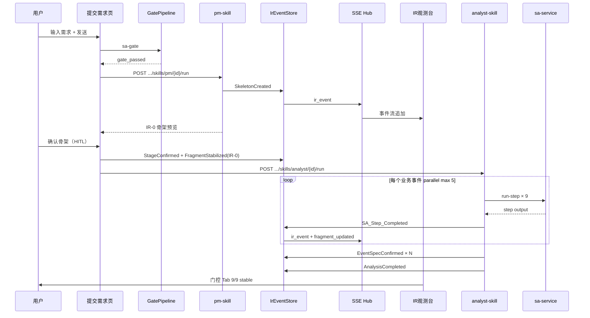

# 全链条第二阶段开发计划

> ⛔ **SUPERSEDED（2026-07-10）— 需求分析 / S2 主链施工依据已更换**  
> **现行标准：** [`25、需求分析子链重构方案书（修订版）.md`](./25、需求分析子链重构方案书（修订版）.md)（总纲）+ [`26`](./26、需求分析重构-第一阶段开发计划（数据基座与SA编译增强）.md) / [`27`](./27、需求分析重构-第二阶段开发计划（三轮循环与矩阵题）.md) / [`28`](./28、需求分析重构-第三阶段开发计划（需求分析书与质量验收）.md)（施工）。  
> **本文档定位：** 阶段二 **历史档案**（PM/Analyst/Harness/§14 质量红线仍有参考价值）。  
> **禁止**再按本文「PM → Analyst → sa-service 九步」作为生产主链施工。  
> **现行主链：** `RequirementAnalysisOrchestrator` 三轮澄清 → Round 3 一次性工程保障（投影 + `SaMaterializer`）→ `AnalysisCompleted(finalized=true)` + `ai_entity_field` + `02-requirement-spec.md`（新渲染器）。  
> **ADR-004：** compile 默认走 `SaNineViewCompiler`；sa-service 九步仅 agent **回归**，非主链。

> ⚠️ **R12 三元组适配声明（2026-07-07 追加）：** 本文档原文 L68/132/173 出现的「pipelineId ≡ projectId」「Skill 执行携带 `tenantId`/`pipelineId`」表述为 **1:1 退化期的临时实现**。当前架构 R12 强制三元组 `(tenantId, projectId, pipelineId)` 完整独立可分离——Skill 执行 MUST 携带三元组；API 路径段为 `pipelineId`，查询必带 `projectId` 做范围限定。详见 `.cursor/rules/triple-key-iron-law.mdc`（宪法级，永远生效）。

> 文档编号：9 | 版本：**v1.2（supersede 标注）** | 周期：W3-W4（10 个工作日）  
> 上级总体计划：[`7、skills构建方案.md`](./7、skills构建方案.md) §2 阶段二  
> 前置依赖：[`8、全链条第一阶段开发计划.md`](./8、全链条第一阶段开发计划.md) — IR 基础设施 + 提交需求页 IR 观测台（D1-D12 已通过）  
> 文档定位：**历史阶段蓝图**；S2 现行施工见 **25+26–28**；阶段三见 [`11`](./11、全链条第三阶段开发计划.md)（前置已改指向 25 §6）

---

## 文档索引

| 章节 | 内容 |
|---|---|
| §0 | 阶段定位与边界 |
| §1 | 现有资产锚点 |
| §2 | 提交需求页 E2E 集成中枢（认知双核） |
| §3 | 两周冲刺计划（D1-D10） |
| §4 | 后端组件详细设计 |
| §5 | 数据模型 DDL（阶段二） |
| §6 | IR Schema v1 扩展（IR-0 完整 + IR-1） |
| §7 | Definition of Done（D1-D12） |
| §8 | 任务依赖图 |
| §9 | 与阶段三衔接 |
| §10 | 风险与缓解 |
| §11 | 工程 Ticket 清单 |
| §14 | **质量红线（NFR）与运行时分层** ← v1.1 新增 |

---

## 0. 阶段定位

### 0.1 在全链条中的位置

```
全链条 6 阶段
────────────────────────────────────────────────────────────
阶段一 W1-W2  ✅ IR 基础设施 + IR 观测台（已完成）
阶段二 W3-W4  ← 本文档（历史）：曾规划 PM + Analyst + SA 九步
              ★ 现行 S2：25+26–28（三轮编排 + Round3 Finalize）
阶段三 W5-W6     架构 / 总体 / 数据库 / UI 设计 Skill（输入契约见 25 §6）
阶段四 W7-W8     开发 + 测试 Skill
阶段五 W9-W10    部署 + Bug 修复 + 全链路联调
阶段六 W11-W12   生产加固
────────────────────────────────────────────────────────────
```

> **历史核心问题（原文）：** 从用户原始需求到 SA 九步完整产出 IR-1 是否打通？  
> **现行核心问题（25/27/28）：** 三轮澄清后 Round 3 能否一次性产出 `finalized` 的 AnalysisCompleted + `ai_entity_field` + 可下载《需求分析说明书》？

### 0.2 核心策略（延续阶段一）

> **不做「后台 Skill 先建完再对接前端」。**  
> 阶段二第一天即将 IR 观测台的「模拟 SkeletonCreated」替换为 **`pm-skill` 真实推理**；UI 与 REST/SSE API **不变**，只换事件来源。

同时交付：

1. **认知双核**：`pm-skill`（IR-0）+ `analyst-skill`（IR-1，驱动 SA 九步）
2. **Harness 最小运行时**：`IBaseSkill` + `SkillRegistry` + `ContextBuilder` + `SkillHarness`
3. **SA 九步适配层**：封装现有 `sa-service`，每步完成写入 `SA_Step_Completed` IR 事件
4. **种子数据 MVP**：≥ 40 条通用 HR/OA 模板（支撑 HC-2：`auto` 复杂度零 LLM）

### 0.3 阶段二目标（对照总体计划六大目标）

| 总体目标 | 阶段二贡献 |
|---|---|
| 目标一：10 个 Skills | 落地前 2 个 Skill（PM + Analyst）；建立 `IBaseSkill` 注册机制 |
| 目标二：完整链条 | 需求 → IR-0 → IR-1 主干可演示；为阶段三设计 Skill 提供 stable IR-1 |
| 目标三：SA 九步 + 版本管理 | `SAOrchestrator` 驱动九步；`EventSpecRevised` 增量更新 MVP |
| 目标四：四要素融合 | `ContextBuilder` 四要素 Prompt 组装（IR + 种子 + SA 步骤 + IOI） |
| 目标五：多用户并行 | Skill 执行携带三元组 `(tenantId, projectId, pipelineId)`；并发 SA 事件调度（≤5） |
| 目标六：架构识别 | 不在阶段二范围；留阶段四 `arch-guard` |

### 0.4 阶段边界（不做什么）

| 不做 | 留给 |
|---|---|
| 架构 / DB / UI 设计 Skill | 阶段三 W5-W6 |
| VisualDev / FlowTemplate 原生 JSON 生成 | 阶段三（`ir1-to-visualdev-mapper`） |
| 代码生成 / 测试 / 部署 Skill | 阶段四～五 |
| 完整 MCP Server 集群（etcd 软路由） | 阶段六 |
| ToT Beam Search 全量（N=3 扩展维） | 阶段二 MVP 仅 N=2 候选 + 领域评分 Top-1 |
| 每个 EventSpec 逐条人工确认 | 阶段二仅 **IR-0 骨架 1 个强制确认点**（HC-4） |

### 0.5 阶段二交付物总览

```
提交需求页（/studio/ai/submit-requirement）— 观测台 API 不变，事件来源升级
    │
    ├── 用户发送需求 → GatePipeline 门控（已有）
    ├── 【新增】PM Skill 运行 → SkeletonCreated → IR 观测台实时可见
    ├── 【新增】IR-0 骨架确认卡片（全流程唯一强制 HITL，HC-4）
    ├── 【新增】Analyst Skill → SA 九步 → SA_Step_Completed × N
    └── 【新增】AnalysisCompleted → IR-1 stable → 阶段三可订阅

后端（JNPF.InteAssistant 模块内扩展）
    ├── Skills/IBaseSkill + SkillRegistry + SkillHarness
    ├── Skills/PmSkillService（ToT MVP + 领域评分）
    ├── Skills/AnalystSkillService（IOI + SA 驱动）
    ├── Skills/ContextBuilderService
    ├── Sa/SaOrchestratorAdapter（HTTP → sa-service）
    ├── Seed/DomainSeedService（种子库 MVP）
    ├── Ir/IoiValidatorService（不变量校验 MVP）
    └── Ir 事件扩展：EventSpecConfirmed / AnalysisCompleted / FragmentInvalidated

sa-service（TypeScript，改造不重写 Agent）
    ├── SAOrchestrator：逐步回调 → 追加 SA_Step_Completed（适配层写入 IR）
    └── 事件并行调度：无依赖事件 maxConcurrency=5

阶段二 DoD
    └── 输入 800～1500 字需求 → 3 分钟内 IR-0 → SA 九步 → IR-1 stable
        → 双租户隔离 → 手工平台零影响
```

---

## 1. 现有资产锚点（禁止重复造轮子）

### 1.1 阶段一已交付（直接复用）

| 资产 | 路径 | 阶段二用法 |
|---|---|---|
| IR 事件存储 | `backend/modularity/inteAssistant/JNPF.InteAssistant/Ir/IrEventStoreService.cs` | Skill 产出统一 `AppendAsync` |
| 投影引擎 | `Ir/IrProjectionEngine.cs` | `ContextBuilder` 读快照；SA 每步后 `RebuildAsync` |
| 稳定性门控 | `Ir/StabilityGateService.cs` | IR-1 九步完成后 `FragmentStabilized` |
| Schema 校验 | `Ir/IrSchemaValidator.cs` | 扩展 IR-0/IR-1 子集校验 |
| IR 观测 API | `Ir/IrObservabilityApiService.cs` | **URL 不变**；Dev simulate 保留为回归工具 |
| SSE 通道 | `Infrastructure/Messaging/PipelineSseChannelHub.cs` | Skill 产出推送 `ir_event` / `fragment_updated` |
| 流水线 Create | `AIDevelopmentPipelineService.CreateAsync` | 已写 `ProjectCreated` + `ai_projects` |
| 租户守卫 | `Infrastructure/Security/TenantGuard.cs` | 所有 Skill/IR 读写强制校验 |

**统一映射（不变）：**

```
R12 三元组（2026-07-07 修订；原文 pipelineId ≡ projectId 已废除）：
  greenfield WorkMode：projectId 自锚定 = pipelineId（字段独立，值相等）
  bugfix/enhancement：projectId 继承自源 pipeline，pipelineId 新建

pipelineId（AiChatPanel / BASE_AI_PIPELINE.F_ID）
projectId（BASE_AI_PIPELINE.F_PROJECT_ID / IR 事件 F_ProjectId）— 三元组独立字段
tenantId（JWT / TenantResolver / IR 事件 F_TenantId）
```

### 1.2 SA 九步 TypeScript 资产（封装，不重写）

| 资产 | 路径 | 阶段二用法 |
|---|---|---|
| **SAOrchestrator** | `sa-service/src/orchestrator/SAOrchestrator.ts` | HTTP 调用；每步完成回调 C# 适配层写 IR |
| **9 个 SA Agent** | `sa-service/src/agents/*.ts` | **内部逻辑不改**；输入改为 IR-0 上下文 |
| **StepRouter** | `sa-service/src/orchestrator/StepRouter.ts` | 保留步骤路由；适配层映射步骤名 → `IrSaSteps.All` |
| **Validators** | `sa-service/src/validators/*.ts` | 继续用于 SA 步骤产出校验 |
| **HTTP 入口** | `sa-service/src/server.ts` | 扩展 `POST /run-step` 单步 API（供 C# 逐步驱动） |
| **DKEE 领域知识** | `sa-service/src/dkee/*` | PM Skill 领域评分器的数据来源之一 |

### 1.3 门控与流水线（已有）

| 资产 | 路径 | 阶段二用法 |
|---|---|---|
| **需求门控** | `Gates/GatePipeline.cs` | 用户发送需求前的语义合格性（阶段 0） |
| **SA 门控 API** | `AIDevelopmentPipelineService.ExecuteGateAsync` | 门控通过后触发 PM Skill |
| **阶段确认** | `ConfirmStageAsync` | IR-0 确认后写 `StageConfirmed`；触发 Analyst Skill |

### 1.4 前端

| 资产 | 路径 | 阶段二用法 |
|---|---|---|
| **提交需求页** | `jnpf-web-vue3/src/views/studio/views/ai/submit-requirement.vue` | 增加 IR-0 确认卡片；Analyst 进度联动 |
| **IR 观测台** | `components/IrObservatoryPanel.vue` + `composables/useIrObservatory.ts` | 展示真实 Skill 事件（取代纯 Dev 模拟） |
| **IrPreviewCard** | `components/chat/IrPreviewCard.vue` | 展示 IR-0 骨架摘要 |
| **AiChatPanel** | `components/AiChatPanel.vue` | SSE 已有 `ir_event` case；增加 PM/SA 状态文案 |

### 1.5 API 契约

**已有 API（扩展，不改 URL）：**

```
POST   /api/studio/pipeline/execute/create
POST   /api/studio/pipeline/execute/{id}/sa-gate
GET    /api/studio/pipeline/execute/{id}/events          ← SSE
POST   /api/studio/pipeline/execute/stage/{id}/confirm
GET    /api/studio/ir/{pipelineId}/events|snapshots|stability|diagnostics?projectId=...
POST   /api/studio/ir/{pipelineId}/simulate               ← 保留 Dev 回归
```

**阶段二新增：**

```
POST   /api/studio/skills/pm/{pipelineId}/run            ← 触发 PM Skill
POST   /api/studio/skills/analyst/{pipelineId}/run       ← 触发 Analyst Skill（IR-0 stable 后）
POST   /api/studio/skills/analyst/{pipelineId}/events/{eventId}/run  ← 单事件 SA（并行）
GET    /api/studio/skills/{pipelineId}/runs              ← Skill 执行历史
GET    /api/studio/seed/templates?industry=hr            ← 种子模板检索（MVP）
POST   /api/studio/ir/{pipelineId}/events/{fragmentId}/revise?projectId=...  ← EventSpecRevised（增量更新入口）
```

**sa-service 扩展（独立进程，默认 :3200）：**

```
POST   /sa/run-scope          ← 单步 Scope（已有 runSA 可拆）
POST   /sa/run-step           ← 单步执行 { stepName, eventId, context }
POST   /sa/run-event          ← 单事件完整九步（并行调度器内部用）
GET    /sa/health
```

---

## 2. 提交需求页 E2E 集成中枢（认知双核）

### 2.1 用户旅程（阶段二目标路径）



### 2.2 布局改造（在阶段一三栏基础上增量）

| 区域 | 阶段二增量 |
|---|---|
| 对话区 | IR-0 骨架确认卡片（`IrSkeletonConfirmCard.vue`）；SA 进度条 |
| IR 观测台 · 事件流 | Dev 模拟按钮保留；增加「运行 PM」「运行 Analyst」主按钮 |
| IR 观测台 · 快照 | 展示 `IR0_Skeleton` + 各 `IR1_EventSpec` JSON |
| IR 观测台 · 门控 | 按 **事件维度** 展示 9 步进度（不只 skeleton 一条） |
| IR 观测台 · 诊断 | 展示当前 Skill runId、sa-service 连通性、种子命中数 |

**新建/改造文件：**

| 文件 | 动作 |
|---|---|
| `components/ir/IrSkeletonConfirmCard.vue` | 新建：IR-0 HITL 确认（HC-4 唯一强制点） |
| `components/ir/IrSaEventProgress.vue` | 新建：按 eventId 展示 9 步进度 |
| `components/ir/IrEventStreamTab.vue` | 改造：真实 Skill 按钮 + simulate 降级为 Dev |
| `api/studio/skills.ts` | 新建：PM/Analyst/seed API |
| `composables/usePmSkill.ts` | 新建：PM 运行 + 确认状态机 |
| `composables/useAnalystSkill.ts` | 新建：Analyst 运行 + 并行事件进度 |

### 2.3 IR-0 确认与 HC-4

总体计划 **HC-4**：全流程仅 **1 个强制人工确认点（IR-0 骨架）**。

```
SkeletonCreated（draft）
    → 用户审阅 businessEvents / roleMatrix / entityDrafts
    → 点击「确认骨架并进入需求分析」
    → AppendAsync(StageConfirmed) + 升级 IR-0 → stable
    → 自动触发 analyst-skill（或用户手动点「运行 Analyst」）
```

`inferred` 类规则在 IR-1 阶段标记 `pending`，**不阻塞** Analyst 启动；阶段二不在 EventSpec 层做强制 HITL。

### 2.4 SSE 协议扩展（阶段二追加事件类型）

在阶段一 `ir_event` / `fragment_updated` 基础上，SkillHarness 统一序列化：

```typescript
interface SseSkillProgress {
  type: 'skill_progress';
  data: {
    skillId: 'pm-skill' | 'analyst-skill';
    phase: 'tot' | 'scoring' | 'sa_step' | 'ioi_validate' | 'completed';
    eventId?: string;
    saStepName?: string;
    percent: number;
    message: string;
  };
}

interface SseAnalysisCompleted {
  type: 'analysis_completed';
  data: {
    projectId: string;
    eventSpecCount: number;
    allStable: boolean;
  };
}
```

`AiChatPanel.vue` 追加 `case 'skill_progress'` / `case 'analysis_completed'`，**不修改**原有 `thinking`/`token` 分支。

---

## 3. 两周冲刺计划

> **原则：每天都有可在提交需求页看到的进展；Day 1 替换 simulate 为真实 PM。**

### Sprint 1（D1-D3）：Harness + PM Skill MVP

| 天 | 任务 | 后端 | 前端 | 当日 E2E 验收 |
|---|---|---|---|---|
| D1 | IBaseSkill + Registry | `Skills/IBaseSkill.cs` + `SkillRegistry` | — | DI 注册 2 个 Skill |
| D2 | ContextBuilder MVP | 从 IR 快照裁剪 IR-0 上下文 | — | 单元测试：给定 snapshot 输出 Prompt 片段 |
| D3 | PM Skill → SkeletonCreated | `PmSkillService.RunAsync` + POST run API | 「运行 PM」按钮 | 发送需求 → PM → 观测台见 SkeletonCreated（非 simulate） |

**D3 浏览器验收路径：**

1. 登录 → Studio → 提交需求 → 输入「测试请假系统」800 字以上
2. 门控通过 → 点击「运行 PM Skill」
3. IR 观测台事件流出现 `SkeletonCreated`，skillId=`pm-skill`
4. 快照 Tab 见 `IR0_Skeleton` JSON（含 businessEvents）
5. Network：`POST /api/studio/skills/pm/{pipelineId}/run` → 200

### Sprint 2（D4-D6）：SA 适配层 + Analyst 逐步接入

| 天 | 任务 | 后端 | sa-service | 前端 | 当日 E2E 验收 |
|---|---|---|---|---|---|
| D4 | SaOrchestratorAdapter | HTTP 客户端 + 逐步回调写 IR | `POST /sa/run-step` | — | 手动调单步 Scope → `SA_Step_Completed` |
| D5 | Analyst 单事件九步 | `AnalystSkillService` 驱动 1 个 event | Step 名映射 | SA 进度组件 | 1 个 event 9/9 → stable |
| D6 | 事件并行调度 | `EventParallelScheduler` max=5 | run-event 内部并行 | 门控 Tab 多 event | 3 event 并行，互不占租户 |

### Sprint 3（D7-D8）：IOI + 增量更新 + 种子库

| 天 | 任务 | 后端 | 前端 | 当日 E2E 验收 |
|---|---|---|---|---|
| D7 | IOI Validator MVP | `IoiValidatorService` + EventSpecConfirmed | — | 非法不变量 → 400 + toast |
| D8 | EventSpecRevised | 受影响步骤判定表（P2） | 修订入口（Dev） | 改字段类型 → 只重跑 Dict+ER |
| D8 | 种子库 MVP | `DomainSeedService` ≥40 模板 | — | auto 事件无 LLM 调用日志 |

### Sprint 4（D9-D10）：AnalysisCompleted + DoD

| 天 | 任务 | 后端 | 前端 | 当日 E2E 验收 |
|---|---|---|---|---|
| D9 | AnalysisCompleted | 全 EventSpec stable 后写事件 | analysis_completed SSE | 观测台见 AnalysisCompleted |
| D10 | 回归 + DoD | A/B：simulate vs 真实 Skill | §7 全部 D1-D16 截图 | 双租户 + 手工平台零影响 + 质量红线 |

---

## 4. 后端组件详细设计

### 4.1 目录结构

```
backend/modularity/inteAssistant/
├── JNPF.InteAssistant/
│   ├── Skills/
│   │   ├── IBaseSkill.cs
│   │   ├── SkillRegistry.cs
│   │   ├── SkillHarness.cs
│   │   ├── ContextBuilderService.cs
│   │   ├── PmSkillService.cs
│   │   ├── AnalystSkillService.cs
│   │   └── EventParallelScheduler.cs
│   ├── Sa/
│   │   ├── SaOrchestratorAdapter.cs
│   │   └── SaStepMapping.cs
│   ├── Seed/
│   │   └── DomainSeedService.cs
│   ├── Ir/
│   │   ├── IoiValidatorService.cs
│   │   └── IrSchemaValidator.cs          ← 扩展 IR-1
│   ├── SkillsApiService.cs               ← /api/studio/skills
│   └── AIDevelopmentPipelineService.cs   ← gate 通过后可选自动触发 PM
├── JNPF.InteAssistant.Entitys/
│   ├── Entity/  AiSkillRunEntity, AiSeedTemplateEntity
│   └── Dto/Skills/  PmRunInput, AnalystRunInput, SkillRunDto
└── Migrations/20260718_Phase2_Skills_Infrastructure.sql

sa-service/（TypeScript 进程）
├── src/orchestrator/SAOrchestrator.ts    ← 增加 onStepComplete 回调
├── src/server.ts                         ← POST /sa/run-step, /sa/run-event
└── src/adapters/IrStepReporter.ts        ← HTTP 回调 C# 写 SA_Step_Completed
```

### 4.2 IBaseSkill 接口（C# 镜像总体计划 §3）

```csharp
public interface IBaseSkill
{
    string SkillId { get; }
    string Version { get; }

    SkillInformationNeeds InformationNeeds { get; }
    SkillOutputDeclaration Outputs { get; }

    Task<SkillValidationResult> ValidateInputAsync(IrSnapshot snapshot, CancellationToken ct = default);
    IAsyncEnumerable<IrEventAppendRequest> ReasonAsync(SkillContext context, CancellationToken ct = default);
    Task<SkillValidationResult> ValidateOutputAsync(IReadOnlyList<IrEventAppendRequest> events, CancellationToken ct = default);
}

public sealed class SkillContext
{
    public required string TenantId { get; init; }
    public required string ProjectId { get; init; }
    public required long PipelineId { get; init; }
    public required string UserRequirement { get; init; }
    public IrSnapshot Snapshot { get; init; } = IrSnapshot.Empty;
    public IReadOnlyList<SeedTemplateMatch> SeedMatches { get; init; } = Array.Empty<SeedTemplateMatch>();
}
```

**注册示例：**

```csharp
skillRegistry.Register(new PmSkillService(...), triggers: ["requirements.submitted"], produces: ["skeleton-ready"]);
skillRegistry.Register(new AnalystSkillService(...), triggers: ["skeleton-ready"], produces: ["analysis-completed"]);
```

### 4.3 SkillHarness 标准执行链路

```
SkillHarness.RunAsync(skillId, pipelineId)
  → TenantGuard + ResolveProjectAsync（复用 IrObservability 逻辑）
  → IrProjectionEngine.RebuildAsync → IrSnapshot
  → skill.ValidateInputAsync(snapshot)
  → ContextBuilder.Build(skill.InformationNeeds, snapshot)
  → foreach await skill.ReasonAsync(context):
        IrSchemaValidator.Validate(eventType, payload)
        IrEventStore.AppendAsync(...)
        SSE Push ir_event + fragment_updated
  → skill.ValidateOutputAsync(collected)
  → 写 AiSkillRunEntity 执行记录
```

### 4.4 PmSkillService（ToT MVP）

**MVP 范围（阶段二）**：

| 能力 | MVP | 阶段三+ |
|---|---|---|
| 候选切分方案数 N | 2（非 3） | 3 + Beam Search |
| 领域评分 | `DomainSeedService` 关键词 + DKEE 模式分 | 完整 graph_edit_distance |
| 输出 | 完整 IR-0 JSON → `SkeletonCreated` | + `coreFlow` 可视化 |
| Token 控制 | simple 需求（<5 event）单次 LLM | 完整 ToT |

**推理流程：**

```
userRequirement + seedMatches
  → LLM 生成 2 个 businessEvents 切分候选
  → DomainSeedService.Score(candidate) → Top-1
  → 组装 IR0_Skeleton JSON
  → IrSchemaValidator（businessEvents 非空）
  → yield AppendAsync(SkeletonCreated)
  → Update ai_projects.F_SkeletonId
```

**对接点：** `AIDevelopmentPipelineService.ExecuteGateAsync` 门控 `Passed` 后，可配置自动调用 `SkillHarness.RunAsync("pm-skill", pipelineId)`。

### 4.5 SaOrchestratorAdapter

**原则：SA Agent 内部不改；C# 适配层负责 IR 写入。**

```csharp
public sealed class SaOrchestratorAdapter
{
    public async Task<SaStepResult> RunStepAsync(
        string tenantId, string projectId, string eventId,
        string stepName, Ir0Skeleton skeleton, SaStepContext ctx, CancellationToken ct)
    {
        var response = await _http.PostAsJsonAsync($"{_saBaseUrl}/sa/run-step", new {
            tenantId, projectId, eventId, stepName,
            skeleton, previousSteps = ctx.CompletedSteps
        }, ct);

        // 适配层写 IR（sa-service 不直连 DB）
        await _irEventStore.AppendAsync(projectId, tenantId, new AppendIrEventRequest {
            EventType = IrEventTypes.SaStepCompleted,
            FragmentId = $"eventspec:{eventId}",
            FragmentType = IrFragmentTypes.EventSpec,
            SaStepName = SaStepMapping.ToIrStepName(stepName),
            Payload = JsonSerializer.Serialize(response.Output),
            SkillId = "analyst-skill",
        }, ct);

        return response;
    }
}
```

**步骤名映射（`SaStepMapping.cs`）：**

| sa-service Agent | IR `SaStepName` |
|---|---|
| ScopeAgent | DomainModel |
| DFDAgent | AggregateDesign |
| BPMAgent | EventCatalog |
| DictAgent | CommandQuery |
| PSpecAgent | IntegrationPoints |
| DecisionTableAgent | WorkflowSpec |
| ERAgent | DataModel |
| StateMachineAgent | UISpec |
| UIAgent | DeliveryChecklist |

> **【待源码验证】** 上表需在 D4 联调时与 `StepRouter.ts` 逐步对齐；阶段二以「9 步计数门控可 stable」为验收准绳，允许步骤语义名微调。

### 4.6 AnalystSkillService

```
ValidateInput: IR-0 skeleton stable
  → 构建事件依赖图（IR-0 businessEvents[].dependsOn）
  → EventParallelScheduler 拓扑调度
  → foreach eventId (max 5 concurrent):
        if complexityHint == 'auto' && seed.coverage > 0.85:
            ApplySeedTemplate → EventSpecConfirmed（零 LLM，HC-2）
        else:
            for step in SA_STEPS (串行 per event):
                SaOrchestratorAdapter.RunStepAsync(...)
            IoiValidatorService.Validate(eventSpec)
            AppendAsync(EventSpecConfirmed)
  → 全部 event stable → AppendAsync(AnalysisCompleted)
```

### 4.7 ContextBuilderService（TDR-003 MVP）

```csharp
public PromptContext Build(SkillInformationNeeds needs, IrSnapshot snapshot, IReadOnlyList<SeedTemplateMatch> seeds)
{
    var fragments = snapshot.Fragments
        .Where(f => needs.IrFragmentTypes.Contains(f.FragmentType))
        .Where(f => StabilityRank(f.StabilityState) >= StabilityRank(needs.RequiredStability))
        .ToList();

    if (needs.CanFilterByDomain?.Count > 0)
        fragments = fragments.Where(f => needs.CanFilterByDomain.Contains(f.Domain)).ToList();

    // Token 预算：超出 8K tokens 估算 → CompressToMinimal(fragments)
    return new PromptContext { IrFragments = fragments, SeedData = seeds.Take(20), ... };
}
```

### 4.8 EventSpecRevised 增量更新（P2）

| 修改类型 | 重跑 SA 步骤 |
|---|---|
| 字段名/描述 | Dict |
| 字段类型/约束 | Dict, DataModel |
| 状态机 | UISpec, WorkflowSpec |
| 业务流程 | EventCatalog, WorkflowSpec, IntegrationPoints |
| 实体关系 | DataModel, UISpec |
| 角色权限 | DomainModel, UISpec |

触发：`POST .../ir/{id}/events/{fragmentId}/revise` → `FragmentInvalidated` + 按表重跑 → 下游 fragment 降级 `in-progress`。

### 4.9 种子库 DomainSeedService（MVP）

- 存储：`ai_seed_templates` 表 + `backend/modularity/inteAssistant/Seed/Data/*.json` 初始导入
- 检索：`GET /api/studio/seed/templates?keyword=请假&industry=hr`
- 目标：≥ 40 条通用 HR/OA（总体计划 §7.7 阶段一配额，阶段二消费）
- HC-2：`complexityHint=auto` 且 `coverageScore≥0.85` → 跳过 LLM，直接 `EventSpecConfirmed`

---

## 5. 数据模型 DDL（阶段二）

> 完整 IR 表见阶段一 DDL。阶段二 **新增** 2 张表 + 扩展 `ai_projects`。

### 5.1 `ai_skill_runs`（Skill 执行审计）

```sql
CREATE TABLE [dbo].[ai_skill_runs] (
    [F_Id]              NVARCHAR(50)    NOT NULL,
    [F_TenantId]        NVARCHAR(50)    NOT NULL,
    [F_ProjectId]       NVARCHAR(50)    NOT NULL,
    [F_SkillId]         NVARCHAR(100)   NOT NULL,
    [F_Status]          NVARCHAR(20)    NOT NULL DEFAULT 'running',  -- running/completed/failed
    [F_StartedAt]       DATETIME2(7)    NOT NULL DEFAULT GETUTCDATE(),
    [F_CompletedAt]     DATETIME2(7)    NULL,
    [F_TokenConsumed]   BIGINT          NOT NULL DEFAULT 0,
    [F_ErrorMessage]    NVARCHAR(2000)  NULL,
    [F_Metadata]        NVARCHAR(MAX)   NULL,                          -- JSON: eventCount, stepCount
    CONSTRAINT [PK_ai_skill_runs] PRIMARY KEY ([F_Id])
);

CREATE INDEX [IX_skill_runs_project]
    ON [dbo].[ai_skill_runs] ([F_TenantId], [F_ProjectId], [F_StartedAt] DESC);
```

### 5.2 `ai_seed_templates`（领域种子模板）

```sql
CREATE TABLE [dbo].[ai_seed_templates] (
    [F_Id]              NVARCHAR(50)    NOT NULL,
    [F_TemplateId]      NVARCHAR(100)   NOT NULL,
    [F_Industry]        NVARCHAR(50)    NOT NULL,
    [F_EventNamePattern] NVARCHAR(500)  NOT NULL,
    [F_ComplexityHint]  NVARCHAR(20)    NOT NULL DEFAULT 'simple',
    [F_CoverageScore]   DECIMAL(4,2)    NOT NULL DEFAULT 0.80,
    [F_TemplateJson]    NVARCHAR(MAX)   NOT NULL,
    [F_CreatedAt]       DATETIME2(7)    NOT NULL DEFAULT GETUTCDATE(),
    [F_DeleteMark]      BIT             NOT NULL DEFAULT 0,
    CONSTRAINT [PK_ai_seed_templates] PRIMARY KEY ([F_Id]),
    CONSTRAINT [UQ_seed_template_id] UNIQUE ([F_TemplateId])
);
```

### 5.3 `ai_projects` 扩展

```sql
IF NOT EXISTS (SELECT 1 FROM sys.columns WHERE object_id = OBJECT_ID('ai_projects') AND name = 'F_AnalysisCompletedAt')
    ALTER TABLE [dbo].[ai_projects] ADD [F_AnalysisCompletedAt] DATETIME2(7) NULL;

IF NOT EXISTS (SELECT 1 FROM sys.columns WHERE object_id = OBJECT_ID('ai_projects') AND name = 'F_Ir0ConfirmedAt')
    ALTER TABLE [dbo].[ai_projects] ADD [F_Ir0ConfirmedAt] DATETIME2(7) NULL;
```

### 5.4 与 `sa_skeleton` / `sa_event_spec` 的投影同步（可选，D8+）

阶段二 MVP **以 `ai_ir_*` 为唯一真相源**；`sa_skeleton` / `sa_event_spec` 投影同步列为 P2-S09（可选），不阻塞主干验收。

---

## 6. IR Schema v1 扩展（IR-0 完整 + IR-1）

**TypeScript：** `jnpf-web-vue3/src/core/ir/schema/v1/`（扩展）  
**C# 镜像：** `JNPF.InteAssistant.Entitys/Ir/Schema/`  
**JSON Schema：** `skeleton.created.schema.json`（已有）+ `event-spec.confirmed.schema.json`（新增）

### 6.1 IR-0 完整（阶段二 PM 产出）

在阶段一 MVP 基础上扩展 `coreFlow`、`glossaryTermsUsed`：

```typescript
export interface IR0_Skeleton {
  '@context': 'https://schema.jnpf.ai/ir/v1';
  '@id': string;
  skeletonId: string;
  version: number;
  businessEvents: Array<{
    eventId: string;
    eventName: string;
    trigger?: string;
    primaryActor?: string;
    involvedRoles?: string[];
    complexityHint: 'auto' | 'simple' | 'complex';
    dependsOn: string[];
  }>;
  roleMatrix: Array<{ roleName: string; responsibilities: string[]; permissionBoundary?: string }>;
  coreFlow?: { nodes: object[]; edges: object[] };
  entityDrafts: Array<{ entityName: string; tableName: string; fields: object[] }>;
  glossaryTermsUsed?: string[];
}
```

### 6.2 IR-1 EventSpec（阶段二 Analyst 产出）

```typescript
export interface IR1_EventSpec {
  '@context': 'https://schema.jnpf.ai/ir/v1';
  '@id': string;
  eventId: string;
  version: number;
  confirmedFields: Array<{ name: string; type: string; required: boolean; constraints?: string[] }>;
  businessRules: Array<{ ruleId: string; description: string; source: 'user-stated' | 'inferred' | 'seed-data' }>;
  ioiInvariants: Array<{ invariantId: string; expression: string }>;
  saStepsCompleted: string[];
}
```

**新增 IR 事件类型（阶段二）：**

`EventSpecConfirmed`、`AnalysisCompleted`、`FragmentInvalidated`、`ScopeAnalyzed`…`UIPrototyped`（SA 各步可选细粒度事件，MVP 以 `SA_Step_Completed` 为主）。

---

## 7. Definition of Done（D1-D16）

> 全部在**提交需求页**验收；每项留截图或 Network 记录。  
> 测试需求：制造业/人事/工程管理任选，**800～1500 字**。

| # | 条款 | 操作路径 | 预期结果 |
|---|---|---|---|
| D1 | PM Skill 触发 | 门控通过后「运行 PM」 | 事件流 `SkeletonCreated`，skillId=pm-skill |
| D2 | IR-0 质量 | 查看快照 Tab | 6～15 个 businessEvents；roleMatrix；3～8 entityDrafts |
| D3 | IR-0 确认 HITL | 确认骨架卡片 | `StageConfirmed` + IR-0 → stable |
| D4 | Analyst 启动 | IR-0 stable 后运行 Analyst | `ai_skill_runs` 有 analyst-skill 记录 |
| D5 | SA 九步事件 | 观测台事件流 | 每 event 9 条 `SA_Step_Completed`（可并行） |
| D6 | IR-1 stable | 门控 Tab | 各 EventSpec 9/9 → stable |
| D7 | AnalysisCompleted | 全部 event 完成 | 事件流出现 `AnalysisCompleted` |
| D8 | IOI 拒绝 | Dev 注入违反不变量规格 | API 400 + toast |
| D9 | 种子 auto | complexityHint=auto 事件 | 无 sa-service LLM 调用（查 skill_run metadata） |
| D10 | 双租户隔离 | 两账号各跑全流程 | IR 互不可见 |
| D11 | 增量修订 | EventSpecRevised 改字段类型 | 只重跑 Dict+ER，不全量九步 |
| D12 | 手工平台零影响 | VisualDev + 工作流设计器 | 功能与路径不变（P9 回归） |

**阶段二通过：D1-D12 全部绿灯；D13-D16（质量红线）任一红灯则阶段二不得归档。**

| # | 条款 | 操作路径 | 预期结果 |
|---|---|---|---|
| D13 | 结构化日志 | 跑完 PM+Analyst 全流程后查 Serilog / `ai_skill_runs` | 每条 Skill 步骤含 `runId`+`tenantId`+`projectId`；失败步骤有 `ErrorMessage` |
| D14 | 并发与隔离 | 租户 A/B 各开 2 条 pipeline 并行 Analyst | IR 互不可见；同 pipeline 重复 `POST .../run` → 409；单 project 并行 event ≤5 |
| D15 | AnalysisCompleted 完整性 | 人为跳过 1 个 event 的 SA 步 | `AnalysisCompleted` **不得**写入；门控 Tab 显示缺失步 |
| D16 | 内存泄漏抽检 | 切换 pipeline ×10 + 离开页面 | 前端无悬挂 SSE/fetch；后端 `_channels` 无 orphan（或 TTL 清扫生效） |

---

## 8. 任务依赖图

```
D1 IBaseSkill + SkillRegistry + SkillHarness
    ↓
D2 ContextBuilder + DomainSeedService（40 模板导入）
    ↓
┌───────────────┬────────────────────┐
D3 PmSkill      D4 SaOrchestratorAdapter + sa/run-step
└───────┬───────┴─────────┬──────────┘
        ↓                 ↓
      D5 AnalystSkill（单 event 九步）
        ↓
      D6 EventParallelScheduler（max 5）
        ↓
┌───────────────┬────────────────────┐
D7 IoiValidator D8 EventSpecRevised
└───────┬───────┴─────────┬──────────┘
        ↓
      D9 AnalysisCompleted + SSE
        ↓
      D10 DoD D1-D16 + A/B 对比（simulate vs 真实）
```

---

## 9. 与阶段三衔接

> **现行衔接（2026-07-10）：** 阶段三 MUST 以 [`25 §6 下游消费契约`](./25、需求分析子链重构方案书（修订版）.md) 为准，不以本表「stable IR-1 EventSpec」为唯一前置。

| 阶段三需要（现行） | 交付来源 |
|---|---|
| `AnalysisCompleted` 且 **`finalized=true`** | 26/27 Round 3 Finalize |
| 实体字段 **`ai_entity_field`**（声明 3） | Round 3 `EntityDesignProjector` |
| `02-requirement-spec.md`（新渲染器，禁止旧模板覆盖） | 28 `RequirementDocumentRenderer` |
| 质量/一致性（可选门控） | 28 `QualityApiService` / `sa_quality_score` |
| `ContextBuilder` / Harness / SkillRunGuard | 本文档历史交付（仍复用） |
| 三元组透传（R12） | 阶段一 + 编排器 `SkillExecutionScope` |

**历史放行路径（仅档案）：** 阶段二 D1–D16 全绿 / Phase 2.5 G1–G8 — 仍可作为运行时 NFR 参考，**不能替代** Finalize + `ai_entity_field`。

**阶段三第一天：** 校验 `finalized=true` + 可读 `ai_entity_field` → 再激活设计四 Skill。详见 [`11`](./11、全链条第三阶段开发计划.md)。

**阶段二向阶段三预置（文档 7 §7.6，不阻塞）：**

| 预置项 | 说明 | 建议 Ticket |
|---|---|---|
| `bpm-to-jnpf-converter` | BPM → FlowTemplateJson | P2-P01（可选） |
| `ir1-to-visualdev-mapper` | 字段 → formData（字段源须对齐 **ai_entity_field**） | 阶段八 P8-M01 |

---

## 10. 风险与缓解

| 风险 | 缓解 |
|---|---|
| SA 封装后质量退化（总体计划 §6 风险 2） | HTTP 调原 Agent；A/B 对比；Feature Flag 切回旧模式 |
| ToT Token 成本（风险 1） | MVP N=2；simple 需求单次 LLM；auto 走种子 |
| sa-service 未启动 | 诊断 Tab 健康检查；SkillHarness 明确错误 SSE |
| 步骤名映射不一致 | D4 联调锁定 `SaStepMapping`；单测覆盖 9 步 |
| 并行 SA 打满 Token | maxConcurrency=5；租户级 Token 计数写 `ai_skill_runs` |
| IR-0 确认被跳过 | 未 stable 禁止 Analyst API（400） |
| 手工平台回归 | P9 门禁延续阶段一 CI |

---

## 11. 工程 Ticket 清单

| Ticket | 标题 | 估时 | 依赖 |
|---|---|---|---|
| **Harness** | | | |
| P2-B01 | IBaseSkill + SkillRegistry + SkillHarness | 1d | 阶段一 |
| P2-B02 | ContextBuilderService | 0.5d | B01 |
| P2-B03 | SkillsApiService（/api/studio/skills） | 0.5d | B01 |
| **PM Skill** | | | |
| P2-B04 | PmSkillService（ToT MVP N=2） | 1.5d | B02 |
| P2-B05 | DomainSeedService + 40 模板导入 | 1d | — |
| P2-F01 | IrSkeletonConfirmCard + usePmSkill | 1d | B04 |
| P2-F02 | IrEventStreamTab「运行 PM」 | 0.5d | B03,F01 |
| **SA 适配** | | | |
| P2-B06 | SaOrchestratorAdapter + SaStepMapping | 1d | — |
| P2-S01 | sa-service POST /sa/run-step + callback | 1d | — |
| P2-B07 | AnalystSkillService（单 event 九步） | 1.5d | B06,S01 |
| P2-B08 | EventParallelScheduler（max 5） | 1d | B07 |
| P2-F03 | IrSaEventProgress + useAnalystSkill | 1d | B07 |
| **IOI + 增量** | | | |
| P2-B09 | IoiValidatorService MVP | 0.5d | B07 |
| P2-B10 | EventSpecRevised + 受影响步骤表 | 1d | B07 |
| **DDL + Schema** | | | |
| P2-B11 | Phase2 DDL + Entity | 0.5d | — |
| P2-B12 | IR Schema v1 扩展 + event-spec schema | 0.5d | B11 |
| **集成** | | | |
| P2-B13 | AnalysisCompleted + ai_projects 扩展 | 0.5d | B07,B09 |
| P2-B14 | Gate 通过后可选自动触发 PM | 0.5d | B04 |
| P2-F04 | SSE skill_progress / analysis_completed | 0.5d | B13 |
| **质量** | | | |
| P2-Q01 | SA A/B 对比 + sa-service 单测 | 0.5d | S01 |
| P2-Q02 | DoD D1-D16 验收 + 截图 | 1d | 全部 |
| P2-P01 | bpm-to-jnpf-converter 预研（可选） | 1d | Q02 |
| **质量红线（v1.1）** | | | |
| P2-R01 | `SkillExecutionLogger` + Serilog Enricher（runId/traceId） | 0.5d | B01 |
| P2-R02 | `SkillRunGuard`：单 pipeline 互斥 + CT 全链路透传 | 0.5d | B01,B08 |
| P2-R03 | `AnalysisCompletedCompletenessGate` + ValidateOutput 强制 | 0.5d | B07,B09 |
| P2-R04 | 泄漏审计：SSE Channel TTL + 前端 unmount abort + 集成测试 | 0.5d | B08,F04 |

**合计：约 18 人日（含质量红线 2 人日；2 周 × 1 人偏紧，建议 2 人：1 后端 Skill + 1 sa-service/前端并行）。**

---

## 12. 建议启动顺序（Day 1 即可开工）

```
Day 1 上午  P2-B01  SkillHarness 骨架 + DI 注册
Day 1 下午  P2-B05  种子模板导入（与 B01 并行）
Day 2       P2-B04 + P2-F02  第一条真实 SkeletonCreated（替换 simulate）
Day 3       里程碑：D3 — PM Skill E2E 可见
Day 4-5     P2-S01 + P2-B06 + P2-B07  SA 单 event 九步
Day 6       P2-B08  并行调度
Day 7-8     P2-B09 + P2-B10  IOI + 增量修订
Day 9-10    P2-Q02  DoD 全量验收
```

---

## 13. 阶段一 → 阶段二切换检查表

启动阶段二前，确认阶段一交付物：

| 检查项 | 阶段一 DoD | 状态 |
|---|---|---|
| `IrEventStoreService.AppendAsync` | D3 | ☐ |
| `IrProjectionEngine.RebuildAsync` | D4/D9 | ☐ |
| SSE `ir_event` / `fragment_updated` | D5 | ☐ |
| `StabilityGateService` 9 步 → stable | D6 | ☐ |
| `IrSchemaValidator` | D7 | ☐ |
| 租户隔离 | D8 | ☐ |
| `StageConfirmed` on confirm | D11 | ☐ |
| 快照 version 时间旅行 | D12 | ☐ |

**切换动作（Day 1）：** `IrEventStreamTab.vue` 主按钮从「模拟 SkeletonCreated」改为「运行 PM Skill」；Dev simulate **保留**作回归。

---

## 14. 质量红线（NFR）与运行时分层

> **v1.1 审核结论：** 阶段二是全链条「认知双核 + Harness 最小运行时」的生命线。以下四条质量维度**不可全部推迟到阶段六**——阶段二必须交付 **Skill 局部** 的日志、隔离、完整性门禁与泄漏防护；**平台级** Harness 能力明确划入阶段六或独立运行时冲刺（见 [`6、agent运行时.md`](./6、agent运行时.md)）。

### 14.1 能力分层总表

| 维度 | 阶段二 MUST（阻塞 DoD） | 阶段 2.5 可选增强 | 阶段六 / 专门运行时 |
|---|---|---|---|
| **日志** | 结构化 Skill 步骤日志 + `runId`；`ai_skill_runs` 审计；SSE `skill_progress` 用户可见轨迹 | sa-service JSON logger 统一格式 | OpenTelemetry 全链路 Trace；日志聚合 / 告警 |
| **并发 / 上下文 / 隔离** | `TenantGuard` fail-closed；`pipelineId` 级 Skill 互斥锁；`EventParallelScheduler` **按 project** max=5；`RequestContext` + `BackgroundTaskRunner`；`CancellationToken` 透传至 sa-service HTTP | 租户并发 pipeline 配额（如 3）；`SkillExecutionScope`（AsyncLocal） | Token Budget 四级降级；etcd 软路由；租户资源池；Agent 无状态仅从 IR 重建 |
| **业务边界 / 完整性** | PM/Analyst/SA 职责矩阵；`ValidateInput`/`ValidateOutput`；`AnalysisCompletedCompletenessGate`；D4 锁定 `SaStepMapping` | `inferred` 规则 soft-block stable | 全 Skill DAG 编排；Eval 回归门禁 |
| **内存泄漏** | SSE Channel 生命周期 + orphan 清扫；前端 unmount abort + 6 条铁律；`BackgroundTaskRunner` CTS dispose（已有） | sa-service 长任务 session 清理 | 全平台压测 + 7×24 泄漏监控 |

**建议：** 若 W4 末 D13-D16 仍有 2 项以上红灯，**不进入阶段三**，先开 **Phase 2.5 运行时加固冲刺**（3～5 人日），详见 [`10、Phase2.5运行时加固施工包.md`](./10、Phase2.5运行时加固施工包.md)。

### 14.2 日志规范（阶段二 MUST）

#### 14.2.1 关联 ID 契约

每次 `SkillHarness.RunAsync` 启动时生成 **`runId`**（UUID），写入：

- Serilog 日志 Scope（`LogContext.PushProperty`）
- `ai_skill_runs.F_Id`
- SSE `skill_progress.data.runId`
- sa-service HTTP Header：`X-Skill-Run-Id`

**强制字段（每条 Skill 阶段边界日志）：**

```
runId, traceId(=runId 或 W3C traceparent), tenantId, projectId, pipelineId,
skillId, phase, eventId?, saStepName?, elapsedMs, outcome
```

#### 14.2.2 日志落点

| 组件 | 路径 | 必须记录的事件 |
|---|---|---|
| `SkillHarness` | `Skills/SkillHarness.cs` | `RunStart` / `ValidateInput` / `ReasonYield` / `AppendIr` / `ValidateOutput` / `RunComplete` / `RunFailed` |
| `SaOrchestratorAdapter` | `Sa/SaOrchestratorAdapter.cs` | HTTP 请求/响应 ms、status、sa stepName、eventId |
| `EventParallelScheduler` | `Skills/EventParallelScheduler.cs` | 并发 slot 占用、event 开始/结束 |
| `IoiValidatorService` | `Ir/IoiValidatorService.cs` | 拒绝原因 + invariantId |
| sa-service | `sa-service/src/server.ts` | 替换 `console.log` → 结构化 `{ runId, stepName, eventId, ms }` |
| 前端诊断 Tab | `IrObservatoryPanel` 诊断 | 展示当前 `runId`、最近 20 条 skill_progress（已有设计 §2.2） |

**与审计表关系：** `ai_skill_runs` 存**汇总**（token、status、metadata）；Serilog 存**逐步**明细。二者通过 `runId` 关联。

#### 14.2.3 Ticket

- **P2-R01**：`SkillExecutionLogger` + Serilog Enricher；Harness 各 phase 打标。

### 14.3 并发、上下文控制与数据隔离

#### 14.3.1 阶段二 MUST 清单

| # | 机制 | 实现锚点 | 验收（D14） |
|---|---|---|---|
| I1 | 租户 fail-closed | `TenantGuard.cs` — 所有 Skill/IR/seed API | 跨租户读 → 404/403 |
| I2 | 单 pipeline Skill 互斥 | `SkillRunGuard`：`ConcurrentDictionary<(tenantId,pipelineId), runId>` | 重复 POST run → **409 Conflict** |
| I3 | 并行上限 **按 project** | `EventParallelScheduler`：`SemaphoreSlim(5)` **per projectId**，非全局 | 6 event 时第 6 个排队 |
| I4 | 后台上下文 | `BackgroundTaskRunner` + `RequestContext.Capture` | 后台线程日志含正确 tenantId |
| I5 | 取消传播 | `SkillHarness` → `AnalystSkillService` → `SaOrchestratorAdapter` → `HttpClient` 同一 `CancellationToken` | 用户离开页面 / API Cancel → SA 停止 |
| I6 | sa-service 租户头 | `X-Tenant-Id` + `X-Project-Id` + `X-Skill-Run-Id` | sa-service 日志可过滤租户 |
| I7 | IR 读写隔离 | 所有 `AppendAsync` / `RebuildAsync` 带 `tenantId` | 阶段一已部分实现，阶段二 Skill 路径全覆盖 |

#### 14.3.2 已知风险（须在 D4 联调验证）

| 风险 | 说明 | 阶段二缓解 |
|---|---|---|
| sa-service 内存 DB | `InMemorySADatabase` 若进程级单例，多租户可能串数据 | Adapter 每次请求带 tenantId+projectId 作 key 前缀；D14 双租户并行 SA 验收 |
| SSE Channel 泄漏 | `PipelineSseChannelHub._channels` 无 TTL，异常断开可能 orphan | P2-R04：`RemoveChannel` on pipeline 完成 + 定时清扫 `_lastPush` |
| HttpContext 丢失 | Skill 若在非 `BackgroundTaskRunner` 路径启动 | **禁止**在 Skill 内直接读 `IHttpContextAccessor`；只用 `SkillContext` |

#### 14.3.3 推迟到阶段六 / 专门运行时（文档 6 对齐）

以下能力**不阻塞**阶段二 DoD，但须在 [`7、skills构建方案.md`](./7、skills构建方案.md) 阶段六或独立「Agent 运行时施工包」中落地：

- Token Budget 四级降级（L1 裁剪 → L4 排队）
- etcd / MCP 软路由与工具治理
- 跨进程 OpenTelemetry + 日志聚合
- 租户级 LLM 并发池与熔断
- Harness 全局 DAG（阶段三起 10 Skill 编排）

#### 14.3.4 Ticket

- **P2-R02**：`SkillRunGuard` + CT 全链路透传 + sa-service Header 契约。

### 14.4 业务逻辑边界与完整性

#### 14.4.1 职责矩阵（禁止越界）

| 角色 | 负责 | 禁止 |
|---|---|---|
| **pm-skill** | 从用户需求产出 `IR0_Skeleton`（businessEvents / roleMatrix / entityDrafts） | 写 IR-1 EventSpec；调用 SA 九步 |
| **analyst-skill** | 驱动 SA 九步、IOI 校验、`EventSpecConfirmed`、`AnalysisCompleted` | 重新定义 businessEvents 切分（须走 EventSpecRevised + 用户确认） |
| **sa-service Agents** | 单步领域分析产出（Scope…UI） | 直连 DB / 写 IR；绕过 C# 适配层 |
| **SkillHarness** | 校验、上下文、事件追加、SSE、审计 | 内含 PM/Analyst 业务 Prompt |
| **IrProjectionEngine** | 快照投影 | 不做业务推断 |
| **StabilityGateService** | 9 步 → stable | 不跳过步骤计数 |

#### 14.4.2 完整性门禁（AnalysisCompleted 前置条件）

`AnalysisCompleted` **仅当**以下全部为真时写入：

```
∀ eventId ∈ IR0.businessEvents:
  EventSpec fragment 存在
  ∧ saStepsCompleted.Count == 9（SaStepMapping 对齐后）
  ∧ IoiValidatorService 通过
  ∧ StabilityGateService 判定 stable
∧ IR-0 skeleton stable
∧ 无进行中的 SkillRun（analyst-skill status != running）
```

实现类：**`AnalysisCompletedCompletenessGate`**（P2-R03），在 `AnalystSkillService` 末尾调用；失败则写 `SkillRunFailed` + SSE error，**不**写 `AnalysisCompleted`。

#### 14.4.3 契约强制

- `IBaseSkill.ValidateInputAsync` / `ValidateOutputAsync`：**Harness 内 hard-fail**，不捕获后静默继续。
- `IrSchemaValidator`：每个 `AppendAsync` 前执行（Harness 已有）。
- **`SaStepMapping`**：D4 联调 **阻塞项** — 9 步名与 `StepRouter.ts` 不一致则 D5/D6 不可验收。

#### 14.4.4 HC 规则在阶段二的落地

| HC | 阶段二实现 |
|---|---|
| HC-2 auto 零 LLM | `DomainSeedService` coverage ≥0.85 → 跳过 sa-service |
| HC-4 单确认点 | 仅 IR-0 HITL；`inferred` 规则标记 pending，不阻塞 Analyst |
| HC-5 增量修订 | EventSpecRevised 受影响步骤表（§4.8） |

#### 14.4.5 Ticket

- **P2-R03**：`AnalysisCompletedCompletenessGate` + 单测（缺 1 步 → 拒绝 Complete）。

### 14.5 内存泄漏防护

> 对齐 CLAUDE.md R6 + `.claude/rules/frontend-memory-leak.md` 六条铁律。

#### 14.5.1 后端检查清单

| 组件 | 路径 | 阶段二动作 |
|---|---|---|
| SSE Channel 池 | `PipelineSseChannelHub.cs` | Analyst 完成 / pipeline 取消 → `RemoveChannel`；P2-R04 增加 orphan TTL 清扫（如 30min 无 push） |
| 后台任务 CTS | `BackgroundTaskRunner.cs` | **已正确** dispose；Skill 任务名用 `skill:{pipelineId}:{skillId}` 便于 `CancelTask` |
| `IAsyncEnumerable` | `SkillHarness` foreach `ReasonAsync` | `await foreach` + `CancellationToken`；异常时 `finally` 写 run failed |
| HttpClient | `SaOrchestratorAdapter` | 使用 `IHttpClientFactory` 命名客户端，禁止 per-request new |
| sa-service | 长任务 / 会话缓存 | D4 确认 step 完成后清理 step-scoped 缓存 |

#### 14.5.2 前端检查清单

| 组件 | 路径 | 阶段二动作 |
|---|---|---|
| AiChatPanel fetch SSE | `AiChatPanel.vue` | **P2-R04**：`onUnmounted` 增加 `abortController?.abort()`（当前仅 revoke blobUrls） |
| EventSource | `useSSE.ts` | 已有 maxRetries=5 + `onUnmounted(disconnect)` ✓ |
| PipelineSSEPanel | `PipelineSSEPanel.vue` | 已有 `onUnmounted(disconnect)` ✓ |
| Blob URL | `AiChatPanel.vue` | 已有 `blobUrls` 追踪 ✓ |
| 切换 pipeline | `usePmSkill` / `useAnalystSkill`（新建） | 切换时 disconnect SSE + abort 进行中的 Skill 请求 |
| setTimeout 重连 | `useSSE.ts` | 已有 `clearTimeout` on disconnect ✓ |

#### 14.5.3 D16 验收脚本

1. 打开提交需求页 → 运行 PM → 运行 Analyst 至 50%
2. 切换另一条 pipeline → 再切回 → 观测 Network 无 duplicate SSE
3. 离开页面 → 后端日志显示 CT 取消（若已实现 I5）
4. 重复 10 次 → 后端 `_channels.Count` 不线性增长（或 TTL 生效）

#### 14.5.4 Ticket

- **P2-R04**：后端 Channel TTL + 前端 unmount abort + D16 脚本入 P2-Q02。

### 14.6 SkillHarness 与完整 Harness 的边界（防范围蔓延）

阶段二交付的是 **Skill-local Harness**（单 Skill 生命周期），**不是**文档 6 描述的完整 Multi-Agent Harness：

```
阶段二 SkillHarness          阶段六 Multi-Agent Harness
─────────────────────        ────────────────────────────
单 Skill Run 编排            跨 Skill DAG + 条件分支
TenantGuard + RunGuard       全局 Token Budget + 熔断
ContextBuilder 8K MVP        四级降级 + 记忆分层
SSE 推送                     OTel + 指标大盘
ai_skill_runs 审计           Eval 回归 + 成本归因
```

阶段三起每增加一个设计 Skill，**复用**阶段二 Harness 契约，不再重写执行链路。

---

### 14.7 质量红线依赖图（插入 §8 主干）

```
P2-B01 SkillHarness
    ├── P2-R01 日志
    ├── P2-R02 并发/隔离/CT
    └── P2-B07 Analyst
            ├── P2-R03 AnalysisCompleted 完整性门禁
            └── P2-R04 泄漏审计
                    ↓
              P2-Q02 DoD D1-D16
```

---

*文档版本 v1.1 | 2026-07-04（质量红线审核修订）*  
*系列文档：1～7 为设计与总体计划；8 为阶段一计划；9 为阶段二计划；**10 为 Phase 2.5 运行时加固施工包**（条件触发）*
