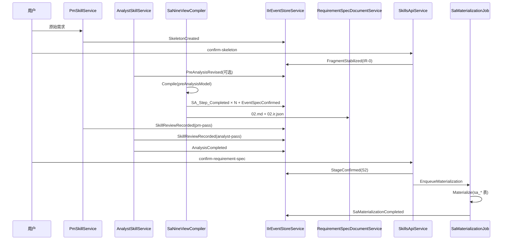
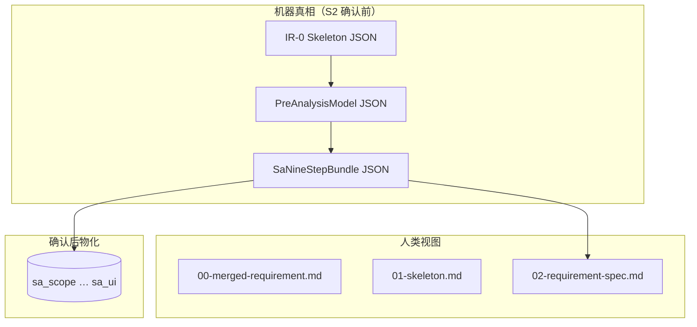

# 4、S2 预分析与 SA 九视图编译器施工包

> **状态：已落地（As-Built 2026-07-06，pipeline 311）** — 架构以 ADR-004 与 `openspec/specs/studio-s2-compile/spec.md` 为准  
> **创建：2026-07-06**  
> **上游共识：** Skills 负责智能分析；解析器（Compiler）负责 SA 九步视图分解；双 Skills 真审；用户确认后物化落库。  
> **冲突裁决：** 与本包冲突的旧实现（`SAOrchestrator.runSA` 默认 LLM 九步 + S2 同步写 `sa_*` 表）以本包为准。

---

## 1. 背景与目标

### 1.1 当前状态（【KNOWN】源码 + pipeline 309 运行时）

| 现象 | 根因（文件/方法） |
|------|-------------------|
| Analyst 单次 ~9min | `AnalystSkillService.ReasonAsync` → `ISaOrchestratorAdapter.RunProjectAsync` → `sa-service` `POST /api/sa/run-async` → `SAOrchestrator.runSA` 全 LLM |
| S2 期间已写 SA 九表 | `SAOrchestrator.runSA` 每步 `runStepWithValidation` 内 `saveToDb` → `SqlServerSADatabase.save*` |
| IR 长时间无进展 | `RunProjectAsync` 轮询完成前 `AnalystSkillService` 不 yield `SA_Step_Completed`（`AnalystSkillService.cs:114-175`） |
| `02` 字段薄（`default-pk`） | LLM Dict/ER 空 content + `EventSpecAssembler.ExtractConfirmedFields` 兜底（309 `02-requirement-spec.md`） |
| 用户确认与落库脱节 | `SkillsApiService.ConfirmRequirementSpecAsync` 仅写 `StageConfirmed`，不触发/不等待物化 |

### 1.2 期望状态（架构宪法）

```
原始需求 + 附件
  → ① PM Skill：预分析模型（IR-0 扩展）+ 01-skeleton
  → 用户确认骨架（FragmentStabilized）
  → ② 需求分析 Skill：完善预分析语义（仍 LLM，不写 sa_*）
  → ③ SaNineViewCompiler（纯代码）：预分析模型 → 九步视图 bundle
  → 合并进 02-requirement-spec.md + 02-requirement-spec.ir.json
  → ④ PM Skill 复审 + 需求分析 Skill 复审（对照：原需求 + 预分析 + 九步视图）
  → 驳回则改预分析 → 重跑 ③④；通过则 EventSpec stable + AnalysisCompleted
  → ⑤ 用户 confirm-requirement-spec（StageConfirmed S2）
  → ⑥ SaMaterializationJob（后台）：同一 Compiler 输出 → sa_* 九表 + SaMaterializationCompleted
```

**分工铁律：**

| 角色 | 职责 | 禁止 |
|------|------|------|
| **Skills（PM + Analyst）** | 语义、完整性、双审、与用户意图对齐 | 九步 LLM Agent；S2 写 `sa_*` |
| **SaNineViewCompiler** | 确定性九视图投影 + 合并文档 | LLM；业务语义「发明」 |
| **SaMaterializationJob** | 确认后异步落库 | 改变语义；阻塞用户 |

### 1.3 业务验收（Q1–Q3）

| # | 问题 | 本包答案 |
|---|------|----------|
| Q1 | 用户做什么？ | 确认骨架 → 读/批 `02` → 点确认需求分析说明书 |
| Q2 | 拿到什么？ | `02-requirement-spec.md` + JSON annex；确认后后台 sa 九表可查 |
| Q3 | E2E？ | `node scripts/phase-sup-s2-e2e.mjs` 全链 **compile 模式** exit 0；analyst wall-clock **&lt;60s**（309 级 14 事件） |

---

## 2. 目标架构

### 图 2-1 S2 主链路（sequenceDiagram）



### 图 2-2 数据真相分层



---

## 3. 核心契约

### 3.1 PreAnalysisModel（机器层 canonical）

**来源：** IR-0 `SkeletonCreated` payload 扩展 + Analyst Skill 修订字段。  
**存储：** `AI_IR_FRAGMENT_SNAPSHOT` 中 `FragmentType=IR0_Skeleton` 的 payload（stable 后 frozen）；可选独立 fragment `IR0_PreAnalysis`（阶段 2 再拆）。

**JSON Schema 要点（`openspec/changes/s2-preanalysis-schema/` 定稿）：**

```json
{
  "schemaVersion": "1.0",
  "systemName": "员工请假管理系统",
  "businessEvents": [
    {
      "eventId": "EV-001",
      "eventName": "提交请假申请",
      "complexityHint": "medium",
      "dependsOn": [],
      "description": "…"
    }
  ],
  "entityDrafts": [
    {
      "entityName": "LeaveRequest",
      "tableName": "OA_LEAVE_REQUEST",
      "fields": [
        { "name": "id", "type": "BIGINT", "required": true, "isPK": true }
      ]
    }
  ],
  "roleMatrix": [],
  "businessRules": [
    { "ruleId": "AR-001", "scope": "EV-005", "description": "≤3天主管审批…" }
  ],
  "stateTransitions": [
    { "entity": "LeaveRequest", "from": "Draft", "to": "Submitted", "trigger": "EV-001" }
  ],
  "nonFunctional": ["AD集成", "操作留痕"]
}
```

**PM Skill 输出约束修订（`PmSkillService.cs:92-96`）：** 强制 `businessRules`（complex 事件非空）、`entityDrafts.fields` 含类型与 required。

### 3.2 SaNineStepBundle（Compiler 输出）

与现 `SaProjectResult` / `EventSpecAssembler` 对齐，按 `SaStepMapping.IrStepOrder`（`SaStepMapping.cs:8-18`）：

| IR 步骤名 | Compiler 模块 | 输入 |
|-----------|---------------|------|
| DomainModel | `ScopeCompiler` | businessEvents → systemBoundary |
| AggregateDesign | `DfdCompiler` | events + entityDrafts → DFD JSON |
| EventCatalog | `BpmCompiler` | dependsOn + businessRules → BPM JSON |
| CommandQuery | `DictCompiler` | entityDrafts.fields → dict elements |
| DataModel | `ErCompiler` | entityDrafts → ER entities |
| UISpec | `StateMachineCompiler` | stateTransitions → STD JSON |
| IntegrationPoints | `PspecCompiler` | complex 事件 businessRules → pspec（模板） |
| WorkflowSpec | `DecisionTableCompiler` | complex 事件 approval rules → DT |
| DeliveryChecklist | `UiCompiler` | dict + event screens 规则表 → UI screens |

**每事件结构：** 与现 `SAEventResult.steps: Record<string, object>` 同形，供 `EventSpecAssembler.BuildPayloadJson` 无改或微改消费。

### 3.3 双审契约

| 审次 | Skill | 输入 | 输出 | 通过条件 |
|------|-------|------|------|----------|
| PM 复审 | `pm-skill`（新模式 `review`） | 原需求 + PreAnalysisModel + SaNineStepBundle | `SkillReviewRecorded` verdict=`pm-s2-pass` | 事件切分/范围/角色矩阵与原文一致 |
| Analyst 复审 | `analyst-skill`（新模式 `review`） | 同上 + IOI | `SkillReviewRecorded` verdict=`analyst-s2-pass` | 字段/规则/九步展开一致；`ioi.validate` 无 ERROR |

**AnalysisCompleted 前置：** 两次 review pass + 现有 `AnalysisCompletedCompletenessGate`（`AnalysisCompletedCompletenessGate.cs:34-88`）。

### 3.4 物化 Job

**触发：** `SkillsApiService.ConfirmRequirementSpecAsync` 成功 append `StageConfirmed` 之后。  
**输入：** frozen `SaNineStepBundle`（hash 写入事件 payload，防漂移）。  
**执行：** `SaMaterializationService.MaterializeAfterConfirmAsync` → `ISaMaterializer.MaterializeAsync`（**C# 直连 JNPF 主库**，As-Built 2026-07-06）。  
**禁止备选（已废弃）：** ~~HTTP `POST /api/sa/materialize`~~ · ~~sa-service `SqlServerSADatabase.save*` 写主库~~ — 见 ADR-004。

**S2 阶段禁止：** compile/agent 运行期间任何 `sa_*` 写入（物化仅 confirm 后）。

---

## 4. 影响范围

### 4.1 后端（C#）

| 文件 | 变更类型 |
|------|----------|
| `JNPF.InteAssistant/Sa/SaNineViewCompiler.cs` | **新增** |
| `JNPF.InteAssistant/Sa/SaNineViewCompiler*.cs` | **新增** 分步 Compiler |
| `JNPF.InteAssistant/Sa/ISaMaterializer.cs` | **新增** |
| `JNPF.InteAssistant/Sa/SaMaterializationJob.cs` | **新增** |
| `JNPF.InteAssistant/Skills/AnalystSkillService.cs` | **重构** 去 `RunProjectAsync`，改 Compile + 双审 |
| `JNPF.InteAssistant/Skills/PmSkillService.cs` | **扩展** review 模式 |
| `JNPF.InteAssistant/Skills/SkillsApiService.cs` | **扩展** confirm 触发 Job |
| `JNPF.InteAssistant/Studio/RequirementSpecDocumentService.cs` | **扩展** 读 bundle + JSON annex |
| `JNPF.InteAssistant/Studio/SkillDeliverableCoordinator.cs` | **调整** 写 `02.ir.json` |
| `JNPF.InteAssistant.Entitys/Ir/IrEventTypes.cs` | **新增** `SaNineViewCompiled`, `SaMaterializationCompleted`, `SaMaterializationFailed` |
| `JNPF.InteAssistant/Ir/IrSchemaValidator.cs` | **扩展** PreAnalysisModel 校验 |
| `JNPF.InteAssistant/Ir/AnalysisCompletedCompletenessGate.cs` | **扩展** 双审 pass 检查 |
| `JNPF.InteAssistant/Sa/SaOrchestratorAdapter.cs` | **标记 Obsolete** S2 路径；保留 Refiner 可选 |

### 4.2 sa-service（TypeScript）

| 文件 | 变更类型 |
|------|----------|
| `sa-service/src/compiler/SaNineViewCompiler.ts` | **新增**（与 C# 同测 golden；或 C# 为权威、TS 仅 materialize） |
| `sa-service/src/server.ts` | **新增** `POST /api/sa/materialize` |
| `sa-service/src/orchestrator/SAOrchestrator.ts` | **Feature flag** `SA_S2_MODE=compile|agent` |
| `sa-service/src/orchestrator/SqlServerSADatabase.ts` | **抽取** `materializeBundle()` 供 materialize 端点 |

### 4.3 前端 Studio

| 文件 | 变更类型 |
|------|----------|
| `jnpf-web-vue3/src/views/studio/composables/useAnalystSkill.ts` | 双审状态 + 物化进度 |
| `jnpf-web-vue3/src/views/studio/components/.../IrRequirementSpecConfirmCard.vue` | 展示 review 状态 / materialization |

### 4.4 脚本 / 测试

| 文件 | 变更类型 |
|------|----------|
| `scripts/phase-sup-s2-e2e.mjs` | compile 模式；analyst &lt;60s 断言 |
| `scripts/lib/phase-sup-api.mjs` | 监听 `SaMaterializationCompleted` |
| `backend/tests/JNPF.Tests.PhaseB/SaNineViewCompilerTests.cs` | **新增** |
| `sa-service/__tests__/SaNineViewCompiler.test.ts` | **新增** golden |

### 4.5 数据库

| 表 | S2 compile 阶段 | 确认后物化 |
|----|-----------------|------------|
| **AI_IR_EVENT** / **AI_IR_FRAGMENT_SNAPSHOT** | ✅ 读写 | ✅ |
| **INTE_ASSISTANT_DELIVERABLE**（FileStorage 索引） | ✅ 写 00/01/02 | ✅ |
| **sa_scope** … **sa_ui**（`20260706_SA_NineTables.sql`） | ❌ 不写 | ✅ Job 写入 |
| **BASE_AI_CALL_LOG** | Skills 审；Compiler 0 次 LLM | — |

---

## 5. 分阶段任务

### 阶段 0：ADR + Schema + Feature Flag（0.5d）

- [ ] **0.1** 新增 ADR：`openspec/adr/ADR-0XX-S2-Document-First-SA-Compiler.md`（宪法条文 + 回滚策略）
- [ ] **0.2** 定稿 `PreAnalysisModel` JSON Schema + 示例（309 骨架迁移样例）
- [ ] **0.3** 配置项：`SaPipeline:S2Mode=compile|agent`（默认 compile；agent 仅回归对比）

**验收：** Schema 校验 309 payload pass；ADR 评审签字。

---

### 阶段 1：SaNineViewCompiler 核心（1.5d）

- [ ] **1.1** 新增 `SaNineViewCompiler.Compile(PreAnalysisModel) → SaNineStepBundle`（C#）
- [ ] **1.2** 实现 `DictCompiler` + `ErCompiler` + `UiCompiler`（覆盖 309 confirmedFields 非 default-pk）
- [ ] **1.3** 实现 `ScopeCompiler` + `DfdCompiler` + `BpmCompiler` + `StateMachineCompiler`
- [ ] **1.4** 实现 `PspecCompiler` + `DecisionTableCompiler`（仅 complexity=complex 事件）
- [ ] **1.5** 单元测试：`SaNineViewCompilerTests` golden 309（14 事件 × 9 步 key 齐全）

**验收：**

```powershell
cd backend && dotnet test --filter SaNineViewCompilerTests
# 14 events × saStepsCompleted.Count == 9（complex 含 IntegrationPoints/WorkflowSpec）
# confirmedFields 含 LeaveRequest 字段，无仅 default-pk
```

---

### 阶段 2：Analyst 主链切换（1d）

- [ ] **2.1** `AnalystSkillService.ReasonAsync`：删除默认 `RunProjectAsync`；改为 `Compile → yield SA_Step + EventSpecConfirmed`
- [ ] **2.2** IR 事件 `SaNineViewCompiled`（payload 含 bundleHash、eventCount、compileMs）
- [ ] **2.3** `EventSpecAssembler`：优先从 Compiler 输出取字段；保留兜底
- [ ] **2.4** `SkillHarness.AfterSkillCompleted`：写 `02-requirement-spec.md` + `02-requirement-spec.ir.json`

**验收：**

```powershell
node scripts/phase-sup-s2-e2e.mjs analyst --pipeline-id <new>
# wall-clock < 60s；IR 有 SA_Step_Completed；sa_scope 表 row count == 0
```

---

### 阶段 3：双 Skills 复审（1d）

- [ ] **3.1** `PmSkillService` 增加 `RunMode.Review`：LLM 对照原需求 vs PreAnalysis vs 九步摘要；产出 `SkillReviewRecorded`
- [ ] **3.2** `AnalystSkillService` 增加 review pass：调用 `ioi.validate` + 规则完整性清单
- [ ] **3.3** `AnalysisCompletedCompletenessGate`：要求 `pm-s2-pass` + `analyst-s2-pass` 存在于经验事件
- [ ] **3.4** 编排：`AnalystSkillService` compile 后自动触发双审（或 `SkillsApiService` 分步 API）

**验收：** 故意改错预分析 → review fail → 无 `AnalysisCompleted`；修正后 pass。

---

### 阶段 4：用户确认 + 物化 Job（1d）

- [ ] **4.1** `SkillsApiService.ConfirmRequirementSpecAsync`：enqueue `SaMaterializationJob`（带 bundleHash）
- [ ] **4.2** `sa-service` `POST /api/sa/materialize`：接收 bundle → `SqlServerSADatabase` 批量 INSERT（全局链 + 事件并行）
- [ ] **4.3** Job 完成写 `SaMaterializationCompleted` / 失败 `SaMaterializationFailed`
- [ ] **4.4** `SAOrchestrator.runSA` S2 路径：`createDatabase` 强制 `InMemorySADatabase` 当 `S2Mode=compile`

**验收：**

```powershell
node scripts/phase-sup-s2-e2e.mjs verify --pipeline-id <id>
# confirm 前 sa_* 空；confirm 后 30s 内 SaMaterializationCompleted；sa_scope 有行
```

---

### 阶段 5：E2E + 前端 + 文档（1d）

- [ ] **5.1** 更新 `phase-sup-s2-e2e.mjs`：compile 默认；物化步骤 `materialize-wait`
- [ ] **5.2** Studio：确认卡展示双审状态、物化 Job 进度（SSE 或轮询 IR 事件）
- [ ] **5.3** 更新 `docs/AI原生开发/.../9、` 阶段二文档 §SA 九步为非 Agent
- [ ] **5.4** `progress-registry.yaml` 登记本包里程碑

**验收：** `node scripts/phase-sup-s2-e2e.mjs` 全链 exit 0；`pnpm type-check` pass。

---

### 阶段 6：Agent 路径降级（0.5d，可选）

- [ ] **6.1** `SA_S2_MODE=agent` 仅用于 promptfoo/对比测试
- [ ] **6.2** 文档标记 `runSA` LLM 九步为 **deprecated**
- [ ] **6.3** 删除或 guard 生产环境对 `RunProjectAsync` 的默认调用

**验收：** 生产配置 compile；agent 模式对比测试不阻塞发布。

---

## 6. Compiler 实现要点（穿透索引）

### 6.1 DictCompiler（示例逻辑）

**输入：** `PreAnalysisModel.entityDrafts[].fields`  
**输出：** 与 `DictOutput` 同形（`sa-service/src/orchestrator/orchestrator-types.ts`）

```
elements[].name / type / isRequired ← fields
namingConvention = UPPER_SNAKE（JNPF 表字段惯例）
```

### 6.2 UiCompiler

**输入：** Dict elements + eventName  
**规则：** 复用 `UIAgent.systemPrompt` 内 controlType 映射（`sa-service/src/agents/UIAgent.ts:26-34`）→ **代码表**，非 LLM。

### 6.3 Materialize 并行度

```
全局（顺序）：scope → dfd → bpm → dict → er → state_machine
并行：foreach event: pspec, decision_table, ui（Semaphore 10）
```

与现 `SAOrchestrator.ts:234-346` 并发模型一致，但 **无 LLM**，仅 INSERT。

---

## 7. 红线（违反即返工）

| # | 红线 | 依据 |
|---|------|------|
| RL-S2-1 | S2 compile 阶段 **禁止** INSERT `sa_*` | 用户确认前无 SA 库污染 |
| RL-S2-2 | 九步视图 **禁止** 默认走 LLM Agent | 本包宪法 |
| RL-S2-3 | Compiler **禁止** 调用 `ILlmGatewayService` | 分工铁律 |
| RL-S2-4 | 物化必须与 Compiler **同一份** bundle（hash 校验） | 防 IR/库漂移 |
| RL-S2-5 | 无 `pm-s2-pass` + `analyst-s2-pass` **禁止** `AnalysisCompleted` | 双审真实 |
| RL-S2-6 | 仍走 `IBaseSkill` / `SkillHarness` / IR 事件 blood（施工包 21 RL-4） | 架构一致 |
| RL-S2-7 | 业务 E2E 仍 `phase-sup-s2-e2e.mjs` exit 0，禁止 simulate IR | business-first |

---

## 8. 风险与对策

| 风险 | 概率 | 影响 | 对策 |
|------|------|------|------|
| PreAnalysisModel 不够细，Compiler 产出薄 | 中 | 中 | 加强 PM prompt + Analyst 修订；complex 保留可选 LLM Refiner **只补 businessRules** |
| C# / TS 双 Compiler 漂移 | 中 | 高 | **C# 为 S2 权威**；TS 仅 materialize + golden 对照测试 |
| 设计 Skill 误读 sa_* | 低 | 高 | 契约：S3+ 只读 IR EventSpec；集成测试 assert 不查 sa_* |
| 物化 Job 失败用户不知 | 中 | 中 | `SaMaterializationFailed` + Studio 告警；可重试 Job |
| 双审增加 LLM 成本 | 低 | 低 | Review prompt 短、只审 diff；比 20+ 九步 Agent 仍降 90%+ token |
| 回滚 | 低 | 中 | `SaPipeline:S2Mode=agent` 一键回退 |

---

## 9. 验证计划

### 9.1 构建

```powershell
cd backend && dotnet build application/JNPF.API.Entry/JNPF.API.Entry.csproj
cd sa-service && npm test
cd jnpf-web-vue3 && pnpm type-check
```

### 9.2 单元

```powershell
dotnet test --filter SaNineViewCompilerTests
dotnet test --filter AnalysisCompletedCompletenessGate
cd sa-service && npm test -- SaNineViewCompiler
```

### 9.3 业务 E2E

```powershell
# ① 快断言（日常默认 ~10s）
E2E_PIPELINE_ID=311 pnpm test:api

# ② 长链分步（Skill watch / 新建 pipeline / evidence）
node scripts/phase-sup-s2-e2e.mjs probe
node scripts/phase-sup-s2-e2e.mjs create
node scripts/phase-sup-s2-e2e.mjs gate
node scripts/phase-sup-s2-e2e.mjs pm
node scripts/phase-sup-s2-e2e.mjs confirm
node scripts/phase-sup-s2-e2e.mjs analyst    # compile 期望 <60s
node scripts/phase-sup-s2-e2e.mjs verify
node scripts/phase-sup-s2-e2e.mjs materialize-wait  # 待纳入

# ③ 探针
pnpm sync:http-env   # → api-tests/http/studio-s2-chain.http
```

> **工具选型：** `openspec/specs/studio-e2e-toolchain/spec.md` · **禁止**日常只跑 ② verify 而跳过 ①。

### 9.4 质量指标（309 对照）

| 指标 | 现况 Agent | 目标 Compile |
|------|------------|--------------|
| analyst wall-clock | ~542s | **&lt;60s** |
| EV-001 confirmedFields 行数 | 1（default-pk） | **≥ skeleton 相关字段数** |
| S2 期间 sa_scope rows | &gt;0 | **0** |
| confirm 后 sa_scope rows | 已有脏数据 | **=1** |

---

## 10. 本节核心表清单

| 表名 | 用途 | S2 compile | 确认后物化 |
|------|------|------------|------------|
| **AI_IR_EVENT** | 事件溯源 | R/W | R |
| **AI_IR_FRAGMENT_SNAPSHOT** | IR-0 / IR-1 快照 | R/W | R |
| **INTE_ASSISTANT_DELIVERABLE** | 交付物索引 | W | R |
| **sa_scope** | SA 边界 | **不写** | W |
| **sa_dfd** | DFD | **不写** | W |
| **sa_business_process** | BPM | **不写** | W |
| **sa_data_dictionary** | 字典 | **不写** | W |
| **sa_pspec** / **sa_decision_table** / **sa_ui** 等 | 事件级 | **不写** | W |
| **BASE_AI_CALL_LOG** | LLM 审计 | Skills 审 | — |

---

## 11. 本节关键代码路径索引

| 职责 | 路径 |
|------|------|
| PM 骨架 | `Skills/PmSkillService.cs` → `GenerateSkeletonViaTotAsync` |
| Analyst 现主链 | `Skills/AnalystSkillService.cs` → `RunProjectAsync`（**待替换**） |
| SA LLM 九步 | `sa-service/src/orchestrator/SAOrchestrator.ts` → `runSA` |
| 九步映射 | `Sa/SaStepMapping.cs` |
| EventSpec 组装 | `Skills/EventSpecAssembler.cs` |
| 说明书生成 | `Studio/RequirementSpecDocumentService.cs` → `BuildRequirementSpecMarkdown` |
| 用户确认 S2 | `Skills/SkillsApiService.cs` → `ConfirmRequirementSpecAsync` |
| 完整性门禁 | `Ir/AnalysisCompletedCompletenessGate.cs` |
| SA 表 DDL | `Migrations/20260706_SA_NineTables.sql` |
| S2 E2E | `scripts/phase-sup-s2-e2e.mjs` |

---

## 12. 审核清单（架构师签字前）

- [ ] 同意 S2 不写 `sa_*`，确认后物化
- [ ] 同意九步默认 Compiler，Agent 仅 deprecated/对比
- [ ] 同意 PreAnalysisModel 作为机器真相
- [ ] 同意双审 gating AnalysisCompleted
- [ ] 同意 C# Compiler + sa-service materialize 分工
- [ ] 确认回滚策略 `S2Mode=agent`
- [ ] 确认 E2E 指标（&lt;60s / 字段覆盖率）

**签字：** _______________ **日期：** _______________

---

## 13. 落地状态（As-Built 2026-07-06）

> **权威来源：** ADR-004 · `docs/architecture/studio-s2-compile-materialize.md`

### 13.1 与施工包差异（ intentional ）

| 施工包原案 | 实际落地 |
|------------|----------|
| 物化经 sa-service `POST /api/sa/materialize` | **C# `SaMaterializer`** SqlSugar 直连 JNPF 主库（避免 sa-service 连 SQLEXPRESS 失败） |
| 后台 `SaMaterializationJob` / Channel | **`ConfirmRequirementSpecAsync` 内同步调度** `MaterializeAfterConfirmAsync`（带 10min 超时） |

### 13.2 已实现清单

- [x] `SaNineViewCompiler` + `SaPipelineOptions.S2Mode=compile`（默认）
- [x] `AnalystSkillService` compile 分支 + `SaNineViewCompiled` IR
- [x] `SaMaterializationService` + `SaMaterializer` 九表物化
- [x] `SkillsApiService.ConfirmRequirementSpecAsync` 触发物化
- [x] pipeline **311** 业务验收：`AnalysisCompleted` + `SaMaterializationCompleted`
- [x] 证据：`.claude/evidence/phase-sup-s2-e2e.json` · `E2E_PIPELINE_ID=311 pnpm test:api`

### 13.3 待收口

- [ ] `phase-sup-s2-e2e.mjs materialize-wait` 标准步骤
- [ ] agent 模式与 C# compiler golden 持续对齐（Vitest + dotnet test）

---

## 14. 执行入口（已完成主链，维护模式）

1. 修改 S2 行为前必读 ADR-004 与 `studio-s2-compile/spec.md`
2. 回归：`node scripts/phase-sup-s2-e2e.mjs verify --pipeline-id 311`
3. 九表审计：`Migrations/scripts/sa-nine-tables-audit.sql`

---

## 本会话结论（episodic 索引友好）

- **决策：** S2 compile 主链 = Skills 语义 + `SaNineViewCompiler` + 双审 + 用户 confirm + **C# 物化**；sa-service 仅 agent 回归。
- **交付物：** ADR-004 · `openspec/specs/studio-s2-compile/spec.md` · `docs/architecture/studio-s2-compile-materialize.md`
- **禁止项：** compile 主链依赖 sa-service；S2 期间写 sa_*；sa-service 写业务库物化
- **待审/阻塞：** 第 2 步 `phase-sup-s34-e2e.mjs` 脚本修复
- **下一步：** 22 号文档第 2 步 S3→S4
