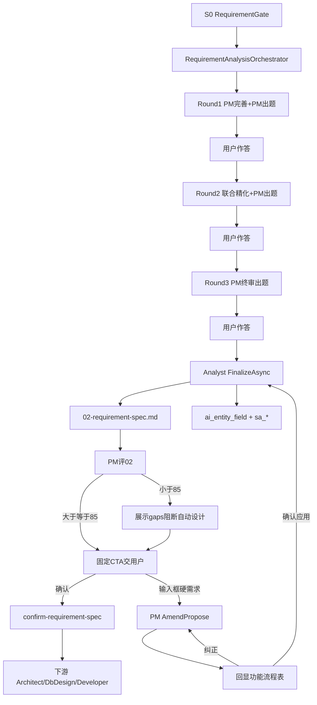

> ⛔ **已废止 · DEPRECATED（2026-07-17）**  
> 本文档为旧计划（25–33 号），**禁止**再作编码或验收依据。  
> **现行施工依据：** [1、阶段A.md](../1、多用户多任务并行/1、阶段A.md) · [2、阶段B.md](../1、多用户多任务并行/2、阶段B.md) · [3、阶段C.md](../1、多用户多任务并行/3、阶段C.md)

---
# 需求分析子链重构方案书（修订版）

> **文档性质**：架构总纲（v2.1 · PM 领域专家闭环）  
> **版本**：v2.1 | **修订日期**：2026-07-11  
> **状态**：现行实施标准（与 26/27/28/30 对齐；v1.2 重型管线已废止）  
> **上级约束**：三元组铁律 R12 · ADR-004（S2 compile + C# 物化）· ADR-005（澄清问答）  
> **v2.1 增量**：恢复 PM=领域专家（出题/终评/确认前 Amend）；编排器禁止代问；题型仅 MULTI/MATRIX；PM 评 02≥85；确认 CTA + 确认前修订 / 确认后 fork  
> **实施分解**（唯一施工入口）：  
> - [`26、需求分析重构-第一阶段开发计划（数据基座与SA编译增强）.md`](./26、需求分析重构-第一阶段开发计划（数据基座与SA编译增强）.md)  
> - [`27、需求分析重构-第二阶段开发计划（三轮循环与矩阵题）.md`](./27、需求分析重构-第二阶段开发计划（三轮循环与矩阵题）.md)  
> - [`28、需求分析重构-第三阶段开发计划（需求分析书与质量验收）.md`](./28、需求分析重构-第三阶段开发计划（需求分析书与质量验收）.md)  
> - 冲刺验收：[`30、全链条冲刺开发计划（最后一公里）.md`](./30、全链条冲刺开发计划（最后一公里）.md) §0.11  
> - **实现施工包（已验收 · 2026-07-11）：** [`31、需求分析增强开发计划（PM专家闭环）.md`](./31、需求分析增强开发计划（PM专家闭环）.md)  
> - **算法与进化学习（已验收 · 2026-07-11 首批 B0–A5）：** [`32、需求分析算法与进化学习研究包.md`](./32、需求分析算法与进化学习研究包.md)

---

## 0. 阅读铁律（后来者必读）

**本文是需求分析子链（S1–S2）的架构总纲。施工细节以 26/27/28 为准；本文与三者冲突时，以 26/27/28 为准。**

| 文档 | 职责 |
|------|------|
| **25（本文）** | 不可协商决策 + 主链路 + 废止清单 + 下游消费契约 |
| **26** | 数据基座（2 表 + 1 VIEW）+ Round 3 工程接线 + LLM 稳定性基建 |
| **27** | 三轮编排器（只编排）+ **PM 专家出题/终评/Amend** + 联合精化 + 限流/路由 |
| **28** | 需求分析书渲染 + DDD + 工程质量分 + **确认 CTA** + E2E |
| **30** | 全链冲刺；SG1/SG2 业务① 以本文 v2.1 + §0.11 为准 |

### 0.1 对全链条 8–16 号文档的关系

| 文档 | 关系 |
|------|------|
| **9 号（第二阶段）** | 其中 PM/Analyst/sa-service 九步主链描述 **已被本文 + 26–28 取代**；不得再按 9 号旧主链施工 |
| **11 号（第三阶段）** | 设计四 Skill 正文仍有效；**IR-1 / AnalysisCompleted 前置**须按本文 §6 与 28 号验收 |
| **8 / 10 / 12–16** | 非本子链施工包；仅当引用「需求分析产出形态」时，以本文 §6 为准 |

### 0.2 v1.2 → v2.0 废止清单（禁止再实现）

下列项曾出现在本文件 v1.2 正文中，**已全部废止**。后续阶段开发者若按下列方式实现 = 违反现行标准：

| 废止项 | 废止原因 | 现行替代（26/27/28） |
|--------|----------|---------------------|
| 每轮投影 + 每轮 R1–R3 + 每轮 Materializer | 过重；C# 编译毫秒级不值得每轮落库 | **仅 Round 3** 一次性工程保障 |
| `ScannerValidator` 独立模块 + `sa_scanner_validation` | 过度工程 | `LightStructureValidator`（~50 行，内存 WARNING） |
| 确定性出题引擎 + 固定 Q1–Q9 | AI 比规则灵活；行业惯例不问用户 | PM Skill **自主出题**（每轮最多 3 题；仅 MULTI/MATRIX） |
| **编排器 `_llm.ChatAsync` 冒充 PM 出题** | 掏空专家职责；种子/MCP 不参与提问 | **禁止**；出题 MUST 经 `PmSkillService.GenerateClarificationAsync` |
| 普通 `SINGLE` 澄清题（非矩阵行内） | 产品要求多选/矩阵决策 | 仅 `MULTI` / `MATRIX_SINGLE` / `MATRIX_MULTI` |
| &lt;85 盲清三轮空跑 **或** 自动 gaps 再问多轮 | 浪费已答 / **用户疲劳** | **展示 gaps + 阻断自动设计**；质量靠 Amend 硬需求与杠杆增强（见 31） |
| 确认前把用户续写只 append 到 Markdown | IR 与说明书分裂 = 假绿 | PM `AmendAsync` → 写 IR → 再 Finalize（见决策 10） |
| StageConfirmed 后同 pipeline 静默大改 02 | 破坏已确认契约 | **enhancement fork**（三元组新 pipeline） |
| `cascadeUpdate` + `sa_event_dependencies` + BFS | C# 全量重编译足够快 | **全量重编译**，无增量依赖图 |
| 5 张 `sa_ddd_*` 表 + 5 个 DDD 增强器 | DDD 是投影维度，不是独立管道 | `DddProjection` **渲染时实时推导**，不落表 |
| `ISaStepEnhancer` / `NoopEnhancer` 等接口族 | 过度抽象 | `Assumption` + `StepEnhancement` 两个 record |
| 独立 `PSpecEnhancer` / `DecisionTableEnhancer` 模块 | 多一次管线 | Round 2 **联合 LLM** 内追加属性 |
| 分批读取 / `RequirementContextBuilder` | 5 事件规模不需要 | 单次读全部内存 SA 产出 |
| M2「SA LLM 分离 + DDD 增强」独立里程碑 | 内容已拆入 27/28 | 无独立 M2 |
| sa-service 写主库做物化 | ADR-004 | Round 3 后 **C# `SaMaterializer`** |

---

## 1. 背景与目标

### 1.1 要解决的问题

| # | 问题 | 现行对策（v2.0） |
|---|------|------------------|
| 1 | PM 被掏空成「拆骨架」，出题由编排器代问 | **PM=领域专家**：完善 + **自主出题** + 终评 + 确认前 Amend；编排器只编排 |
| 2 | 单线流程、无迭代精化 | 三轮编排器（轻量 for 循环，**循环内调 PM**） |
| 3 | 追问浪费用户时间 | 每轮最多 3 题；仅 MULTI/MATRIX；行业惯例不问用户 |
| 4 | Analyst 不投影 → 下游断线 | Round 3：`EntityDesignProjector` → **ai_entity_field** |
| 5 | 工程步骤过重拖垮体验 | Round 1/2 **零工程**；Round 3 一次性保障 |
| 6 | 02 未达业务质量就交用户 / 进设计 | PM 评 02 **≥85** 才交确认；&lt;85 展示 gaps、**不**自动再问；用户 Amend/强制确认 |
| 7 | 确认前续写无 IR 闭环 / 用户无感知 | Amend **先回显理解摘要** → 用户确认 → IR → Finalize → 再 CTA |

### 1.2 业务目标（不变）

```
质量：  《需求分析说明书》可直接交开发；**PM 业务分 ≥85** 才交用户确认
交互：  ≤ 3 轮 × 3 题（仅 MULTI/MATRIX）；行业惯例不问用户；确认 CTA 固定文案
确定性：SA 7 步纯 C# + PSpec/DT 2 步 LLM 精化（只追加属性）
数据：  Round 3 后 ai_entity_field + sa_* 九表 + assumptions/consistency/quality
性能：  端到端约 9 分钟（含用户作答）；LLM 约 4–6 次（含终评；Amend 按需；红队属 31 可选，本阶段不做）
```

### 1.3 业务优先三问（验收锚点）

- **Q1**：用户在 Studio 提交需求 → 回答最多 9 道 **PM 专家**澄清题（多选/矩阵）→ 审阅 02 → 同意确认或输入框补充硬需求  
- **Q2**：产物 = `02-requirement-spec.md` + **ai_entity_field** + **sa_*** + 工程分 + PM 终评 IR（+ 31 杠杆：验收句/红队等）  
- **Q3**：三轮闭环 + PM≥85 门禁 + **确认前 Amend** + 质量 API + 交付物断言  

---

## 2. 核心架构决策（v2.1 · 不可协商）

### 决策 1：三轮是 AI 迭代精化，不是重型工程管线

```
Round 1：PM 完善 + PM 自主出 ≤3 题 → SA C# 编译（内存）→ 轻量校验 WARNING → 用户答
Round 2：联合精化（含 PSpec/DT LLM 追加）+ **PM 出** ≤3 题 → SA 全量重编译（内存）→ 用户答
Round 3：PM 终审出题 ≤3 → 用户答 → ★ Finalize 工程保障 → PM 评 02（决策 9）
```

- 编排器：`RequirementAnalysisOrchestrator`（轻量 for 循环，**禁止自管出题 LLM**）  
- 挂载点：Analysis 阶段（`POST .../requirement-analysis/{pipelineId}/run`），**不**挂在 S0 `RequirementGateService`  
- 暂停/恢复：复用 ADR-005（`ClarificationRequested` / `ClarificationAnswered`）；stage = `requirement-analysis-round1|2|3`

### 决策 2：产品经理是行业专家（非管线零件）

| PM 必须做 | PM 禁止退化成 |
|-----------|----------------|
| Round1：补全行业惯例 + 产骨架 + **自主出题** | 只拆 JSON 骨架 |
| Round2/3：**自主出题**（上下文可来自联合精化/编译结果） | 由编排器 `_llm` 冒充「PM 视角」出题 |
| Finalize 后：**评价 02**（score/gaps，≥85 交用户） | 终评缺失或仅用工程 `sa_quality_score` 顶替业务分 |
| 确认前续写：`AmendAsync` → IR → 再 Finalize | 只把用户话 append 进 Markdown |

- 出题载体：`ClarificationQuestion`（含 `ContextHint` / `DefaultOption` / `QuestionFormat` / `MatrixSubItems`）  
- 题型：**仅** `MULTI` / `MATRIX_SINGLE` / `MATRIX_MULTI`（禁止普通 `SINGLE`；矩阵行内单选保留）  
- 出题入口：`PmSkillService.GenerateClarificationAsync`（须注入种子 + MCP）  
- **禁止**再实现「确定性出题引擎 + 固定 Q1–Q9」  
- **禁止**编排器静默代问（PM 未注册 → Fail-Fast，不得降级为编排器 Chat）

### 决策 3：SA = 7 步 C# + 2 步 LLM 精化

| 类型 | 步骤 | 实现 |
|------|------|------|
| 纯 C# | Scope / DFD / BPM / Dict / ER / StateMachine / UI | `SaNineViewCompiler` |
| LLM 精化 | PSpec / DecisionTable | Round 2 联合 LLM：**只追加** boundaries/exceptions/preconditions/edge_cases |

**宪法二**：LLM 不得增删实体/字段；主体（processSpecs/tables 等）不可变；违规则忽略 + WARNING。

### 决策 4：经典 SA 命名保留

步骤语义仍为 Scope→DFD→BPM→Dict→PSpec→DecisionTable→ER→StateMachine→UI。  
代码侧 IR 步骤名可与 DDD 历史命名并存（`SaStepMapping`），**文档与交付物对外使用经典 SA 名**。

### 决策 5：DDD 是渲染时投影维度（不落表，但是 normative 验收标准）

> **定位澄清：** 「不落表」指**存储形态**（不建 sa_ddd_*），**不**指「仅参考」。DDD 是需求分析/架构/总体设计的 **normative 标准**——必须可审、低 confidence 可门禁。详见 [`30`](./30、全链条冲刺开发计划（最后一公里）.md) §0.8。

- 实现：`DddProjection`（28 号）从 SA 产出 + **ai_entity_field** 实时推导 5 视角  
- 标记 confidence；写入需求分析书 §3  
- **禁止**再建 `sa_ddd_*` 五表或独立 DDD 增强器管线

### 决策 6：仅 Round 3 做工程一次性保障

```
前两轮：Compile → 内存 Assumptions / WARNING → PM 出题；不投影、不门禁、不 Materializer
第 3 轮用户答完后：
  ① SA 最终全量 C# 编译（禁止 compileResult=null 静默跳过）             〔26 接线〕
  ② EntityDesignProjector → PersistAsync（ai_entity_field）            〔26 接线〕
  ③ R1–R3 门禁（Analyst 阶段不要求 DDL/FormPageIR）                    〔26 接线〕
  ④ SaMaterializer → sa_* 九表（与投影同事务优先）                       〔26 接线〕
  ⑤ sa_assumptions 独立事务（失败告警不阻断）                           〔26 接线〕
  ⑥ ConsistencyChecker → sa_consistency                                〔28 实现〕
  ⑦ QualityScoreCalculator → sa_quality_score（工程分，≠ PM 业务分）    〔28 实现〕
  ⑧ DddProjection + RequirementDocumentRenderer → 02-requirement-spec.md 〔28 实现〕
  ⑨ PM 评价 02 → RequirementSpecPmReviewed（决策 9）→ 达分后才交用户确认  〔27 PM 终评〕
```

**禁止**：Round 1/2 写九表或投影；**禁止** `SkillDeliverableCoordinator` 用旧 EventSpec 模板覆盖 Round 3 新渲染器产物。

### 决策 7：全量重编译，无 cascadeUpdate

C# 编译毫秒级；用户改答后重跑编排器即全量 `CompileFromSkeletonJson`。  
Assumptions 跨轮经 IR fragment `IR1_Assumptions` / 事件 `AssumptionsCollected` 持久化，禁止仅靠进程内存。

### 决策 8：三元组完整（R12）

一切写入（IR / **ai_entity_field** / **sa_*** / assumptions / consistency / quality）MUST 带 `(tenantId, projectId, pipelineId)`。  
编排器写 IR 前 MUST 进入 `SkillExecutionScope`，禁止 `PipelineId` 回退为 `projectId`。

### 决策 9：PM 终评门禁（无自动再问 · 2026-07-11 修订）

- Finalize 写出 02 后 → **同一 PM Skill** 评价：`{ score, verdict, gaps[] }`，IR `RequirementSpecPmReviewed`  
- **≥85**：才允许交用户确认 / 自动进设计  
- **&lt;85：禁止自动再开澄清轮**（防疲劳）；展示 score+gaps；阻断自动进设计  
- 用户路径：**输入框 Amend 硬需求（推荐，含理解回显）** / 强制确认（留痕）/ 手动从头  
- 质量提升靠：三轮内专家出题 + Amend 回显 + 02 轻量增强章（见 **31 v1.3**）；**不靠加轮次、不靠红队独立门禁（本阶段不做）**

不变量：评价 IR 追加留痕；无新用户输入禁止空转 Finalize 刷分。

### 决策 10：确认 CTA + 确认前硬需求 Amend（含理解回显）/ 确认后 fork

**固定 CTA**（02 末尾 + 确认卡同一句）：

> 请你确认需求分析说明书，如果同意，推进到下一工作阶段，如果不满意，请在输入框继续提出你的问题和要求。

| 用户动作 | 系统处理 |
|----------|----------|
| 同意（点确认） | `confirm-requirement-spec` → StageConfirmed → 物化 → 可进架构 |
| 不满意（输入框续写） | **确认前**：PM `AmendProposeAsync` → **回显理解摘要**（新增/变更的功能、流程、数据表/实体）→ 用户【确认应用】后才写 IR → Finalize → 再评 → 再 CTA；用户可纠正后重 Propose（同窗口最多 3 次确认应用） |
| 确认后新业务需求 | 同 pipeline **禁止**静默改已确认 02 → **enhancement fork** |

**禁止**：解析后未回显确认就静默改 02；LLM 只改 Markdown；确认前误触发 gate/三轮空跑；确认后原地大改。

---

## 3. 主链路（现行 v2.1）



### 3.1 关键代码路径

| 能力 | 路径 |
|------|------|
| 三轮编排（只编排） | `Skills/RequirementAnalysisOrchestrator.cs` |
| PM 专家（骨架/出题/终评/Amend） | `Skills/PmSkillService.cs` |
| Round 3 工程保障 | `Skills/AnalystSkillService.FinalizeAsync` |
| SA 编译 | `Sa/SaNineViewCompiler.cs` |
| 物化 | `Sa/SaMaterializer.cs` |
| 投影 | `Codegen/EntityDesign/EntityDesignProjector.cs` + `EntityDesignRepository` |
| 轻量校验 | `Gates/LightStructureValidator.cs` |
| 一致性 / 工程质量 | `Gates/ConsistencyChecker.cs` · `Gates/QualityScoreCalculator.cs` |
| DDD / 渲染 / CTA 尾段 | `Studio/DddProjection.cs` · `Studio/RequirementDocumentRenderer.cs` |
| 质量 API | `Studio/QualityApiService.cs` → `GET /api/studio/quality/{id}/score\|consistency` |
| 确认 | `SkillsApiService.ConfirmRequirementSpecAsync` |
| 前端续跑 / 确认卡 | `skills.ts` `runRequirementAnalysis` · `IrRequirementSpecConfirmCard.vue` · `AiChatPanel` |

### 3.2 LLM 预算（约 4–6 次主路径）

| 调用 | 时机 | 执行方 |
|------|------|--------|
| PM ToT 骨架 / Enhance | Round 1 | **PmSkillService** |
| 出题 LLM | Round 1/2/3 | **PmSkillService.GenerateClarificationAsync**（禁止编排器直连） |
| 联合精化（含 PSpec/DT） | Round 2 | Analyst/联合入口（出题仍归 PM） |
| PM 终评 02 | Finalize 后 | **PmSkillService** |
| gaps 展示 / Amend | 按需 | **PmSkillService**（**不**因 gaps 自动出题） |

基础设施（26）：3 Provider 降级链 · 真熔断 · JSON 修复 · Token 预估。  
应用层（27）：并发限流 · 超时分级 · 按任务路由 Provider。

---

## 4. 数据基座（4 个 DDL 对象）

迁移文件：`backend/modularity/inteAssistant/Migrations/20260708_P9_ReqA.sql`

| 对象 | 类型 | 写入方 |
|------|------|--------|
| **sa_assumptions** | 表 | Round 3 `PersistAssumptionsAsync` |
| **sa_consistency** | 表 | `ConsistencyChecker` |
| **sa_quality_score** | 表 | `QualityScoreCalculator`（工程分） |
| **sa_entity_fields** | VIEW → **ai_entity_field** | 只读；一致性规则 1 查询源 |

另：既有 **sa_*** 九表由 `SaMaterializer` 写入；既有 **ai_entity_field** 为声明 3 唯一字段源。  
PM 业务分 / Amend 以 **IR 事件**留痕（`RequirementSpecPmReviewed` / `RequirementAmendment*`），不另建评分表顶替。

**禁止**再建：`sa_scanner_validation`、`sa_event_dependencies`、`sa_ddd_*`、为一致性单独建的 dfd_flows/cspec_roles 物理表。

---

## 5. 需求分析书结构（28 号渲染器）

纯 C#、无 LLM。结构：

```
封面（含工程质量综合评分；另展示 PM 业务分若已评）
1. 系统概述
2. 业务事件详细分析（SA 产出）
3. 领域设计增强（DddProjection 5 视角 + confidence）
4. 全局数据模型（ai_entity_field；含 ER 关系）
5. 一致性分析（sa_consistency / findings）
6. 质量评估（sa_quality_score，5 维含 DDD）
附录：状态转换 / 权限矩阵 / 业务规则 / 假设项 / 澄清答案摘要
末尾固定 CTA（决策 10 原文）
```

工程质量门控口径：综合分 ≥ 60；结构完整度 ≥ 70；无 CRITICAL（与 `QualityScore.PassesGate` 一致）。  
**业务交用户口径**：PM 业务分 ≥ 85（决策 9）；二者不可互相顶替。

---

## 6. 下游消费契约（给 11+ 阶段）

下游（Architect / DbDesign / UI / SystemDesign / Developer）**必须**：

1. 实体字段只读 **ai_entity_field**（或 VIEW **sa_entity_fields**），禁止各自 parse IR JSON 当唯一源  
2. 以 `AnalysisCompleted` 且 `finalized=true` **且**（PM ≥85 或用户强制确认）作为可开设计的业务前置  
3. 交付物以 Round 3 新渲染器写入的 `02-requirement-spec.md` 为准  
4. 查询质量/一致性走 `QualityApiService`（三元组过滤）  
5. 已 `StageConfirmed` 后的新需求走 enhancement fork，禁止假定可原地改 02

下游**禁止**：

- 假设「每轮都有九表快照」  
- 假设存在 `sa_ddd_*` 或 ScannerValidator 表  
- 用旧 `RequirementSpecDocumentService` 覆盖已 finalized 的 02  
- 用工程 `sa_quality_score` 冒充 PM 业务终评  

---

## 7. 红线（不可违反）

```
红线 1：≤ 3 轮 × 3 题；仅 MULTI/MATRIX；行业惯例不问用户
红线 2：SA 7 步纯 C#；PSpec/DT 只精化不增删实体字段
红线 3：Round 1/2 零工程步骤（无投影/门禁/Materializer）
红线 4：Round 3 投影+门禁在 Materializer 之前；投影与九表优先同事务
红线 5：DDD 不落物理表；仅渲染时推导
红线 6：无 cascadeUpdate；全量重编译
红线 7：三元组完整；编排器写 IR 必须 SkillExecutionScope
红线 8：Finalize 不得因 pendingEvents=0 静默跳过；不得用旧 02 覆盖新渲染器
红线 9：出题/终评/Amend MUST 经 PM Skill；禁止编排器代问
红线 10：PM 业务分 <85 不得自动进设计（除非强制确认）；**禁止**因 <85 自动再开澄清轮；禁止盲清三轮空跑
红线 11：确认前输入框 = 硬需求；MUST 先回显理解摘要经用户确认再写 IR+Finalize；确认后新需求必须 fork
红线 12：结构化澄清仅三轮×≤3；质量靠专家+Amend+杠杆，不靠加轮次
```

---

## 8. 实施与验收入口

| 阶段 | 文档 | 验收要点 |
|------|------|----------|
| 数据基座 + LLM 基建 | 26 | DDL；LightStructureValidator；Finalize 接线；降级/熔断/JSON/Token |
| 三轮编排 + PM 专家 | 27 / **31 v1.3 P0** | 出题/终评/Amend 回显；无 gaps 自动再问；无红队独立门禁 |
| 书 + CTA + 轻量增强章 | 28 / **31 P1 可选** | Renderer CTA；非目标/失败/MVP/验收要点写进 02 |
| 书 + 工程质量 + CTA | 28 | Renderer；CTA 尾段；DddProjection；Consistency/Quality；E2E |
| 冲刺 SG1/SG2 | 30 §0.11 | 业务① 含专家追问、≥85、CTA、Amend |

推荐命令：

```powershell
dotnet build modularity/inteAssistant/JNPF.InteAssistant/JNPF.InteAssistant.csproj
# 编排器长链（需后端 + LLM）
pnpm vitest run tests/api/studio-requirement-analysis-e2e.test.mjs
```

---

## 附录 A：v1.2 审查意见在 v2.1 下的处置

| 原 v1.2 项 | v2.1 处置 |
|------------|-----------|
| 三轮循环是核心控制流 | **保留**（形态改为轻量 for 循环） |
| SA 7 步零 LLM | **保留** |
| 矩阵题作为问题格式 | **保留且收紧**：仅 MULTI/MATRIX_*，禁普通 SINGLE |
| 每轮投影/门禁 | **废止** → 仅 Round 3 |
| ScannerValidator | **废止** → LightStructureValidator |
| cascadeUpdate + 依赖图 | **废止** → 全量重编译 |
| DDD 五表 | **废止** → 实时推导 |
| Assumption 追踪 | **保留**（sa_assumptions + IR 跨轮 fragment） |
| ClarificationQuestion DTO 增强 | **保留** |
| 挂载在 RequirementGate | **仍拒绝**（挂 Analysis 编排器） |
| PM 自主出题 | **强化**：实现不得漂移为编排器代问 |
| PM 终评 / Amend | **v2.1 新增**（决策 9–10） |

---

## 附录 B：文档维护约定

1. 改需求分析子链实现前：先读本文 §2 决策 + 对应 26/27/28 章节 + 30 §0.11。  
2. 若实现偏离本文决策：先修订 26/27/28/30 与本文，再改代码（禁止「代码偷偷回退到编排器代问」）。  
3. 修订 9/11 号全链条计划时：需求分析章节只允许引用本文与 26–28，禁止复活废止清单中的模块名。

---

## 附录 C：v2.0 → v2.1 变更摘要

| 项 | v2.0 | v2.1 |
|----|------|------|
| 出题执行方 | 文案写 PM，实现易漂到编排器 | **钉死 PM Skill**；编排器代问=违规 |
| 题型 | 含 SINGLE | **禁普通 SINGLE** |
| 交用户门槛 | 工程分 ≥60 等 | **另加 PM 业务分 ≥85** |
| &lt;85 | 未定义 | **展示 gaps + Amend/force**（废止自动再问） |
| 超人类杠杆 | 无 | **31 Phase F–H** |
| 确认文案 | 弱提示 | **固定 CTA** |
| 确认前续写 | 未闭环 | PM Amend → IR → 再 Finalize |
| 确认后新需求 | 未钉死 | enhancement fork |