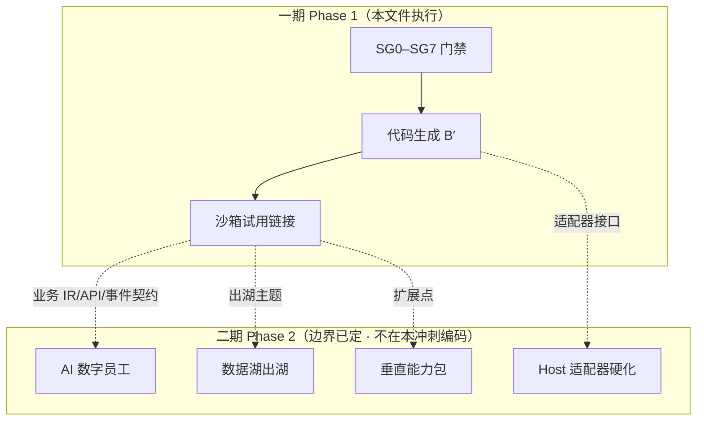
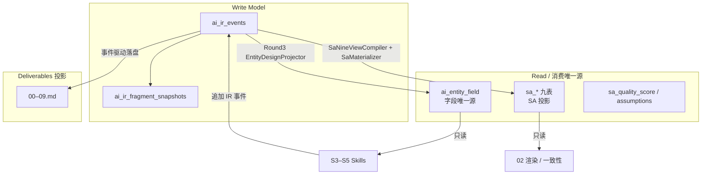
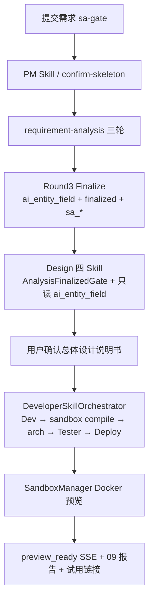
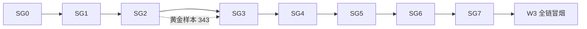
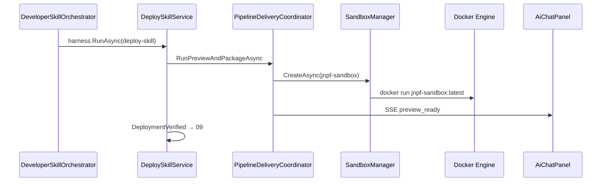

> ⛔ **已废止 · DEPRECATED（2026-07-17）**  
> 本文档为旧计划（25–33 号），**禁止**再作编码或验收依据。  
> **现行施工依据：** [1、阶段A.md](../1、多用户多任务并行/1、阶段A.md) · [2、阶段B.md](../1、多用户多任务并行/2、阶段B.md) · [3、阶段C.md](../1、多用户多任务并行/3、阶段C.md)

---
# 30、全链条冲刺开发计划（最后一公里）

> **文档编号：** 30  
> **版本：** v2.4（2026-07-11 · 对齐 25 v2.1：PM 专家闭环）  
> **前版：** v2.3（业务功能目标）· v2.2（一期边界）· v2.1（四大支柱）· v2.0（分阶段门禁）· v1.0（全链冲刺）  
> **定位：** AI 原生开发平台「提需求 → 试用链接」的**施工与验收宪法级指南**；**一期快速实现范围以本版为准**  
> **上级清单：** ~~[`29、战略转移.md`](./29、战略转移.md)~~（已归档至 [`docs/过期存档/29、战略转移.md`](../../过期存档/29、战略转移.md)，任务已并入本文）
> **契约锚点：** [`25`](./25、需求分析子链重构方案书（修订版）.md) **v2.1** §2/§6 · [`26`](./26)–[`28`](./28) v2.1 · [`12`](./12、全链条第四阶段开发计划.md) codegen  
> **铁律锚点：** 实现完整性铁律 · 三元组 R12 · Business First · **DDD 真标准（§0.8）** · **代码生成 B′（§0.9）**  
> **验收支柱：** §0.6 四大强制支柱（= 全链条冲刺铁律 F1–F4）  
> **项目规则：** `.cursor/rules/fullchain-sprint-iron-law.mdc` · `.claude/rules/fullchain-sprint-iron-law.md`  
> **v2.4 增量：** SG1/SG2 ① 含 PM 自主出题/终评≥85/固定 CTA/确认前 Amend；禁编排器代问

---

## 0. 阶段定位与完成定义

### 0.1 业务目标（Business First）

| # | 问题 | 答案 |
|---|------|------|
| Q1 | 用户做什么？ | Studio 提交需求 → 门控 → **PM 专家骨架** → **PM 出题三轮** → Finalize → **PM≥85** → 确认 02（或 Amend）→ 设计四 Skill → **确认总体设计说明书** → 等待进度 → **打开试用链接** |
| Q2 | 用户拿到什么？ | `00–09` 交付物可下载；聊天区全程 SSE 进度；**可点击的预览 URL** + `09-deployment-report.md` |
| Q3 | 怎么验收？ | **新 pipeline**（非 311）在 **各阶段门禁（SG）全部通过** 后，再跑全链到试用链接；`pnpm test:api` 硬断言 + Docker 预览 200 |

**最终 DoD（产品完成）：** 任意授权用户用一条新 pipeline，无需手点「运行部署」，确认总体设计后自动完成开发→测试→部署，聊天区试用链接可打开。

**执行 DoD（v2.0 强制）：** 最终 DoD **不得**跳过 §5 阶段门禁。未通过当前 SG，禁止进入下一阶段施工或宣称该阶段完成。

**阶段验收 DoD（v2.1 强制）：** 每个 SG / W 节点的「检查、修复、完善」**必须同时满足 §0.6 四大支柱**；缺任一支柱不得勾选该节点完成。

### 0.6 四大验收支柱（检查 / 修复 / 完善 · 强制）

> 来源：产品要求（2026-07-11）。v2.0 已覆盖②③的大部分；**①分散未成清单；④（xUnit）基本未写入**。v2.1 起四者并列、每节点必勾。

| # | 支柱 | 含义（本平台） | 每阶段必须回答 | 主要落点 |
|---|------|----------------|----------------|----------|
| **①** | **业务功能实现正确完整** | 本阶段**业务能力本体**按设计（25–28 / ADR / §0.11）做对做全；用户可感知产物正确；**禁止**用纠偏项/文案/单测绿顶替 | 本阶段业务功能一句话？用户操作？完整产物？对照 §0.11 哪几条？ | **§0.11（强制）** · 各 SG「业务功能实现目标」· 节点审批第 1 项 |
| **②** | **数据正确 + 全链一致性对接** | 本阶段写入/投影正确；与上游唯一源一致；契约无漂移；三元组完整 | 读了哪个唯一源？写出了哪些投影？与上游字段/事件是否 ⊆ 一致？ | §0.4 · §5.9 · 各 SG 数据行 · L1 内容抽检 |
| **③** | **排除旧方案实现干扰** | 生产路径不走旧 Analyst/九步/parse-IR-当字段源/311 假绿；双轨入口已切断或隔离 | 本阶段是否仍调用旧 API/旧模板/第二源？Grep 旁路结果？ | §0.3 · W0-T3 · W1 · 各 SG「旧路径」行 |
| **④** | **核心功能可 xUnit 单测** | 本阶段**确定性核心**（门禁、投影、编译器、校验器、编排状态机）有或补齐 `backend/tests` xUnit；LLM 全链路不替代单测 | 核心类/方法的 xUnit 路径？缺口是否建单？命令是否绿？ | §5.10 · §12 L0.5 · `JNPF.Tests.PhaseB` / `JNPF.Tests.Gate` |

**支柱关系（勿混用）：**

```text
① 定「业务功能做对做全」 ← Business First + §0.11 各阶段目标（错题本 M035）
② 定「数据没歪」         ← IR / ai_entity_field / sa_* 分层
③ 定「没被旧代码带偏」   ← 双轨清除 + 禁第二源
④ 定「核心可回归」       ← xUnit（确定性逻辑）；API/E2E 是补充不是替代
```

**禁止用以下方式「顶替」四大支柱：**

| 错误顶替 | 被顶替的支柱 |
|----------|--------------|
| 仅 `dotnet build` | ①②③④ 全不满足 |
| 仅全链脚本 exit 0 | ① 内容未审；② 未抽检；④ 未覆盖 |
| 仅 `pnpm test:api` | ④ 不足（快测 ≠ 核心单测）；① 仍须按 §0.11 业务深检 |
| 用 311 旧绿 | ③ 直接违规 |
| **表头/文案/待确认节/纠偏项绿** | **① 直接违规（M035）** — 纠偏 ≠ 业务功能完成 |

**xUnit 边界（④ 的精确定义）：**

| 应 xUnit 覆盖 | 不宜强依赖 xUnit 冒充完成 |
|---------------|---------------------------|
| Gate/Validator、Projector、Compiler、Materializer 写入契约、Orchestrator 状态机、ArchGuard 规则、TemplateContext 字段 ⊆ 投影 | 真实 LLM 生成质量、Docker 真预览 200、完整多分钟 Skill 长链 |

LLM/Docker 类用 **API 快测 / 分步 mjs / 预览 HTTP**；但**不得**因此免除同阶段确定性核心的 xUnit。

### 0.7 一期快速实现范围（Phase 1 · 本冲刺唯一施工边界）

> **目标一句话：** 在 JNPF 宿主上，用新 Finalize 主路径跑通「需求 → 可试用的业务系统预览」，数据与门禁正确；**不**在一期做数字员工/数据湖/行业垂直包落地。

#### 0.7.1 一期必须交付（In Scope）

| 能力 | 验收形态 |
|------|----------|
| S0–S2 新主路径 | 门控→PM→requirement-analysis→Finalize；`finalized` + **ai_entity_field** + 合法 **sa_*** |
| S3–S4 设计 | 设计四 Skill；字段只读投影；DDD 原则门禁（§0.8）；03–06 |
| S5 开发（B′） | 业务 Entity/Service（+ partial custom）；菜单**挂接**；注入宿主/预览壳 |
| S6 测试 / ArchGuard | 字段 ⊆ 投影；违规可阻断 |
| S7 沙箱预览 | Docker 试用链接可开；09 报告 |
| 分阶段 SG + 四大支柱 | 全绿后才允许 W3 全链冒烟 |
| 黄金样本 | pipeline **343**（及后续新 ID）；禁止 311 冒充新标准 |

#### 0.7.2 一期明确不做（Out of Scope → 二期）

| 能力 | 说明 |
|------|------|
| AI 数字员工运行时 | 仅冻结依赖边界（§0.10）；不实现对话员工闭环 |
| 数据湖出湖/分析产品 | 仅冻结出湖契约方向；不建湖仓 |
| 垂直能力包落地 | 电商/物联网柜等包机制二期；**禁止**一期 scaffold IoT/MES（架构红线） |
| 生成平台内核 | 租户/组织/用户/角色/权限引擎/字典基础设施/流程引擎本体 |
| 换技术栈整框架生成 | 不按客户生成 Nest/Go 等另一套后台 |

#### 0.7.3 一期「完整客户系统」的定义（防期望漂移）

**是：** 用户在统一登录下，通过试用链接或挂接菜单使用 **AI 生成的业务功能**（CRUD/审批等），数据落在业务表 + 平台租户隔离。  

**不是：** 交付一个从零实现了组织权限字典、且可脱离一切宿主的独立商业套件；也不是按行业换生成框架。



**图 0-2 一期交付 vs 二期边界**

### 0.8 DDD 分析原则 = 真实验收标准（非五表管道）

> 纠正：「DDD 可从 SA 推导 → 只作参考」。  
> **正确：** DDD 是需求分析 / 架构 / 总体设计的 **normative 标准**；存储上仍遵守 25 红线 5——**不落 `sa_ddd_*`**，用投影 + IR 决策落地。

| 层级 | 要求 | 落地 |
|------|------|------|
| 原则层 | 限界上下文、聚合/一致性边界、通用语言、集成方式必须可审 | SG2 02 含 DDD 视角；低 confidence 须澄清或标「待确认」且可门禁 |
| 推导层 | `DddProjection` 从 SA + **ai_entity_field** 实时推导 5 视角 | 渲染 02 + 质量分 DDD 维；**禁止**再建五表/五增强器管线 |
| 钉死层 | 启发式不足时 | 澄清题 / `ArchitectureDecisionRecorded`（等）写入 **IR**，不得手改投影表充数 |
| 消费层 | SG3–SG4 | 架构与总体设计必须校验 DDD 约束；禁止「仅 ER/表清单即过」 |

**禁止：** 恢复 `sa_ddd_*` 作为第二写模型；用「SA 已有九表」宣称 DDD 分析已完成。

### 0.9 代码生成策略 B′（一期强制）

> **B′：** 平台 = 适配器（今天 JNPF）；**业务 IR / API / 事件 = 客户系统产品边界**；生成业务，挂接后台，不生成平台内核。

```text
垂直包（二期）──► 业务生成物（一期）──► Port/Adapter ──► JNPF 宿主
                      │                      │
                      │                      ├ 租户/组织/用户/角色
                      │                      ├ 菜单挂接 / 字典基础设施
                      │                      └ 统一登录 / 流程壳
                      ├ Entity/Service/.custom.cs
                      ├ FormPageIR → VisualDev 映射（可选）
                      └ studio-preview 注入（试用）
```

| 一期生成（允许） | 一期禁止生成 |
|------------------|--------------|
| 业务 Entity / Service（IDynamicApiController 约定） | 租户/组织/用户/角色/**权限引擎** |
| partial `*.custom.cs` 业务方法体 | **字典基础设施**、系统日志中心、流程引擎本体 |
| 与投影一致的业务表/DDL 应用 | 另一套「统一管理后台」壳 |
| 表单/页面 IR；预览壳业务页 | 按客户换 Nest/Go 等整框架 |
| **菜单项注册/挂接**到现有权限树 | IoT/MES 等未立项垂直模块（红线） |

**两通道（12 号，一期沿用）：** A/B 骨架不可变重生成；C 仅 `*.custom.cs`。  
**宿主：** `codegen-inject-host` / 沙箱预览 = 验证业务代码能在 JNPF 包上编译运行，**不是**生成新内核。

### 0.10 数字员工 · 数据湖 · 垂直包（二期边界 · 一期只冻结契约）

#### 0.10.1 依赖边界（防焊死手工开发台）

| 能力 | 正确依赖（二期实现时） | 错误依赖（禁止设计成） |
|------|------------------------|------------------------|
| AI 数字员工 | 业务 OpenAPI / 领域事件 / 湖主题；Skill 带三元组 | VisualDev 内部表、在线设计器私有 API |
| 数据湖 | 业务实体变更、审批/领域事件、指标快照出湖 | 仅扫 `BASE_*` 平台表当客户经营数据 |
| 与手工台 | 可同宿主共存；**可分离交付**客户业务能力 | 必须在设计器里改才能用员工/湖 |

一期动作：在 SG2/SG5 产物中**预留**「业务事件/API 清单可出湖」的文档字段即可；**不写湖仓代码**。

#### 0.10.2 垂直能力包（二期）

- 行业差异（电商、智能柜等）→ **垂直包**（协议、页面、Skill、湖主题），**不是**换生成框架。  
- 一期：只保留扩展点叙述；**禁止** scaffold IoT/MES。  
- 二期单独立项与红线评审后再做。

### 0.11 各阶段业务功能实现目标（强制 · 开工/验收前必读）

> **来源：** 错题本 **M035**（2026-07-11）— 禁止「开发目标不明、脱离业务功能去开发」。  
> **用法：** 进入任一 SG / W **之前**，Agent 与人必须能用本表对应行回答支柱①；说不清 → **禁止编码、禁止勾选①、禁止进下一阶段**。  
> **关系：** 本表 = ① 的「业务能力本体」清单；§5 各 SG 检查表 = 验收细则；纠偏项（如空表头）只证明去掉假绿点，**不顶替**本表。

#### 0.11.1 总览（一句话）

| 阶段 | 业务功能一句话（① 本体） | 用户在 Studio 做什么 | 完成后用户拿到什么 |
|------|--------------------------|----------------------|--------------------|
| **SG-CONTRACT** | Finalize 物化出口契约正确，九表/投影能写进库 | （横切）不单独操作；随 SG2 Finalize 触发 | 物化不再因 COMPILED/BIT/匿名 Insert 失败 |
| **SG0 门控** | 拦截不合格需求，或引导澄清后放行可分析需求 | 提交需求；回答门控澄清题（若有） | `00-merged-requirement.md` + 门控报告；通过/拦截提示 |
| **SG1 PM** | **领域专家**：完善惯例 + 可确认骨架；后续三轮仍由 PM 出题/终评 | 查看并**确认骨架** | `01-skeleton.md` + Skeleton stable；确认后进入三轮分析 |
| **SG2 需求分析** | **PM 专家三轮出题** + Finalize + **PM≥85** + 固定 CTA；确认前可 Amend | 答 MULTI/MATRIX 澄清；审 02；确认或输入框补充 | `02` + `finalized` + 投影/九表 + PM 终评；可进设计 |
| **SG3 架构** | 给出可审的系统架构决策（模块/限界上下文/聚合边界） | 答架构澄清（**禁止 skipAll 顶替**）；确认架构 | `03-architecture.md` + `ArchitectureDecisionRecorded` |
| **SG4 总体设计** | 把架构落到表/API/页面 IR，锁定可生成的总体设计 | 确认总体设计说明书 | `04/05/06` + `SystemDesignLocked`；确认后才自动 Dev |
| **SG5 开发** | **B′**：生成业务代码并挂接 JNPF，不生成平台内核 | 等待进度（自动链） | Entity/Service/菜单挂接等生成物 + `07`（若有） |
| **SG6 测试** | 用投影字段生成可追溯用例；ArchGuard 能拦违规 | 查看测试/违规反馈；必要时修需求侧再生成 | `08-testsuite.json`；违规可定位到 IR/投影 |
| **SG7 部署** | 自动沙箱部署，用户打开试用链接使用业务功能 | **打开试用链接**（禁止手点「运行部署」旁路） | 预览 URL + `09-deployment-report.md` + `DeploymentVerified` |


**图 0-11 各阶段业务功能串行（① 视角）**

#### 0.11.2 分阶段详表（① 过关必须满足）

##### SG-CONTRACT — 物化写入契约

| 项 | 内容 |
|----|------|
| **业务功能** | 保证 Round3 Finalize 的「投影 + 九表物化」能按真实 DDL 写成功，服务 SG2 业务出口 |
| **不是** | 单独的用户功能页；不是「多真理源合并」 |
| **① 完成判据** | status∈{PASS,FAIL,PENDING}；BIT 为 bool；具体类型 Insertable；契约单测绿（SG-C6） |
| **设计锚点** | 26 号 DDL · ADR-004 物化 |

##### SG0 — 需求门控

| 项 | 内容 |
|----|------|
| **业务功能** | 对用户提交的需求做成熟度/语义评估：不合格则拦截或出澄清题；合格则合并需求文本供 PM |
| **用户操作** | 提交需求文本/附件；按提示回答门控澄清（ADR-005） |
| **完整产物** | `00-gate-report.json`、`00-merged-requirement.md`；IR 可审计（如 ProjectCreated） |
| **① 完成判据** | 用户能感知「通过 / 需澄清 / 拦截」；合并文本含真实需求要点（非空壳）；未跳过门控进 PM |
| **设计锚点** | ADR-005 · `RequirementGateService` |

##### SG1 — PM / 骨架

| 项 | 内容 |
|----|------|
| **业务功能** | 产品经理 Skill 作为**领域专家**：补全行业惯例，整理**可确认的业务骨架**（事件/角色/实体草稿）；**不是**仅拆 JSON 的管线零件 |
| **用户操作** | 阅读 `01-skeleton.md` → **确认骨架** |
| **完整产物** | `01-skeleton.md`；`SkeletonCreated` / skeleton fragment **stable** |
| **① 完成判据** | 骨架含可读业务事件列表与角色；确认后进入 **requirement-analysis**（非裸 analyst）；后续出题仍归同一 PM Skill（25 决策 2） |
| **设计锚点** | 25 §决策2 · PM Skill · W1-T1 |

##### SG2 — 需求分析 / Finalize（当前①深检焦点）

| 项 | 内容 |
|----|------|
| **业务功能** | **完整交付「可交开发的需求分析」**：PM 专家 ≤3 轮×3 题（仅 MULTI/MATRIX）精化 → Round3 Finalize（投影+门禁+物化+工程质量分+渲染 02）→ **PM 业务终评 ≥85** → 固定 CTA 交用户；确认前 Amend 走 IR 闭环 |
| **用户操作** | 回答 PM 澄清题；审阅 02；见 CTA 后**确认**或**输入框提交硬需求**→**确认系统理解摘要（功能/流程/表）**后再写入；&lt;85 时看 gaps 后 Amend/强制确认/从头（**无**系统自动再问） |
| **完整产物** | `02-requirement-spec.md`（含附录澄清答案 + 固定 CTA；31 起含追溯/验收等增强章）；`AnalysisCompleted(finalized=true)`；**ai_entity_field**；**sa_***；工程分；`RequirementSpecPmReviewed`；`canRunDesign` 业务前置满足 |
| **① 完成判据（必须逐条有证据，缺一不可）** | ① 三轮路径符合 25/27/31（出题经 **pm-skill**）；② 02 业务内容可交开发；③ Finalize 工程保障齐全；④ DDD 可审；⑤ PM≥85（或 force 留痕）；⑥ CTA 原文；⑦ 确认前输入框硬需求 → IR+再 Finalize；⑧ **无**因 &lt;85 自动再开澄清轮；⑨ 25 §6 下游契约 |
| **明确不是①** | 仅修表头「—」、仅加「待确认」节、仅 xUnit/test:api 绿、仅工程分≥60 无 PM 终评（见 **M035**） |
| **设计锚点** | 25 v2.1 决策 2/9/10 · 27 v2.1 · 28 v2.1 · §0.8 DDD |

##### SG3 — 架构设计

| 项 | 内容 |
|----|------|
| **业务功能** | 在 Finalize 之后，产出**可支撑后续库表/API/页面设计**的架构决策（分层、模块、限界上下文、聚合边界、集成方式） |
| **用户操作** | 回答架构澄清题（**必答题须真答**；禁止用 skipAll 冒充澄清完成）；确认架构说明书 |
| **完整产物** | `03-architecture.md`（模块职责非空、边界可审）；`ArchitectureDecisionRecorded`；澄清 Answered（若走过澄清） |
| **① 完成判据** | 未 Finalize 不能跑；字段只读 **ai_entity_field**；03 与投影实体无矛盾；限界上下文/聚合可审；**非**空职责表 + skipAll 假绿 |
| **设计锚点** | 11 号设计四 Skill · ADR-005 架构阶段 · §0.8 |

##### SG4 — 总体设计（Db / Ui / SystemDesign）

| 项 | 内容 |
|----|------|
| **业务功能** | 将架构与字段投影落实为**可代码生成的总体设计**：表结构、页面/表单 IR、系统约束锁定 |
| **用户操作** | 审阅 04–06 → **确认总体设计**（确认后才允许自动开发链） |
| **完整产物** | `04-system-design.md`、`05-ddl.sql`、`06-formpage-ir.json`；`SystemDesignLocked`（及相关 fragment locked） |
| **① 完成判据** | DDL/表单字段 ⊆ **ai_entity_field**；聚合一致性边界可映射到表/API；禁止「仅 ER 清单即过」；锁定语义正确 |
| **设计锚点** | SystemDesign 约束引擎 · 25 §6 · §0.8/§0.9 |

##### SG5 — 开发（Codegen · B′）

| 项 | 内容 |
|----|------|
| **业务功能** | 按锁定设计**生成业务层代码**并**挂接**现有 JNPF 宿主（菜单/预览壳），让业务功能可编译运行 |
| **用户操作** | 确认总体设计后等待自动开发进度（SSE） |
| **完整产物** | 业务 Entity/Service（+ partial custom）；菜单挂接；`07-codegen-manifest`（若落盘）；IR3 相关事件 |
| **① 完成判据** | 生成物服务业务实体；符合 IDynamicApiController 约定；**无**租户/组织/RBAC/字典引擎/流程引擎本体；上下文字段 ⊆ 投影；非第二套管理后台 |
| **设计锚点** | §0.9 B′ · 12 号两通道 |

##### SG6 — 测试与 ArchGuard

| 项 | 内容 |
|----|------|
| **业务功能** | 基于投影字段生成**可追溯到业务实体**的测试套件；架构守卫发现违规可阻断并回指 IR/投影 |
| **用户操作** | 查看测试结果/违规；按提示回到上游修正（不手改生成物充绿） |
| **完整产物** | `08-testsuite.json`；`ArchViolationDetected`（若有违规） |
| **① 完成判据** | 用例绑定实体可追溯；测试字段源=投影；违规不静默；修复闭环指向 IR/投影 |
| **设计锚点** | ArchGuard · Tester Skill |

##### SG7 — 沙箱部署 / 试用

| 项 | 内容 |
|----|------|
| **业务功能** | **自动**将生成业务系统部署到沙箱，用户用统一登录打开试用链接，实际使用 AI 生成的业务功能 |
| **用户操作** | 在聊天区点击**试用链接**（一期完整客户系统的用户终点） |
| **完整产物** | 可访问预览 URL（HTTP 200）；`F_SandboxUrl`；`09-deployment-report.md`；`DeploymentVerified`；SSE `preview_ready` |
| **① 完成判据** | 链接可开且能操作业务功能；自动链触发（非手点部署旁路）；09 含 URL |
| **设计锚点** | §0.1 最终 DoD · §0.7.3 |

#### 0.11.3 开工自检（每个 SG 复制）

```text
[ ] 我能用一句话说清本 SG 的业务功能（对照 §0.11.1）
[ ] 我能指出用户操作路径与完整产物清单（对照 §0.11.2）
[ ] 我准备的验收证据是针对「业务功能正确完整」，不是仅纠偏项/编译/单测
[ ] 说不清以上任一条 → 停止编码，先对齐文档再动手
```

---

### 0.2 总判断

#### 0.2.1 2026-07-10 实查（保留）

| 结论 | 说明 |
|------|------|
| 旧主链 311 ≠ 新全链已通 | 311 证据覆盖旧 Analyst/compile；不能冒充新 Finalize 主路径 |
| 调度胶水 ≠ 沙箱产品 | Dev→Test→Deploy + SSE 已接线；**`jnpf-sandbox` 真预览未通** |
| 29 号 A ✅ · B 半通 · C 未做 | B 余量 + C + R12 仍须收口 |

#### 0.2.2 2026-07-11 冒烟增量（pipeline 343）

| 结论 | 证据 | 对冲刺的含义 |
|------|------|----------------|
| **S0→S2 新链可跑通** | 343：`00/01/02` + `AnalysisCompleted` + `SaMaterializationCompleted`；`canRunDesign=true` / `finalized=true`；`E2E_PIPELINE_ID=343 pnpm test:api` S2 用例绿 | S2 具备「黄金样本」资格，应先做 **SG2 深检**，勿立刻冲 S3 全链 |
| **失败主因是投影写入契约，不是「多真理源」** | `validation_status='COMPILED'` 违反 `CK_sa_scope_status`；BIT 列写入 `"PASS"` 字符串；SqlSugar 匿名类型 Insertable | 须单列 **契约漂移门禁**（§5.0 / SG-CONTRACT），禁止用「合并真理表」等方式「治标」 |
| **差旅 6 事件 PM ToT 截断** | deepseek thinking 打满 MaxTokens=4096 → JSON 无 `businessEvents` | 冒烟用例控制事件规模；MaxTokens/模型策略另项，不与真理源混淆 |
| **全链未通** | 343 无 `03–09`；设计未跑；沙箱未验 | v1.0「W1∥W2→W3」过急；v2.0 改为 **SG 串行优先** |

### 0.3 禁止项（冲刺期 · 含 v2.0 增补）

- ❌ 用 pipeline **311** 旧证据宣称「全链条跑通」或「新标准已验收」
- ❌ **跳过阶段门禁（SG）** 直接冲试用链接 / 只跑 W3
- ❌ 在沙箱未通前继续扩 Eval / 模具 / 文档消歧（仍有效）
- ❌ 给门控开逃逸通道；为过测试改断言凑绿（实现完整性铁律）
- ❌ 在 IR 观测台加「运行部署」按钮（部署必须自动）
- ❌ 生产主路径继续默认裸 `analyst-skill` 替代 `requirement-analysis` + Finalize
- ❌ 三元组缩写 / `ResolveProjectAsync` 返回 pipelineId 冒充 projectId
- ❌ **把「一个真理源」落成「一张总表」**（毁掉事件溯源 / fork / rebuild）
- ❌ **下游 parse IR-1 JSON 当实体字段唯一源**（第二源，禁令二）
- ❌ **后阶段手改 `ai_entity_field` / `sa_*` 补洞**而不重投影（污染 Read Model）
- ❌ **为迁就错误写入而放宽 CHECK / 改 BIT 为 NVARCHAR**（禁令一：削弱门控）
- ❌ 用「全链冒烟绿」替代「本阶段产物内容抽检 + 跨阶段一致性」
- ❌ **把 DDD 当「仅参考」跳过**（§0.8）；或恢复 `sa_ddd_*` 五表管道
- ❌ **生成平台内核**（租户/组织/RBAC/字典引擎/流程引擎本体）或按客户换整框架（§0.9）
- ❌ **一期实现**数字员工运行时 / 数据湖仓 / 垂直包落地（§0.7.2 / §0.10）
- ❌ 设计数字员工/湖依赖 VisualDev 私有 API 焊死手工台（§0.10.1）

### 0.4 数据分层模型（纠正错误表述 · 宪法级）

#### 0.4.1 已纠正的错误表述

| 错误表述（勿再使用） | 正确表述（本文件强制） |
|----------------------|------------------------|
| 「全链路只有一个真理源，其他阶段都是投影」 | **写入真理（Write Model）只有 IR 事件流**；**消费唯一源按关注点分层**；其余为可重建投影 |
| 「本次冒烟失败 = 真理源设计错误」 | 本次主因是 **投影写入器 ↔ 物理 DDL 契约漂移**；分层模型本身应坚持，不是推倒重来 |
| 「开发阶段发现缺字段就改投影表」 | 缺字段 = **上游契约/投影器缺陷** → 修 IR 或 Round3 投影器 → 重投影；下游只读 |

#### 0.4.2 正确分层（与 25 §6、P9 DDL 注释一致）

```text
┌─────────────────────────────────────────────────────────────┐
│ Write Model（不可变 · 审计 / fork / rebuild 唯一重放源）      │
│   ai_ir_events + ai_ir_fragment_snapshots                     │
│   （三元组 + FragmentId；事件追加，禁止当 CRUD 主账本改历史）   │
└───────────────────────────┬─────────────────────────────────┘
                            │ Round3 Finalize / 各阶段 Skill 追加事件
                            ▼
┌─────────────────────────────────────────────────────────────┐
│ Read / 消费唯一源（按关注点 · 下游禁止另起第二业务源）         │
│                                                               │
│  ① 实体字段唯一源 → ai_entity_field                           │
│       EntityDesignProjector → EntityDesignRepository          │
│       读者：Architect / Db / Ui / SystemDesign / Developer /    │
│             Tester（可对照 IR，禁止仅 parse IR JSON 当唯一源） │
│                                                               │
│  ② SA 九视图投影 → sa_*（SaMaterializer / SaNineViewCompiler） │
│       读者：需求分析书、一致性检查、SA 审计 SQL                 │
│                                                               │
│  ③ 质量 / 假设 → sa_quality_score / sa_assumptions / …        │
│                                                               │
│  ④ 人读交付物 → 00–09.md（SkillDeliverableCoordinator）       │
│       投影，不是字段第二源                                      │
└─────────────────────────────────────────────────────────────┘
```

**图 0-1 全链条数据分层（Write / Read / 交付物）**



#### 0.4.3 两类问题必须分开治

| 类型 | 定义 | 示例（343） | 正确修法 | 错误修法 |
|------|------|-------------|----------|----------|
| **A. 契约漂移** | 写入值/类型与 DDL/CHECK/ORM 约束不一致 | `COMPILED`；BIT←`"PASS"`；匿名 Insertable | 改 writer 对齐 schema；具体类型 | 放宽 CHECK；改列类型迁就脏数据 |
| **B. 第二源** | 同关注点存在两个互不等价的业务数据源 | 下游 parse IR JSON 当字段源，同时读 `ai_entity_field` | 删第二源；修唯一源覆盖率 | 加 fallback「哪个有用哪个」 |

**实现完整性对照：** A → 禁令一（勿削弱门控）；B → 禁令二（勿引入第二源）。

### 0.5 执行铁律：分阶段门禁优先于全链冲刺

```text
正确顺序：
  SG0 门控 → SG1 PM → SG2 需求分析/Finalize → SG3 架构 → SG4 总体设计
  → SG5 开发 → SG6 测试/ArchGuard → SG7 沙箱部署
  →（全部 SG 绿之后）W3 新 pipeline 全链冒烟到试用链接

错误顺序（v1.0 风险）：
  W1∥W2 → W3 全链 → 用「链接能开」掩盖中游数据错误
```

**节点审批：** 每个 **SG** 与每个 **W** 包结束后暂停；用户明确「继续/通过/下一步」后方可进入下一节点。沉默 ≠ 审批。

---

## 1. 现状对照表（29 → 本冲刺 · v2.0）

| 29 项 | 状态 | 本文件任务包 |
|-------|------|--------------|
| A1–A8 文档 | ✅ | 不重做；以 25 §6 + 本文件 §0.4 为准 |
| B1 Finalize 门禁 | ✅ 代码；343 运行时 `canRunDesign=true` | **SG2** + W1-T4 |
| B2 字段唯一源 | ⚠️ 未全员对齐 | **SG2-T3 / SG3-T2 / W1-T3** |
| B3 Tester | ✅ 基本 | **SG6** |
| B4 质量门控 | ✅ 代码 | **SG2** 出口抽检 |
| B5 前端续跑 / 主路径 | ⚠️ 双轨 | **W1-T1 / W1-T2** |
| B6 E2E 硬断言 | 部分（S2 对 343 绿） | **各 SG 断言 + W1-T4** |
| C1 新 pipeline 冒烟 | S0–S2 已有 343；全链未做 | **先 SG 全绿 → 再 W3** |
| C2 部署 / 07–09 | ❌ | **SG7 + W2**（W2 可做镜像基建，真预览验收挂 SG7） |
| R12 fork / 隔离 / freeze | 半通 | **W4**（可后置，不阻塞 SG） |
| **（新）投影写入契约** | 343 已修一批；须制度化 | **SG-CONTRACT** |

---

## 2. 目标主链路（唯一生产路径）



**图 2-1 冲刺目标主链路（类名锚点）**

| 步骤 | 关键类 / API |
|------|-------------|
| 门控 | `RequirementGateService.EvaluateMaturity` · `POST .../sa-gate` |
| PM | `SkillsApiService` confirm-skeleton · AutoRun → `requirement-analysis` |
| S2 | `RequirementAnalysisOrchestrator` · `POST .../requirement-analysis/{id}/run` |
| Finalize | `AnalystSkillService.FinalizeAsync` · `EntityDesignProjector` · `SaMaterializer` |
| 设计 | `DesignSkillOrchestrator` · `AnalysisFinalizedGate` · `QualityDesignGate` · `EntityDesignRepository` |
| 确认设计 | `StageConfirmSkillTrigger` · `PipelineStage.Design` |
| 自动链 | `DeveloperSkillOrchestrator.RunAsync` |
| 部署 | `DeploySkillService` · `PipelineDeliveryCoordinator` · `SandboxManager` |
| 前端 | `AiChatPanel` · `skill_progress` / `preview_ready` |

### 2.1 核心表（数据锚点）

| 表 | 角色 | 关键字段 | 冲刺用途 |
|----|------|----------|----------|
| **ai_ir_events** / **ai_ir_fragment_snapshots** | Write Model | 三元组 + FragmentId + EventType | 血缘、fork、rebuild |
| **ai_entity_field** | 字段消费唯一源 | `F_TenantId`, `F_ProjectId`, `F_PIPELINE_ID`, 实体/字段列, `F_ProjectionHash` | 25 §6；S3–S5 只读 |
| **sa_scope** 等九表 | SA 投影 | `validation_status`∈{PASS,FAIL,PENDING}；校验列多为 **BIT** | 物化；禁止写 COMPILED/字符串 PASS |
| **sa_quality_score** / **sa_assumptions** / **sa_consistency** | 质量投影 | 三元组 + 分数/假设 | Finalize 出口；Insertable 须具体类型 |
| **BASE_AI_PIPELINE** | 会话 | `F_PROJECT_ID`, `F_CREATOR_USER_ID`, `F_FROZEN` | R12 |
| **BASE_AI_GENERATED_PROJECT** | 部署投影 | `F_SandboxUrl`, `F_SourceZipUrl` | 试用链接 |

### 2.2 本节核心表清单

**ai_ir_events**、**ai_ir_fragment_snapshots**、**ai_entity_field**、**sa_scope**（及九表）、**sa_quality_score**、**BASE_AI_PIPELINE**、**BASE_AI_GENERATED_PROJECT**。

### 2.3 本节关键代码路径索引

- `Codegen/EntityDesign/EntityDesignProjector.cs` · `EntityDesignRepository.cs`
- `Sa/SaMaterializer.cs` · `Sa/SaNineViewCompiler.cs`
- `Skills/RequirementAnalysisOrchestrator.cs` · `Skills/AnalystSkillService.FinalizeAsync`
- `Gates/AnalysisFinalizedGate.cs` · `Gates/QualityScoreCalculator.cs` · `Gates/ConsistencyChecker.cs`

---

## 3. 冲刺包总览（v2.0 重排）

| 包 | 名称 | 目标 | 预估 | 依赖 |
|----|------|------|------|------|
| **W0** | 基线冻结与对照 | 清单入库、registry、环境、双轨入口 | 0.5d | — |
| **SG-CONTRACT** | 投影写入契约制度化 | DDL/CHECK/BIT/ORM 写入规范 + 回归用例 | 0.5–1d | W0 |
| **SG0–SG2** | 门控→PM→需求分析深检 | 以 **343**（或更新 Finalize 样本）为黄金样本 | 1–2d | SG-CONTRACT |
| **W1** | 统一 S2 主路径 | 消灭生产双轨；B2/B6 | 2–3d | SG2 原则对齐 |
| **SG3–SG4** | 架构→总体设计 | 只读 `ai_entity_field`；03–06 可验证 | 2–3d | SG2 绿 + W1-T3 |
| **SG5–SG6** | 开发→测试/ArchGuard | codegen/测试字段 ⊆ 唯一源；无第二源 | 2–3d | SG4 绿 |
| **W2** | 沙箱镜像与预览基建 | Dockerfile/配置/可观测（可与 SG5 并行做**基建**） | 3–4d | W0 |
| **SG7** | 沙箱部署验收 | 真预览 200 + 09 | 1–2d | SG6 绿 + W2 |
| **W3** | 新 pipeline **全链**冒烟 | 仅在 **SG0–SG7 全绿** 后执行 | 2d | 全部 SG |
| **W4** | 多用户 R12 | fork / Creator / freeze | 2–3d | 可后置 |

**建议日历：**  
`W0 → SG-CONTRACT → SG0–SG2（343 深检）→ W1 → SG3–SG4 → SG5–SG6 →（W2 基建可并行）→ SG7 → W3 → W4`

**明确废止（相对 v1.0）：** 「W1∥W2 完成后立刻 W3 全链」作为默认路径。

---

## 4. W0 — 基线冻结与对照（0.5 天）

### 任务对照表

| ID | 任务 | 改什么 | 完成标准 | 状态 |
|----|------|--------|----------|------|
| W0-T1 | 本文件入库 | 本文件 v2.2 + registry 指针 | 路径存在；`current_focus` 指向 30 v2.2 | ☑ |
| W0-T2 | 环境检查清单 | Docker / 镜像 / SQL / start-dev | 书面记录：Docker 是否可用、有无 `jnpf-sandbox` 镜像 | ☑ 见下 |
| W0-T3 | 双轨入口清单 | 仍指向旧 Analyst 的 API/前端 | §4.1 勾选核实 | ☑ 见下（余量挂 W1） |
| W0-T4 | 黄金样本登记 | 登记 Finalize 样本 pipeline | 默认 **343**（或更新 ID）；禁止用 311 做新标准 SG | ☑ **343** |

### 4.1 双轨入口清单（实施前核实）

| 位置 | 现状 | 目标 |
|------|------|------|
| `SkillsApiService` confirm-skeleton `AutoRunAnalyst` | ✅ 已调度 `RunRequirementAnalysisAsync`（非裸 analyst） | 保持；W1 再扫回归 |
| `usePmSkill.ts` | ✅ 注释写明走 requirement-analysis；`autoRunAnalyst: true` | 去掉残留「九步」文案（W1） |
| `confirm-requirement-spec` | 旧物化入口仍活；Finalize 物化已通 | 生产以 Finalize 为准；旧 API deprecated/回归 |
| `useAnalystSkill.ts` / `RunAnalystSkill` | 新旧 API 并存；主路径已切编排器 | 主 UI 只暴露三轮进度（W1） |
| `ChatWorkflowProgress.vue` / `IrStabilityTab.vue` | 仍有「EventSpec 九步」文案 | W1 文案清理 |

**W0-T2 环境记录（2026-07-11）：**

| 项 | 结果 |
|----|------|
| API `:5000` | ✅ `CurrentUser` 200；`E2E_PIPELINE_ID=343 pnpm test:api` S2 绿 |
| 前端 `:3100` | ⚠️ 本次探测 404（不影响 API 阶段验收；UI 深检另开） |
| Docker Desktop | ❌ 未启动（`dockerDesktopLinuxEngine` pipe 不存在）→ **SG7/W2 阻塞项**，不降低 SG0–SG6 |
| `jnpf-sandbox` 镜像 | 未检（Docker 不可用） |
| SQL / 343 投影 | ✅ `sa_scope` PASS×3；`ai_entity_field` 40；物化完成 |

**验收：** API 存活 + W0 清单勾完；Docker 缺口登记，不阻断 SG-CONTRACT/SG2。

---

## 5. 阶段门禁矩阵（SG）— 全链条最后验收的核心

> **本章是 v2.0 相对 v1.0 的最大增量；v2.1 起每个 SG 必须过 §0.6 四大支柱；v2.3 起每个 SG 的业务功能本体以 §0.11 为准。**  
> 每个 SG = 一个可独立审批的节点。未通过不得进入下一 SG。  
> **开工前：** 先读 §0.11 对应行，钉死业务功能，再看本表检查项。  
> 验收必须含：  
> 1. **① 业务功能正确完整** — 对照 **§0.11** + 25/本文件主链路与用户产物（**禁止**纠偏项顶替）  
> 2. **② 数据正确/一致性** — 产物内容抽检 + IR/投影一致性（非仅文件名）  
> 3. **③ 旧路径清除** — 禁止旁路扫描（旧 Analyst / parse-IR 字段源 / 311）  
> 4. **④ xUnit** — 本阶段核心确定性逻辑有测试路径且命令绿（或缺口已建单并排期，不得静默跳过）

### 5.0 SG-CONTRACT — 投影写入契约（横切 · 先于或并行于 SG2）

> **业务功能实现目标（§0.11）：** Finalize 物化出口契约正确，保证投影/九表能按真实 DDL 写入，服务 SG2 业务出口。

| ID | 检查项 | 穿透 | 完成标准 | 状态 |
|----|--------|------|----------|------|
| SG-C1 | `validation_status` 合法值 | `SaMaterializer` INSERT；`CK_sa_*_status` | 仅 `PASS`/`FAIL`/`PENDING`；**禁止** `COMPILED` | ☑ 代码+343 SQL=`PASS` |
| SG-C2 | 校验列为 BIT | `sa_er.fk_in_dict` 等；`Compute*Flags` 返回 `bool` | 禁止向 BIT 写 `"PASS"`/`"FAIL:…"` 字符串 | ☑ 代码+343 `fk=1` |
| SG-C3 | SqlSugar Insertable | `QualityScoreCalculator` / `PersistAssumptionsAsync` / `ConsistencyChecker` | **具体 class**，禁止匿名类型 | ☑ 已改；343 质量分 69.23 |
| SG-C4 | `ai_entity_field` 持久化 | `EntityDesignRepository.PersistAsync` | 禁止有问题的 Storageable 匿名 `WhereColumns`；三元组软删+插入或合法 upsert | ☑ 40 行+hash |
| SG-C5 | 契约回归 | 单测或 API 冒烟 | Finalize/物化路径不再出现上述三类 SqlException | ☑ 343 最终物化成功（历史失败 IR 保留作对照） |
| SG-C6 | **④ xUnit** | `JNPF.Tests.PhaseB` 新增或扩展 Materializer/写入契约用例 | 至少覆盖：status∈{PASS,FAIL,PENDING}；BIT 标志为 bool；禁止匿名 Insertable 回归 | ☑ `SaMaterializationContractTests` 4/4 |

**四大支柱（本节点）：** ① 物化服务业务 Finalize 出口 · ② DDL 与写入一致 · ③ 不引入 COMPILED 等旧约定 · ④ SG-C6。

**SG-C6：** ✅ 已关闭（2026-07-11）— `SaMaterializationContracts` + `SaMaterializationContractTests`（禁 COMPILED；ER 标志返回 bool）。

**本节核心表清单：** **sa_scope**、**sa_er**、**sa_state_machine**、**sa_ui**、**sa_quality_score**、**ai_entity_field**。

### 5.1 SG0 — 门控

> **业务功能实现目标（§0.11）：** 拦截不合格需求，或澄清后放行；用户拿到合并需求文本与门控结论。

| ID | 检查项 | 期望 | 状态 |
|----|--------|------|------|
| SG0-T1 | `00-gate-report.json` | `passed=true` 或澄清可续；语义分可解释 | ☑ 343 `passed=true` Score=85 |
| SG0-T2 | `00-merged-requirement.md` | 内容含用户需求要点，非空壳 | ☑ 含请假/加班 |
| SG0-T3 | IR | 至少 `ProjectCreated`；门控相关事件可审计 | ☑ |
| SG0-T4 | 旁路 **③** | 未跳过门控直接写 01/02；未走废弃入口 | ☑ |
| SG0-T5 | **① 业务符合** | 门控行为符合 ADR-005/澄清与成熟度设计；用户可见拦截或通过提示 | ☑ |
| SG0-T6 | **④ xUnit** | `RequirementGateFailSafeTests` · `SemanticFitnessValidatorTests`（`JNPF.Tests.Gate`）绿 | ☐ 本节点未重跑 Gate（挂复核） |

**合法读者：** 后续 PM。**禁止：** 门控未过进入 PM 生产路径。

### 5.2 SG1 — PM / 骨架

> **业务功能实现目标（§0.11）：** 产出可确认的业务骨架（事件/角色/实体草稿）；用户确认后进入三轮分析。

| ID | 检查项 | 期望 | 状态 |
|----|--------|------|------|
| SG1-T1 | `01-skeleton.md` | 可下载；含 businessEvents 可读列表 | ☑ 7440B + 事件 |
| SG1-T2 | IR | `SkeletonCreated` / 骨架 fragment stable | ☑ |
| SG1-T3 | 事件规模 | 冒烟用例建议 3–5 核心事件（避免 ToT 截断）；复杂需求另开「长文档」专项 | ☑ 343 中等规模 |
| SG1-T4 | confirm-skeleton **③** | 触发 **requirement-analysis**（非裸 analyst） | ☑ W1-T1 |
| SG1-T5 | **① 业务符合** | 骨架含角色/业务事件，可供用户确认；符合 PM Skill 设计 | ☑ |
| SG1-T6 | **② 数据** | skeleton fragment 与 01 内容一致；三元组写入正确 | ☑ |
| SG1-T7 | **④ xUnit** | `PmSkillR1Tests`（`JNPF.Tests.PhaseB`）绿；ToT/JSON 解析等确定性逻辑有覆盖 | ☐ 本节点未重跑（挂复核） |

### 5.3 SG2 — 需求分析 / Finalize（当前优先）

> **业务功能实现目标（§0.11）：** 三轮精化 + Round3 Finalize → **可交开发的说明书** + ai_entity_field + sa_* + 下游可开设计。  
> **① 深检必须以 §0.11.2 SG2 五条判据为准**（禁止用表头/待确认纠偏勾①，见 M035）。

| ID | 检查项 | 期望 | 状态 |
|----|--------|------|------|
| SG2-T1 | `02-requirement-spec.md` | Round3 渲染器结构（概述/事件/数据模型/一致性/质量）；非旧模板覆盖 | ☑ 深检：§1–§2+DDD 概览 |
| SG2-T2 | IR | `AnalysisCompleted` 且 payload **`finalized=true`** | ☑ |
| SG2-T3 | **ai_entity_field** | 三元组下有行；`F_ProjectionHash` 非空；抽检字段名 ⊆ 骨架/事件 | ☑ 40 行+hash（BalanceAdjustment/Employee…） |
| SG2-T4 | **sa_*** | `validation_status` 合法；BIT 列类型正确；event_count 与事件数合理 | ☑ PASS；event_count=11；fk BIT=1 |
| SG2-T5 | 质量/假设 | `sa_quality_score` / `sa_assumptions` 可写成功（具体类型） | ☑ QualityTotalScore=69.23 |
| SG2-T6 | 设计门禁 | `GET design/status` → `canRunDesign=true` | ☑ |
| SG2-T7 | 第二源扫描 **③** | Grep/审阅：设计入口未把 IR JSON 当字段唯一源；02 非旧模板覆盖 | ☑ 主路径已切；UI 九步文案余量→W1 |
| SG2-T8 | 快测 | `E2E_PIPELINE_ID=<样本> pnpm test:api` S2 绿 | ☑ studio-s2 3/3（S34 未重做故全量会红，不顶替） |
| SG2-T9 | **① 业务符合** | 02 结构符合 28 号渲染器；Finalize 后可进设计（25 §6）；**含 DDD 视角可审（§0.8）** | ☐ **打回**：不得用表头/待确认纠偏冒充①；须按 25 §1.2/§1.3 业务功能完整深检（见错题本 **M035**） |
| SG2-T10 | **④ xUnit** | Orchestrator / Compiler / Consistency / ProjectionHash 绿；Materializer→SG-C6 | ☑ `Sg2EnterpriseUsabilityTests` 9/9 + C6 4/4 |
| SG2-T11 | **DDD 真标准** | `DddProjection` 可推导；低 confidence 有澄清/「待确认」；**无** `sa_ddd_*` 回潮 | ☑ PendingConfirmations + 02「待确认事项」；无 sa_ddd_* |
| SG2-T12 | **出湖/员工预留（一期文档）** | 02 或假设中可识别业务事件/API 清单方向；**不**实现湖/员工 | ☑ 02 §2 业务事件目录可作出湖主题预留 |

**黄金样本：** pipeline **343**（请假+加班，中等复杂度）。  
**深检命令（建议）：**

```powershell
# 状态与交付物
node scripts/jnpf-api.mjs GET /api/studio/skills/design/343/status
node scripts/jnpf-api.mjs GET /api/studio/pipeline/execute/343/deliverables
# 字段投影行数（SQL 或 API）
# sa_nine-tables-audit.sql @PipelineId = 343
$env:E2E_PIPELINE_ID="343"; pnpm test:api
```

**节点审批材料（SG2）：** 02 正文摘录；`ai_entity_field` 抽样 3 实体；`sa_scope` 一行；test:api 输出；五禁令自检。

### 5.4 SG3 — 架构设计

> **业务功能实现目标（§0.11）：** 产出可审架构（模块/限界上下文/聚合）；澄清须真答，禁止 skipAll 顶替。

| ID | 检查项 | 期望 | 状态 |
|----|--------|------|------|
| SG3-T1 | 入口门禁 | 未 Finalize → 设计 run 拒绝（400/业务码） | ☑ canRunDesign 门禁已验；本样本已 Finalize |
| SG3-T2 | 字段源 | `ArchitectSkillService` 经 `EntityDesignRepository.ListFieldsAsync` | ☑ W1-T3 |
| SG3-T3 | `03-architecture.md` | 内容可审；与字段投影无矛盾实体 | ☑ layered + employee/leave/overtime/balance/approval |
| SG3-T4 | IR | `ArchitectureDecisionRecorded` | ☑ |
| SG3-T5 | 禁止 **③** | 未引入 DDL/IR JSON 第二字段源；未用 311 架构产物冒充 | ☑ |
| SG3-T6 | **① 业务符合** | 架构决策可支撑后续 Db/Ui；符合设计四 Skill 职责边界；**限界上下文/聚合边界可审（§0.8）** | ☑ 模块划分对齐业务；职责列偏空待完善 |
| SG3-T7 | **② 数据** | 架构引用的实体 ⊆ `ai_entity_field`；IR 与 03 一致 | ☑ 模块名对齐请假域实体 |
| SG3-T8 | **④ xUnit** | `DesignSkillR3Tests` / 相关 PhaseB 设计策略用例绿；Architect 字段读取路径可单测或已 mock | ☑ 已修 logger 构造；契约/设计测可编译 |
| SG3-T9 | **DDD** | 启发式不足处有 `ArchitectureDecisionRecorded`（或等价 IR），非手改投影 | ☑ 澄清 skipAll + ADR 事件 |

### 5.5 SG4 — 总体设计（含 Db/Ui）

> **业务功能实现目标（§0.11）：** 架构+投影 → 可生成的 04/05/06 并锁定；用户确认后才自动 Dev。

| ID | 检查项 | 期望 | 状态 |
|----|--------|------|------|
| SG4-T1 | `04/05/06` | 总体设计 / DDL / FormPageIR 齐全且非空 | ☐ |
| SG4-T2 | 字段 ⊆ 唯一源 | DDL 列、表单字段可映射回 `ai_entity_field` | ☐ |
| SG4-T3 | IR | `SystemDesignLocked`；相关 fragment locked | ☐ |
| SG4-T4 | 确认总体设计 | 阶段确认后才允许自动 Dev 链 | ☐ |
| SG4-T5 | **① 业务符合** | 04–06 可支撑 codegen；SystemDesign 锁定语义正确；**聚合一致性边界可映射到表/API** | ☐ |
| SG4-T6 | **③ 旧路径** | SystemDesign/Db/Ui 未 parse IR 当字段唯一源 | ☐ |
| SG4-T7 | **④ xUnit** | `IrPhase3Tests` / SystemDesign 约束引擎相关单测绿 | ☐ |
| SG4-T8 | **DDD** | 禁止「仅 ER/表清单」过关；上下文边界与 03 一致 | ☐ |

### 5.6 SG5 — 开发（Codegen）

> **业务功能实现目标（§0.11）：** B′ 生成业务代码并挂接 JNPF；禁止生成平台内核。

| ID | 检查项 | 期望 | 状态 |
|----|--------|------|------|
| SG5-T1 | 上下文字段 | `TemplateContextBuilder` / codegen 输入 ⊆ `ai_entity_field` | ☐ |
| SG5-T2 | 产物 | Entity/Service 等生成物头注释与 IR3 事件；**仅业务层（B′）** | ☐ |
| SG5-T3 | 禁止 **③** | `FieldSource.DdlFallback` 类第二源回潮（禁令二） | ☐ |
| SG5-T4 | `07-codegen-manifest` | 存在且可解析（若本阶段落盘） | ☐ |
| SG5-T5 | **① 业务符合** | 符合 JNPF 分层/IDynamicApiController；服务业务实体；**菜单挂接而非新后台壳** | ☐ |
| SG5-T6 | **④ xUnit** | `TemplateContextBuilderTests` · `IrPhase4DeveloperTests` · `CodegenSandboxGateTests` 绿 | ☐ |
| SG5-T7 | **B′ 禁内核** | Grep/审阅：生成物**无**租户/组织/RBAC/字典引擎/流程引擎本体；无第二套管理后台 | ☐ |
| SG5-T8 | **宿主适配** | 注入/预览走现有宿主；不按客户换 Nest/Go 框架 | ☐ |

### 5.7 SG6 — 测试与 Debug/ArchGuard

> **业务功能实现目标（§0.11）：** 投影字段驱动可追溯测试；ArchGuard 违规可阻断并回指 IR/投影。

| ID | 检查项 | 期望 | 状态 |
|----|--------|------|------|
| SG6-T1 | Tester 输入 | 字段来自投影表；IR confirmedFields 仅对照 | ☐ |
| SG6-T2 | `08-testsuite.json` | 非空；用例绑定实体可追溯 | ☐ |
| SG6-T3 | ArchGuard | 违规写 `ArchViolationDetected`；无静默吞掉 | ☐ |
| SG6-T4 | 修复闭环 **①②** | 失败可定位到 IR/投影，不手改生成物充绿 | ☐ |
| SG6-T5 | **③ 旧路径** | Tester 未仅靠 `IR1_EventSpec.confirmedFields` 当唯一字段源 | ☐ |
| SG6-T6 | **④ xUnit** | `IrPhase4TesterTests` · `IrPhase4ArchGuardTests` / `IrPhase4ArchGuardQ2Tests` 绿 | ☐ |

### 5.8 SG7 — 沙箱部署

> **业务功能实现目标（§0.11）：** 自动部署沙箱；用户打开试用链接实际使用业务功能。

| ID | 检查项 | 期望 | 状态 |
|----|--------|------|------|
| SG7-T1 | 镜像 | `jnpf-sandbox:latest` 可 build | ☐ W2-T1 |
| SG7-T2 | 预览 | HTTP 200；`F_SandboxUrl` 非空 | ☐ |
| SG7-T3 | `09-deployment-report.md` | 含 URL；IR `DeploymentVerified` | ☐ |
| SG7-T4 | SSE | `preview_ready` 到达前端 | ☐ |
| SG7-T5 | **① 业务符合** | 用户可打开试用链接；09 可读 | ☐ |
| SG7-T6 | **③ 旧路径** | 未用手点「运行部署」旁路；自动链触发 | ☐ |
| SG7-T7 | **④ xUnit** | `SandboxConfigTests` · `PreviewResourceCleanupTests` 等配置/清理单测绿；真预览 200 另计 L3（不顶替④） | ☐ |

### 5.9 阶段间一致性总则（所有 SG 共用）

1. **向前依赖：** 阶段 N 的输入必须来自阶段 N-1 的**已门禁通过**产物。  
2. **字段单调：** 下游不得「发明」上游唯一源中不存在的业务字段（系统列除外并须标注）。  
3. **重投影优先于打补丁：** 唯一源不完整 → 修投影器/上游，不手改 Read Model。  
4. **旧样本隔离：** 311 仅回归对照；**新标准 SG 只用 Finalize 样本（343+）**。  
5. **契约漂移单独建单：** 归入 SG-CONTRACT，不与「第二源」混治。  
6. **四大支柱缺一不可：** 每 SG 结束必须勾选 §0.6 ①②③④（见 §5.10）；④ 允许「缺口已建单」但**禁止静默跳过**。



**图 5-1 阶段门禁串行关系（W3 在全部 SG 之后）**

### 5.10 SG × 四大支柱 × xUnit 对照总表（v2.3）

> **① 列以 §0.11 业务功能本体为准**；本表为摘要，细则见 §0.11.2。

| SG | ① 业务功能（§0.11 摘要） | ② 数据正确/一致性 | ③ 排除旧实现 | ④ 核心 xUnit（已有 / 缺口） |
|----|--------------------------|-------------------|--------------|------------------------------|
| CONTRACT | 物化出口契约服务 Finalize | DDL/CHECK/BIT 与 writer 一致 | 禁止 COMPILED 等旧约定回潮 | SG-C6 `SaMaterializationContractTests` |
| SG0 门控 | 拦截/澄清/放行 + 合并需求 | 00 与 IR 可审计 | 无跳过门控旁路 | `RequirementGateFailSafeTests` · `SemanticFitnessValidatorTests` |
| SG1 PM | 可确认骨架 → 进三轮分析 | 01 ↔ skeleton fragment | confirm→requirement-analysis 非裸 analyst | `PmSkillR1Tests` |
| SG2 需求分析 | **可交开发说明书 + Finalize 全套契约** | finalized + ai_entity_field + sa_* | 禁旧 02 模板；禁 IR JSON 字段唯一源；禁 sa_ddd_* | Orchestrator · Compiler · ProjectionHash · Consistency；Materializer→C6 |
| SG3 架构 | 可审架构决策（真澄清） | 实体 ⊆ 投影；IR 决策钉死 | 禁第二字段源；禁 skipAll 假绿 | `DesignSkillR3Tests` 等 |
| SG4 总体设计 | 04–06 锁定可生成 | 04–06 ⊆ 投影 | 禁仅 ER 过关 | `IrPhase3Tests` 等 |
| SG5 开发 | **B′ 业务生成 + 菜单挂接** | 上下文字段 ⊆ 投影 | 禁 DdlFallback；禁平台内核 | `TemplateContextBuilderTests` · Developer · SandboxGate |
| SG6 测试/修复 | 用例可追溯业务实体 | 测试字段源=投影 | 禁仅 confirmedFields 唯一源 | Tester · ArchGuard 单测 |
| SG7 部署 | **试用链接可开可用** | 09 + DeploymentVerified | 自动链非手点部署 | SandboxConfig · PreviewCleanup（真预览另 L3） |

**推荐命令（④）：**

```powershell
cd D:\JNPF-v52
dotnet test backend/tests/JNPF.Tests.Gate/JNPF.Tests.Gate.csproj --filter "FullyQualifiedName~RequirementGate|SemanticFitness"
dotnet test backend/tests/JNPF.Tests.PhaseB/JNPF.Tests.PhaseB.csproj --filter "FullyQualifiedName~Orchestrator|SaNineView|EntityDesign|TemplateContext|ArchGuard|Tester|PmSkill"
```

**缺口建单规则：** 若某 SG 核心逻辑无 xUnit，须在本节点审批材料中写明「缺口类名 + 计划用例名 + 目标 csproj」，并创建跟踪项（建议 ID：`SG*-UT-GAP`）；**不得**用「有 E2E 了」关闭④。

---

## 6. W1 — 统一 S2 主路径 + 契约收口（2–3 天）

> 对应 29：B5 · B2 余量 · B6。  
> **与 SG2/SG3 关系：** W1 消灭双轨与字段源旁路，使后续 SG 在**唯一生产路径**上验收。

### 任务对照表

| ID | 任务 | 改什么（穿透） | 完成标准 | 状态 |
|----|------|----------------|----------|------|
| W1-T1 | PM 确认后进新编排器 | `SkillsApiService`；`usePmSkill.ts` | 确认骨架 → `requirement-analysis/run`，不默认裸 `analyst-skill` | ☑ |
| W1-T2 | Finalize 唯一化 | 前端确认流；Round3；弱化 `confirm-requirement-spec` 生产入口 | Finalize 后 `finalized=true` + **ai_entity_field** 有行；02 为新渲染器 | ☑ 343 |
| W1-T3 | Architect / SystemDesign 读字段源 | 经 `EntityDesignRepository.ListFieldsAsync` | 禁止仅 parse IR JSON 当唯一源 | ☑ 源码核实 |
| W1-T4 | Vitest 硬门禁 | `studio-s34` / `studio-s2-finalize-gate` | 未 Finalize 拒绝设计；Finalize+字段 → `canRunDesign=true` | ☑ test:api S34 status |
| W1-T5 | 前端文案 / 进度 | `useAnalystSkill` / `AiChatPanel` | 无「九步」生产文案；三轮可感知 | ☑ |
| W1-T6 | 契约回归挂接 | 物化/质量写入用例 | SG-C1–C5 防回潮 | ☑ `SaMaterializationContractTests` 4 passed |

### 验收命令

```powershell
cd D:\JNPF-v52\backend
dotnet build modularity/inteAssistant/JNPF.InteAssistant/JNPF.InteAssistant.csproj
cd D:\JNPF-v52
$env:E2E_PIPELINE_ID="343"   # 或新 Finalize 样本
pnpm test:api
```

### 节点审批材料（W1）

1. 主路径已切新 S2 的说明  
2. 五禁令自检（尤其禁令二）  
3. test:api / 门禁用例输出  
4. W1-T1～T6 勾选  

---

## 7. W2 — 沙箱部署基建（3–4 天）

> 对应 29：C2 基建。  
> **v2.0：** 允许与 SG5 并行做镜像/配置；**真预览验收必须挂在 SG7**，不得用「镜像 build 成功」宣称部署阶段完成。

### 7.1 架构要点



**图 7-1 部署时序**

### 任务对照表

| ID | 任务 | 改什么（穿透） | 完成标准 | 状态 |
|----|------|----------------|----------|------|
| W2-T1 | 镜像工程 | `docker/jnpf-sandbox/Dockerfile` + `build.ps1` | `docker build -t jnpf-sandbox:latest` 成功 | ☐ |
| W2-T2 | 配置与错误可观测 | `SandboxConfig.Image`；缺镜像明确错误 | 无镜像不静默失败 | ☐ |
| W2-T3 | 预览链路 | `PipelineDeliveryCoordinator` / `SandboxManager` | Create→Upload→vite→HTTP 200（**计入 SG7**） | ☐ |
| W2-T4 | 无 Vue 可诊断 | codegen 路径与 Inject 对齐 | 缺产物明确失败 | ☐ |
| W2-T5 | 进度 SSE | `AiChatPanel` `preview_ready` | 聊天区有进度与链接 | ☐ |
| W2-T6 | ZIP | `CreateDeliveryZip`；`F_SourceZipUrl` | 可下载 | ☐ |

---

## 8. W3 — 新 pipeline 全链冒烟（仅全部 SG 绿之后）

> 对应 29：C1+C2 收口。  
> **前置条件（强制）：** SG0–SG7 均已节点审批通过；SG-CONTRACT 回归绿。

### 任务对照表

| ID | 任务 | 完成标准 | 状态 |
|----|------|----------|------|
| W3-T0 | 前置检查 | 文档勾选：SG0–SG7 + SG-CONTRACT 全 ☑ | ☐ |
| W3-T1 | **新** pipeline 全链（禁止只跑 311/仅复用 343 半成品冒充全链） | 门控→…→试用链接；新 ID 全程 | ☐ |
| W3-T2 | 07/08/09 硬断言 | `pnpm test:api` 不再 skip 核心项 | ☐ |
| W3-T3 | registry | step4/step5 → completed + evidence | ☐ |
| W3-T4 | 证据 | `.claude/evidence/` 含 URL 与 JSON | ☐ |

### 全链检查清单

| 步 | 操作 | 期望 | 对应 SG |
|----|------|------|---------|
| 1 | 创建 + 提交需求 | 门控过 | SG0 |
| 2 | PM → confirm-skeleton | 01；进 requirement-analysis | SG1 |
| 3 | 三轮 / Finalize | finalized；ai_entity_field；02 | SG2 |
| 4 | 设计编排 | 03–06；字段 ⊆ 投影 | SG3–SG4 |
| 5 | 确认总体设计 | 自动 Dev→Test→Deploy | SG5–SG7 |
| 6 | preview_ready | 试用链接可开；09 | SG7 |

---

## 9. W4 — 多用户 R12 收口（可后置）

| ID | 任务 | 完成标准 | 状态 |
|----|------|----------|------|
| W4-T1 | fork API | 新 pipeline 独立 IR，同 ProjectId | ☐ |
| W4-T2 | Creator 列表隔离 | 同租户用户互不可见 | ☐ |
| W4-T3 | Bugfix 与 Finalize | 不覆盖源 IR；尊重 Finalize | ☐ |
| W4-T4 | freeze/resume UI | 可冻结恢复 | ☐ |
| W4-T5 | `diagnose-triple-key.mjs` | exit 0 | ☐ |

---

## 10. 总任务对照总表（打印用）

| ID | 包 | 一句话 | 优先级 | 状态 |
|----|-----|--------|--------|------|
| W0-T1 | W0 | 30 v2.2 定稿入库 | P0 | ☑ |
| W0-T2 | W0 | 环境检查 | P0 | ☐ |
| W0-T3 | W0 | 双轨核实 | P0 | ☐ |
| W0-T4 | W0 | 黄金样本 343 | P0 | ☐ |
| SG-C1–C5 | CONTRACT | 投影写入契约 | P0 | 部分☑ |
| SG0-* | SG0 | 门控深检 | P0 | ☑ |
| SG1-* | SG1 | PM 深检 | P0 | ☑ |
| SG2-* | SG2 | Finalize/投影深检 | P0 | ❌ 打回（E1空表头/E2 DDD） |
| W1-T1–T6 | W1 | 主路径+字段源 | P0 | ☑（主路径） |
| SG3-* | SG3 | 架构 | P0 | ❌ 打回（skipAll/职责空） |
| SG4-* | SG4 | 总体设计 | P0 | ☐ |
| SG5-* | SG5 | 开发 | P0 | ☐ |
| SG6-* | SG6 | 测试/ArchGuard | P0 | ☐ |
| W2-T1–T6 | W2 | 沙箱基建 | P0 | ☐ |
| SG7-* | SG7 | 部署验收 | P0 | ☐ |
| W3-T0–T4 | W3 | 全链冒烟（最后） | P0 | ☐ |
| W4-* | W4 | R12 | P2 | ☐ |

---

## 11. 风险与对策

| 风险 | 概率 | 影响 | 对策 |
|------|------|------|------|
| 急于全链掩盖中游错误 | 高 | 假完成、后期不可修 | **SG 串行**；W3 前置检查表 |
| 误用「一张真理表」重构 | 中 | 毁掉 IR/fork | §0.4 宪法；评审拒绝该类方案 |
| 契约漂移回潮 | 中 | Finalize 再炸 | SG-C 回归；改 SaMaterializer 必跑物化冒烟 |
| 双轨旧 Analyst | 高 | 新标准未真正生效 | W0-T3 + W1-T1/T2 |
| 用 311 冒充验收 | 高 | 假绿 | 强制新 Finalize 样本 ID |
| Docker 不可用 | 中 | SG7/W2 阻塞 | 单独立项；不降低 SG0–SG6 标准 |
| PM ToT 截断 | 中 | SG1 假失败 | 控制冒烟事件数；另项调 MaxTokens |
| codegen 无 Vue | 中 | SG7 失败 | W2-T4；先 SG5 产物再部署 |
| 把 DDD 当「仅参考」跳过 | 高 | 领域边界烂、后期不可拆 | §0.8 真标准；SG2–SG4 门禁 |
| 生成平台内核 / 整框架 | 中 | 与宿主冲突、焊死客户 | §0.9 B′；SG5-T7/T8 |
| 一期做数字员工/湖/垂直包 | 中 | 范围爆炸、红线冲突 | §0.7 Out of Scope；§0.10 只冻结契约 |
| 员工/湖依赖 VisualDev 私有 API | 中 | 二期无法分离交付 | §0.10.1 依赖边界 |

---

## 12. 验证矩阵（声称完成前必跑）

| 层 | 命令 / 动作 | 覆盖支柱 | 覆盖范围 |
|----|-------------|---------|----------|
| L0 编译 | `dotnet build .../JNPF.InteAssistant.csproj` | 底线 | 全程 |
| **L0.5 xUnit** | `dotnet test` Gate + PhaseB（见 §5.10 过滤器） | **④** | **每 SG 强制**（或 UT-GAP 建单） |
| L1 API | `jnpf-api.mjs GET /api/oauth/CurrentUser` | 存活 | 全程 |
| L1 阶段快测 | `E2E_PIPELINE_ID=<样本> pnpm test:api` | ② 补充 | 各 SG / W1 |
| L1 内容抽检 | 读 00–09 / SQL 投影表 / 设计符合性问答 | **①②** | **每 SG 强制** |
| L1.5 旧路径扫描 | Grep 旧 Analyst / parse-IR 字段源 / 双轨入口 | **③** | 每 SG / W0-T3 / W1 |
| L2 契约 | 物化后查 `validation_status`、BIT 列 | **②** | SG-CONTRACT / SG2 |
| L3 部署 | Docker 预览 200 | ① 补充 | SG7 / W3（不顶替④） |
| L4 证据 | `.claude/evidence/` | 证据 | W3 |
| L5 R12 | `diagnose-triple-key.mjs` | ②③ | W4 |

**禁止：** 仅 `dotnet build`、仅全链 exit 0、或仅 E2E 声称阶段完成（四支柱缺一不可）。

---

## 13. 关键代码索引（施工导航）

| 领域 | 路径 |
|------|------|
| 字段投影 | `Codegen/EntityDesign/EntityDesignProjector.cs` · `EntityDesignRepository.cs` |
| 物化 | `Sa/SaMaterializer.cs` · `Sa/SaMaterializationService.cs` |
| Finalize | `Skills/AnalystSkillService.cs` · `RequirementAnalysisOrchestrator.cs` |
| 设计门禁 | `Gates/AnalysisFinalizedGate.cs` · `QualityDesignGate.cs` · `DesignSkillOrchestrator.cs` |
| 质量写入 | `Gates/QualityScoreCalculator.cs` · `Gates/ConsistencyChecker.cs` |
| 自动交付 | `Skills/DeveloperSkillOrchestrator.cs` · `DeploySkillService.cs` |
| 沙箱 | `SandboxManager.cs` · `docker/jnpf-sandbox/` |
| 前端 SSE | `jnpf-web-vue3/.../AiChatPanel.vue` |
| 错题 | `.claude/memory/mistake-log.md` **M034** |

---

## 14. 与既有文档关系

| 文档 | 关系 |
|------|------|
| **25 §6** | 下游字段契约；本文件 §0.4 / SG2–SG5 为其执行细则 |
| **26–28** | S2 实现依据；SG2 深检对照 |
| **29** | 战略清单（**已归档** → `docs/过期存档/`）；本文件展开施工与**验收顺序** |
| **11–16 / 22** | 历史计划；**冲突时以 25 + 本文件 v2.2 为准** |
| **12 codegen** | 两通道；本文件 §0.9 B′ 收窄「生成什么」 |
| **实现完整性铁律** | 禁令一/二直接约束 SG-CONTRACT 与字段源 |
| **progress-registry** | 回写 SG/W 状态与当前焦点 |
| **§0.7–0.10** | 一期范围 · DDD · B′ · 员工/湖/垂直包边界（v2.2） |

---

## 15. 节点审批门禁（强制）

每个 **SG** 与每个 **W** 结束后提交：

1. **① 业务实现说明**（必须对照 **§0.11** 本阶段业务功能一句话 + 用户操作 + 完整产物 + ①完成判据；禁止只写纠偏项）  
2. **② 数据证据**（文件内容摘录 / SQL / IR 事件；与上游一致性说明）  
3. **③ 旧路径自检**（双轨/第二源/311 Grep 或审阅结果；无则写「已排除」）  
4. **④ xUnit 证据**（`dotnet test` 输出，或 `SG*-UT-GAP` 建单内容）  
5. **五禁令自检**（实现完整性铁律）  
6. **本节点任务勾选** + **§0.6 四大支柱勾选表** + **§0.11.3 开工自检清单**  

**四大支柱勾选表（每节点复制）：**

| 支柱 | ✓/✗ | 证据路径或说明 |
|------|-----|----------------|
| ① 业务功能正确完整（§0.11） | | 对照 §0.11.2 哪几条判据 |
| ② 数据正确 + 链一致性 | | |
| ③ 排除旧实现干扰 | | |
| ④ 核心 xUnit 可测 | | |

**未经用户明确「继续 / 通过 / 下一步」不得进入下一节点。** 任一支柱为 ✗ 且无批准豁免 → **不得**进入下一 SG。

---

## 16. 建议开工第一刀（v2.2）

**审批通过本 v2.2 后**，一期按此顺序执行（**禁止**跳过一期范围做二期）：

1. **W0-T2 / T3 / T4**（环境 + 双轨③ + 登记 343）  
2. **SG-CONTRACT**（②契约 + **SG-C6 xUnit④**）  
3. **SG2 深检（343）** — 四大支柱 + **DDD 真标准（SG2-T11）**  
4. 用户审批 SG2 → **W1** / **SG3–SG4**（DDD 消费）→ **SG5（B′ 禁内核）** → SG6 → SG7  
5. **禁止**先做 W3 全链；**禁止**一期实现数字员工/数据湖/垂直包；**禁止**生成平台内核  

---

## 17. 附录 A — 表述对照（给评审与 Agent）

| 场景 | 禁止说 | 必须说 |
|------|--------|--------|
| 数据架构 | 全链路一个真理源一张表 | IR 是 Write Model；字段消费唯一源是 ai_entity_field；sa_*/md 是投影 |
| 343 失败 | 真理源设计错了 | 投影写入契约漂移（COMPILED/BIT/匿名类型） |
| 缺字段 | 开发时改投影表 | 修投影器或上游，重跑 Finalize/投影 |
| 验收 | 全链绿了就完成 | 当前 SG **四大支柱**全过才算该阶段完成 |
| 旧证据 | 311 有 09 所以部署没问题 | 311 不得用于新 Finalize 标准验收 |
| 单测 | 有 E2E 就不用 xUnit | 确定性核心必须 xUnit（或 UT-GAP 建单）；E2E 不顶替④ |
| 业务 | 编译过了功能就对 | 对照 25/本文件设计 + 用户可感知产物抽检（①） |
| DDD | DDD 只是参考 / 可跳过 | DDD 是真标准（§0.8）；不落 sa_ddd_*；不足用澄清/IR 钉死 |
| 代码生成 | 整套生成含权限组织 / 按客户换框架 | **B′**：生成业务 + 挂接宿主；禁止平台内核（§0.9） |
| 一期范围 | 顺便把数字员工和湖也做了 | 一期 = 试用链接业务系统；员工/湖/垂直包 = 二期（§0.7/0.10） |
| 完整系统 | 脱离宿主的独立套件 | 统一登录下可用的业务功能 + 租户隔离（§0.7.3） |

---

## 本会话结论（episodic 索引友好）

- **决策：** 30 号 **v2.3**：新增 **§0.11 各阶段业务功能实现目标**；支柱① = 业务功能正确完整，以 §0.11 为准（M035）  
- **交付物：** 本文件 v2.3（§0.11 · §5 各 SG 目标抬头 · §5.10 对齐）  
- **禁止项：** 开发目标不明就编码；用纠偏项/单测绿顶替①；跳 SG；第二源；sa_ddd_*；生成平台内核  
- **待审：** SG2 须按 §0.11.2 五条判据深检①，不得用 E1/E2 勾①  
- **下一步：** 按 §0.11 对当前 SG 做业务功能深检 → 四大支柱审批 → 下一 SG  

---

**文档状态：** **v2.3（2026-07-11）** — §0.11 钉死各阶段业务功能；SG2 ① 打回深检；SG3 仍打回；禁止假绿、禁止抢跑。

### 纠偏令（2026-07-11 · 产品确认）

1. **假绿 = 项目全毁**：缺单测、空壳产物、skipAll 顶替澄清、未修 P0 就进下一阶段 → **一律不算通过**。  
2. **DLL 锁定**：杀死占用进程后再编译/单测，不得跳过 ④。  
3. **当前打回：** SG2（① 业务功能未按 25/§0.11 深检通过）、SG3（skipAll、03 职责空）。  
4. **修复顺序：** 质量纠偏（E1/E2）≠①完成 → **按 §0.11.2 SG2 五条做①深检** → 四大支柱审批 → 再重做 SG3 → 才允许 SG4。  
5. **方向铁律（M035）：** 任何阶段开工前先读 §0.11；说不清业务功能 → 禁止编码。

#### 纠偏执行进度（2026-07-11 续）

| ID | 问题 | 状态 | 证据 |
|----|------|------|------|
| **SG2-E1** | 02 表头「—」/空壳 | ✅ 质量纠偏已修 | 不顶替①；见错题本 **M035** |
| **SG2-E2** | DDD 低置信度静默 | ✅ 质量纠偏已修 | 不顶替①；见错题本 **M035** |
| **§0.11** | 各阶段业务功能目标不明 | ✅ **已写入 30 号 v2.3** | §0.11.1–0.11.3 |
| **SG2 四大支柱①** | 业务功能正确完整 | ❌ **打回** | 须按 §0.11.2 SG2 五条深检 |
| **SG3-E1/E2** | skipAll / 03 空 | ❌ 未重做 | **禁止**在 SG2 ① 通过前开工 |

**文档状态：** **v2.3 + 纠偏令** — 业务功能目标已钉死；SG2 ① 待深检；禁止假绿、禁止抢跑 SG4/W3。
