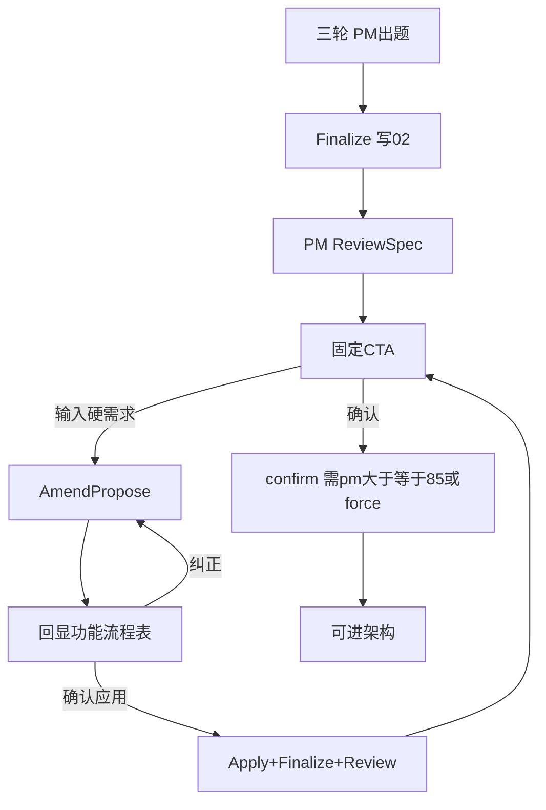

> ⛔ **已废止 · DEPRECATED（2026-07-17）**  
> 本文档为旧计划（25–33 号），**禁止**再作编码或验收依据。  
> **现行施工依据：** [1、阶段A.md](../1、多用户多任务并行/1、阶段A.md) · [2、阶段B.md](../1、多用户多任务并行/2、阶段B.md) · [3、阶段C.md](../1、多用户多任务并行/3、阶段C.md)

---
# 31、需求分析增强开发计划（PM 专家闭环）

> **文档编号：** 31  
> **版本：** v1.3（精简务实）  
> **状态：** **业务闭环已验收**（`phase31-32-close.mjs` exit 0；343 CTA/PmReviewed；fork349 Amend Propose→Apply；GoldenSet 采集 4 条；S2 `test:api` 断言已补）  
> **修订日期：** 2026-07-11  
> **性质：** 独立施工包 — 纠正 PM 掏空 + 终评门禁 + 硬需求 Amend 回显  
> **上级：** [`25`](./25、需求分析子链重构方案书（修订版）.md) · [`27`](./27) · [`28`](./28) · [`30`](./30) §0.11 · ~~[`29`](./29) B8~~（已归档；B8 PM 还权由本包 P0.2 落地）
> **v1.3：** 全盘瘦身 — 砍红队独立服务 / Playbook 合并引擎 / 追溯 IR 帝国 / 学习回灌；杠杆改为「Finalize 一次写进 02」的轻量增强

---

## 0. 精简原则（先读）

| 原则 | 含义 |
|------|------|
| **用户可感知优先** | 只做：专家出题、可交开发的 02、分数门禁、Amend 回显确认 |
| **少新类型** | IR 事件只加 3 个；不新建 Gate/RedTeam/Playbook 服务类 |
| **复用现成** | 出题迁 PM；种子/MCP 沿用骨架路径；工程分仍用 `sa_quality_score` |
| **一轮 Finalize** | 02 增强章（非目标/失败/MVP/验收要点）在 Finalize/渲染时一次写入，不另开 IR 管道 |
| **不加提问轮** | 结构化澄清仍 ≤3×3；&lt;85 不自动再问 |

### 0.1 业务三问

| # | 答案 |
|---|------|
| Q1 | 答三轮题 → 审 02+CTA → 确认，或输入硬需求 → **确认理解摘要** → 再出 02 |
| Q2 | 专家级 02 + PM 分；Amend 时看清「加了啥功能/流程/表」 |
| Q3 | 单测 + `E2E_PIPELINE_ID=343 pnpm test:api` + Amend 回显证据 |

### 0.2 产品决策（保留）

| ID | 决策 |
|----|------|
| D-A | &lt;85 **不**自动再问；展示 gaps；阻断自动进设计 |
| D-B | 输入框 = 硬需求；**先回显理解再落库** |
| D-C | 回显必含：功能 / 流程 / 数据表或实体 |
| D-D | 出题/终评/Amend 均经 PM；编排器禁代问 |
| D-E | 题型仅 MULTI / MATRIX_* |

### 0.3 本版明确砍掉（曾规划、价值/成本比差）

| 砍掉项 | 原因 | 若将来要做 |
|--------|------|------------|
| 跨家族红队独立服务 + CRITICAL 硬门禁 | 每次 Finalize 多 1 次 LLM；与 PM 终评 gaps 重叠；Eval 已有 Judge | 阶段七/另包 |
| `GeneratabilityGate` 独立模块 | 需维护模板能力目录；过重 | 并入既有 LightValidator WARNING 即可（本包不做新模块） |
| 追溯矩阵独立 IR fragment | 与 SA/投影重复建模 | 02 用表格从现有 compile 结果渲染即可（见 P1 轻量） |
| `AcceptanceCriteriaRecorded` 等事件 | 事件膨胀；Tester 未就绪时无消费方 | P1 把验收要点写进 02 正文即可 |
| Playbook 可合并 patch 引擎 + `PlaybookPatched` | 与现有种子/MCP 重复造轮 | PM prompt 继续吃 SeedMatches |
| Amend/force → GoldenSet 回灌 | 31 不接线 | **升级为 32 轨道 B**（接阶段七） |
| Amend `enhance` 再开 1 轮矩阵题 | 与「回显纠正」重复；易疲劳 | 一律 Propose→回显→纠正输入 |
| 独立 `RequirementSpecPmReviewGate` 类 | 过度抽象 | confirm / canRunDesign 内读最新 PmReviewed 即可 |
| 每小步都暂停审批 | 拖慢 | **仅两道闸：** P0 完成停一次；P1 完成停一次 |

---

## 1. 目标主链



---

## 2. 影响范围（最小集）

| 文件 | 改什么 |
|------|--------|
| `PmSkillService.cs` | `GenerateClarificationAsync` / `ReviewSpecAsync` / `AmendProposeAsync` / `ApplyAmendmentAsync` |
| `RequirementAnalysisOrchestrator.cs` | 出题改调 PM；Finalize 后调 Review；删出题 `_llm` |
| `SkillsApiService.cs` | Amend propose/apply；confirm 校验 PM 分 |
| `DesignSkillOrchestrator.cs` | `canRunDesign` 增加 pm≥85∨force |
| `IrEventTypes.cs` | **仅 3 个：** `RequirementSpecPmReviewed`、`RequirementAmendmentProposed`、`RequirementAmendmentApplied` |
| `ClarificationDtos.cs` | 默认 MULTI；禁普通 SINGLE |
| `RequirementDocumentRenderer.cs` | CTA 尾段；附录澄清答案；P1 增强节 |
| `IrRequirementSpecConfirmCard.vue` | CTA 同文 |
| `AiChatPanel.vue` + skills API | 待确认 → Propose/回显/Apply |

**不新建：** RedTeamService、PlaybookMerger、PmReviewGate、AcceptanceCriteria 表/事件。

---

## 3. 施工阶段（两闸）

### P0 — 专家闭环（约 4–5 工作日）★ 本包必做

合并原 A–E，一次交付、一次验收。

#### P0.1 题型 + IR（约 0.5d）

- 题型默认 MULTI，解析禁普通 SINGLE  
- 新增上述 3 个 IR 事件常量  

#### P0.2 PM 出题还权（约 1–1.5d）

- 编排器 R1/R2/R3 出题 → `PmSkill.GenerateClarificationAsync`（搬迁现有 prompt/解析；注入既有种子/MCP）  
- 编排器 **删除** 出题用 `_llm.ChatAsync`；PM 未注册 → Fail-Fast  
- Round2 PSpec/DT 精化可留编排器，但 **不得**在该次 LLM 里出题  
- `ClarificationRequested.SkillId = pm-skill`  

#### P0.3 终评 ≥85（约 0.5–1d）

- Finalize 后 `ReviewSpecAsync` → `{score, verdict, gaps[]}` → `RequirementSpecPmReviewed`  
- ≥85：可交确认；&lt;85：展示 gaps，**不**自动提问；阻断自动进设计  
- `forceConfirm` 显式放行（IR/API 留痕）  
- 无新用户输入禁止空转 Finalize 刷分  

#### P0.4 CTA + Amend 回显（约 1.5–2d）

- 02 末尾 + 确认卡固定 CTA（原文见 §4.2）  
- 附录写入澄清答案（有则写，无则空节）  
- **Propose：** 解析硬需求 → `RequirementAmendmentProposed` + 聊天/卡片回显（功能/流程/表）→ **此时不改 02**  
- **Apply：** 用户确认 → `RequirementAmendmentApplied` → Finalize → Review → 再 CTA  
- 纠正：再 Propose；同窗口最多 3 次 Apply  
- 待确认态输入框禁走 sa-gate；已 StageConfirmed 则拒绝 Amend（文案提示 fork 即可）  

#### P0.5 门禁 + 回归（约 0.5d）

- `canRunDesign` / `confirm`：`finalized ∧ entityFields ∧ (pm≥85 ∨ force)`（工程分门禁若已有则保留，不叠红队）  
- `dotnet build` + PhaseB 相关单测 + `E2E_PIPELINE_ID=343 pnpm test:api`  

**P0 验收清单**

```
□ 出题 SkillId=pm-skill；编排器无出题 Chat
□ 无普通 SINGLE
□ 02 含固定 CTA；确认卡同文
□ <85 无自动 ClarificationRequested；有 gaps 展示
□ Amend：回显含功能/流程/表 → 确认后 02 才变
□ confirm/canRunDesign 尊重 PM 分或 force
```

→ **暂停：用户验收 P0**

---

### P1 — 02 轻量增强（约 1 工作日，可选）

不建新 IR 管道。在 **Finalize 渲染**（及 Review prompt 检查）中一次写入：

| 章节 | 做法 | 不做 |
|------|------|------|
| 非目标 / Out of Scope | Renderer 固定节；LLM 在 Finalize 前或 Review 时填 3–5 条 | 独立事件 |
| 失败与补偿 | 从 PSpec exceptions / assumptions 汇总；不足则 Review 记入 gaps | 新表 |
| MVP 标记 | 事件列表加 `phase=1\|2` 列（骨架或 compile 字段，能写则写） | 复杂排期引擎 |
| 验收要点 | 每核心事件 1–3 条 Given/When/Then **写在 02** | `AcceptanceCriteriaRecorded` |

缺章 → PM Review 的 gaps 提示（软），**不**再引入红队 CRITICAL 硬门禁。

→ **暂停：用户验收 P1（若做）**

---

## 4. 契约

### 4.1 方法（均在 PmSkill 门面）

```csharp
Task<ClarificationSet> GenerateClarificationAsync(...);

Task<PmSpecReviewResult> ReviewSpecAsync(...); // score, verdict, gaps[]

Task<PmAmendProposeResult> AmendProposeAsync(...); // understanding + proposalId；不改业务 IR 主体

Task ApplyAmendmentAsync(..., string proposalId, ...); // Applied → Finalize+Review
```

`AmendmentUnderstanding` 最低字段：`Features[]`、`Flows[]`、`EntitiesOrTables[]`、`SummaryMarkdown`。

### 4.2 固定 CTA

```
请你确认需求分析说明书，如果同意，推进到下一工作阶段，如果不满意，请在输入框继续提出你的问题和要求。
```

### 4.3 Amend 回显

```text
输入 → Propose → 回显（功能/流程/表）→【确认应用】Apply → Finalize
                              →【纠正】再 Propose
```

禁止未确认就改 02。

---

## 5. 风险（精简）

| 风险 | 对策 |
|------|------|
| 出题搬迁质量掉点 | 先原样搬 prompt，再调 |
| Amend 与 execute 打架 | 待确认态前端硬路由 + 后端状态校验 |
| &lt;85 只靠 Amend | gaps 写清楚；CTA 引导输入框；P1 增强首轮 02 |
| 想做红队/Playbook | **不在本包**；见 §0.3 |

---

## 6. 验证

```powershell
dotnet build modularity/inteAssistant/JNPF.InteAssistant/JNPF.InteAssistant.csproj
dotnet test tests/JNPF.Tests.PhaseB/JNPF.Tests.PhaseB.csproj --filter "FullyQualifiedName~RequirementAnalysis|FullyQualifiedName~PmSkill|FullyQualifiedName~Sg2"
$env:E2E_PIPELINE_ID="343"; pnpm test:api
```

---

## 7. 工期与审批

| 范围 | 工期 |
|------|------|
| **P0（必做）** | **约 4–5d** |
| P1（可选） | +约 1d |
| ~~原 A–H 全量~~ | ~~7.5–10d~~ **已废止为默认范围** |

| 项 | 内容 |
|----|------|
| 版本 | v1.3 |
| 审批 | ☐ 批准 P0　☐ 批准 P0+P1　☐ 修改后再审　☐ 驳回 |
| 执行 | 批准后按 P0.1→P0.5 连续实施，**仅 P0 结束停一次** |

---

## 附录：源码锚点

| 能力 | 路径 |
|------|------|
| PM | `Skills/PmSkillService.cs` |
| 出题（待迁） | `RequirementAnalysisOrchestrator.GenerateRoundClarificationAsync` |
| Finalize | `AnalystSkillService.FinalizeAsync` |
| 确认 | `SkillsApiService.ConfirmRequirementSpecAsync` |
| canRunDesign | `DesignSkillOrchestrator.GetStatusAsync` |
| 渲染 | `Studio/RequirementDocumentRenderer.cs` |
| UI | `IrRequirementSpecConfirmCard.vue` · `AiChatPanel.handleSend` |

---

## 附录 D：底层架构 / 算法改进 → 已独立为 32 号

> **正式研究包：** [`32、需求分析算法与进化学习研究包.md`](./32、需求分析算法与进化学习研究包.md)  
> **含：** 轨道 B 进化学习（阶段七 GoldenSet/MemoryRetention 接线，用户确认有价值）+ 轨道 A 算法硬化（Typed Delta / 信息增益出题 / 冲突图等）。  
> **不纳入 31 P0。** 原 D.2–D.5 细节以 32 为准。
