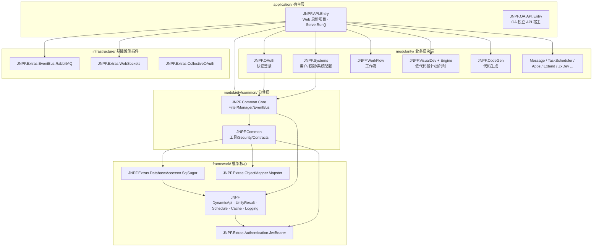
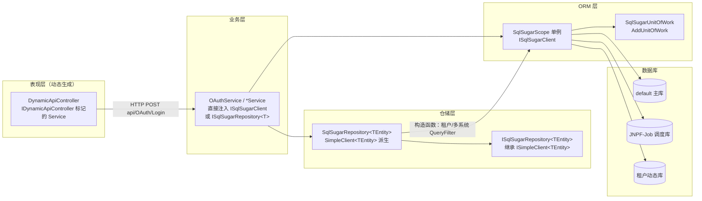
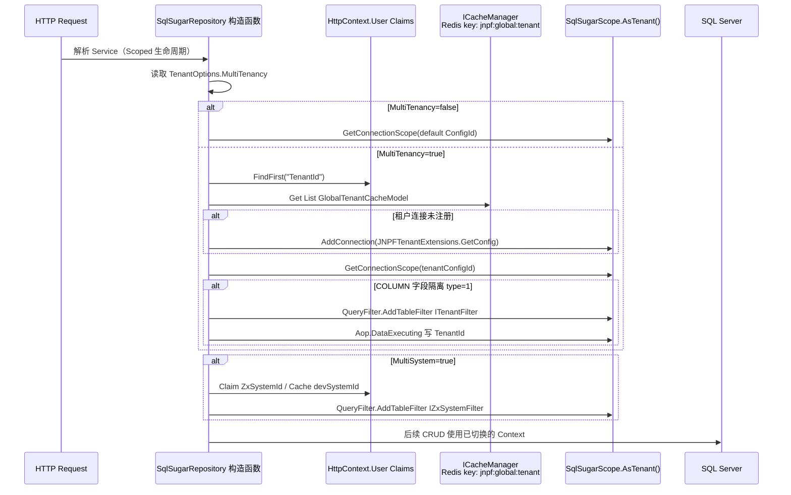
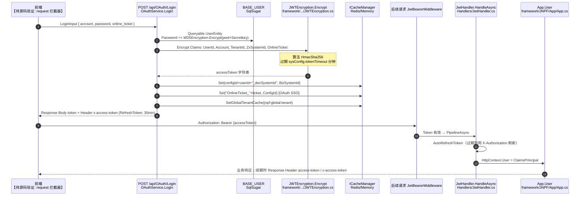
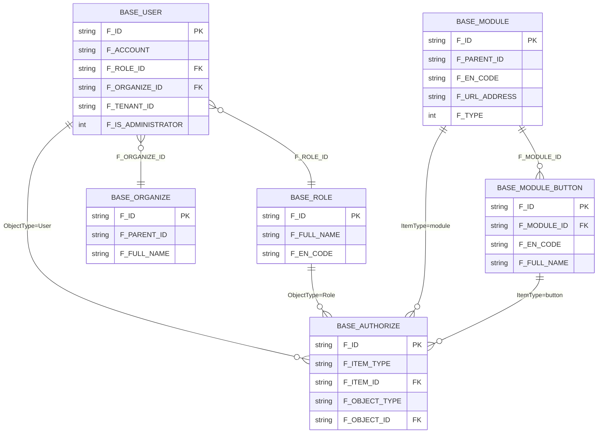
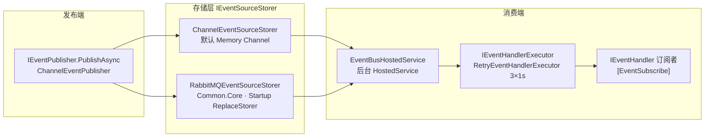
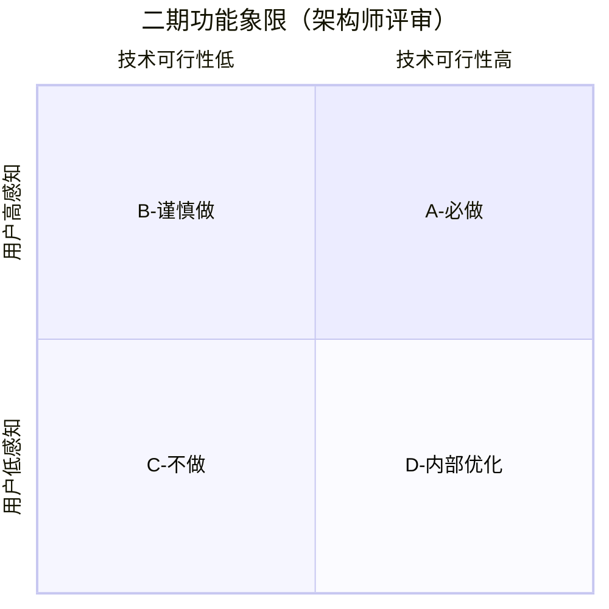
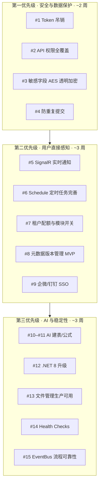

# 专项文档01 · Fruit+JNPF 低代码平台 — 核心框架架构深度解剖

> **适用源码**：JNPF v5.2  
> **源码仓库**：`d:\JNPF-v52\backend`  
> **文档编号**：v52-arch-01  
> **文档版本**：v2.0-draft（架构治理迁入；升版目标 v2.0-final）  
> **文档状态**：维护中  
> **批准日期**：2026-05-24  
> **编写总纲**：[`00-outline-core-framework.md`](00-outline-core-framework.md)  

> **历史说明**：本文档自 `docs/architecture/01-core-framework.md` 迁入 `v52/`；内容基于 v5.2 源码（`Serve.Run`、`DynamicApiController`、`BASE_*` 表）。v3.6 历史文档见 [`../archive/v36/`](../archive/v36/)。

> **分析范围**：`framework/`、`application/JNPF.API.Entry/`、`modularity/common/` 基础设施层  
> **排除范围**：具体业务模块实现细节（见 [`03-application-modules-deep-dive.md`](03-application-modules-deep-dive.md)）  
> **前置确认状态**：

| 前置项 | 状态 | 来源 |
|--------|------|------|
| 解决方案/目录树 | ✅ | `zx_lowcode_netcore.sln`（48 个项目） |
| Program.cs / Startup.cs | ✅ | `application/JNPF.API.Entry/` |
| appsettings + Configurations | ✅ | `appsettings.json` + `Configurations/*.json`（连接串已脱敏展示） |
| NuGet 包清单 | ✅ | 各 `.csproj` 的 `PackageReference` |
| 中间件/过滤器注册 | ✅ | `Startup.cs` + 框架扩展 |
| 基础类库结构 | ✅ | `framework/JNPF/`、`modularity/common/` |

> **表名说明**：本仓库实体映射使用 `BASE_*` 前缀（如 `BASE_USER`），与通用文档中的 `sys_*` 命名等价，下文以**实际表名**为准并标注对应关系。

---

## 第一章：技术栈全景与项目结构

### 1.1 技术栈全景表

| 类别 | 技术 | 版本 | 用途 | 引入方式 |
|------|------|------|------|----------|
| 运行时 | .NET | 6.0（`global.json` rollForward latestMajor） | 后端运行时 | SDK |
| Web 框架 | ASP.NET Core | 6.0（`Microsoft.AspNetCore.App` 框架引用） | HTTP API 宿主 | 框架引用 |
| 自研应用框架 | JNPF（Furion 衍生） | 源码 | DynamicApi、DI、UnifyResult、Schedule 等 | 源码 `framework/JNPF/` |
| ORM | SqlSugarCore | 5.1.4.140 | 主数据访问、多库/多租户 | NuGet → `JNPF.Extras.DatabaseAccessor.SqlSugar` |
| 辅助 ORM | Dapper | 【待源码验证：项目存在 `JNPF.Extras.DatabaseAccessor.Dapper`，主 API 未在 Startup 注册】 | 原生 SQL 场景 | 源码 |
| 对象映射 | Mapster | 7.4.0 | DTO/Entity 映射 | NuGet → `JNPF.Extras.ObjectMapper.Mapster` |
| 缓存 | CSRedisCore | 3.8.670 | Redis 客户端封装 | NuGet → `framework/JNPF/JNPF.csproj` |
| 内存缓存 | Microsoft.Extensions.Caching.Memory | 内置 | `CacheType=MemoryCache` 备选 | 框架内置 |
| 消息队列 | RabbitMQ.Client | 6.4.0 | EventBus 持久化（可选） | NuGet → `infrastructure/JNPF.Extras.EventBus.RabbitMQ` |
| 默认可选 EventBus | Memory | — | 开发默认 `EventBusType=Memory` | 框架内置 |
| 定时任务 | JNPF.Schedule（内置） | 源码 | Cron 任务 + `UseScheduleUI` 看板 | 源码 `framework/JNPF/Schedule/` |
| 日志 | JNPF 自研 FileLogging | 源码 | 按级别分文件输出 | `AddFileLogging()` |
| Serilog | 存在但未启用 | 【待源码验证：`JNPF.Extras.Logging.Serilog` 未纳入 sln】 | — | 源码 |
| API 文档 | Swashbuckle.AspNetCore | 6.5.0 | OpenAPI 生成 | NuGet |
| API UI | IGeekFan.AspNetCore.Knife4jUI | 0.0.13 | Knife4UI（路由 `/newapi`） | NuGet → Entry 项目 |
| JWT 认证 | Microsoft.AspNetCore.Authentication.JwtBearer | 6.0.24 | Bearer Token 校验 | NuGet → JwtBearer 插件 |
| JWT 加解密 | JNPF JWTEncryption | 源码 | Token 生成/刷新/交换 | `framework/JNPF.Extras.Authentication.JwtBearer/` |
| 性能分析 | MiniProfiler.AspNetCore.Mvc | 4.3.8 | SQL/异常链路追踪 | NuGet |
| JSON | Newtonsoft.Json + System.Text.Json | 内置 | 双序列化栈 | Startup 配置 |
| WebSocket | JNPF.Extras.WebSockets | 源码 | IM 消息 `/api/message/websocket` | infrastructure |
| 微信 SDK | Senparc.Weixin | Startup 注册 | 公众号/企业微信 | NuGet（Senparc 系列） |
| 雪花 ID | Yitter.IdGenerator | 1.0.14 | 分布式主键 | NuGet → `JNPF.Common` |
| 代码分析 | Roslynator.Analyzers | 4.6.2 | 静态分析 | NuGet |
| 代码规范 | StyleCop.Analyzers | 1.1.118 | 风格检查 | NuGet |

### 1.2 项目工程结构

#### 图1-1 项目依赖关系图（核心分层）



**各层职责（一句话）**：

| 项目/目录 | 职责 |
|-----------|------|
| `JNPF.API.Entry` | 唯一 Web 宿主；`Startup` 组装 SqlSugar/JWT/Schedule/EventBus |
| `JNPF.OAuth` | 登录/登出/Token 发放；`OAuthService` 实现 `IDynamicApiController` |
| `JNPF.Systems` | RBAC 数据维护、系统配置、菜单按钮权限数据 |
| `JNPF.Common.Core` | `RequestActionFilter` 请求日志、`LogExceptionHandler` 异常日志 |
| `JNPF` | 框架内核：约定注册、统一响应、友好异常、任务调度 |
| `JNPF.Extras.DatabaseAccessor.SqlSugar` | `SqlSugarRepository<T>`、多租户连接切换 |
| `JNPF.Extras.Authentication.JwtBearer` | `JWTEncryption`、`JWTSettingsOptions` |

> **架构差异说明**：本仓库**不存在**独立的 `JNPF.Api / JNPF.Application / JNPF.Core / BaseController` 分层；API 由 `IDynamicApiController` 标记的 Service 类经 `DynamicApiControllerApplicationModelConvention` 动态生成 Controller。

### 1.3 核心配置文件解读

配置扫描：`appsettings.json` 指定 `ConfigurationScanDirectories: ["Configurations"]`，每个 JSON 文件名映射根节点。

#### 1.3.1 数据库连接串 — `Configurations/ConnectionStrings.json`

```json
{
  "ConnectionStrings": {
    "ConnectionConfigs": [
      { "ConfigId": "default", "DBType": "SqlServer", "DBName": "...", "Host": "...", "Domain": "dev_v1." },
      { "ConfigId": "JNPF-Job", "DBType": "SqlServer", "DBName": "jnpf_sundial" }
    ]
  }
}
```

| 配置项 | 说明 |
|--------|------|
| `ConnectionConfigs[]` | 多数据源列表；每项含 `ConfigId`、`DBType`、`Host`、`Port`、`DBName`、`UserName`、`Password`、`Domain` |
| `ConfigId=default` | 主业务库；`SqlSugarConfigure()` 注册为默认连接 |
| `ConfigId=JNPF-Job` | 任务调度持久化库（`DbJobPersistence`） |
| `Domain` | 域名模式路由：按 HTTP `referer` 匹配子域选库 |

- **Options 类**：`SqlSugar.ConnectionStringsOptions` → `framework/JNPF.Extras.DatabaseAccessor.SqlSugar/Options/ConnectionStringsOptions.cs`
- **注入使用**：`Startup.ConfigureServices()` → `services.AddConfigurableOptions<SqlSugar.ConnectionStringsOptions>()`；运行时 `App.GetOptions<ConnectionStringsOptions>()` / `App.GetConfig<ConnectionStringsOptions>("ConnectionStrings", true)`

#### 1.3.2 JWT — `Configurations/JWT.json`

| 配置键 | 默认值（示例） | Options 属性 |
|--------|----------------|--------------|
| `ValidateIssuerSigningKey` | true | `JWTSettingsOptions.ValidateIssuerSigningKey` |
| `IssuerSigningKey` | 长字符串密钥 | `IssuerSigningKey` |
| `ValidIssuer` / `ValidAudience` | `yinmaisoft` | `ValidIssuer` / `ValidAudience` |
| `ExpiredTime` | 1440（分钟） | `ExpiredTime` |
| `ClockSkew` | 5（秒） | `ClockSkew` |

- **Options 类**：`framework/JNPF.Extras.Authentication.JwtBearer/Options/JWTSettingsOptions.cs`（绑定节名 `JWTSettings`）
- **注入使用**：`JWTEncryption.CreateTokenValidationParameters(jwtSettings)`；`JwtHandler` 中 `App.GetOptions<JWTSettingsOptions>().ExpiredTime`

#### 1.3.3 Redis — `Configurations/Cache.json`

| 配置键 | 示例 | Options 属性 |
|--------|------|--------------|
| `CacheType` | `RedisCache` | `CacheOptions.CacheType`（enum: MemoryCache/RedisCache） |
| `ip` / `port` | 127.0.0.1 / 6379 | `CacheOptions.ip` / `port` |
| `RedisConnectionString` | `{0}:{1}, poolsize=500,...` | 格式化连接串 |

- **Options 类**：`framework/JNPF/Cache/CacheOptions.cs`
- **注入使用**：`CacheManager` 构造函数 `resolveNamed(_cacheOptions.CacheType.ToString())` 解析 `RedisCache` 或 `MemoryCache` 实现

#### 1.3.4 消息队列 — `Configurations/EventBus.json`

| 配置键 | 示例 | Options 属性 |
|--------|------|--------------|
| `EventBusType` | `Memory` | `EventBusOptions.EventBusType` |
| `HostName` / `UserName` / `Password` | RabbitMQ 连接 | 仅 `EventBusType=RabbitMQ` 时使用 |

- **Options 类**：`modularity/common/JNPF.Common.Core/EventBus/EventBusOptions.cs`
- **注入使用**：`Startup` 中 `App.GetOptions<EventBusOptions>()` 决定是否替换为 `RabbitMQEventSourceStorer`

#### 1.3.5 日志 — `Configurations/Logging.json`

| 配置节 | 说明 |
|--------|------|
| `Logging.LogLevel` | 默认 `Information`；`Microsoft.AspNetCore=Warning` |
| `Logging.File` | 文件日志：`FileName` 模板、`FileSizeLimitBytes=10MB`、`MaxRollingFiles=30` |

- **Options 类**：【待源码验证：File 节通过 `AddFileLogging` 内部绑定，非独立 IOptions 类】
- **注入使用**：`Startup` L243-256 三次 `AddFileLogging`（Information/Warning/Error 分文件）

#### 1.3.6 多租户 — `Configurations/Tenant.json`

| 配置键 | 示例 | Options 属性 |
|--------|------|--------------|
| `MultiTenancy` | false | `TenantOptions.MultiTenancy` |
| `MultiTenancyType` | `SCHEMA` | 库隔离；`COLUMN` 为字段隔离 |
| `MultiTenancyDBInterFace` | SaaS 租户 API URL | 远程获取租户连接信息 |
| `MultiSystem` | true | 子系统级数据过滤 |

- **Options 类**：`framework/JNPF.Extras.DatabaseAccessor.SqlSugar/Options/TenantOptions.cs`
- **注入使用**：`SqlSugarRepository<T>` 构造函数读取；`TenantManager.ChangTenant()`

#### 1.3.7 其他配置节

| 文件 | 根节点 | Options/用途 |
|------|--------|--------------|
| `App.json` | `JNPF_App` | 文件路径、上传类型、OAuth 社交登录 |
| `Cors.json` | `CorsAccessorSettings` | `AddCorsAccessor()` 跨域策略 |
| `Swagger.json` | `SpecificationDocumentSettings` | Knife4UI 分组、XML 注释 |
| `OSS.json` | `OSS` | 对象存储（阿里云等） |
| `AppSetting.json` | `AppSettings` | `InjectMiniProfiler` 开关 |
| `ZxSystem.json` | `System` | 多系统扩展配置 |

#### 本节核心表清单

| 表名 | 说明 |
|------|------|
| **BASE_SYS_CONFIG** | 系统运行参数（含 `tokenTimeout`、`singleLogin` 等 OAuth 读取项） |
| **BASE_DATA_INTERFACE** | 数据接口配置（框架层间接引用） |

#### 本节关键代码路径索引

| 路径 | 说明 |
|------|------|
| `application/JNPF.API.Entry/Program.cs` | `Serve.Run()` 入口 |
| `application/JNPF.API.Entry/Startup.cs` | 全部 DI/中间件注册 |
| `application/JNPF.API.Entry/appsettings.json` | 配置扫描目录 |
| `application/JNPF.API.Entry/Configurations/*.json` | 分模块配置 |
| `framework/JNPF/ConfigurableOptions/` | 配置自动绑定机制 |

---

## 第二章：请求生命周期全链路

### 2.1 HTTP 请求完整生命周期

#### 图2-1 HTTP 请求生命周期时序图

```mermaid
sequenceDiagram
    autonumber
    participant FE as 前端 Axios<br/>【待源码验证】
    participant NGX as Nginx/反向代理<br/>【部署层】
    participant Kestrel as Kestrel<br/>Program.cs WebComponent
    participant URC as UnifyResultStatusCodesMiddleware<br/>framework/JNPF/UnifyResult/Middlewares/
    participant Route as UseRouting
    participant CORS as UseCorsAccessor<br/>framework/JNPF/CorsAccessor/
    participant AuthN as JwtBearerMiddleware<br/>AddJwt + JWTSettingsOptions
    participant AuthZ as JwtHandler.PipelineAsync<br/>application/.../Handlers/JwtHandler.cs
    participant DynAPI as DynamicApiController<br/>自动生成的 API Controller
    participant RAF as RequestActionFilter<br/>JNPF.Common.Core/Filter/
    participant FEF as FriendlyExceptionFilter<br/>framework/JNPF/FriendlyException/Filters/
    participant Svc as *Service<br/>如 OAuthService.Login
    participant Repo as SqlSugarRepository&lt;T&gt;<br/>构造函数切库/租户过滤
    participant ORM as SqlSugarScope<br/>ISqlSugarClient 单例
    participant DB as SQL Server

    FE->>NGX: HTTP Request (Authorization: Bearer {token})
    NGX->>Kestrel: 转发（ForwardedHeaders 已配置）
    Kestrel->>URC: InvokeAsync — 后置处理 401/403 统一格式
    URC->>Route: 路由匹配
    Route->>CORS: 跨域头处理
    CORS->>AuthN: JWT 签名/过期校验<br/>OnMessageReceived 支持 ?token=
    AuthN->>AuthZ: JwtHandler.HandleAsync<br/>AutoRefreshToken 滑动续期
    AuthZ->>DynAPI: CheckAuthorzieAsync 路由权限（当前恒 true）
    DynAPI->>RAF: OnActionExecutionAsync 记请求日志
    RAF->>Svc: Action 方法调用
    Svc->>Repo: 注入 ISqlSugarRepository / ISqlSugarClient
    Repo->>ORM: GetConnectionScope(tenantId) + QueryFilter
    ORM->>DB: ADO 执行 SQL（Aop.OnLogExecuting 打印）
    DB-->>ORM: 结果集
    ORM-->>Svc: 实体/DTO
    Svc-->>RAF: 返回值
    RAF-->>DynAPI: ActionExecutedContext
    DynAPI-->>FE: RESTfulResult {code,data,msg,timestamp}<br/>RESTfulResultProvider.OnSucceeded
    Note over URC,FE: 若异常 → FriendlyExceptionFilter → RESTfulResultProvider.OnException
```

**各节点说明**：

| 节点 | 类/方法 | 文件路径 | 职责 |
|------|---------|----------|------|
| Kestrel 限流 | `WebComponent.Load` | `application/JNPF.API.Entry/Program.cs` | `MaxRequestBodySize=52428800` |
| 状态码规范化 | `UnifyResultStatusCodesMiddleware.InvokeAsync` | `framework/JNPF/UnifyResult/Middlewares/UnifyResultStatusCodesMiddleware.cs` | 401/403 转 `{code:600,msg:"登录过期"}` |
| JWT 读取 | `JwtBearerEvents.OnMessageReceived` | `application/JNPF.API.Entry/Startup.cs` L42-71 | QueryString `token` 注入 |
| Token 续期 | `JWTEncryption.AutoRefreshToken` | `framework/JNPF.Extras.Authentication.JwtBearer/JWTEncryption.cs` L188 | 过期 Token + `X-Authorization` 刷新头交换新 Token |
| 授权管道 | `JwtHandler.PipelineAsync` | `application/JNPF.API.Entry/Handlers/JwtHandler.cs` L43 | 路由名 `module:action` 权限比对（当前注释掉，恒通过） |
| 请求日志 | `RequestActionFilter.OnActionExecutionAsync` | `modularity/common/JNPF.Common.Core/Filter/RequestActionFilter.cs` L47 | 发布 `Log:CreateReLog` 事件 |
| 统一成功响应 | `RESTfulResultProvider.OnSucceeded` | `framework/JNPF/UnifyResult/Providers/RESTfulResultProvider.cs` L38 | 包装 `{code:200,data,msg:"操作成功"}` |
| 动态 API | `DynamicApiControllerApplicationModelConvention` | `framework/JNPF/DynamicApiController/Conventions/` | Service → Controller 路由 `api/[controller]` |

### 2.2 中间件注册顺序与依赖关系

`Startup.Configure()` 完整序列（`application/JNPF.API.Entry/Startup.cs` L266-316）：

```csharp
app.UseUnifyResultStatusCodes();          // ① 最外层：401/403 响应体规范化（后置执行）
app.UseStaticFiles(...);                  // ② 静态资源
// Senparc 微信全局注册                    // ③ 微信 SDK
app.UseWebSockets();                      // ④ WebSocket 升级
app.UseRouting();                         // ⑤ 路由（必须在 Auth 之前）
app.UseCorsAccessor();                    // ⑥ 跨域
app.UseAuthentication();                  // ⑦ JWT 认证（必须在 Authorization 之前）
app.UseAuthorization();                   // ⑧ 授权 + JwtHandler
app.UseScheduleUI();                      // ⑨ 任务调度看板
app.UseKnife4UI(...);                     // ⑩ API 文档 UI (/newapi)
app.UseInject(string.Empty);              // ⑪ Swagger JSON 端点
app.MapWebSocketManager("/api/message/websocket", ...); // ⑫ WS 路由
app.UseEndpoints(...);                    // ⑬ MVC 默认路由
```

| 顺序依赖 | 原因 |
|----------|------|
| `UseRouting` → `UseAuthentication` → `UseAuthorization` | ASP.NET Core 标准管道；Endpoint 元数据供 `[AllowAnonymous]` 判断 |
| `UseUnifyResultStatusCodes` 在最前注册 | 作为外层中间件，`await _next()` 后拦截最终 StatusCode |
| `UseCorsAccessor` 在 Auth 之前 | 预检 OPTIONS 需先于认证 |

**框架自带 vs JNPF 自定义**：

| 中间件 | 类型 |
|--------|------|
| `UseRouting/Authentication/Authorization/StaticFiles/WebSockets/Endpoints` | ASP.NET Core 内置 |
| `UseUnifyResultStatusCodes` | JNPF 自定义 |
| `UseCorsAccessor` | JNPF 封装 |
| `UseScheduleUI` | JNPF Schedule 内置 |
| `UseInject` / `UseKnife4UI` | JNPF + Knife4jUI 集成 |

### 2.3 统一响应格式封装

#### 统一返回模型 — `RESTfulResult<T>`

来源：`framework/JNPF/UnifyResult/Internal/RESTfulResult.cs`

```csharp
public class RESTfulResult<T>
{
    public int? code { get; set; }      // ★ HTTP 语义状态码或业务码（401→600）
    public object msg { get; set; }     // ★ 提示信息
    public T data { get; set; }         // ★ 业务数据
    public object extras { get; set; }  // 附加数据（UnifyContext.Take()）
    public long timestamp { get; set; } // Unix 时间戳
}
```

#### 全局异常过滤器 — `FriendlyExceptionFilter`

来源：`framework/JNPF/FriendlyException/Filters/FriendlyExceptionFilter.cs`

```csharp
public async Task OnExceptionAsync(ExceptionContext context)
{
    // ★ 关键：非验证异常时调用 IGlobalExceptionHandler（LogExceptionHandler 写异常日志）
    var globalExceptionHandler = context.HttpContext.RequestServices.GetService<IGlobalExceptionHandler>();
    if (globalExceptionHandler != null)
        await globalExceptionHandler.OnExceptionAsync(context);

    var exceptionMetadata = UnifyContext.GetExceptionMetadata(context);  // ★ 解析 AppFriendlyException
    // ...
    context.Result = unifyResult.OnException(context, exceptionMetadata); // ★ 转 RESTfulResult
}
```

**异常链路**：

```
Service 抛出 Oops.Oh(...) → AppFriendlyException
  → FriendlyExceptionFilter.OnExceptionAsync
  → LogExceptionHandler 发布 Log:CreateExLog
  → RESTfulResultProvider.OnException → JsonResult { code, msg, data }
  → 前端解析 response.data.code / response.data.msg
```

**401 特殊处理**：`UnifyResultStatusCodesMiddleware` 在响应已含 `access-token`/`x-access-token` 头时将 401 降为 403，避免刷新 Token 窗口期误报登录过期。

#### 本节核心表清单

| 表名 | 说明 |
|------|------|
| **BASE_SYS_LOG** | 请求日志（Type=5）、异常日志（Type=4）、登录日志（Type=1） |

#### 本节关键代码路径索引

| 路径 | 说明 |
|------|------|
| `framework/JNPF/UnifyResult/Providers/RESTfulResultProvider.cs` | 成功/失败/401 响应 |
| `framework/JNPF/FriendlyException/Filters/FriendlyExceptionFilter.cs` | 全局异常 |
| `modularity/common/JNPF.Common.Core/Handlers/LogExceptionHandler.cs` | 异常日志事件 |
| `modularity/common/JNPF.Common.Core/Filter/RequestActionFilter.cs` | 请求日志 AOP |
| `framework/JNPF/DynamicApiController/Conventions/DynamicApiControllerApplicationModelConvention.cs` | 动态 API |

---

## 第三章：ORM 层与数据访问架构

### 3.1 ORM 框架封装分析

**ORM 选型**：SqlSugarCore 5.1.4.140（主）；Dapper 插件存在但未在主 API Startup 启用。

**DI 注册**（`application/JNPF.API.Entry/Extensions/SqlSugarConfigureExtensions.cs`）：

```csharp
public static void SqlSugarConfigure(this IServiceCollection services)
{
    var dbOptions = App.GetOptions<ConnectionStringsOptions>();
    dbOptions.ConnectionConfigs.ForEach(SetDbConfig);  // ★ 拼接连接串、Oracle 列映射

    SqlSugarScope sqlSugar = new(dbOptions.ConnectionConfigs.Adapt<List<ConnectionConfig>>(), db =>
    {
        dbOptions.ConnectionConfigs.ForEach(config =>
            SetDbAop(db.GetConnectionScope(config.ConfigId)));  // ★ SQL 日志 AOP
    });

    services.AddSingleton<ISqlSugarClient>(sqlSugar);           // ★ 单例 SqlSugarScope
    services.AddScoped(typeof(ISqlSugarRepository<>), typeof(SqlSugarRepository<>));
    services.AddUnitOfWork<SqlSugarUnitOfWork>();                // ★ 工作单元/事务
}
```

**多数据库支持**：

| 机制 | 实现 |
|------|------|
| 静态多库 | `ConnectionConfigs[]` 多个 `ConfigId`（如 `default`、`JNPF-Job`） |
| 运行时切库 | `SqlSugarScope.AsTenant().GetConnectionScope(configId)` |
| 域名路由 | `ConnectionStringsOptions.DefaultConnectionConfig` 按 `referer` 匹配 `Domain` |
| 租户库 | JWT `TenantId` Claim → Redis `jnpf:global:tenant` → 动态 `AddConnection` |

### 3.2 数据访问层架构图

#### 图3-1 数据访问层架构图



**核心基类/接口**：

| 类型 | 路径 | 说明 |
|------|------|------|
| `ISqlSugarRepository<TEntity>` | `framework/.../Repositories/ISqlSugarRepository.cs` | 仓储接口，继承 SqlSugar `ISimpleClient<T>` |
| `SqlSugarRepository<TEntity>` | `framework/.../Repositories/SqlSugarRepository.cs` | 构造函数完成租户切库 + QueryFilter |
| `EntityBase<TKey>` | `modularity/common/JNPF.Common/Contracts/EntityBase.cs` | `F_ID`、`F_TENANT_ID`、`F_ZX_SYSTEM_ID` |
| `TenantCLDSEntityBase` | `modularity/common/JNPF.Common/Contracts/TenantCLDSEntityBase.cs` | 审计字段 + `Creator()/LastModify()/Delete()` |
| `IDynamicApiController` | `framework/JNPF/DynamicApiController/Dependencies/IDynamicApiController.cs` | 标记接口，触发 API 自动生成 |

> **不存在** `BaseService` / `BaseRepository` / `BaseController` 统一基类。

### 3.3 基类封装深度分析

#### `SqlSugarRepository<TEntity>` 构造函数（租户/多系统核心）

| 方法/逻辑块 | 签名/位置 | 核心逻辑 |
|-------------|-----------|----------|
| 构造函数 | `SqlSugarRepository(IServiceProvider, ISqlSugarClient)` | 读取 `TenantOptions`；从 JWT 取 `TenantId`；Redis 取 `jnpf:global:tenant` 动态加连接 |
| 字段隔离 | 构造函数 L52-78 | `type==1` 时 `QueryFilter.AddTableFilter<ITenantFilter>` + `Aop.DataExecuting` 写 `TenantId` |
| 多系统过滤 | 构造函数 L94-119 | `QueryFilter.AddTableFilter<IZxSystemFilter>` + `DataExecuting` 写 `ZxSystemId` |

#### `TenantCLDSEntityBase` 审计方法

| 方法 | 签名 | 核心逻辑 | 子类调用示例 |
|------|------|----------|--------------|
| `Creator()` | `public virtual void Creator()` | `Id=SnowflakeIdHelper.NextId()`；`CreatorTime=Now`；`CreatorUserId=App.User Claim` | `entity.Creator(); await repo.InsertAsync(entity);` |
| `Create()` | `public virtual void Create()` | 同 Creator，允许预设 Id | 导入场景 |
| `LastModify()` | `public virtual void LastModify()` | 写 `LastModifyTime/UserId` | 更新前 `entity.LastModify()` |
| `Delete()` | `public virtual void Delete()` | 软删：`DeleteMark=1` | 软删除流程 |

### 3.4 数据库多租户/多数据源机制

| 模式 | 配置 | 实现位置 |
|------|------|----------|
| 库隔离 SCHEMA | `MultiTenancyType=SCHEMA` | 每租户独立 `ConnectionConfig`；`GetConnectionScope(tenantCache.connectionConfig.ConfigId)` |
| 字段隔离 COLUMN | `type=1`（SaaS 接口返回） | `QueryFilter` + `DataExecuting` 自动写/过滤 `F_TENANT_ID` |
| 多系统 | `MultiSystem=true` | JWT `ZxSystemId` Claim + Redis `{userId}_devSystemId` |
| 手动切库 | — | `TenantManager.ChangTenant(ISqlSugarClient, TenantInterFaceOutput)` |

#### 图3-2 数据源切换时序图



#### 本节核心表清单

| 表名 | 关键字段 |
|------|----------|
| **BASE_USER** | F_ID(PK), F_ACCOUNT, F_PASSWORD, F_SECRETKEY, F_ORGANIZE_ID, F_ROLE_ID, F_TENANT_ID, F_ENABLED_MARK, F_DELETE_MARK |
| **BASE_ROLE** | F_ID, F_FULL_NAME, F_EN_CODE, F_TENANT_ID |
| **BASE_ORGANIZE** | F_ID, F_PARENT_ID, F_FULL_NAME, F_TENANT_ID |

#### 本节关键代码路径索引

| 路径 | 说明 |
|------|------|
| `application/JNPF.API.Entry/Extensions/SqlSugarConfigureExtensions.cs` | SqlSugar DI |
| `framework/JNPF.Extras.DatabaseAccessor.SqlSugar/Repositories/SqlSugarRepository.cs` | 仓储 + 租户 |
| `framework/JNPF.Extras.DatabaseAccessor.SqlSugar/Extensions/TenantLinkExtensions.cs` | 连接串拼接 |
| `modularity/common/JNPF.Common.Core/Manager/Tenant/TenantManager.cs` | 手动切租户 |
| `modularity/common/JNPF.Common/Contracts/TenantCLDSEntityBase.cs` | 审计基类 |

---

## 第四章：认证与授权全链路

### 4.1 JWT 认证完整时序图

#### 图4-1 JWT 认证时序图



**登录 API 定位**：

- 类：`OAuthService` — `modularity/oauth/JNPF.OAuth/OAuthService.cs`
- 路由：`[Route("api/[controller]")]` + `[HttpPost("Login")]` → **`POST /api/OAuth/Login`**
- 密码算法：`MD5Encryption.Encrypt(input.password + user.Secretkey)`（**非 BCrypt**）

**Claims 字段**（`OAuthService.cs` L878-887）：

| Claim 常量 | 含义 |
|------------|------|
| `ClaimConst.CLAINMUSERID` | 用户 Id |
| `ClaimConst.CLAINMACCOUNT` | 登录账号 |
| `ClaimConst.CLAINMREALNAME` | 真实姓名 |
| `ClaimConst.CLAINMADMINISTRATOR` | 是否管理员 |
| `ClaimConst.TENANTID` | 租户 Id |
| `ClaimConst.OnlineTicket` | 单点登录票据 |
| `ClaimConst.ZXSYSTEMID` | 子系统 Id |

### 4.2 Token 管理策略

| 策略项 | 本系统实现 |
|--------|------------|
| **生成** | `JWTEncryption.Encrypt(payload, expiredTime)`；签名 `SecurityAlgorithms.HmacSha256`；过期时间优先取 `sysConfig.tokenTimeout`，框架默认 `JWTSettings.ExpiredTime=1440` 分钟 |
| **Refresh Token** | `JWTEncryption.GenerateRefreshToken(accessToken, 30)`；写入响应头 `x-access-token`；**非独立 Redis 存储** |
| **滑动续期** | `JwtHandler.HandleAsync` → `JWTEncryption.AutoRefreshToken`：Access Token 过期时，用 `Authorization` + `X-Authorization` 头交换新 Token，写回 `access-token`/`x-access-token` 响应头 |
| **Redis 缓存** | `jnpf:global:tenant`（租户连接）；`{configId}{userId}_devSystemId`；`OnlineTicket_{ticket}`（SSO）；**未发现 `user:token:{userId}` 键格式** |
| **注销** | `OAuthService` 登出流程清除 OnlineTicket 缓存（L1061-1064 `DelAsync("OnlineTicket_"+ticket)`） |
| **多终端互踢** | `sysConfig.singleLogin` 写入 `GlobalTenantCacheModel.SingleLogin`；【待源码验证：具体踢人逻辑在 OAuth 模块后续流程】 |

### 4.3 RBAC 权限校验机制

#### 图4-2 RBAC 权限模型 ER 图



**接口级权限（当前实现状态）**：

- 校验入口：`JwtHandler.CheckAuthorzieAsync()` — `application/JNPF.API.Entry/Handlers/JwtHandler.cs` L54-78
- 路由名转换：`/api/system/user` → `system:user`
- **当前代码**：`GetLoginPermissionList` 调用被注释，`return true`（**权限校验未启用**）
- 设计意图：对比用户权限集合 `permissionList.Contains(routeName)`

**按钮级权限**：

- 数据：`BASE_MODULE_BUTTON.F_EN_CODE` + `BASE_AUTHORIZE`（ItemType=button）
- 前端：【待源码验证：dist 前端根据权限码控制按钮；源码不在 `web/` 仓库】

#### 本节核心表清单

| 表名 | 说明 |
|------|------|
| **BASE_USER** | 用户主表（≈ sys_user） |
| **BASE_ROLE** | 角色（≈ sys_role） |
| **BASE_MODULE** | 菜单/功能（≈ sys_menu） |
| **BASE_MODULE_BUTTON** | 按钮（≈ sys_button） |
| **BASE_ORGANIZE** | 组织（≈ sys_organize） |
| **BASE_AUTHORIZE** | 授权关系表（用户/角色 ↔ 菜单/按钮） |
| **BASE_SYS_LOG** | 登录/操作日志（≈ sys_log） |

> **租户表**：本仓库无本地 `BASE_TENANT` 实体；租户元数据来自 SaaS 接口 `MultiTenancyDBInterFace`，缓存于 Redis `jnpf:global:tenant`。

#### 本节关键代码路径索引

| 路径 | 说明 |
|------|------|
| `modularity/oauth/JNPF.OAuth/OAuthService.cs` | Login/Logout |
| `framework/JNPF.Extras.Authentication.JwtBearer/JWTEncryption.cs` | Token 全套操作 |
| `application/JNPF.API.Entry/Handlers/JwtHandler.cs` | 授权 + 自动刷新 |
| `framework/JNPF/App/App.cs` L83 | `App.User => HttpContext?.User` |
| `modularity/system/JNPF.Systems.Entitys/Entity/Permission/AuthorizeEntity.cs` | 授权实体 |

---

## 第五章：缓存与分布式机制

### 5.1 Redis 封装层分析

| 组件 | 路径 | 职责 |
|------|------|------|
| `ICache` | `framework/JNPF/Cache/ICache.cs` | Get/Set/Del/Exists/Incrby/**SetNx** |
| `RedisCache` | `framework/JNPF/Cache/RedisCache.cs` | CSRedisCore 封装；`ISingleton` |
| `MemoryCache` | `framework/JNPF/Cache/MemoryCache.cs` | 本地内存备选 |
| `ICacheManager` / `CacheManager` | `framework/JNPF/Cache/CacheManager.cs` | 业务层统一入口 |

**Key 命名规范（源码已验证）**：

| Key 模式 | 用途 |
|----------|------|
| `jnpf:global:tenant` | 全局租户连接缓存 `List<GlobalTenantCacheModel>` |
| `{configId}{userId}_devSystemId` | 开发模式子系统 Id |
| `OnlineTicket_{online_ticket}` | OAuth 单点登录票据 |
| `mini-profiler*` | MiniProfiler 内部键（`GetAllCacheKeys` 过滤） |

**缓存策略**：

- 过期：`ICache.Set(key, value, TimeSpan)` / 默认无过期（依调用方）
- 失效：`CacheManager.Del(key)` / `DelByPatternAsync`
- 租户缓存：登录时 `SetGlobalTenantCache` 更新

**穿透/击穿/雪崩**：源码中**未发现**专门的布隆过滤器或互斥锁防击穿封装；`SetNx` 可用于自定义防重。

### 5.2 分布式锁

| 项 | 实现 |
|----|------|
| API | `ICacheManager.SetNx(string key, object value, TimeSpan expire)` |
| 底层 | `RedisCache.SetNx` → `RedisHelper.SetNx`（CSRedisCore） |
| 使用场景 | 【待源码验证：需在业务模块搜索 `SetNx` 调用点确认防重复提交场景】 |

#### 本节核心表清单

| 表名 | 说明 |
|------|------|
| **BASE_SYS_CONFIG** | 缓存相关开关间接依赖系统配置 |

#### 本节关键代码路径索引

| 路径 | 说明 |
|------|------|
| `framework/JNPF/Cache/RedisCache.cs` | Redis 实现 |
| `framework/JNPF/Cache/CacheManager.cs` | 业务缓存 API |
| `framework/JNPF/Cache/CacheOptions.cs` | 缓存类型配置 |
| `modularity/system/JNPF.Systems/System/SysCacheService.cs` | 系统缓存管理 API |

---

## 第六章：日志与监控

### 6.1 日志体系

| 层级 | 实现 | 路径 |
|------|------|------|
| 控制台 | `AddConsoleFormatter` + `Program.WebComponent` | `Program.cs` / `Startup.cs` |
| 文件 | `AddFileLogging` × 3（Information/Warning/Error） | `Startup.cs` L243-256 |
| 框架扩展 | `FileLoggerProvider` / `FileLoggingWriter` | `framework/JNPF/Logging/Implantations/File/` |
| 配置 | `Logging.json` → `FileName: logs/{yyyyMMdd}/{yyyyMMdd}_{Level}.log` | 按日分目录、按级别分文件 |
| SQL 追踪 | `SqlSugar Aop.OnLogExecuting` + MiniProfiler | `SqlSugarConfigureExtensions.SetDbAop` |
| 异常 | `FriendlyExceptionFilter` + `ILogger<FriendlyException>` | 可选 `LogError=true` |
| Serilog | 项目存在未启用 | `framework/JNPF.Extras.Logging.Serilog/` |

### 6.2 操作审计

**公共字段自动填充**：

| 机制 | 位置 | 说明 |
|------|------|------|
| 实体基类方法 | `TenantCLDSEntityBase.Creator/LastModify/Delete` | 从 `App.User` Claims 取 UserId |
| ORM AOP | `SqlSugarRepository` 构造函数 `Aop.DataExecuting` | 多租户/多系统自动写 `TenantId`/`ZxSystemId` |
| 请求日志 | `RequestActionFilter` | Action 执行后发布 `Log:CreateReLog` → **BASE_SYS_LOG** Type=5 |
| 登录日志 | `OAuthService.AddLoginLog` | Type=1 |
| 异常日志 | `LogExceptionHandler` | 订阅 `IGlobalExceptionHandler` → Type=4 |

**`RequestActionFilter` 核心片段**（`modularity/common/JNPF.Common.Core/Filter/RequestActionFilter.cs`）：

```csharp
public async Task OnActionExecutionAsync(ActionExecutingContext context, ActionExecutionDelegate next)
{
    var sw = Stopwatch.StartNew();
    var actionContext = await next();
    sw.Stop();
    if (!context.ActionDescriptor.EndpointMetadata.Any(m => m.GetType() == typeof(IgnoreLogAttribute)))
    {
        await _eventPublisher.PublishAsync(new LogEventSource("Log:CreateReLog", tenantId,
            new SysLogEntity { /* UserId, IP, 耗时, 请求参数, 响应结果 */ }));
    }
}
```

#### 本节核心表清单

| 表名 | 关键字段 |
|------|----------|
| **BASE_SYS_LOG** | F_ID, F_USER_ID, F_USER_NAME, F_Type(1登录/4异常/5请求), F_IP_ADDRESS, F_REQUEST_URL, F_JSON, F_PLAT_FORM |

#### 本节关键代码路径索引

| 路径 | 说明 |
|------|------|
| `framework/JNPF/Logging/Extensions/LoggingServiceCollectionExtensions.cs` | AddFileLogging |
| `modularity/common/JNPF.Common.Core/Filter/RequestActionFilter.cs` | 请求审计 |
| `modularity/common/JNPF.Common.Core/Handlers/LogExceptionHandler.cs` | 异常审计 |
| `modularity/oauth/JNPF.OAuth/OAuthService.cs` | AddLoginLog |
| `application/JNPF.API.Entry/Configurations/Logging.json` | 文件日志配置 |

---

## 本篇产出自检

| 产出项 | 状态 | 编号 |
|--------|------|------|
| 架构全景图 | ✅ | 图1-1 |
| 请求生命周期时序图 | ✅ | 图2-1 |
| 数据访问层架构图 | ✅ | 图3-1 |
| 数据源切换时序图 | ✅ | 图3-2 |
| JWT 认证时序图 | ✅ | 图4-1 |
| RBAC 权限 ER 图 | ✅ | 图4-2 |
| 核心代码片段 ≥ 8 处 | ✅ | 全文 8+ 处 |
| 涉及数据库表 ≥ 6 张 | ✅ | BASE_USER/ROLE/MODULE/MODULE_BUTTON/ORGANIZE/AUTHORIZE/SYS_LOG |

### 深度自检清单

- [x] 端到端调用链路：`POST /api/OAuth/Login` → SqlSugar → JWT → 后续请求 JwtHandler
- [x] 数据库表与关键字段：各章「本节核心表清单」
- [x] 技术图：6 张 Mermaid 图
- [x] 可验证路径：均给出 `framework/` / `application/` / `modularity/` 路径
- [x] 扩展点：DynamicApiController 实现 Service；SqlSugarRepository 扩展 QueryFilter；JwtHandler.CheckAuthorzieAsync 启用权限
- [x] 性能瓶颈/局限：SqlSugarScope 单例 + Scoped Repository 构造函数切库开销；JwtHandler 权限未启用；AutoRefreshToken 双 Header 机制
- [x] 【待源码验证】标记：前端 Axios、Serilog、SetNx 业务场景、singleLogin 互踢细节

### 二次开发建议

1. **启用 API 权限**：取消 `JwtHandler.CheckAuthorzieAsync` 中 `GetLoginPermissionList` 注释并实现缓存。
2. **新增模块 API**：创建 `XxxService : IDynamicApiController, ITransient`，无需手写 Controller。
3. **扩展租户策略**：实现 `TenantManager.ChangTenant` 或在 `SqlSugarRepository` 构造函数追加过滤逻辑。
4. **切换缓存实现**：修改 `Cache.json` 的 `CacheType` 为 `MemoryCache` 或 `RedisCache`，无需改业务代码。

---

## 第七章：文档 v1.0 遗漏的重要框架特性（源码补遗）

> 本章基于对 `framework/JNPF/`、`infrastructure/`、`modularity/common/` 的二次深度扫描，列出**已在源码中存在**、但 v1.0 正文未展开或仅一笔带过的核心框架能力。每项均给出可验证路径。

### 7.1 宿主与模块化启动

| 特性 | 路径 | 核心机制 |
|------|------|----------|
| **Serve.Run 统一宿主** | `framework/JNPF/App/Serve.cs` | `Serve.Run(RunOptions.Default.AddWebComponent<WebComponent>())` 封装 Web 启动、组件注册、程序集扫描 |
| **IWebComponent / RunOptions** | `framework/JNPF/App/Options/RunOptions.cs` | `Program.cs` 中 `WebComponent.Load` 注入 Kestrel/日志/Kestrel 限流 |
| **AppStartup 扫描** | `framework/JNPF/App/Startups/AppStartup.cs` | 继承 `AppStartup` 的 `Startup` 被框架自动发现（`application/JNPF.API.Entry/Startup.cs`） |
| **HostingStartup 预装配** | `framework/JNPF/App/Startups/HostingStartup.cs` | `[assembly: HostingStartup]` 在宿主启动前注入配置 |
| **IServiceComponent / IApplicationComponent** | `framework/JNPF/Components/` | `AddComponent`/`UseComponent` 插件式扩展管道 |

### 7.2 约定式 DI 与 AOP 代理

| 特性 | 路径 | 核心机制 |
|------|------|----------|
| **程序集扫描注册** | `framework/JNPF/DependencyInjection/Extensions/DependencyInjectionServiceCollectionExtensions.cs` | 扫描 `IPrivateDependency` + `ITransient`/`IScoped`/`ISingleton` 自动注册 |
| **InjectionAttribute** | `framework/JNPF/DependencyInjection/Attributes/InjectionAttribute.cs` | 命名服务、排除接口、注册顺序 |
| **INamedServiceProvider** | `framework/JNPF/DependencyInjection/Providers/NamedServiceProvider.cs` | 同接口多实现按名称解析（如 `RedisCache`/`MemoryCache`） |
| **AspectDispatchProxy** | `framework/JNPF/Reflection/Proxies/AspectDispatchProxy.cs` | 动态代理基类；RemoteRequest 基于此 |
| **HttpDispatchProxy** | `framework/JNPF/RemoteRequest/Proxies/HttpDispatchProxy.cs` | 声明式 HTTP 客户端：`Http.GetHttpProxy<T>()` |

### 7.3 配置、校验与序列化

| 特性 | 路径 | 核心机制 |
|------|------|----------|
| **ConfigurableOptions** | `framework/JNPF/ConfigurableOptions/` | `AddConfigurableOptions<T>()`；`IConfigurableOptionsListener` 配置变更监听 |
| **DataValidationFilter** | `framework/JNPF/DataValidation/Filters/DataValidationFilter.cs` | 全局模型验证 Filter（Order=-1000）；`ValidationTypes` 枚举扩展 |
| **SensitiveDetection** | `framework/JNPF/SensitiveDetection/` | 敏感词/违禁词检测；`SensitiveDetectionAttribute` + ModelBinder |
| **Clay 动态对象** | `framework/JNPF/ClayObject/Clay.cs` | 动态 JSON/Expando 互转；Startup 中 `AddClayConverters()` |
| **JsonSerialization 抽象** | `framework/JNPF/JsonSerialization/` | 可切换序列化 Provider；与 `AddUnifyJsonOptions("special")` 配合 |
| **Localization `L`** | `framework/JNPF/Localization/L.cs` | 静态多语言门面 |
| **AspNetCore ModelBinders** | `framework/JNPF/AspNetCore/ModelBinders/` | 时间戳绑定、`FromConvert` 等增强 |

### 7.4 事件、任务与调度（正文仅简略提及）

#### 图7-1 EventBus 架构图



| 特性 | 路径 | 说明 |
|------|------|------|
| **ChannelEventSourceStorer** | `framework/JNPF/EventBus/Storers/ChannelEventSourceStorer.cs` | 默认内存 Channel，容量可配 |
| **EventBusHostedService** | `framework/JNPF/EventBus/HostedServices/EventBusHostedService.cs` | 订阅扫描 + 内置 `Retry.InvokeAsync` |
| **RetryEventHandlerExecutor** | `modularity/common/JNPF.Common.Core/EventBus/RetryEventHandlerExecutor.cs` | `Startup` 注册；固定 3 次、间隔 1s |
| **RabbitMQEventSourceStorer** | `modularity/common/JNPF.Common.Core/EventBus/Storers/RabbitMQEventSourceStorer.cs` | 注意：**非** `infrastructure/JNPF.Extras.EventBus.RabbitMQ`（该包无 .cs 实现） |
| **TaskQueue** | `framework/JNPF/TaskQueue/` | 独立 Channel 队列 + `TaskQueueHostedService`；`Startup.AddTaskQueue()` |
| **Schedule + TimeCrontab** | `framework/JNPF/Schedule/`、`framework/JNPF/TimeCrontab/` | Cron/周期触发；`UseScheduleUI()` 嵌入式看板 |
| **DbJobPersistence** | 【待源码验证：`Startup.AddSchedule` 引用】 | 调度任务持久化至 `JNPF-Job` 库 |

### 7.5 视图引擎、虚拟文件与代码生成边界

| 特性 | 路径 | 说明 |
|------|------|------|
| **ViewEngine（Roslyn）** | `framework/JNPF/ViewEngine/Engines/ViewEngine.cs` | `RunCompile`/`RunCompileFromCached`；**非 Apache Velocity** |
| **代码生成调用链** | `modularity/codegen/JNPF.CodeGen/CodeGenService.cs` | `_viewEngine.RunCompileFromCached` 渲染 `wwwroot/Template/*.vm` |
| **VirtualFileServer** | `framework/JNPF/VirtualFileServer/FS.cs` | `EmbeddedFileProvider`；Schedule UI / Swagger 嵌入资源 |
| **AddViewEngine** | `framework/JNPF/ViewEngine/Extensions/ViewEngineServiceCollectionExtensions.cs` | `Startup.AddViewEngine()` |

### 7.6 实时通信双通道

| 通道 | 路径 | 用途 |
|------|------|------|
| **原生 WebSocket** | `infrastructure/JNPF.Extras.WebSockets/Manager/WebSocketConnectionManager.cs` | 租户/用户维度连接池；`/api/message/websocket` |
| **SignalR Hub** | `framework/JNPF/InstantMessaging/IM.cs` | `[MapHub]` 扫描自动 `MapHub`；与 WebSocket **并存** |

### 7.7 安全、加密与授权扩展

| 特性 | 路径 | 说明 |
|------|------|------|
| **DataEncryption 工具集** | `framework/JNPF/DataEncryption/` | MD5、AES、DES、RSA 扩展方法 |
| **AppAuthorizeHandler** | `framework/JNPF/Authorization/Handlers/AppAuthorizeHandler.cs` | JWT 授权处理器基类；`JwtHandler` 继承 |
| **AppAuthorizationPolicyProvider** | `framework/JNPF/Authorization/AppAuthorizationPolicyProvider.cs` | 动态策略提供 |
| **CollectiveOAuth** | `infrastructure/JNPF.Extras.CollectiveOAuth/` | 类 JustAuth 多平台 `IAuthSource` |
| **Thirdparty** | `infrastructure/JNPF.Extras.Thirdparty/` | 微信/钉钉/SMS/Email/JS 引擎 |

### 7.8 规范文档、性能与事务

| 特性 | 路径 | 说明 |
|------|------|------|
| **SpecificationDocumentBuilder** | `framework/JNPF/SpecificationDocument/Builders/SpecificationDocumentBuilder.cs` | OpenAPI 分组、SecurityScheme、嵌入 Knife4j 首页 |
| **MiniProfiler 联动** | `framework/JNPF/App/App.cs` `PrintToMiniProfiler` | SqlSugar/异常/UoW 打点；`AppSettings.InjectMiniProfiler` |
| **UnitOfWorkAttribute** | `framework/JNPF/UnitOfWork/FilterAttributes/UnitOfWorkAttribute.cs` | Order=9999；支持 `TransactionScope` 环境事务 |
| **SqlSugarUnitOfWork** | `modularity/common/JNPF.Common/UnitOfWork/SqlSugarUnitOfWork.cs` | `AsTenant().BeginTran/CommitTran` |
| **UnifyResult 进阶** | `framework/JNPF/UnifyResult/NonUnifyAttribute.cs` | 按 Action 跳过统一响应包装 |
| **FriendlyException Oops/Retry** | `framework/JNPF/FriendlyException/Oops.cs`、`Retry.cs` | 业务错误码 + 通用重试（EventBus/TaskQueue 共用） |
| **LoggingMonitorAttribute** | `framework/JNPF/Logging/Implantations/Monitors/LoggingMonitorAttribute.cs` | Order=-2000；**Startup 当前注释未启用** |
| **DatabaseLogging** | `framework/JNPF/Logging/Extensions/LoggingServiceCollectionExtensions.cs` | 可插 `IDatabaseLoggingWriter` 日志落库 |

### 7.9 Common 层平台能力（框架边界外但属核心运行时）

| 特性 | 路径 | 说明 |
|------|------|------|
| **SuperQueryHelper** | `modularity/common/JNPF.Common/Security/SuperQueryHelper.cs` | 前端 superQuery JSON → SqlSugar `IConditionalModel` |
| **UserManager.GetConditionAsync** | `modularity/common/JNPF.Common.Core/Manager/User/UserManager.cs` | 数据权限条件拼装（见专项文档02） |
| **DataBaseManager** | `modularity/common/JNPF.Common.Core/Manager/DataBase/DataBaseManager.cs` | 可视化数据接口/SQL 动态查询 |
| **FileManager + OSS** | `modularity/common/JNPF.Common.Core/Manager/Files/FileManager.cs` | OnceMi.AspNetCore.OSS；本地/MinIO/阿里云切换 |
| **InteAssistant EventBus** | `modularity/common/JNPF.Common.Core/EventBus/IntegreateEventSubscriber.cs` | 智能助手 HTTP 回调触发 |
| **Workflow 集成模型** | `modularity/common/JNPF.Common/Models/WorkFlow/` | framework **无** 内置引擎；通过 Common 模型耦合 WorkFlow 模块 |

### 7.10 本仓库**未发现**的框架能力（避免误判）

| 能力 | 检索结论 |
|------|----------|
| ASP.NET Health Checks | 全库无 `AddHealthChecks` |
| OpenTelemetry / Prometheus | 无标准 Metrics 导出 |
| ASP.NET API Versioning 包 | 无；仅有 `ApiDescriptionSettings` 分组 |
| 国密 SM2/SM3/SM4 | `DataEncryption` 无国密实现 |
| SignalR 替代 WebSocket | 两套通道并存，非替代关系 |
| SubDev 二开模块 | `modularity/subdev/` 无业务 .cs，仅为壳工程 |

### 7.11 架构师评审结论（商业价值维度）

> 以下对 §7.1–§7.10 遗漏特性按 **Q1 用户感知 / Q2 商业痛点 / Q3 成本收益 / Q4 前置依赖** 四维评审，归入 **A-必做 / B-谨慎做 / C-不做 / D-文档或顺手优化**。详细论证见 **第八章**。

| # | 类别 | 评审结论 | 二期动作 |
|---|------|----------|----------|
| 1 | 宿主模型（Serve.Run 等） | **D** 文档补齐 | 补流程图，不立项改造 |
| 2 | DI/AOP 约定扫描 | **D** 文档 + 稳定性 | 补 DI/AOP 清单；核心注入点回归测试 |
| 3 | 配置校验 / SensitiveDetection | **B** 安全子项必做 | SensitiveDetection 可配置词库；DataValidation 关键接口全覆盖 |
| 4 | EventBus / TaskQueue / Schedule | **A** 必做 | Schedule UI 完善；EventBus 流程链路可靠；TaskQueue P1 |
| 5 | Roslyn ViewEngine | **D** 文档补齐 | 补 `.vm→Roslyn→代码` 流程图 |
| 6 | WebSocket + SignalR 双通道 | **A** 必做（轻量） | **统一 SignalR**，仅 3 场景，不双栈并行建设 |
| 7 | 安全扩展（加密/OAuth/SSO） | **A** 必做 | 字段 AES 透明加密；企微/钉钉 SSO；集成框架 P1 |
| 8 | Swagger/MiniProfiler/UnitOfWork | **D** 顺手优化 | 保持现状；抽查漏事务场景 |
| 9 | Common 平台层 | **A** 必做 | FileManager/OSS 生产可用；SuperQuery 稳定性验证 |
| 10 | 不存在能力（Health/OTel/国密/API Versioning） | **分情况** | Health=D 顺手做；OTel=P1 延后；国密/API Versioning=C 不做 |

#### 本节核心表清单

| 表名 | 说明 |
|------|------|
| **BASE_SYS_LOG** | EventBus 日志类事件最终落库 |
| **BASE_DATA_INTERFACE** | DataBaseManager 动态 SQL 配置 |

#### 本节关键代码路径索引

| 路径 | 说明 |
|------|------|
| `framework/JNPF/App/Serve.cs` | 宿主入口 |
| `framework/JNPF/EventBus/` | 事件总线内核 |
| `framework/JNPF/TaskQueue/` | 任务队列 |
| `framework/JNPF/ViewEngine/` | Roslyn 模板引擎 |
| `framework/JNPF/RemoteRequest/` | HTTP 声明式客户端 |
| `modularity/common/JNPF.Common.Core/EventBus/` | RabbitMQ Storer + RetryExecutor |

---

## 第八章：二期核心框架扩展计划（架构师商业价值评审版）

> **评审背景**：v1.1 第八章按工程师视角列出 18 项「2025 低代码业界基线」扩展；本章经架构师按 **Q1 用户感知 / Q2 商业痛点 / Q3 成本收益 / Q4 前置依赖** 四维重评，从「技术完备性」拉回「用户商业价值」。  
> **交付目标**：约 **8 周 / 15 项** 可交付清单；砍掉 8 项过度设计，合并 2 项重复建设，强化 4 项用户高感知能力。  
> **后续动作**：**待本文档审核通过后**，单独产出 **《二期 P0 技术方案》**（仅覆盖第一优先级 #1–#4：Token 吊销、API 权限、AES 字段加密、防重复提交）。

### 8.1 评审标尺与象限

每项功能必须回答四个问题：

| 问题 | 含义 |
|------|------|
| **Q1 用户是否直接感知？** | 终端用户/管理者能否感受到；去掉后是否会投诉 |
| **Q2 是否解决真实商业痛点？** | 是否出现在客户采购清单；竞品是否已具备 |
| **Q3 实施成本与收益比？** | 人天 vs 用户价值感知（高/中/低/无感）；是否有轻量替代 |
| **Q4 是否为其他功能的前置依赖？** | 不做是否阻塞其他高价值功能 |

**象限归类**：



| 象限 | 含义 | 二期策略 |
|------|------|----------|
| **A-必做** | 高价值 + 可行 | 立项，优先排期 |
| **B-谨慎做** | 高价值 + 高成本 | 找轻量 MVP 方案 |
| **C-不做** | 低价值 + 无感 | 明确砍掉，除非客户点名 |
| **D-内部优化** | 低价值 + 低成本 | 文档补齐或顺手做，不单独立项 |

**决策原则（IT 总监检验）**：若企业 IT 总监在向老板汇报时不能说「这个钱花得值」，则不做或延后。

---

### 8.2 工程师 18 项 vs 架构师重排对照

#### 8.2.1 v1.0 遗漏 10 类特性 — 评审总表

| # | 类别 | 代表能力 | Q1 | Q2 | 结论 | 二期动作 |
|---|------|----------|----|----|------|----------|
| 1 | 宿主模型 | Serve.Run、AppStartup、IWebComponent | 无感 | 无 | **D** | 文档补流程图，不改造 |
| 2 | DI/AOP | 约定扫描、HttpDispatchProxy | 无感 | 无 | **D** | 文档 + 核心注入点稳定性验证 |
| 3 | 配置校验 | ConfigurableOptions、DataValidation、SensitiveDetection | 中感 | 有 | **B** | SensitiveDetection 可配置词库必做 |
| 4 | 异步基础设施 | EventBus、TaskQueue、Schedule | 高感 | 高 | **A** | Schedule UI 完善；EventBus 流程可靠 |
| 5 | 模板引擎 | Roslyn ViewEngine | 无感 | 无 | **D** | 文档补 `.vm→Roslyn→代码` 流程 |
| 6 | 实时通道 | WebSocket + SignalR | 高感 | 高 | **A** | **统一 SignalR**，仅 3 场景 |
| 7 | 安全扩展 | AES 加密、CollectiveOAuth、SSO | 高感 | 极高 | **A** | 字段透明加密；企微/钉钉 SSO |
| 8 | 文档/性能 | Swagger 进阶、MiniProfiler、UnitOfWork | 低感 | 低 | **D** | 保持现状；抽查漏事务 |
| 9 | Common 平台层 | SuperQuery、FileManager/OSS | 高感 | 高 | **A** | 文件生产可用；SuperQuery 稳定性验证 |
| 10 | 不存在能力 | Health、OTel、国密、API Versioning | 分情况 | 分情况 | **分情况** | 见 §8.4 |

#### 8.2.2 工程师 P0/P1/P2 十八项 — 优先级调整对照

| # | 工程师原建议 | 原级 | 架构师判定 | 新级 | 调整理由（摘要） |
|---|-------------|------|------------|------|------------------|
| 1 | .NET 8 LTS 升级 | P0 | **做但控制范围** | 第三优先级 #12 | 用户无感；EOL 安全风险需做，禁止借机重构 |
| 2 | OpenTelemetry | P0 | **降为延后** | 延后 | 客户不为此付费；先用请求 ID + 日志 |
| 3 | Health Checks + 优雅停机 | P0 | **降为 D 顺手做** | 第三优先级 #14 | 几行代码，半天可完成 |
| 4 | 框架级限流/防重复提交 | P0 | **保留 P0 子集** | 第一优先级 #4 | 聚焦防重复提交；精细化限流 P1/延后 |
| 5 | 安全基线（JWT/密码/Token 吊销） | P0 | **强化 P0** | 第一优先级 #1–#3 | 安全是一票否决项 |
| 6 | 插件 SDK + 热加载 DynamicApi | P1 | **降为 P2/不做** | 砍掉 | 无 ISV 生态，动态 API 增加安全风险 |
| 7 | 租户配额/模块开关 | P1 | **提升 P0** | 第二优先级 #7 | SaaS 商业化核心机制 |
| 8 | EventBus Outbox + 幂等 | P1 | **保留 P1 轻量** | 第三优先级 #15 | 用 Retry + 防重替代完整 Outbox |
| 9 | 配置中心 / Feature Flag | P1 | **降为 P2/不做** | 砍掉 | 单体阶段过度设计 |
| 10 | VisualDev 元数据版本与发布流水线 | P1 | **版本管理提升 P0** | 第二优先级 #8 | 低代码「最后一公里」；发布流水线 MVP 延后 |
| 11 | AI Orchestrator | P2 | **提升 P1** | 第三优先级 #10–#11 | 2025 差异化卖点 |
| 12 | SuperQuery + QueryPolicy 引擎 | P2 | **保留 P2** | 延后 | 当前 SuperQuery 够用 |
| 13 | SignalR/WebSocket 通知统一 | P2 | **合并** | 并入 #5 | 与实时通道重复，不双栈建设 |
| 14 | 读写分离/慢 SQL 告警 | P2 | **保留 P2** | 延后 | 单体阶段不需要 |
| 15–18 | （清单 #14–#18 等） | — | 见 §8.3 | — | 国密/API Versioning 明确不做 |

---

### 8.3 精简后实施清单（15 项 · 约 8 周）

#### 图8-1 二期优先级分层



#### 8.3.1 第一优先级：安全 + 数据保护（~2 周）→ **《二期 P0 技术方案》范围**

| # | 项 | 工期 | 现状（源码事实） | 目标 | 建议落点 |
|---|-----|------|------------------|------|----------|
| **1** | **Token 吊销** | 2 天 | 登出仅删 `OnlineTicket_*`；无 Token 黑名单 | 退出/禁用时旧 Token 立即失效 | Redis 黑名单；`JwtBearer` 校验前查黑名单；`OAuthService` 登出/禁用户写入 |
| **2** | **API 权限全覆盖** | 3 天 | `JwtHandler.CheckAuthorzieAsync` 恒 `return true` | 每个 API 有 `[Permission]` 或 `[AllowAnonymous]` | 启用 `GetLoginPermissionList`；全局扫描 DynamicApi 补漏 |
| **3** | **敏感字段 AES 透明加密** | 1 周 | `DataEncryption` 有 AES；密码仍为 MD5 | 手机号/身份证/银行卡等 ORM 层透明加解密 | `SqlSugarRepository` AOP 或实体 Attribute；密钥独立配置 |
| **4** | **防重复提交** | 3 天 | 无 Idempotency Filter；`SetNx` 未统一使用 | 前端防抖 + 后端一次性 Token 幂等 | `framework/JNPF/` 新 Filter；Redis `SetNx`；覆盖 POST/PUT/DELETE |

> **密码哈希说明**：当前为 **MD5+Secretkey**（非 BCrypt）。架构师意见：若已是 BCrypt 可保持；**MD5 必须升级**（优先 BCrypt，Argon2 可选）。此项纳入 P0 技术方案 #2 子任务，视迁移策略单独立项。

#### 8.3.2 第二优先级：用户直接感知的核心功能（~3 周）

| # | 项 | 工期 | 目标（MVP） | 建议落点 |
|---|-----|------|-------------|----------|
| **5** | **SignalR 实时通知** | 1 周 | 仅 3 场景：流程待办推送、系统公告/消息、在线用户列表；**不**双栈 WebSocket+SignalR | `framework/JNPF/InstantMessaging/`；逐步收敛 WebSocket IM |
| **6** | **Schedule 定时任务完善** | 1 周 | 任务列表、启停、执行日志；TimeCrontab 稳定；常用任务模板 | `framework/JNPF/Schedule/` + `modularity/taskscheduler/` |
| **7** | **租户配额与模块开关** | 3–5 天 | `MaxUserCount`、`MaxAppCount`、`EnabledModules` JSON、存储配额、授权到期日 | 租户表/配置扩展；菜单过滤 + API 拒绝 |
| **8** | **元数据版本管理 MVP** | 1 周 | 表单/流程快照、版本列表、差异对比、一键回滚；**发布流水线增强延后** | 新表 `meta_version`；`VisualDev` / `WorkFlow` 保存时写快照 |
| **9** | **第三方 SSO** | 1 周 | 企业微信 + 钉钉 OAuth2.0；策略模式统一接口；融合现有 JWT 链 | `infrastructure/JNPF.Extras.CollectiveOAuth/` + `OAuthService` |

#### 8.3.3 第三优先级：AI 差异化 + 稳定性（~3 周）

| # | 项 | 工期 | 目标 | 建议落点 |
|---|-----|------|------|----------|
| **10** | **AI 辅助建表/建表单** | 1 周 | 自然语言 → 表结构 + 表单 JSON；Prompt + 输出校验 | `modularity/inteAssistant/` 或 `IAiOrchestrator` |
| **11** | **AI 辅助条件/公式** | 3 天 | 自然语言 → 流程条件表达式 | 流程设计器条件面板集成 |
| **12** | **.NET 8 LTS 升级** | 2 周 | 只升框架不改业务；回归流程引擎 + 代码生成器 | `global.json`、全 sln；禁止借机重构 |
| **13** | **文件管理完善** | 1 周 | 本地 + 一种云存储；PDF/图片预览；大文件上传可配置 | `FileManager` + `OSS.json` |
| **14** | **Health Checks** | 半天 | `/health`；DB + Redis 连通性；Docker HEALTHCHECK | `JNPF.API.Entry` 扩展 |
| **15** | **EventBus 流程可靠性** | 3 天 | 流程引擎事件链路稳定；关键事件重试（已有 `RetryEventHandlerExecutor`） | 非完整 Outbox；验证 WorkFlow 订阅 |

**总工期**：第一优先级 ~2 周 + 第二优先级 ~3 周 + 第三优先级 ~3 周 ≈ **8 周（2 个月）**。

---

### 8.4 明确不做与延后项

#### 8.4.1 明确不做（除非客户点名）

| 项 | 理由 |
|----|------|
| ASP.NET API Versioning | 低代码 API 内部消费为主；URL 路径区分足够 |
| 插件 SDK + 热加载 DynamicApi | 无 ISV 生态；运行时动态 API 增加调试与安全风险 |
| 配置中心（Nacos/Apollo） | 单体改 `appsettings` 重启即可 |
| Feature Flag / 灰度 | 当前租户规模不需要 |
| 国密 SM2/SM3/SM4 | 政务/金融可选插件；非通用刚需 |
| MiniProfiler / Swagger 进阶 | 基础能力够用 |
| OpenTelemetry 全栈 | 二期延后；先用结构化日志 + 请求 ID |
| 完整 EventBus Outbox 模式 | 轻量重试 + 防重复提交覆盖主场景 |
| DynamicApi 热加载 | 代码生成器已满足 |

#### 8.4.2 延后（有需要再做）

| 项 | 替代方案 |
|----|----------|
| OpenTelemetry | 请求 ID 贯穿日志 + DB 慢查询 |
| API 精细化限流 | Nginx 层基础限流 + 登录接口单独限制 |
| 读写分离 | 单库扛不住时再评估 |
| 发布流水线（环境 promotion） | 先做版本管理 MVP，流水线作增强 |
| TaskQueue 大批量异步 | P1：识别场景后再实施 |
| RabbitMQ 集成 | 单体 Memory EventBus 够用 |
| SuperQuery + QueryPolicy 引擎 | 现有 `SuperQueryHelper` 稳定性验证即可 |
| 第三方通用集成框架 | P1 文档 + 示例 |

#### 8.4.3 D 类：文档补齐（不立项开发）

| 主题 | 动作 |
|------|------|
| 宿主启动 | `Serve.Run → AppStartup 扫描 → IWebComponent` 流程图 |
| DI/AOP | DI 容器全景 + 拦截器清单 |
| ViewEngine | `.vm → Roslyn RunCompileFromCached → 输出代码` 流程图 |
| ConfigurableOptions | 使用方式文档 |

---

### 8.5 二期施工包（已产出）

| 文档 | 范围 | 说明 |
|------|------|------|
| [`02-phase2-p0-security-implementation.md`](02-phase2-p0-security-implementation.md) | **P0-A** #1–#4 | Token 吊销、API 权限、AES 字段加密、防重复提交、密码迁移 |
| [`03-phase2-p0-signalr-schedule-ai-implementation.md`](03-phase2-p0-signalr-schedule-ai-implementation.md) | **P0-B** #5–#6、#10–#11 | SignalR 三场景、Schedule 完善、AI 建表/公式（架构师 A-必做） |

**优先级关系**：P0-A 必须先于或重叠后半段完成；P0-B 为二期商业必交付，时间线上为第二/第三优先级，**不是可选项**。

**P0-A 改造入口（摘要）**：

| 路径 | P0 项 |
|------|-------|
| `application/JNPF.API.Entry/Handlers/JwtHandler.cs` | #1 #2 |
| `modularity/oauth/JNPF.OAuth/OAuthService.cs` | #1 登出/登录 |
| `framework/JNPF/DataEncryption/` | #3 |
| `framework/JNPF/Cache/CacheManager.cs` | #1 #4 `SetNx` |
| `framework/JNPF/DataValidation/Filters/` | #4 Filter 顺序参考 |

---

### 8.6 与 v1.0 文档的衔接

| v1.0 章节 | 二期实施后需回溯更新 |
|-----------|----------------------|
| 第二章 请求链路 | 插入防重复提交 Filter、Token 黑名单校验节点 |
| 第四章 认证 | 权限启用、Token 吊销、密码哈希、SSO |
| 第五章 缓存 | 幂等键 / Token 黑名单 Redis 键规范 |
| 第七章 §7.11 | 随实施逐项勾选关闭 |

#### 本节核心表清单（二期新增建议）

| 表名 | 用途 |
|------|------|
| **meta_version**（或 BASE_METADATA_VERSION） | 低代码元数据版本快照 |
| **租户配额字段** | 扩展现有租户配置或 **BASE_TENANT** |
| Redis `token:blacklist:{jti}` | JWT 吊销（键名待 P0 方案定稿） |
| Redis `idempotency:{token}` | 防重复提交一次性 Token |

#### 本节关键代码路径索引

| 路径 | 二期优先级 |
|------|------------|
| `application/JNPF.API.Entry/Handlers/JwtHandler.cs` | 第一优先级 |
| `modularity/oauth/JNPF.OAuth/OAuthService.cs` | 第一优先级 |
| `framework/JNPF/InstantMessaging/IM.cs` | 第二优先级 #5 |
| `framework/JNPF/Schedule/` | 第二优先级 #6 |
| `infrastructure/JNPF.Extras.CollectiveOAuth/` | 第二优先级 #9 |
| `modularity/common/JNPF.Common.Core/Manager/Files/FileManager.cs` | 第三优先级 #13 |
| `modularity/common/JNPF.Common.Core/EventBus/RetryEventHandlerExecutor.cs` | 第三优先级 #15 |

---

## 文档版本历史

| 版本 | 日期 | 变更 |
|------|------|------|
| v1.0 | — | 初版：六章核心框架解剖 |
| v1.1 | — | 新增第七章源码补遗；新增第八章工程师 18 项扩展计划 |
| v1.2 | — | 第七章增 §7.11 架构师评审表；第八章按商业价值评审重写（15 项/8 周）；§8.5 链接 P0-A/P0-B 施工包 |

---

*文档遵循 [`docs/ARCHITECTURE_DOC_RULES.md`](../ARCHITECTURE_DOC_RULES.md) 编写。*
