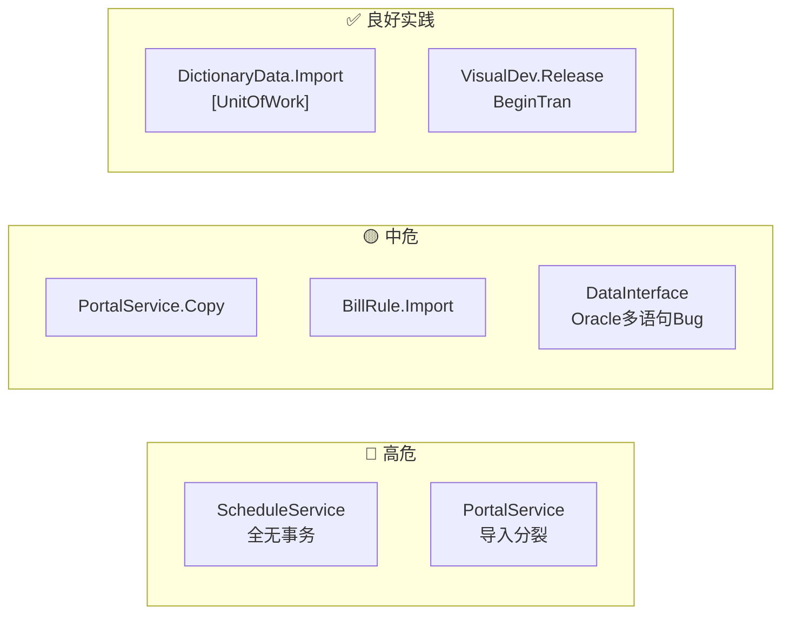
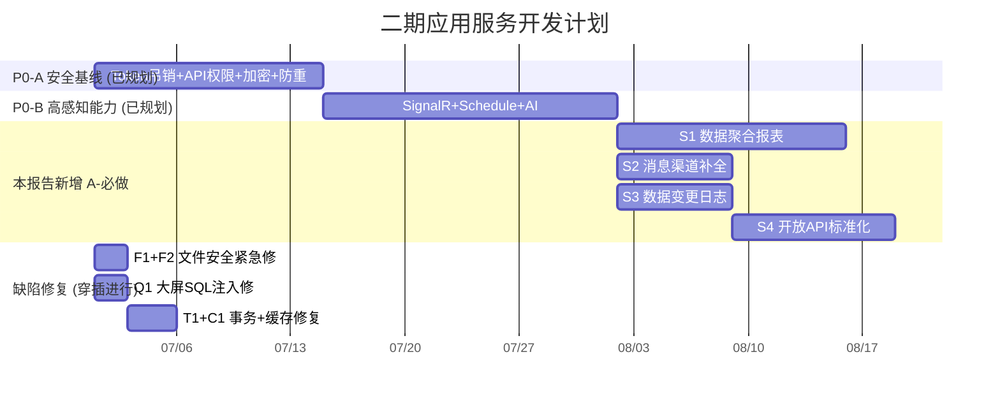

# 专项文档02 审查报告 — 应用服务架构深度复查

> **适用源码**：JNPF v5.2  
> **源码仓库**：`d:\JNPF-v52\backend`  
> **文档编号**：v52-arch-02-R  
> **文档版本**：v1.0  
> **文档状态**：维护中  
> **批准日期**：2026-05-24  

> **审查对象**：[`02-application-services.md`](02-application-services.md)  
> **审查维度**：遗漏特性补全 · 实现缺陷分析 · 竞品对标二期建议  
> **对标竞品**：简道云(Jiandaoyun) · 明道云(Mingdaoyun) · 宜搭(Yida) · 葡萄藤(PuTaoTeng)  
> **评审标尺**：Q1 用户感知 / Q2 商业痛点 / Q3 成本收益 / Q4 前置依赖  
> **审查方法**：源码全量搜索 + 子代理并行深度扫描（遗漏探索 + 缺陷审计）

---

## 一、文档遗漏的已实现功能（11 大类，约 40 个 Service）

> `02-application-services.md` v1.0 聚焦横切能力（DI、Filter、数据权限、事务、导入导出、文件、字典、API 规范、ID 生成）。以下模块**在源码中均有完整 Service 实现**，但文档**完全未提及或仅一笔带过**。

### 1.1 遗漏清单

#### ① 流程引擎（平台核心能力）

| 项 | 内容 |
|---|---|
| **核心 Service** | `FlowTaskService`（发起/提交）·`FlowBeforeService`（待办/审批）·`FlowLaunchService`·`FlowTemplateService`·`FlowDelegateService`·`FlowCommentService`·`FlowMonitorService`·`FlowFormService` |
| **应用层核心** | `FlowTaskManager` — `modularity/workflow/JNPF.WorkFlow/Manager/FlowTaskManager.cs` |
| **设计模式** | Service → Manager → Repository/Util 分层；Util 拆分（`FlowTemplateUtil`·`FlowTaskUserUtil`·`FlowTaskNodeUtil`·`FlowTaskMsgUtil`）；与 `IRunService`、`IMessageManager`、`IDataInterfaceService`、定时任务/队列集成 |
| **核心 API** | `POST api/workflow/Engine/FlowTask`；`GET api/workflow/Engine/FlowBefore/List/{category}`；`api/workflow/Engine/FlowTemplate` |
| **数据表** | **FLOW_TASK** · **FLOW_TEMPLATE** · **FLOW_TEMPLATE_JSON** · **FLOW_TASK_NODE** · **FLOW_TASK_OPERATOR** · **FLOW_TASK_OPERATOR_RECORD** · **FLOW_DELEGATE** · **FLOW_COMMENT** |
| **商业价值** | 平台级 BPM，模板驱动审批链 + 委托/抄送/监控，与 VisualDev 表单、消息、数据接口打通 |

#### ② 消息中心（7 个 Service + 编排层）

| 项 | 内容 |
|---|---|
| **核心 Service** | `MessageService`·`NoticeService`·`SendMessageService`·`MessageTemplateService`·`MessageAccountService`·`MessageMonitorService`·`ImReplyService` |
| **编排层** | `MessageManager`（非 API，被各 Service 注入，按渠道分发） |
| **核心 API** | `api/message/Notice`（公告）；`api/message`（站内消息）；`api/message/SendMessageConfig`（发送策略）；`api/message/MessageTemplateConfig`（模板）；`api/message/AccountConfig`（账号：邮件/SMS/钉钉/企微/WebHook） |
| **数据表** | **BASE_MESSAGE** · **BASE_NOTICE** · **BASE_MSG_SEND** · **BASE_MSG_TEMPLATE** · **BASE_MSG_ACCOUNT** · **BASE_MSG_MONITOR** · **BASE_IM_CONTENT** · **BASE_IM_REPLY** |
| **商业价值** | 统一消息中枢：Email/SMS/钉钉/企微/WebHook/小程序多渠道分发，与流程、集成助手联动 |

#### ③ 数据接口/外部集成

| 项 | 内容 |
|---|---|
| **核心 Service** | `DataInterfaceService` + `DataInterfaceLogService` + `DataInterfaceVariateService`；`WebHookService`·`IntegrateService`·`IntegrateTaskService`（集成助手） |
| **核心 API** | `api/system/DataInterface`（CRUD + `Actions/Preview`/`Actions/Response`）；`api/visualdev/Hooks`；`api/VisualDev/Integrate` |
| **数据表** | **BASE_DATA_INTERFACE** · **BASE_DATA_INTERFACE_LOG** · **BASE_INTEGRATE** · **BASE_INTEGRATE_TASK** · **BASE_INTEGRATE_NODE** · **BASE_INTEGRATE_QUEUE** |
| **商业价值** | 低代码下拉/联动/表单的数据源抽象；集成助手支持事件/定时/WebHook 触发 |

#### ④ VisualDev 低代码引擎核心

| 项 | 内容 |
|---|---|
| **设计态** | `VisualDevService` — `api/visualdev/Base` |
| **运行态 API** | `VisualDevModelDataService` — `api/visualdev/OnlineDev/{modelId}/...`（List/CRUD/Import/Export） |
| **运行态引擎** | `RunService`（`IRunService`，非 `IDynamicApiController`）— 列表/详情/CRUD/SQL 生成/流程表单/数据接口/单据号/事件总线 |
| **引擎 Core** | `FormDataParsing`·`TemplateParsingBase`·`TemplateAnalysis` — `modularity/engine/JNPF.VisualDev.Engine/Core/` |
| **设计模式** | VisualDevService（配置）→ VisualDevModelDataService（HTTP 门面）→ RunService（引擎）→ FormDataParsing（模板解析） |
| **数据表** | **BASE_VISUAL_DEV** · **BASE_VISUAL_RELEASE** · **BASE_VISUAL_LINK** |
| **商业价值** | 平台核心：无代码/低代码表单+列表+流程+集成的一体化运行时 |

#### ⑤ 单据编号规则

| 项 | 内容 |
|---|---|
| **核心 Service** | `BillRuleService`（接口 `IBillRullService`） |
| **核心 API** | `GET api/system/BillRule/BillNumber/{enCode}`（取号）；`GET api/system/BillRule/Selector` |
| **数据表** | **BASE_BILL_RULE**（前缀/日期/流水号规则 + Redis 缓存） |
| **商业价值** | 业务单号自动生成（合同号、订单号、工单号）；`RunService` 创建数据时注入调用 |

#### ⑥ 打印模板设计

| 项 | 内容 |
|---|---|
| **核心 Service** | `PrintDevService` + `PrintLogService` |
| **核心 API** | `GET/POST/PUT api/system/PrintDev`；`GET api/system/PrintDev/Data`（按模板+表单取数渲染）；`POST api/system/PrintDev/Fields`（解析 SQL 字段） |
| **数据表** | **BASE_PRINT_TEMPLATE** · **BASE_PRINT_LOG** |
| **商业价值** | 可视化打印模板设计：绑定 SQL/数据接口取数，HTML 模板占位符替换，支撑单据批量打印 |

#### ⑦ 门户/仪表盘/数据大屏

| 项 | 内容 |
|---|---|
| **核心 Service** | `PortalService`·`PortalManageService`（门户）；`DashboardService`（首页看板）；`ScreenService`·`ScreenComponentService`·`ScreenDataSourceService`·`ScreenCategoryService`·`ScreenRecordService`·`ScreenMapConfigService`·`ScreenGlobalService`（大屏 7 个） |
| **核心 API** | `api/visualdev/Portal`；`api/visualdev/Dashboard/FlowTodo`；`api/blade-visual/Visual` |
| **数据表** | **BASE_PORTAL** · **BASE_PORTAL_DATA** · **BLADE_VISUAL** · **BLADE_VISUAL_CONFIG** · **BLADE_VISUAL_DB** · **BLADE_VISUAL_COMPONENT** · **BLADE_VISUAL_CATEGORY** |
| **商业价值** | 两类可视化：JNPF 门户/工作台（待办/邮件/公告聚合）+ 数据大屏 |

#### ⑧ 代码生成器

| 项 | 内容 |
|---|---|
| **核心 Service** | `CodeGenService` |
| **核心 API** | `POST api/visualdev/Generater/{id}/Actions/DownloadCode`；`POST .../Actions/CodePreview` |
| **引擎依赖** | `IViewEngine`（Velocity `.vm` 模板）；`CodeGenWay`·`CodeGen*Helper`·`TemplateAnalysis` |
| **商业价值** | 从在线开发配置一键生成前后端代码 ZIP |

#### ⑨ 系统监控/在线用户

| 项 | 内容 |
|---|---|
| **核心 Service** | `MonitorService`（CPU/内存/磁盘）；`OnlineUserService`（在线列表/强制下线） |
| **核心 API** | `GET api/system/Monitor`；`GET/DELETE api/system/OnlineUser` |
| **商业价值** | 运维监控 + 会话治理 |

#### ⑩ 省市区行政区划

| 项 | 内容 |
|---|---|
| **核心 Service** | `ProvinceService`（Swagger 名 `Area`）+ `ProvinceAtlasService` |
| **核心 API** | `GET api/system/Area/{nodeId}` |
| **数据表** | **BASE_PROVINCE** |
| **商业价值** | 全国行政区划级联选择，表单/地址控件基础数据 |

#### ⑪ 辅助服务集（12 个 Service）

| Service | 路径 | 功能 |
|---------|------|------|
| `AdvancedQueryService` | `System/AdvancedQueryService.cs` | 高级查询方案保存 |
| `ComFieldsService` | `System/ComFieldsService.cs` | 常用字段管理 |
| `CommonWordsService` | `System/CommonWordsService.cs` | 常用语 |
| `SignatureService` | `System/SignatureService.cs` | 签名管理 |
| `LocationService` | `System/LocationService.cs` | 定位服务 |
| `DataSyncService` | `System/DataSyncService.cs` | 数据同步 |
| `SynThirdInfoService` | `System/SynThirdInfoService.cs` | 企微/钉钉同步 |
| `InterfaceOauthService` | `System/InterfaceOauthService.cs` | 接口鉴权 |
| `SysCacheService` | `System/SysCacheService.cs` | 缓存管理 API |
| `DataBaseService` | `System/DataBaseService.cs` | 表结构管理 |
| `DbLinkService` | `System/DbLinkService.cs` | 数据连接管理 |
| `SysConfigService` | `System/SysConfigService.cs` | 系统配置 |

### 1.2 文档补全优先级

| 优先级 | 遗漏模块 | 理由 |
|--------|----------|------|
| **P0 必须补充** | ①流程引擎 · ②消息中心 · ③数据接口 · ④VisualDev引擎 | 平台核心链路，缺则文档不完整 |
| **P1 应当补充** | ⑤单据编号 · ⑥打印模板 · ⑦门户/大屏 · ⑧代码生成 | 用户高频功能 |
| **P2 建议补充** | ⑩省市区 · ⑪中 `AdvancedQuery`/`DataSync`/`SynThirdInfo` | 竞品标配 |
| **索引即可** | ⑨监控/在线用户 · ⑪其余辅助 | 运维工具 |

---

## 二、现有实现的严重缺陷分析（37 项，6 大类）

### 2.0 缺陷统计总览

| 维度 | 🔴 高 | 🟡 中 | ⚪ 低 | 合计 |
|------|-------|-------|-------|------|
| 事务管理 | 2 | 3 | 1 | 6 |
| 数据权限 | 2 | 2 | 1 | 5 |
| 异常处理 | 1 | 4 | 1 | 6 |
| SQL 注入 | 3 | 3 | 1 | 7 |
| 缓存一致性 | 1 | 3 | 2 | 6 |
| 文件安全 | 2 | 3 | 2 | 7 |
| **合计** | **11** | **18** | **8** | **37** |

### 2.1 事务管理缺陷

| # | 严重度 | 文件:行 | 问题 | 修复建议 |
|---|--------|---------|------|----------|
| T1 | 🔴高 | `ScheduleService.cs` L289–410 `Create`、L419+ `Update`、L1378–1437 `AddScheduleUser` | **整个 Service 无任何 `[UnitOfWork]`/`BeginTran`**。`foreach` 循环内逐条 Insert/Update/Delete，最后再批量 `Insertable(entityList)` + 写日志 + 发消息。任一步失败导致主表/参与人/日志不一致 | `Create`/`Update` 加 `[UnitOfWork]`；`AddScheduleUser` 改为收集实体后 `InsertRange` |
| T2 | 🔴高 | `PortalService.cs` L528–603 `ActionsImportData` | 门户主表（L575）与 `PortalDataEntity`（L596）分属**两个独立 try/catch**，无事务。主表插入成功、数据表失败 → 孤儿门户 | 合并为单一 `[UnitOfWork]` 方法 |
| T3 | 🟡中 | `PortalService.cs` L759–806 `ActionsCopy` | 连续两次 `Insertable`（L799–800）无事务，第二条失败时第一条不回滚 | 加 `[UnitOfWork]` |
| T4 | 🟡中 | `BillRuleService.cs` L250–307 `ActionsImport` | 导入无 `[UnitOfWork]`，`Storageable` 后分别 Insert + Update | 加 `[UnitOfWork]` |
| T5 | 🟡中 | `DataInterfaceService.cs` L1132–1138 `ExcuteSql` | Oracle 多语句分支 bug：`foreach (var item in sql.Split(";"))` 内**执行完整 `sql` 而非 `item`**，重复执行全量 SQL | 改为 `ExecuteSql(tenantLink, item, ...)` |
| T6 | ⚪低 | `ModuleService.cs` L969–1318 `ImportData` | `foreach` 内逐条写库，但外层 `ActionsImport`（L737）已有 `[UnitOfWork]`，当前可接受 | 性能优化时改为批量 `Insertable(list)` |

**良好实践参考**：`DictionaryDataService.ActionsImport`（L378 `[UnitOfWork]`）、`VisualDevService.Release`（L748 `BeginTran`）。

#### 图2-1 事务问题热力图



### 2.2 数据权限遗漏风险

| # | 严重度 | 文件:行 | 问题 | 修复建议 |
|---|--------|---------|------|----------|
| P1 | 🔴高 | `BigDataService.cs` L45–58 `GetList` | **无任何过滤**（无 `GetConditionAsync`、无 `CreatorUserId`、无 `DataScope`），任意登录用户可见全表 | 接入 `GetConditionAsync` 或按租户/创建人过滤 |
| P2 | 🔴高 | `EmployeeService.cs` L56–94 `GetList`、L101–104 `GetInfo` | 查询全量职员，无组织数据权限 | 参照 `UsersService.GetList`（L161 `DataScope`）或调用 `GetConditionAsync` |
| P3 | 🟡中 | `ProductService.cs` L62–101 `GetInfo`、L109+ `GetAllProductEntryList` | 按 ID 查订单/产品无权限校验，存在 IDOR | 加数据权限条件或校验组织归属 |
| P4 | 🟡中 | **extend 模块整体** | 全模块仅 `OrderService.cs` L83 调用了 `GetConditionAsync`；其余（Product、Employee、BigData、Document 等）均未接入 | 建立 extend Service 数据权限基类 |
| P5 | ⚪低 | `DocumentService.cs` L57、L82 | 以 `CreatorUserId == _userManager.UserId` 隔离，个人文档场景合理，但非平台级方案 | 若需组织级共享，需扩展 |

**良好实践参考**：`RunService.cs` L212 `GetCondition<>()`、`UsersService.cs` L161 `DataScope`、`OrderService.cs` L83 `GetConditionAsync`。

### 2.3 SQL 注入风险

| # | 严重度 | 文件:行 | 问题 | 修复建议 |
|---|--------|---------|------|----------|
| Q1 | 🔴高 | `ScreenDataSourceService.cs` L167–186 `Query`/`dynamic-query` | 直接将 `input.sql` 传入 `Ado.GetDataTableAsync(input.sql)`，**零参数化，任意 SQL 执行** | 禁止裸 SQL；改用预定义查询模板 + 参数绑定，或 SQL 白名单 + 只读账号 |
| Q2 | 🔴高 | `RunService.cs` L1699–1707、L2679–2680、L3729、L4476 等 | 大量 `string.Format("... where {2}='{3}'", ..., formData["id"])` 拼接 SQL，`id`/Ids 来自用户输入 | 改用 SqlSugar 参数化 `SugarParameter`；表名/列名白名单校验 |
| Q3 | 🔴高 | `DataInterfaceService.cs` L1090–1093 `ReplaceSqlParameter` | `item.defaultValue = input.formdata.ToString()` 可将任意字符串注入 `@*` 参数位 | 对 formdata 字段做类型校验 + 参数化 |
| Q4 | 🟡中 | `DataBaseManager.cs` L409–414 `WhereDynamicFilter` | `Ado.SqlQuery<dynamic>(strSql)` 无参数，被 `FlowTemplateUtil.cs` L428/L520 调用 | 改为参数化 AST 构建 |
| Q5 | 🟡中 | `SuperQueryHelper.cs` L316 | `string.Format("... F_USERID='{0}'", fieldValue...)` 拼接用户 ID | 改用 `@userId` 参数 |
| Q6 | 🟡中 | `ConfigController.cs` L285、L289（zxdev 模块） | `$"SELECT COUNT(*) FROM {tableName}"`、`DROP TABLE dbo.{tableName}` 表名拼接 | 表名白名单校验（正则 `^[a-zA-Z_][\w]*$` + 元数据比对） |
| Q7 | ⚪低 | `DataInterfaceService.cs` L1040–1143 `GetSqlData` | 管理员配置 SQL + `SugarParameter` 参数化，相对安全；但 SQL 模板本身可含危险语句 | SQL 审计 + 只读连接 + 禁止 DML 关键字 |

### 2.4 文件上传安全

| # | 严重度 | 文件:行 | 问题 | 修复建议 |
|---|--------|---------|------|----------|
| F1 | 🔴高 | `FileService.cs` L34（类级 `[AllowAnonymous]`）、L307、L352、L372 | **整个 FileService 匿名可访问**，包括上传接口。未认证用户可上传任意文件 | 移除类级 `[AllowAnonymous]`；仅验证码接口（L147）单独标注 |
| F2 | 🔴高 | `FileService.cs` L123–126 `GetImg`、L159–166 `FileDown`、L252 `DownloadFile` | `fileName` 来自 URL，仅 `Replace("@",".")`，**未校验 `../` 路径穿越**，可读取存储目录外文件 | `Path.GetFileName()` 剥离路径 + `Path.GetFullPath` 前缀校验 |
| F3 | 🟡中 | `FileService.cs` L307–319、`FileManager.cs` L388–457 | 无**文件大小上限**检查，大文件可致 DoS | 按业务场景配置 MaxUploadSize |
| F4 | 🟡中 | `FileService.cs` L589–600 `AllowFileType` | 仅校验扩展名，未校验 Magic Number/Content-Type；`.jpg` 可传可执行内容 | 上传后做文件头签名检测 |
| F5 | 🟡中 | `FileManager.cs` L421–457 `Merge` | 分片合并后**不再校验**文件类型（类型检查仅在 `CheckChunk` L283），可绕过 | `Merge` 内复用 `AllowFileType`；合并后扫描 |
| F6 | ⚪低 | `FileManager.cs` L528–534 `DetectionSpecialStr` | 文件名特殊字符过滤部分有效 | 补充 `Path.GetFullPath` 规范化 |
| F7 | ⚪低 | `FileService.cs` L190–196 `DownloadUrl` | DES 加密 + 一次性 cache，有一定防盗链能力但 DES 强度不足 | 改为 AES + 短 TTL JWT |

### 2.5 缓存一致性

| # | 严重度 | 文件:行 | 问题 | 修复建议 |
|---|--------|---------|------|----------|
| C1 | 🔴高 | `RoleService.cs` L679、L704 `Update`/`UpdateState` | `DelRole` 仅清除**当前操作者**的角色缓存，绑定该角色的**其他用户**缓存不失效 | 角色变更时遍历 `UserRelationEntity` 批量清除；或发布权限变更事件统一失效 |
| C2 | 🟡中 | `DataInterfaceService.cs` L597–636（读缓存）、L376–402（`Update`/`Delete` **无 Del**） | 远端数据接口有 3 分钟缓存，增删改后不清理 | `Update`/`Delete` 时 `DelAsync` 对应 key |
| C3 | 🟡中 | `OAuthService.cs` L279–309、`TenantService.cs` L333 | 全局租户缓存 `GLOBALTENANT` 仅登录时更新；租户配置变更后其他节点读旧值 | 租户 CRUD 时主动 `DelAsync(GLOBALTENANT)` |
| C4 | 🟡中 | `RoleService.cs` L655 | `ForcedOffline(id)` 被注释，角色权限变更后在线用户不失效 | 恢复强制下线或 Token 版本号机制 |
| C5 | ⚪低 | `UsersCurrentService.cs` L934、L947 | `_cacheManager.DelAsync(...)` **未 await**，删除可能未完成即返回 | 改为 `await _cacheManager.DelAsync(...)` |
| C6 | ⚪低 | `SysConfigService.cs` L128–168 | `Update` 无缓存操作；`GetInfo` 直查 DB，暂无脏读 | 若后续加缓存需同步失效 |

### 2.6 异常处理不一致

| # | 严重度 | 文件:行 | 问题 | 修复建议 |
|---|--------|---------|------|----------|
| E1 | 🔴高 | `RunService.cs` L1677–1683 | 表单保存后 HTTP 回调（集成接口）`catch (Exception) { }` **完全静默**，集成失败无感知无日志 | `_logger.LogError(ex, ...)` + 返回 `warnings` |
| E2 | 🟡中 | `UsersService.cs` L1191–1203、L1251–1261、L1436–1446、L2604–2607 | 钉钉/企微同步 `catch (Exception) { }` 空块 | 记录日志 + 可选告警 |
| E3 | 🟡中 | `OrganizeService.cs` L482–494、L583–595、L651–663 | 第三方组织同步吞异常 | 同上 |
| E4 | 🟡中 | `DepartmentService.cs` L310–322、L363–375、L448–460 | 同上 | 同上 |
| E5 | 🟡中 | `BillRuleService.cs` L375–378 | 解析流水号异常时 `ThisNumber = 0` 静默重置，**可能导致编号重复** | 记录日志并 throw |
| E6 | ⚪低 | `OAuthService.cs` L1857–1864、L1889–1897 | JSON 解析失败被吞，后续抛泛型 `Exception` 丢失原始堆栈 | 保留 `innerException` |

### 2.7 Top 5 优先修复清单

| 排名 | 缺陷 | 紧急度 | 修复工期 |
|------|------|--------|----------|
| 1 | **F1 FileService 匿名上传** | ⚡ 紧急 | 1h |
| 2 | **Q1 ScreenDataSourceService 裸 SQL 执行** | ⚡ 紧急 | 4h |
| 3 | **F2 文件下载路径穿越** | ⚡ 紧急 | 2h |
| 4 | **T1 ScheduleService 全无事务** | 高 | 4h |
| 5 | **C1 RoleService 缓存未全量失效** | 高 | 3h |

---

## 三、竞品对标 — 二期应用服务引入建议

### 3.1 竞品能力矩阵（应用服务维度）

| 能力 | 简道云 | 明道云 | 宜搭 | 葡萄藤 | **本项目** | 差距 |
|------|--------|--------|------|--------|------------|------|
| 表单级数据校验规则 | ✅ 丰富 | ✅ | ✅ | ✅ | ⚠️ DataValidation 基础 | 中 |
| 关联表单/跨表查询 | ✅ 核心 | ✅ | ✅ | ✅ | ✅ VisualDev 子表+关联 | 小 |
| 流程审批+委托+抄送 | ✅ | ✅ 完善 | ✅ | ✅ | ✅ FlowDelegate 已有 | 补全 |
| 消息多渠道推送 | ✅ 钉钉/微信/短信 | ✅ | ✅ | ✅ | ⚠️ 框架有、渠道不完整 | 中 |
| 自定义打印模板 | ✅ | ✅ | ✅ | ✅ | ✅ PrintDev | 小 |
| 单据编号规则 | ✅ | ✅ | ✅ | ✅ | ✅ BillRule | 小 |
| 门户/仪表盘 | ✅ | ✅ | ✅ | ✅ | ✅ Portal+Dashboard | 小 |
| 数据可视化大屏 | ❌ | ✅ | ❌ | ❌ | ✅ VisualData | **优势** |
| 外部数据源对接 | ✅ | ✅ | ✅ | ⚠️ | ⚠️ DataInterface | 中 |
| WebHook/回调 | ✅ | ✅ | ✅ | ✅ | ⚠️ InteAssistant 有 | 中 |
| **数据聚合/汇总报表** | ✅ 核心功能 | ✅ | ✅ | ✅ | ❌ **严重缺失** | **🔴高** |
| 批量操作 | ✅ | ✅ | ✅ | ✅ | ⚠️ 部分 | 低 |
| **评论/协作** | ✅ | ✅ | ⚠️ | ❌ | ❌ | 中 |
| **数据变更通知/订阅** | ✅ | ✅ | ❌ | ❌ | ❌ | 中 |
| 应用模板市场 | ✅ | ✅ | ✅ | ❌ | ❌ | 长期 |
| 移动端适配 | ✅ 小程序 | ✅ H5 | ✅ 钉钉 | ✅ | ⚠️ App 模块 | 补全 |
| 开放 API/第三方集成 | ✅ | ✅ | ✅ | ⚠️ | ⚠️ InterfaceOauth | 中 |
| **表单变更日志/历史** | ✅ | ✅ | ❌ | ❌ | ❌ | 中 |

### 3.2 二期应用服务引入建议（Q1-Q4 四格评审）

#### 🟢 A-必做（高感知 + 可行 + 商业刚需）

---

##### S1 · 数据聚合/汇总报表（2 周）

| 维度 | 评估 |
|------|------|
| **Q1 用户感知** | 🔴 极高 — 「这个月销售汇总多少？」「按部门统计工单数？」用户无法在平台内完成 |
| **Q2 商业痛点** | 🔴 采购清单 Top3；**所有竞品标配**；简道云「聚合表」是其核心卖点 |
| **Q3 成本收益** | 中 — 基于 VisualDev 引擎 + DataInterface 扩展，不做独立报表引擎 |
| **Q4 前置依赖** | 是 — 数据大屏、Dashboard 的数据源 |

**实施方案**：
```
├── 不做独立报表引擎（成本太高周期太长）
├── 新增 AggregateQueryService：GROUP BY + SUM/COUNT/AVG
│   ├── 配置化：管理员在前端配置「行维度/列维度/度量值」
│   ├── 图表渲染：前端 ECharts（大屏模块已集成）
│   └── 导出：复用 ExcelExportHelper
└── 工期：后端 1 周 + 前端 1 周
```

---

##### S2 · 消息推送渠道补全（1 周）

| 维度 | 评估 |
|------|------|
| **Q1 用户感知** | 🔴 高 — 「审批通过了钉钉怎么没收到？」 |
| **Q2 商业痛点** | 🔴 企业微信/钉钉集成是标配 |
| **Q3 成本收益** | 低 — `SendMessageService` + `MessageTemplate` 已有骨架 |
| **Q4 前置依赖** | 是 — 流程通知的实际到达 |

---

##### S3 · 表单数据变更日志（1 周）

| 维度 | 评估 |
|------|------|
| **Q1 用户感知** | 🔴 高 — 「谁改了这条数据？改了什么？」 |
| **Q2 商业痛点** | 🔴 合规审计强需求；简道云/明道云已有 |
| **Q3 成本收益** | 低 — SqlSugar `Aop.DataExecuting` 拦截，异步写日志 |
| **Q4 前置依赖** | 否 |

**实施方案**：
```
├── 新增表 BASE_DATA_CHANGE_LOG：
│   ├── F_TABLE_NAME, F_RECORD_ID, F_FIELD_NAME
│   ├── F_OLD_VALUE, F_NEW_VALUE
│   ├── F_OPERATOR_ID, F_OPERATION_TIME, F_OPERATION_TYPE
├── SqlSugar Aop.DataExecuting/DataExecuted 自动拦截
│   ├── 比对旧值新值（Update 时查旧记录）
│   └── 异步 EventBus 写入（不影响主流程性能）
├── 前端：数据详情页增加「变更记录」Tab
└── 工期：后端 3 天 + 前端 2 天
```

---

##### S4 · 开放 API 标准化（1.5 周）

| 维度 | 评估 |
|------|------|
| **Q1 用户感知** | 🟡 中-高 — 「我要从 ERP 推数据过来」 |
| **Q2 商业痛点** | 🔴 集成能力是客户评估核心项 |
| **Q3 成本收益** | 中 — `InterfaceOauthService` + `DataInterface` 需整合 |
| **Q4 前置依赖** | 是 — 第三方集成的基础 |

---

#### 🟡 B-谨慎做（高感知 + 需找 MVP）

| # | 能力 | Q1 | Q2 | Q3 | Q4 | 建议 |
|---|------|----|----|----|----|------|
| S5 | 评论/协作 | 高 | 中 | 高成本 | 否 | MVP：数据详情页评论，不做 @提及 |
| S6 | 应用模板市场 | 高 | 高 | 高成本 | 否 | MVP：内置 5-10 个行业模板 JSON 可一键导入 |
| S7 | 数据变更订阅/通知 | 中 | 中 | 中 | S2 | 基于 EventBus + 规则配置的轻量实现 |

#### 🔴 C-不做

| # | 能力 | 理由 |
|---|------|------|
| C1 | 条件格式/高亮 | 前端花哨功能，不影响核心业务 |
| C2 | 表单版本分支/合并 | 过度设计 |
| C3 | 全文搜索（Elasticsearch） | 数据量不需要 |
| C4 | 多语言/国际化 | 当前客户全部国内 |
| C5 | GraphQL API | 无 ISV 生态 |

#### ⬜ D-顺手做

| # | 能力 | 动作 | 工期 |
|---|------|------|------|
| D1 | 字典缓存一致性 | CRUD 后 Del 缓存 | 2h |
| D2 | 文件上传白名单 | FileManager 增校验 | 4h |
| D3 | 操作日志查询优化 | 增时间范围索引 | 1h |
| D4 | 导出流式分页 | ExcelExportHelper 分页写入 | 1d |

### 3.3 二期实施总体规划



**总工期**：
- P0-A(2 周) + P0-B(2.5 周) + 本报告 A-必做(~4 周，S2/S3 可与 S1 并行) = **约 8.5-10 周**
- 安全缺陷修复（D 类）穿插在 P0 期间进行，不增加额外工期

---

## 四、文档 v1.0 修订建议

| 位置 | 建议 |
|------|------|
| **新增第五章** | 「业务服务模块全景」— 补充 §1.1 遗漏的 11 大类模块索引 |
| **新增第六章** | 「流程引擎应用服务架构」— FlowTask/Template/Delegate 时序图 + 状态机 |
| **新增第七章** | 「消息中心应用服务架构」— 7 个 Service 职责分工 + 推送链路图 |
| **新增第八章** | 「VisualDev 低代码引擎分层」— Service→Manager→Repository 设计模式 |
| **§2.4** | 扩充为「安全横切」章节：加入 SQL 注入防护、文件上传校验 |
| **§3.1** | 补充大数据导出的流式分页策略 |
| **§3.2** | 补充文件安全校验要求 |
| **§3.4** | 补充字典缓存失效机制 |
| **新增附录 A** | 全部 DynamicApi Service 索引（按模块，~95 个） |
| **新增附录 B** | 数据库表全量索引（`BASE_*` / `FLOW_*` / `VISUAL_*` / `BLADE_*`） |

---

## 五、关键代码路径索引

| 路径 | 说明 |
|------|------|
| `modularity/workflow/JNPF.WorkFlow/Service/*.cs` | 流程引擎 8 个 Service |
| `modularity/workflow/JNPF.WorkFlow/Manager/FlowTaskManager.cs` | 流程核心 Manager |
| `modularity/message/JNPF.Message/Service/*.cs` | 消息中心 7 个 Service |
| `modularity/system/JNPF.Systems/System/DataInterfaceService.cs` | 数据接口 |
| `modularity/visualdev/JNPF.VisualDev/RunService.cs` | VisualDev 运行时引擎 |
| `modularity/engine/JNPF.VisualDev.Engine/Core/*.cs` | 引擎核心解析 |
| `modularity/system/JNPF.Systems/System/BillRuleService.cs` | 单据编号 |
| `modularity/system/JNPF.Systems/System/PrintDevService.cs` | 打印模板 |
| `modularity/visualdev/JNPF.VisualDev/PortalService.cs` | 门户设计 |
| `modularity/visualdev/JNPF.VisualDev/DashboardService.cs` | 首页看板 |
| `modularity/visualdata/JNPF.VisualData/*.cs` | 数据大屏 7 个 Service |
| `modularity/system/JNPF.Systems/Common/FileService.cs` | 文件服务（含安全问题） |
| `modularity/system/JNPF.Systems/System/AdvancedQueryService.cs` | 高级查询 |
| `modularity/inteAssistant/JNPF.InteAssistant/*.cs` | 集成助手 3 个 Service |

---

*文档遵循 [`docs/ARCHITECTURE_DOC_RULES.md`](../ARCHITECTURE_DOC_RULES.md) 编写。*
