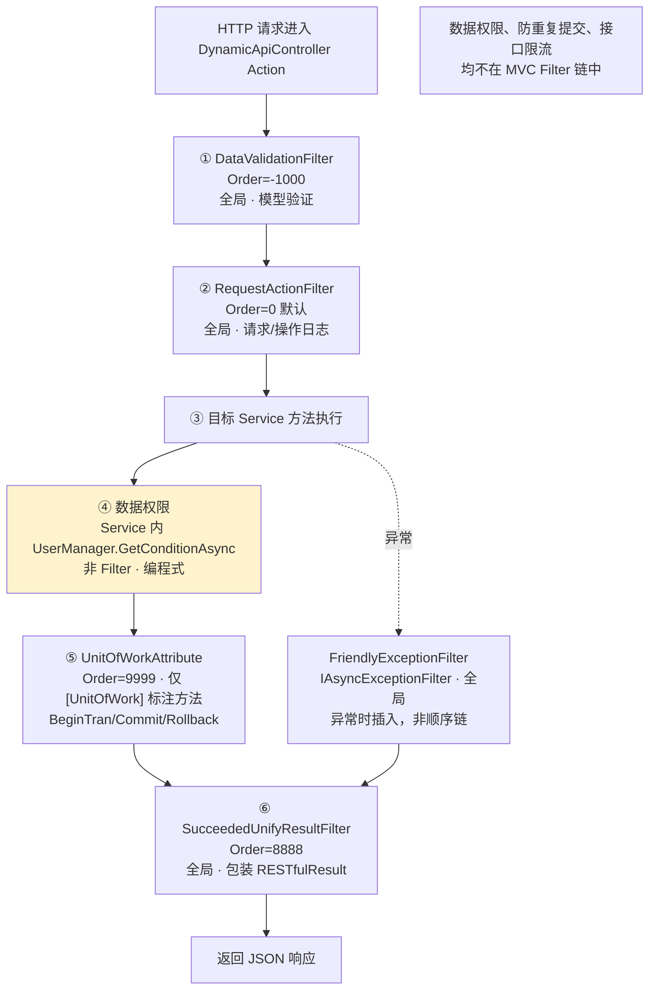
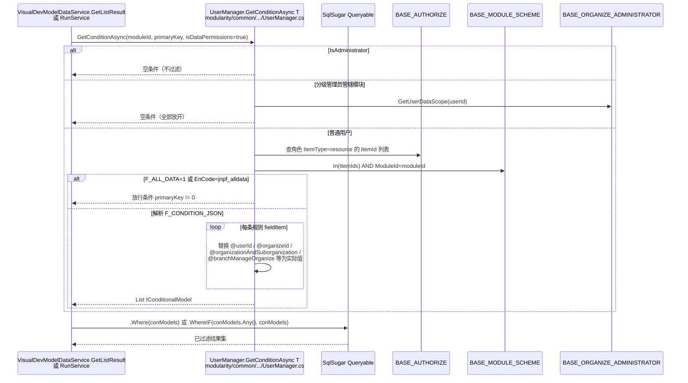
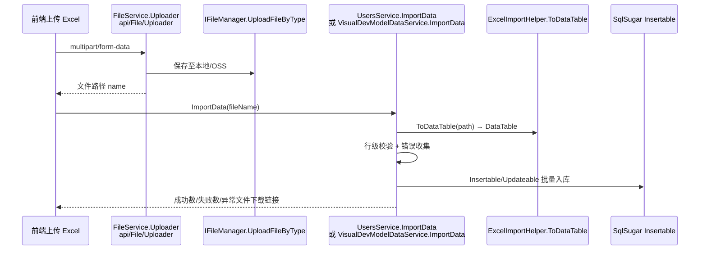

# 专项文档02 · Fruit+JNPF 低代码平台 — 应用服务架构深度解剖

> **适用源码**：JNPF v5.2  
> **源码仓库**：`d:\JNPF-v52\backend`  
> **文档编号**：v52-arch-02  
> **文档版本**：v2.0-draft  
> **文档状态**：维护中  
> **批准日期**：2026-05-24  

> **分析范围**：应用层横切能力——DI、MVC Filter 管道、数据权限、事务、导入导出、文件存储、字典、API 规范  
> **排除范围**：具体业务 CRUD 逻辑（用户管理等见 [`03-application-modules-deep-dive.md`](03-application-modules-deep-dive.md)）  
> **架构说明**：本仓库**无独立 Application 层项目**；应用服务 = `modularity/*/` 下 `*Service` + `modularity/common/JNPF.Common.Core` 公共能力  

---

## 前置确认

| 前置项 | 状态 | 来源 |
|--------|------|------|
| 应用层项目源码 | ✅ | `modularity/` 各模块 Service + `JNPF.Common.Core` |
| Service 接口/实现 | ✅ | 约定：`IXxxService` + `XxxService : IDynamicApiController, ITransient/IScoped` |
| AOP/过滤器源码 | ✅ | `framework/JNPF/*Filter*` + `JNPF.Common.Core/Filter/` |
| DI 配置 | ✅ | `Startup.cs` + `AddInject` + `AddInnerDependencyInjection` |

---

## 第一章：依赖注入与服务注册架构

### 1.1 DI 容器注册全景图

#### 图1-1 DI 服务注册全景图

```mermaid
graph TB
    subgraph entry["application/JNPF.API.Entry/Startup.ConfigureServices"]
        S1["AddConsoleFormatter()"]
        S2["SqlSugarConfigure()<br/>ISqlSugarClient Singleton<br/>ISqlSugarRepository Scoped<br/>IUnitOfWork Transient"]
        S3["AddJwt JwtHandler<br/>Authentication + Authorization"]
        S4["AddCorsAccessor()"]
        S5["AddRemoteRequest()<br/>HttpDispatchProxy"]
        S6["AddTaskQueue()"]
        S7["AddSchedule DbJobPersistence"]
        S8["AddConfigurableOptions<br/>Cache/EventBus/ConnectionStrings/Tenant"]
        S9["AddControllers()<br/>.AddMvcFilter RequestActionFilter<br/>.AddInjectWithUnifyResult RESTfulResultProvider"]
        S10["AddEventBus Memory/RabbitMQ"]
        S11["AddViewEngine / AddSensitiveDetection"]
        S12["AddWebSocketManager / AddSenparcWeixin"]
        S13["AddFileLogging ×3"]
        S14["OSSServiceConfigure()"]
        S15["AddCachingSwaggerProvider()"]
    end

    subgraph inject["AddInjectWithUnifyResult 内部链<br/>framework/JNPF/App/Extensions/AppServiceCollectionExtensions.cs"]
        I1["AddSpecificationDocuments Swagger"]
        I2["AddDynamicApiControllers"]
        I3["AddDataValidation → DataValidationFilter"]
        I4["AddFriendlyException → FriendlyExceptionFilter"]
        I5["AddUnifyResult → SucceededUnifyResultFilter"]
    end

    subgraph scan["AddDependencyInjection 程序集扫描<br/>framework/JNPF/DependencyInjection/Extensions/"]
        D1["扫描 IPrivateDependency 实现类"]
        D2["ITransient / IScoped / ISingleton 标记生命周期"]
        D3["自动注册接口 → 实现<br/>如 IUserManager → UserManager"]
        D4["RegisterNamedService 多实现命名解析"]
    end

    S9 --> I1 & I2 & I3 & I4 & I5
    I2 --> D1
    S2 --> ORM["SqlSugar + UnitOfWork"]
    S3 --> AUTH["JWT + JwtHandler"]
    S8 --> OPT["IOptions 强类型配置"]
```



**`Startup.ConfigureServices` 全部 `services.AddXxx()` 清单**：

| 调用 | 层次 | 注册内容 |
|------|------|----------|
| `AddConsoleFormatter()` | 日志 | 控制台格式化 |
| `SqlSugarConfigure()` | ORM | `ISqlSugarClient`(Singleton), `ISqlSugarRepository<>`(Scoped), `IUnitOfWork`(Transient) |
| `AddJwt<JwtHandler>(enableGlobalAuthorize: true)` | 认证 | JWT Bearer + 全局授权 + 自定义 `JwtHandler` |
| `AddCorsAccessor()` | Web | 跨域策略（`Cors.json`） |
| `AddRemoteRequest()` | 远程 | `HttpDispatchProxy` 接口代理 |
| `AddTaskQueue()` | 任务 | 内存任务队列 |
| `AddSchedule(...DbJobPersistence)` | 调度 | 定时任务 + 持久化 |
| `AddConfigurableOptions<T>()` ×4 | 配置 | Cache / EventBus / ConnectionStrings / Tenant |
| `AddControllers().AddMvcFilter<RequestActionFilter>().AddInjectWithUnifyResult<RESTfulResultProvider>()` | MVC+框架 | 动态 API + 全局 Filter 链 |
| `AddEventBus(...)` | 消息 | Memory 或 RabbitMQ |
| `AddViewEngine()` | 视图 | Razor/模板引擎 |
| `AddSensitiveDetection()` | 安全 | 敏感词检测 |
| `AddWebSocketManager()` | 通信 | WebSocket IM |
| `AddSenparcGlobalServices / AddSenparcWeixinServices` | 第三方 | 微信 SDK |
| `AddFileLogging()` ×3 | 日志 | Information/Warning/Error 分文件 |
| `OSSServiceConfigure()` | 存储 | OnceMi.AspNetCore.OSS |
| `AddCachingSwaggerProvider()` | 文档 | Swagger 缓存预热 |

业务 Service **不手动逐个注册**，由 `AddDynamicApiControllers()` + `AddDependencyInjection()` 自动扫描。

### 1.2 自动注册机制

**机制**：程序集扫描 + 生命周期标记接口（非 Scrutor 第三方库）。

| 符号 | 路径 | 说明 |
|------|------|------|
| `IPrivateDependency` | `framework/JNPF/DependencyInjection/Dependencies/IPrivateDependency.cs` | 扫描入口标记 |
| `ITransient` | `framework/JNPF/DependencyInjection/Dependencies/ITransient.cs` | 瞬时生命周期 |
| `IScoped` | `framework/JNPF/DependencyInjection/Dependencies/IScoped.cs` | 请求作用域 |
| `ISingleton` | `framework/JNPF/DependencyInjection/Dependencies/ISingleton.cs` | 单例 |
| `InjectionAttribute` | `framework/JNPF/DependencyInjection/Attributes/InjectionAttribute.cs` | 命名/排除接口/代理注册 |
| `AddInnerDependencyInjection()` | `framework/JNPF/DependencyInjection/Extensions/DependencyInjectionServiceCollectionExtensions.cs` L73 | 核心扫描逻辑 |

**扫描逻辑摘要**（`AddInnerDependencyInjection`）：

```csharp
// framework/JNPF/DependencyInjection/Extensions/DependencyInjectionServiceCollectionExtensions.cs
var injectTypes = App.EffectiveTypes
    .Where(u => typeof(IPrivateDependency).IsAssignableFrom(u) && u.IsClass && !u.IsAbstract)
    .OrderBy(u => GetOrder(u));

foreach (var type in injectTypes)
{
    var interfaces = type.GetInterfaces();
    var dependencyType = interfaces.Last(u => lifetimeInterfaces.Contains(u)); // ITransient/IScoped/ISingleton
    var canInjectInterfaces = interfaces.Where(/* 排除 IDynamicApiController、生命周期接口等 */);
    RegisterService(services, dependencyType, type, injectionAttribute, canInjectInterfaces);
}
```

**典型 Service 注册示例**：

```csharp
// modularity/system/JNPF.Systems/System/DictionaryDataService.cs
public class DictionaryDataService : IDictionaryDataService, IDynamicApiController, ITransient
```

→ 自动注册为 `Transient`，并实现 `IDynamicApiController` 被动态暴露为 API。

**动态 API 注册**：`AddDynamicApiControllers()` → `DynamicApiControllerApplicationModelConvention.Apply()` 将 `IDynamicApiController` 类转为 Controller。

### 1.3 服务生命周期管理

| 生命周期 | 典型注册 | 代表类 |
|----------|----------|--------|
| **Singleton** | `AddSingleton<ISqlSugarClient>` | `SqlSugarScope`、部分 `ICache` 实现 |
| **Scoped** | 扫描 `IScoped` | `CacheManager`、`UserManager`、`FileManager`、`SqlSugarRepository<T>` |
| **Transient** | 扫描 `ITransient` | 绝大多数 `*Service`、`IUnitOfWork`/`SqlSugarUnitOfWork` |

**选择依据**：

- `SqlSugarScope` 单例：SqlSugar 官方推荐线程安全单例；每个请求通过 `GetConnectionScope` 隔离连接
- `UserManager`/`CacheManager` Scoped：依赖 `HttpContext.User` 与请求级缓存
- `*Service` Transient：无状态业务方法，每次注入新实例

**典型陷阱**：

| 错误 | 说明 |
|------|------|
| Singleton 注入 Scoped | 若 Singleton 持有 Scoped 服务引用，会导致 DbContext/用户信息跨请求污染；【本框架】`SqlSugarRepository` 在 Scoped 内创建 Scope 读取依赖 |
| `SnowflakeIdHelper.NextId()` 静态初始化 | 首次调用通过 Redis 注册 WorkerId；高并发下 `if (YitIdHelper.IdGenInstance == null)` 存在竞态（源码注释已标注） |

#### 本节核心表清单

| 表名 | 说明 |
|------|------|
| **BASE_SYS_CONFIG** | 系统配置项，影响 Service 运行时行为（tokenTimeout 等） |

#### 本节关键代码路径索引

| 路径 | 说明 |
|------|------|
| `application/JNPF.API.Entry/Startup.cs` | 全部 AddXxx 入口 |
| `framework/JNPF/DependencyInjection/Extensions/DependencyInjectionServiceCollectionExtensions.cs` | 自动扫描 |
| `framework/JNPF/App/Extensions/AppServiceCollectionExtensions.cs` | AddInject / AddInjectWithUnifyResult |
| `framework/JNPF/DynamicApiController/Extensions/DynamicApiControllerServiceCollectionExtensions.cs` | 动态 API |

---

## 第二章：AOP 横切机制全集

> **重要说明**：本系统横切能力主要通过 **ASP.NET Core MVC Filter 管道** + **Service 内显式调用** 实现，**不是** Spring 式全局 MethodInterceptor。数据权限**无独立 MVC Filter**，而是在查询前调用 `UserManager.GetConditionAsync()` 注入 SqlSugar 条件。

### 2.1 AOP 拦截器架构图

#### 图2-1 MVC Filter 执行顺序架构图



**全部自定义 Filter 清单**：

| 拦截器名称 | 类型 | 文件路径 | 触发方式 | Order | 核心逻辑 |
|------------|------|----------|----------|-------|----------|
| `LoggingMonitorAttribute` | `IAsyncActionFilter` | `framework/JNPF/Logging/Implantations/Monitors/LoggingMonitorAttribute.cs` | 全局（**Startup 已注释未启用**）/ Attribute | -2000 | 监视器日志 `MonitorAsync` |
| `DataValidationFilter` | `IAsyncActionFilter` | `framework/JNPF/DataValidation/Filters/DataValidationFilter.cs` | 全局 `GlobalEnabled=true` | -1000 | 数据注解验证失败 → 统一返回 |
| `RequestActionFilter` | `IAsyncActionFilter` | `modularity/common/JNPF.Common.Core/Filter/RequestActionFilter.cs` | 全局 Startup 显式注册 | 0 | Action 执行后异步写 **BASE_SYS_LOG** |
| `SucceededUnifyResultFilter` | `IAsyncActionFilter` | `framework/JNPF/UnifyResult/Filters/SucceededUnifyResultFilter.cs` | 全局 `AddUnifyResult` | 8888 | 成功响应包装 `{code,data,msg}` |
| `UnitOfWorkAttribute` | `IAsyncActionFilter` | `framework/JNPF/UnitOfWork/FilterAttributes/UnitOfWorkAttribute.cs` | **仅 `[UnitOfWork]` 特性** | 9999 | SqlSugar `BeginTran/CommitTran/RollbackTran` |
| `FriendlyExceptionFilter` | `IAsyncExceptionFilter` | `framework/JNPF/FriendlyException/Filters/FriendlyExceptionFilter.cs` | 全局 | N/A | 异常 → `RESTfulResultProvider.OnException` |

**未实现的模板能力**：

| 能力 | 状态 |
|------|------|
| 防重复提交 Filter | ❌ 全库无 `RepeatSubmit`/`PreventDuplicate` |
| 接口限流 Filter | ❌ 全库无 `RateLimit`/`Throttle` |
| 数据权限 Filter | ❌ 编程式，见 2.2 |
| 全局 Method AOP | ❌ `AspectDispatchProxy` 仅用于 `HttpDispatchProxy` 远程请求 |

### 2.2 数据权限深度分析

#### 配置入口

| 层级 | 位置 | 说明 |
|------|------|------|
| 前端配置 | 【待源码验证：低代码/系统管理 UI 配置数据权限方案】 | 对应后端 `ModuleDataAuthorizeSchemeService` |
| 方案管理 API | `ModuleDataAuthorizeSchemeService` — `modularity/system/JNPF.Systems/System/ModuleDataAuthorizeSchemeService.cs` | `Create`/`Update`/`Delete`/`GetResourceList` |
| 字段权限 | `ModuleDataAuthorizeService` — 同目录 | 字段级规则 **BASE_MODULE_AUTHORIZE** |
| 角色绑定 | `AuthorizeService` — `Permission/AuthorizeService.cs` | `BASE_AUTHORIZE` ItemType=`resource` 关联方案 Id |

#### 存储表结构（≈ sys_data_scope）

**BASE_MODULE_SCHEME**（数据权限方案，实体 `ModuleDataAuthorizeSchemeEntity`）：

| 字段 | 说明 |
|------|------|
| F_ID (PK) | 方案 Id |
| F_EN_CODE | 方案编码；`jnpf_alldata` = 全部数据 |
| F_FULL_NAME | 方案名称 |
| F_MODULE_ID (FK) | 关联 **BASE_MODULE** |
| F_CONDITION_JSON | 条件规则 JSON（前端可视化配置产物） |
| F_CONDITION_TEXT | 条件描述 |
| F_ALL_DATA | 1=全部数据 |
| F_MATCH_LOGIC | 分组匹配逻辑 |

**BASE_MODULE_AUTHORIZE**（字段级数据权限配置）：

| 字段 | 说明 |
|------|------|
| F_MODULE_ID | 模块 Id |
| F_EN_CODE / F_FULL_NAME | 字段编码/名称 |
| F_CONDITION_SYMBOL / F_CONDITION_TEXT | 条件符号与内容 |

**BASE_AUTHORIZE**（角色↔方案绑定）：

| 字段 | 说明 |
|------|------|
| F_ITEM_TYPE | `resource` 表示数据权限方案 |
| F_ITEM_ID | → BASE_MODULE_SCHEME.F_ID |
| F_OBJECT_TYPE | `Role` / `User` / `Position` |
| F_OBJECT_ID | 角色/用户 Id |

#### 图2-2 数据权限 SQL 条件注入时序图



**权限类型 → SQL 条件映射**（`UserManager.GetConditionAsync` 内 `switch (itemValue)`）：

| 类型 | 占位符 | SQL 语义 |
|------|--------|----------|
| 本人 | `@userId` | `Field = 当前 UserId` |
| 本人及下属 | `@userAraSubordinates` | `Field IN (UserId + Subordinates)` |
| 本组织 | `@organizeId` | `Field = User.OrganizeId` |
| 本组织及子组织 | `@organizationAndSuborganization` | `Field IN CurrentOrganizationAndSubOrganizations` |
| 分管组织 | `@branchManageOrganize` | `Field IN DataScope.Select=true 的 organizeId 列表` |
| 全部数据 | `F_ALL_DATA=1` | 不追加限制（或 primaryKey≠0 占位） |
| 无权限 | 角色无 resource 授权 | `primaryKey = 0`（返回空集） |
| 自定义 | `ConditionJson` 具体字段值 | `GetConditionalModel(QueryType, field, value)` |

**调用示例**（在线开发运行时）：

```csharp
// modularity/visualdev/JNPF.VisualDev/RunService.cs — 列表查询前
var conModels = await _userManager.GetConditionAsync<Dictionary<string, object>>(
    entity.Id, primaryKeyPolicy, useDataPermission);
query = query.Where(conModels);  // ★ 注入 SqlSugar 条件
```

### 2.3 操作日志 AOP

| 项 | 实现 |
|----|------|
| 拦截器 | `RequestActionFilter.OnActionExecutionAsync` |
| 记录内容 | UserId、UserName/Account、IP、IP 归属地、RequestURL、Method、请求参数 JSON、响应 JSON、耗时 ms、UA/OS |
| 请求日志 | 默认每条 API → `Log:CreateReLog` → **BASE_SYS_LOG** `F_Type=5` |
| 操作日志 | 方法标注 `[OperateLogAttribute]` → 额外 `Log:CreateOpLog` → `F_Type=3` + ModuleName |
| 写入方式 | **异步事件总线** `_eventPublisher.PublishAsync(LogEventSource)`，非同步写库 |
| 跳过 | `[IgnoreLogAttribute]`（如 `FileService`） |

**表结构 BASE_SYS_LOG**（≈ sys_log / sys_operatelog）：

| 字段 | 说明 |
|------|------|
| F_ID (PK) | 雪花 Id |
| F_USER_ID / F_USER_NAME | 操作人 |
| F_Type | 1登录 / 3操作 / 4异常 / 5请求 |
| F_IP_ADDRESS / F_IP_ADDRESS_NAME | IP 及归属 |
| F_REQUEST_URL / F_REQUEST_METHOD | 请求路径与方法 |
| F_REQUEST_PARAM / F_JSON | 入参/出参 JSON |
| F_REQUEST_DURATION | 耗时(ms) |
| F_MODULE_NAME | 操作日志模块名 |
| F_CREATOR_TIME | 创建时间 |

### 2.4 防重复提交

| 项 | 状态 |
|----|------|
| 专用 Filter/Attribute | **未实现** |
| Redis SetNx | `ICacheManager.SetNx()` 存在于 `framework/JNPF/Cache/`，**无 Filter 层封装** |
| 前端 Token 机制 | 【待源码验证】 |
| 业务层 | 个别场景可手动 `SetNx`；无统一规范 |

### 2.5 事务管理

**声明式事务** — `[UnitOfWork]` 特性：

```csharp
// framework/JNPF/UnitOfWork/FilterAttributes/UnitOfWorkAttribute.cs
public async Task OnActionExecutionAsync(ActionExecutingContext context, ActionExecutionDelegate next)
{
    BeginTransaction(context, method, out var _unitOfWork, out var unitOfWorkAttribute);
    var resultContext = await next();
    if (resultContext.Exception == null)
        CommitTransaction(context, _unitOfWork, unitOfWorkAttribute, resultContext);
    else
        RollbackTransaction(context, _unitOfWork, unitOfWorkAttribute, resultContext);
}
```

**编程式实现** — `SqlSugarUnitOfWork`（`modularity/common/JNPF.Common/UnitOfWork/SqlSugarUnitOfWork.cs`）：

```csharp
public void BeginTransaction(FilterContext context, UnitOfWorkAttribute unitOfWork)
    => _sqlSugarClient.AsTenant().BeginTran();
public void CommitTransaction(...) => _sqlSugarClient.AsTenant().CommitTran();
public void RollbackTransaction(...) => _sqlSugarClient.AsTenant().RollbackTran();
```

| 项 | 说明 |
|----|------|
| 传播行为 | 默认单库单事务；`UseAmbientTransaction=true` 时使用 `TransactionScope`（`UnitOfWorkAttribute` 属性） |
| 嵌套 | 同请求内多次 `[UnitOfWork]` 共享 `IUnitOfWork` Transient 实例 |
| 分布式事务 | `UseAmbientTransaction` + `TransactionScopeOption` 可选；**跨库场景主要依赖 SqlSugar `AsTenant()` 同进程多连接，非 2PC** |
| 使用面 | `DictionaryDataService.ActionsImport`、`AuthorizeService`、`VisualDevModelDataService` 等大量 Service 方法标注 |

#### 本节核心表清单

| 表名 | 说明 |
|------|------|
| **BASE_MODULE_SCHEME** | 数据权限方案 |
| **BASE_MODULE_AUTHORIZE** | 字段级数据权限 |
| **BASE_AUTHORIZE** | 角色-方案绑定 |
| **BASE_ORGANIZE_ADMINISTRATOR** | 组织管理员分级数据范围 |
| **BASE_SYS_LOG** | 请求/操作/异常日志 |

#### 本节关键代码路径索引

| 路径 | 说明 |
|------|------|
| `modularity/common/JNPF.Common.Core/Manager/User/UserManager.cs` | GetConditionAsync / GetUserDataScope |
| `modularity/common/JNPF.Common.Core/Filter/RequestActionFilter.cs` | 操作/请求日志 |
| `framework/JNPF/UnitOfWork/FilterAttributes/UnitOfWorkAttribute.cs` | 声明式事务 |
| `modularity/system/JNPF.Systems/System/ModuleDataAuthorizeSchemeService.cs` | 方案 CRUD |

---

## 第三章：通用服务基础设施

### 3.1 导入导出引擎

| 组件 | 路径 | 版本/说明 |
|------|------|-----------|
| NPOI | `modularity/common/JNPF.Common/JNPF.Common.csproj` | NPOI 2.5.5 |
| `ExcelImportHelper` | `modularity/common/JNPF.Common/Security/ExcelImportHelper.cs` | `ToDataTable(filePath/stream)` → DataTable |
| `ExcelExportHelper<T>` | `modularity/common/JNPF.Common/Security/ExcelExportHelper.cs` | `Export`/`ExportMemoryStream`/`ExcelExportTemplate` |
| `ExportImportDataHelper` | `modularity/common/JNPF.Common.CodeGen/ExportImport/ExportImportDataHelper.cs` | 代码生成/在线开发导入导出编排 |
| `CodeGenExportDataHelper` | `modularity/common/JNPF.Common/Security/CodeGenExportDataHelper.cs` | 代码生成专用 |

#### 导入链路



**典型 Service**：`UsersService.ImportData`（`Permission/UsersService.cs`）、`DictionaryDataService.ActionsImport`（`[UnitOfWork]`）、`VisualDevModelDataService.ImportData`。

**大数据策略**：

- 导出：`ExcelExportHelper.ExportMemoryStream` 生成 `MemoryStream`；【待源码验证：超大数据量是否流式分页导出】
- 异常行：`ExportExceptionData` 将失败行导出为 Excel 供下载（UsersService/VisualDev 均有）

**模板下载**：`ExcelExportHelper.ExcelExportTemplate(excelConfig, addFilePath)` 按 `ExcelTemplateModel` 生成空模板。

### 3.2 文件存储服务

| 组件 | 路径 | 说明 |
|------|------|------|
| `FileService` | `modularity/system/JNPF.Systems/Common/FileService.cs` | API：`Uploader`/`UploadChunk`/`Merge`/`UploadImage` |
| `IFileManager` / `FileManager` | `modularity/common/JNPF.Common.Core/Manager/Files/FileManager.cs` | 核心上传/下载/分片/合并 |
| `OSSServiceConfigure` | `application/JNPF.API.Entry/Extensions/OSSServiceConfigureExtensions.cs` | `AddOSSService` OnceMi.AspNetCore.OSS |
| `OssOptions` / `OSSProviderType` | `modularity/common/JNPF.Common/Options/OssOptions.cs` | 含 Minio、阿里云等 |
| `KeyVariable.FileStoreType` | `modularity/common/JNPF.Common/Configuration/KeyVariable.cs` | 运行时存储类型 |

**策略切换**（`FileManager.UploadFileByType`）：

```csharp
switch (fileStoreType)
{
    case OSSProviderType.Invalid:  // ★ 本地磁盘
        uploadPath = Path.Combine(directoryPath, fileName);
        await stream.CopyToAsync(File.Create(uploadPath));
        break;
    default:  // ★ OSS/MinIO 等
        await _oSSServiceFactory.Create(KeyVariable.FileStoreType.ToString())
            .PutObjectAsync(bucketName, uploadPath, stream);
        break;
}
```

| 能力 | API | 方法 |
|------|-----|------|
| 普通上传 | `POST api/File/Uploader` | `FileService.Uploader` |
| 分片上传 | `POST api/File/UploadChunk` | `FileManager.UploadChunk` |
| 分片合并 | `POST api/File/Merge` | `FileManager.Merge` |

**文件元数据表**：本仓库**未发现** `sys_file` / `BASE_FILE` 实体；文件以**路径字符串**（JSON 字段/业务表附件列）存储引用，非独立文件表。

### 3.3 ID 生成策略

| 项 | 实现 |
|----|------|
| 算法 | **Yitter 雪花算法**（`Yitter.IdGenerator` 1.0.14） |
| 工具类 | `modularity/common/JNPF.Common/Security/SnowflakeIdHelper.cs` |
| 方法 | `public static string NextId()` |
| WorkerId | 通过 native DLL `yitidgengo` + **Redis** `RegisterOne(ip, port, password, 63)` 注册，保证多节点 WorkerId 不冲突 |
| 实体默认值 | `TenantCLDSEntityBase.Creator()` → `Id = SnowflakeIdHelper.NextId()` |
| 策略 | 主键策略=1 时业务表使用雪花；=2 时自增（代码生成配置 `primaryKeyPolicy`） |

### 3.4 数据字典服务

| 组件 | 路径 |
|------|------|
| `DictionaryDataService` | `modularity/system/JNPF.Systems/System/DictionaryDataService.cs` |
| `DictionaryTypeService` | `modularity/system/JNPF.Systems/System/DictionaryTypeService.cs` |
| 路由 | `api/system/DictionaryData`、`api/system/DictionaryType` |

**表结构**：

**BASE_DICTIONARY_TYPE**（≈ sys_dictionarytype）：

| 字段 | 说明 |
|------|------|
| F_ID (PK) | 类型 Id |
| F_PARENT_ID | 上级 |
| F_FULL_NAME / F_EN_CODE | 名称/编码 |
| F_IS_TREE | 是否树形 |
| F_TYPE | 1系统/0业务 |

**BASE_DICTIONARY_DATA**（≈ sys_dictionarydata）：

| 字段 | 说明 |
|------|------|
| F_ID (PK) | 字典项 Id |
| F_DICTIONARY_TYPE_ID (FK) | 所属类型 |
| F_FULL_NAME / F_EN_CODE | 显示名/存储值 |
| F_PARENT_ID | 树形上级 |
| F_SORT_CODE | 排序 |

**缓存策略**：

- 系统字典 API：`GetList`/`GetListAll` 直接查库
- 低代码表单：`FormDataParsing.GetDictionaryList` / `_cacheManager.Get(fieldCacheKey)` 缓存字典下拉数据
- 失效：字典 CRUD 后【待源码验证：是否主动 Del 缓存键】

**前端消费**：【待源码验证】调用 `GET api/system/DictionaryData/{dictionaryTypeId}` 填充下拉框；低代码引擎运行时通过 `RunService`/`FormDataParsing` 解析。

### 3.5 接口限流

| 项 | 状态 |
|----|------|
| 限流 Filter/Middleware | **全库未实现** |
| 令牌桶/滑动窗口 | **无** |
| 配置/注解 | **无** |

如需限流，需在 `Startup` 自行集成 ASP.NET Core `RateLimiter`（.NET 7+）或第三方中间件。

#### 本节核心表清单

| 表名 | 说明 |
|------|------|
| **BASE_DICTIONARY_TYPE** | 字典分类 |
| **BASE_DICTIONARY_DATA** | 字典项 |
| **BASE_USER** | 导入用户等场景 |

#### 本节关键代码路径索引

| 路径 | 说明 |
|------|------|
| `modularity/common/JNPF.Common/Security/ExcelImportHelper.cs` | Excel 导入 |
| `modularity/common/JNPF.Common/Security/ExcelExportHelper.cs` | Excel 导出 |
| `modularity/common/JNPF.Common.Core/Manager/Files/FileManager.cs` | 文件存储 |
| `modularity/system/JNPF.Systems/Common/FileService.cs` | 文件 API |
| `modularity/common/JNPF.Common/Security/SnowflakeIdHelper.cs` | 雪花 ID |
| `modularity/system/JNPF.Systems/System/DictionaryDataService.cs` | 字典服务 |

---

## 第四章：API 规范与接口设计

### 4.1 RESTful API 设计规范

#### 路由命名

| 规则 | 示例 | 来源 |
|------|------|------|
| 默认模板 | `api/[controller]/[action]` | 动态 API 约定 |
| 自定义 Route | `[Route("api/system/[controller]")]` | `DictionaryDataService` |
| OAuth | `api/OAuth/Login` | `OAuthService` |
| 文件 | `api/File/Uploader` | `FileService` |

**HTTP 方法映射**（`DynamicApiControllerApplicationModelConvention`）：

| 方法名前缀 | HTTP 动词 |
|------------|-----------|
| `Get*` / `Query*` | GET |
| `Post*` / `Create*` / `Add*` | POST |
| `Put*` / `Update*` | PUT |
| `Delete*` / `Remove*` | DELETE |
| 显式 `[HttpPost("Login")]` | 覆盖约定 |

**参数绑定**：

- Query：`[FromQuery] PageInputBase input`
- Body/Form：`[FromBody]` / `[FromForm] LoginInput`
- Route：`[HttpGet("{id}")]` + 路由参数

#### 统一响应格式

**成功**（`RESTfulResultProvider.OnSucceeded`）：

```json
{
  "code": 200,
  "data": { /* 业务数据 */ },
  "msg": "操作成功",
  "extras": null,
  "timestamp": 1710000000
}
```

**失败**（`OnException` / `OnValidateFailed`）：

```json
{
  "code": 400,
  "data": null,
  "msg": "具体错误信息",
  "extras": null,
  "timestamp": 1710000000
}
```

**分页**（`PageResult<T>` — `modularity/common/JNPF.Common/Filter/PageResult.cs`）：

```json
{
  "code": 200,
  "data": {
    "pagination": { "currentPage": 1, "pageSize": 20, "total": 100 },
    "list": [ /* 记录 */ ]
  },
  "msg": "操作成功"
}
```

生成方式：`return PageResult<T>.SqlSugarPageResult(await query.ToPagedListAsync(input.currentPage, input.pageSize));`

**特殊 Header**：`jnpf_api` 请求头存在时，`OnSucceeded` 直接返回原始 `data` 不包装（数据接口场景）。

### 4.2 Swagger 文档配置

| 项 | 路径/配置 |
|----|-----------|
| 注册 | `AddInject` → `AddSpecificationDocuments` |
| 配置文件 | `application/JNPF.API.Entry/Configurations/Swagger.json` |
| UI | `UseKnife4UI` RoutePrefix=`newapi`（`Startup.cs` L296） |
| 分组 | `SpecificationDocumentSettings.GroupOpenApiInfos[]` — Group/Title/Version |
| XML 注释 | `XmlComments: ["JNPF.OAuth","JNPF.Systems","JNPF.Common"]` |
| 分组来源 | Service 上 `[ApiDescriptionSettings(Tag="System", Name="DictionaryData", Order=203)]` |
| Schema 过滤 | `framework/JNPF/SpecificationDocument/Filters/` — `EnumSchemaFilter`, `AnySchemaFilter` 等 |
| 预热 | `serviceProvider.WarmupSwagger()` 避免 Knife4UI 首次超时 |

### 4.3 接口版本管理

| 项 | 实现 |
|----|------|
| 版本策略 | `DynamicApiControllerApplicationModelConvention` 支持类名后缀 `V1`/`V2` 正则 `_nameVersionRegex` |
| 配置 | `DynamicApiControllerSettingsOptions` — 【待源码验证：当前项目 Service 普遍无版本后缀】 |
| 多版本共存 | 框架层支持；**本仓库业务 Service 以单版本为主** |

#### 本节核心表清单

| 表名 | 说明 |
|------|------|
| **BASE_MODULE** | API 路由与模块 EnCode 对应菜单权限 |

#### 本节关键代码路径索引

| 路径 | 说明 |
|------|------|
| `framework/JNPF/DynamicApiController/Conventions/DynamicApiControllerApplicationModelConvention.cs` | 路由/HTTP 动词约定 |
| `framework/JNPF/UnifyResult/Providers/RESTfulResultProvider.cs` | 统一响应 |
| `modularity/common/JNPF.Common/Filter/PageResult.cs` | 分页结构 |
| `framework/JNPF/SpecificationDocument/` | Swagger 构建 |
| `application/JNPF.API.Entry/Configurations/Swagger.json` | 文档分组配置 |

---

## 本篇产出自检

| 产出项 | 状态 | 编号 |
|--------|------|------|
| DI 注册全景图 | ✅ | 图1-1 |
| AOP 拦截器架构图 | ✅ | 图2-1 |
| 数据权限 SQL 注入时序图 | ✅ | 图2-2 |
| 核心代码片段 ≥ 10 处 | ✅ | 全文 10+ 处 |
| 涉及数据库表 ≥ 5 张 | ✅ | 见各章清单 |

### 深度自检清单

- [x] 端到端链路：DI 扫描 → Filter 管道 → Service → UserManager 数据权限 → SqlSugar
- [x] 数据库表与关键字段：BASE_MODULE_SCHEME / AUTHORIZE / SYS_LOG / DICTIONARY_* 等
- [x] 技术图：3 张 Mermaid + 导入链路时序图
- [x] 可验证路径：均已标注 modularity/framework/application 路径
- [x] 扩展点：自定义 Filter（AddMvcFilter）、UserManager 条件扩展、FileStoreType 切换、SetNx 手动防重
- [x] 设计局限：无统一防重复提交/限流；数据权限非 Filter 易遗漏调用；SnowflakeIdHelper 静态初始化竞态
- [x] 【待源码验证】：前端防重/字典缓存失效/大数据导出流式/接口版本实际使用

### 与模板预期差异摘要

| 模板预期 | 本仓库实际 |
|----------|------------|
| Application 层独立项目 | 无；`modularity/*Service` + `Common.Core` |
| sys_data_scope 表 | **BASE_MODULE_SCHEME** + **BASE_AUTHORIZE** |
| 数据权限 AOP Filter | **编程式** `UserManager.GetConditionAsync` |
| 防重复提交 / 限流 | **未实现** |
| sys_file 表 | **无独立文件元数据表** |
| Scrutor 扫描 | **自研** `AddInnerDependencyInjection` |

---

*文档遵循 [`docs/ARCHITECTURE_DOC_RULES.md`](../ARCHITECTURE_DOC_RULES.md) 编写。*
