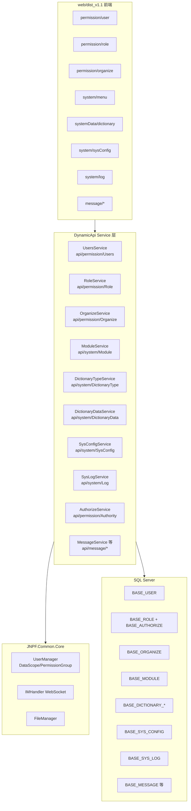
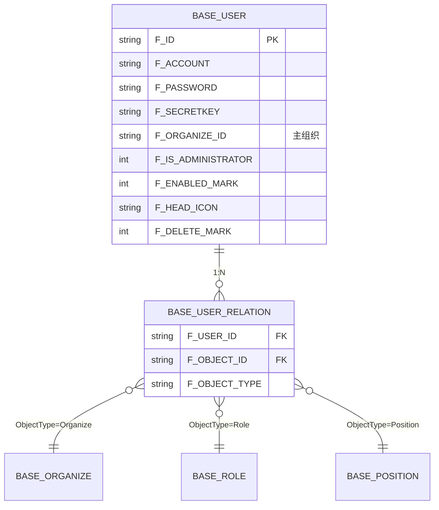
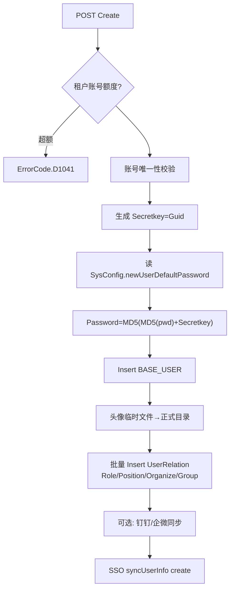
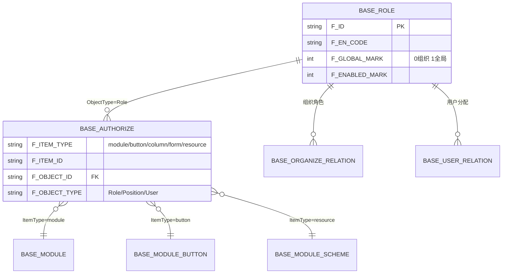
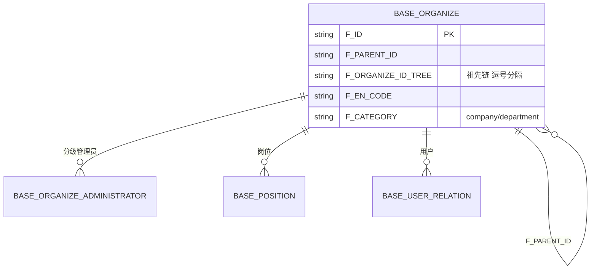
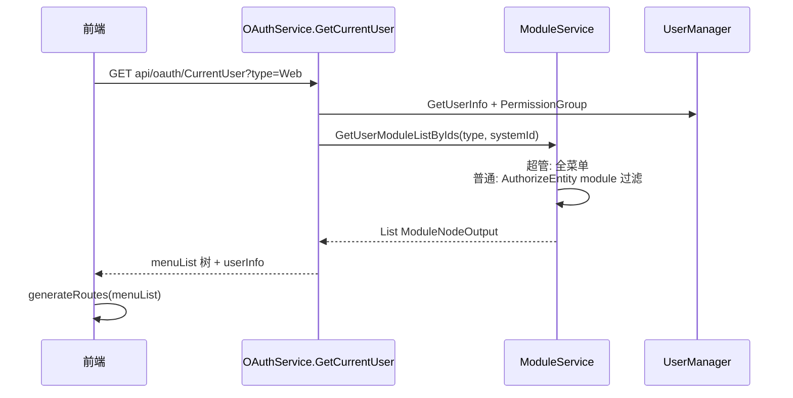
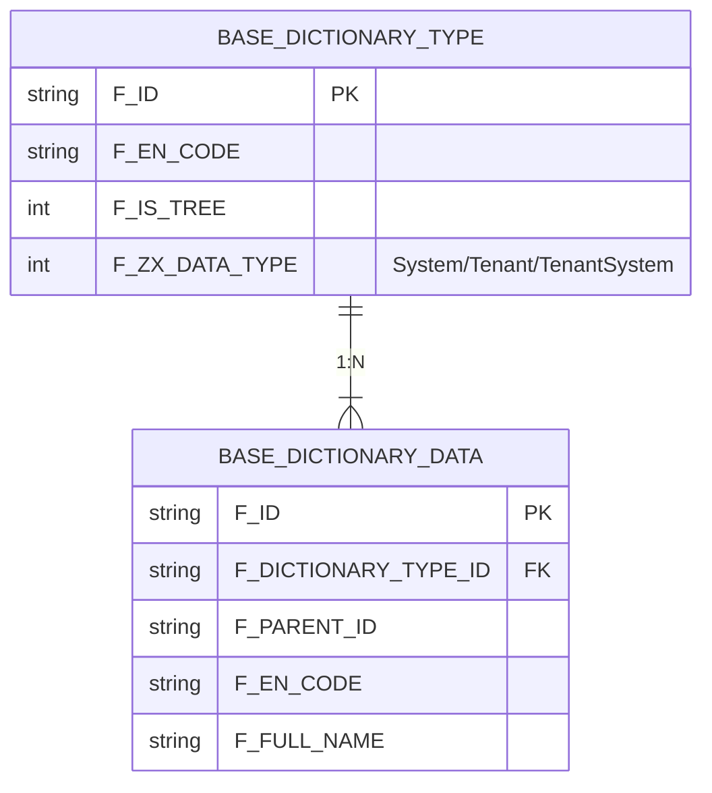
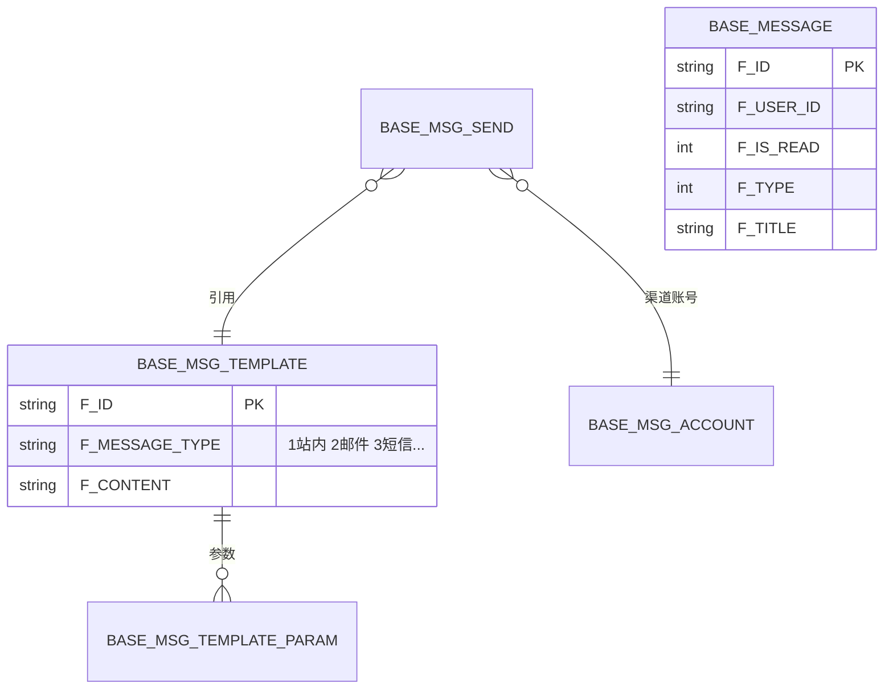
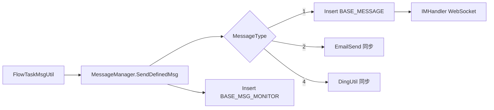

# 专项文档03 · Fruit+JNPF 低代码平台 — 应用模块深度解剖

> **适用源码**：JNPF v5.2  
> **源码仓库**：`d:\JNPF-v52\backend`  
> **文档编号**：v52-arch-03  
> **文档版本**：v2.0-draft  
> **文档状态**：维护中  
> **批准日期**：2026-05-24  

> **分析范围**：系统管理 7 大模块 + 项目已实现但未在提示词中列出的重要应用模块  
> **API 暴露方式**：`*Service : IDynamicApiController`（无独立 Controller 类）  
> **DDL 基线**：`web/主库脚本.sql`  
> **前端基线**：`web/dist_v1.1/`（编译产物；**Vue 源码不在本仓库**）  
> **横切能力**：见 [`02-application-services.md`](02-application-services.md)

---

## 目录

- [第一章：模块全景与架构分层](#第一章模块全景与架构分层)
- [第二章：2.1 用户管理](#第二章21-用户管理user-management)
- [第三章：2.2 角色管理](#第三章22-角色管理role-management)
- [第四章：2.3 组织机构管理](#第四章23-组织机构管理organization-management)
- [第五章：2.4 菜单管理](#第五章24-菜单管理menu-management)
- [第六章：2.5 数据字典管理](#第六章25-数据字典管理dictionary-management)
- [第七章：2.6 系统配置管理](#第七章26-系统配置管理system-config)
- [第八章：2.7 消息通知管理](#第八章27-消息通知管理)
- [第九章：补充模块（提示词未列但已实现）](#第九章补充模块提示词未列但已实现)
- [第十章：竞品对标与框架不足分析](#第十章竞品对标与框架不足分析)
- [第十一章：二期必须完成的应用模块](#第十一章二期必须完成的应用模块)

---

## 第一章：模块全景与架构分层

### 1.1 系统管理模块在整体架构中的位置



### 1.2 模块—Service—表 对照总览

| 业务模块 | Service 类 | Route 前缀 | 核心表 |
|----------|------------|------------|--------|
| 用户管理 | `UsersService` | `api/permission/Users` | **BASE_USER**, **BASE_USER_RELATION** |
| 角色管理 | `RoleService` | `api/permission/Role` | **BASE_ROLE**, **BASE_AUTHORIZE**, **BASE_ORGANIZE_RELATION** |
| 组织机构 | `OrganizeService` / `DepartmentService` | `api/permission/Organize` | **BASE_ORGANIZE**, **BASE_ORGANIZE_ADMINISTRATOR** |
| 菜单管理 | `ModuleService` + 子 Service | `api/system/Module` | **BASE_MODULE**, **BASE_MODULE_BUTTON/COLUMN/FORM** |
| 数据字典 | `DictionaryTypeService` / `DictionaryDataService` | `api/system/DictionaryType` | **BASE_DICTIONARY_TYPE**, **BASE_DICTIONARY_DATA** |
| 系统配置 | `SysConfigService` | `api/system/SysConfig` | **BASE_SYS_CONFIG** |
| 日志管理 | `SysLogService` | `api/system/Log` | **BASE_SYS_LOG** |
| 消息通知 | `MessageService` 等 7 个 | `api/message/*` | **BASE_MESSAGE**, **BASE_MSG_TEMPLATE** 等 |

### 1.3 权限模型说明

本框架**不使用** `sys_data_scope` 表名。数据权限与功能权限统一落在：

| 机制 | 表 / 类 | 说明 |
|------|---------|------|
| 功能权限（菜单/按钮/列/表单） | **BASE_AUTHORIZE** + `AuthorizeService` | `F_ITEM_TYPE` = module/button/column/form/resource/portalManage |
| 菜单级数据权限方案 | **BASE_MODULE_SCHEME** + `ModuleDataAuthorizeSchemeService` | 条件 JSON |
| 组织分级管理 | **BASE_ORGANIZE_ADMINISTRATOR** + `UserManager.DataScope` | 本层/子层增删改查 |
| 权限组 | **BASE_PERMISSION_GROUP** + `PermissionGroupService` | 批量授权对象 |

#### 本节核心表清单

**BASE_USER** · **BASE_ROLE** · **BASE_AUTHORIZE** · **BASE_ORGANIZE** · **BASE_MODULE** · **BASE_DICTIONARY_TYPE** · **BASE_DICTIONARY_DATA** · **BASE_SYS_CONFIG** · **BASE_SYS_LOG** · **BASE_MESSAGE**

#### 本节关键代码路径索引

| 路径 | 说明 |
|------|------|
| `modularity/system/JNPF.Systems/Permission/` | 用户/角色/组织/授权 |
| `modularity/system/JNPF.Systems/System/` | 菜单/字典/配置/日志 |
| `modularity/message/JNPF.Message/Service/` | 消息中心 |
| `modularity/oauth/JNPF.OAuth/OAuthService.cs` | 登录后菜单/用户信息 |
| `modularity/common/JNPF.Common.Core/Manager/UserManager.cs` | 运行时权限上下文 |

---

## 第二章：2.1 用户管理（User Management）

### 1. 核心数据表

| 表名 | 关键字段 | 说明 |
|------|----------|------|
| **BASE_USER** | `F_ACCOUNT`, `F_PASSWORD`, `F_SECRETKEY`, `F_ORGANIZE_ID`, `F_ROLE_ID`, `F_IS_ADMINISTRATOR`, `F_ENABLED_MARK`, `F_HEAD_ICON`, `F_DELETE_MARK` | 用户主表；软删除 |
| **BASE_USER_RELATION** | `F_USER_ID`, `F_OBJECT_ID`, `F_OBJECT_TYPE` | 多对多：Organize/Role/Position/Group |
| **BASE_USER_OLD_PASSWORD** | `F_USER_ID`, `F_PASSWORD` | 历史密码（改密校验） |
| **BASE_ORGANIZE_ADMINISTRATOR** | 分级管理权限 | 控制 `DataScope` |

#### 图2-1 用户管理局部 ER 图



### 2. 后端 API 清单

| 方法 | 路由 | 功能 | Service 方法 | 权限控制 |
|------|------|------|--------------|----------|
| GET | `api/permission/Users` | 分页列表 | `GetList` | 分级 `DataScope.Select` + 非 admin 过滤 |
| GET | `api/permission/Users/{id}` | 详情 | `GetInfo` | 同上 |
| POST | `api/permission/Users` | 新增 | `Create` | `[AllowAnonymous]`（外部注册入口） |
| PUT | `api/permission/Users/{id}` | 编辑 | `Update` | 超管仅 admin 可改 |
| DELETE | `api/permission/Users/{id}` | 软删除 | `Delete` | 禁止删 admin/自己/组织管理员 |
| PUT | `api/permission/Users/{id}/Actions/State` | 启用/禁用 | `UpdateState` | 分级 Edit 权限 |
| POST | `api/permission/Users/{id}/Actions/ResetPassword` | 重置密码 | `ResetPassword` | 踢下线 + 清缓存 |
| GET | `api/permission/Users/ExportData` | 导出 | `ExportData` | — |
| GET | `api/permission/Users/TemplateDownload` | 导入模板 | `TemplateDownload` | — |
| POST | `api/permission/Users/Uploader` | 上传 Excel | `Uploader` | — |
| GET | `api/permission/Users/ImportPreview` | 导入预览 | `ImportPreview` | — |
| POST | `api/permission/Users/ImportData` | 确认导入 | `ImportData` | `[UnitOfWork]` |
| POST | `api/permission/Users/workHandover` | 工作交接 | `WorkHandover` | — |

**Service 路径**：`modularity/system/JNPF.Systems/Permission/UsersService.cs`

### 3. 核心业务逻辑深度分析

#### 3.1 新增流程



**校验**：账号重复 `D1003`；多租户 `accountNum` 限制。

**事务**：`Create` **未**标注 `[UnitOfWork]`，用户插入与关系表分步执行，异常时可能不一致。

#### 3.2 密码加密（★ 特殊关注）

| 场景 | 算法 | 代码位置 |
|------|------|----------|
| 新建用户 | `MD5(MD5(明文) + Secretkey)` | `UsersService.Create` L1146-1158 |
| 批量导入 | 同上 | `ImportUserData` L2261-2267 |
| 重置密码 | `MD5(明文 + Secretkey)` **（少一层 MD5）** | `ResetPassword` L1497 |
| 登录校验 | 与 OAuth 层比对 | `GetInfoByAccount` L1950 |

**结论**：当前为 **MD5 + 每用户 Secretkey**，**非 BCrypt**。新建与重置算法不一致，属已知缺陷；二期 P0-A 计划迁移 BCrypt。

#### 3.3 编辑流程

- 字段级：`Adapt<UserEntity>` + `IgnoreColumns(ignoreAllNullColumns: true)` 部分更新
- 组织/角色/岗位：先 `UserRelationService.Delete(userId)` 再批量重建
- 超管保护：`IsAdministrator==1` 且操作者非 `admin` → `D1033`
- 主管环检测：`GetIsMyStaff` 防止上下级循环

#### 3.4 删除流程

- **软删除**：`DeleteMark=1`，更新 `DeleteTime/DeleteUserId`
- **级联**：硬删 `BASE_USER_RELATION`；第三方同步删除；SSO 同步
- **禁止**：组织管理员 `D2003`、超管 `D1014`、自己 `D1001`

#### 3.5 查询流程

- 分页：`ToPagedListAsync(currentPage, pageSize)`
- 组织树过滤：`OrganizeIdTree.Contains` + `UserRelation` 子查询
- 数据权限：非超管 `dataScope.Contains(ObjectId)` 子查询
- 锁定状态：`lockType=Delay` 时自动解锁展示

#### 3.6 批量导入（★ 特殊关注）

1. `Uploader` → 临时目录 `FileVariable.TemporaryFilePath`
2. `ImportPreview` → `ExcelImportHelper.ToDataTable` + 列名映射 `GetUserInfoFieldToTitle()`
3. `ImportData` → `ImportUserData` 行级校验（组织/角色/岗位编码存在性）→ 批量 Insert

限制：前端提示最多 **1000 条**，文件 **500KB**（`ImportModal.vue` 编译产物）。

#### 3.7 状态变更（★ 特殊关注）

`UpdateState` **仅切换 `EnabledMark`**，**不会**踢下线或清 Token。

对比：`ResetPassword` 会通过 `IMHandler.SendMessageAsync(logout)` + 删除 `CACHEKEYONLINEUSER` 和 `CACHEKEYUSER` **强制下线**。

**缺陷**：禁用用户仍可继续使用已签发 JWT，直至 Token 过期。

#### 3.8 头像存储（★ 特殊关注）

- 存库字段：`F_HEAD_ICON` 仅存文件名（如 `001.png`）
- 默认头像：`001.png`
- 物理路径：`FileVariable.UserAvatarFilePath`（`FileHelper.MoveFile` 从临时目录迁入）
- 列表 URL：`/api/File/Image/userAvatar/{HeadIcon}`（`GetList` Select 子查询拼接）

### 4. 前端页面分析

| 维度 | 实现（基于 `web/dist_v1.1` 编译产物推断） |
|------|---------------------------------------------|
| 路由 | `/permission/user`（JNPF 标准路由） |
| 组件 | `BasicTable` + `BasicForm` + `ImportModal`（`ImportModal.vue` 引用 `/api/permission/Users/*`） |
| 列表列 | 账号、姓名、性别、手机、组织、状态、头像 |
| 搜索 | 关键字（账号/姓名/手机）、组织树、启用状态 |
| 操作按钮 | 新增/编辑/删除/重置密码/导入/导出/禁用 |
| 权限按钮 | 菜单按钮 `enCode` 控制（`BASE_MODULE_BUTTON`），非 Spring 式 permission 字符串 |

### 5. 特殊机制

- **多组织**：`OrganizeId` 逗号分隔，主组织取第一个；关系表存全部
- **外部注册**：`Create` 带 `[AllowAnonymous]`，数据权限校验被 `if(false)` 禁用
- **SSO 同步**：`syncUserInfo` 回调 OAuth Pull 地址
- **工作交接**：`workHandover` 将流程任务转交后标记 `HandoverUserId`

#### 核心代码片段

```csharp
// UsersService.Create — 密码与关系表
entity.Secretkey = Guid.NewGuid().ToString();
var defaultPassWord = await _repository.AsSugarClient().Queryable<SysConfigEntity>()
    .Where(it => it.Key.Equals("newUserDefaultPassword")).Select(it => it.Value).FirstAsync();
entity.Password = MD5Encryption.Encrypt(MD5Encryption.Encrypt(defaultPassWord) + entity.Secretkey); // ★ 双重 MD5
await _repository.AsInsertable(entity).CallEntityMethod(m => m.Creator()).ExecuteCommandAsync();
await _userRelationService.Create(userRelationList); // ★ 角色/组织/岗位/分组
```

```csharp
// ResetPassword — 踢下线（禁用状态变更无此逻辑）
await _imHandler.SendMessageAsync(user.connectionId,
    new { method = "logout", msg = "密码已变更，请重新登录！" }.ToJsonString());
await _cacheManager.DelAsync(string.Format("{0}:{1}:{2}", _userManager.TenantId, CommonConst.CACHEKEYUSER, user.userId));
```

#### 本节核心表清单

**BASE_USER** · **BASE_USER_RELATION** · **BASE_USER_OLD_PASSWORD** · **BASE_SYS_CONFIG**（`newUserDefaultPassword`）

#### 本节关键代码路径索引

| 路径 | 方法 |
|------|------|
| `Permission/UsersService.cs` | `Create`, `Update`, `Delete`, `GetList`, `ImportData`, `ResetPassword`, `UpdateState` |
| `Permission/UserRelationService.cs` | `Create`, `Delete`, `CreateUserRelation` |
| `Common/FileService.cs` | `GetImg` 头像读取 |

---

## 第三章：2.2 角色管理（Role Management）

### 1. 核心数据表

| 表名 | 关键字段 | 说明 |
|------|----------|------|
| **BASE_ROLE** | `F_EN_CODE`, `F_FULL_NAME`, `F_GLOBAL_MARK`, `F_ENABLED_MARK` | 全局角色 / 组织角色 |
| **BASE_AUTHORIZE** | `F_ITEM_TYPE`, `F_ITEM_ID`, `F_OBJECT_TYPE`, `F_OBJECT_ID` | 角色—权限项多对多 |
| **BASE_ORGANIZE_RELATION** | `F_OBJECT_TYPE=Role` | 组织角色所属组织 |
| **BASE_USER_RELATION** | `F_OBJECT_TYPE=Role` | 角色—用户 |
| **BASE_MODULE_SCHEME** | `F_MODULE_ID`, `F_CONDITION_JSON` | 数据权限方案（resource 类型授权） |

#### 图3-1 角色权限 ER 图



### 2. 后端 API 清单

| 方法 | 路由 | 功能 | Service 方法 |
|------|------|------|--------------|
| GET | `api/permission/Role` | 分页列表 | `GetList` |
| GET | `api/permission/Role/{id}` | 详情 | `GetInfo` |
| POST | `api/permission/Role` | 新增 | `Create` |
| PUT | `api/permission/Role/{id}` | 编辑 | `Update` |
| DELETE | `api/permission/Role/{id}` | 软删除 | `Delete` |
| PUT | `api/permission/Role/{id}/Actions/State` | 启停 | `UpdateState` |
| GET | `api/permission/Role/Selector` | 下拉选择 | `GetSelector` |
| POST | `api/permission/Role/RoleCondition` | 流程条件取角色 | `RoleCondition` |
| GET | `api/permission/Authority/Data/{objectId}` | 读授权 | `AuthorizeService.GetAuthorizeList` |
| PUT | `api/permission/Authority/Data/{objectId}` | 保存授权 | `AuthorizeService.SaveAuthorize` |
| POST | `api/permission/UserRelation/{objectId}` | 角色分配用户 | `UserRelationService.Create` |

**Service 路径**：`RoleService.cs` · `AuthorizeService.cs` · `UserRelationService.cs`

### 3. 核心业务逻辑深度分析

#### 新增/编辑

- 全局角色（`GlobalMark=1`）仅超管可改
- 组织角色写入 **BASE_ORGANIZE_RELATION**（`organizeIdsTree` 末节点）
- 编码/名称唯一性：`D1600`/`D1601`
- 变更后：`DelRole(tenantId_userId)` 清当前用户角色缓存

#### 删除级联校验

删除前检查 **BASE_AUTHORIZE** 是否仍有关联：resource/form/column/button/module；检查 **BASE_USER_RELATION** 是否有用户 → `D1607`。

#### 角色分配用户（★ 特殊关注）

`UserRelationService.Create(objectId)`：`objectId` 为角色 Id，`ObjectType=Role`，批量 Insert **BASE_USER_RELATION**（先删后增模式）。

#### 内置超管（★ 特殊关注）

- 用户表 `F_IS_ADMINISTRATOR=1` 标识超管用户（非角色表内置角色）
- `RoleService.UpdateState`：**仅超管**可切换角色启停
- 超管用户 `admin` 账号不可删除、不可被非 admin 修改

#### 数据权限配置（★ 特殊关注）

非 `sys_data_scope` 表，而是：

1. 菜单数据权限方案定义在 **BASE_MODULE_SCHEME**（`ModuleDataAuthorizeSchemeService`）
2. 角色勾选方案写入 **BASE_AUTHORIZE**（`ItemType=resource`, `ObjectType=Role`）
3. 运行时 `UserManager` + `GetConditionAsync` 解析条件 JSON 注入 SQL 过滤

### 4. 前端页面分析

| 维度 | 说明 |
|------|------|
| 路由 | `/permission/role` |
| 结构 | 左侧角色列表 + 右侧 Tab（功能权限/成员/数据权限） |
| 权限树 | 调用 `api/permission/Authority/Data/{roleId}` |
| 成员 | `userRelation-b3ba76b2.js` → `api/permission/UserRelation/{roleId}` |

### 5. 特殊机制

- **ForcedOffline** 代码已注释：角色变更不会批量踢用户
- **缓存**：`DelRole` 仅清操作者缓存，非全量角色用户（二期缺陷 H6）

#### 核心代码片段

```csharp
// AuthorizeService — 保存角色菜单/按钮/数据权限
AddAuthorizeEntity(ref authorizeList, input.module, objectId, input.objectType, "module");
AddAuthorizeEntity(ref authorizeList, input.button, objectId, input.objectType, "button");
AddAuthorizeEntity(ref authorizeList, input.resource, objectId, input.objectType, "resource"); // ★ 数据权限方案 Id
await _authorizeRepository.AsSugarClient().Insertable(authorizeList).ExecuteCommandAsync();
```

#### 本节核心表清单

**BASE_ROLE** · **BASE_AUTHORIZE** · **BASE_ORGANIZE_RELATION** · **BASE_USER_RELATION** · **BASE_MODULE_SCHEME**

#### 本节关键代码路径索引

| 路径 | 说明 |
|------|------|
| `Permission/RoleService.cs` | CRUD + 组织角色关系 |
| `Permission/AuthorizeService.cs` | `SaveAuthorize`, `GetAuthorizeList` |
| `System/ModuleDataAuthorizeSchemeService.cs` | 数据权限方案 CRUD |

---

## 第四章：2.3 组织机构管理（Organization Management）

### 1. 核心数据表

| 表名 | 关键字段 | 说明 |
|------|----------|------|
| **BASE_ORGANIZE** | `F_PARENT_ID`, `F_ORGANIZE_ID_TREE`, `F_EN_CODE`, `F_CATEGORY` | company/department |
| **BASE_ORGANIZE_ADMINISTRATOR** | `F_THIS_LAYER_*`, `F_SUB_LAYER_*` | 分级管理 8 项布尔 |
| **BASE_ORGANIZE_RELATION** | 角色/岗位与组织 | — |
| **BASE_POSITION** | `F_ORGANIZE_ID` | 岗位挂组织 |
| **BASE_USER_RELATION** | `ObjectType=Organize` | 用户可属多组织 |

#### 图4-1 组织树 ER 图



### 2. 后端 API 清单

| 方法 | 路由 | 功能 | Service |
|------|------|------|---------|
| GET | `api/permission/Organize` | 列表 | `OrganizeService.GetList` |
| GET | `api/permission/Organize/Tree` | 树形 | `GetTree` |
| GET | `api/permission/Organize/{id}` | 详情 | `GetInfo` |
| POST | `api/permission/Organize` | 新增 | `Create` |
| PUT | `api/permission/Organize/{id}` | 编辑 | `Update` |
| DELETE | `api/permission/Organize/{id}` | 删除 | `Delete` |
| PUT | `api/permission/Organize/{id}/Actions/State` | 启停 | `UpdateState` |
| GET | `api/permission/Organize/Selector/{id}` | 选择器 | `GetSelector` |

**DepartmentService**：`api/permission/Department` — 部门 CRUD，逻辑与 Organize 类似，`Category=department`。

### 3. 核心业务逻辑深度分析

#### 树形存储（★ 特殊关注）

采用 **ParentId + OrganizeIdTree 路径编码**（非左右值）：

- 新建：`OrganizeIdTree = 祖先 Id 逆序逗号拼接 + 自身 Id`
- 父节点变更：批量更新所有子节点 `OrganizeIdTree` 前缀
- 查询优化：**一次加载全表** `_organizeService.GetOrgListTreeName()` 内存构树，非递归 SQL

#### 用户与组织（★ 特殊关注）

- **多组织**：`BASE_USER.F_ORGANIZE_ID` 存主组织；**BASE_USER_RELATION** 存全部组织
- 列表展示：多组织用 `;` 拼接 `Description` 路径

#### 删除级联

有子组织/岗位/用户/角色关联 → 拒绝删除（`D2004`-`D2020`）。

#### 层级编码

`F_EN_CODE` 组织编码唯一；同级公司名不可重复 `D2009`。

### 4. 前端页面分析

| 维度 | 说明 |
|------|------|
| 路由 | `/permission/organize` |
| 布局 | 左树右表（用户/部门/岗位 Tab） |
| 分级管理 | `organizeAdminIsTrator` API（`Form.vue` 编译产物） |

### 5. 特殊机制

- 新建组织自动写入 **OrganizeAdministrator** 给创建者本层全权
- 钉钉/企微组织同步：`SynThirdInfoService.SynDep`

#### 本节核心表清单

**BASE_ORGANIZE** · **BASE_ORGANIZE_ADMINISTRATOR** · **BASE_ORGANIZE_RELATION** · **BASE_POSITION**

---

## 第五章：2.4 菜单管理（Menu Management）

### 1. 核心数据表

| 表名 | 关键字段 | 说明 |
|------|----------|------|
| **BASE_MODULE** | `F_TYPE`, `F_URL_ADDRESS`, `F_ICON`, `F_PARENT_ID`, `F_SYSTEM_ID`, `F_CATEGORY` | Web/App 菜单 |
| **BASE_MODULE_BUTTON** | `F_EN_CODE`, `F_MODULE_ID` | 按钮权限 |
| **BASE_MODULE_COLUMN** | 列表字段权限 | — |
| **BASE_MODULE_FORM** | 表单字段权限 | — |
| **BASE_SYSTEM** | 应用系统 | 多系统菜单隔离 |

**F_TYPE 枚举**（`ModuleEntity`）：

| 值 | 含义 | 前端对应 |
|----|------|----------|
| 1 | 目录 | 路由容器 |
| 2 | 页面/菜单 | 可点击路由 |
| 3 | 功能 | 功能点 |
| 4 | 字典类菜单 | 自动复制标准按钮 |

### 2. 后端 API 清单

| 方法 | 路由 | 功能 |
|------|------|------|
| GET | `api/system/Module/ModuleBySystem/{systemId}` | 按系统列菜单 |
| GET | `api/system/Module/{id}` | 详情 |
| POST | `api/system/Module` | 新增 |
| PUT | `api/system/Module/{id}` | 编辑 |
| DELETE | `api/system/Module/{id}` | 软删除 |
| PUT | `api/system/Module/{id}/Actions/State` | 启停 |
| GET | `api/system/Module/getPermission/{id}/{permissionId}` | 权限配置聚合 |
| POST | `api/system/Module/{systemId}/Actions/Import` | 导入菜单 |

子 Service：`ModuleButtonService` · `ModuleColumnService` · `ModuleFormService` · `ModuleDataAuthorizeService`

### 3. 核心业务逻辑深度分析

#### 菜单与路由（★ 特殊关注）

- `F_URL_ADDRESS` 存前端路由 path，如 `/permission/user`、`/visualdev/OnlineDev`
- 登录后 `OAuthService.GetCurrentUser` → `ModuleService.GetUserModuleListByIds` → `ToTree("-1")` 返回 `menuList`
- 前端动态路由：将 `urlAddress` 注册为 Vue Router children

#### 图标（★ 特殊关注）

- 字段 `F_ICON` 存 **iconfont 类名**，如 `icon-ym icon-ym-user`
- 非 SVG 上传；来自内置 ym 图标库

#### 动态路由生成流程



### 4. 前端页面分析

| 维度 | 说明 |
|------|------|
| 路由 | `/system/menu` |
| Tab | 菜单 / 按钮 / 列表权限 / 表单权限 / 数据权限 |
| 关联 API | `columnAuthorize-*.js`, `formAuthorize-*.js`, `dataAuthorize-*.js` |

### 5. 特殊机制

- 多系统：`F_SYSTEM_ID` 隔离；`mainSystem` 与工作流菜单特殊处理
- 租户模块裁剪：`TenantIgnoreModuleIdList` / `TenantIgnoreUrlAddressList`
- 删除菜单级联软删按钮/列/表单配置

#### 本节核心表清单

**BASE_MODULE** · **BASE_MODULE_BUTTON** · **BASE_MODULE_COLUMN** · **BASE_MODULE_FORM** · **BASE_MODULE_SCHEME** · **BASE_SYSTEM**

---

## 第六章：2.5 数据字典管理（Dictionary Management）

### 1. 核心数据表

| 表名 | 关键字段 | 说明 |
|------|----------|------|
| **BASE_DICTIONARY_TYPE** | `F_EN_CODE`, `F_IS_TREE`, `F_ZX_DATA_TYPE` | 字典分类 |
| **BASE_DICTIONARY_DATA** | `F_DICTIONARY_TYPE_ID`, `F_PARENT_ID`, `F_EN_CODE`, `F_FULL_NAME` | 字典项 |

#### 图6-1 字典 ER 图



### 2. 后端 API 清单

| 方法 | 路由 | 功能 | Service |
|------|------|------|---------|
| GET | `api/system/DictionaryType` | 分类列表 | `DictionaryTypeService` |
| POST/PUT/DELETE | `api/system/DictionaryType` | 分类 CRUD | — |
| GET | `api/system/DictionaryData/{typeId}` | 字典项列表 | `DictionaryDataService` |
| GET | `api/system/DictionaryData/All` | 全量（分类+项） | `GetListAll` |
| GET | `api/system/DictionaryData/{typeId}/Data/Selector` | 下拉数据 | 表单设计器用 |
| POST | `api/system/DictionaryData/Actions/Import` | 导入 | — |

### 3. 核心业务逻辑深度分析

#### 缓存（★ 特殊关注）

- **无全局字典 Redis 缓存**；每次 `GetList` 直查 DB
- 低代码运行时 `FormDataParsing.GetDictionaryList` 按类型 Id/EnCode Join 查询
- 选项缓存仅在控件级：`fieldCacheKey` 缓存单个字段 options（`_cacheManager.Get/Set`）

#### 表单设计器调用（★ 特殊关注）

VisualDev 控件 `dataType=dictionary` → 运行时 `GetDictionaryList(dictionaryType)` → 返回 `{id: name, enCode: name}` 列表。

前端设计态调用 `api/system/DictionaryData/{typeId}/Data/Selector`。

#### 多租户隔离

`ZxDataType` 控制 System/Tenant 级；查询带 `TenantId` / `ZxSystemId` 过滤。

### 4. 前端页面分析

| 维度 | 说明 |
|------|------|
| 路由 | `/systemData/dictionary` |
| 布局 | 左分类树 + 右字典项表格 |
| 树形字典 | `isTree=1` 时 `ToTree()` 展示 |

### 5. 特殊机制

- 内置分类 Id：`0/1/2/3` 为系统预留，不可当普通分类查询
- 导出：`.bdd` 自定义格式（`Actions/Export`）

#### 本节核心表清单

**BASE_DICTIONARY_TYPE** · **BASE_DICTIONARY_DATA**

---

## 第七章：2.6 系统配置管理（System Config）

### 1. 核心数据表

**BASE_SYS_CONFIG**：键值对存储，`F_CATEGORY` + `F_KEY` + `F_VALUE`（字符串）。

| Category | 示例 Key | 含义 |
|----------|----------|------|
| SysConfig | `singleLogin` | 单点登录策略 |
| SysConfig | `newUserDefaultPassword` | 默认密码 |
| SysConfig | `lockType` | 账号锁定策略 |
| SysConfig | `enableVerificationCode` | 验证码开关 |
| SysConfig | `tokentimeout` | Token 超时（秒） |
| SysConfig | `dingSynAppKey` 等 | 第三方集成 |

### 2. 后端 API 清单

| 方法 | 路由 | 功能 |
|------|------|------|
| GET | `api/system/SysConfig` | 读取全部 SysConfig → `SysConfigOutput` |
| PUT | `api/system/SysConfig` | 批量更新 |
| GET | `api/system/SysConfig/getAdminList` | 超管列表 |
| PUT | `api/system/SysConfig/setAdminList` | 设置超管 |
| POST | `api/system/SysConfig/Email/Test` | 邮件连通测试 |
| POST | `api/system/SysConfig/testDingTalkConnect` | 钉钉测试 |
| POST | `api/system/SysConfig/{type}/testQyWebChatConnect` | 企微测试 |

### 3. 核心业务逻辑深度分析

#### 配置分类（★ 特殊关注）

- 全部存 **同一 Category=`SysConfig`**，通过 Key 区分
- 无独立「内置/自定义」标记；敏感项（密码策略）与 UI 项混合

#### 值类型（★ 特殊关注）

- 数据库层均为 **字符串**；`SysConfigOutput` DTO 强类型（int/bool/JSON 对象由前端序列化后存入）

#### 热更新（★ 特殊关注）

- `Update` → `Save`：**Delete 旧 Category 全部 + Insert 新行**（非逐 Key Upsert）
- **无需重启**；但 `tokentimeout` 等仅影响**新签发 Token**
- 登录时 `BeforeLogin` 读 DB 写 `GlobalTenantCache`（验证码/单点登录）

### 4. 前端页面分析

| 维度 | 说明 |
|------|------|
| 路由 | `/system/sysConfig` |
| 结构 | 多 Tab：基本设置/安全/第三方/邮件/短信 |
| 保存 | 整页 PUT 一次提交 |

### 5. 特殊机制

- 超管列表直接改 **BASE_USER.F_IS_ADMINISTRATOR**（保留 `admin` 账号）

#### 本节核心表清单

**BASE_SYS_CONFIG**

---

## 第八章：2.7 消息通知管理

### 1. 核心数据表

| 表名 | 说明 |
|------|------|
| **BASE_MESSAGE** | 站内信（`F_IS_READ`, `F_TYPE`, `F_BODY_TEXT`） |
| **BASE_NOTICE** | 系统公告 |
| **BASE_MSG_TEMPLATE** | 消息模板（Title/Content + `@变量`） |
| **BASE_MSG_TEMPLATE_PARAM** | 模板参数定义 |
| **BASE_MSG_SEND** | 发送策略配置 |
| **BASE_MSG_ACCOUNT** | 渠道账号（邮件/SMS/钉钉/企微/WebHook） |
| **BASE_MSG_MONITOR** | 发送监控日志 |
| **BASE_IM_CONTENT** / **BASE_IM_REPLY** | IM 会话 |

#### 图8-1 消息 ER 图



### 2. 后端 API 清单

| Service | 路由前缀 | 核心接口 |
|---------|----------|----------|
| `MessageService` | `api/message` | GET 列表 · GET `ReadInfo/{id}` · POST `Actions/ReadAll` · GET `getUnReadMsgNum` |
| `NoticeService` | `api/message/Notice` | 公告 CRUD |
| `MessageTemplateService` | `api/message/MessageTemplateConfig` | 模板 CRUD + Copy |
| `SendMessageService` | `api/message/SendMessageConfig` | 发送策略 CRUD + testSend |
| `MessageAccountService` | `api/message/AccountConfig` | 渠道账号 CRUD |
| `MessageMonitorService` | `api/message/MessageMonitor` | 监控查询 |

**编排层（非 API）**：`MessageManager` — 被流程/集成助手注入。

### 3. 核心业务逻辑深度分析

#### 消息类型（★ 特殊关注）

`MessageTemplateEntity.MessageType`：

| 值 | 渠道 |
|----|------|
| 1 | 站内信 + WebSocket 推送 |
| 2 | 邮件 `MailUtil` |
| 3 | 短信 `SmsUtil` |
| 4 | 钉钉 `DingUtil.SendWorkMsg` |
| 5 | 企微 `WeChatUtil.SendText` |
| 6 | WebHook HTTP POST |
| 7 | 微信公众号 |
| 8 | 消息弹窗 WebSocket |
| 22 | 微信小程序 `WechatMiniProgramService` |

#### 模板渲染（★ 特殊关注）

`MessageManager.MessageTemplateManage(template, paramsDic)`：**字符串 `@变量` 替换**（非 Velocity），如 `@FlowLink`、`@Title`。

#### 异步化（★ 特殊关注）

- 流程触发：`FlowTaskMsgUtil` → `MessageManager.SendDefinedMsg` **同步 await**
- 站内信：写 DB 后 `IMHandler.SendMessageAsync` 推 WebSocket
- **无独立消息队列**；失败记入 `errorList` 字符串返回

#### 已读/未读（★ 特殊关注）

- 字段：`BASE_MESSAGE.F_IS_READ`
- API：`ReadInfo/{id}` 单条已读；`Actions/ReadAll` 全部已读
- 未读数：`getUnReadMsgNum` 供顶部铃铛



### 4. 前端页面分析

| 维度 | 说明 |
|------|------|
| 路由 | `/message/msgTemplate`、`/message/msgAccount` 等 |
| 顶栏 | 未读消息 WebSocket 实时刷新 |

### 5. 特殊机制

- 短链：`ShortLinkService` 生成流程跳转链接嵌入模板
- 与用户/第三方映射：`SynThirdInfoEntity` 存钉钉/企微 UserId

#### 本节核心表清单

**BASE_MESSAGE** · **BASE_NOTICE** · **BASE_MSG_TEMPLATE** · **BASE_MSG_SEND** · **BASE_MSG_ACCOUNT** · **BASE_MSG_MONITOR**

---

## 第九章：补充模块（提示词未列但已实现）

> 以下模块在源码中有完整 Service，是平台交付能力的重要组成部分。

### 9.1 权限组与岗位

| 模块 | Service | 路由 | 表 |
|------|---------|------|-----|
| 权限组 | `PermissionGroupService` | `api/permission/PermissionGroup` | **BASE_PERMISSION_GROUP** |
| 岗位 | `PositionService` | `api/permission/Position` | **BASE_POSITION** |
| 分组 | `GroupService` | `api/permission/Group` | **BASE_GROUP** |

权限组被 `UserManager.PermissionGroup` 引用，是角色以外第二授权维度。

### 9.2 在线用户与会话治理

| Service | 路由 | 能力 |
|---------|------|------|
| `OnlineUserService` | `api/system/OnlineUser` | 在线列表 · 强制下线 |
| `MonitorService` | `api/system/Monitor` | CPU/内存/磁盘 |

与 `CACHEKEYONLINEUSER` + `IMHandler` 联动。

### 9.3 多租户

| Service | 路由 | 表 |
|---------|------|-----|
| `TenantService` | `api/tenant` | 租户库（主库） |

租户级模块裁剪、账号额度在 `UsersService.Create` 校验。

### 9.4 单据编号与打印

| Service | 路由 | 商业价值 |
|---------|------|----------|
| `BillRuleService` | `api/system/BillRule` | 业务单号自动生成 |
| `PrintDevService` | `api/system/PrintDev` | HTML 打印模板 + SQL 取数 |

### 9.5 数据接口与集成助手

| Service | 路由 | 说明 |
|---------|------|------|
| `DataInterfaceService` | `api/system/DataInterface` | 低代码/大屏数据源 |
| `IntegrateService` | `api/visualdev/Integrate` | 事件/定时/WebHook 集成 |

### 9.6 第三方组织同步

`SynThirdInfoService` — 钉钉/企微用户与组织双向同步，与用户/组织模块深度耦合。

#### 本节核心表清单

**BASE_PERMISSION_GROUP** · **BASE_POSITION** · **BASE_BILL_RULE** · **BASE_PRINT_TEMPLATE** · **BASE_DATA_INTERFACE** · **BASE_INTEGRATE**

---

## 第十章：竞品对标与框架不足分析

### 10.1 与 2025 低代码主流能力对比

| 能力维度 | 简道云 | 明道云 | 宜搭 | 葡萄城活字格 | **Fruit+JNPF 现状** |
|----------|--------|--------|------|-------------|---------------------|
| 组织/权限 | 部门+角色+数据权限 | 角色+矩阵 | 钉钉原生 | 细粒度 RBAC | ✅ 组织+角色+权限组+分级管理 |
| 消息触达 | 站内+邮件+钉钉深度 | 多渠道 | 钉钉一体 | 可扩展 | ⚠️ 渠道全但**同步发送、无重试** |
| 字典/主数据 | 基础字典 | 企业字典 | 有限 | 强 | ✅ 字典+租户隔离 |
| 聚合报表 | 原生图表+仪表盘 | 视图+统计 | 宜搭报表 | 强报表 | ❌ 缺配置化聚合 |
| 开放 API | 标准化 REST+密钥 | 部分 | 钉钉 API | OData | ⚠️ DynamicApi 有但**缺开放治理** |
| 审计日志 | 字段级变更 | 操作日志 | 有 | 有 | ⚠️ 操作日志有，**无字段级变更** |
| 密码安全 | 现代哈希 | 现代哈希 | 钉钉托管 | 可配置 | ❌ MD5+Salt |
| 低代码引擎 | 表单+流程+自动化 | 应用+工作流 | 表单+流程 | 全栈 | ✅ VisualDev+WorkFlow 完整 |

### 10.2 本框架 6 类不足（系统管理相关）

| # | 不足 | 影响 | 源码证据 |
|---|------|------|----------|
| 1 | 密码 MD5 且新建/重置算法不一致 | 合规风险 | `UsersService` L1158 vs L1497 |
| 2 | 禁用用户不踢下线 | 安全风险 | `UpdateState` 无 IM/缓存清理 |
| 3 | 角色变更不清受影响用户缓存 | 权限延迟生效 | `RoleService.DelRole` 仅清操作者 |
| 4 | 字典无全局缓存 | 高并发下 DB 压力 | 每次 API 直查 |
| 5 | 消息发送同步阻塞 | 流程提交变慢 | `MessageManager.SendDefinedMsg` await 链 |
| 6 | `UsersService.Create` 带 `[AllowAnonymous]` | 未授权注册风险 | L1116-1117 |

---

## 第十一章：二期必须完成的应用模块

> 评审标尺：Q1 用户感知 · Q2 商业痛点 · Q3 成本收益 · Q4 前置依赖（详见 [`02-application-services-review.md`](02-application-services-review.md)）

### 11.1 A-必做（4 项应用服务）

| 编号 | 模块 | 目标 | 依赖表 |
|------|------|------|--------|
| **S1** | 数据聚合报表 `AggregateQueryService` | 配置化 GROUP BY/图表，补齐简道云级统计 | **BASE_AGGREGATE_QUERY** |
| **S2** | 消息渠道补全 `MessageDeliveryService` | 异步队列+失败重试+送达日志 | **BASE_MSG_DELIVERY_LOG** |
| **S3** | 数据变更日志 `DataChangeLogService` | SqlSugar AOP 字段级审计 | **BASE_DATA_CHANGE_LOG** |
| **S4** | 开放 API 标准化 `OpenDataService` | 外部密钥+限流+调用日志 | **BASE_OPENAPI_LOG** |

### 11.2 P0 安全基线（与系统管理直接相关）

| 编号 | 项 | 关联模块 |
|------|-----|----------|
| P0-A1 | BCrypt 密码迁移 | 用户管理 |
| P0-A2 | Token 吊销 | 在线用户/OAuth |
| P0-A3 | API 权限框架 | 菜单按钮权限增强 |
| Hotfix H6 | 角色变更批量清用户缓存 | 角色管理 |

### 11.3 建议补充到文档03 的 P1 模块

| 模块 | 理由 |
|------|------|
| `AdvancedQueryService` | 竞品标配「保存筛选方案」 |
| `BillRuleService` / `PrintDevService` | 业务交付高频 |
| `DataInterfaceService` | 低代码数据源核心 |

### 11.4 不建议二期做的项

| 项 | 理由 |
|----|------|
| 重写菜单/权限模型 | 现有 BASE_AUTHORIZE 够用 |
| 左右值组织树改造 | ParentId+Path 已满足规模 |
| 独立消息中间件 | S2 用现有 RabbitMQ 即可 |

---

## 附录：深度自检清单

- [x] 7 大模块均按统一模板（表/API/逻辑/前端/特殊机制）
- [x] 局部 ER 图 × 7（用户/角色/组织/菜单/字典/消息 + 总览）
- [x] 业务流程图 × 7+（用户新增/密码/导入/角色授权/组织树/菜单路由/消息发送）
- [x] API 清单表格 × 7+
- [x] 核心代码片段 ≥ 14 处
- [x] 涉及数据库表 ≥ 15 张（共 25+ 张）
- [x] 补充提示词未列模块（第九章）
- [x] 竞品对标 + 二期建议（第十/十一章）
- [x] 每章含核心表清单与代码路径索引
- [x] 标注【待源码验证】：前端路由来自 dist 推断，Vue 源码不在仓库

---

*文档遵循 [`docs/ARCHITECTURE_DOC_RULES.md`](../ARCHITECTURE_DOC_RULES.md) 编写。*
