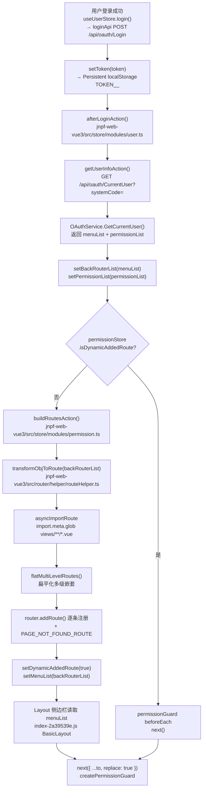
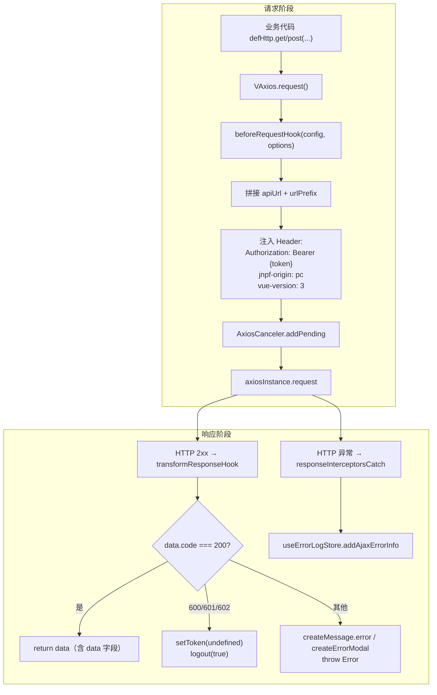
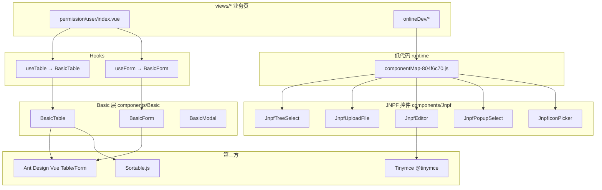

# 专项文档04 · Fruit+JNPF 低代码平台 — 应用前端架构深度解剖

> **适用源码**：JNPF v5.2（前端工程版本号 v3.6.0 为 package 标识，运行时对照 v5.2 后端）  
> **源码仓库**：`d:\JNPF-v52\backend`  
> **文档编号**：v52-arch-04  
> **文档版本**：v2.0-draft  
> **文档状态**：维护中  
> **批准日期**：2026-05-24  

> **产品名称**：智轩云（`jnpf-web-vue3`）  
> **前端源码**：[`jnpf-web-vue3/`](../../jnpf-web-vue3/)（正式工程，Git：`aplyhj/jnpfsoft-jnpf-jnpf-web-vue3-`）  
> **历史对照基线**：`web/dist_v1.1/`（主 bundle：`static/js/index-f8698ae9.js`）  
> **当前运行产物**：[`web/dist/`](../../web/dist/)（F4 部署；主 bundle：`static/js/index-b092e5f5.js`）  
> **收口记录**：[`05-frontend-source-merge-completion.md`](05-frontend-source-merge-completion.md) · OpenSpec [`frontend-align-dist-v1`](../../openspec/specs/frontend-align-dist-v1/spec.md)  
> **water 档案**：[`water-module-from-dist.md`](water-module-from-dist.md)（菜单已禁用，不补源码）  
> **生产 env**：[`jnpf-web-vue3/.env.production`](../../jnpf-web-vue3/.env.production)（`VITE_CDN=false`）；模板见 `.env.production.dist-v1.1.template`  
> **后端对照**：OAuth 菜单/权限由 `OAuthService.GetCurrentUser()` 一次返回，见 [`modularity/oauth/JNPF.OAuth/OAuthService.cs`](../../modularity/oauth/JNPF.OAuth/OAuthService.cs)

---

## 目录

- [第一章：前端工程架构](#第一章前端工程架构)
- [第二章：路由与鉴权体系](#第二章路由与鉴权体系)
- [第三章：HTTP 请求封装与 Token 管理](#第三章http-请求封装与-token-管理)
- [第四章：状态管理架构](#第四章状态管理架构)
- [第五章：公共组件体系](#第五章公共组件体系)
- [第六章：布局与主题系统](#第六章布局与主题系统)
- [第七章：源码合并收口索引（2026-05-22）](#第七章源码合并收口索引2026-05-22)

---

## 第一章：前端工程架构

### 1.1 前端项目结构全景图（图1-1）

**图1-1 · `jnpf-web-vue3/src/` 目录与职责（源码 + dist 双验证）**

```
jnpf-web-vue3/                    → 前端工程根（package.json v3.6.0）
├── vite.config.ts                → Vite 构建、chunk 命名、代理
├── .env / .env.production        → 环境变量；对齐 dist 见 .env.production.dist-v1.1.template
├── build/                        → postBuild → _app.config.js
├── src/
│   ├── api/                      → 后端 API（如 api/basic/user.ts → CurrentUser）
│   ├── assets/                   → 静态资源
│   ├── components/               → Basic* + Jnpf* 自研组件
│   ├── config/                   → 项目配置
│   ├── directives/               → permission.ts → v-auth
│   ├── enums/                    → ResultEnum、PageEnum、cacheEnum
│   ├── hooks/                    → useTable、useForm、usePermission
│   ├── layouts/default/          → LAYOUT / BasicLayout
│   ├── router/
│   │   ├── guard/permissionGuard.ts  → createPermissionGuard
│   │   └── helper/routeHelper.ts     → transformObjToRoute
│   ├── store/modules/            → user / permission / app / multipleTab
│   ├── utils/http/axios/         → VAxios、defHttp
│   ├── views/                    → 业务页（dist 多 water/ 定制，见 water-module-from-dist.md）
│   ├── main.ts                   → 入口
│   └── App.vue                   → 根组件
└── dist/                         → pnpm build 产出（对位 web/dist_v1.1/）
```

**bundle 中已验证的 `views/` 一级目录**

| 目录 | 典型页面 | 职责 |
|------|----------|------|
| `views/permission/` | 用户/角色/组织 | RBAC 管理 UI |
| `views/system/` | 菜单、日志、配置 | 系统管理 |
| `views/systemData/` | 字典、数据库连接 | 元数据管理 |
| `views/onlineDev/` | 在线表单/报表/门户 | 低代码运行时 |
| `views/workFlow/` | 流程设计/待办 | 工作流 |
| `views/generator/` | 代码生成向导 | 从表结构生成前后端 |
| `views/msgCenter/` | 消息/公告 | 消息中心 |
| `views/basic/` | error-log | 前端错误日志 |
| `views/common/` | dynamicModel 等 | 动态路由承载页 |
| `views/demo/` | 演示 | 源码有，dist 未打包 |
| **`views/water/`** | 区域/客户/缴费 | **仅 dist_v1.1 有**（9 页）；**当前菜单已禁用**，见 [`water-module-from-dist.md`](water-module-from-dist.md) |

**部署形态（本仓库 2026-05-22 收口后）**

```
web/dist/                         → 当前生产静态资源（F4 产物，1600 文件）
├── index.html                    → Vite 内联依赖（VITE_CDN=false，无 bootcdn）
├── _app.config.js                → 运行时 API/WS 地址
├── static/js/index-b092e5f5.js  → 主 bundle（路由/Store/HTTP/守卫）
└── static/css/                   → 编译后样式

web/dist_v1.1/                    → 历史对照基准（只读）
web/dist_v1.1_backup_20260522/    → F4 前完整备份
```

**历史 dist_v1.1 形态（CDN 外链，已不再用于生产 build）**

```
web/dist_v1.1/
├── index.html                    → 曾 CDN 外链 Vue/Router/Pinia/Axios + Vite 入口
├── _app.config.js                → 运行时 API/WS 地址（可部署后修改）
├── static/js/index-f8698ae9.js   → 主 bundle（路由/Store/HTTP/守卫）
├── static/js/componentMap-*.js   → 低代码控件映射表
├── static/js/useTable-*.js       → BasicTable + useTable
└── static/css/                   → 编译后样式
```

### 1.2 技术栈与版本（来自 `web/dist_v1.1/index.html`）

| 依赖 | 版本 | 加载方式 |
|------|------|----------|
| Vue | 3.3.4 | CDN external（`vue.global.prod.min.js`） |
| Vue Router | 4.2.5 | CDN external |
| Pinia | 2.1.7 | CDN external |
| Axios | 1.6.5 | CDN external |
| Day.js | 1.11.10 | CDN external |
| ECharts | 5.4.3 | CDN external |
| UI 框架 | Ant Design Vue | 打包进 bundle |
| 构建工具 | **Vite** | `type="module"` + `__vitePreload` + 暗黑主题插件 |
| 路由模式 | Hash | `createWebHashHistory()`（见 `flatMultiLevelRoutes`） |

### 1.3 构建配置分析

#### 1.3.1 Vite 关键点（`jnpf-web-vue3/vite.config.ts` + dist 对照）

| 机制 | 产物证据 | 推断配置 |
|------|----------|----------|
| 代码分割 | 数百个 `static/js/*.js` chunk | `build.rollupOptions.output.manualChunks` 按路由/模块拆分 |
| 动态 import | `__vitePreload(()=>import("./xxx.js"))` | 路由级 lazy load |
| CDN external | `index.html` 中 `<script src="cdn.../vue...">` | `build.rollupOptions.external` + `@rollup/plugin-external-globals` |
| 暗黑主题 | `__VITE_PLUGIN_THEME-ANTD_DARK_THEME_LINK__` | `vite-plugin-theme` 生成 alternate stylesheet |
| 路径别名 | bundle 内 `@/` 已编译为相对路径 | `resolve.alias: { '@': '/src' }` |

#### 1.3.2 代理与环境变量

**生产/部署环境变量**（当前：[`jnpf-web-vue3/.env.production`](../../jnpf-web-vue3/.env.production) `VITE_CDN=false`；运行时：[`web/dist/_app.config.js`](../../web/dist/_app.config.js)）

```javascript
window.__PRODUCTION__JNPF__CONF__ = {
  "VITE_GLOB_APP_TITLE": "智轩云",
  "VITE_GLOB_APP_SHORT_NAME": "jnpf",
  "VITE_GLOB_API_URL": "http://localhost:5000",
  "VITE_GLOB_WEBSOCKET_URL": "ws://localhost:5000",
  "VITE_GLOB_API_URL_PREFIX": ""
};
```

**开发代理**（`jnpf-web-vue3/vite.config.ts` → `server.proxy` + `.env.development`）：`/dev` 代理到 `http://localhost:5000`（对应 `JNPF.API.Entry`）。

**请求 URL 拼接**（`beforeRequestHook`，见第三章）：`joinPrefix` 为 true 时 `url = urlPrefix + url`；`apiUrl` 为非 HTTPS 绝对地址时 `url = apiUrl + url`。

#### 1.3.3 打包优化

| 策略 | 实现位置 | 说明 |
|------|----------|------|
| Tree Shaking | Vite/Rollup 默认 | 未引用模块不进入 bundle |
| 路由懒加载 | `asyncImportRoute` + `import.meta.glob('../../views/**/*.vue')` | 菜单页面按需加载 |
| CDN 外链 | `index.html` | Vue/Pinia/Router/Axios 不打入主包，减小体积 |
| 请求取消 | `AxiosCanceler` + pendingMap | 重复请求自动取消 |
| Keep-alive 缓存 | `useMultipleTabStore.cacheTabList` | 多 Tab 页组件缓存（第六章） |

### 本节核心表清单

| 表名 | 关联说明 |
|------|----------|
| **BASE_MODULE** | 菜单树数据源，经 `OAuthService.GetCurrentUser` → 前端 `backRouterList` |
| **BASE_SYS_CONFIG** | 系统配置，随 CurrentUser 响应 `sysConfigInfo` 写入 `useAppStore.projectConfig` |

### 本节关键代码路径索引

| 路径 | 说明 |
|------|------|
| `web/dist_v1.1/index.html` | 入口 HTML、CDN 依赖、暗黑模式初始化 |
| `web/dist_v1.1/_app.config.js` | 运行时 API 配置 |
| `web/dist_v1.1/static/js/index-f8698ae9.js` | 主 bundle |
| `jnpf-web-vue3/src/main.ts` | 应用 bootstrap |
| `jnpf-web-vue3/vite.config.ts` | 构建与 dev proxy |
| `jnpf-web-vue3/.env.production.dist-v1.1.template` | 与 dist_v1.1 对齐的生产 env |
| `docs/architecture/water-module-from-dist.md` | dist 独有 water 模块路径清单 |

---

## 第二章：路由与鉴权体系

### 2.1 动态路由注册全流程（图2-1）

**图2-1 · 登录后动态路由注册流程**



**与提示词差异说明**

| 提示词假设 | 本系统实际 |
|------------|------------|
| 单独 `getMenu` API | 菜单与权限在 **`GET /api/oauth/CurrentUser`** 一次返回 |
| `filterAsyncRouter` | 函数名为 **`transformObjToRoute`** |
| `permission.js` | 守卫函数 **`createPermissionGuard(router)`**（`jnpf-web-vue3/src/router/guard/permissionGuard.ts`） |
| Vuex | **Pinia**（`defineStore`） |

#### 2.1.1 菜单 type → 路由映射（`transformObjToRoute`）

| type | 含义 | path / component 规则 |
|------|------|-------------------------|
| 0 | 目录 | 递归 children，不生成路由 |
| 1 | 分类 | `path = '/' + enCode`，递归 children |
| 2 | 普通页面 | `path = '/' + urlAddress`，`component = urlAddress`（动态 import views） |
| 3 | 在线开发 | `component = ONLINE_MODEL`，meta.moduleId 来自 propertyJson |
| 4 | 在线字典 | `component = ONLINE_DICT` |
| 5 | 在线报表 | `component = ONLINE_REPORT` |
| 6 | 大屏 | 【待源码验证：DATA_V 或类似常量】 |
| 7 | 外链/iframe | iframe 或 external link 处理 |
| 8 | 门户 | `component = ONLINE_PORTAL` |

**源码片段 1 · 路由转换核心逻辑（反编译还原）**

```javascript
// web/dist_v1.1/static/js/index-f8698ae9.js
// transformObjToRoute(backRouterList) — 菜单 ModuleNodeOutput → Vue Router RouteRecord
function transformObjToRoute(menuTree) {
  let routes = [];
  function walk(nodes) {
    for (let i = 0; i < nodes.length; i++) {
      const node = nodes[i];
      const name = node.enCode.replace(/\./g, '-');
      if (node.type === 0 && node.hasChildren) walk(node.children);
      if (node.type === 1) {
        node.path = '/' + node.enCode;
        if (node.hasChildren) walk(node.children);
      }
      if (node.type === 2) {
        let addr = node.urlAddress.split('?')[0];
        node.path = '/' + node.urlAddress;
        routes.push({
          path: '/' + addr,
          component: addr,           // ★ 后续 asyncImportRoute 映射为 () => import('@/views/...')
          name,
          meta: { title: 'routes.' + name, defaultTitle: node.fullName, icon: node.icon, modelId: node.id }
        });
      }
      // type 3/4/5/8 → ONLINE_MODEL / ONLINE_DICT / ONLINE_REPORT / ONLINE_PORTAL
    }
  }
  walk(menuTree);
  return routes;
}
```

**源码片段 2 · 动态组件加载**

```javascript
// asyncImportRoute — import.meta.glob 预扫描 views 目录
function asyncImportRoute(routes) {
  dynamicViewsModules = dynamicViewsModules || Object.assign({
    "../../views/basic/error-log/DetailModal.vue": () => import("./DetailModal-....js"),
    "../../views/permission/user/index.vue": () => import("./index-....js"),
    // ... 数百个 vue 文件映射
  });
  routes.forEach(route => {
    if (!route.component) return;
    route.component = dynamicViewsModules[`../../views/${route.component}/index.vue`]
      || dynamicViewsModules[`../../views/${route.component}.vue`]
      || EXCEPTION_COMPONENT;
  });
}
```

**后端菜单来源（穿透到 Service）**

```csharp
// modularity/oauth/JNPF.OAuth/OAuthService.cs — GetCurrentUser()
loginOutput.menuList = (await _moduleService
    .GetUserModuleListByIds(type, sysId, noContainsMIdList, noContainsMUrlList))
    .ToTree("-1");
// 同时填充 permissionList（按钮权限 enCode 列表）
```

### 2.2 路由守卫深度分析

**入口**：`createPermissionGuard(router)` → `router.beforeEach(async (to, from, next) => {...})`

#### 2.2.1 白名单

```javascript
// whitePathList — 无需 Token 即可访问
const whitePathList = [
  LOGIN_PATH,              // /login
  SSO_PATH,                // /sso
  BASE_FORM_SHORT_LINK_PATH, // /formShortLink
  PRINT_DEV_H5             // /printDevH5
];
```

#### 2.2.2 守卫分支逻辑

| 条件 | 行为 | 函数 |
|------|------|------|
| `/workFlowDetail?token=` 且 token 变化 | `updateToken` + `next({ replace: true })` | `createPermissionGuard` |
| 路径在白名单 | 直接 `next()`；若在 `/login` 且已有 Token 则 `afterLoginAction()` | 同上 |
| 无 Token 且 `meta.ignoreAuth !== true` | 跳转 `/login?redirect=原路径` | 同上 |
| `getLastUpdateTime === 0` | 调用 `getUserInfoAction()` | `useUserStore` |
| `!isDynamicAddedRoute` | `buildRoutesAction()` → `addRoute` → `next({ replace: true })` | `usePermissionStore` |
| 已注册动态路由 | `next()` | — |

**源码片段 3 · 权限守卫（精简还原）**

```javascript
function createPermissionGuard(router) {
  const userStore = useUserStoreWithOut();
  const permissionStore = usePermissionStoreWithOut();
  router.beforeEach(async (to, from, next) => {
    const token = userStore.getToken;
    if (whitePathList.includes(to.path)) {
      if (to.path === LOGIN_PATH && token) {
        await userStore.afterLoginAction();
      }
      return next();
    }
    if (!token) {
      if (to.meta.ignoreAuth) return next();
      return next({ path: LOGIN_PATH, replace: true, query: { redirect: to.path } });
    }
    if (userStore.getLastUpdateTime === 0) {
      try { await userStore.getUserInfoAction(); }
      catch { return next(); }
    }
    if (permissionStore.getIsDynamicAddedRoute) return next();
    const routes = await permissionStore.buildRoutesAction();
    routes.forEach(r => router.addRoute(r));
    router.addRoute(PAGE_NOT_FOUND_ROUTE);
    permissionStore.setDynamicAddedRoute(true);
    next({ path: to.fullPath, replace: true, query: to.query });
  });
}
```

#### 2.2.3 Token 过期 / 无权限

| 场景 | 触发 | 前端行为 |
|------|------|----------|
| Token 失效 | 业务码 `600/601/602`（`ResultEnum.TOKEN_*`） | `setToken(undefined)` + `logout(true)` → 清缓存 + 跳登录 |
| HTTP 401 | Axios `responseInterceptorsCatch` | 记录 `useErrorLogStore.addAjaxErrorInfo`，按 errorMessageMode 弹窗/消息 |
| 无菜单权限 | `getUserInfoAction` 中 `menuList.length === 0` | `resetToken()` + `Promise.reject('您的权限不足，请联系管理员')` |
| 403 页面 | 静态路由 `PAGE_NOT_FOUND` / Exception 组件 | 【待源码验证：`views/basic/exception/403.vue`】 |

> **注意**：本系统业务层**不使用** HTTP 403 作为 Token 失效信号，而以 **`code === 600/601/602`** 为准（见第三章）。

#### 2.2.4 Keep-alive 与多 Tab 缓存

- Store：`useMultipleTabStore`（id: `app-multiple-tab`）
- `cacheTabList: Set<routeName>`：由已打开 Tab 的 `meta.ignoreKeepAlive !== true` 的路由 name 组成
- Layout 内容区 `<keep-alive :include="getCachedTabList">` 【待源码验证：`layouts/default/content/index.vue`】
- 关闭 Tab / 刷新页：`refreshPage()` 先从 `cacheTabList` 删除对应 name，再 `useRedo` 重载路由

### 2.3 权限指令

本系统使用 **`v-auth`**，而非 `v-permission`。

**注册**：`setupPermissionDirective(app)` → `app.directive('auth', authDirective)`

**检查逻辑**：

1. 读取指令值 `binding.value`（按钮 `enCode` 字符串）
2. 从当前路由 `route.meta.modelId` 取模块 ID
3. 调用 `hasBtnP(modelId, enCode)`：在 `useUserStore.permissionList` 中按 `modelId` 匹配，再比对 `button[].enCode`
4. 无权限则从 DOM **移除该元素**（`parentNode.removeChild`）

**源码片段 4 · v-auth 与 hasBtnP**

```javascript
function hasBtnP(modelId, enCode) {
  if (!enCode) return true;
  if (!modelId) return false;
  const list = useUserStoreWithOut().getPermissionList.filter(p => p.modelId === modelId);
  if (!list.length) return false;
  const buttons = list[0]?.button || [];
  return buttons.some(b => b.enCode === enCode);
}

function isAuth(el, binding, vnode) {
  const enCode = binding.value;
  const modelId = vnode.ctx.proxy.$route.meta.modelId || '';
  if (enCode && !hasBtnP(modelId, enCode)) {
    el.parentNode?.removeChild(el);
  }
}

const authDirective = { mounted: isAuth };
// 用法：<a-button v-auth="'btn_add'">新增</a-button>
```

**函数式替代**【待源码验证：`hooks/web/usePermission.ts`】：

```javascript
// usePermission().hasBtnP(modelId, enCode) — 与 v-auth 同源
// TableAction 中：filter(actions, a => hasBtnP(a.auth))
```

### 本节核心表清单

| 表名 | 字段/用途 |
|------|-----------|
| **BASE_MODULE** | Id, ParentId, EnCode, UrlAddress, Type, Icon — 菜单树节点 |
| **BASE_AUTHORIZE** | ObjectType, ObjectId, ItemType — 角色/用户与模块、按钮权限关系 |

### 本节关键代码路径索引

| 路径 | 类/函数 |
|------|---------|
| `web/dist_v1.1/static/js/index-f8698ae9.js` | `createPermissionGuard`、`transformObjToRoute`、`asyncImportRoute` |
| `jnpf-web-vue3/src/router/guard/permissionGuard.ts` | `createPermissionGuard` |
| `jnpf-web-vue3/src/router/helper/routeHelper.ts` | `transformObjToRoute`、`flatMultiLevelRoutes` |
| `modularity/oauth/JNPF.OAuth/OAuthService.cs` | `GetCurrentUser(string type, string systemCode)` |
| `modularity/oauth/JNPF.OAuth/Dto/CurrentUserOutput.cs` | `menuList`, `permissionList` |

---

## 第三章：HTTP 请求封装与 Token 管理

### 3.1 Axios 封装全景（图3-1）

**图3-1 · defHttp 请求/响应拦截流程**



**核心类**：`VAxios`（`web/dist_v1.1/static/js/index-f8698ae9.js`）  
**全局实例**：`defHttp`  
**Transform 配置**（`jnpf-web-vue3/src/utils/http/axios/index.ts`）

#### 3.1.1 请求拦截（beforeRequestHook + requestInterceptors）

**源码片段 5 · beforeRequestHook（URL 与参数）**

```javascript
beforeRequestHook: (config, options) => {
  const { apiUrl, joinPrefix, joinParamsToUrl, formatDate, urlPrefix } = options;
  if (joinPrefix) config.url = `${urlPrefix}${config.url}`;
  if (apiUrl && !/^https?:\/\//.test(config.url)) {
    config.url = `${apiUrl}${config.url}`;   // ★ 拼接 VITE_GLOB_API_URL
  }
  if (formatDate && config.data) formatRequestDate(config.data);
  // GET 参数 / POST 合并逻辑省略
  return config;
}
```

**源码片段 6 · requestInterceptors（Token 与自定义头）**

```javascript
requestInterceptors: (config, options) => {
  config.headers['jnpf-origin'] = 'pc';
  config.headers['vue-version'] = '3';
  const token = getToken();
  if (token && config.requestOptions?.withToken !== false) {
    const scheme = options.authenticationScheme; // 通常 "Bearer"
    config.headers.Authorization = scheme ? `${scheme} ${token}` : token;
  }
  return config;
}
```

> 租户标识：标准 JNPF 可在 Header 注入 `tenant-id`；【待源码验证：本 bundle 片段以 `jnpf-origin` 为主，多租户 Header 可能在其他版本开启】

#### 3.1.2 响应拦截（transformResponseHook）

**业务状态码枚举**：

```javascript
ResultEnum.SUCCESS = 200;
ResultEnum.TOKEN_TIMEOUT = 600;
ResultEnum.TOKEN_LOGGED = 601;   // 被踢下线
ResultEnum.TOKEN_ERROR = 602;
```

**源码片段 7 · transformResponseHook（完整逻辑还原）**

```javascript
transformResponseHook: (response, options) => {
  const { isTransformResponse, isReturnNativeResponse } = options;
  if (isReturnNativeResponse) return response;
  if (!isTransformResponse) return response.data;
  if (!response.data) throw new Error('apiRequestFailed');

  const { code, msg } = response.data;
  if (response.data && Reflect.has(response.data, 'code') && code === ResultEnum.SUCCESS) {
    return response.data;   // ★ 业务层拿到 { code, msg, data }
  }

  let errMsg = '';
  switch (code) {
    case ResultEnum.TOKEN_TIMEOUT:
    case ResultEnum.TOKEN_LOGGED:
    case ResultEnum.TOKEN_ERROR:
      errMsg = msg || t('sys.api.timeoutMessage');
      const userStore = useUserStoreWithOut();
      userStore.setToken(undefined);
      userStore.logout(true);   // ★ 清 Token + 跳登录
      break;
    default:
      errMsg = msg || t('sys.api.apiRequestFailed');
  }
  if (options.errorMessageMode === 'modal') {
    createErrorModal({ title: t('sys.api.errorTip'), content: errMsg });
  } else if (options.errorMessageMode === 'message') {
    createMessage.error(errMsg);
  }
  throw new Error(errMsg + JSON.stringify(response));
}
```

**源码片段 8 · responseInterceptorsCatch（网络/HTTP 错误）**

```javascript
responseInterceptorsCatch: (axiosInstance, error) => {
  useErrorLogStoreWithOut().addAjaxErrorInfo(error);
  const { response, code, message, config } = error || {};
  // 超时、网络错误、HTTP 4xx/5xx → i18n 提示 + checkStatus(response.status)
  return Promise.reject(error);
}
```

### 3.2 Token 管理

| 项 | 实现 |
|----|------|
| 存储键 | `TOKEN__`（`TOKEN_KEY`）、`USER__INFO__`、`PERMISSIONS__INFO__` |
| 存储介质 | `Persistent` 封装 → **localStorage**（默认）或 sessionStorage 【待源码验证：`src/settings/cacheSetting.ts`】 |
| 读取 | `getAuthCache(TOKEN_KEY)` / `useUserStore.getToken` |
| 写入 | 登录 `loginApi` 返回 `data.token` → `setToken` → `setAuthCache` |
| 过期检测 | **被动**：后端返回 `code 600/601/602` 触发 `logout`；无前端 JWT 解析倒计时 |
| 退出清理 | `logout()` → `doLogout GET /api/oauth/Logout` → `resetToken()` 清 store + `removeAuthCache` + `router.push(BASE_LOGIN)` |

**源码片段 9 · getUserInfoAction（Token 与菜单一次拉取）**

```javascript
async getUserInfoAction() {
  if (!this.getToken) return null;
  const res = await getUserInfo$1();  // GET /api/oauth/CurrentUser?systemCode=
  const { userInfo, sysConfigInfo, menuList = [], permissionList = [] } = res.data;
  if (!menuList.length) {
    this.resetToken();
    return Promise.reject('您的权限不足，请联系管理员');
  }
  this.setUserInfo(userInfo);
  this.setPermissionList(permissionList);
  this.setBackMenuList(menuList);
  this.setBackRouterList(menuList);
  useAppStore().setProjectConfig({ sysConfigInfo });
  return res.data;
}
```

**源码片段 10 · resetToken / logout**

```javascript
async logout(goLogin = false) {
  if (this.getToken) {
    try { await doLogout(); } catch (_) {}
  }
  this.resetToken();
  if (goLogin) router.push(PageEnum.BASE_LOGIN);
},
resetToken() {
  this.setToken(undefined);
  this.setSessionTimeout(false);
  this.setUserInfo(null);
  // permissionStore.resetState() 等在路由守卫下次进入时重建
}
```

### 本节核心表清单

| 表名 | 说明 |
|------|------|
| **BASE_USER** | 登录账号；Token Claims 关联 userId |
| **BASE_SYS_CONFIG** | 登录后 `sysConfigInfo` 写入前端 `projectConfig` |

### 本节关键代码路径索引

| 路径 | 说明 |
|------|------|
| `web/dist_v1.1/static/js/index-f8698ae9.js` | `VAxios`、`defHttp`、`ResultEnum`、transform 钩子 |
| `jnpf-web-vue3/src/utils/http/axios/index.ts` | defHttp 实例化与默认 options |
| `jnpf-web-vue3/src/utils/cache/persistent.ts` | `getAuthCache` / `setAuthCache` |
| `modularity/oauth/JNPF.OAuth/OAuthService.cs` | `Login`、`Logout`、`GetCurrentUser` |

---

## 第四章：状态管理架构

### 4.1 Pinia Store 模块清单

| 模块名 | Store ID | 源码路径 | 核心 state | 核心 actions | 职责 |
|--------|----------|------------------------|------------|--------------|------|
| user | `app-user` | `jnpf-web-vue3/src/store/modules/user.ts` | token, userInfo, permissionList, backMenuList, backRouterList, sessionTimeout, lastUpdateTime | login, logout, getUserInfoAction, afterLoginAction, setToken | 登录态、用户、菜单原始数据 |
| permission | `app-permission` | `jnpf-web-vue3/src/store/modules/permission.ts` | isDynamicAddedRoute, menuList, lastBuildMenuTime | buildRoutesAction, setMenuList, setDynamicAddedRoute, resetState | 动态路由构建、侧边栏菜单 |
| app | `app` | `jnpf-web-vue3/src/store/modules/app.ts` | darkMode, pageLoading, projectConfig, beforeMiniInfo | setDarkMode, setProjectConfig, setPageLoading | 主题、布局配置、系统配置缓存 |
| multipleTab | `app-multiple-tab` | `jnpf-web-vue3/src/store/modules/multipleTab.ts` | tabList, cacheTabList, lastDragEndIndex | addTab, closeTab, refreshPage, updateCacheTab | 多 Tab 标签页 |
| locale | `app-locale` | `jnpf-web-vue3/src/store/modules/locale.ts` | localInfo | setLocaleInfo | 国际化 |
| base | `app-base` | `jnpf-web-vue3/src/store/modules/base.ts` | dictionaryList | getDictionaryAll, setDictionaryList | 全局字典缓存 |
| generator | `app-generator` | `jnpf-web-vue3/src/store/modules/generator.ts` | hasTable, subTable, allTable, formItemList | — | 代码生成/在线开发设计器状态 |
| errorLog | `app-error-log` | `jnpf-web-vue3/src/store/modules/errorLog.ts` | errorLogInfoList | addErrorLogInfo, addAjaxErrorInfo | 前端错误与 Ajax 错误收集 |
| organize | `app-organize` | `jnpf-web-vue3/src/store/modules/organize.ts` | — | resetState | 组织选择器缓存（登录时 reset） |

> **说明**：本系统使用 **Pinia**，非 Vuex。无 `tagsView` 模块名，多 Tab 能力由 **`useMultipleTabStore`** 承担。

### 4.2 关键 Store 深度分析

#### 4.2.1 user 模块

| 字段/方法 | 说明 |
|-----------|------|
| `getToken` | 优先内存 token，fallback `getAuthCache(TOKEN_KEY)` |
| `getPermissionList` | 按钮权限树：`[{ modelId, button: [{ enCode }] }]` |
| `getBackRouterList` | 后端 `menuList` 原样副本，供 `transformObjToRoute` |
| `login(params)` | `loginApi` → `setToken` → `afterLoginAction` |
| `getLastUpdateTime` | 为 0 时守卫触发重新 `getUserInfoAction` |

#### 4.2.2 permission 模块

**buildRoutesAction 流程**：

```javascript
async buildRoutesAction() {
  const userStore = useUserStore();
  const routerList = toRaw(userStore.getBackRouterList);
  let routes = transformObjToRoute(routerList);
  let result = [PAGE_NOT_FOUND_ROUTE, ...routes];
  this.setMenuList(routerList);          // ★ 侧边栏仍用原始树形 menuList
  routes = flatMultiLevelRoutes(routes);
  result.push(ERROR_LOG_ROUTE);
  patchAffix(result);                    // 标记首页 affix Tab
  return result;
}
```

#### 4.2.3 app 模块

| getter | 来源 |
|--------|------|
| `getMenuSetting` | `projectConfig.menuSetting` — 侧边栏折叠、宽度、主题色 |
| `getHeaderSetting` | 顶栏固定、面包屑 |
| `getMultiTabsSetting` | 是否显示 Tab 栏、是否缓存 |
| `getDarkMode` | `darkMode` 或 `localStorage.__APP__DARK__MODE__` |
| `getSysConfigInfo` | 登录后后端系统配置 |

#### 4.2.4 multipleTab 模块（等价 tagsView）

| 能力 | 方法 |
|------|------|
| 打开 Tab | `addTab(route)` → `updateCacheTab()` |
| 关闭 Tab | `closeTab(route, router)` |
| 刷新 | `refreshPage(router)` — 临时移出 keep-alive |
| 缓存列表 | `cacheTabList: Set<RouteRecordName>` |

**源码片段 11 · updateCacheTab**

```javascript
async updateCacheTab() {
  const cache = new Set();
  for (const tab of this.tabList) {
    const route = getRawRoute(tab);
    if (route.meta?.ignoreKeepAlive) continue;
    cache.add(route.name);
  }
  this.cacheTabList = cache;
}
```

### 本节核心表清单

| 表名 | Store 消费方式 |
|------|----------------|
| **BASE_USER** | `userInfo` ← CurrentUser |
| **BASE_MODULE** | `backMenuList` / `menuList` ← CurrentUser.menuList |
| **BASE_AUTHORIZE** | `permissionList` ← CurrentUser |
| **BASE_DICTIONARY_*** | `useBaseStore.dictionaryList` ← getDictionaryAll API |

### 本节关键代码路径索引

| 路径 | Store |
|------|-------|
| `web/dist_v1.1/static/js/index-f8698ae9.js` | 全部 defineStore 定义 |
| `jnpf-web-vue3/src/store/modules/user.ts` | useUserStore |
| `jnpf-web-vue3/src/store/modules/permission.ts` | usePermissionStore |
| `jnpf-web-vue3/src/store/modules/multipleTab.ts` | useMultipleTabStore |

---

## 第五章：公共组件体系

### 5.1 自研公共组件清单（图5-1）

**图5-1 · 公共组件分层依赖**



**componentMap 已注册 JNPF 控件（`componentMap-804f6c70.js`）**

| 组件名 | 功能 | 第三方依赖 |
|--------|------|------------|
| JnpfInput / Textarea / InputNumber | 文本输入 | Ant Design Vue Input |
| JnpfSelect / Radio / Checkbox / Switch | 选择类 | Ant Design Vue |
| JnpfDatePicker / TimePicker / DateRange | 日期时间 | Day.js |
| **JnpfTreeSelect** | 树形选择 | Ant Design Vue TreeSelect |
| **JnpfUploadFile / UploadImg** | 文件/图片上传 | 自定义 + `POST /api/file` |
| **JnpfEditor** | 富文本 | Tinymce |
| **JnpfIconPicker** | 图标选择 | iconfont + ym-custom |
| **JnpfPopupSelect / PopupTableSelect** | 弹窗选择 | BasicModal + Table |
| JnpfOrganizeSelect / UserSelect / RoleSelect | 组织/用户/角色 | 各对应 API |
| JnpfRelationForm | 关联表单 | 在线开发 runtime |
| JnpfBarcode / Qrcode / Sign | 条码/二维码/签章 | 专用库 |

**Basic 层组件**

| 组件 | 路径 | 功能 |
|------|------|------|
| BasicTable | `jnpf-web-vue3/src/components/Table/src/BasicTable.vue` | 列表 + 分页 + 可编辑单元格 |
| BasicForm | `jnpf-web-vue3/src/components/Form/src/BasicForm.vue` | Schema 驱动表单 |
| BasicModal | `jnpf-web-vue3/src/components/Modal/src/BasicModal.vue` | 统一弹窗壳 |

### 5.2 核心公共组件深度分析

#### 5.2.1 BasicTable / useTable

**Props 清单（`nn` 对象，`useTable-797e8cec.js`）**

| Prop | 类型 | 默认 | 说明 |
|------|------|------|------|
| api | Function | null | 列表数据 API，签名 `(params) => Promise<{ data: { list, pagination } }>` |
| columns | Array | [] | 列定义（title, dataIndex, auth, edit, format） |
| pagination | Object/boolean | null | 分页；false 关闭 |
| fetchSetting | Object | componentSetting.table.fetchSetting | pageField/sizeField/listField/totalField |
| useSearchForm | boolean | — | 是否内嵌 BasicForm 搜索区 |
| formConfig | Object | null | 搜索表单 schema |
| rowKey | string/Function | '' | 行键；autoCreateKey 时自动生成 id |
| actionColumn | Object | null | 操作列 |
| beforeFetch / afterFetch | Function | null | 请求前/后钩子 |
| immediate | boolean | true | mounted 后是否立即 fetch |

**Events**：`fetch-success`, `fetch-error`, `selection-change`, `row-click`, `edit-end`, `columns-change`, `register`

**分页与请求参数组装**（`useDataSource.fetch`）：

```javascript
// 合并：分页 + searchForm + searchInfo + sortInfo + filterInfo
let params = merge(
  { [pageField]: currentPage, [sizeField]: pageSize },
  useSearchForm ? getFieldsValue() : {},
  searchInfo,
  sortInfo,
  filterInfo
);
if (beforeFetch) params = await beforeFetch(params) || params;
const res = await api(params);
let list = get(res.data, listField);
const total = get(res.data, totalField);
setPagination({ total });
tableData.value = list;
```

**使用页面**：几乎所有 `views/permission/*`、`views/system/*` 列表页。

**源码片段 12 · useTable 注册模式**

```javascript
// 页面中
const [registerTable, { reload, getForm }] = useTable({
  api: getUserList,
  columns,
  useSearchForm: true,
  formConfig: { schemas: searchSchemas },
});
// template: <BasicTable @register="registerTable" />
```

#### 5.2.2 BasicForm / useForm

| Prop | 说明 |
|------|------|
| schemas | 表单项数组（field, component, componentProps, rules） |
| labelWidth / layout | 布局 |
| showActionButtonGroup | 提交/重置按钮 |

- 动态渲染：`component` 字段映射到 `componentMap` 或 Ant Design 组件
- 校验：Ant Design Vue Form `rules` + asyncValidator
- `useForm` 返回 `[register, methods]`，methods 含 `validate`, `setFieldsValue`, `updateSchema`

**使用页面**：列表页搜索区、各模块 Form 弹窗。

#### 5.2.3 JnpfTreeSelect

| 项 | 说明 |
|----|------|
| Props | `options` / `api` 加载树、`fieldNames`、`multiple`、`checkStrictly` 【待源码验证：具体 props 名】 |
| 数据加载 | 字典/组织树调用对应 `GET /api/permission/Organize/Tree` 等 |
| 懒加载 | 大数据树可通过 `loadData` 异步展开 【待源码验证】 |
| 使用 | 在线开发设计器 + 组织/菜单选择表单 |

#### 5.2.4 JnpfUploadFile

| 项 | 说明 |
|----|------|
| 上传 | `defHttp.uploadFile` → `multipart/form-data` |
| 后端 | `FileService` / `POST /api/file/Uploader` 【见 02-application-services.md】 |
| 限制 | `accept`、`fileSize` 由 componentProps 传入 |
| 进度 | Axios `onUploadProgress` 【待源码验证】 |

#### 5.2.5 JnpfIconPicker

- 读取 `/fonts/ym/iconfont.css`、`ym-custom` 图标集
- 选择结果写入表单 field（图标 class 名）
- 用于 **BASE_MODULE.Icon** 菜单图标配置 UI

#### 5.2.6 JnpfEditor（富文本）

- 基于 **Tinymce** 封装
- 图片上传走统一文件 API
- 用于公告、在线开发文本控件

#### 5.2.7 JnpfPopupSelect（弹窗选择）

- 组合 **BasicModal + BasicTable**
- Props：`interfaceId` / `columnOptions` / `relationField` 【待源码验证】
- 用于关联表单、弹窗列表选行

#### 5.2.8 BasicModal

- 封装 Ant Design Vue Modal
- 支持 `useModalInner` / `@register` 模式
- 在线开发、代码生成、系统管理弹窗统一使用

### 本节核心表清单

| 表名 | 组件关联 |
|------|----------|
| **BASE_MODULE** | JnpfIconPicker 配置菜单 Icon |
| **BASE_DICTIONARY_DATA** | JnpfSelect / TreeSelect 选项来源 |
| **BASE_FILE** | JnpfUploadFile 上传记录 |

### 本节关键代码路径索引

| 路径 | 组件 |
|------|------|
| `web/dist_v1.1/static/js/useTable-797e8cec.js` | BasicTable、useTable、TableAction |
| `web/dist_v1.1/static/js/useForm-0edeb309.js` | BasicForm、useForm |
| `web/dist_v1.1/static/js/index-192494da.js` | BasicModal |
| `web/dist_v1.1/static/js/componentMap-804f6c70.js` | 低代码 componentMap |
| `jnpf-web-vue3/src/components/Jnpf/` | 全部 Jnpf* 控件源码 |

---

## 第六章：布局与主题系统

### 6.1 Layout 布局组件

**异步入口**：`LAYOUT` — `jnpf-web-vue3/src/layouts/default/index.vue`（dist chunk：`index-2a39539e.js`）

**结构（Ant Design Vue Layout 组合）**

```
┌─────────────────────────────────────────────────────────┐
│ Sidebar (Sider)          │ Header (顶栏)                │
│ - Logo                   │ - 折叠按钮 / 面包屑           │
│ - 菜单 Menu              │ - 用户下拉 / 全屏 / 语言       │
│ (menuList from store)    ├──────────────────────────────┤
│                          │ MultipleTabs (标签页栏)       │
│                          ├──────────────────────────────┤
│                          │ Content + keep-alive          │
│                          │   └ RouterView                │
└─────────────────────────────────────────────────────────┘
```

| 机制 | 实现 |
|------|------|
| 侧边栏折叠 | `useAppStore.getMenuSetting.collapsed` + `setMenuSetting` |
| 响应式 | `beforeMiniInfo` 记录断点前的 collapsed；宽度 `< 992px` 自动折叠 【待源码验证：`AppBreakpoint`】 |
| 固定顶栏/侧栏 | `headerSetting.fixed`、`menuSetting.fixed` |
| 全屏内容 | `useFullContent` hook |

**源码片段 13 · BasicLayout（Ant Design Vue 封装）**

```javascript
// BasicLayout — 提供 SiderHookProviderKey，子 Sider 注册到 layout
const BasicLayout = defineComponent({
  props: basicProps(),
  setup(props, { slots }) {
    provide(SiderHookProviderKey, { addSider, removeSider });
    return () => h(props.tagName, { class: layoutClass }, slots);
  }
});
```

### 6.2 主题系统

| 能力 | 实现 |
|------|------|
| 主色 | Ant Design Vue `ConfigProvider` + `projectConfig.themeColor` 【待源码验证】 |
| CSS 变量 | Less modifyVars / CSS Variables 【待源码验证：`build/generate/generateModifyVars.ts`】 |
| 暗黑模式 | `localStorage.__APP__DARK__MODE__`；`index.html` 启动脚本设置 `htmlRoot[data-theme]` |
| 暗黑样式 | 备用 stylesheet `#__VITE_PLUGIN_THEME-ANTD_DARK_THEME_LINK__` |
| 切换 | `useAppStore.setDarkMode(mode)` + `updateDarkTheme()` |

**index.html 暗黑初始化（已验证）**

```javascript
var theme = window.localStorage.getItem('__APP__DARK__MODE__');
if (htmlRoot && theme) {
  htmlRoot.setAttribute('data-theme', theme);
}
```

### 本节核心表清单

| 表名 | 说明 |
|------|------|
| **BASE_SYS_CONFIG** | 系统名称、Logo 等通过 `sysConfigInfo` 影响 Layout 展示 |

### 本节关键代码路径索引

| 路径 | 说明 |
|------|------|
| `web/dist_v1.1/static/js/index-2a39539e.js` | 默认 Layout  chunk |
| `web/dist_v1.1/index.html` | 暗黑模式初始化 |
| `jnpf-web-vue3/src/layouts/default/` | Layout 组件树 |
| `jnpf-web-vue3/src/logics/theme/` | 主题切换逻辑 |
| `jnpf-web-vue3/build/generate/generateModifyVars.ts` | Less 主题变量 |

---

## 第七章：源码合并收口索引（2026-05-22）

> 完整收口叙事、GAP 表、登录修复源码见 **[`05-frontend-source-merge-completion.md`](05-frontend-source-merge-completion.md)**；OpenSpec 能力规格见 [`openspec/specs/frontend-align-dist-v1/spec.md`](../../openspec/specs/frontend-align-dist-v1/spec.md)。

| 主题 | 结论 | 文档/路径 |
|------|------|-----------|
| F4 部署 | `web/dist/` 为新运行产物 | `05-frontend-source-merge-completion.md` §2 |
| GAP-01 water | 菜单禁用，不补 `views/water/` | `water-module-from-dist.md` §4 |
| GAP-03 | `CustomBatchForm` / `ExtendForm` 已补 | `jnpf-web-vue3/src/views/common/dynamicModel/list/` |
| CDN | `VITE_CDN=false` | `.env.production` |
| 登录 | `jnpf_ticket` 空值 + UA 空值已修复 | `OAuthService.Login` · `UserAgent.RawValue` · `LoginForm.vue` |
| Backlog | UI-01 演示平台 · GAP-02 printDevH5 | OpenSpec spec §GAP final status |

### 本节核心表清单

| 表名 | 用途 |
|------|------|
| **BASE_MODULE** | water 菜单 `F_ENABLED_MARK=0` |
| **BASE_USER** | 登录账号与密码链 |

### 本节关键代码路径索引

| 路径 | 说明 |
|------|------|
| [`05-frontend-source-merge-completion.md`](05-frontend-source-merge-completion.md) | 收口主文档 |
| [`openspec/specs/frontend-align-dist-v1/spec.md`](../../openspec/specs/frontend-align-dist-v1/spec.md) | 知识库 Requirements |
| `web/dist/` | 当前生产静态资源 |

---

## 附录 A · 核心代码片段索引（≥12 处）

| 编号 | 主题 | 位置 |
|------|------|------|
| 1 | transformObjToRoute | 第二章 §2.1 |
| 2 | asyncImportRoute | 第二章 §2.1 |
| 3 | createPermissionGuard | 第二章 §2.2 |
| 4 | v-auth / hasBtnP | 第二章 §2.3 |
| 5 | beforeRequestHook | 第三章 §3.1 |
| 6 | requestInterceptors | 第三章 §3.1 |
| 7 | transformResponseHook | 第三章 §3.1 |
| 8 | responseInterceptorsCatch | 第三章 §3.1 |
| 9 | getUserInfoAction | 第三章 §3.2 |
| 10 | resetToken / logout | 第三章 §3.2 |
| 11 | updateCacheTab | 第四章 §4.2 |
| 12 | useTable 注册 | 第五章 §5.2 |
| 13 | BasicLayout | 第六章 §6.1 |

## 附录 B · 与提示词对照修正表

| 提示词术语 | 本系统实际 |
|------------|------------|
| Vuex | **Pinia** |
| permission.js | **`createPermissionGuard`** |
| filterAsyncRouter | **`transformObjToRoute`** |
| getMenu API | **`GET /api/oauth/CurrentUser`** |
| v-permission | **`v-auth`** + `hasBtnP(modelId, enCode)` |
| checkPermission | **`hasBtnP`** / `usePermission` hook |
| request.js | **`VAxios` + `defHttp`**（`utils/http/axios/index.ts`） |
| HTTP 401 业务码 | **`600/601/602`**（ResultEnum.TOKEN_*） |
| tagsView | **`useMultipleTabStore`** |

## 附录 C · 深度自检（ARCHITECTURE_DOC_RULES）

- [x] 穿透原则：路由/HTTP/Store 均标注 bundle 函数名 + 后端 `OAuthService.GetCurrentUser`
- [x] 数据锚定：每章含 BASE_MODULE / BASE_USER / BASE_AUTHORIZE 等表
- [x] 图表强制：图1-1 结构树、图2-1 动态路由、图3-1 Axios、图5-1 组件依赖
- [x] 可验证：历史对照 `web/dist_v1.1/`；当前产物 `web/dist/`；源码 `jnpf-web-vue3/`
- [x] 禁止空泛：机制均落到函数名与参数
- [x] 核心片段 ≥ 12 处
- [x] 收口索引：第七章 → 文档05 + OpenSpec

---

**文档维护**：water 处置见 [`water-module-from-dist.md`](water-module-from-dist.md)；收口见 [`05-frontend-source-merge-completion.md`](05-frontend-source-merge-completion.md)；生产构建 `VITE_CDN=false`。
