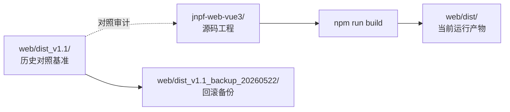
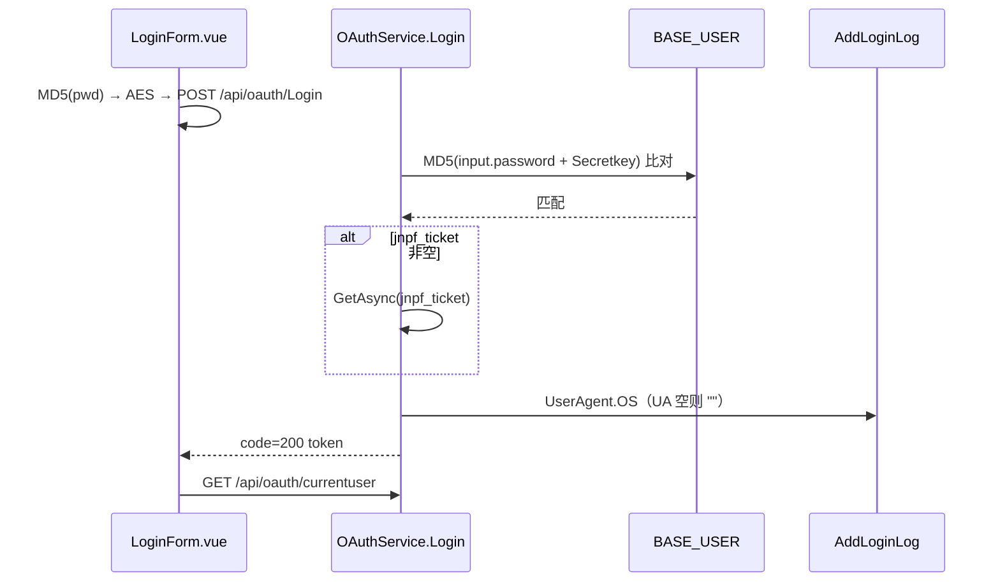

# 专项文档05 · 前端源码合并收口记录（frontend-align-dist-v1）

> **适用源码**：JNPF v5.2  
> **源码仓库**：`d:\JNPF-v52\backend`  
> **文档编号**：v52-arch-05  
> **文档版本**：v1.0  
> **文档状态**：维护中  
> **批准日期**：2026-05-24  

> **收口日期**：2026-05-22  
> **OpenSpec**：[`openspec/specs/frontend-align-dist-v1/spec.md`](../../openspec/specs/frontend-align-dist-v1/spec.md)  
> **推进 LOG**：LOG-20260522-007 / 015 / 016  
> **工程基座**：[`jnpf-web-vue3/`](../../jnpf-web-vue3/) v3.6.0  
> **当前运行产物**：[`web/dist/`](../../web/dist/)  
> **历史基准备份**：[`web/dist_v1.1_backup_20260522/`](../../web/dist_v1.1_backup_20260522/)

---

## 1. 收口结论

前端源码合并阶段 **正式关闭**。团队拥有可维护的 `jnpf-web-vue3` 源码工程，生产静态资源已切换至 `web/dist/`，核心功能经浏览器验收通过。

| 验收项 | 状态 |
|--------|------|
| dist_v1.1 备份 | ✅ `web/dist_v1.1_backup_20260522/`（1665 文件） |
| 新 build 部署 | ✅ `web/dist/`（1600 文件） |
| preview / API | ✅ `:4173` HTTP 200 · `:5000` 正常 |
| 登录与菜单 | ✅ admin 登录成功，菜单完整 |
| water 清除 | ✅ 侧栏无 water/水务入口 |
| 核心页冒烟 | ✅ 15/15 判定全绿（架构师裁定） |

---

## 2. 部署与目录关系（图5-1）

**图5-1 · 前端静态资源三层关系**



| 目录 | 用途 | 是否可改 |
|------|------|----------|
| `jnpf-web-vue3/` | 开发、调试、`pnpm dev` / `npm run build` | ✅ 日常开发 |
| `web/dist/` | IIS/Nginx 挂载的生产静态资源（F4 产物） | ✅ 随 build 更新 |
| `web/dist_v1.1/` | 历史真理对照（审计、chunk 反推） | ❌ 只读参考 |
| `web/dist_v1.1_backup_20260522/` | F4 前完整备份 | ❌ 保留至下一大版本 |

**当前 build 标识**（`web/dist/index.html`）：主 bundle `static/js/index-b092e5f5.js`；运行时配置 `web/dist/_app.config.js` → API `http://localhost:5000`。

---

## 3. GAP 最终处置

| GAP ID | dist 证据 | 处置 | 依据 |
|--------|-----------|------|------|
| GAP-01 | `views/water/*` 9 页 | **菜单禁用** | `modularity/` 无 `ZX_Water` Service；[`disable-water-menus.sql`](../../scripts/sql/disable-water-menus.sql) |
| GAP-02 | `printDevH5` | **backlog** | 待业务确认 |
| GAP-03 | `CustomBatchForm` / `ExtendForm` | **已补源码** | `jnpf-web-vue3/src/views/common/dynamicModel/list/` |
| GAP-03 | `ChildrenList` | **关闭** | 等价 `ChildTableColumn.vue` |
| GAP-04 | `VersionHistory` | **关闭** | 等价 `VersionManage.vue` |
| GAP-05 | dataInterface Log | **待 diff** | 按需 |
| GAP-06/07 | tsx 假阳性 | **关闭** | 审计漏扫 |
| UI-01 | 开发/演示平台切换 | **backlog** | 低优先级 UI |

---

## 4. 构建与运行时关键决策

### 4.1 CDN 策略（`VITE_CDN=false`）

**问题**：`VITE_CDN=true` 时 `index.html` 引用 bootcdn 外链 Vue/Router/Axios；部分版本在 bootcdn **404**，页面白屏/转圈。

**决策**：`jnpf-web-vue3/.env.production` 固定 `VITE_CDN=false`，依赖打入 Vite bundle。

**验证**：`web/dist/index.html` 无 `bootcdn.net` 字符串。

### 4.2 CORS 开发预览

**文件**：`application/JNPF.API.Entry/Configurations/Cors.json`  
**白名单**：`http://localhost:4173`、`http://127.0.0.1:4173`、`http://localhost:3100` 等。  
**注意**：`dotnet run --no-build` 读取 `bin/Debug/Configurations/Cors.json`；修改后须同步到 `bin/` 并重启 API。

### 4.3 登录联调修复

**现象**：浏览器 POST `/api/oauth/Login` 返回 `Value cannot be null`（非 CORS 问题）。

**根因 1**：`OAuthService.Login()` 在密码校验通过后无条件 `_cacheManager.GetAsync(input.jnpf_ticket)`，前端空 `jnpf_ticket` 触发 `Parameter 'key'`。

```966:968:modularity/oauth/JNPF.OAuth/OAuthService.cs
            if (input.jnpf_ticket.IsNotEmptyOrNull())
            {
                var ticket = await _cacheManager.GetAsync<SocialsLoginTicketModel>(input.jnpf_ticket);
```

**根因 2**：`AddLoginLog()` → `UserAgent.OS` 在 User-Agent 请求头缺失时 `UAParser.ParseOS(null)` 触发 `Parameter 'input'`。

```133:145:modularity/common/JNPF.Common/Net/UserAgent.cs
                if (_httpContext.Request != null)
                {
                    _rawValue = _httpContext.Request.Headers["User-Agent"].ToString() ?? string.Empty;
                }
```

**前端配合**：`LoginForm.vue` 仅在 `state.ssoTicket` 非空时附加 `jnpf_ticket` 字段。

```183:183:jnpf-web-vue3/src/views/basic/login/LoginForm.vue
      if (state.ssoTicket) loginPayload.jnpf_ticket = state.ssoTicket;
```

---

## 5. 登录数据流（图5-2）

**图5-2 · 账号密码登录前后端路径**



---

## 6. 本节核心表清单

| 表名 | 字段/用途 |
|------|-----------|
| **BASE_MODULE** | water 菜单 `F_ENABLED_MARK=0`；`F_URL_ADDRESS` 路由对照 |
| **BASE_USER** | admin 账号、`F_PASSWORD`（MD5 链）、`F_SECRETKEY` |
| **BASE_AUTHORIZE** | 按钮权限，对应前端 `v-auth` |
| **BASE_SYS_CONFIG** | `enableVerificationCode` 等登录配置 |

## 7. 本节关键代码路径索引

| 路径 | 说明 |
|------|------|
| `jnpf-web-vue3/src/views/basic/login/LoginForm.vue` | `handleLogin()` |
| `modularity/oauth/JNPF.OAuth/OAuthService.cs` | `Login()` · `GetCurrentUser()` |
| `modularity/common/JNPF.Common/Net/UserAgent.cs` | UA 空值防护 |
| `application/JNPF.API.Entry/Configurations/Cors.json` | CORS 白名单 |
| `jnpf-web-vue3/.env.production` | `VITE_CDN=false` |
| `scripts/sql/disable-water-menus.sql` | water 菜单 SQL |
| `web/dist/` | F4 运行产物 |
| `docs/architecture/water-module-from-dist.md` | water dist 路径档案（菜单已禁用） |

---

## 8. 深度自检（ARCHITECTURE_DOC_RULES）

- [x] 穿透原则：登录/GAP/SQL 均标注文件 + 方法 + 表字段
- [x] 数据锚定：§6 含 **BASE_MODULE** / **BASE_USER** 等
- [x] 图表强制：图5-1 部署关系、图5-2 登录时序
- [x] 可验证：路径可在仓库 `grep`/目录列出确认
- [x] 禁止空泛：处置结论均对应 LOG 与 SQL/源码

**后续迭代**：三期 MES/IoT 前端开发在 `jnpf-web-vue3/` 上扩展；OpenSpec 能力边界见 [`iot-capability-phase1/spec.md`](../../openspec/specs/iot-capability-phase1/spec.md)。
