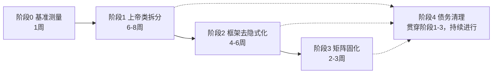
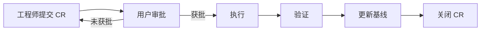

# JNPF5 后端模块化重构施工包 v2.0

> **文档性质**：施工指令（可直接执行）
> **生效日期**：2026-08-19
> **依据**：阶段 0 实测诊断报告 · 模块依赖矩阵（794 条边）· Common.Core 类型统计（50 类型）· 仓库 AGENTS.md 铁律
> **总纲**：先量后拆，先排雷再动刀；保留动态 API 和 SqlSugar，用测试固化边界。
>
> **版本变更日志**
> | 版本 | 日期 | 变更 |
> |------|------|------|
> | v2.0 | 2026-08-19 | 决策者签发首版施工指令 |

---

## 〇、不可变约束（四不做）

以下约束为宪法级红线，贯穿所有阶段，任何 CR 不得违反：

| 约束 | 内容 | 理由 |
|------|------|------|
| **D5-1** | 不替换/引入新框架（不换 ABP、不卸载 vendored Furion） | 源码已 vendor，无包可卸；引入新巨框架 ROI 为负 |
| **D5-2** | 不替换 ORM（保留 SqlSugar 生态） | 多租户硬门 `ITenantFilter`、防注入 `SqlSugarFilterable`、IR 投影链均建于 SqlSugar |
| **D5-3** | 不新建目录树（禁止 `JNPF5.Backend/src/...` 式全新结构） | 72 个 csproj 无法搬迁而保持可运行，违反绞杀者原则 |
| **D5-4** | 不回归显式 Controller（保留 `IDynamicApiController`） | 仓库铁律 "Never write Controllers"；155 个 Service 路由契约绑定前端三端 |

⚠️ 若未来业务需要突破以上约束，必须由用户显式废止对应条款并修订 AGENTS.md，工程师无权自行绕过。

---

## 一、施工总览与里程碑



**图 1-1 里程碑依赖图**

| 阶段 | 名称 | 周期 | 核心目标 | 前置依赖 | 关键产出 |
|-----|------|------|---------|---------|---------|
| 0 | 性能基准与度量闭环 | 1 周 | 证明/证伪「启动慢」；依赖扫描入 CI | 无 | `performance-baseline.md` |
| 1 | 上帝类拆分（战役 1） | 6-8 周 | 拆分 69 个 >500 行文件，消除 Service 塌缩 | 阶段 0 完成 | 前 5 个上帝类 <800 行 |
| 2 | 框架去隐式化 + Common.Core 治理 | 4-6 周 | 显式模块注册；解除内核反向依赖 | 阶段 1 完成 ≥50% | 反向依赖 = 0 |
| 3 | 架构依赖矩阵固化 | 2-3 周 | 扩展 ARCH-01，PR 门禁强制 | 阶段 2 完成 | 新违规无法合并 |
| 4 | 债务清理与收尾 | 持续 | 修复 F1/F3 等已知缺陷 | 阶段 1-3 进行中 | 缺陷清单清零 |

---

## 二、阶段 0：性能基准与度量闭环（1 周）

### 2.1 目标

用数据回答「启动慢是否是真问题」，建立后续所有优化的判定基准。

### 2.2 任务清单

| 任务 | 产出物 | 完成标准 |
|------|--------|---------|
| 0-1 | 创建 BenchmarkDotNet 工程（或等效脚本）`tests/JNPF.Tests.Benchmark/` | 可 `dotnet run` 一键执行 |
| 0-2 | 测量冷启动时间（进程启动 → Kestrel 监听） | ≥5 次取中位数，记录机器配置 |
| 0-3 | 测量 DI 容器注册服务总数 | 输出服务数 + 按生命周期分类统计 |
| 0-4 | 测量首次请求延迟（含动态 API 路由生成 + 首次 DB 查询） | 必须用真实 HTTP 请求，非模拟 |
| 0-5 | 测量模块加载耗时（14 个 JnpfModule 逐个计时） | 为阶段 2 提供安全网 |
| 0-6 | 将 `arch-module-dependency-scan.ps1` 接入 CI | PR 门禁，违规可阻断合并 |
| 0-7 | 基线文档落盘 `docs/architecture/performance-baseline.md` | 包含所有指标 + 环境信息 |

### 2.3 排雷清单

| 雷点 | 严重度 | 应对 |
|------|--------|------|
| 启动测量噪声 | ⚠️ | 至少 5 次取中位数；CI 固定机器规格；记录 .NET runtime 版本 |
| 首请求延迟遗漏 JIT | ⚠️ | 必须用真实 HTTP 客户端发请求，包含 JIT 编译 + 路由构建 + DB 连接池建立 |
| 依赖扫描误报 | ⚠️ | 排除 obj/、bin/、自动生成文件、第三方目录；确保可重复执行 |
| 基线结论颠覆战役 | ℹ️ | 若冷启动 ≤3s，「启动优化」降级为监控项，不投入专项资源 |

### 2.4 验收标准

- [ ] CI 产出性能报告，PR 中可查看对比
- [ ] 依赖扫描在 CI 自动运行，新增违规阻断合并
- [ ] `performance-baseline.md` 落盘，包含：冷启动 / DI 总数 / 首请求延迟 / 模块加载耗时
- [ ] 若启动 ≤3s，正式记录「启动优化降级」决策

### 2.5 决策门

阶段 0 结束时，根据数据决定：
- 冷启动 >10s → 「启动优化」升级为独立战役，与阶段 1 并行
- 冷启动 3-10s → 纳入阶段 2 框架去隐式化附带优化
- 冷启动 ≤3s → 关闭该议题，仅保留监控

---

## 三、阶段 1：上帝类拆分（6-8 周）

### 3.1 目标

拆分 69 个 >500 行文件中的 API Service 类（不含纯 Helper / ErrorCode 表），消除 Service 一层塌缩。保留 `IDynamicApiController`，按职责拆成多个小 Service。

### 3.2 拆分优先级序列

| 序号 | 目标类 | 当前行数 | 拆分策略 | 备注 |
|-----|--------|---------|---------|------|
| 1 | UsersService | 2,324 | 导入导出 → Query → Mutation 三段 | 试点，CR-20260819-01 已批准 |
| 2 | RunService | 3,734 | 按业务域切分（运行配置/执行引擎/日志） | 需先排查是否触及硬耦合 |
| 3 | RequirementAnalysisOrchestrator | 3,397 | 按编排步骤拆分（解析/映射/验证/输出） | AI 管线，注意异步链路 |
| 4 | CodeGenWay | 2,473 | 按代码生成目标拆分 | 涉及 VisualDev.Engine 硬耦合 |
| 5 | FlowTaskManager | 2,251 | 按工作流阶段拆分（发起/审批/流转/归档） | |
| 6+ | 其余按行数降序 | — | 逐个评估，每周不超过 2 个 | |

### 3.3 每个拆分的标准作业流程（SOP）

```
┌─────────────────────────────────────────────────────────────┐
│ 1. 提交 CR（.claude/change-requests/CR-*.md）               │
│    - 声明遵循四不做约束                                       │
│    - 标注是否触及 6 条硬耦合 / 5 条反向依赖                   │
│    - 附 JNPF009 基线当前值 → 目标值                          │
│    - 附回归测试策略                                           │
├─────────────────────────────────────────────────────────────┤
│ 2. CR 获批后执行拆分                                         │
│    - 保持方法签名 + 路由路径完全不变                          │
│    - 原 Service 可保留为 Facade（委托到新 Service）           │
│    - 新 Service 必须实现 IDynamicApiController                │
│    - 新类 DI 注册生命周期正确（不得新增 Singleton→Scoped）    │
│    - 若原类无测试 → 先补核心路径测试再拆                      │
├─────────────────────────────────────────────────────────────┤
│ 3. 验证                                                      │
│    - JNPF009 复杂度门控通过                                  │
│    - ARCH-01 架构测试通过                                    │
│    - 全量单元测试通过                                        │
│    - 前端三端路由冒烟验证（至少 PC 端）                       │
├─────────────────────────────────────────────────────────────┤
│ 4. 收尾                                                      │
│    - 更新 complexity-baseline.json                           │
│    - CR 总结附前后对比数据                                    │
│    - 若触及硬耦合/反向依赖 → 标记 + 登记后续任务，不修复       │
└─────────────────────────────────────────────────────────────┘
```

### 3.4 排雷清单（阶段 1 专属）

| # | 雷点 | 严重度 | 应对策略 |
|---|------|--------|---------|
| 1-1 | 6 条跨模块硬耦合：Systems→OAuth、Systems/CodeGen/WorkFlow/VisualDev→VisualDev.Engine、Common.CodeGen→VisualDev | 🔴 | 拆到相关类时必须先接口桥接或登记技术债，禁止直接引用实现工程。CR 中显式声明处置方式。 |
| 1-2 | Common.Core 反向依赖 5 条 | 🔴 | 阶段 1 仅标记不修复（修复归阶段 2）。若拆分类恰好涉及这 5 条边的 Entity，CR 中标注「本 CR 不解耦」。 |
| 1-3 | 动态 API 路由契约 | 🔴 | 方法签名、路由路径、HTTP 动词一个字节都不能变。拆分仅做内部委托。前端三端（PC/大屏/移动端）路由绑定于此。 |
| 1-4 | DI 生命周期 | 🟡 | 新增类必须正确注册。禁止新增 Singleton 消费 Scoped。若发现老代码存在此问题，登记为 F3 缺陷，阶段 4 修复。 |
| 1-5 | 静态门面 App.GetService | 🟡 | 业务层已有 JNPF001 拦截。拆分时若发现老代码使用，一并替换为构造函数注入。 |
| 1-6 | 测试覆盖缺口 | 🟡 | 拆分前若原类无测试，先补核心路径（至少覆盖公开方法的 Happy Path）。拆分后测试覆盖率不退坡。 |
| 1-7 | Helper / ErrorCode 排除 | ℹ️ | CodeGenFormControlDesignHelper（3757 行）、ErrorCode.cs（2142 行）等纯数据/工具文件不在阶段 1 范围，避免无意义拆分。 |

### 3.5 验收标准

- [ ] 前 5 个上帝类完成拆分，每个拆分后单文件 <800 行
- [ ] 每个新类职责单一，方法数 <15
- [ ] 6 条硬耦合中至少解决 3 条（接口桥接或解耦）
- [ ] JNPF009 基线逐文件退坡，`complexity-baseline.json` 更新
- [ ] 全量架构测试 + 单元测试通过
- [ ] 前端 PC 端路由冒烟验证通过
- [ ] 零新增 `App.GetService` 调用（JNPF001 拦截）

---

## 四、阶段 2：框架去隐式化 + Common.Core 治理（4-6 周）

### 4.1 目标

让 `framework/` 退回纯内核；解除共享内核反向依赖；下沉伪共享类型。

### 4.2 任务清单

#### 4.2.1 框架去隐式化

| 任务 | 产出 | 注意 |
|------|------|------|
| 2-1 | 分析现有 14 个 JnpfModule 装配方式，输出依赖拓扑图（文档） | 确认是否有循环依赖 |
| 2-2 | 设计显式模块注册接口（IModuleRegistrar 风格）（代码 + CR） | 载体可用现有 `JNPF.Extras.DependencyModel.CodeAnalysis` |
| 2-3 | 实现显式清单 + 双轨过渡（反射 + 显式并行 ≥1 周）（代码） | 启动时校验：若某模块未被显式注册但有业务依赖 → 告警日志 |
| 2-4 | 确认无漏注册后，移除反射扫描路径（代码 + CR） | 必须在双轨运行 ≥1 周且零告警后执行 |
| 2-5 | 改造框架内静态门面（JSON.Default、IDGen.Create、Oops）（代码） | 改为可注入或局部静态；不要求一步到位，可逐门面推进 |
| 2-6 | 消除 InternalApp 静态状态（代码） | 注意线程安全和初始化顺序 |

#### 4.2.2 Common.Core 治理

| 任务 | 产出 | 注意 |
|------|------|------|
| 2-7 | 解除 5 条反向依赖（Common.Core → 模块 .Entitys）（代码 + CR） | 方案：提取接口到 Common.Core 或将 Entity 下沉到对应模块。不破坏 18 个 csproj 现有引用 |
| 2-8 | 下沉 8 个仅宿主使用的类型（RequestActionFilter、PollyRetryHandlerExecutor 等）（代码） | 移到 application/ 或 infrastructure/；使用 IDE 重命名工具批量更新 using |
| 2-9 | 清理 18 个零引用类型（代码） | 先标记 [Obsolete] 观察 1 个迭代，无引用后删除 |
| 2-10 | 更新 Common.Core 类型清单文档 | 记录治理后剩余类型及归属理由 |

### 4.3 排雷清单（阶段 2 专属）

| # | 雷点 | 严重度 | 应对 |
|---|------|--------|------|
| 2-1 | 显式注册漏注册 | 🔴 | 双轨过渡 ≥1 周；启动时对比「反射发现集合 ⊆ 显式清单」，差集告警 |
| 2-2 | Common.Core 反向依赖解除破坏 18 个 csproj | 🔴 | 逐条解除，每解除 1 条跑全量编译；优先用接口抽取而非移动类型 |
| 2-3 | 伪共享类型下沉导致命名空间变更 | 🟡 | 批量 using 更新 + 全量编译验证；分 PR 提交，每个 PR 只动 2-3 个类型 |
| 2-4 | InternalApp 静态状态改造并发问题 | 🟡 | 加锁或改为 Lazy<T>；改造前后写并发回归测试 |
| 2-5 | 启动性能退化 | 🟡 | 每步改造后与阶段 0 基线对比，退化 >10% 则回滚排查 |
| 2-6 | 四不做红线 | ℹ️ | 不改变动态 API 行为，不引入新框架，不改动 SqlSugar |

### 4.4 验收标准

- [ ] 模块注册显式化，清单清晰可审计（IModuleRegistrar 或等效机制）
- [ ] 反射扫描路径已移除或标记 [Obsolete]
- [ ] Common.Core 反向依赖数量 = 0
- [ ] 伪共享类型下沉/清理完成，Common.Core 类型数 ≤ 30
- [ ] 启动时间 ≤ 阶段 0 基线
- [ ] 全量测试通过

---

## 五、阶段 3：架构依赖矩阵固化（2-3 周）

### 5.1 目标

将模块依赖规则从「人脑记忆」升级为「机器强制执行」，防止回潮。

### 5.2 任务清单

| 任务 | 产出 |
|------|------|
| 3-1 | 扩展 `LayeringTests.cs`（ARCH-01），新增规则矩阵（测试代码） |
| 3-2 | 建立豁免清单（集中文件管理，禁止散落在测试代码中）`.claude/architecture-exemptions.json` |
| 3-3 | CI 中执行架构测试，违规阻断 PR |
| 3-4 | 更新开发者文档 + 代码模板 |

### 5.3 新增架构规则

| 规则编号 | 规则内容 | 豁免 |
|---------|---------|------|
| ARCH-02 | 模块 A 不得引用模块 B 的实现工程（仅允许 .Interfaces） | 组合根 application/ 豁免 |
| ARCH-03 | Common.Core 不得引用任何业务模块（含 .Entitys） | 无 |
| ARCH-04 | framework/ 不得引用 modularity/ 业务实现 | 无 |
| ARCH-05 | infrastructure/ 不得引用 modularity/ 业务实现 | 无 |

### 5.4 排雷清单

| 雷点 | 严重度 | 应对 |
|------|--------|------|
| 现有违规导致测试全红 | 🔴 | 先确认阶段 1/2 已解决核心违规；残余违规登记豁免清单，设定清零日期 |
| 豁免管理失控 | 🟡 | 集中文件 + 每条豁免注明负责人和截止日期；每月审查 |
| 架构测试扫描慢拖 CI | 🟡 | 缓存程序集扫描结果；并行扫描；设置超时上限 |
| 新代码不合规 | 🟢 | 更新 PR 模板，增加「依赖规则自查」检查项 |

### 5.5 验收标准

- [ ] ARCH-02/03/04/05 可运行且 CI 强制执行
- [ ] 6 条硬耦合 + 5 条反向依赖全部清零或在豁免清单中（有截止日期）
- [ ] 新增违规 PR 无法合并
- [ ] 豁免清单集中管理，可审计

---

## 六、阶段 4：债务清理与收尾（持续）

### 6.1 已登记缺陷处置

| 缺陷 ID | 描述 | 处置策略 | 时间窗口 |
|---------|------|---------|---------|
| F1 | ZxSystemController.cs 显式 Controller 混入 | 评估前端是否依赖该路由 → 迁移到动态 API 或登记豁免 | 阶段 1 后期 |
| F3 | 54+ 处 Singleton 消费 Scoped | 逐一评估；先修复无副作用的，有业务影响的需测试覆盖 | 阶段 2-3 期间 |
| F4 | infrastructure/ 目录名与职责错位 | 不改名（成本过高）；文档说明 + 停止在该目录新增错误职责 | 已完成（文档） |

### 6.2 持续治理

- 每周更新技术债清单（`.claude/tech-debt-registry.md`）
- 每个 CR 完成后检查是否引入新缺陷
- 每月审查豁免清单，推进清零

---

## 七、排雷地图总览（速查）

| 雷点 | 触发阶段 | 严重度 | 应对策略 | 状态 |
|------|---------|--------|---------|------|
| R1 | 6 条跨模块硬耦合 | 1 | 🔴 | 接口桥接或登记技术债；CR 中显式声明 | 待处理 |
| R2 | 5 条 Common.Core 反向依赖 | 2 | 🔴 | 接口抽取或 Entity 下沉；逐条解除 | 待处理 |
| R3 | 动态 API 路由契约破坏 | 1 | 🔴 | 方法签名/路由路径零变更；拆分仅内部委托 | 持续守护 |
| R4 | 框架显式注册漏注册 | 2 | 🔴 | 双轨过渡 ≥1 周 + 启动告警校验 | 待处理 |
| R5 | DI 生命周期混乱（54+处） | 1/4 | 🟡 | 新代码正确注册；老代码阶段 4 修复 | 持续 |
| R6 | 启动性能退化 | 2 | 🟡 | 每步对比阶段 0 基线；退化 >10% 回滚 | 持续守护 |
| R7 | 架构测试全红 | 3 | 🟡 | 先解决核心违规再启用规则；豁免清单过渡 | 待处理 |
| R8 | 伪共享类型移动破坏引用 | 2 | 🟡 | IDE 批量更新 using + 全量编译；分 PR 提交 | 待处理 |
| R9 | 启动测量噪声 | 0 | ⚠️ | ≥5 次取中位数；固定环境 | 待处理 |
| R10 | 拆分引入新 App.GetService | 1 | ⚠️ | JNPF001 自动拦截；CR 审查 | 已有守护 |

---

## 八、CR 流程集成

所有业务代码变更必须遵循以下流程：



**图 8-1 CR 流程**

CR 必须包含：
- 遵循四不做约束声明
- 是否触及硬耦合/反向依赖
- JNPF009 基线当前值 → 目标值
- 回归测试策略
- 路由契约影响评估（阶段 1 必须）

CR 命名规范：`CR-YYYYMMDD-序号-简述.md` · 存放位置：`.claude/change-requests/` · 审批 SLA：提交后 24h 内响应

---

## 九、并行与穿插策略

```
时间轴 →
Week 1:  [阶段0 基准测量]  ←→  [CR-01 UsersService 试点拆分]
Week 2:  [阶段0 收尾/决策门] + [CR-02 RunService 拆分]
Week 3-4: [CR-03~04 继续拆分] + [若触及 Common.Core 反向依赖 → 提前局部处理]
Week 5-8: [CR-05+ 继续拆分] → 阶段 1 收尾
Week 9-14: [阶段 2 框架去隐式化 + Common.Core 治理]
Week 15-17: [阶段 3 矩阵固化]
贯穿: [阶段 4 债务清理]
```

穿插原则：

1. 阶段 1 拆分到涉及 Common.Core 反向依赖的模块时，可提前局部处理阶段 2 任务（避免返工），但须单独提 CR
2. 阶段 0 与阶段 1 试点可并行，但阶段 1 正式推广需等基线数据确认
3. 阶段 4 缺陷修复穿插在阶段 1-3 中，不单独占用整周

---

## 十、度量与报告节奏

| 频率 | 内容 | 产出 |
|------|------|------|
| 每日 | 阶段 0 期间同步基线进展 | 简短文字/数据 |
| 每 CR | 拆分前后对比（行数/复杂度/测试覆盖率） | CR 总结 |
| 每周 | 整体进度：已完成/进行中/阻塞 | 周报 |
| 每阶段结束 | 阶段总结：目标达成度 + 偏差分析 + 下阶段调整 | 文档落盘 |
| 每月 | 豁免清单审查 + 技术债盘点 | 更新 registry |

---

## 十一、关键参考文档索引

| 文档 | 位置 | 用途 |
|------|------|------|
| 架构认知文档 | `docs/architecture/JNPF-Backend-Architecture-Explained.md` | 心智模型基准，CR 评审参考 |
| 主方案文档 | `docs/architecture/backend-modular-refactor-plan.md` | 战役总纲 + 决策记录 |
| 性能基线 | `docs/architecture/performance-baseline.md` | 阶段 0 产出 |
| 复杂度基线 | `backend/tools/JNPF.Analyzers/complexity-baseline.json` | JNPF009 门控数据 |
| 依赖矩阵原始数据 | `.claude/evidence/arch-scan/module-dependency-edges.json` | 794 条边全量 |
| Common.Core 类型明细 | `.claude/evidence/arch-scan/common-core-type-usage.json` | 50 类型 |
| 依赖扫描脚本 | `scripts/arch-module-dependency-scan.ps1` | 可复跑治理工具 |
| 本施工包 | 本文档 | 施工指令 |

---

## 十二、一句话执行守则

**每个阶段开始前先看数据，每个 CR 提交前先查排雷清单，每次合并前跑全量测试。不猜、不跳、不抢跑。**

文档结束。本施工包为 v2.0，后续修订需走 CR 流程并在文档头部标注版本变更日志。
