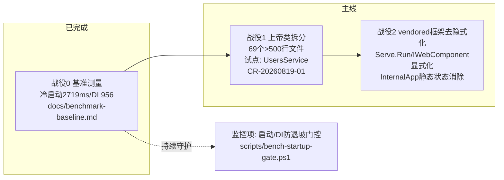

# JNPF v5.2 后端模块化重构主方案

> **版本**：v2.0 · **状态**：战役 0 已完成，战役 1 试点 CR 待批
> **[2026-08-19 阶段0诊断修正]**：原 v1.0 方案（外部输入的通用重构路线）经实测诊断，
> 多处关键假设被证伪、两处条目与仓库宪法级规则（AGENTS.md）冲突，已作废或修正。
> 本文档为全体参与者的**唯一事实基线**，后续所有 CR 必须对照本文档。
> **认知基线**：读懂现有结构的第一入口 = [`JNPF-Backend-Architecture-Explained.md`](./JNPF-Backend-Architecture-Explained.md)（洋葱+模块切片心智模型、四目录名实对照、模块依赖矩阵），所有 CR 评审前先读。
> **施工指令**：[施工包 v2.0](./backend-modular-refactor-construction-pack-v2.md)（2026-08-19 决策者签发）为可执行施工总纲，含四不做红线（D5-1…D5-4）、五阶段里程碑、排雷地图与 SOP；本文档与之冲突时以施工包为准。

---

## 1. 阶段 0 诊断结论（全部实测，2026-08-19）

### 1.1 证伪与修正

| # | 原方案假设 | 实测证据 | 修正 |
|---|-----------|---------|------|
| 1 | 「使用 Furion NuGet，可移除/替换」 | 72 个 csproj 中 Furion 包引用 = 0；框架源码 vendored 于 `backend/framework/JNPF*`（8 工程） | 命题改为「vendored 框架去隐式化」，不存在卸载/换 ABP 选项 |
| 2 | 「`App.GetService` 服务定位器满天飞」 | 全仓 25 处全在 vendored 框架内部；`backend/modularity/**` = 0 处；已有 JNPF001 分析器（`backend/tools/JNPF.Analyzers/.../AppServiceLocatorAnalyzer.cs`）硬拦截 | 业务层该项已治理完毕，移除该战役 |
| 3 | 「冷启动 15-30s」 | 实测中位数 **2719ms**（5 轮，`backend/tools/JNPF.Startup.Benchmarks`） | 已达 ≤3s 目标 → **启动优化判定为伪需求**，降级为监控项 |
| 4 | 「反射致运行时缓慢」 | 动态 API 首请求 80ms / Swagger 首生成 7ms | 无证据，否决 |

### 1.2 确认的问题

| # | 问题 | 证据 |
|---|------|------|
| 1 | **上帝类重灾区** | `modularity/` 下 >500 行文件 **69 个**；Top：`CodeGenFormControlDesignHelper.cs` 3757、`RunService.cs` 3734、`RequirementAnalysisOrchestrator.cs` 3397、`UsersService.cs` 2644（45 公共方法） |
| 2 | DI 存量作用域违规 | Development Scope 校验报 54+ 处 Singleton 消费 Scoped（样例 `IMHandler`←`ICacheManager`） |
| 3 | 框架隐式静态状态 | `InternalApp.Configuration`/`WebHostEnvironment` 静态字段（战役 2 目标） |

基线数据全文：`docs/benchmark-baseline.md` · 数据文件：`backend/tools/JNPF.Startup.Benchmarks/baseline.json`

---

## 2. 决策记录（用户批复 2026-08-19）

- **D1（不可变前提）**：保留 `IDynamicApiController` + 保留 SqlSugar。除非压倒性业务驱动 + 完整迁移验证计划，不得变更。与 AGENTS.md「Never write Controllers」及多租户铁律一致。
- **D2**：战役 0 基准测量先行，基线出来前不启动任何优化类任务。→ **已完成**。
- **D3**：战役 1 首个拆分目标 = `UsersService`。→ CR-20260819-01 已提交，待批。
- **D4**：放弃换 EF Core / 换 ABP / 新建目录树 / 回归显式 Controller。
- **D5（三不做，2026-08-19 补充锁定）**：❌ 不做目录重命名（72 csproj + CI 连锁成本，语义用认知文档固化）；❌ 不引入 ABP vNext 或任何新框架；❌ 不在战役 1 中补 Domain 层 / DDD 化（贫血实体 + SqlSugar 为既定取舍）。治理对象是「模块内部分层纪律缺失」，不是「结构不像教科书」。

---

## 3. 三战役路线（修正后）

**图 3-1 战役依赖关系图**

### 战役 1：上帝类拆分（主线，预计 6-8 周）

- 目标：`modularity/` 内 API Service 类（`IDynamicApiController` 实现，共 155 个）中的 >500 行者，
  按职责拆为多个小 Service，JNPF009 基线（`complexity-baseline.json`，threshold=30）逐文件退坡。
- **约束**：保留 `IDynamicApiController`；路由契约用 `[ApiDescriptionSettings(Name)]`
  （`framework/JNPF/DynamicApiController/Attributes/ApiDescriptionSettingsAttribute.cs`）锁定，逐条不变。
- 节奏：每个目标类 = 一份 CR（`.claude/change-requests/CR-YYYYMMDD-NN.md`）→ 审批 → 开工 → 节点验收。
- **前置排查**：拆分前对照依赖矩阵（认知文档 §6）核查目标类所属模块的跨模块实现引用（存量 6 条硬耦合，如 `Systems→OAuth`、`Systems→VisualDev.Engine`），避免拆分踩雷。
- 验收硬条件：路由快照一致 + `pnpm test:api` 绿 + 单测覆盖率不退坡 + JNPF009 条目只减不增。

### 战役 2：vendored 框架去隐式化（预计 4-6 周，战役 1 稳定后）

- 目标：`Serve.Run`/`IWebComponent` 反射扫描 → 显式模块清单；消除 `InternalApp` 静态状态。
- 安全网（战役 0 锚点）：模块加载耗时 138ms、路由生成 <10ms、DI 描述符 956 —— 改造后不得劣化（门控 ±10%）。
- **模块边界治理（依赖矩阵扫描输入，2026-08-19）**：
  - `JNPF.Common.Core` 反向依赖 5 个模块 `.Entitys`（方向倒置）→ 解除；
  - 20 个伪共享类型下沉（含 8 个仅宿主使用）+ 18 个疑似零引用类型清理；
  - **候选规则**：扩展 `LayeringTests`（ARCH-01）为完整模块依赖矩阵测试——「模块 A 只能引用模块 B 的 `.Interfaces`」，待基线评估后实施，不立即动手。
  - 数据：`.claude/evidence/arch-scan/*.json` · 复跑：`scripts/arch-module-dependency-scan.ps1`。

### 监控项（原「启动优化」降级）

- PR gate：`scripts/bench-startup-gate.ps1`（DI 描述符增幅 >10% 失败）
- 发布前：`--mode process` 冷启动 5 轮，中位数 >3500ms 告警

---

## 4. 8 维架构特性对齐（原方案北极星指标，修正后）

| 维度 | 状态 | 承载战役 |
|------|------|---------|
| ① 模块化隔离 | 已有 14 个 `JnpfModule`（拓扑排序，`AppServiceCollectionExtensions.AddJnpfModules`） | 战役 2 |
| ② 启动确定性 | 实测 2719ms 达标，门控守护 | 监控项 |
| ③ 依赖显式性 | 业务层已达标（JNPF001）；框架静态门面遗留 | 战役 2 |
| ④ 元数据驱动 | 既有低代码引擎，不在本次范围 | — |
| ⑤ 分层正交性 | ARCH-01 架构测试已守护 | 持续 |
| ⑥ 可测试性 | 上帝类拆分直接改善 | 战役 1 |
| ⑦ 渐进式加载 | 全量注册 956 描述符 / 138ms，暂无必要 | 观察 |
| ⑧ 可观测性 | Serilog + OpenTelemetry 已接入（`ObservabilityModule`） | 持续 |

---

## 5. 附带缺陷登记（战役 0 发现）

- **F1**：`modularity/zxdev/JNPF.ZxDev/ZxSystemController.cs`、`ConfigController.cs` 为显式 Controller，
  违反「Never write Controllers」→ 待合规审查。
- **F2**：`DatabaseModule` 依赖 `InternalApp` 隐式状态 → 战役 2 输入。
- **F3**：DI 作用域违规存量 54+ 处 → 建议战役 1 期间立项修复（启用 Development Scope 校验为长期目标）。
- **F4（2026-08-19 依赖矩阵扫描新增）**：跨模块绕过 `.Interfaces` 引用 46 条（其中实现工程硬耦合 6 条、共享内核反向依赖 5 条）→ 治理承载见战役 1/2 分工（认知文档 §9）。

---

## 6. 纪律重申

1. 所有业务代码变更先提 CR 获批（实现完整性铁律 · 需求分析子链铁律六）。
2. 度量驱动：每战役节点结束必须更新 `baseline.json` 与本文档。
3. 绞杀者模式：新代码走新结构，旧代码逐文件迁移，系统始终可运行；禁止推倒重来。
