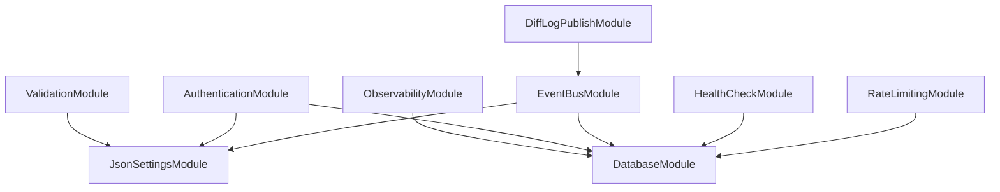

# JNPF V5.2 架构总览

> 文档版本：v1.0 | 状态：终审批准 | 批准日期：2026-06-08
> 适用源码：`backend/` | 读前必读：[ARCHITECTURE_DOC_RULES.md](ARCHITECTURE_DOC_RULES.md)

---

## 1. 系统架构图

```
┌──────────────────────────────────────────────────────────────┐
│                    JNPF.API.Entry (启动入口)                  │
│  Program.cs → Startup.cs → AppStartup + JnpfModule 系统     │
│  Serve.Run (GenericWebHost)                                  │
└───────────────┬──────────────────────────────────────────────┘
                │
┌───────────────▼──────────────────────────────────────────────┐
│              JnpfModule 模块系统 (拓扑排序加载)               │
│                                                              │
│  ValidationModule ──→ ObservabilityModule                    │
│       │                       │                              │
│  JsonSettingsModule     DatabaseModule                       │
│       │                       │                              │
│  AuthenticationModule ◄───────┘                              │
│       │                                                      │
│  EventBusModule ──→ RateLimitingModule                       │
│       │                                                      │
│  HealthCheckModule                                           │
│       │                                                      │
│  DiffLogPublishModule / WeixinModule / ForwardedHeadersModule │
└───────────────┬──────────────────────────────────────────────┘
                │
┌───────────────▼──────────────────────────────────────────────┐
│                Framework (JNPF 核心框架)                      │
│  DynamicApiController / UnifyResult / Schedule / JwtBearer   │
│  SqlSugarExtra / EventBus / FriendlyException / Retry        │
│  App (全局服务容器) / JnpfModule 基类                         │
└───────────────┬──────────────────────────────────────────────┘
                │
┌───────────────▼──────────────────────────────────────────────┐
│           Infrastructure (跨切面基础设施)                     │
│                                                              │
│  SqlSugar Repository  │  OpenTelemetry (Tracing+Metrics)     │
│  TenantContext        │  FluentValidation (Auto-Validation)   │
│  EventBus (Outbox)    │  RateLimiting (3 policies)            │
│  Health Checks        │  Roslyn Analyzers (6 rules)           │
│  DbUp Migrations      │  CI/CD Quality Gates                 │
└───────────────┬──────────────────────────────────────────────┘
                │
┌───────────────▼──────────────────────────────────────────────┐
│             Modularity (业务模块)                             │
│  Common / OAuth / System / Message / WorkFlow /              │
│  DataVisualization / TaskScheduler / FileManage /            │
│  WeChat / SuperBrain                                         │
└──────────────────────────────────────────────────────────────┘
```

### Module Dependency Graph (Mermaid)



**加载顺序：** `ModuleGraphBuilder` 扫描全部 `JnpfModule` 子类 → Kahn 算法拓扑排序 → `ActivatorUtilities.CreateInstance` 实例化 → 按序执行 `ConfigureServices` → 按序执行 `OnApplicationInitialization`

---

## 2. 核心技术栈

| 类别 | 技术 | 版本 | 用途 |
|---|---|---|---|
| 运行时 | .NET | 8.0 | 后端 |
| Web | ASP.NET Core | 8.0 | API 宿主 |
| 自研框架 | JNPF (Furion 衍生) | v5.2 | DynamicApi / UnifyResult / Schedule |
| ORM | SqlSugarCore | 5.1.x | 主数据访问 |
| 映射 | Mapster | 7.x | DTO 映射 |
| 缓存 | CSRedisCore | 3.x | Redis |
| JWT | JwtBearer + JWTEncryption | 8.0.x | 认证 |
| API 文档 | Swashbuckle + Knife4jUI | — | `/newapi` |
| 验证 | FluentValidation | 11.3.0 | 请求验证 |
| 可观测 | OpenTelemetry | 1.8.1 | Tracing + Metrics → Jaeger |
| 迁移 | DbUp | 5.0.x | 数据库幂等迁移 |
| 分析器 | Roslyn Analyzer | 4.8.0 | 6 条架构约束规则 |
| 限流 | AspNetCoreRateLimit | — | 3 策略（fixed/login/export） |
| 图片 | SixLabors.ImageSharp | 3.1.11 | 缩略图生成 |

---

## 3. 架构红线（摘要）

> 详细版见 [ARCHITECTURE_DOC_RULES.md](ARCHITECTURE_DOC_RULES.md) 和 [JNPF Expert Traps](../../.claude/rules/jnpf-expert-traps.md)

| # | 规则 | 违反后果 |
|---|---|---|
| R1 | 禁止手动创建 Controller — IDynamicApiController 自动生成 | 重复路由 / 框架冲突 |
| R2 | 禁止手动包装 RESTfulResult — 框架自动包装 | 双层嵌套，前端解析失败 |
| R3 | 代码生成 bug → 修 .vm 模板，不修输出目录 | 下次生成覆盖 |
| R4 | 多租户查询必须验证 ITenantFilter | 跨租户数据泄露 |
| R5 | OA 已禁用 / IoT、MES 未创建 → 禁止修改 | 无效变更 |

---

## 4. 模块系统（JnpfModule）

### 生命周期

```
1. ModuleGraphBuilder.Scan(typeof(ValidationModule).Assembly)
     → 发现所有 [DependsOn] 标注的 JnpfModule 子类
2. KahnAlgorithm.TopologicalSort()
     → 按依赖关系排序（无依赖先加载）
3. ActivatorUtilities.CreateInstance(type, serviceProvider)
     → 支持构造函数注入的实例化
4. module.ConfigureServices(services, configuration)
     → 按拓扑序依次执行服务注册
5. module.OnApplicationInitialization(app, env)
     → 按拓扑序依次初始化中间件
```

### 关键规则

- `[DependsOn(typeof(OtherModule))]` 声明依赖
- LegacyModule 桥接：旧 `AppStartup` 先执行，新模块后执行
- 重复注册检测：新模块注册服务前检查是否已被旧模块注册
- `App.EffectiveTypes` 扫描包含所有模块的程序集

---

## 5. 多租户架构

### TenantContext 设计

```
ITenantContext (AsyncLocal<TenantInfo>)
    ↓
TenantContext.Current (静态访问点)
    ↓ 供
  - DataExecuting 委托 (Insert 自动填充 TenantId)
  - EventBus Filter (事件消费时传播租户)
  - Schedule Job Filter (定时任务执行时传播租户)
```

### 三种入口点

| 入口 | 解析方式 | 配置位置 |
|---|---|---|
| HTTP 请求 | JWT claims → Header → QueryString | AuthenticationModule |
| EventBus 消息 | TenantPropagationFilter | EventBusModule |
| 定时任务 | FallbackTenantResolver | Schedule |

### FallbackTenantResolver 四级降级

```
JWT claim (tenant_id) → Header (X-Tenant-Id) → QueryString (?tenantId) → 默认租户
```

### 数据隔离三层防护

| 层 | 机制 | 覆盖范围 |
|---|---|---|
| QueryFilter | `AddTableFilter<ITenantFilter>` | Queryable 自动过滤 |
| Repository Safe* | `SafeUpdateAsync` / `SafeDeleteAsync` | Updateable / Deleteable 显式 TenantId |
| DataExecuting | 统一委托 `ConfigureGlobalDataExecuting` | Insert 自动填充 |

> 详细设计见 [tenant-context.md](tenant-context.md)

---

## 6. 事件可靠性管道（Outbox）

```
┌──────────────┐     ┌──────────────────┐     ┌────────────┐
│ 业务操作      │ ──→ │ Outbox 写入       │ ──→ │ DB 事务提交 │
│ (SaveEntity) │     │ (EventOutboxMsg) │     │ (原子性)   │
└──────────────┘     └──────────────────┘     └─────┬──────┘
                                                     │
┌────────────────────────────────────────────────────┘
│  Dispatcher
│    ├── Channel 实时唤醒 (WriteAsync → reader)
│    └── 30s 兜底轮询 (BackgroundService)
│
│  Polly 重试管道
│    ├── 指数退避 (2^n seconds)
│    ├── 熔断 (Circuit Breaker, N 次失败后暂停)
│    └── 死信管理 (超过 MaxRetryCount → DeadLetter)
│
│  幂等检查
│    └── ProcessedEvent 表 (EventId + HandlerName 复合主键)
│
│  多实例安全
│    └── SQL Server: UPDLOCK READPAST 行锁
│
│  优雅停机
│    └── StopAsync 排空 Channel → 拒绝新消息
└──────────────────────────────────────────────────────┘
```

> 详细设计见 [outbox-pipeline.md](outbox-pipeline.md)

---

## 7. 可观测性

### OpenTelemetry → Jaeger

**Tracing:**
- ASP.NET Core (自动 Span：请求/响应)
- SqlClient (自动 Span：SQL 执行)
- HttpClient (自动 Span：出站 HTTP)
- EventBus (自定义 Source)

**Metrics:**
- ASP.NET Core (QPS / 延迟 / 错误率)
- Runtime (GC / 线程池 / 内存)
- HttpClient (出站请求指标)

**Filter:** `/health` 端点排除（避免噪音）

**配置：** `appsettings.json` → `Observability:OtlpEndpoint` (默认 `http://localhost:4317`)

---

## 8. 工程化防线

### Roslyn Analyzer（6 规则）

| ID | 规则 | 严重级别 |
|---|---|---|
| JNPF001 | 禁止 `App.GetService<T>()` | suggestion |
| JNPF002 | 禁止 `DataExecuting =` 直接赋值 | suggestion |
| JNPF003 | 禁止 `CreateScope()` | suggestion |
| JNPF004 | `[BypassOutbox]` 需注释理由 | suggestion |
| JNPF005 | 禁止直接注入 `ISqlSugarClient` | suggestion |
| JNPF006 | 禁止 `async void`（接口实现/事件处理器除外） | suggestion |

> 当前 suggestion 级别（存量不阻塞），目标提升至 warning/error

### CI/CD 质量门禁

```
CI (PR → main/develop)
  ├── dotnet build (/p:CI_BUILD=true)
  ├── Analyzer gate (grep "error JNPF" → block)
  ├── dotnet test
  ├── Security scan
  └── Build warning stats

CD Staging (push to develop)
  ├── Analyzer gate
  └── Health check retry (12×5s)

CD Production (release)
  ├── Quality gate job (全部检查)
  └── Health check retry (18×5s)
```

---

## 9. 已封存文件清单

以下文件已完成其架构迭代使命，后续修改需技术 Lead 审批：

| # | 文件 | 所属项目 | 封存阶段 | 原因 |
|---|---|---|---|---|
| 1 | `JwtHandler.cs` | JNPF.Extras.Authentication.JwtBearer | Stage 0 | 认证处理器 |
| 2 | `SqlSugarConfigureExtensions.cs` | JNPF.Extras.DatabaseAccessor.SqlSugar | Stage 1 | ORM 配置入口 |
| 3 | `Program.cs` | JNPF.API.Entry | Stage 1 | WebComponent.Load 启动 |
| 4 | `AppServiceCollectionExtensions.cs` | JNPF (框架核心) | Stage 2 | 模块系统入口 |
| 5 | `Startup.cs` | JNPF.API.Entry | Stage 3 | 中间件编排 |
| 6 | `SqlSugarRepository.cs` | JNPF.Extras.DatabaseAccessor.SqlSugar | Stage 4 | 仓储基类 |
| 7 | `Service.cs.vm` | JNPF.CodeGen | Stage 5 | 代码生成模板 |
| 8 | `LogEventSubscriber.cs` | JNPF.EventHandler | Stage 5 | 事件日志订阅 |

---

## 10. 目录结构

```
backend/
├── framework/                    # JNPF 核心框架
│   └── JNPF/                     # App, JnpfModule, DynamicApi, Schedule
├── infrastructure/               # 跨切面基础设施
│   ├── JNPF.Extras.WebSockets/
│   └── JNPF.Extras.DatabaseAccessor.SqlSugar/
├── modularity/                   # 业务模块
│   ├── common/                   # JNPF.Common / JNPF.Common.Core
│   ├── oauth/                    # JNPF.OAuth
│   ├── system/                   # JNPF.Systems (权限管理)
│   ├── message/                  # JNPF.Message (消息中心)
│   ├── workflow/                 # 工作流
│   ├── datavisualization/        # 数据大屏
│   └── ...
├── application/                  # 应用入口
│   ├── JNPF.API.Entry/           # 主入口 (Web + API)
│   │   ├── Modules/              # JnpfModule 实现
│   │   ├── Validators/           # FluentValidation 验证器
│   │   ├── Configurations/       # JSON 配置文件
│   │   └── Services/             # 应用服务 (LogHealthCheck, etc.)
│   └── JNPF.OA.API.Entry/        # OA 入口 (已禁用)
├── tools/                        # 工具项目
│   ├── JNPF.Analyzers/           # Roslyn 分析器
│   │   ├── Analyzers/            # 6 个诊断分析器
│   │   └── CodeFixes/            # 2 个代码修复提供者
│   ├── JNPF.Analyzers.Tests/     # 分析器单元测试 (11 tests)
│   └── JNPF.Database.Migrations/ # DbUp 数据库迁移
│       └── Scripts/              # 幂等 SQL 脚本
└── Directory.Build.props         # 全局 MSBuild 配置
```

---

## 11. 15 项核心架构决策（ADR）

> 完整版见 [../adr/README.md](../adr/README.md)

| ADR | 标题 | 状态 | 阶段 |
|---|---|---|---|
| ADR-001 | ISqlSugarClient 注册方式 | Final | 0 |
| ADR-002 | DataExecuting 实现策略 | Final | 0 |
| ADR-003 | TenantContext 解析方式 | Final | 2 |
| ADR-004 | 匿名端点降级策略 | Final | 2 |
| ADR-005 | 模块系统主从关系 | Final | 2 |
| ADR-006 | CopyNew 行为 | Final | 0 |
| ADR-007 | Repository 构造函数目标行数 | Final | 4 |
| ADR-008 | Outbox 投递策略与多实例安全 | Final | 5 |
| ADR-009 | API 契约不可修改 | Final | All |
| ADR-010 | 业务冻结期与热补丁通道 | Final | 1 |
| ADR-011 | DiffLog 发布解耦 | Final | 1 |
| ADR-012 | Updateable/Deleteable 全局租户保护 | Final | 4 |
| ADR-013 | 非 HTTP 入口租户上下文传播 | Final | 2 |
| ADR-014 | Repository IDisposable 保障 | Final | 4 |
| ADR-015 | Outbox Dispatcher 优雅停机 | Final | 5 |

---

## 12. 相关文档索引

| 文档 | 位置 |
|---|---|
| 核心框架深度解剖 | [v52/01-core-framework.md](v52/01-core-framework.md) |
| 应用服务审查 | [v52/02-application-services.md](v52/02-application-services.md) |
| 模块深度解析 | [v52/03-application-modules-deep-dive.md](v52/03-application-modules-deep-dive.md) |
| 前端深度解析 | [v52/04-application-frontend-deep-dive.md](v52/04-application-frontend-deep-dive.md) |
| 租户上下文设计 | [tenant-context.md](tenant-context.md) |
| 事件管道设计 | [outbox-pipeline.md](outbox-pipeline.md) |
| ADR 索引 | [../adr/README.md](../adr/README.md) |
| 开发规范 | [../development/guide.md](../development/guide.md) |
| 部署指南 | [../deployment/guide.md](../deployment/guide.md) |
| CI/CD 指南 | [../deployment/ci-cd-guide.md](../deployment/ci-cd-guide.md) |
| 阶段 8 演进看板 | [../roadmap/stage8-backlog.md](../roadmap/stage8-backlog.md) |
