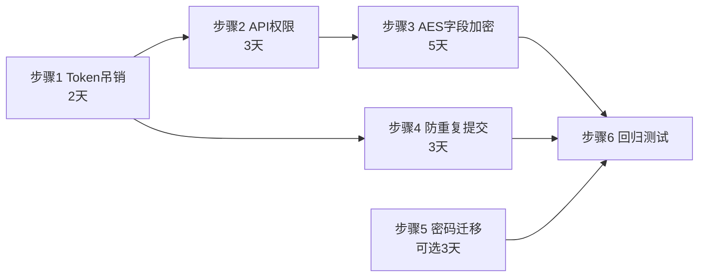
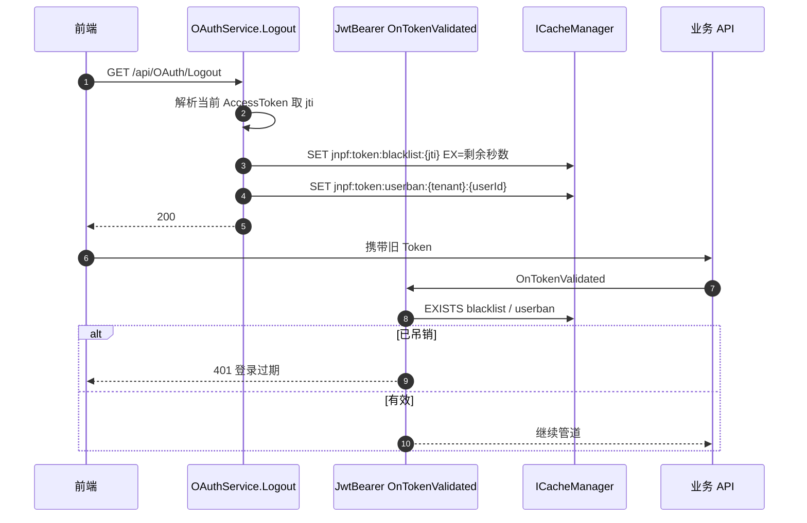
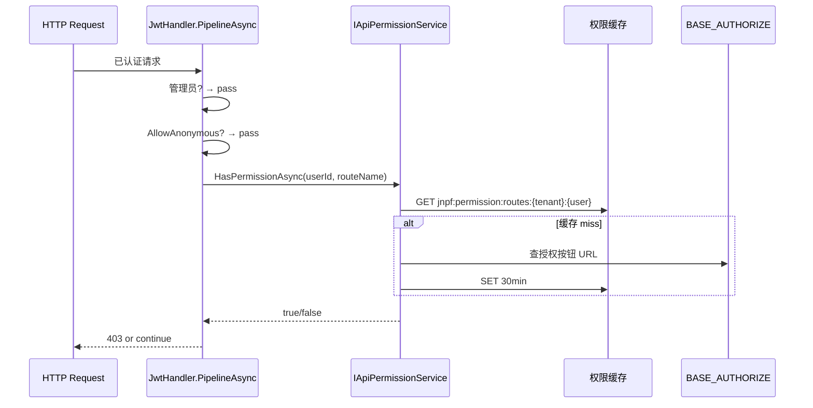
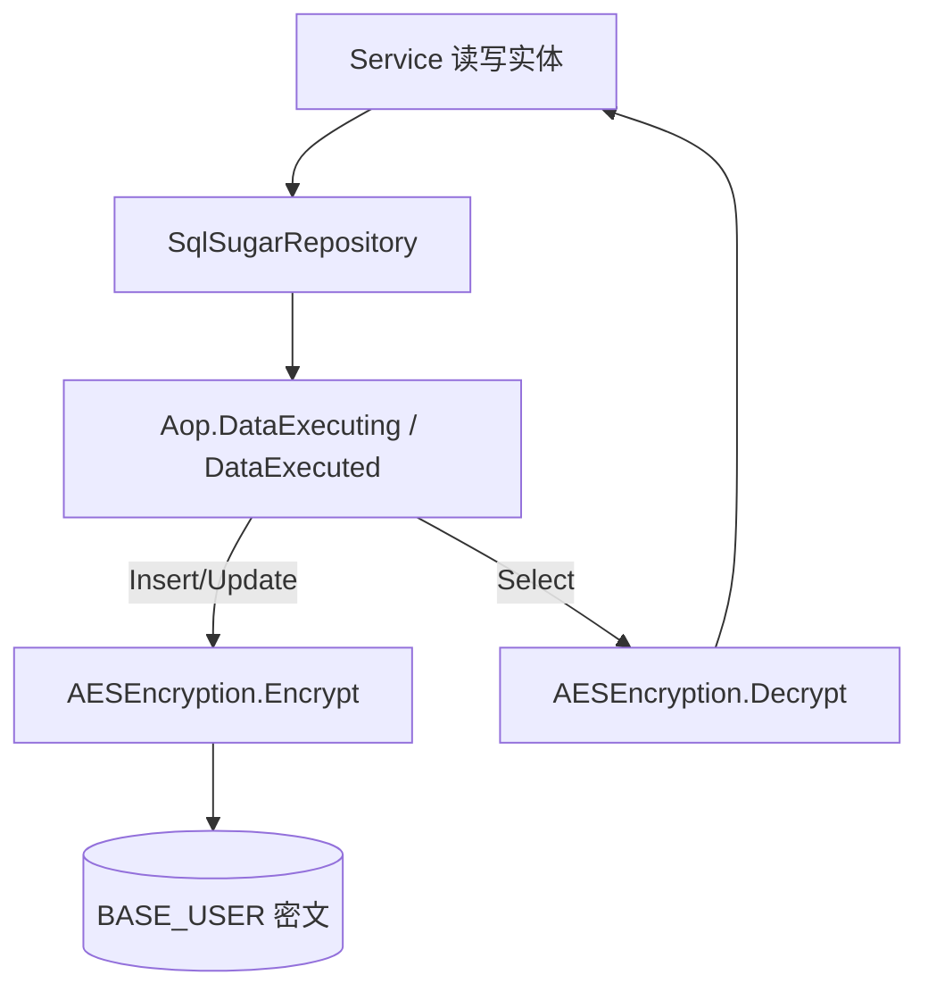
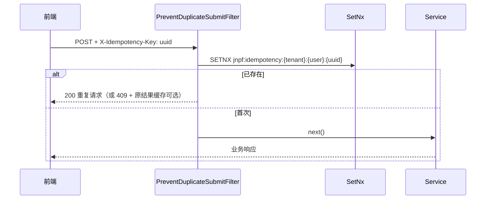

# 二期 P0-A 安全基线技术方案与施工包

> **文档版本**：v1.0  
> **适用范围**：`framework/`、`application/JNPF.API.Entry/`、`modularity/oauth/`、`modularity/system/`、`modularity/common/`  
> **对应计划**：[`01-core-framework.md`](01-core-framework.md) §8.3.1 第一优先级 #1–#4  
> **工期**：约 2 周（10 人日）  
> **前置**：Redis 可用（`Configurations/Cache.json` → `CacheType=RedisCache`）；开发/测试环境可联调

---

## 0. 优先级说明（与 P0-B 的关系）

| 代号 | 内容 | 时间窗口 | 可否并行 |
|------|------|----------|----------|
| **P0-A（本文档）** | Token 吊销、API 权限、AES 字段加密、防重复提交 | 二期第 1–2 周 | — |
| **P0-B** | SignalR、Schedule、AI（架构师 **A-必做**） | 二期第 2–5 周 | 可与 P0-A **后半段并行**，见 [`03-phase2-p0-signalr-schedule-ai-implementation.md`](03-phase2-p0-signalr-schedule-ai-implementation.md) |

**工程师执行顺序**：先完成本文档 **步骤 1→4**，再启动 P0-B；步骤 2 与步骤 1 可同一人串行，步骤 3/4 可另一人并行。

---

## 1. 总览

### 1.1 现状（源码事实）

| 项 | 现状 | 文件 |
|----|------|------|
| Token 吊销 | 登出 `Logout` 仅 `SignoutToSwagger` + 清在线用户；**无 JWT 黑名单** | `modularity/oauth/JNPF.OAuth/OAuthService.cs` L573-606 |
| API 权限 | `JwtHandler.CheckAuthorzieAsync` **恒 `return true`** | `application/JNPF.API.Entry/Handlers/JwtHandler.cs` L54-78 |
| 密码 | `MD5Encryption.Encrypt(pwd + Secretkey)` | `OAuthService.cs` 登录逻辑 |
| 字段加密 | `AESEncryption` 工具存在，**ORM 未接入** | `framework/JNPF/DataEncryption/Encryptions/AESEncryption.cs` |
| 防重复提交 | **无** Filter；`CacheManager.SetNx` 存在 | `framework/JNPF/Cache/CacheManager.cs` L233-236 |

### 1.2 交付物清单

| # | 交付物 | 验收标准 |
|---|--------|----------|
| 1 | Token 黑名单 + 用户级封禁 | 登出/禁用后旧 Token 请求返回 401 |
| 2 | API 路由权限校验 | 无权限接口返回 403；`AllowAnonymous` 仍可用 |
| 3 | 敏感字段透明 AES | `BASE_USER.F_MOBILE_PHONE` 库内密文，接口读写明文 |
| 4 | 防重复提交 | 同 Idempotency-Key 重复 POST 仅成功一次 |
| 5 | （建议同期）密码 MD5→BCrypt 双轨 | 新密码 BCrypt；旧用户登录自动迁移 |

### 1.3 Redis 键规范（全二期统一）

| 键模式 | 用途 | TTL |
|--------|------|-----|
| `jnpf:token:blacklist:{jti}` | 单次 Token 吊销 | = Token 剩余有效期 |
| `jnpf:token:userban:{tenantId}:{userId}` | 用户级封禁（禁用/改密/权限变更） | 1440min（与默认 Token 过期对齐，可配置） |
| `jnpf:permission:routes:{tenantId}:{userId}` | 用户 API 路由权限缓存 | 30min |
| `jnpf:idempotency:{tenantId}:{userId}:{key}` | 幂等锁 | 60s（可配置） |

---

## 2. 施工步骤总序



| 步骤 | 名称 | 负责人建议 | 依赖 |
|------|------|------------|------|
| **1** | Token 吊销机制 | 后端 A | 无 |
| **2** | API 权限全覆盖 | 后端 A | 步骤 1 的 `OnTokenValidated` 扩展点 |
| **3** | 敏感字段 AES 透明加密 | 后端 B | 无（可与 1/2 并行） |
| **4** | 防重复提交 Filter | 后端 B | Redis |
| **5** | 密码 MD5→BCrypt 双轨 | 后端 A | 步骤 1（改密需吊销） |
| **6** | 回归测试 | QA + 后端 | 1–5 |

---

## 步骤 1：Token 吊销机制（2 天）

### 1.1 设计

#### 图1-1 Token 吊销时序图



**策略**：

1. 登录时在 JWT Payload 写入 `jti`（Guid 字符串）。
2. 登出、管理员禁用用户、修改密码、角色组织变更强制下线时：写 **blacklist(jti)** + **userban(userId)**。
3. `Startup` 的 `JwtBearerEvents.OnTokenValidated` 中校验（早于 `JwtHandler`）。

### 1.2 新建文件

#### 1.2.1 `framework/JNPF/Authorization/TokenRevocation/ITokenRevocationService.cs`

```csharp
namespace JNPF.Authorization;

public interface ITokenRevocationService
{
    Task RevokeTokenAsync(string jti, TimeSpan remainingLifetime);
    Task RevokeUserAsync(string tenantId, string userId, TimeSpan banDuration);
    Task<bool> IsTokenRevokedAsync(string jti, string tenantId, string userId);
    string? TryGetJti(ClaimsPrincipal user);
}
```

#### 1.2.2 `modularity/common/JNPF.Common.Core/Security/TokenRevocationService.cs`

```csharp
using JNPF.Authorization;
using JNPF.Common.Manager;
using System.Security.Claims;

namespace JNPF.Common.Core.Security;

public class TokenRevocationService : ITokenRevocationService, IScoped
{
    private const string BlacklistPrefix = "jnpf:token:blacklist:";
    private const string UserBanPrefix = "jnpf:token:userban:";
    private readonly ICacheManager _cache;

    public TokenRevocationService(ICacheManager cache) => _cache = cache;

    public async Task RevokeTokenAsync(string jti, TimeSpan remainingLifetime)
    {
        if (string.IsNullOrWhiteSpace(jti)) return;
        await _cache.SetAsync(BlacklistPrefix + jti, "1", remainingLifetime);
    }

    public async Task RevokeUserAsync(string tenantId, string userId, TimeSpan banDuration)
    {
        await _cache.SetAsync($"{UserBanPrefix}{tenantId}:{userId}", DateTimeOffset.UtcNow.ToUnixTimeSeconds().ToString(), banDuration);
    }

    public async Task<bool> IsTokenRevokedAsync(string jti, string tenantId, string userId)
    {
        if (!string.IsNullOrWhiteSpace(jti) && await _cache.ExistsAsync(BlacklistPrefix + jti))
            return true;

        var banKey = $"{UserBanPrefix}{tenantId}:{userId}";
        if (!await _cache.ExistsAsync(banKey)) return false;

        var banTs = await _cache.GetAsync(banKey);
        if (!long.TryParse(banTs, out var ts)) return true;

        // Token 的 iat 若早于封禁时间则拒绝（需在 OnTokenValidated 传入 iat）
        return true; // 具体比较在 Middleware 扩展中实现
    }

    public string? TryGetJti(ClaimsPrincipal user) =>
        user?.FindFirst(JwtRegisteredClaimNames.Jti)?.Value;
}
```

> **施工注意**：`IsTokenRevokedAsync` 需补充 **iat 与 userban 时间戳比较**逻辑（见 1.3.3 完整片段）。

#### 1.2.3 `modularity/common/JNPF.Common.Core/Security/TokenRevocationExtensions.cs`

提供 `GetTokenRemainingLifetime(HttpContext)`：从 `exp` Claim 计算 Redis TTL。

### 1.3 修改文件（按顺序）

| 序号 | 文件 | 操作 |
|------|------|------|
| 1 | `modularity/common/JNPF.Common/Const/ClaimConst.cs` | 新增 `public const string JTI = "jti";`（若用标准名则直接用 `JwtRegisteredClaimNames.Jti`） |
| 2 | `modularity/oauth/JNPF.OAuth/OAuthService.cs` | 登录 `JWTEncryption.Encrypt` 的 Dictionary 增加 `{ JwtRegisteredClaimNames.Jti, Guid.NewGuid().ToString("N") }` |
| 3 | `modularity/oauth/JNPF.OAuth/OAuthService.cs` | `Logout` 末尾注入 `ITokenRevocationService`，吊销当前 Token |
| 4 | `application/JNPF.API.Entry/Startup.cs` | `ConfigureServices` 注册 `services.AddScoped<ITokenRevocationService, TokenRevocationService>()` |
| 5 | `application/JNPF.API.Entry/Startup.cs` | `OnTokenValidated` 内调用吊销校验 |
| 6 | `modularity/system/JNPF.Systems/Permission/UsersService.cs` | 禁用用户（`EnabledMark=0`）、改密、组织角色变更处调用 `RevokeUserAsync` |
| 7 | `modularity/system/JNPF.Systems/Permission/UsersCurrentService.cs` | 用户改密成功后 `RevokeUserAsync` |

#### 1.3.1 修改 `OAuthService.Login` — 写入 jti

定位：`OAuthService.cs` 约 L878，`JWTEncryption.Encrypt(new Dictionary<string, object> { ... })`。

**在 Dictionary 内追加**：

```csharp
{ JwtRegisteredClaimNames.Jti, Guid.NewGuid().ToString("N") },
{ JwtRegisteredClaimNames.Iat, DateTimeOffset.UtcNow.ToUnixTimeSeconds() },
```

#### 1.3.2 修改 `OAuthService.Logout`

在 `httpContext.SignoutToSwagger();` **之后**追加：

```csharp
var revocation = App.GetService<ITokenRevocationService>();
var jti = revocation.TryGetJti(_httpContextAccessor.HttpContext.User);
if (jti.IsNotEmptyOrNull())
{
    var remaining = TokenRevocationHelper.GetRemainingLifetime(_httpContextAccessor.HttpContext.User);
    await revocation.RevokeTokenAsync(jti, remaining);
}
await revocation.RevokeUserAsync(tenantId, userId, TimeSpan.FromMinutes(tokenTimeout));
```

> `tokenTimeout` 从 `sysConfig.tokenTimeout` 读取（与同文件登录逻辑一致）。

#### 1.3.3 修改 `Startup.cs` — `OnTokenValidated`

将 L75 的 `OnTokenValidated = context => Task.CompletedTask` 替换为：

```csharp
OnTokenValidated = async context =>
{
    var revocation = context.HttpContext.RequestServices.GetRequiredService<ITokenRevocationService>();
    var user = context.Principal;
    var jti = user?.FindFirst(JwtRegisteredClaimNames.Jti)?.Value;
    var tenantId = user?.FindFirst(ClaimConst.TENANTID)?.Value ?? "default";
    var userId = user?.FindFirst(ClaimConst.CLAINMUSERID)?.Value;
    var iat = user?.FindFirst(JwtRegisteredClaimNames.Iat)?.Value;

    if (await revocation.IsTokenRevokedAsync(jti, tenantId, userId))
    {
        context.Fail("Token has been revoked.");
        return;
    }

    // userban：封禁时间戳 > Token iat 则拒绝
    var banKey = $"jnpf:token:userban:{tenantId}:{userId}";
    var cache = context.HttpContext.RequestServices.GetRequiredService<ICacheManager>();
    if (await cache.ExistsAsync(banKey))
    {
        var banTsStr = await cache.GetAsync(banKey);
        if (long.TryParse(banTsStr, out var banTs) && long.TryParse(iat, out var tokenIat) && tokenIat < banTs)
        {
            context.Fail("User token invalidated.");
        }
    }
},
```

#### 1.3.4 修改 `UsersService` — 禁用用户

定位：`UsersService.cs` 约 L2332 `uentity.EnabledMark = 0` 分支，在 `Updateable` **成功后**：

```csharp
await App.GetService<ITokenRevocationService>()
    .RevokeUserAsync(_userManager.TenantId, uentity.Id, TimeSpan.FromMinutes(1440));
```

保留现有 `_imHandler.SendMessageAsync(... logout ...)` 逻辑；Token 吊销与 WS 踢人 **双保险**。

### 1.4 步骤 1 自测

| # | 操作 | 期望 |
|---|------|------|
| 1 | 登录 → 调 `/api/OAuth/CurrentUser` | 200 |
| 2 | 调 `/api/OAuth/Logout` → 再用旧 Token 调 CurrentUser | 401，`UnifyResult` code 600 |
| 3 | Redis `KEYS jnpf:token:blacklist:*` | 存在刚登出 jti |
| 4 | 管理员禁用用户 → 该用户旧 Token | 401 |

---

## 步骤 2：API 权限全覆盖（3 天）

### 2.1 设计

**路由名规则**（与 `JwtHandler` 一致）：

- 请求 `/api/OAuth/Login` → 权限码 `oauth:Login`
- 请求 `/api/system/user` → `system:user`

**权限数据来源**：

- **BASE_MODULE_BUTTON.F_URL_ADDRESS**：存储 API 路径或权限码（需统一清洗为 `module:action` 格式）
- **BASE_AUTHORIZE**：用户/角色 ↔ 按钮/模块

> 【待源码验证】：部分环境按钮 URL 为空，仅 **F_EN_CODE** 有值；施工时需跑脚本导出 DynamicApi 路由与按钮表 diff。

#### 图2-1 权限校验流程



### 2.2 新建文件

#### 2.2.1 `modularity/common/JNPF.Common.Core/Security/IApiPermissionService.cs`

```csharp
public interface IApiPermissionService
{
    Task<HashSet<string>> GetUserRoutePermissionsAsync(string tenantId, string userId);
    Task<bool> HasPermissionAsync(string tenantId, string userId, string routeName);
    Task InvalidateCacheAsync(string tenantId, string userId);
    string NormalizeRouteName(PathString path);
}
```

#### 2.2.2 `modularity/common/JNPF.Common.Core/Security/ApiPermissionService.cs`

**核心 SQL 逻辑**（SqlSugar，在 Service 内实现）：

1. `_userManager.GetPermissionByUserId(userId)` 得权限主体 ID 列表（已有，`OAuthService.GetCurrentUser` 同用法）。
2. 查 `BASE_AUTHORIZE` where `F_OBJECT_ID in pIds` and `F_ITEM_TYPE = 'button'`。
3. Join `BASE_MODULE_BUTTON` 取 `F_URL_ADDRESS` / `F_EN_CODE`。
4. 每条记录 `NormalizeRouteName` → 加入 `HashSet<string>`。
5. 缓存到 Redis `jnpf:permission:routes:{tenantId}:{userId}`。

**NormalizeRouteName 算法**（与 JwtHandler 对齐）：

```csharp
public string NormalizeRouteName(PathString path)
{
    var value = path.Value ?? string.Empty;
    if (value.StartsWith("/api/", StringComparison.OrdinalIgnoreCase))
        return value[5..].Replace("/", ":");
    return value.TrimStart('/').Replace("/", ":");
}
```

#### 2.2.3 `application/JNPF.API.Entry/Configurations/ApiPermission.json`

```json
{
  "ApiPermission": {
    "Enabled": true,
    "WhitelistRoutes": [
      "oauth:CurrentUser",
      "oauth:Login",
      "oauth:Logout"
    ],
    "CacheMinutes": 30
  }
}
```

对应 Options 类：`ApiPermissionOptions`，`Startup` 中 `AddConfigurableOptions<ApiPermissionOptions>()`。

### 2.3 修改文件

| 序号 | 文件 | 操作 |
|------|------|------|
| 1 | `application/JNPF.API.Entry/Handlers/JwtHandler.cs` | 实现 `CheckAuthorzieAsync` |
| 2 | `application/JNPF.API.Entry/Startup.cs` | 注册 `IApiPermissionService` |
| 3 | `modularity/system/.../AuthorizeService.cs` | 授权变更时 `InvalidateCacheAsync` |
| 4 | 全库 DynamicApi Service | 补 `[AllowAnonymous]`（见 2.4） |

#### 2.3.1 修改 `JwtHandler.CheckAuthorzieAsync`

```csharp
private async Task<bool> CheckAuthorzieAsync(DefaultHttpContext httpContext)
{
    var options = App.GetOptions<ApiPermissionOptions>();
    if (!options.Enabled) return true;

    if (App.User.FindFirst(ClaimConst.CLAINMADMINISTRATOR)?.Value ==
        ((int)AccountType.Administrator).ToString())
        return true;

    if (httpContext.GetEndpoint()?.Metadata?.GetMetadata<IAllowAnonymous>() != null)
        return true;

    var permService = App.GetService<IApiPermissionService>();
    var routeName = permService.NormalizeRouteName(httpContext.Request.Path);

    if (options.WhitelistRoutes.Contains(routeName))
        return true;

    var tenantId = App.User.FindFirst(ClaimConst.TENANTID)?.Value ?? "default";
    var userId = App.User.FindFirst(ClaimConst.CLAINMUSERID)?.Value;

    return await permService.HasPermissionAsync(tenantId, userId, routeName);
}
```

> 将方法从 `static` 改为实例方法，或继续 `static` 但用 `App.GetService`（与现有风格一致）。

### 2.4 权限扫描与补漏（必做脚本）

**PowerShell 扫描无 AllowAnonymous 的 DynamicApi**（在仓库根执行）：

```powershell
Get-ChildItem -Path modularity,application -Recurse -Filter *.cs |
  Select-String -Pattern "IDynamicApiController" -List |
  ForEach-Object { $_.Path } | Sort-Object -Unique
```

**人工规则**：

| 类型 | 处理 |
|------|------|
| 登录/注册/验证码/租户信息 | `[AllowAnonymous]` |
| Swagger/Knife4j/Schedule UI | 已在宿主层匿名或单独中间件 |
| 其余写操作 | 必须在 **BASE_MODULE_BUTTON** 有对应 URL，或加入白名单 |

**交付物**：`docs/architecture/artifacts/api-permission-route-matrix.csv`（路由、是否匿名、权限码、负责人）。

### 2.5 步骤 2 自测

| # | 操作 | 期望 |
|---|------|------|
| 1 | 普通用户 Token 访问未授权 POST | 403 |
| 2 | 同一用户访问已授权按钮对应 API | 200 |
| 3 | 管理员访问任意 API | 200 |
| 4 | 修改角色权限后 | 旧缓存失效，30min 内或立即 invalidation 后生效 |

---

## 步骤 3：敏感字段 AES 透明加密（5 天）

### 3.1 设计

**试点表字段**（第一期）：

| 表 | 字段 | 说明 |
|----|------|------|
| **BASE_USER** | F_MOBILE_PHONE | 手机号 |
| **BASE_USER** | F_CERTIFICATES_NUMBER | 证件号 |

**加密算法**：复用 `AESEncryption.Encrypt(text, skey)` / `Decrypt`（`framework/JNPF/DataEncryption/Encryptions/AESEncryption.cs`）。

**密钥**：独立配置，**不得**与 JWT `IssuerSigningKey` 相同。

#### 图3-1 透明加解密流程



### 3.2 新建文件

| 文件 | 说明 |
|------|------|
| `framework/JNPF/DataEncryption/Attributes/EncryptedFieldAttribute.cs` | 标记实体属性 |
| `framework/JNPF/DataEncryption/Options/FieldEncryptionOptions.cs` | `Enabled`、`MasterKey` |
| `application/JNPF.API.Entry/Configurations/FieldEncryption.json` | 密钥配置（**gitignore 生产密钥**） |
| `framework/JNPF.Extras.DatabaseAccessor.SqlSugar/Encryption/SqlSugarFieldEncryptionAop.cs` | AOP 注册扩展 |

#### 3.2.1 `EncryptedFieldAttribute.cs`

```csharp
[AttributeUsage(AttributeTargets.Property)]
public sealed class EncryptedFieldAttribute : Attribute { }
```

#### 3.2.2 修改 `UserEntity`

```csharp
[SugarColumn(ColumnName = "F_MOBILE_PHONE")]
[EncryptedField]
public string MobilePhone { get; set; }

[SugarColumn(ColumnName = "F_CERTIFICATES_NUMBER")]
[EncryptedField]
public string CertificatesNumber { get; set; }
```

#### 3.2.3 `SqlSugarFieldEncryptionAop.cs` 核心逻辑

在 `SetDbAop` 或 `SqlSugarRepository` 构造函数已有 `Aop.DataExecuting` 处 **追加**：

```csharp
static void ApplyFieldEncryption(object entity, FieldEncryptionOptions options, bool encrypt)
{
    if (!options.Enabled || entity == null) return;
    foreach (var prop in entity.GetType().GetProperties())
    {
        if (!prop.IsDefined(typeof(EncryptedFieldAttribute), true)) continue;
        if (prop.PropertyType != typeof(string)) continue;
        var val = prop.GetValue(entity) as string;
        if (string.IsNullOrEmpty(val)) continue;
        if (encrypt)
        {
            if (val.StartsWith("enc:v1:")) continue; // 已加密
            prop.SetValue(entity, "enc:v1:" + AESEncryption.Encrypt(val, options.MasterKey));
        }
    }
}

// DataExecuting: Insert/Update 前 encrypt=true
// 查询后：在 Select 回调或 DataExecuted 中对 string 字段 Decrypt（去掉 enc:v1: 前缀）
```

**前缀 `enc:v1:`**：区分历史明文数据；读到无此前缀则原样返回，写入时加密。

### 3.3 修改文件

| 序号 | 文件 | 操作 |
|------|------|------|
| 1 | `application/JNPF.API.Entry/Extensions/SqlSugarConfigureExtensions.cs` | `SetDbAop` 注册加解密 |
| 2 | `application/JNPF.API.Entry/Startup.cs` | `AddConfigurableOptions<FieldEncryptionOptions>()` |
| 3 | `application/JNPF.API.Entry/Configurations/FieldEncryption.json` | 新增配置节 |
| 4 | 新建 `scripts/phase2/encrypt-user-fields-migration.cs` | 一次性批量加密存量明文（运维脚本） |

### 3.4 存量数据迁移脚本（施工包）

**执行顺序**：部署代码 → **停写**（或低峰）→ 跑脚本 → 抽检验证 → 放开。

脚本逻辑：分页 `SELECT F_ID, F_MOBILE_PHONE, F_CERTIFICATES_NUMBER FROM BASE_USER WHERE ... NOT LIKE 'enc:v1:%'`，批量 Update。

### 3.5 步骤 3 自测

| # | 操作 | 期望 |
|---|------|------|
| 1 | 新建用户手机 13800138000 | DB 字段以 `enc:v1:` 开头 |
| 2 | GET 用户详情 | 返回明文 13800138000 |
| 3 | 修改手机号 | 更新后仍密文存储 |
| 4 | 关闭 `FieldEncryption.Enabled` | 【仅测试环境】可读明文（生产禁止关） |

---

## 步骤 4：防重复提交（3 天）

### 4.1 设计

**双层防护**：

1. **前端**：提交按钮点击后 `disabled`，收到响应后恢复（前端施工见 §4.5）。
2. **后端**：Filter 对 `POST/PUT/DELETE` 校验 Header `X-Idempotency-Key`（UUID），Redis `SetNx`。

**Filter 顺序**：

| Filter | Order |
|--------|-------|
| DataValidationFilter | -1000 |
| **PreventDuplicateSubmitFilter** | **-900** |
| RequestActionFilter | 0 |

#### 图4-1 幂等时序



### 4.2 新建文件

#### 4.2.1 `framework/JNPF/Idempotency/Attributes/PreventDuplicateSubmitAttribute.cs`

```csharp
[AttributeUsage(AttributeTargets.Method | AttributeTargets.Class)]
public sealed class PreventDuplicateSubmitAttribute : Attribute
{
    public int LockSeconds { get; set; } = 60;
}
```

#### 4.2.2 `framework/JNPF/Idempotency/Filters/PreventDuplicateSubmitFilter.cs`

```csharp
public sealed class PreventDuplicateSubmitFilter : IAsyncActionFilter, IOrderedFilter
{
    public int Order => -900;
    private readonly ICacheManager _cache;

    public async Task OnActionExecutionAsync(ActionExecutingContext context, ActionExecutionDelegate next)
    {
        var httpMethod = context.HttpContext.Request.Method;
        if (httpMethod is not ("POST" or "PUT" or "DELETE"))
        {
            await next();
            return;
        }

        var endpoint = context.ActionDescriptor as ControllerActionDescriptor;
        var attr = endpoint?.MethodInfo.GetCustomAttribute<PreventDuplicateSubmitAttribute>(true)
            ?? endpoint?.ControllerTypeInfo.GetCustomAttribute<PreventDuplicateSubmitAttribute>(true);

        // 全局启用：无 Attribute 时也生效；若需按需开启则改为 attr==null return

        var key = context.HttpContext.Request.Headers["X-Idempotency-Key"].FirstOrDefault();
        if (string.IsNullOrWhiteSpace(key))
            throw Oops.Oh("缺少 X-Idempotency-Key");

        var tenantId = App.User?.FindFirst(ClaimConst.TENANTID)?.Value ?? "default";
        var userId = App.User?.FindFirst(ClaimConst.CLAINMUSERID)?.Value ?? "anonymous";
        var redisKey = $"jnpf:idempotency:{tenantId}:{userId}:{key}";
        var ttl = TimeSpan.FromSeconds(attr?.LockSeconds ?? 60);

        if (!_cache.SetNx(redisKey, "1", ttl))
            throw Oops.Oh(ErrorCode.D9000); // 或新建 ErrorCode：重复提交

        await next();
    }
}
```

> 【待源码验证】：确认 `ErrorCode` 中是否有「重复提交」；无则新增 `D9xxx`。

#### 4.2.3 注册 Filter

`Startup.cs` → `services.AddControllers()` 链：

```csharp
.AddMvcFilter<PreventDuplicateSubmitFilter>()
```

（与现有 `.AddMvcFilter<RequestActionFilter>()` 并列。）

### 4.3 可选：幂等 Token 签发接口

`GET /api/oauth/idempotency-key` → 返回 `{ key: Guid }`，供表单加载时预取。

### 4.4 排除清单

以下接口 **不加** 幂等校验（`[IgnoreDuplicateSubmit]` 或方法级关闭）：

- 文件分片上传 chunk 接口
- 第三方 WebHook 回调（无用户 Context）
- Schedule UI 内部调用

### 4.5 前端施工要点（【待源码验证：dist 外前端仓库】）

| 步骤 | 动作 |
|------|------|
| 1 | Axios 请求拦截器：写操作自动带 `X-Idempotency-Key: uuid()` |
| 2 | 表单 Submit：点击后立即 `loading=true` 禁用按钮 |
| 3 | 捕获重复提交错误码 | Toast「请勿重复提交」 |

### 4.6 步骤 4 自测

| # | 操作 | 期望 |
|---|------|------|
| 1 | 同 Key 连续两次 POST 创建 | 第二次被拒绝 |
| 2 | 不同 Key 两次 POST | 均成功（若业务允许） |
| 3 | GET 请求 | 不校验 Key |

---

## 步骤 5：密码 MD5→BCrypt 双轨迁移（建议同期，3 天）

### 5.1 背景

当前：`MD5Encryption.Encrypt(input.password + user.Secretkey)`（`OAuthService` 登录校验）。

目标：新密码 `BCrypt.Net.BCrypt.HashPassword`；校验时先识别前缀 `$2a$` / `$2b$` 走 BCrypt，否则走 MD5 并在成功后 **透明重哈希**。

### 5.2 新建

| 文件 | 说明 |
|------|------|
| `framework/JNPF/DataEncryption/Encryptions/PasswordHashHelper.cs` | `Verify` / `Hash` / `NeedsRehash` |
| `BASE_USER` 无需改表 | 密码字段长度足够存 BCrypt |

### 5.3 修改 `OAuthService` 登录校验

伪代码：

```csharp
if (PasswordHashHelper.Verify(input.password, user.Secretkey, user.Password))
{
    if (PasswordHashHelper.NeedsRehash(user.Password))
    {
        user.Password = PasswordHashHelper.Hash(input.password);
        await _sqlSugarClient.Updateable(user).UpdateColumns(x => x.Password).ExecuteCommandAsync();
    }
}
else throw Oops.Oh(ErrorCode.D1000);
```

### 5.4 改密/重置密码路径

全局搜索 `MD5Encryption.Encrypt` 在 `UsersService`、`OAuthService.ResetOfficialPassword` 等，统一改为 `PasswordHashHelper.Hash`。

**改密成功** → 调用 `ITokenRevocationService.RevokeUserAsync`（步骤 1）。

---

## 步骤 6：回归测试清单

| 场景 | 步骤 | 通过 |
|------|------|------|
| 登录签发 jti | 解码 JWT 含 jti | ☐ |
| 登出吊销 | 旧 Token 401 | ☐ |
| 禁用用户 | 旧 Token 401 + WS logout | ☐ |
| 权限 403 | 未授权 API | ☐ |
| 管理员 bypass | 任意 API 200 | ☐ |
| AllowAnonymous 登录 | 无 Token 登录 200 | ☐ |
| 手机加密 | DB 密文 / API 明文 | ☐ |
| 重复 POST | 第二次失败 | ☐ |
| BCrypt 迁移 | MD5 老用户登录后 DB 为 BCrypt | ☐ |
| 刷新 Token | 刷新后新 Token 可用 | ☐ |

---

## 附录 A：涉及数据库表

| 表名 | 用途 |
|------|------|
| **BASE_USER** | F_PASSWORD、F_MOBILE_PHONE、F_CERTIFICATES_NUMBER、F_ENABLED_MARK |
| **BASE_MODULE_BUTTON** | F_URL_ADDRESS、F_EN_CODE → API 权限码 |
| **BASE_AUTHORIZE** | 用户/角色授权关系 |
| **BASE_SYS_LOG** | 登录/登出审计 |

## 附录 B：改造文件索引

| 路径 | 步骤 |
|------|------|
| `application/JNPF.API.Entry/Handlers/JwtHandler.cs` | 2 |
| `application/JNPF.API.Entry/Startup.cs` | 1,2,4 |
| `modularity/oauth/JNPF.OAuth/OAuthService.cs` | 1,5 |
| `modularity/system/JNPF.Systems/Permission/UsersService.cs` | 1 |
| `framework/JNPF.Extras.DatabaseAccessor.SqlSugar/Extensions/SqlSugarConfigureExtensions.cs` | 3 |
| `framework/JNPF/Idempotency/Filters/PreventDuplicateSubmitFilter.cs` | 4（新建） |
| `modularity/common/JNPF.Common.Core/Security/TokenRevocationService.cs` | 1（新建） |
| `modularity/common/JNPF.Common.Core/Security/ApiPermissionService.cs` | 2（新建） |

---

*文档遵循 [`docs/ARCHITECTURE_DOC_RULES.md`](../ARCHITECTURE_DOC_RULES.md)。*
