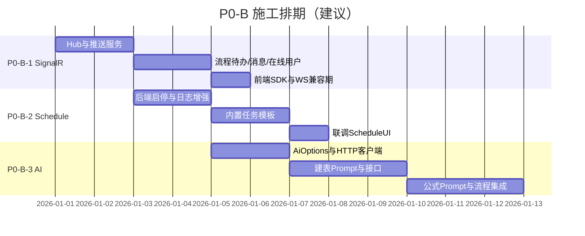
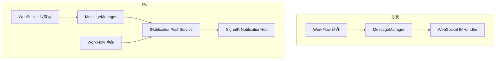
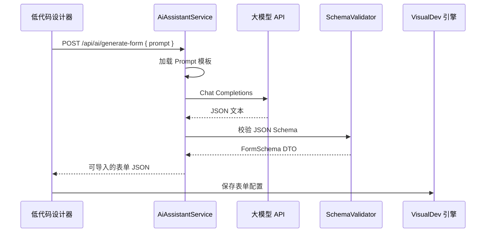

# 二期 P0-B 高感知能力技术方案与施工包（SignalR / Schedule / AI）

> **文档版本**：v1.0  
> **适用范围**：`framework/JNPF/InstantMessaging/`、`framework/JNPF/Schedule/`、`modularity/taskscheduler/`、`modularity/message/`、`modularity/inteAssistant/`、`application/JNPF.API.Entry/`  
> **对应计划**：[`01-core-framework.md`](01-core-framework.md) §8.3.2 #5–#6、§8.3.3 #10–#11  
> **工期**：约 2.5 周（SignalR 5 天 + Schedule 5 天 + AI 8 天，可部分并行）

---

## 0. 优先级定位（必读）

架构师商业价值评审结论：

| 能力 | 象限 | 8 周计划序号 | 本文档代号 |
|------|------|--------------|------------|
| SignalR 实时通知 | **A-必做** | 第二优先级 #5 | P0-B-1 |
| Schedule 定时任务完善 | **A-必做** | 第二优先级 #6 | P0-B-2 |
| AI 建表/公式 | **P1 提升**（2025 差异化） | 第三优先级 #10–#11 | P0-B-3 |

**与 P0-A 的关系**：

- **P0-A**（[`02-phase2-p0-security-implementation.md`](02-phase2-p0-security-implementation.md)）：安全基线，**必须先于或重叠后半段**完成。
- **P0-B**：架构师 **A-必做 / 商业必交付**，同属二期范围，**不是可选项**；仅在时间线上排在 P0-A 之后或并行。

**实施顺序建议**：P0-B-1 SignalR → P0-B-2 Schedule → P0-B-3 AI（AI 可与 Schedule 后端并行）。

---

## 1. 现状（源码事实）

| 能力 | 现状 | 关键路径 |
|------|------|----------|
| 实时通知 | **WebSocket** `/api/message/websocket`，`IMHandler : WebSocketHandler` | `modularity/common/JNPF.Common.Core/Handlers/IMHandler.cs` |
| 消息推送 | `MessageManager.WebSocketSend` → `_imHandler.SendMessageToUserAsync` | `modularity/message/JNPF.Message/Service/MessageManager.cs` L660-704 |
| SignalR | 框架有 `IM.GetHub`、`MapHubs()` 扫描，**宿主未 `AddSignalR`，无 Hub 实现类** | `framework/JNPF/InstantMessaging/`；`Startup.cs` 无 SignalR |
| 定时任务 | `TimeTaskService` 已有列表/日志 CRUD；`AddSchedule` + `UseScheduleUI` 已启用 | `modularity/taskscheduler/JNPF.TaskScheduler/TimeTaskService.cs` |
| AI | `InteAssistant` 集成助手 + EventBus，**无 LLM 建表/公式接口** | `modularity/inteAssistant/JNPF.InteAssistant/` |

**二期目标（MVP）**：

1. **SignalR**：统一 3 场景——流程待办推送、系统公告/消息、在线用户列表；**不**与 WebSocket 双栈长期并存（WebSocket 保留兼容期，新功能走 SignalR）。
2. **Schedule**：任务启停、执行日志、常用模板可用；与 `JNPF-Job` 库持久化稳定。
3. **AI**：自然语言 → 表单 JSON Schema；自然语言 → 流程条件表达式。

---

## 2. 施工步骤总序



---

# P0-B-1：SignalR 实时通知（5 天）

## B1.1 架构设计

#### 图 B1-1 通知通道迁移



**Hub 分组规则**：

| 组名 | 格式 | 用途 |
|------|------|------|
| 租户广播 | `tenant:{tenantId}` | 系统公告 |
| 用户 | `user:{tenantId}:{userId}` | 待办、私信 |
| 在线 | 连接时 Register | 管理后台在线列表 |

**客户端事件名（统一）**：

| 事件 | Payload | 场景 |
|------|---------|------|
| `ReceiveNotification` | `{ type, title, body, link, id }` | 消息/公告 |
| `ReceiveTodo` | `{ flowId, taskId, title }` | 流程待办 |
| `OnlineUsersChanged` | `{ users: [...] }` | 在线列表变更 |

## B1.2 步骤 B1-1：注册 SignalR（0.5 天）

### 修改 `application/JNPF.API.Entry/Startup.cs`

**ConfigureServices**（在 `AddControllers` 之前）：

```csharp
services.AddSignalR(options =>
{
    options.EnableDetailedErrors = env.IsDevelopment();
    options.KeepAliveInterval = TimeSpan.FromSeconds(15);
});
```

**Configure** → `UseEndpoints` 改为：

```csharp
app.UseEndpoints(endpoints =>
{
    endpoints.MapHubs(); // 扫描 [MapHub] 特性
    endpoints.MapControllerRoute(name: "default", pattern: "{controller=Home}/{action=Index}/{id?}");
});
```

> 现有 `MapWebSocketManager` **保留**；注释标明 `@deprecated 2026-06 移除`。

## B1.3 步骤 B1-2：新建 NotificationHub（1 天）

### 新建 `modularity/common/JNPF.Common.Core/Hubs/NotificationHub.cs`

```csharp
using JNPF.Common.Const;
using JNPF.InstantMessaging;
using Microsoft.AspNetCore.Authorization;
using Microsoft.AspNetCore.SignalR;

[MapHub("/hubs/notification")]
[Authorize]
public class NotificationHub : Hub
{
    public override async Task OnConnectedAsync()
    {
        var tenantId = Context.User?.FindFirst(ClaimConst.TENANTID)?.Value ?? "default";
        var userId = Context.User?.FindFirst(ClaimConst.CLAINMUSERID)?.Value;
        await Groups.AddToGroupAsync(Context.ConnectionId, $"tenant:{tenantId}");
        if (!string.IsNullOrEmpty(userId))
            await Groups.AddToGroupAsync(Context.ConnectionId, $"user:{tenantId}:{userId}");
        await Clients.Group($"tenant:{tenantId}").SendAsync("OnlineUsersChanged", new { action = "join", userId });
        await base.OnConnectedAsync();
    }

    public override async Task OnDisconnectedAsync(Exception exception)
    {
        var tenantId = Context.User?.FindFirst(ClaimConst.TENANTID)?.Value ?? "default";
        var userId = Context.User?.FindFirst(ClaimConst.CLAINMUSERID)?.Value;
        await Clients.Group($"tenant:{tenantId}").SendAsync("OnlineUsersChanged", new { action = "leave", userId });
        await base.OnDisconnectedAsync(exception);
    }
}
```

**JWT 与 SignalR**：前端连接需传 Token（QueryString `?access_token=` 或 Header）。在现有 `OnMessageReceived` 已支持 `?token=`，扩展：

```csharp
if (httpContext.Request.Path.StartsWithSegments("/hubs") &&
    httpContext.Request.Query.TryGetValue("access_token", out var accessToken))
{
    context.Token = accessToken;
}
```

## B1.4 步骤 B1-3：推送抽象层（1 天）

### 新建 `modularity/common/JNPF.Common.Core/Notification/INotificationPushService.cs`

```csharp
public interface INotificationPushService
{
    Task PushToUserAsync(string tenantId, string userId, string eventName, object payload);
    Task PushToTenantAsync(string tenantId, string eventName, object payload);
    Task PushTodoAsync(string tenantId, string userId, object todoPayload);
}
```

### 新建 `NotificationPushService.cs`

```csharp
public class NotificationPushService : INotificationPushService, IScoped
{
    public async Task PushToUserAsync(string tenantId, string userId, string eventName, object payload)
    {
        var hub = IM.GetHub<NotificationHub>();
        await hub.Clients.Group($"user:{tenantId}:{userId}").SendAsync(eventName, payload);
    }
    // ...
}
```

**Startup 注册**：`services.AddScoped<INotificationPushService, NotificationPushService>();`

## B1.5 步骤 B1-4：改造 MessageManager（1 天）

### 修改 `modularity/message/JNPF.Message/Service/MessageManager.cs`

1. 构造函数注入 `INotificationPushService _push`。
2. `WebSocketSend` 方法**末尾追加**（双写兼容期）：

```csharp
await _push.PushToUserAsync(_userManager.TenantId, userId, "ReceiveNotification", new {
    type = "message",
    title = messageEntity.Title,
    id = messageEntity.Id
});
```

3. 保留原 `_imHandler.SendMessageToUserAsync` 调用；配置开关 `MessageOptions.UseSignalRPrimary` 为 true 时可仅走 SignalR。

## B1.6 步骤 B1-5：流程待办接入（1 天）

**【待源码验证】**：定位 WorkFlow 模块发送待办处，搜索 `SendDefaultMsg` / `messagePush` / `MessageManager`。

典型改法：

```csharp
await _notificationPushService.PushTodoAsync(tenantId, assigneeUserId, new {
    flowId, taskId, title = taskName
});
```

**涉及表**：**BASE_MESSAGE**、流程任务表（以 WorkFlow 模块实体为准）。

## B1.7 步骤 B1-6：前端施工包（0.5 天）

| 步骤 | 文件/位置 | 动作 |
|------|-----------|------|
| 1 | 新建 `src/utils/signalr.js` | `@microsoft/signalr` 连接 `/hubs/notification?access_token=` |
| 2 | `App.vue` / 布局 mounted | `connection.start()`；监听 `ReceiveNotification` / `ReceiveTodo` |
| 3 | 通知组件 | 收到 `ReceiveTodo` → 刷新待办角标 + Element Notification |
| 4 | 在线用户（管理端） | 监听 `OnlineUsersChanged` 更新列表 |
| 5 | 兼容期 | WebSocket 仍监听 `messagePush`，与 SignalR 去重（同 id 只弹一次） |

**npm**：`npm install @microsoft/signalr`

## B1.8 SignalR 验收

| # | 用例 | 期望 |
|---|------|------|
| 1 | 用户 A 登录 SignalR | Connected，加入 user/tenant 组 |
| 2 | 给用户 A 发站内信 | A 收到 `ReceiveNotification` < 1s |
| 3 | 流程待办指派 A | A 收到 `ReceiveTodo` |
| 4 | A 断开 | 管理端在线列表减少 |
| 5 | Token 过期 | 连接断开，刷新 Token 重连 |

---

# P0-B-2：Schedule 定时任务完善（5 天）

## B2.1 现状

| 组件 | 说明 |
|------|------|
| `TimeTaskService` | `GET/POST api/scheduletask` 列表、创建、日志 `/{id}/TaskLog` |
| `AddSchedule` + `DbJobPersistence` | 持久化到 **JNPF-Job** 库 |
| `UseScheduleUI()` | 嵌入式看板（`/schedule` 路由，见框架 ScheduleUI） |
| 本地任务 | `[JobDetail]` / `[PeriodSeconds]` 特性扫描 |

**缺口（施工目标）**：

- 启停 API 与 UI 状态一致
- 执行日志可筛选、可导出
- 内置 3 个常用任务模板（备份提醒、日志清理、在线用户清理）

## B2.2 步骤 B2-1：启停 API 加固（1 天）

### 修改 `modularity/taskscheduler/JNPF.TaskScheduler/TimeTaskService.cs`

确认/新增：

| 方法 | 路由 | 行为 |
|------|------|------|
| `Pause` | `PUT {id}/Actions/Pause` | `_schedulerFactory.PauseJob(jobId)` + 更新 **BASE_TIMETASK** 状态 |
| `Resume` | `PUT {id}/Actions/Resume` | Resume + 状态 |
| `RunOnce` | `POST {id}/Actions/RunOnce` | 立即触发一次 |

**【待源码验证】**：打开 `TimeTaskService.cs` 搜索 `Pause`/`Resume`；若已有则仅补状态字段与日志。

**实体**：**BASE_TIMETASK**（`TimeTaskEntity`）、**BASE_TIMETASK_LOG**（`TimeTaskLogEntity`）。

## B2.3 步骤 B2-2：执行日志增强（1 天）

### 修改 `GetTaskLogList`

- 增加 `keyword` 搜索异常信息
- 返回字段增加 `durationMs`、`exceptionStack`（若表无字段则 **BASE_TIMETASK_LOG** 增列 `F_DURATION_MS` int、`F_EXCEPTION` nvarchar(max)）

**SQL 迁移脚本** `scripts/phase2/001_timetask_log_columns.sql`：

```sql
IF NOT EXISTS (SELECT 1 FROM sys.columns WHERE object_id = OBJECT_ID('BASE_TIMETASK_LOG') AND name = 'F_DURATION_MS')
    ALTER TABLE BASE_TIMETASK_LOG ADD F_DURATION_MS INT NULL;
IF NOT EXISTS (SELECT 1 FROM sys.columns WHERE object_id = OBJECT_ID('BASE_TIMETASK_LOG') AND name = 'F_EXCEPTION')
    ALTER TABLE BASE_TIMETASK_LOG ADD F_EXCEPTION NVARCHAR(MAX) NULL;
```

### 修改 `Listener/ScheduleJob.cs`

在 `try/finally` 记录耗时与异常栈写入 **BASE_TIMETASK_LOG**。

## B2.4 步骤 B2-3：内置任务模板（2 天）

### 新建 `modularity/taskscheduler/JNPF.TaskScheduler/Templates/BuiltInJobTemplates.cs`

| 模板 ID | 名称 | Cron | 执行类 |
|---------|------|------|--------|
| `tpl_log_cleanup` | 清理 90 天前请求日志 | `0 0 2 * * ?` | 调 `SysLogService` 删除 Type=5 旧数据 |
| `tpl_online_user_sync` | 同步在线用户缓存 | `0 */5 * * * ?` | 复用 `OnlineUserJob` |
| `tpl_contract_remind` | 合同到期提醒（示例） | `0 0 9 * * ?` | 调数据接口或占位 Demo |

### 新建 API `GET api/scheduletask/Templates`

返回模板列表；`POST api/scheduletask/FromTemplate/{templateId}` 一键创建 **BASE_TIMETASK** + Schedule 注册。

## B2.5 步骤 B2-4：ScheduleUI 与管理端联调（1 天）

| 步骤 | 动作 |
|------|------|
| 1 | 访问 ScheduleUI（默认 `/schedule`，以 `UseScheduleUI` 为准）确认 Job 列表与 DB 一致 |
| 2 | 管理端「定时任务」菜单对接 `TimeTaskService` 启停按钮 |
| 3 | 执行日志页对接 `/{id}/TaskLog` 分页 |

**前端字段映射**（`TimeTaskListOutput`）：

- `enabledMark` ↔ 启停
- `executeContent` ↔ Cron/执行说明
- `lastRunTime` ↔ 最近执行

## B2.6 Schedule 验收

| # | 用例 | 期望 |
|---|------|------|
| 1 | 从模板创建「日志清理」 | **BASE_TIMETASK** 有记录，Schedule 注册成功 |
| 2 | 暂停任务 | 下一 Cron 不触发 |
| 3 | 恢复任务 | 按 Cron 触发 |
| 4 | 手动 RunOnce | 日志新增一条 |
| 5 | 失败任务 | 日志含 F_EXCEPTION |

---

# P0-B-3：AI 辅助建表 / 公式（8 天）

## B3.1 架构



## B3.2 步骤 B3-1：配置与 HTTP 客户端（1 天）

### 新建 `application/JNPF.API.Entry/Configurations/AiAssistant.json`

```json
{
  "AiAssistant": {
    "Enabled": true,
    "Provider": "OpenAICompatible",
    "Endpoint": "https://api.openai.com/v1/chat/completions",
    "ApiKey": "【部署时填写，勿提交仓库】",
    "Model": "gpt-4o-mini",
    "TimeoutSeconds": 60,
    "MaxTokens": 4096
  }
}
```

> 国内可换通义/文心/DeepSeek 等 **OpenAI 兼容** Endpoint。

### 新建 `modularity/inteAssistant/JNPF.InteAssistant.Entitys/Options/AiAssistantOptions.cs`

`AddConfigurableOptions<AiAssistantOptions>()` in Startup。

### 新建 `modularity/inteAssistant/JNPF.InteAssistant/Ai/OpenAiCompatibleClient.cs`

使用现有 `JNPF.RemoteRequest` 或 `HttpClient` POST JSON。

## B3.3 步骤 B3-2：AiAssistantService（2 天）

### 新建 `modularity/inteAssistant/JNPF.InteAssistant/AiAssistantService.cs`

```csharp
[ApiDescriptionSettings(Tag = "AiAssistant", Name = "Ai", Order = 50)]
[Route("api/[controller]")]
public class AiAssistantService : IDynamicApiController, ITransient
{
    [HttpPost("generate-form")]
    public async Task<AiGenerateFormOutput> GenerateForm([FromBody] AiGenerateFormInput input)
    {
        // 1. SensitiveDetection 过滤用户 prompt（复用 framework SensitiveDetection）
        // 2. 组装 Prompt（见 B3.4）
        // 3. 调 LLM
        // 4. JsonSchema 校验 + 字段类型白名单
        // 5. 写审计日志 BASE_SYS_LOG 或新表 BASE_AI_CALL_LOG
    }

    [HttpPost("generate-condition")]
    public async Task<AiGenerateConditionOutput> GenerateCondition([FromBody] AiGenerateConditionInput input)
    {
        // 输出流程引擎可执行的表达式字符串
    }
}
```

**输入/输出 DTO** 放 `JNPF.InteAssistant.Entitys/Dto/Ai/`。

## B3.4 步骤 B3-3：Prompt 工程（2 天）

### 新建 `modularity/inteAssistant/JNPF.InteAssistant/Ai/Prompts/form-schema.prompt.txt`

要点：

- 角色：低代码表单设计助手
- 输出：**仅 JSON**，符合 VisualDev 表单 JSON 结构（从现有导出表单抽 1 份样例贴入 Prompt）
- 字段类型白名单：`input`、`textarea`、`select`、`date`、`number`、`uploadImg` 等（与 VisualDev 控件 enum 对齐）

### 新建 `condition-expression.prompt.txt`

- 输入：自然语言 + 可选字段列表 `[{ name, type }]`
- 输出：平台条件表达式（【待源码验证】：引用 WorkFlow 条件语法，如 `{field} > 100000` 或 JS 表达式格式）

**样例获取**：在 VisualDev 设计器导出一份真实表单 JSON 脱敏后放入 `Prompts/samples/form-sample.json`。

## B3.5 步骤 B3-4：输出校验（1 天）

### 新建 `AiFormSchemaValidator.cs`

| 校验项 | 规则 |
|--------|------|
| 根结构 | 必含 `fields` 数组 |
| 字段 | 必有 `__vModel__`、`__config__.label`、`__config__.jnpfKey` |
| 安全 | 禁止 `<script>`、SQL 关键字 |
| 大小 | 字段数 ≤ 50 |

校验失败 → 返回 400 + LLM 原始文本供人工修正（不自动入库）。

## B3.6 步骤 B3-5：流程设计器集成（2 天）

| 步骤 | 位置 | 动作 |
|------|------|------|
| 1 | 流程条件配置面板 | 增加「AI 生成」按钮 |
| 2 | 弹窗输入自然语言 | 调 `POST /api/Ai/generate-condition` |
| 3 | 回填表达式输入框 | 用户确认后保存 |
| 4 | 建表向导 | VisualDev 新建表单页「AI 建表」|

**后端无需改 VisualDev Engine**；仅前端拿 JSON 调用现有「导入表单」API（【待源码验证】：`VisualDevService` 导入接口路径）。

## B3.7 审计与限流

| 项 | 实现 |
|----|------|
| 调用审计 | 表 **BASE_AI_CALL_LOG**（F_USER_ID, F_PROMPT_HASH, F_TOKENS, F_TIME） |
| 租户限流 | 每用户每天 N 次（Redis `jnpf:ai:quota:{userId}:{yyyyMMdd}` Incr） |
| 敏感词 | 调用前 `SensitiveDetection` |

## B3.8 AI 验收

| # | 用例 | 期望 |
|---|------|------|
| 1 | Prompt「客户姓名、电话、公司名称」 | 返回 ≥3 字段合法 JSON |
| 2 | Prompt 含违禁词 | 拦截 |
| 3 | 「金额大于10万总经理审批」 | 返回可解析条件表达式 |
| 4 | 超配额 | 429 友好提示 |
| 5 | LLM 超时 | 504 + 可重试 |

---

## 3. P0-B 总回归清单

| 模块 | 场景 | 通过 |
|------|------|------|
| SignalR | 站内信实时 | ☐ |
| SignalR | 流程待办 | ☐ |
| SignalR | 在线用户 | ☐ |
| SignalR | Token 鉴权 | ☐ |
| Schedule | 模板创建 | ☐ |
| Schedule | 启停 | ☐ |
| Schedule | 失败日志 | ☐ |
| AI | 建表 JSON | ☐ |
| AI | 条件表达式 | ☐ |
| 兼容 | WebSocket 旧客户端仍可用 | ☐ |

---

## 4. 涉及数据库表

| 表名 | 模块 |
|------|------|
| **BASE_TIMETASK** | 定时任务定义 |
| **BASE_TIMETASK_LOG** | 执行日志 |
| **BASE_MESSAGE** | 站内信（推送来源） |
| **BASE_AI_CALL_LOG** | AI 调用审计（新建） |
| **JNPF-Job** 库 Job 表 | Schedule 持久化（框架 DbJobPersistence） |

## 5. 改造文件索引

| 路径 | 模块 |
|------|------|
| `application/JNPF.API.Entry/Startup.cs` | SignalR 注册 |
| `modularity/common/JNPF.Common.Core/Hubs/NotificationHub.cs` | 新建 |
| `modularity/common/JNPF.Common.Core/Notification/NotificationPushService.cs` | 新建 |
| `modularity/message/JNPF.Message/Service/MessageManager.cs` | 双写推送 |
| `modularity/taskscheduler/JNPF.TaskScheduler/TimeTaskService.cs` | Schedule |
| `modularity/taskscheduler/JNPF.TaskScheduler/Listener/ScheduleJob.cs` | 日志 |
| `modularity/inteAssistant/JNPF.InteAssistant/AiAssistantService.cs` | AI |
| `application/JNPF.API.Entry/Configurations/AiAssistant.json` | AI 配置 |

---

## 6. 与 P0-A 的联调点

| P0-A 能力 | P0-B 依赖 |
|-----------|-----------|
| Token 吊销 | SignalR 连接使用 JWT；用户禁用后 Hub 应断开（`OnTokenValidated` 失败即断连） |
| API 权限 | `/api/Ai/*`、`/api/scheduletask/*` 需纳入权限矩阵 |
| 防重复提交 | AI 生成接口、任务「RunOnce」建议加 `X-Idempotency-Key` |

---

*文档遵循 [`docs/ARCHITECTURE_DOC_RULES.md`](../ARCHITECTURE_DOC_RULES.md)。*
