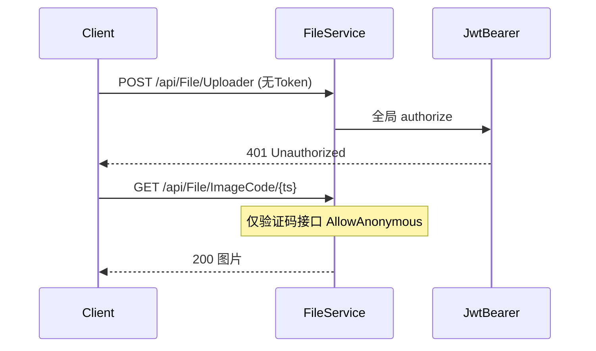
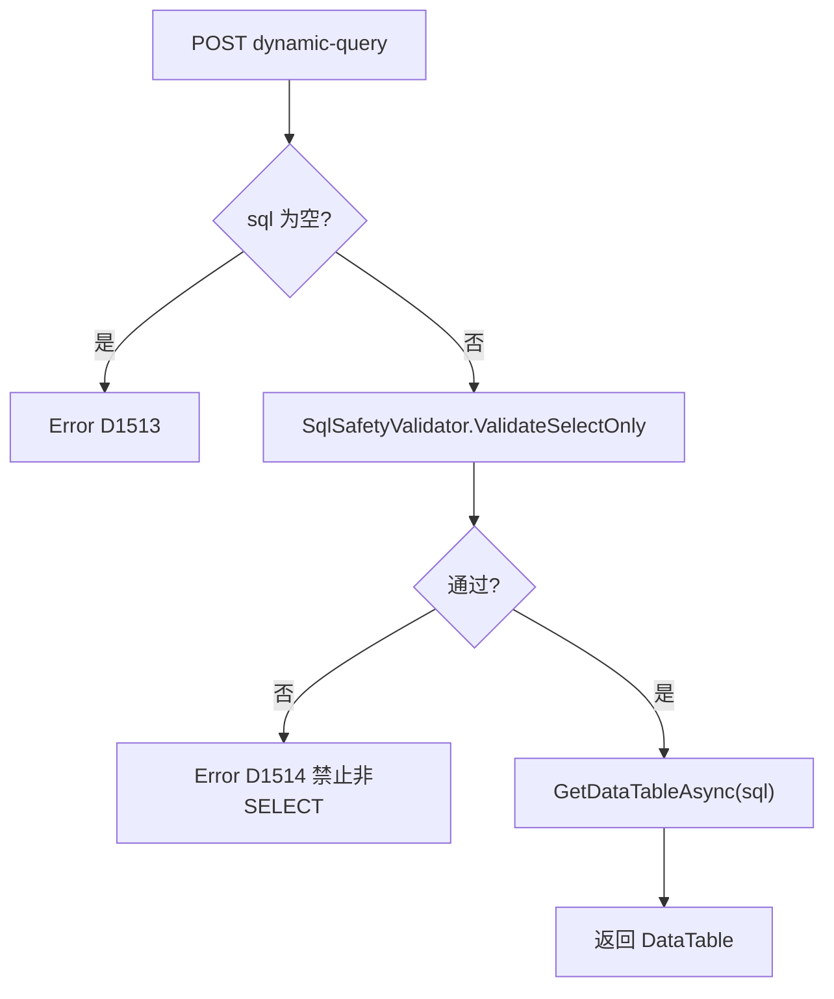

# 高危安全漏洞紧急修复 — 开发计划与施工包

> **文档版本**：v1.0  
> **适用范围**：`modularity/system/`、`modularity/visualdata/`、`modularity/visualdev/`、`modularity/extend/`、`modularity/common/JNPF.Common.Core/`  
> **对应审查**：[`02-application-services-review.md`](02-application-services-review.md) §2.7 Top 5 + 高危项  
> **工期**：**3 个工作日**（可与 P0-A 第 1 周并行，**必须先于生产发布**）  
> **与 P0-A 关系**：本文档解决 **可被直接利用的漏洞**；[`02-phase2-p0-security-implementation.md`](02-phase2-p0-security-implementation.md) 解决 **安全基线能力建设**（Token 吊销/API 权限/AES/防重）。**两者并行，本文档优先级更高。**

---

## 0. 执行优先级

| 顺序 | 代号 | 漏洞 | CVSS 类比 | 工期 |
|------|------|------|-----------|------|
| **Day 1 AM** | H1 | FileService 匿名上传 | 严重 | 2h |
| **Day 1 AM** | H2 | 文件下载路径穿越 | 严重 | 3h |
| **Day 1 PM** | H3 | 大屏 dynamic-query 任意 SQL | 严重 | 4h |
| **Day 2 AM** | H4 | DataInterface SQL 参数注入 | 高 | 4h |
| **Day 2 PM** | H5 | extend 模块数据权限缺失 | 高 | 3h |
| **Day 3 AM** | H6 | RoleService 权限缓存不失效 | 高 | 3h |
| **Day 3 PM** | H7 | RunService 拼接 SQL（Phase-1 热点） | 高 | 4h |
| **Day 3 PM** | REG | 回归测试 | — | 2h |


---

## 1. 总览

### 1.1 漏洞清单与验收标准

| # | 漏洞 | 源码位置 | 验收标准 |
|---|------|----------|----------|
| H1 | 类级 `[AllowAnonymous]` 导致未登录可上传 | `FileService.cs` L34、L307–393 | 未带 Token 调用 `POST api/File/Uploader` 返回 **401** |
| H2 | `fileName` 未净化，`../` 可读任意文件 | `FileService.cs` L122–126、L159–166 | `GET api/File/Image/annexpic/..%2F..%2Fweb.config` 返回 **403/404** |
| H3 | `input.sql` 直接 `GetDataTableAsync` | `ScreenDataSourceService.cs` L167–186 | 传入 `DROP TABLE` 被拒绝；仅允许 SELECT |
| H4 | formdata 直替 SQL 占位符 | `DataInterfaceService.cs` L1090–1093 | 注入 `' OR 1=1--` 无效 |
| H5 | extend 列表无数据权限 | `BigDataService`·`EmployeeService` 等 | 非管理员仅见授权范围数据 |
| H6 | 角色变更仅清当前用户缓存 | `RoleService.cs` L679、L704 | 改角色后关联用户下次请求权限已更新 |
| H7 | RunService `string.Format` 拼 SQL | `RunService.cs` 多处 | 详情查询参数化，单引号注入无效 |

### 1.2 本节核心表清单

| 表名 | 说明 |
|------|------|
| **BASE_ROLE** | 角色变更触发缓存失效 |
| **BASE_USER_RELATION** | 角色-用户关联，用于批量清缓存 |
| **BASE_AUTHORIZE** | 权限绑定 |

### 1.3 本节关键代码路径索引

| 路径 | 说明 |
|------|------|
| `modularity/system/JNPF.Systems/Common/FileService.cs` | H1/H2 |
| `modularity/common/JNPF.Common.Core/Manager/Files/FileManager.cs` | H2 路径校验工具 |
| `modularity/visualdata/JNPF.VisualData/ScreenDataSourceService.cs` | H3 |
| `modularity/system/JNPF.Systems/System/DataInterfaceService.cs` | H4 |
| `modularity/extend/JNPF.Extend/*.cs` | H5 |
| `modularity/system/JNPF.Systems/Permission/RoleService.cs` | H6 |
| `modularity/visualdev/JNPF.VisualDev/RunService.cs` | H7 |

---

## 步骤 H1：移除 FileService 类级匿名访问（2h）

### H1.1 设计



### H1.2 修改 `FileService.cs`

**① 删除类级 `[AllowAnonymous]`**（L34）：

```csharp
// 删除此行
// [AllowAnonymous]
public class FileService : IFileService, IDynamicApiController, ITransient
```

**② 删除方法级重复 `[AllowAnonymous]`**（L307–308、L352–353、L372–374、L387–389），上传/分片/合并 **默认需登录**。

**③ 仅保留验证码匿名**（L147 附近保持不变）：

```csharp
[HttpGet("ImageCode/{timestamp}")]
[AllowAnonymous]  // ★ 仅此接口 + 必要时 KKFile 回调
[NonUnify]
public async Task<IActionResult> GetCode(string timestamp) { ... }
```

**④ 若前端登录页需上传头像**：改为 **登录后** 调用 `Uploader/userAvatar`，或 OAuth 登录流程内专用接口（带临时 Token）。

### H1.3 回归用例

| 用例 | 预期 |
|------|------|
| 无 Token `POST api/File/Uploader/annex` | 401 |
| 有 Token 上传 `.pdf` | 200 |
| 无 Token `GET api/File/ImageCode/123` | 200 |

---

## 步骤 H2：文件路径穿越防护（3h）

### H2.1 新建 `FilePathSecurityHelper.cs`

**路径**：`modularity/common/JNPF.Common.Core/Manager/Files/FilePathSecurityHelper.cs`

```csharp
namespace JNPF.Common.Core.Manager.Files;

public static class FilePathSecurityHelper
{
    /// <summary>
    /// 校验 fileName 不含路径成分，且最终路径在 baseDirectory 内.
    /// </summary>
    public static string ResolveSafeFilePath(string baseDirectory, string fileName)
    {
        if (string.IsNullOrWhiteSpace(fileName))
            throw Oops.Oh(ErrorCode.D8000);

        // 前端 @ 代替 . 的约定保留
        var safeName = fileName.Replace("@", ".");
        safeName = Path.GetFileName(safeName); // 剥离 ../ 等

        if (string.IsNullOrWhiteSpace(safeName))
            throw Oops.Oh(ErrorCode.D8000);

        var baseFull = Path.GetFullPath(baseDirectory);
        var targetFull = Path.GetFullPath(Path.Combine(baseFull, safeName));

        if (!targetFull.StartsWith(baseFull, StringComparison.OrdinalIgnoreCase))
            throw Oops.Oh(ErrorCode.D1806); // 路径非法

        return targetFull;
    }
}
```

### H2.2 修改 `FileService.cs`

**`GetImg`（L122–126）**：

```csharp
[HttpGet("Image/{type}/{fileName}")]
public async Task<IActionResult> GetImg(string type, string fileName)
{
    var baseDir = GetPathByType(type);
    var filePath = FilePathSecurityHelper.ResolveSafeFilePath(baseDir, fileName);
    return await _fileManager.DownloadFileByType(filePath, Path.GetFileName(fileName.Replace("@", ".")));
}
```

**`FileDown`（L159–166）**：

```csharp
var baseDir = type.IsNotEmptyOrNull() ? _fileManager.GetPathByType(type) : FileVariable.SystemFilePath;
var systemFilePath = FilePathSecurityHelper.ResolveSafeFilePath(baseDir, fileName);
```

**`Download`（L252 附近）**：对解密后的 `fileName` 同样调用 `ResolveSafeFilePath`。

### H2.3 修改 `FileManager.Merge`（L421–457）

合并完成后复用 `AllowFileType`（与 `FileService` 共享扩展名白名单常量，抽到 `KeyVariable.AllowedUploadExtensions`）。

### H2.4 回归用例

| 用例 | 预期 |
|------|------|
| `GET api/File/Image/annexpic/..%2F..%2Fappsettings.json` | 403/业务错误码 |
| 正常文件名 `test@pdf` | 200 下载 |

---

## 步骤 H3：大屏 dynamic-query SQL 白名单（4h）

### H3.1 设计

禁止执行用户传入的任意 SQL；仅允许 **以 SELECT 开头** 的语句，且禁止多语句（`;`）。

#### 图 H3-1 SQL 校验流程



### H3.2 新建 `SqlSafetyValidator.cs`

**路径**：`modularity/common/JNPF.Common/Security/SqlSafetyValidator.cs`

```csharp
namespace JNPF.Common.Security;

public static class SqlSafetyValidator
{
    private static readonly Regex Forbidden = new(
        @"\b(DROP|DELETE|UPDATE|INSERT|ALTER|TRUNCATE|EXEC|EXECUTE|xp_|sp_|;\s*\w)\b",
        RegexOptions.IgnoreCase | RegexOptions.Compiled);

    public static void ValidateSelectOnly(string sql)
    {
        if (string.IsNullOrWhiteSpace(sql))
            throw Oops.Oh(ErrorCode.D1513);

        var trimmed = sql.Trim();
        if (!trimmed.StartsWith("SELECT", StringComparison.OrdinalIgnoreCase))
            throw Oops.Oh(ErrorCode.D1514); // 需在 ErrorCode 枚举新增

        if (Forbidden.IsMatch(trimmed))
            throw Oops.Oh(ErrorCode.D1514);

        if (trimmed.Contains(';'))
            throw Oops.Oh(ErrorCode.D1514);
    }
}
```

### H3.3 修改 `ScreenDataSourceService.Query`（L167–186）

```csharp
[HttpPost("dynamic-query")]
public async Task<dynamic> Query([FromBody] ScreenDataSourceDynamicQueryInput input)
{
    if (input.sql.IsNullOrEmpty()) throw Oops.Oh(ErrorCode.D1513);
    SqlSafetyValidator.ValidateSelectOnly(input.sql);
    // ... 原有连接逻辑不变
    return await _sqlSugarClient.Ado.GetDataTableAsync(input.sql);
}
```

**建议**：数据源账号使用 **只读 DB 用户**（运维配置 `BLADE_VISUAL_DB` 连接串）。

### H3.4 回归用例

| SQL | 预期 |
|-----|------|
| `SELECT 1` | 200 |
| `DROP TABLE BASE_USER` | 业务错误 |
| `SELECT 1; DELETE FROM BASE_USER` | 业务错误 |

---

## 步骤 H4：DataInterface 参数注入防护（4h）

### H4.1 修改 `DataInterfaceService.ReplaceSqlParameter`（L1090 附近）

**原则**：占位符替换值必须经 **类型校验 + 转义**，禁止 `formdata.ToString()` 整体替换。

```csharp
private void ReplaceSqlParameter(DataInterfacePreviewInput input, List<SugarParameter> parameters, ...)
{
    foreach (var item in parameterList)
    {
        var raw = input.formData?.ContainsKey(item.field) == true
            ? input.formData[item.field]?.ToString()
            : item.defaultValue;

        // ★ 新增：按 item.dataType 校验
        raw = SqlParameterSanitizer.Sanitize(raw, item.dataType);
        item.defaultValue = raw;

        parameters.Add(new SugarParameter("@" + item.field, raw));
    }
}
```

### H4.2 新建 `SqlParameterSanitizer.cs`

**路径**：`modularity/common/JNPF.Common/Security/SqlParameterSanitizer.cs`

```csharp
public static class SqlParameterSanitizer
{
    public static string Sanitize(string? value, string dataType)
    {
        if (value == null) return string.Empty;
        return dataType?.ToLower() switch
        {
            "int" or "number" => int.TryParse(value, out _) ? value : throw Oops.Oh(ErrorCode.D9001),
            "datetime" => DateTime.TryParse(value, out _) ? value : throw Oops.Oh(ErrorCode.D9001),
            _ => value.Replace("'", "''") // 字符串最小转义；最终仍走 SugarParameter
        };
    }
}
```

### H4.3 修改 `GetSqlData`（L1040+）

确保 **所有** 动态 SQL 通过 `SugarParameter` 执行，禁止 `Ado.GetDataTable(sql.Replace("@x", value))` 模式。

---

## 步骤 H5：extend 模块数据权限补全（3h）

### H5.1 范围

| Service | 方法 | 修改 |
|---------|------|------|
| `BigDataService` | `GetList` L45–58 | 加 `CreatorUserId == _userManager.UserId` 或 `[Authorize(Roles="admin")]` |
| `EmployeeService` | `GetList`/`GetInfo` | 调用 `_userManager.GetConditionAsync`（需配置 moduleId） |
| `ProductService` | `GetInfo`/`GetAllProductEntryList` | 同上 + 校验记录归属 |

### H5.2 模板代码（以 EmployeeService 为例）

```csharp
public async Task<dynamic> GetList([FromQuery] PageInputBase input)
{
    var query = _repository.AsQueryable().Where(x => x.DeleteMark == null);
    // ★ 若模块已在 BASE_MODULE 注册，传入 moduleId
    var conModels = await _userManager.GetConditionAsync<EmployeeEntity>(moduleId, "F_Id", true);
    query = query.Where(conModels);
    return PageResult<EmployeeListOutput>.SqlSugarPageResult(
        await query.ToPagedListAsync(input.currentPage, input.pageSize));
}
```

### H5.3 长期（记入 P0-A 后迭代）

代码生成器模板 `application/JNPF.API.Entry/wwwroot/Template/` 列表查询默认插入 `GetConditionAsync`。

---

## 步骤 H6：RoleService 权限缓存批量失效（3h）

### H6.1 修改 `RoleService.Update` / `UpdateState`（L679、L704）

```csharp
private async Task InvalidateRoleUsersCacheAsync(string roleId)
{
    var userIds = await _repository.AsSugarClient()
        .Queryable<UserRelationEntity>()
        .Where(x => x.ObjectId == roleId && x.ObjectType == "Role")
        .Select(x => x.UserId)
        .ToListAsync();

    var tenantId = _userManager.TenantId;
    foreach (var uid in userIds)
    {
        await _cacheManager.DelAsync(string.Format("{0}{1}_{2}", CommonConst.CACHEKEYROLE, tenantId, uid));
        await _cacheManager.DelAsync(string.Format("{0}{1}_{2}", CommonConst.CACHEKEYPERMISSION, tenantId, uid));
    }

    // ★ 恢复强制下线（L655 取消注释）或写 userban（对接 P0-A Token 吊销）
    // await ForcedOffline(roleId);
}
```

在 `Update`/`UpdateState` 末尾 `await InvalidateRoleUsersCacheAsync(entity.Id)`。

---

## 步骤 H7：RunService SQL 参数化 Phase-1（4h）

### H7.1 范围（本阶段仅只读热点）

优先改造 **对外暴露的详情/列表查询** 中带 `formData["id"]` 拼接的路径：

| 行号区间 | 场景 |
|----------|------|
| L1872 | `select ... where f_inte_assistant=1` |
| L2679–2680 | 详情查询 |
| L3729 | 关联查询 |

### H7.2 改造模式

**改造前**：

```csharp
var sql = string.Format("select {0} from {1} where {2}='{3}'", fields, table, pk, id);
```

**改造后**：

```csharp
// 表名/列名来自模板元数据白名单（templateInfo 内），值走参数
var sql = $"SELECT {fields} FROM {table} WHERE {pk}=@id";
var dt = await _sqlSugarClient.Ado.GetDataTableAsync(sql, new { id });
```

**表名/列名** 必须来自 `templateInfo` 元数据，**禁止**用户输入拼入标识符。

### H7.3 Phase-2（记入后续迭代）

`update`/`delete` 批量 SQL（L1108–1346）在 VisualDev 大版本重构时统一改为 SqlSugar `Updateable`/`Deleteable`。

---

## 步骤 REG：回归测试清单

| # | 场景 | 通过标准 |
|---|------|----------|
| 1 | 未登录上传 | 401 |
| 2 | 路径穿越下载 | 拒绝 |
| 3 | 大屏 DROP SQL | 拒绝 |
| 4 | 数据接口 OR 注入 | 无异常数据 |
| 5 | extend 跨用户列表 | 不可见他人数据 |
| 6 | 改角色后旧权限用户 | 403 或数据缩小 |
| 7 | 低代码详情单引号 id | 无 SQL 异常 |
| 8 | 登录后正常上传/下载 | 200 |

---

## 本节核心表清单

| 表名 | 说明 |
|------|------|
| **BASE_USER_RELATION** | H6 角色-用户 |
| **BASE_MODULE** | H5 数据权限 moduleId |
| **BLADE_VISUAL_DB** | H3 大屏数据源 |

## 本节关键代码路径索引

| 路径 | 步骤 |
|------|------|
| `modularity/system/JNPF.Systems/Common/FileService.cs` | H1/H2 |
| `modularity/common/JNPF.Common.Core/Manager/Files/FilePathSecurityHelper.cs` | H2 新建 |
| `modularity/common/JNPF.Common/Security/SqlSafetyValidator.cs` | H3 新建 |
| `modularity/visualdata/JNPF.VisualData/ScreenDataSourceService.cs` | H3 |
| `modularity/common/JNPF.Common/Security/SqlParameterSanitizer.cs` | H4 新建 |
| `modularity/system/JNPF.Systems/System/DataInterfaceService.cs` | H4 |
| `modularity/extend/JNPF.Extend/EmployeeService.cs` | H5 |
| `modularity/system/JNPF.Systems/Permission/RoleService.cs` | H6 |
| `modularity/visualdev/JNPF.VisualDev/RunService.cs` | H7 |

---

*文档遵循 [`docs/ARCHITECTURE_DOC_RULES.md`](../ARCHITECTURE_DOC_RULES.md)。*
