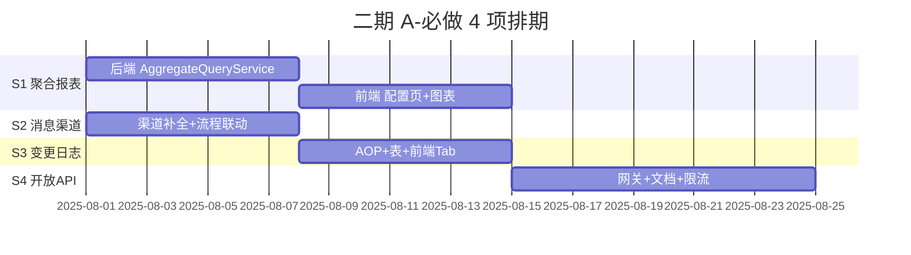
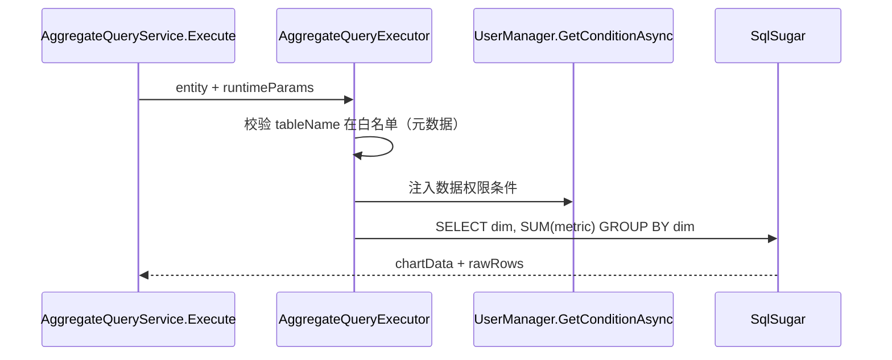
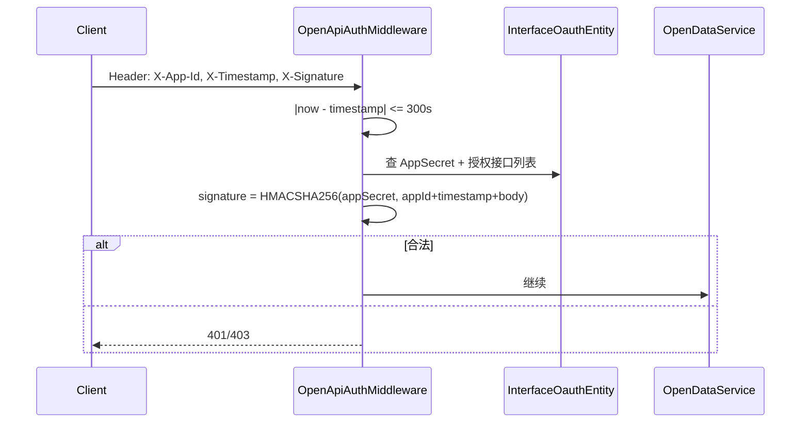

# 二期 A-必做应用服务 — 开发计划与施工包

> **文档版本**：v1.0  
> **适用范围**：`modularity/system/`、`modularity/visualdev/`、`modularity/message/`、`modularity/common/`、`application/JNPF.API.Entry/`  
> **对应审查**：[`02-application-services-review.md`](02-application-services-review.md) §3.2 A-必做 S1–S4  
> **总工期**：约 **4 周**（S2/S3 可与 S1 并行；S4 依赖 S2 部分能力）  
> **前置**：高危漏洞修复完成（[`04-hotfix-critical-security-implementation.md`](04-hotfix-critical-security-implementation.md)）；P0-A 步骤 2 API 权限建议完成后再做 S4

---

## 0. 总排期

| 周次 | 并行轨道 A | 并行轨道 B | 交付 |
|------|------------|------------|------|
| **W1** | S1 聚合报表 后端 | S2 消息渠道 后端 | AggregateQueryService API |
| **W2** | S1 聚合报表 前端 | S3 变更日志 后端+前端 | 报表配置页 + 变更 Tab |
| **W3** | S4 开放 API 网关 | S2 流程联动联调 | OpenApi 文档 + 鉴权 |
| **W4** | 全量回归 + 缺陷修复 | — | 二期 A 验收 |



### 0.1 四格符合性摘要

| 项 | Q1 | Q2 | Q3 | Q4 |
|----|----|----|----|-----|
| S1 聚合报表 | 高 | 高 | 中 | 是 |
| S2 消息渠道 | 高 | 高 | 低 | 是 |
| S3 变更日志 | 高 | 高 | 低 | 否 |
| S4 开放 API | 中-高 | 高 | 中 | 是 |

---

## S1 · 数据聚合/汇总报表（2 周）

### S1.1 现状

| 项 | 现状 |
|----|------|
| 列表查询 | `RunService` / `VisualDevModelDataService` 支持分页列表 |
| 汇总 | **无** GROUP BY / SUM / COUNT 配置化能力 |
| 图表 | `JNPF.VisualData` 大屏有 ECharts，但缺业务聚合数据源 |
| 导出 | `ExcelExportHelper` 已有 |

### S1.2 交付物

| # | 交付物 | 验收标准 |
|---|--------|----------|
| 1 | `AggregateQueryService` | 配置化 GROUP BY + 聚合函数 |
| 2 | 表 **BASE_AGGREGATE_QUERY** | 存聚合方案 JSON |
| 3 | 前端「聚合报表」设计器 | 选表/维度/度量/图表类型 |
| 4 | 运行时查询 API | 返回 `{ dimensions, metrics, chartData }` |
| 5 | 导出 Excel | 复用 `ExcelExportHelper` |

### S1.3 数据模型

**表 BASE_AGGREGATE_QUERY**（新建）：

| 字段 | 类型 | 说明 |
|------|------|------|
| F_ID | varchar(50) PK | 雪花 Id |
| F_FULL_NAME | nvarchar(200) | 方案名称 |
| F_EN_CODE | varchar(100) | 编码 |
| F_MODULE_ID | varchar(50) | 关联 **BASE_MODULE** / VisualDev Id |
| F_TABLE_NAME | varchar(100) | 主表名（白名单校验） |
| F_CONFIG_JSON | nvarchar(max) | 维度/度量/筛选/图表配置 |
| F_ENABLED_MARK | int | 启用 |
| F_SORT_CODE | bigint | 排序 |
| + 标准审计字段 | | Creator/Modify/Delete |

**F_CONFIG_JSON 结构示例**：

```json
{
  "dimensions": [{ "field": "F_DEPARTMENT", "label": "部门" }],
  "metrics": [{ "field": "F_AMOUNT", "func": "SUM", "label": "金额合计" }],
  "filters": [{ "field": "F_CREATOR_TIME", "op": ">=", "value": "@monthStart" }],
  "chartType": "bar",
  "orderBy": { "field": "SUM_F_AMOUNT", "dir": "DESC" }
}
```

### S1.4 施工步骤

#### 步骤 S1-1：建表 SQL（0.5 天）

**文件**：`application/JNPF.API.Entry/Sql/Phase2_S1_BASE_AGGREGATE_QUERY.sql`

```sql
IF NOT EXISTS (SELECT 1 FROM sys.tables WHERE name = 'BASE_AGGREGATE_QUERY')
CREATE TABLE BASE_AGGREGATE_QUERY (
    F_ID varchar(50) NOT NULL PRIMARY KEY,
    F_FULL_NAME nvarchar(200) NULL,
    F_EN_CODE varchar(100) NULL,
    F_MODULE_ID varchar(50) NULL,
    F_TABLE_NAME varchar(100) NULL,
    F_CONFIG_JSON nvarchar(max) NULL,
    F_ENABLED_MARK int NULL,
    F_SORT_CODE bigint NULL,
    F_CREATOR_USER_ID varchar(50) NULL,
    F_CREATOR_TIME datetime NULL,
    F_LAST_MODIFY_USER_ID varchar(50) NULL,
    F_LAST_MODIFY_TIME datetime NULL,
    F_DELETE_MARK int NULL,
    F_DELETE_TIME datetime NULL,
    F_DELETE_USER_ID varchar(50) NULL
);
```

#### 步骤 S1-2：实体 + Service（2 天）

**新建**：
- `modularity/system/JNPF.Systems.Entitys/Entity/System/AggregateQueryEntity.cs`
- `modularity/system/JNPF.Systems/ System/AggregateQueryService.cs`
- `modularity/system/JNPF.Systems.Entitys/Dto/System/AggregateQuery/*.cs`

**路由**：`api/system/AggregateQuery`

**核心方法**：

| 方法 | HTTP | 说明 |
|------|------|------|
| `GetList` | GET | 方案列表 |
| `GetInfo` | GET `{id}` | 方案详情 |
| `Create` | POST | 新建 |
| `Update` | PUT `{id}` | 更新 |
| `Delete` | DELETE `{id}` | 删除 |
| `Execute` | POST `{id}/Actions/Execute` | **运行时聚合查询** |
| `Export` | POST `{id}/Actions/Export` | 导出 Excel |

#### 步骤 S1-3：聚合引擎 `AggregateQueryExecutor`（2 天）

**路径**：`modularity/common/JNPF.Common.Core/Manager/Aggregate/AggregateQueryExecutor.cs`

**逻辑**：



**关键约束**：
1. `F_TABLE_NAME`、维度/度量字段必须存在于 **VisualDev 表元数据** 或 `DataBaseService` 字段列表中。
2. 聚合函数白名单：`SUM`/`COUNT`/`AVG`/`MAX`/`MIN`。
3. 必须调用 `UserManager.GetConditionAsync(moduleId, primaryKey, true)`。
4. 禁止用户传入原始 SQL。

**Execute 伪代码**：

```csharp
public async Task<AggregateExecuteOutput> ExecuteAsync(
    AggregateQueryEntity scheme, Dictionary<string, object> runtimeParams)
{
    var config = scheme.ConfigJson.ToObject<AggregateConfigModel>();
    TableMetadataValidator.Validate(scheme.TableName, config.AllFields);

    var query = _db.Queryable<object>().AS(scheme.TableName);
    var conModels = await _userManager.GetConditionAsync<Dictionary<string, object>>(
        scheme.ModuleId, config.PrimaryKey, true);
    query = query.Where(conModels);

    // SqlSugar GroupBy + Select 构建
    var list = await query.GroupBy(config.DimensionFields)
        .Select(BuildSelect(config.Metrics))
        .ToListAsync();

    return new AggregateExecuteOutput { chartData = ToChart(config.ChartType, list), rows = list };
}
```

#### 步骤 S1-4：前端（1 周）

**位置**：`web/` 低代码设计器新增「聚合报表」Tab（【待前端仓库路径验证】）

| 页面 | 功能 |
|------|------|
| 方案列表 | CRUD |
| 设计器 | 拖拽维度/度量、选图表 |
| 运行时 | `/aggregate/{encode}` 嵌入菜单或 VisualDev 按钮 |

#### 步骤 S1-5：回归用例

| # | 用例 | 预期 |
|---|------|------|
| 1 | 按部门 SUM 金额 | 返回分组汇总 |
| 2 | 无权限用户 | 仅见授权范围汇总 |
| 3 | 非法表名 | 400 |
| 4 | 导出 Excel | 与页面一致 |

### S1 核心表清单

| 表名 | 说明 |
|------|------|
| **BASE_AGGREGATE_QUERY** | 聚合方案 |
| **BASE_MODULE** | 菜单/权限关联 |
| 运行时业务表 | VisualDev 动态表 |

### S1 关键代码路径

| 路径 | 说明 |
|------|------|
| `modularity/system/JNPF.Systems/System/AggregateQueryService.cs` | API |
| `modularity/common/JNPF.Common.Core/Manager/Aggregate/AggregateQueryExecutor.cs` | 引擎 |
| `modularity/common/JNPF.Common/Security/ExcelExportHelper.cs` | 导出 |

---

## S2 · 消息推送渠道补全（1 周）

### S2.1 现状

| 项 | 现状 | 文件 |
|----|------|------|
| 渠道分发 | `MessageManager.SendDefinedMsg` 已支持 1–8、22 类型 | `MessageManager.cs` L125–189 |
| 钉钉/企微 | 依赖 `SynThirdInfoEntity` 第三方 Id + `SysConfig` 全局配置 | L137–169 |
| 流程通知 | `FlowTaskMsgUtil` 调用 `IMessageManager` | workflow 模块 |
| 缺口 | 账号未配置时静默失败；无重试；流程模板未预置 | — |

### S2.2 交付物

| # | 交付物 | 验收标准 |
|---|--------|----------|
| 1 | 流程默认消息模板（钉钉+企微+站内） | 安装脚本/种子数据 |
| 2 | `MessageDeliveryService` 投递日志 + 重试 | **BASE_MSG_DELIVERY_LOG** |
| 3 | 流程节点「通知渠道」可配置 | 模板 Id 绑定 |
| 4 | 账号连通性测试 API 完善 | 测试按钮返回明确错误 |
| 5 | SignalR 双写（可选，与 P0-B 衔接） | 站内 + 站外均达 |

### S2.3 施工步骤

#### 步骤 S2-1：投递日志表（0.5 天）

```sql
CREATE TABLE BASE_MSG_DELIVERY_LOG (
    F_ID varchar(50) PRIMARY KEY,
    F_TEMPLATE_ID varchar(50),
    F_CHANNEL varchar(20),      -- ding/wecom/sms/email/site
    F_TO_USER_ID varchar(50),
    F_STATUS int,               -- 0待发送 1成功 2失败
    F_ERROR_MSG nvarchar(500),
    F_RETRY_COUNT int,
    F_CREATOR_TIME datetime
);
```

#### 步骤 S2-2：新建 `MessageDeliveryService`（1 天）

**路径**：`modularity/message/JNPF.Message/Service/MessageDeliveryService.cs`

**职责**：
- 包装 `MessageManager.SendDefinedMsg`，捕获异常写 **BASE_MSG_DELIVERY_LOG**
- 失败重试 3 次（指数退避，TaskQueue）
- 提供 `GET api/message/DeliveryLog` 查询

#### 步骤 S2-3：修改 `MessageManager`（1 天）

**L192–196 catch 块**：不再仅 `errorList.Add`，同时：

```csharp
catch (Exception ex)
{
    await _deliveryLogService.LogFailureAsync(userId, messageTemplateEntity, ex.Message);
    errorList.Add(...);
}
```

**钉钉/企微**：账号优先读 `MessageAccountEntity`（`MessageAccountService`），`SysConfig` 作为 fallback。

#### 步骤 S2-4：流程联动（1.5 天）

**修改** `FlowTaskMsgUtil`（`modularity/workflow/JNPF.WorkFlow/Manager/`）：

1. 待办创建 → 发送模板 `flow_todo_ding` / `flow_todo_wecom` / `flow_todo_site`
2. 审批通过 → `flow_approved_*`
3. 模板 Id 配置在 **BASE_SYS_CONFIG** 或流程模板 JSON

**种子数据 SQL**：`Phase2_S2_message_templates.sql`（3 组 × 3 渠道 = 9 条模板）

#### 步骤 S2-5：前端管理页（1 天）

- 消息账号页：连通性测试结果显示
- 投递日志 Tab：失败可手动重发

#### 步骤 S2-6：回归用例

| # | 用例 | 预期 |
|---|------|------|
| 1 | 流程提交 | 站内信 + 钉钉（已绑定用户） |
| 2 | 钉钉未绑定 | 日志记录失败原因 D7015 |
| 3 | 网络失败 | 自动重试 ≤3 次 |
| 4 | 手动重发 | 成功 |

### S2 核心表清单

| 表名 | 说明 |
|------|------|
| **BASE_MSG_TEMPLATE** | 消息模板 |
| **BASE_MSG_ACCOUNT** | 渠道账号 |
| **BASE_MSG_SEND** | 发送策略 |
| **BASE_MSG_DELIVERY_LOG** | 新建投递日志 |
| **BASE_SYN_THIRD_INFO** | 钉钉/企微用户 Id 映射 |

### S2 关键代码路径

| 路径 | 说明 |
|------|------|
| `modularity/message/JNPF.Message/Service/MessageManager.cs` | 渠道分发 |
| `modularity/message/JNPF.Message/Service/MessageDeliveryService.cs` | 新建 |
| `modularity/workflow/JNPF.WorkFlow/Manager/FlowTaskMsgUtil.cs` | 流程通知 |

---

## S3 · 表单数据变更日志（1 周）

### S3.1 交付物

| # | 交付物 | 验收标准 |
|---|--------|----------|
| 1 | 表 **BASE_DATA_CHANGE_LOG** | 字段级变更 |
| 2 | `DataChangeLogService` | 查询 API |
| 3 | SqlSugar AOP 拦截器 | Update/Delete 自动记日志 |
| 4 | 前端「变更记录」Tab | 低代码详情页可见 |

### S3.2 建表 SQL

```sql
CREATE TABLE BASE_DATA_CHANGE_LOG (
    F_ID varchar(50) PRIMARY KEY,
    F_TABLE_NAME varchar(100) NOT NULL,
    F_RECORD_ID varchar(50) NOT NULL,
    F_FIELD_NAME varchar(100),
    F_FIELD_LABEL nvarchar(200),
    F_OLD_VALUE nvarchar(max),
    F_NEW_VALUE nvarchar(max),
    F_OPERATION_TYPE varchar(20),  -- Insert/Update/Delete
    F_OPERATOR_ID varchar(50),
    F_OPERATOR_NAME nvarchar(100),
    F_OPERATOR_TIME datetime,
    F_TENANT_ID varchar(50)
);
CREATE INDEX IX_DATA_CHANGE_LOG_RECORD ON BASE_DATA_CHANGE_LOG(F_TABLE_NAME, F_RECORD_ID, F_OPERATOR_TIME DESC);
```

### S3.3 施工步骤

#### 步骤 S3-1：AOP 拦截器（2 天）

**新建**：`modularity/common/JNPF.Common.Core/Aop/DataChangeLogAop.cs`

**注册**：`Startup.SqlSugarConfigure()` 内 `_sqlSugarClient.Aop.DataExecuting` / `DataExecuted`

```csharp
// Update 前查旧值
if (operationType == DataFilterType.UpdateByObject)
{
    var oldEntity = await db.Queryable<T>().InSingleAsync(id);
    var diff = EntityDiffHelper.Diff(oldEntity, newEntity);
    await _eventPublisher.PublishAsync(new DataChangeLogEvent(diff));
}
```

**性能**：异步 EventBus 写库，不阻塞主事务。

#### 步骤 S3-2：`DataChangeLogService`（1 天）

**路由**：`api/system/DataChangeLog`

| 方法 | 说明 |
|------|------|
| `GetList` | `GET ?tableName=&recordId=` 分页 |
| `GetInfo` | 单条详情 |

#### 步骤 S3-3：VisualDev 详情页 Tab（2 天）

**修改** `VisualDevModelDataService.GetInfo` 返回增加 `enableChangeLog: true`（模块级开关，存 **BASE_VISUAL_DEV** 扩展 JSON）。

前端 Tab 调用 `GET api/system/DataChangeLog?tableName=xx&recordId=yy`。

#### 步骤 S3-4：回归用例

| # | 用例 | 预期 |
|---|------|------|
| 1 | 修改字段 A→B | 日志含 old/new |
| 2 | 删除记录 | Delete 类型日志 |
| 3 | 无权限用户查他人日志 | 403 或空 |

### S3 核心表清单

| 表名 | 说明 |
|------|------|
| **BASE_DATA_CHANGE_LOG** | 变更日志 |
| **BASE_VISUAL_DEV** | 模块开关 |

### S3 关键代码路径

| 路径 | 说明 |
|------|------|
| `modularity/common/JNPF.Common.Core/Aop/DataChangeLogAop.cs` | 新建 |
| `modularity/system/JNPF.Systems/System/DataChangeLogService.cs` | 新建 |
| `application/JNPF.API.Entry/Startup.cs` | AOP 注册 |

---

## S4 · 开放 API 标准化（1.5 周）

### S4.1 现状

| 组件 | 路径 | 说明 |
|------|------|------|
| `InterfaceOauthService` | `System/InterfaceOauthService.cs` | AppId/AppSecret + 接口授权 |
| `DataInterfaceService` | 同上模块 | 动态数据接口 |
| 缺口 | — | 无统一 OpenAPI 分组、无标准鉴权中间件、无调用限流、文档分散 |

### S4.2 交付物

| # | 交付物 | 验收标准 |
|---|--------|----------|
| 1 | 统一前缀 `api/open/v1/` | 外部调用规范 |
| 2 | `OpenApiAuthMiddleware` | AppId + Signature + Timestamp |
| 3 | `OpenDataService` | 封装 DataInterface 对外暴露 |
| 4 | Swagger 分组 `OpenAPI` | Knife4j 独立分组 |
| 5 | 调用日志 **BASE_OPENAPI_LOG** | 审计 |

### S4.3 施工步骤

#### 步骤 S4-1：OpenAPI 路由层（2 天）

**新建** `modularity/system/JNPF.Systems/OpenApi/OpenDataService.cs`

```csharp
[ApiDescriptionSettings(Tag = "OpenAPI", Name = "Data", Order = 1)]
[Route("api/open/v1/[controller]")]
public class OpenDataService : IDynamicApiController, ITransient
{
    /// <summary>
    /// 按接口编码拉取数据（对外）.
    /// </summary>
    [HttpPost("{enCode}")]
    [OpenApiAuth]  // 自定义 AuthorizationFilter
    public async Task<dynamic> Invoke(string enCode, [FromBody] Dictionary<string, object> parameters)
    {
        return await _dataInterfaceService.GetResponseByEnCode(enCode, parameters);
    }
}
```

#### 步骤 S4-2：`OpenApiAuthMiddleware`（2 天）

**路径**：`application/JNPF.API.Entry/Middleware/OpenApiAuthMiddleware.cs`

**校验流程**：



**复用** `InterfaceOauthService` 签名逻辑（L1766 `GetVerifySignature`）。

#### 步骤 S4-3：调用日志（1 天）

**表 BASE_OPENAPI_LOG**：AppId、EnCode、IP、耗时、Status、ErrorMsg

**Filter**：`OpenApiLoggingFilter` 写 **BASE_OPENAPI_LOG**

#### 步骤 S4-4：Swagger 分组（0.5 天）

**修改** `Configurations/Swagger.json`：

```json
{
  "Group": "OpenAPI",
  "Title": "对外开放 API v1",
  "Description": "AppId + Signature 鉴权，详见《开放API接入指南》"
}
```

#### 步骤 S4-5：接入文档（1 天）

**新建** `docs/openapi/INTEGRATION_GUIDE.md`：签名算法、示例 curl、错误码。

#### 步骤 S4-6：回归用例

| # | 用例 | 预期 |
|---|------|------|
| 1 | 正确签名调用 | 200 + 数据 |
| 2 | 过期 timestamp | 401 |
| 3 | 未授权 enCode | 403 |
| 4 | Swagger OpenAPI 分组可见 | 是 |

### S4 核心表清单

| 表名 | 说明 |
|------|------|
| **BASE_INTERFACE_OAUTH** | 应用授权（`InterfaceOauthEntity`） |
| **BASE_DATA_INTERFACE** | 接口定义 |
| **BASE_OPENAPI_LOG** | 新建调用日志 |

### S4 关键代码路径

| 路径 | 说明 |
|------|------|
| `modularity/system/JNPF.Systems/System/InterfaceOauthService.cs` | 授权 CRUD |
| `modularity/system/JNPF.Systems/OpenApi/OpenDataService.cs` | 新建 |
| `application/JNPF.API.Entry/Middleware/OpenApiAuthMiddleware.cs` | 新建 |
| `application/JNPF.API.Entry/Configurations/Swagger.json` | 分组 |

---

## 全量验收清单（二期 A）

| 模块 | 关键验收 |
|------|----------|
| S1 | 聚合报表配置 → 查询 → 图表 → 导出 |
| S2 | 流程待办 → 钉钉/企微/站内 + 失败日志 |
| S3 | 字段修改 → 变更 Tab 可见 |
| S4 | 外部 AppId 签名调用 → 日志可查 |

---

## 本节核心表清单（汇总）

| 表名 | 模块 |
|------|------|
| **BASE_AGGREGATE_QUERY** | S1 |
| **BASE_MSG_DELIVERY_LOG** | S2 |
| **BASE_DATA_CHANGE_LOG** | S3 |
| **BASE_OPENAPI_LOG** | S4 |

## 本节关键代码路径索引（汇总）

| 路径 | 模块 |
|------|------|
| `modularity/system/JNPF.Systems/System/AggregateQueryService.cs` | S1 |
| `modularity/message/JNPF.Message/Service/MessageDeliveryService.cs` | S2 |
| `modularity/common/JNPF.Common.Core/Aop/DataChangeLogAop.cs` | S3 |
| `modularity/system/JNPF.Systems/OpenApi/OpenDataService.cs` | S4 |

---

*文档遵循 [`docs/ARCHITECTURE_DOC_RULES.md`](../ARCHITECTURE_DOC_RULES.md)。*
