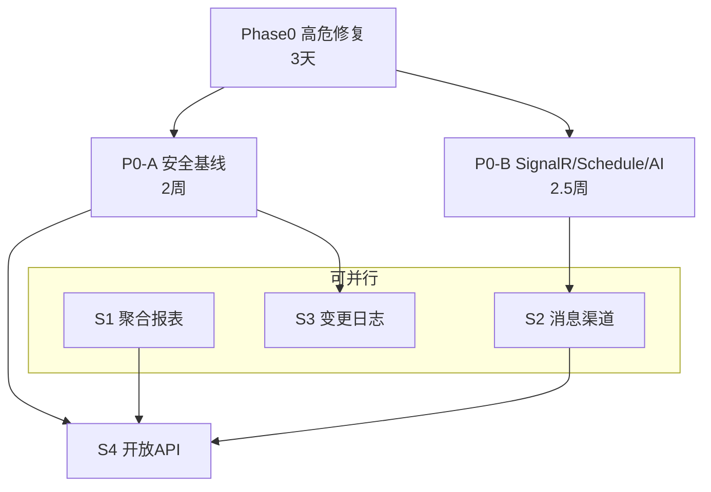

# 二期开发总计划（Master Plan）

> **文档版本**：v1.0  
> **目的**：串联高危修复、P0 基线、A-必做应用服务的执行顺序与依赖

---

## 1. 三阶段总览

| 阶段 | 文档 | 工期 | 必须完成时机 |
|------|------|------|--------------|
| **Phase 0 紧急** | [`04-hotfix-critical-security-implementation.md`](04-hotfix-critical-security-implementation.md) | **3 天** | 任何生产发布前 |
| **Phase 1 基线** | [`02-phase2-p0-security-implementation.md`](02-phase2-p0-security-implementation.md) P0-A | 2 周 | 二期第 1–2 周 |
| **Phase 1 基线** | [`03-phase2-p0-signalr-schedule-ai-implementation.md`](03-phase2-p0-signalr-schedule-ai-implementation.md) P0-B | 2.5 周 | 二期第 2–5 周 |
| **Phase 2 应用** | [`05-phase2-a-application-services-implementation.md`](05-phase2-a-application-services-implementation.md) S1–S4 | 4 周 | P0 基本完成后 |

**总工期（串行上限）**：约 **10–11 周**；并行优化后约 **8–9 周**。

---

## 2. 依赖关系

---

## 3. 人力建议

| 角色 | Phase0 | P0-A/B | S1–S4 |
|------|--------|--------|-------|
| 后端 A | H1–H4 | Token/API 权限 | S4 OpenAPI |
| 后端 B | H5–H7 | AES/防重 | S1 聚合引擎 |
| 后端 C | — | SignalR/Schedule | S2 消息 + S3 AOP |
| 前端 | — | SignalR/AI UI | S1 报表 + S3 Tab |
| QA | REG | P0 回归 | A 全量验收 |

---

## 4. 文档索引

| 编号 | 文档 | 类型 |
|------|------|------|
| 01 | [`01-core-framework.md`](01-core-framework.md) | 架构内参 |
| 02 | [`02-application-services.md`](02-application-services.md) | 架构内参 |
| 02-R | [`02-application-services-review.md`](02-application-services-review.md) | 审查报告 |
| 02-P0A | [`02-phase2-p0-security-implementation.md`](02-phase2-p0-security-implementation.md) | P0-A 施工包 |
| 03 | [`03-phase2-p0-signalr-schedule-ai-implementation.md`](03-phase2-p0-signalr-schedule-ai-implementation.md) | P0-B 施工包 |
| **04** | [`04-hotfix-critical-security-implementation.md`](04-hotfix-critical-security-implementation.md) | **高危修复施工包** |
| **05** | [`05-phase2-a-application-services-implementation.md`](05-phase2-a-application-services-implementation.md) | **A-必做施工包** |
| MP | 本文档 | 总计划 |

---

*文档遵循 [`docs/ARCHITECTURE_DOC_RULES.md`](../ARCHITECTURE_DOC_RULES.md)。*
