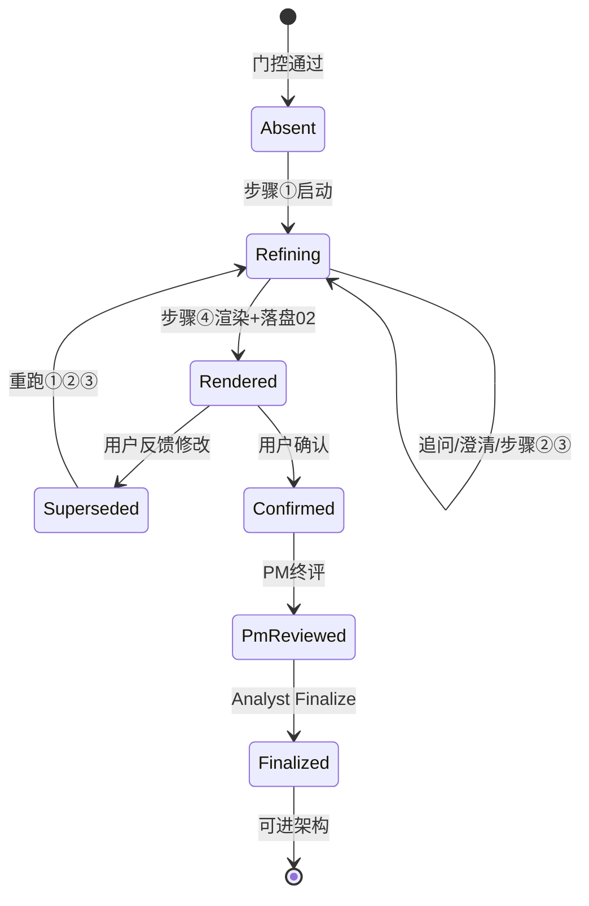
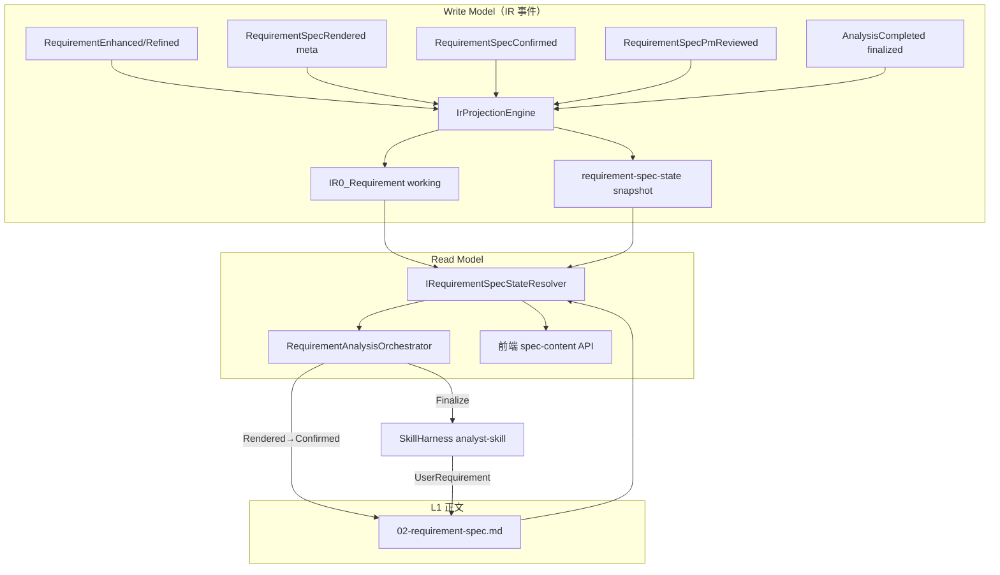

# 需求说明书状态机 + 编排器重构 — 架构施工包（ADF P1）

> **分级：** S（架构级）  
> **adfPhase：** P4 阶段 1 完成（Resolver + 单测）；阶段 2 待「继续」  
> **业务锚 pipeline：** 343 / 407 抽样  
> **施工依据：** `1、阶段A/B/C.md` · OpenSpec `openspec/changes/20260717-pm-pipeline-clarification-resume/`  
> **根因：** 编排器用 scattered `HasEventAsync` + IR payload 兜底推断进度；说明书无唯一生命周期 → PM/Analyst/前端各读各的源 → 407 类 BUG

---

## 1. 背景与目标

### 1.1 当前状态（As-Is）

| 问题 | 表现 | 根因 |
|------|------|------|
| 步骤⑤ UserRequirement 空 | analyst-skill 硬门控失败 | 编排器未携带「已确认说明书」正文 |
| 双确认路径 | 新 `runRequirementAnalysis` vs 旧 `confirm-requirement-spec` | 两套终态：`RequirementSpecConfirmed` vs `StageConfirmed(S2)` |
| 双前端卡片 | `newPipelineSpecConfirm` vs `showRequirementSpecConfirm` | 状态判定条件不一致 |
| IR 当正文源 | 从 `RequirementRefined` 等事件捞 text | 与「02 是唯一交付物」原则冲突 |
| 编排器恢复点 | `RunPmPipelineAsync` 内 6+ 分支互斥 | **无单一 Spec Phase 枚举** |

### 1.2 期望状态（To-Be）

**一句话：** S2 阶段以 **《需求分析说明书》生命周期** 为唯一业务状态机；编排器 **只读 Resolver**，PM/Analyst **只消费 Resolver 给出的快照**；IR 仅审计与九步投影，**不是说明书正文源**。

### 1.3 业务锚定（P0）

| 问 | 答 |
|----|-----|
| Q1 用户操作 | 门控 → PM 澄清 ≥2 轮 → 预览/下载 02 → 确认 → 自动终评+Finalize → 进架构 |
| Q2 业务产物 | 正式版 `02-requirement-spec.md` + `AnalysisCompleted.finalized=true` |
| Q3 验收 | 新 pipeline 全路径 PASS；343/407 抽样 IR+文件一致；`dotnet test …PmNewPipeline` + `pnpm type-check` |

---

## 2. 核心设计：说明书状态机（RequirementSpecPhase）

### 2.1 状态定义（唯一枚举）

```text
Absent          — 尚无步骤③ refined 文本（门控后～步骤③前）
Refining        — 步骤①–③进行中；有 working text，尚无正式 02
Rendered        — 步骤④完成：02 已落盘且通过正式版校验；等用户确认
Confirmed       — 用户确认（RequirementSpecConfirmed）
PmReviewed      — PM 终评完成（RequirementSpecPmReviewed）
Finalized       — Analyst Finalize 完成（AnalysisCompleted.finalized=true）
Superseded      — 用户反馈修改：旧 02 作废，回到 Refining（版本号 +1）
```

> **禁止**用「编排器字符串 Status」(`awaiting-spec-confirm` 等) 代替 Spec Phase — 后者是 **Resolver 输出**，前者是 **API 对外别名**（可映射，不可双写真相）。

### 2.2 状态机（Mermaid）



### 2.3 转换表（Guard + 副作用）

| 从 | 到 | Guard（全部满足） | 副作用（Write） |
|----|-----|-------------------|-----------------|
| * | Refining | 门控通过 | 可选：`RequirementEnhanced` / `RequirementRefined`（**working text only**） |
| Refining | Rendered | 澄清≥MinRounds + 步骤③完成 + 正式渲染 PASS | 写 **02 文件** + `RequirementSpecRendered`（**payload 仅 metadata，无全文**） |
| Rendered | Confirmed | 用户 confirm + 02 文件存在且 formal | `RequirementSpecConfirmed` |
| Confirmed | PmReviewed | PM ReviewSpec 完成 | `RequirementSpecPmReviewed` |
| PmReviewed | Finalized | Analyst Finalize + 门禁 PASS | `AnalysisCompleted{finalized:true}` + **`StageConfirmed{S2}`**（统一旧链） |
| Rendered/Confirmed | Superseded | SpecFeedback 非空 | 标记 `specVersion++`；**禁止**删事件，追加 `RequirementSpecSuperseded` |
| Superseded | Refining | 编排器接受反馈 | 重跑 ①②③ |

### 2.4 存储契约（三层分离）

| 层 | 存什么 | 不存什么 | 谁读 |
|----|--------|----------|------|
| **L1 交付物（正文唯一源）** | `StudioWorkspace/…/deliverables/02-requirement-spec.md` | 中间态 raw PM 文本 | 预览/下载/步骤⑤ Analyst/用户 |
| **L2 Spec 状态（投影）** | 新：`ai_requirement_spec_state` 或 IR fragment `requirement-spec-state:{pipelineId}` | 说明书全文 | **RequirementSpecStateResolver**（唯一读者） |
| **L3 IR 审计** | 事件类型 + 短 metadata（version, hash, len, timestamp） | **禁止**再存 `{text: "..."}` 当 02 替身 | 观测台/回放 |
| **L4 九步分析** | `IR1_EventSpec` 片段 | 不是说明书 | PM 终评九步输入 |

**Working text（Refining 阶段）** — **P2 锁定：沿用 `IR0_Requirement` fragment**

- fragmentId：`requirement:{pipelineId}`（**修正 R12**：禁止仅用 projectId，fork 会撞键）
- payload：`{ text, updatedAt, specVersion }` — **working text only**，不是 02 正文
- **不得**与 `deliverables/02-requirement-spec.md` 混读；步骤④成功后 02 为 L1 唯一正式源

### 2.5 正式版校验（已有，收口为 Gate）

复用 `RequirementAnalysisOrchestrator.IsFormalRequirementSpecMarkdown` / 前端 `requirementSpec.ts`：

- 封面：`# 需求分析规格说明书`
- CTA：`请你确认需求分析说明书`
- 可选：附录澄清记录节（Renderer 产出）

**Rendered 态 Guard 必须调用此校验** — 非 formal 禁止进入 Rendered。

---

## 3. 编排器重构：只读 Resolver

### 3.1 新组件（P3 契约预览）

```csharp
// P3 仅签名，P4 实现
public enum RequirementSpecPhase { Absent, Refining, Rendered, Confirmed, PmReviewed, Finalized, Superseded }

public sealed record RequirementSpecSnapshot
{
    public RequirementSpecPhase Phase { get; init; }
    public int Version { get; init; }
    public string? FormalMarkdown { get; init; }      // Phase >= Rendered：来自 02 文件
    public string? WorkingText { get; init; }       // Phase == Refining：来自 working 源
    public bool CanUserConfirm { get; init; }
    public bool CanFinalize { get; init; }
    public string? BlockReason { get; init; }        // 不可推进时的用户可见原因
}

public interface IRequirementSpecStateResolver
{
    Task<RequirementSpecSnapshot> ResolveAsync(
        string tenantId, string projectId, long pipelineId, CancellationToken ct);
}
```

### 3.2 编排器新入口（伪代码）

```csharp
public async Task<RequirementAnalysisOrchestratorResult> RunAsync(...)
{
    var spec = await _specResolver.ResolveAsync(tenantId, projectId, pipelineId, ct);
    return spec.Phase switch
    {
        RequirementSpecPhase.Absent or RequirementSpecPhase.Refining
            => await AdvancePmRefiningAsync(..., spec),
        RequirementSpecPhase.Rendered
            => await HandleAwaitingConfirmAsync(..., spec),  // confirm / feedback
        RequirementSpecPhase.Confirmed or RequirementSpecPhase.PmReviewed
            => await AdvanceFinalizeAsync(..., spec),
        RequirementSpecPhase.Finalized
            => Completed(),
        RequirementSpecPhase.Superseded
            => await RestartFromFeedbackAsync(..., spec),
        _ => throw ...
    };
}
```

**删除/收敛：** `RunPmPipelineAsync` 内 `hasSpecRendered && !hasSpecConfirmed` 等 scattered 判断 → 全部迁入 Resolver。

### 3.3 PM / Analyst 消费契约

| 消费者 | Phase | 输入 |
|--------|-------|------|
| PM 步骤①–③ | Refining | `WorkingText` |
| PM 步骤④ 渲染 | Refining→Rendered | `WorkingText` → Renderer → **写 02** |
| 用户预览/下载 | Rendered+ | `FormalMarkdown`（02 文件） |
| PM 终评 | Confirmed+ | 九步 EventSpec 快照 + **02 hash 引用**（非 IR text） |
| Analyst Finalize | Confirmed+（PM 通过后） | **`FormalMarkdown` 全文** 作为 `UserRequirement` |

---

## 4. ADF §架构（P1）— 方案对比

### 方案 A — Spec 状态 IR Fragment 投影（推荐）

- **描述：** 新增 fragment `requirement-spec-state` + 事件驱动投影；Resolver 读 fragment + 02 文件 + 事件序
- **优点：** 符合 IR Write Model；可观测；与三元组/FragmentId 一致
- **缺点：** 需改 `IrProjectionEngine` + 迁移历史 pipeline
- **failure_boundary：** 多 pipeline 同 project fork 时 fragment 冲突 → **必须** fragmentId 含 pipelineId

### 方案 B — 独立表 `ai_requirement_spec_state`

- **描述：** SqlSugar 表存 phase/version/path/hash；Resolver 直查表 + 读 02
- **优点：** 查询简单；编排器不扫事件链
- **缺点：** **第二 Write Model** — 违反 F2 数据一致性铁律，除非严格事件同步
- **failure_boundary：** 表与 02 文件 drift → 需 reconciliation job

### 方案 C — 不做 / 仅文档+Resolver 读文件+事件（最小）

- **描述：** 不新增持久态；Resolver 纯函数：读 02 存在性 + 事件序推断 Phase
- **优点：** 改动最小；快速止血
- **缺点：** **仍靠 IR 事件推断**；Superseded/版本难表达；长期技术债
- **failure_boundary：** 事件乱序/缺失时 Phase 误判 — **407 类 BUG 复发**

### 推荐：方案 A

- **理由：** 单一 Write Model（IR 事件 → spec-state 投影）；02 仍是正文唯一源；Resolver 成为唯一读者
- **风险：** 投影引擎改动面大
- **缓解：** 先 P4 实现 Resolver 纯读（方案 C 逻辑）+ 单测锁行为 → 再补投影写入

### 禁改清单（P4 前）

- `PmSkillService` 三核心方法 — **需 CR**
- `RequirementAnalysisOrchestrator.RunAsync` — **需 CR**（本重构已授权范围）
- 禁止给 `SkillHarness` 开 UserRequirement DB 兜底逃逸

### 红线预检

- [x] R12 三元组：spec-state fragmentId / 02 路径均含 tenantId+projectId+pipelineId
- [x] F2：02 = 正文唯一源；IR = 审计+状态投影
- [x] 实现完整性：禁止双 confirm API 长期并存

---

## 5. ADF §模式（P2 — 已批准）

### 5.1 选定模式（2 主 + 1 辅）

| # | 模式 | 解决的问题 |
|---|------|------------|
| 1 | **Event Sourcing + CQRS 读模型** | Write=IR 事件追加；Read=`RequirementSpecSnapshot` 由 Resolver 组装，编排器不扫事件链 |
| 2 | **State + Strategy（转换处理器）** | 每个合法 transition 一个 `IRequirementSpecTransitionHandler`，Guard 可单测 |
| 辅 | **Gate（FormalSpecGate）** | 02 正式版格式硬校验，Rendered 态唯一入口 |

### 5.2 映射到本仓抽象

| 模式角色 | 本仓类型 | 路径（P4 新建/改） |
|----------|----------|-------------------|
| 读模型 Facade | `IRequirementSpecStateResolver` / `RequirementSpecStateResolver` | `Skills/RequirementSpecStateResolver.cs` |
| 读模型 DTO | `RequirementSpecSnapshot` | `Entitys/Dto/Skills/RequirementSpecDtos.cs` |
| 写模型 | `IIrEventStoreService.AppendAsync` | `Ir/IrEventStoreService.cs` |
| 投影 | `IIrProjectionEngine.ProjectEventAsync` | `Ir/IrProjectionEngine.cs` — 新增 `UpsertRequirementSpecStateAsync` |
| 编排 | `IRequirementAnalysisOrchestrator.RunAsync` | `Skills/RequirementAnalysisOrchestrator.cs` |
| 转换 Strategy | `IRequirementSpecTransitionHandler` × N | `Skills/RequirementSpec/Transitions/*.cs` |
| 门控 | `FormalSpecGate` | `Gates/FormalSpecGate.cs` |
| 正文 IO | `IPipelineDeliverableService` | `Studio/PipelineDeliverableService.cs` |
| 渲染 | `IRequirementDocumentRenderer` | `Studio/RequirementDocumentRenderer.cs` |
| Skill 执行 | `ISkillHarness` | `Skills/SkillHarness.cs` — **不改** UserRequirement 硬门控 |
| API | `SkillsApiService` | `Skills/SkillsApiService.cs` |

### 5.3 数据流（P2 定稿）



### 5.4 为何不用替代模式

| 未选 | 不选原因 |
|------|----------|
| 独立 DB 状态表（方案 B） | 第二 Write Model，F2 铁律风险 |
| 编排器内 mega-if 继续堆 | 407 根因；不可测试 |
| SkillHarness 内 DB 兜底 UserRequirement | CR-20260717-01 已禁止逃逸 |
| 前端本地推断 Phase | 必须与 Resolver 同源（API 返回 `specPhase`） |
| Workflow 引擎 / 外置状态机框架 | 过度工程；IR 事件已足够 |

### 5.5 扩展点 vs 密封

| 可替换 | 密封（禁止旁路） |
|--------|------------------|
| `IRequirementSpecTransitionHandler` 实现（加 transition 可插） | `SkillHarness` UserRequirement 非空校验 |
| Resolver 内部：先纯读事件，后切投影 fragment | 02 正文来源：仅 `deliverables/02` + Renderer |
| `FormalSpecGate` 规则扩展（附录节） | 编排器 **禁止** 直接 `HasEventAsync` 推断 Phase（lint/CR） |

### 5.6 反模式（本任务禁止）

- [x] 字段第二源：IR payload 全文 vs 02 文件并存
- [x] 编排器代问 / 旁路 PM
- [x] 双 confirm API 长期并存
- [x] `ResolveUserRequirementAsync` 从 IR 捞 text 喂 Finalize
- [x] fragmentId 仅含 projectId（fork 覆盖）

---

## 6. ADF §契约（P3 — 已批准，禁止写方法体）

### 6.1 公共 API / 方法签名

| 名称 | 输入 | 输出 | 层 | 备注 |
|------|------|------|-----|------|
| `IRequirementSpecStateResolver.ResolveAsync` | `(tenantId, projectId, pipelineId, ct)` | `RequirementSpecSnapshot` | Skill/IR | **唯一 Phase 读者** |
| `IRequirementSpecStateWriter.TransitionAsync` | `(tenantId, projectId, pipelineId, transition, payload, ct)` | `RequirementSpecSnapshot` | Skill/IR | 编排器写路径；内部 Append IR + 投影 |
| `FormalSpecGate.ValidateAsync` | `(markdown, ct)` | `FormalSpecGateResult` | Gate | 复用现有 title/CTA 常量 |
| `IRequirementAnalysisOrchestrator.RunAsync` | 现有 + **返回含 `SpecPhase`** | `RequirementAnalysisOrchestratorResult` | Skill | Phase switch 入口 |
| `SkillsApiService.GetRequirementSpecContentAsync` | `pipelineId` | `{ phase, markdown, rendered, relativePath, contentHash, version }` | API | 前端唯一读 02 |
| `SkillsApiService.RunRequirementAnalysisAsync` | 现有 body | 现有 + SSE 带 `spec_phase` | API | **唯一推进入口** |
| `SkillsApiService.ConfirmRequirementSpecAsync` | 现有 | `[Obsolete]` → 调 `RunRequirementAnalysisAsync` + `userMessage=确认` | API | 兼容 1 版本后删 |

### 6.2 DTO / 记录类型

**后端** — `JNPF.InteAssistant.Entitys/Dto/Skills/RequirementSpecDtos.cs`（新建）

```csharp
public enum RequirementSpecPhase
{
    Absent = 0, Refining = 1, Rendered = 2, Confirmed = 3,
    PmReviewed = 4, Finalized = 5, Superseded = 6,
}

public sealed record RequirementSpecSnapshot
{
    public RequirementSpecPhase Phase { get; init; }
    public int Version { get; init; }
    public string RelativePath { get; init; } = "02-requirement-spec.md";
    public string? ContentHash { get; init; }          // SHA256 hex, 02 文件
    public int? ContentLength { get; init; }
    public string? FormalMarkdown { get; init; }       // Phase >= Rendered; lazy 可选
    public string? WorkingText { get; init; }           // Phase == Refining
    public bool CanUserConfirm { get; init; }
    public bool CanUserFeedback { get; init; }
    public bool CanFinalize { get; init; }
    public string? BlockReason { get; init; }
}

public enum RequirementSpecTransition
{
    StartRefining, Render, Confirm, PmReview, Finalize, Supersede, ResumeAfterSupersede,
}

public sealed record FormalSpecGateResult
{
    public bool IsValid { get; init; }
    public IReadOnlyList<string> Violations { get; init; } = Array.Empty<string>();
}
```

**`RequirementAnalysisOrchestratorResult` 扩展字段：**

```csharp
public RequirementSpecPhase? SpecPhase { get; init; }   // 对外别名映射 Status
public int? SpecVersion { get; init; }
```

**前端** — `jnpf-web-vue3/.../utils/requirementSpec.ts` 扩展：

```typescript
export type RequirementSpecPhase =
  | 'absent' | 'refining' | 'rendered' | 'confirmed'
  | 'pmReviewed' | 'finalized' | 'superseded';

export interface RequirementSpecContentPayload {
  phase?: RequirementSpecPhase;
  Phase?: RequirementSpecPhase;
  version?: number;
  Version?: number;
  contentHash?: string;
  ContentHash?: string;
  // 现有 markdown / rendered / relativePath …
}
```

**Status ↔ Phase 映射（API 兼容，非双源）：**

| Orchestrator `Status` | `SpecPhase` |
|-----------------------|-------------|
| `awaiting-clarification` | `Refining` |
| `awaiting-spec-confirm` | `Rendered` |
| `completed` | `Finalized` |
| `pm-review-failed` | `PmReviewed` 或 `Confirmed`（终评 fail 未 Finalize） |

### 6.3 IR / 领域事件

**新增常量** — `IrEventTypes.cs`

| EventType | 说明 |
|-----------|------|
| `RequirementSpecSuperseded` | 用户反馈，旧版作废 |

**新增 fragment** — `IrFragmentTypes.cs`

| 常量 | fragmentId 公式 | 用途 |
|------|-----------------|------|
| `RequirementSpecState = "IR0_RequirementSpecState"` | `requirement-spec-state:{pipelineId}` | Phase/Version/Hash 投影 |

**Payload 契约（v2 — 禁止全文）：**

| 事件 | Payload JSON | fragment 投影 |
|------|--------------|---------------|
| `RequirementEnhanced` | `{ text, specVersion }` | → `IR0_Requirement` working |
| `RequirementRefined` | `{ text, specVersion }` | → `IR0_Requirement` working |
| `RequirementSpecRendered` | `{ specVersion, contentHash, contentLength, relativePath:"02-requirement-spec.md" }` | → spec-state Phase=Rendered |
| `RequirementSpecConfirmed` | `{ specVersion, contentHash, confirmedBy }` | → spec-state Phase=Confirmed |
| `RequirementSpecPmReviewed` | `{ score, verdict, gaps[], specVersion }` | → spec-state Phase=PmReviewed |
| `RequirementSpecSuperseded` | `{ specVersion, reason, previousHash }` | → spec-state Phase=Superseded |
| `AnalysisCompleted` | 现有 + `{ finalized:true, specVersion, contentHash }` | → spec-state Phase=Finalized |
| `StageConfirmed` | `{ stage:"S2", specVersion, contentHash }` | 审计；与 Finalized 同事务 |

**历史兼容（Resolver 读）：** 若旧事件 payload 含 `text` 且无 02 文件 → 触发一次性 `Render` transition 落盘，**不**把 text 当 Finalize 输入。

### 6.4 错误契约

| 场景 | 异常 | 用户可见 |
|------|------|----------|
| Phase=Rendered 但 02 缺失/非 formal | `Oops.Bah` | 「正式版说明书不可用，请点刷新后重试」 |
| 用户 confirm 但 Phase≠Rendered | `Oops.Bah` | 「当前状态不可确认，请先生成说明书」 |
| Finalize 无 FormalMarkdown | `Oops.Bah` | 「缺少已确认的需求说明书正文」 |
| PM 终评 fail 且未 force | 返回 `pm-review-failed` | 卡片展示 gaps + 强制确认按钮 |
| SkillHarness UserRequirement 空 | `Oops.Bah` | 「内部错误：Finalize 未携带说明书」— **不应再出现** |

### 6.5 影响范围

| 调用方 | 改动 |
|--------|------|
| `RequirementAnalysisOrchestrator` | 主重构：Phase switch + Transition handlers |
| `IrProjectionEngine` | 新 projection；`RequirementSpecRendered` 改投影目标 |
| `SkillsApiService` | spec-content 返回 phase；confirm 转调 run |
| `AnalystSkillService.FinalizeAsync` | 无改签名；调用方保证 UserRequirement=FormalMarkdown |
| `useAnalystSkill.ts` | 删 `needsRequirementSpecConfirmation` 旧条件；改读 `phase` |
| `AiChatPanel.vue` | 单卡片；`spec_confirm_requested` + `phase===rendered` |
| `PmNewPipelineTests` / 新建 `RequirementSpecStateResolverTests` | 断言 Phase + 02 hash |

### 6.6 实现顺序（P4）

1. DTO + `IrEventTypes` + `FormalSpecGate`（无编排器改动）
2. `RequirementSpecStateResolver` + xUnit（shadow）
3. Transition handlers：`Render` / `Confirm` / `Finalize` 三个优先
4. 编排器切 Phase switch
5. 投影 + payload 瘦身 + 前端 phase
6. 删旧路径 + OpenSpec archive

OpenSpec 契约：`openspec/changes/20260718-requirement-spec-state-machine/specs/studio-requirement-spec-lifecycle/spec.md`

---

## 7. 分阶段施工（P4 执行包 — 未经「继续」禁止编码）

### 阶段 0 — OpenSpec 锁契约（0.5d）

- [ ] 新建 `openspec/changes/20260718-requirement-spec-state-machine/proposal.md`
- [ ] 写 `specs/studio-requirement-spec-lifecycle/spec.md`（状态机 + 存储表 + 转换 Guard）
- 验收：人读 spec 能回答「某 pipeline 在 Rendered 时 02/IR/Resolver 各是什么」

### 阶段 1 — Resolver 纯读 + 单测（1d）

- [x] 新增 `IRequirementSpecStateResolver` + `RequirementSpecStateResolver` + `FormalSpecGate`
- [x] xUnit：`RequirementSpecStateResolverTests` — 13 项
- [x] 编排器 shadow 日志（`LogSpecResolverShadowAsync`，不改主链）
- 验收：`dotnet test …RequirementSpec` 全绿 ✅

### 阶段 2 — 编排器切 Resolver（1.5d）

- [ ] CR 审批 `RequirementAnalysisOrchestrator` 重构
- [ ] `RunPmPipelineAsync` → Phase switch；删 scattered HasEvent
- [ ] 步骤⑤ **只** `spec.FormalMarkdown` → analyst
- 验收：407 确认不再 UserRequirement 空；E2E 新 pipeline 全路径

### 阶段 3 — 事件 payload 瘦身 + 投影（1d）

- [ ] `RequirementSpecRendered` 去 text；历史兼容读取 02
- [ ] `IrProjectionEngine` 投影 `requirement-spec-state`
- [ ] 步骤⑤ 补写 `StageConfirmed(S2)`
- 验收：IR 事件 payload 无 >1KB 说明书全文；投影 phase 与 02 hash 一致

### 阶段 4 — 前端/API 单路径（0.5d）

- [ ] 废弃独立 confirm API 对外文档；前端统一 `runRequirementAnalysis`
- [ ] 删第二确认卡片分支
- 验收：`pnpm type-check`；手动 1 条 confirm 路径

### 阶段 5 — 删旧实现（0.5d，F3）

- [ ] 删 `RunRoundAsync` 主链残留 / 旧 confirm 分支（保留 ForceRefinalize 运维入口文档化）
- [ ] 更新 `docs/architecture/studio-s2-compile-materialize.md` 流程图
- 验收：`F3LegacyCleanupGuardTests` 绿；progress-registry 更新

---

## 8. 风险与对策

| 风险 | 概率 | 对策 |
|------|------|------|
| 历史 pipeline IR 含 text payload | 高 | Resolver 迁移：有 02 用 02；无 02 一次性 render 落盘 |
| 343 等 frozen pipeline 回归 | 中 | 343 固定 fixture + 只读 shadow diff |
| CR 审批阻塞 | 中 | 先交本 P1 包 + CR 模板 |
| 前端双卡片遗漏 | 中 | grep `needsRequirementSpecConfirmation` 清零 |

---

## 9. 验证计划（整包完成）

```powershell
dotnet build backend/modularity/inteAssistant/JNPF.InteAssistant/JNPF.InteAssistant.csproj
dotnet test backend/tests/JNPF.Tests.PhaseB/JNPF.Tests.PhaseB.csproj --filter FullyQualifiedName~RequirementSpec
cd jnpf-web-vue3 && pnpm type-check
# 新 pipeline：门控→澄清2轮→预览02→确认→Finalize→设计入口可点
```

---

## 10. 节点审批

| 节点 | 内容 | 状态 |
|------|------|------|
| P1 状态机 + 存储 | §2、§4 | ✅ 已批 |
| P2 模式映射 | §5 | ✅ 已批 |
| P3 接口契约 | §6 | ✅ 已批 |
| **P4 阶段 1** | Resolver + 单测 + shadow | ✅ 完成 |
| **P4 阶段 2** | 编排器切 Phase switch | ⏳ 待「继续」 |

**P2/P3 锁定决策：**

- `Confirmed` 与 `PmReviewed` **保持分立**（步骤⑤可续跑、可 pm-review-failed）
- Working text **沿用 `IR0_Requirement`**；fragmentId **改为含 pipelineId**
- 旧 `confirm-requirement-spec` **Deprecated → 转调 run**（非立即删除）

**P4 开工前：** 提交 `.claude/change-requests/CR-20260718-01.md`（Orchestrator + IrProjectionEngine）。

---

## 附录 A — 现网 vs 目标对照（407 BUG 复盘）

| 环节 | 现网错误 | 目标 |
|------|----------|------|
| 步骤⑤ | `skillOptions.UserRequirement = options?.InitialUserRequirement`（空） | `spec.FormalMarkdown` from 02 |
| 状态判断 | `hasSpecRendered && !hasSpecConfirmed` | `spec.Phase == Rendered` |
| PM 消费 | 混用 context.UserRequirement / IR text | Phase 驱动输入表 §3.3 |

## 附录 B — 关键代码路径索引（待 P4 改动）

| 组件 | 路径 |
|------|------|
| 编排器 | `Skills/RequirementAnalysisOrchestrator.cs` |
| 正式渲染 | `Studio/RequirementDocumentRenderer.cs` |
| 02 落盘 | `Studio/PipelineDeliverableService.SaveRequirementSpecAsync` |
| 前端校验 | `jnpf-web-vue3/.../utils/requirementSpec.ts` |
| 旧 confirm | `Skills/SkillsApiService.ConfirmRequirementSpecAsync` |
