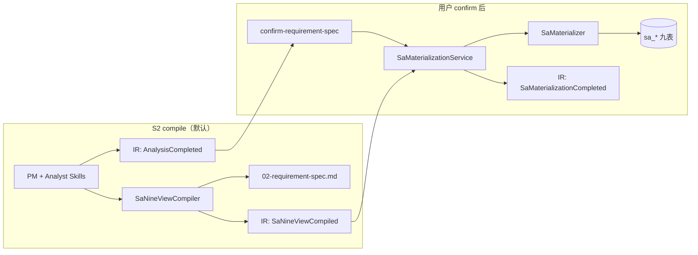

# Studio S2：compile 模式与 C# 九表物化

> **版本：** 2026-07-06 As-Built  
> **知识库：** `openspec/specs/studio-s2-compile/spec.md` · **ADR-004**  
> **业务锚 pipeline：** 311

## 1. 架构变更摘要

2026-07-06 起，S2 **生产主链**完成两大调整：

| # | 变更 | 旧态 | 新态（As-Built） |
|---|------|------|------------------|
| 1 | **业务主链路径** | Analyst → sa-service LLM 九步（~9min） | **compile 默认** → Skills 语义 + **`SaNineViewCompiler`** 确定性投影 |
| 2 | **数据持久化归属** | sa-service `save*` 同步写 `sa_*` | 用户 **confirm** 后 **C# `SaMaterializer`** 直连 JNPF 主库 |

补充约束：

- S2 compile 期间 **零** `sa_*` 写入；语义与用户确认绑定
- sa-service **降级**为 `S2Mode=agent` 回归与 Vitest；**compile + 物化不需要 :3001**

## 2. 流程图

## 3. 双模式对照

| 维度 | compile（默认） | agent（回归） |
|------|-----------------|---------------|
| 配置 | `SaPipeline.json` → `"S2Mode": "compile"` | `"S2Mode": "agent"` |
| Analyst | `AnalystSkillService` → `ISaNineViewCompiler` | `ISaOrchestratorAdapter` → sa-service |
| 耗时 | &lt;60s（311 级） | ~9min |
| S2 写九表 | **否** | 是（legacy，禁止主链） |
| 物化 | C# `SaMaterializer` | 不适用主链 |
| 需要 sa-service | **否** | 是 |

## 4. 物化实现要点（SaMaterializer）

| 问题 | 处理 |
|------|------|
| 完整九表 schema | 按列映射（`context_diagram`、`elements` 等），非 `payload_json` |
| SCD 触发器 + OUTPUT | `OUTPUT INSERTED.id INTO @InsertedIds` |
| QUOTED_IDENTIFIER | 事务内 DISABLE/ENABLE 九表 `trg_sa_*_version` |
| 审计字段 | `created_by` / `updated_by` = `jnpf-materialize` |

**类：** `JNPF.InteAssistant.Sa.SaMaterializer` · `MaterializeAsync(PipelineTriple, SaNineViewCompileResult)`

## 5. 核心表清单

| 表名 | 角色 |
|------|------|
| **INTE_ASSISTANT_DELIVERABLE** | 00–02 交付物索引 |
| **AI_IR_EVENT** | `SaNineViewCompiled` / `AnalysisCompleted` / `SaMaterialization*` |
| **sa_scope** | 边界（物化写入） |
| **sa_dfd** | DFD |
| **sa_business_process** | 业务流程 |
| **sa_data_dictionary** | 数据字典 |
| **sa_pspec** | 过程规格 |
| **sa_decision_table** | 决策表 |
| **sa_er** | ER |
| **sa_state_machine** | 状态机 |
| **sa_ui** | UI 规格 |

## 6. 验收与证据

| 层级 | 命令 / 产物 |
|------|-------------|
| **快 API（日常默认）** | `E2E_PIPELINE_ID=311 pnpm test:api`（~10s） |
| REST 探针 | `pnpm sync:http-env` + `api-tests/http/studio-s2-chain.http` |
| 长链 E2E | `node scripts/phase-sup-s2-e2e.mjs verify --pipeline-id 311` |
| 证据 | `.claude/evidence/phase-sup-s2-e2e.json` |
| 九表 SQL | `backend/modularity/inteAssistant/Migrations/scripts/sa-nine-tables-audit.sql` |

**E2E 选型：** `openspec/specs/studio-e2e-toolchain/spec.md`

**第 1 步（22 号五步计划）状态：** ✅ 业务通过；待收口 `materialize-wait` E2E 子步骤。

## 7. 本节关键代码路径索引

| 职责 | 路径 |
|------|------|
| S2 模式配置 | `backend/application/JNPF.API.Entry/Configurations/SaPipeline.json` |
| 模式选项 | `backend/modularity/inteAssistant/JNPF.InteAssistant/Sa/SaPipelineOptions.cs` |
| 九视图编译 | `.../Sa/SaNineViewCompiler.cs` |
| 物化服务 | `.../Sa/SaMaterializationService.cs` |
| 物化 SQL | `.../Sa/SaMaterializer.cs` |
| Analyst 分支 | `.../Skills/AnalystSkillService.cs` |
| 用户确认 | `.../Skills/SkillsApiService.ConfirmRequirementSpecAsync` |
