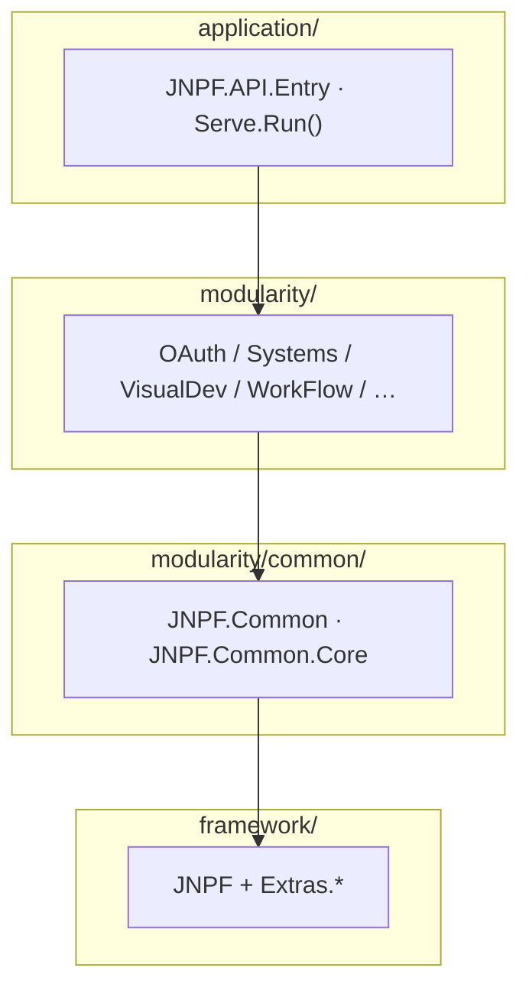

# 专项文档01 · 编写总纲（v5.2 修订版）

> **适用源码**：JNPF v5.2  
> **源码仓库**：`d:\JNPF-v52\backend`  
> **文档编号**：v52-arch-00  
> **文档版本**：v1.0  
> **文档状态**：终审批准  
> **审核人**：架构师  
> **批准日期**：2026-05-24  
> **正文产出**：[`01-core-framework.md`](01-core-framework.md)（升版目标 v2.0-final）  

本文档是 **专项01《核心框架架构深度解剖》** 的 v5.2 编写任务书，替代基于 v3.6 的旧总纲（含 `JNPF.Application`、`sys_*` 表、`AccountController` 等已失效假设）。

---

## 前置确认（动笔前逐项勾选）

| # | 前置项 | v5.2 来源 |
|---|--------|-----------|
| 1 | 解决方案 / 目录树 | `zx_lowcode_netcore.sln` |
| 2 | 启动入口 | `application/JNPF.API.Entry/Program.cs`（`Serve.Run`）+ `Startup.cs`（`AppStartup`） |
| 3 | 配置 | `appsettings.json` + `Configurations/*.json`（连接串 gitignore） |
| 4 | NuGet / 框架版本 | 各 `.csproj` + `global.json`（.NET 6） |
| 5 | 中间件 / Filter | `ServeComponent.cs`、`StartupFilter.cs`、`Startup.Configure` |
| 6 | 公共层 | `framework/JNPF/`、`modularity/common/` |

---

## 文档范围

- **聚焦**：框架基础设施（技术栈、请求链、ORM、认证、缓存、日志）  
- **排除**：具体业务 CRUD（见专项03 `03-application-modules-deep-dive.md`）  
- **排除**：二期施工任务（见 `../phase2/`）  

---

## 第一章：技术栈全景与项目结构

### 1.1 技术栈全景表

| 类别 | 技术 | 版本 | 用途 | 引入方式 |
|------|------|------|------|----------|
| 运行时 | .NET | 6.0 | 后端 | `global.json` |
| Web | ASP.NET Core | 6.0 | API 宿主 | 框架引用 |
| 自研框架 | JNPF（Furion 衍生） | 源码 | DynamicApi、UnifyResult、Schedule | `framework/JNPF/` |
| ORM | SqlSugarCore | 5.1.x | 主数据访问 | NuGet → SqlSugar Extra |
| 映射 | Mapster | 7.x | DTO | NuGet |
| 缓存 | CSRedisCore | 3.x | Redis | NuGet |
| JWT | JwtBearer + JWTEncryption | 6.0.x | 认证 | `Extras.Authentication.JwtBearer` |
| API 文档 | Swashbuckle + Knife4jUI | — | `/newapi` | Entry 项目 |
| 日志 | FileLogging | 源码 | 分级别文件 | `AddFileLogging()` |

> 完整表以 [`01-core-framework.md`](01-core-framework.md) §1.1 为准，编写时从 csproj **实测**版本号。

### 1.2 项目工程结构（图1-1 必绘）

**四层**（非 v3.6 的 Api/Application/Core）：

| 路径 | 职责 |
|------|------|
| `application/JNPF.API.Entry` | Web 宿主；引用业务模块 |
| `modularity/*` | 业务 `*Service`（`IDynamicApiController`） |
| `modularity/common/` | Filter、Manager、EventBus |
| `framework/JNPF/` | 框架内核 |
| `infrastructure/` | EventBus、WebSockets、OAuth 第三方 |

### 1.3 核心配置解读

- 扫描机制：`ConfigurationScanDirectories: ["Configurations"]`  
- 分文件：`JWT.json`、`Cache.json`、`ConnectionStrings.json`、`Tenant.json`、`EventBus.json`…  
- 每项必须写：**Options 类路径** + **`App.GetOptions<T>()` / DI 注入点**  

### 1.4 Serve 启动模型（v5.2 新增必写）

- `Program.cs` → `Serve.Run(RunOptions.Default.AddWebComponent<WebComponent>())`  
- `Startup : AppStartup` → `ConfigureServices` / `Configure`  
- `ServeServiceComponent` / `ServeApplicationComponent` → 默认中间件链  
- `StartupFilter` → 响应头、401/403 修正、`UseApp()`  

---

## 第二章：请求生命周期全链路

### 2.1 图2-1 时序图（必绘）

节点必须基于 v5.2 实际组件（**禁止**虚构 `TenantResolutionMiddleware`）：

| 节点 | 类/文件 |
|------|---------|
| 状态码规范化 | `UnifyResultStatusCodesMiddleware` |
| 路由 | `UseRouting` |
| 跨域 | `UseCorsAccessor` |
| 认证 | JwtBearer + `JwtHandler` |
| API | `DynamicApiController` 生成的 Controller |
| 请求日志 | `RequestActionFilter` |
| 异常 | `FriendlyExceptionFilter` / `RESTfulResultProvider` |
| 数据 | `SqlSugarRepository<T>` → SqlSugar → DB |

### 2.2 中间件注册顺序

来源：`ServeApplicationComponent.Load` + `Startup.Configure` + `StartupFilter`。

### 2.3 统一响应格式

- 模型：`RESTfulResult<T>`（非 `Result<T>`）  
- 提供者：`RESTfulResultProvider.OnException` / `OnSucceeded`  
- 业务异常：`Oops.Oh(ErrorCode.*)`  

### 2.4 DynamicApi 路由约定（v5.2 新增必写）

- 标记：`IDynamicApiController`  
- 约定类：`DynamicApiControllerApplicationModelConvention`  
- 文档 API 时引用 `OAuthService.Login`，**非** `AccountController`  

---

## 第三章：ORM 层与数据访问

### 3.1 SqlSugar 注册

`Startup.ConfigureServices` → `services.SqlSugarConfigure()`  

### 3.2 图3-1 分层图（必绘）

`DynamicApi → *Service → ISqlSugarRepository<T> / ISqlSugarClient → DB`  
**无** `BaseRepository` / `BaseService` / `BaseController`。

### 3.3 多租户 / 多库（图3-2 时序图必绘）

- `ITenantFilter` + `F_TENANT_ID`  
- `SqlSugarRepository` 构造函数：`QueryFilter.AddTableFilter`  
- 多库：`ConnectionConfigs[]`、`GetConnectionScope(tenantId)`  

---

## 第四章：认证与授权

### 4.1 图4-1 JWT 时序（必绘）

- 登录：`OAuthService.Login`（`POST /api/oauth/Login`）  
- Token：`JWTEncryption.GenerateToken`  
- 续期：`JwtHandler` / `AutoRefreshToken`  
- 用户上下文：`IUserManager` / `App.User` Claims  

### 4.2 Token 策略

- 配置：`JWTSettingsOptions`（`Configurations/JWT.json`）  
- 缓存：`CacheManager` + `BASE_SYS_CONFIG.singleLogin`  

### 4.3 图4-2 RBAC ER（必绘）

使用 **BASE_*** 表：

**BASE_USER**、**BASE_ROLE**、**BASE_MODULE**、**BASE_MODULE_BUTTON**、**BASE_AUTHORIZE**、**BASE_USER_RELATION**、**BASE_ORGANIZE**、**BASE_SYS_LOG**

---

## 第五章：缓存与分布式

- `CacheManager` + `CacheOptions`（Memory / Redis）  
- Key 规范需在源码中逐项列出  

---

## 第六章：日志与监控

- FileLogging 三分文件（Information / Warning / Error）  
- `RequestActionFilter` 请求日志  
- 登录日志：`OAuthService.AddLoginLog` → **BASE_SYS_LOG**  

---

## 本篇强制产出

| 产出 | 数量 |
|------|------|
| 架构全景图 | 1 |
| 请求生命周期时序图 | 1 |
| 数据访问架构图 | 1 |
| 数据源/租户切换时序图 | 1 |
| JWT 时序图 | 1 |
| RBAC ER 图 | 1 |
| DynamicApi 流程图 | 1（v5.2 新增） |
| 核心代码片段 | ≥ 8 |
| 核心表 | ≥ 6（**BASE_***） |

每章结尾：**本节核心表清单** + **本节关键代码路径索引** + 深度自检（见 `ARCHITECTURE_DOC_RULES.md` §三）。

---

#### 本节核心表清单

**BASE_USER**、**BASE_ROLE**、**BASE_MODULE**、**BASE_AUTHORIZE**、**BASE_SYS_CONFIG**、**BASE_SYS_LOG**

#### 本节关键代码路径索引

| 路径 | 说明 |
|------|------|
| `framework/JNPF/App/ServeComponent.cs` | 默认中间件 |
| `application/JNPF.API.Entry/Startup.cs` | DI / JWT / SqlSugar |
| `modularity/oauth/JNPF.OAuth/OAuthService.cs` | 登录 |
| `framework/JNPF/DynamicApiController/` | 动态 API |
| `framework/JNPF.Extras.DatabaseAccessor.SqlSugar/Repositories/SqlSugarRepository.cs` | 租户过滤 |
