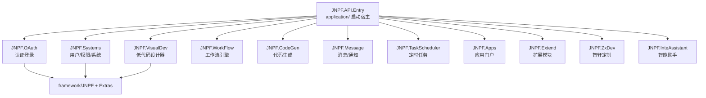
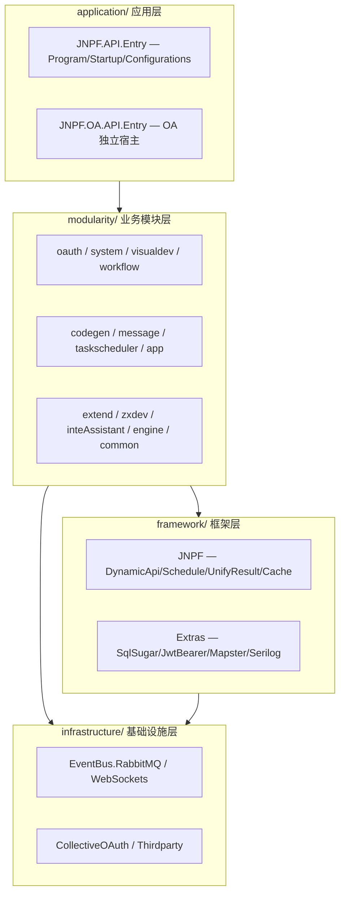
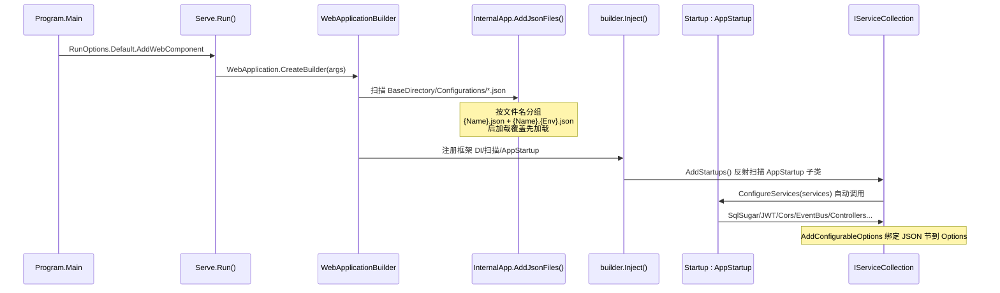
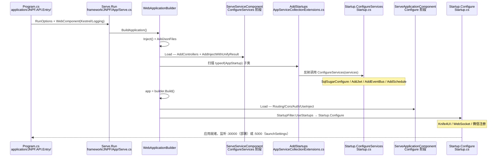
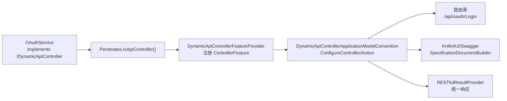
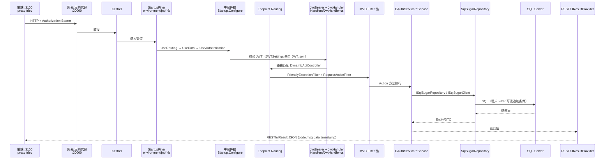
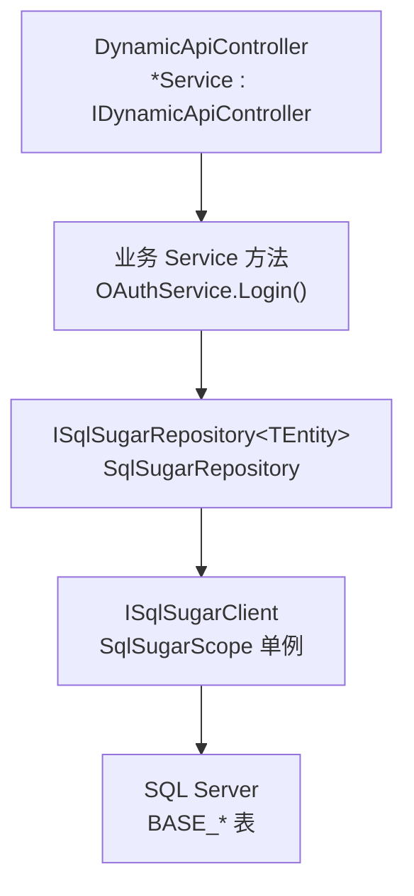
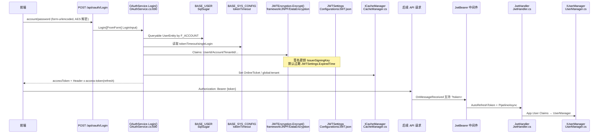
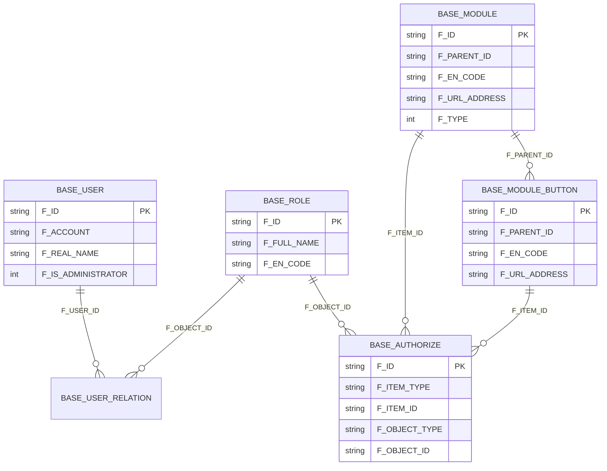

# 【专项文档01】JNPF v5.2 低代码平台 — 核心框架架构深度解剖

> **适用版本**：JNPF v5.2  
> **源码仓库**：`d:\JNPF-v52\backend`  
> **文档编号**：v52-arch-01  
> **文档版本**：v2.0-final  
> **编写日期**：2026-05-24  
> **审核状态**：已审核（2026-05-24）  
> **编写依据**：v5.2 源码实测；禁止引用 [`../archive/pre-v52-rewrite/`](../archive/pre-v52-rewrite/) 旧正文  

---

## 已知问题与注意事项

> **⚠️ 安全警告 — 接口级权限校验未生效**  
> `application/JNPF.API.Entry/Handlers/JwtHandler.cs` 中 `CheckAuthorzieAsync` 的权限列表比对逻辑**已被注释**，当前固定 `return true`（L77-78）。  
> JWT 身份校验仍生效，但**非管理员用户的 API 级 RBAC 拦截在此版本中实际未启用**。  
> **行动项**：部署生产前须与团队确认是有意关闭（开发模式）还是遗漏；若需启用，恢复 `ISysMenuService.GetLoginPermissionList` 比对逻辑。详见 §6.3。

---

## 文档范围

本篇聚焦 v5.2 框架底层：**启动链路**、**四层目录**、**请求生命周期**、**DynamicApiController**、**Configurations 配置体系**、**统一响应**、**SqlSugar ORM**、**JWT/RBAC**、**缓存与日志**。

不涉及具体业务模块细节（用户管理 CRUD 等见专项 03）。

**v5.2 环境锚点**（迁移/部署以 `:30000` 为准）：

| 服务 | 地址 | 说明 |
|------|------|------|
| 后端 API | `http://localhost:30000` | 迁移/部署实际端口 |
| 主 WEB | `http://localhost:3100` | `jnpf-web-vue3` |
| 前端 dev 代理 | `/dev` → `:30000` | `vite.config.ts` `server.proxy` |
| 数字大屏 | `http://localhost:8100/DataV/` | VisualData 独立前端 |
| UniApp H5 | `http://localhost:3800` | 移动端 |
| 报表服务 | `:32000` | 前端 proxy `/reportDev` |
| launchSettings | `:5000` | **仅本地调试**[^launch-port] |

[^launch-port]: `application/JNPF.API.Entry/Properties/launchSettings.json` 仍配置 `http://localhost:5000`（模板残留）；迁移环境通过 IIS/Docker/反向代理监听 **:30000**，本文档一律以 **:30000** 描述 API 地址。

---

## 第一章：技术栈全景与项目结构

### 1.1 技术栈全景表

版本号均从 v5.2 工程 `PackageReference` / `TargetFramework` 提取：

| 类别 | 技术 | 版本 | 用途 | 引入方式 |
|------|------|------|------|----------|
| 运行时 | .NET | **net6.0 目标框架**；SDK 6.0 + `rollForward: latestMajor` | 编译目标 net6.0；运行时可在更高版本 .NET 上 rollForward 执行（如服务器安装 .NET 8 Runtime 时） | `global.json`（`sdk.version: 6.0`）+ 各 csproj `TargetFramework: net6.0` |
| Web 框架 | ASP.NET Core | 6.x | HTTP 宿主、中间件、MVC | `FrameworkReference Microsoft.AspNetCore.App` |
| ORM | **SqlSugarCore** | **5.1.4.140** | 主数据访问 | NuGet → `JNPF.Extras.DatabaseAccessor.SqlSugar` |
| ORM（可选） | Dapper 插件 | 源码 | 原生 SQL 场景 | 源码 `framework/JNPF.Extras.DatabaseAccessor.Dapper`（主 API **未**在 Startup 启用） |
| 对象映射 | **Mapster** | **7.4.0** | DTO/Entity 映射 | NuGet → `JNPF.Extras.ObjectMapper.Mapster` |
| 缓存 | MemoryCache / Redis | CSRedisCore **3.8.670** | 分布式缓存 | NuGet → `framework/JNPF/JNPF.csproj` |
| 事件总线 | JNPF EventBus（默认 **Memory**） | 框架内置 | 进程内事件发布/订阅 | `Startup.cs` `AddEventBus()` |
| 消息队列（可选） | RabbitMQ.Client | **6.4.0** | 仅当 `EventBus.json` 设 `EventBusType: RabbitMQ` 时启用 | NuGet → `infrastructure/JNPF.Extras.EventBus.RabbitMQ` |
| 定时任务 | JNPF Schedule | 框架内置 | 任务调度 + Dashboard | `services.AddSchedule` → `Startup.cs` |
| 日志 | 内置 FileLogging + ConsoleFormatter | — | 文件/控制台日志 | `Startup.cs` `AddFileLogging` |
| 日志（插件） | Serilog.AspNetCore | 6.1.0 | 可选 Serilog 集成 | 源码 `framework/JNPF.Extras.Logging.Serilog`（主 API 未显式启用） |
| API 文档 | Swashbuckle.AspNetCore | **6.5.0** | OpenAPI 生成 | NuGet → `framework/JNPF` |
| API UI | Knife4jUI | 0.0.13 | Swagger UI 替代 | NuGet → `JNPF.API.Entry` |
| 认证 | JwtBearer | **6.0.24** | JWT 校验 | NuGet → `JNPF.Extras.Authentication.JwtBearer` |
| 性能分析 | MiniProfiler | 4.3.8 | 接口性能 | NuGet → `framework/JNPF` |
| JSON | Newtonsoft.Json | ASP.NET 包内置 | 序列化 | `Startup.cs` `AddNewtonsoftJson` |
| 微信 SDK | Senparc.Weixin | Startup 引用 | 公众号/小程序 | `Startup.cs` `AddSenparcWeixinServices` |

### 1.2 项目工程结构

v5.2 采用 **四层目录**：

```
d:\JNPF-v52\backend\
├── application/          ← 应用层（宿主 JNPF.API.Entry）
├── modularity/           ← 业务模块层（*Service 实现 IDynamicApiController）
├── framework/            ← 框架层（JNPF 核心引擎 + Extras 插件）
└── infrastructure/       ← 基础设施层（EventBus/OAuth/WebSocket 等）
```

#### 图1-1 项目依赖关系图（JNPF.API.Entry 为根）



> **说明**：`JNPF.API.Entry.csproj` 共 **11** 个 `ProjectReference`，**未引用** `JNPF.VisualData`；大屏 API 路由为 `/api/blade-visual/`（独立部署，非主 API 模块引用）。

#### 图1-2 四层目录架构图



### 1.3 完整端口表

见文档头部 **v5.2 环境锚点** 表。

### 1.4 JNPF.API.Entry 模块引用清单

来源：`application/JNPF.API.Entry/JNPF.API.Entry.csproj` L322–334。

| 引用项目 | 职责定位 |
|----------|----------|
| `JNPF.OAuth` | 身份认证：`OAuthService.Login` → `POST /api/oauth/Login` |
| `JNPF.Systems` | 用户/角色/菜单/权限/系统配置 |
| `JNPF.VisualDev` | 可视化开发（表单/列表设计器） |
| `JNPF.WorkFlow` | 工作流引擎 |
| `JNPF.CodeGen` | 代码生成（Velocity 模板） |
| `JNPF.Message` | 消息、通知、WebSocket IM |
| `JNPF.TaskScheduler` | 定时任务管理 |
| `JNPF.Apps` | 应用门户/工作台 |
| `JNPF.Extend` | 扩展业务接入点 |
| `JNPF.ZxDev` | 智轩定制开发模块 |
| `JNPF.InteAssistant` | 智能助手集成 |

**未引用**：`JNPF.VisualData`（大屏独立服务）。

### 1.5 核心配置文件解读

`Configurations/` 目录下 **12** 个 JSON（git 仓库内，不含 gitignore 的 `ConnectionStrings.json`）：

| 配置文件 | 配置节 | 强类型 Options 类 | 路径 | 注入/读取方式 |
|----------|--------|-------------------|------|---------------|
| `JWT.json` | `JWTSettings` | `JWTSettingsOptions` | `framework/JNPF.Extras.Authentication.JwtBearer/Options/JWTSettingsOptions.cs` | `AddJwt<JwtHandler>()` / `App.GetOptions<JWTSettingsOptions>()` |
| `Cache.json` | `Cache` | `CacheOptions` | `framework/JNPF/Cache/CacheOptions.cs` | `services.AddConfigurableOptions<CacheOptions>()` |
| `ConnectionStrings.json` | `ConnectionStrings` | `ConnectionStringsOptions` | `framework/JNPF.Extras.DatabaseAccessor.SqlSugar/Options/` | `SqlSugarConfigure()` / `App.GetConfig<ConnectionStringsOptions>()` |
| `Tenant.json` | `Tenant` | `TenantOptions` | `framework/JNPF.Extras.DatabaseAccessor.SqlSugar/Options/` | `AddConfigurableOptions<TenantOptions>()` |
| `App.json` | `JNPF_App` | `AppOptions` | `modularity/common/JNPF.Common/Options/AppOptions.cs` | `App.GetConfig<AppOptions>("JNPF_App")` |
| `App.json` | `OAuth` | `OauthOptions` | `modularity/oauth/JNPF.OAuth/Options/OauthOptions.cs` | `App.GetConfig<OauthOptions>("OAuth")` |
| `App.json` | `Socials` | 【待源码验证】Socials 配置类 | — | OAuth 模块读取 |
| `App.json` | `Message` | 【待源码验证】Message 配置类 | — | 消息模块读取 |
| `EventBus.json` | `EventBus` | `EventBusOptions` | `framework/JNPF/EventBus/` | `AddEventBus()` / `App.GetOptions<EventBusOptions>()` |
| `Swagger.json` | `SpecificationDocumentSettings` | `SpecificationDocumentSettingsOptions` | `framework/JNPF/SpecificationDocument/` | Swagger/Knife4UI 自动生成 |
| `Cors.json` | `CorsAccessorSettings` | `CorsAccessorSettingsOptions` | `framework/JNPF/CorsAccessor/` | `AddCorsAccessor()` |
| `OSS.json` | OSS 相关节 | OSS Options | `application/JNPF.API.Entry/Infrastructure/` | `OSSServiceConfigure()` |
| `Logging.json` | `Logging` | ASP.NET Core 内置 | — | `Host.CreateDefaultBuilder` 合并 |
| `AppSetting.json` | `AppSettings` | `AppSettingsOptions` | `framework/JNPF/App/Options/AppSettingsOptions.cs` | `AddApp()` 自动注册 |
| `ZxSystem.json` | 智轩系统节 | 【待源码验证】 | — | ZxDev 模块 |

**ConnectionStrings.json 结构**（文件在 `.gitignore` 中，部署时本地创建；结构以 `ConnectionStringsOptions` 为准）：

```json
{
  "ConnectionStrings": {
    "ConnectionConfigs": [
      {
        "ConfigId": "default",
        "DBType": "SqlServer",
        "Host": "(local)\\SQLEXPRESS",
        "Port": "1433",
        "DBName": "jnpf_sundial",
        "UserName": "sa",
        "Password": "<部署时填写>",
        "DBSchema": "public",
        "Domain": ""
      },
      {
        "ConfigId": "JNPF-Job",
        "DBType": "SqlServer",
        "Host": "(local)\\SQLEXPRESS",
        "Port": "1433",
        "DBName": "jnpf_sundial",
        "UserName": "sa",
        "Password": "<部署时填写>"
      }
    ]
  }
}
```

| 字段 | 说明 |
|------|------|
| `ConnectionConfigs[]` | 多数据源列表；`SqlSugarConfigure()` 遍历注册为 `SqlSugarScope` 多连接 |
| `ConfigId` | 连接标识；`default` 为主库，`JNPF-Job` 为调度库（`DbJobPersistence`） |
| `Domain` | 请求 Host/referer 前缀匹配时自动路由到该连接（`ConnectionStringsOptions.GetDomainConnectionConfigs`） |
| `DBType` | `SqlServer` / `MySql` / `PostgreSQL` / `Oracle` / `Dm` 等 |

> 完整字段说明见 [`docs/架构迭代/1、系统架构设计说明/003、部署运维与环境配置指南.md`](../../架构迭代/1、系统架构设计说明/003、部署运维与环境配置指南.md) §2.2.1。

**JWT.json 实测片段**（`Configurations/JWT.json`）：

```json
{
  "JWTSettings": {
    "ValidateIssuerSigningKey": true,
    "IssuerSigningKey": "RkayGi4ltkMWrSQKsQTWic1VnakqsQfaJOmJIBUWE1gxGaS0IrJHxa9anjVAwuew",
    "ValidIssuer": "yinmaisoft",
    "ValidAudience": "yinmaisoft",
    "ExpiredTime": 1440,
    "ClockSkew": 5
  }
}
```

#### 图1-3 配置文件加载机制图



**加载源码**（`framework/JNPF/App/Internal/InternalApp.cs` `AddJsonFiles`）：

- 扫描 `AppContext.BaseDirectory` 及 `ConfigurationScanDirectories` 下所有 `*.json`
- 排除 `appsettings*`、`deps.json`、`runtimeconfig*.json`
- 同名配置：`JWT.json` → 节名 `JWTSettings`（JSON 根键即节名）

#### 本节核心表清单

- 无数据库表（本章为工程/配置层）

#### 本节关键代码路径索引

| 路径 | 用途 |
|------|------|
| `application/JNPF.API.Entry/JNPF.API.Entry.csproj` | 11 个 ProjectReference |
| `application/JNPF.API.Entry/Configurations/*.json` | 多文件配置 |
| `framework/JNPF/App/Internal/InternalApp.cs` | JSON 扫描加载 |
| `framework/JNPF.Extras.Authentication.JwtBearer/Options/JWTSettingsOptions.cs` | JWT 强类型 |
| `global.json` | SDK 6.0 |

---

## 第二章：启动链路与双入口模型

### 2.1 v5.2 核心：双入口协作模型

v5.2 **并非**纯 `Serve.Run()` 一体化；而是 **Program 入口 + AppStartup 扫描** 协作：

```
Program.cs
  └── Serve.Run(RunOptions.Default.AddWebComponent<WebComponent>())
        ├── builder.Inject()          ← 框架初始化、JSON 加载、AppStartup 扫描
        ├── ServeServiceComponent     ← 基础 Controller + UnifyResult
        ├── ServeApplicationComponent ← 框架默认中间件链
        └── Startup : AppStartup
              ├── ConfigureServices() ← DI（JWT/SqlSugar/Schedule/EventBus…）
              └── Configure()         ← 宿主级中间件（Knife4UI/WebSocket/微信…）
```

#### 图2-1 启动链路时序图



### 2.2 Serve.Run() 内部机制

| 步骤 | 类/方法 | 文件 | 行为 |
|------|---------|------|------|
| 1 | `Serve.Run(RunOptions)` | `framework/JNPF/App/Serve.cs:560` | .NET6+ 走 `WebApplication` 路径 |
| 2 | `BuildApplication` | `Serve.cs:613` | `WebApplication.CreateBuilder` + 注册 Web/Service/Application 组件 |
| 3 | `builder.Inject()` | `framework/JNPF/App/Internal/InternalApp.cs` | 加载 JSON、`AddApp()`、`AddStartups()` |
| 4 | `ServeServiceComponent.Load` | `framework/JNPF/App/ServeComponent.cs:21` | 注册 Controller + 规范化结果 |
| 5 | `app.Build()` + `ServeApplicationComponent.Load` | `ServeComponent.cs:51` | 注册框架默认中间件 |
| 6 | `StartupFilter` | `framework/JNPF/App/Filters/StartupFilter.cs` | 包装管道，调用 `UseStartups` 执行 `Startup.Configure` |

**AppStartup 发现规则**（`AppServiceCollectionExtensions.AddStartups`）：

```csharp
// framework/JNPF/App/Extensions/AppServiceCollectionExtensions.cs L218-243
var startups = App.EffectiveTypes
    .Where(u => typeof(AppStartup).IsAssignableFrom(u) && u.IsClass && !u.IsAbstract)
    .OrderByDescending(u => GetStartupOrder(u));  // [AppStartup(Order=n)] 控制顺序

foreach (var type in startups)
{
    var startup = Activator.CreateInstance(type) as AppStartup;
    App.AppStartups.Add(startup);
    // 反射调用 public void ConfigureServices(IServiceCollection services)
    // 反射调用 public void Configure(IApplicationBuilder app, ...)
}
```

**扩展点**：在 `Program.cs` 的 `WebComponent.Load` 中通过 `builder.WebHost.ConfigureKestrel` / `builder.Logging` 追加宿主级配置，**不修改**框架 `Serve.cs`。

### 2.3 Startup : AppStartup 详解

`AppStartup` 基类为空抽象类（`framework/JNPF/App/Startups/AppStartup.cs`），仅作 **扫描标记**；全部注册逻辑在 `JNPF.API.Entry/Startup.cs` 子类。

**ConfigureServices 关键注册顺序**（节选）：

```csharp
// application/JNPF.API.Entry/Startup.cs L28-98
public void ConfigureServices(IServiceCollection services)
{
    services.AddConsoleFormatter();
    services.SqlSugarConfigure();                    // ★ ORM 单例 + 仓储 Scoped
    services.AddJwt<JwtHandler>(enableGlobalAuthorize: true, ...);  // ★ 全局 JWT + JwtHandler 授权
    services.AddCorsAccessor();
    services.AddRemoteRequest();
    services.AddTaskQueue();
    services.AddSchedule(options => options.AddPersistence<DbJobPersistence>());
    services.AddConfigurableOptions<CacheOptions>();
    services.AddConfigurableOptions<EventBusOptions>();
    services.AddConfigurableOptions<ConnectionStringsOptions>();
    services.AddConfigurableOptions<TenantOptions>();
    services.AddControllers()
        .AddMvcFilter<RequestActionFilter>()         // ★ 请求日志 AOP
        .AddInjectWithUnifyResult<RESTfulResultProvider>();  // ★ 统一 RESTfulResult
    services.AddEventBus(...);                       // ★ 见下方 EventBus 说明
    services.AddWebSocketManager();
    services.AddFileLogging(...);                    // ★ 按 LogLevel 写文件
    services.OSSServiceConfigure();
    services.AddCachingSwaggerProvider();
}
```

**EventBus 默认后端**（`Configurations/EventBus.json` 实测）：

```json
{
  "EventBus": {
    "EventBusType": "Memory"
  }
}
```

- **默认**：`EventBusType: Memory` — 进程内内存总线，**无需 RabbitMQ 服务**
- **切换 RabbitMQ**：将 `EventBusType` 改为 `RabbitMQ` 并填写 `HostName`/`UserName`/`Password`；`Startup.cs` L179-206 才会创建 `RabbitMQEventSourceStorer`
- `RabbitMQ.Client 6.4.0` 仅为可选插件依赖，不代表默认启用 MQ

**Configure 中间件顺序**（`Startup.cs` L266-316）：

```csharp
app.UseUnifyResultStatusCodes();      // ★ 401/403 → RESTfulResult
app.UseStaticFiles(...);
// 微信 Senparc 注册
app.UseWebSockets();
app.UseRouting();
app.UseCorsAccessor();
app.UseAuthentication();              // ★ JWT Bearer 校验
app.UseAuthorization();               // ★ JwtHandler.PipelineAsync 权限
app.UseScheduleUI();
app.UseKnife4UI(...);                 // ★ 路由 /newapi
app.UseInject(string.Empty);
app.MapWebSocketManager("/api/message/websocket", ...);
app.UseEndpoints(endpoints => { endpoints.MapControllerRoute(...); });
serviceProvider.WarmupSwagger();
```

#### 本节核心表清单

- 无

#### 本节关键代码路径索引

| 路径 | 用途 |
|------|------|
| `application/JNPF.API.Entry/Program.cs` | `Serve.Run` 入口 |
| `application/JNPF.API.Entry/Startup.cs` | DI + 中间件 |
| `framework/JNPF/App/Serve.cs` | 主机构建 |
| `framework/JNPF/App/ServeComponent.cs` | 框架默认组件 |
| `framework/JNPF/App/Extensions/AppServiceCollectionExtensions.cs` | AppStartup 扫描 |
| `framework/JNPF/App/Filters/StartupFilter.cs` | 管道包装 |

---

## 第三章：DynamicApiController 路由生成机制

### 3.1 v5.2 核心：IDynamicApiController 接口

Service 类实现 `IDynamicApiController`（或贴 `[DynamicApiController]` / 继承 `ControllerBase`）后，由框架 **ApplicationModelConvention** 自动注册为 API，无需手写 Controller。

**判定逻辑**（`Penetrates.IsApiController`）：

```csharp
// framework/JNPF/DynamicApiController/Internal/Penetrates.cs L84-85
if ((!typeof(Controller).IsAssignableFrom(type) && typeof(ControllerBase).IsAssignableFrom(type))
    || typeof(IDynamicApiController).IsAssignableFrom(type)
    || type.IsDefined(typeof(DynamicApiControllerAttribute), true))
    return true;
```

**OAuthService 实测**：

```csharp
// modularity/oauth/JNPF.OAuth/OAuthService.cs L53-55
[ApiDescriptionSettings(Tag = "OAuth", Name = "OAuth", Order = 160)]
[Route("api/[controller]")]
public class OAuthService : IDynamicApiController, ITransient
```

#### 图3-1 DynamicApiController 工作原理图



### 3.2 路由生成规则（源码确认）

配置默认值见 `DynamicApiControllerSettingsOptions.PostConfigure`（`framework/JNPF/DynamicApiController/Options/DynamicApiControllerSettingsOptions.cs`）：

| 规则项 | 默认值 | 说明 |
|--------|--------|------|
| `DefaultRoutePrefix` | `"api"` | 全局前缀 |
| `AbandonControllerAffixes` | `Service`, `Services`, `Controller`… | `OAuthService` → `OAuth` |
| `LowercaseRoute` | `true` | 路由小写 → `/api/oauth/...` |
| `DefaultHttpMethod` | `POST` | 无法推断动词时的默认 HTTP 方法 |
| `CamelCaseSeparator` | `"-"` | 驼峰拆分分隔符 |

**类名 → 路由前缀**：

1. 去除后缀：`OAuthService` → `OAuth`（`ClearStringAffixes` + `AbandonControllerAffixes`）
2. 若类贴 `[Route("api/[controller]")]`，模板 `[controller]` 替换为控制器名（小写后 `oauth`）
3. 若启用 `ForceWithRoutePrefix`，追加 `{DefaultRoutePrefix}/{Module}`

**方法名 → 路径 + HTTP 动词**（`ConfigureActionHttpMethodAttribute`）：

```csharp
// DynamicApiControllerApplicationModelConvention.cs L292-305
var words = action.ActionMethod.Name.SplitCamelCase();
var verbKey = words.First().ToLower();
// get/post/add/create → POST/GET/PUT/DELETE（Penetrates.VerbToHttpMethods 字典）
var succeed = Penetrates.VerbToHttpMethods.TryGetValue(verbKey, out var verbValue);
var verb = succeed ? verbValue : _dynamicApiControllerSettings.DefaultHttpMethod.ToUpper();
```

| 方法名前缀 | HTTP 动词 |
|------------|-----------|
| `Get` / `Find` / `Query` | GET |
| `Post` / `Add` / `Create` / `Insert` | POST |
| `Put` / `Update` | PUT |
| `Delete` / `Remove` / `Clear` | DELETE |

**示例**：`OAuthService.Login` + `[HttpPost("Login")]` → **`POST /api/oauth/Login`**

**参数绑定**（`ConfigureClassTypeParameter`）：

- 复杂类型默认 `[FromBody]`
- GET/HEAD 且 `ModelToQuery=true` 时转 Query
- 接口类型且 DI 可解析 → `[FromServices]`
- 显式 `[FromQuery]`/`[FromRoute]`/`[FromForm]` 优先

**自定义覆盖**：`[HttpPost("Login")]`、`[Route(...)]`、`[ApiDescriptionSettings(Name=...)]`、`[AllowAnonymous]`

### 3.3 与传统 Controller 模式对比

| 维度 | v3.6 手写 Controller | v5.2 DynamicApiController |
|------|----------------------|----------------------------|
| API 定义位置 | `Controllers/AccountController.cs` | `modularity/*/OAuthService.cs` 等业务 Service |
| 路由来源 | 手写 `[Route]` | 类名/方法名推断 + 特性覆盖 |
| DI 注册 | 手动或局部扫描 | `AddDependencyInjection()` 按 `ITransient/IScoped` 约定 |
| 响应格式 | 各 Controller 自行返回 | `RESTfulResultProvider` 全局规范化 |
| Swagger | 逐 Controller 维护 | `ApiDescriptionSettings` + XML 注释 |
| 权限 | Controller 级 `[Authorize]` | 全局 `enableGlobalAuthorize` + `[AllowAnonymous]` 豁免 |

#### 本节核心表清单

- 无

#### 本节关键代码路径索引

| 路径 | 用途 |
|------|------|
| `framework/JNPF/DynamicApiController/Conventions/DynamicApiControllerApplicationModelConvention.cs` | 路由/动词/参数绑定 |
| `framework/JNPF/DynamicApiController/Internal/Penetrates.cs` | IsApiController + 动词映射 |
| `framework/JNPF/DynamicApiController/Options/DynamicApiControllerSettingsOptions.cs` | 默认路由规则 |
| `modularity/oauth/JNPF.OAuth/OAuthService.cs` | IDynamicApiController 示例 |

---

## 第四章：请求生命周期全链路

### 4.1 HTTP 请求完整生命周期

#### 图4-1 HTTP 请求生命周期时序图



### 4.2 中间件注册顺序

**框架层**（`ServeApplicationComponent`，先于宿主 Startup 执行）与 **宿主层**（`Startup.Configure`）均注册认证/路由；宿主层覆盖/追加 Knife4UI、WebSocket、微信等。

**Startup.Configure 实测序列**：

| 顺序 | 调用 | 职责 |
|------|------|------|
| 1 | `UseUnifyResultStatusCodes()` | 401/403 转 RESTfulResult JSON |
| 2 | `UseStaticFiles` | wwwroot 静态资源 |
| 3 | `UseWebSockets` | WebSocket 支持 |
| 4 | `UseRouting` | 终结点路由 |
| 5 | `UseCorsAccessor` | 跨域（读取 `Cors.json`） |
| 6 | `UseAuthentication` | JWT Bearer 解析 `Authorization` / `?token=` |
| 7 | `UseAuthorization` | `JwtHandler` 权限 + Token 自动刷新 |
| 8 | `UseScheduleUI` | 任务调度面板 |
| 9 | `UseKnife4UI` | API 文档 UI `/newapi` |
| 10 | `UseInject` | 框架注入端点（规范化/Swagger 等） |
| 11 | `MapWebSocketManager` | IM WebSocket |
| 12 | `UseEndpoints` | 默认 MVC 路由 |

**顺序依赖**：`UseAuthentication` 必须在 `UseAuthorization` 之前；`UseUnifyResultStatusCodes` 靠外层以拦截 401/403。

**AOP 过滤器**（非中间件，Action 阶段）：

| 过滤器 | 路径 | 职责 |
|--------|------|------|
| `FriendlyExceptionFilter` | `framework/JNPF/FriendlyException/Filters/FriendlyExceptionFilter.cs` | 业务异常 → RESTfulResult |
| `RequestActionFilter` | `modularity/common/JNPF.Common.Core/Filter/RequestActionFilter.cs` | 请求耗时日志 → EventBus |

### 4.3 统一响应格式

**响应模型**：`RESTfulResult<T>`（**非** v3.6 的 `Result<T>`）

```csharp
// framework/JNPF/UnifyResult/Internal/RESTfulResult.cs
public class RESTfulResult<T>
{
    public int? code { get; set; }
    public object msg { get; set; }
    public T data { get; set; }
    public object extras { get; set; }
    public long timestamp { get; set; }
}
```

**全局异常**：`FriendlyExceptionFilter`（`IAsyncExceptionFilter`）捕获 `AppFriendlyException`，委托 `RESTfulResultProvider.OnException` 输出 JSON。

**业务异常抛出**（Service 层常用 `Oops.Oh`）：

```csharp
// modularity/oauth/JNPF.OAuth/OAuthService.cs — 用户不存在
if (userAnyPwd.IsNullOrEmpty()) throw Oops.Oh(ErrorCode.D1000);

// framework/JNPF.Extras.DatabaseAccessor.SqlSugar/Repositories/SqlSugarRepository.cs — 连接失败
if (!base.Context.Ado.IsValidConnection())
    throw Oops.Oh("数据库连接错误");
```

`Oops.Oh(ErrorCode.xxx)` 抛出 `AppFriendlyException`，由 `FriendlyExceptionFilter` 转为 `RESTfulResult`（`code`/`msg`）。完整 ErrorCode 枚举与用法见专项 02（应用服务层）。

**401/403**：`RESTfulResultProvider.OnResponseStatusCodes` — 401 返回 `code:600, msg:"登录过期,请重新登录"`。

**前端解析**：读取 HTTP Body 的 `code`（200 或业务码）、`msg`、`data`；Token 刷新时读响应头 `access-token` / `x-access-token`（`Cors.json` 已暴露）。

#### 本节核心表清单

- **BASE_API_LOG** — 请求日志（`RequestActionFilter` 写入，字段含 `F_*`）

#### 本节关键代码路径索引

| 路径 | 用途 |
|------|------|
| `application/JNPF.API.Entry/Startup.cs` Configure | 中间件顺序 |
| `framework/JNPF/App/ServeComponent.cs` | 框架默认中间件 |
| `application/JNPF.API.Entry/Handlers/JwtHandler.cs` | 授权/刷新 |
| `framework/JNPF/UnifyResult/Providers/RESTfulResultProvider.cs` | 统一响应 |
| `framework/JNPF/FriendlyException/Filters/FriendlyExceptionFilter.cs` | 异常过滤器 |
| `modularity/common/JNPF.Common.Core/Filter/RequestActionFilter.cs` | 请求日志 |

---

## 第五章：ORM 层与数据访问架构

### 5.1 ORM 框架封装分析

- **ORM**：SqlSugarCore **5.1.4.140**
- **DI 注册**：`application/JNPF.API.Entry/Extensions/SqlSugarConfigureExtensions.cs` `SqlSugarConfigure()`
- **客户端类型**：`SqlSugarScope` 单例；`ISqlSugarRepository<T>` Scoped
- **配置来源**：`Configurations/ConnectionStrings.json` → `ConnectionStringsOptions`

```csharp
// SqlSugarConfigureExtensions.cs L31-44
SqlSugarScope sqlSugar = new(dbOptions.ConnectionConfigs.Adapt<List<ConnectionConfig>>(), db => { ... });
services.AddSingleton<ISqlSugarClient>(sqlSugar);
services.AddScoped(typeof(ISqlSugarRepository<>), typeof(SqlSugarRepository<>));
services.AddUnitOfWork<SqlSugarUnitOfWork>();
```

**多数据库**：`ConnectionConfigs[]` 多 `ConfigId`；运行时 `AsTenant().GetConnectionScope(configId)` 切换。

### 5.2 数据访问层架构图

#### 图5-1 数据访问层架构图



> v5.2 **无**独立 Application 层、**无**传统 Repository 接口层；`SqlSugarRepository<T>` 即数据访问封装。

### 5.3 基类封装深度分析

| 基类 | 路径 | 核心公共方法 | 说明 |
|------|------|--------------|------|
| `TenantCLDSEntityBase` | `modularity/common/JNPF.Common/Contracts/TenantCLDSEntityBase.cs` | `Creator()` / `Create()` / `LastModify()` / `Delete()` | 审计字段 + 软删 |
| `TenantEntityBase<T>` | `modularity/common/JNPF.Common/Contracts/TenantEntityBase.cs` | `Id`, `TenantId` | 租户主键 |
| `SystemCLDSEntityBase` | `modularity/common/JNPF.Common/Contracts/SystemCLDSEntityBase.cs` | 同 CLDS | 系统表（无租户字段） |
| `SqlSugarRepository<T>` | `framework/JNPF.Extras.DatabaseAccessor.SqlSugar/Repositories/SqlSugarRepository.cs` | 继承 `SimpleClient<T>` CRUD | 构造函数内租户切库 |
| `ITenantFilter` | `framework/JNPF.Extras.DatabaseAccessor.SqlSugar/Models/ITenantFilter.cs` | `TenantId` 属性 | 字段隔离 Filter |

### 5.4 数据库多租户/多数据源机制

**配置**：`Configurations/Tenant.json`

```json
{
  "Tenant": {
    "MultiTenancy": false,
    "MultiTenancyType": "SCHEMA",
    "MultiTenancyDBInterFace": "https://www.jnpfsoft.com/api/Saas/Tenant/DbContent/",
    "MultiSystem": true
  }
}
```

> **⚠️ 部署注意**：`MultiTenancyDBInterFace` 为源码仓库中的**厂商默认 URL**（指向 jnpfsoft.com）。当前默认 `MultiTenancy: false`，该 URL **不会被调用**；若启用多租户（`MultiTenancy: true`），**必须**将其替换为实际 SaaS 租户接口地址，禁止在生产环境直接使用外部默认域名。

**切库流程**（`SqlSugarRepository` 构造函数）：

1. 从 JWT Claim `TenantId` 读取租户 ID
2. Redis 缓存 `jnpf:global:tenant` 获取 `GlobalTenantCacheModel`
3. `AsTenant().AddConnection` + `GetConnectionScope(configId)`
4. 字段隔离（`type==1`）：`QueryFilter.AddTableFilter<ITenantFilter>`

**构造函数关键代码**（`SqlSugarRepository.cs` L22-50）：

```csharp
public SqlSugarRepository(IServiceProvider serviceProvider, ISqlSugarClient context = null) : base(context)
{
    using var serviceScope = serviceProvider.CreateScope();
    var _cacheManager = serviceScope.ServiceProvider.GetService<ICacheManager>();
    TenantOptions tenant = App.GetConfig<TenantOptions>("Tenant", true);
    var httpContext = App.HttpContext;
    base.Context = (SqlSugarScope)context;

    string tenantId = connectionStrings.DefaultConnectionConfig.ConfigId.ToString();
    if (httpContext?.GetEndpoint()?.Metadata?.GetMetadata<AllowAnonymousAttribute>() == null)
    {
        if (tenant.MultiTenancy && httpContext != null)
        {
            tenantId = httpContext?.User.FindFirst("TenantId")?.Value;  // ★ JWT Claim
            var tenantCache = _cacheManager.Get<List<GlobalTenantCacheModel>>("jnpf:global:tenant")
                .Find(it => it.TenantId.Equals(tenantId));
            if (tenantCache != null)
            {
                if (!base.Context.AsTenant().IsAnyConnection(tenantCache.connectionConfig.ConfigId))
                    base.Context.AsTenant().AddConnection(JNPFTenantExtensions.GetConfig(tenantCache.connectionConfig));
                base.Context = base.Context.AsTenant().GetConnectionScope(tenantCache.connectionConfig.ConfigId);  // ★ 切库
            }
        }
    }
}
```

**登录后租户缓存**：`OAuthService.Login` → `SetGlobalTenantCache` 写入 Redis。

### 5.5 字段命名规范（v5.2 强制）

- 基础表名：**`BASE_*`**（如 `BASE_USER`，非 `sys_user`）
- 字段列名：**`F_` 前缀** + 大写下划线（如 `F_ACCOUNT`、`F_REAL_NAME`）
- Entity 属性 PascalCase + `[SugarColumn(ColumnName = "F_XXX")]`

```csharp
// modularity/system/JNPF.Systems.Entitys/Entity/Permission/UserEntity.cs
[SugarTable("BASE_USER")]
public class UserEntity : TenantCLDSEntityBase
{
    [SugarColumn(ColumnName = "F_ACCOUNT")]
    public string Account { get; set; }

    [SugarColumn(ColumnName = "F_REAL_NAME")]
    public string RealName { get; set; }
}
```

#### 本节核心表清单

- **BASE_USER** — `F_ACCOUNT`, `F_REAL_NAME`, `F_SECRETKEY`, `F_ENABLED_MARK`
- **BASE_SYS_CONFIG** — 系统配置（含 `tokenTimeout`、`singleLogin`）
- **BASE_API_LOG** — API 请求日志

#### 本节关键代码路径索引

| 路径 | 用途 |
|------|------|
| `application/JNPF.API.Entry/Extensions/SqlSugarConfigureExtensions.cs` | ORM DI |
| `framework/JNPF.Extras.DatabaseAccessor.SqlSugar/Repositories/SqlSugarRepository.cs` | 仓储 + 租户 |
| `modularity/common/JNPF.Common/Contracts/TenantCLDSEntityBase.cs` | 审计基类 |
| `modularity/system/JNPF.Systems.Entitys/Entity/Permission/UserEntity.cs` | F_ 字段示例 |

---

## 第六章：认证与授权全链路

### 6.1 JWT 认证完整时序图

#### 图6-1 JWT 认证时序图



**Token 生成实测**（`OAuthService.cs` L878-900）：

```csharp
string accessToken = JWTEncryption.Encrypt(new Dictionary<string, object>
{
    { ClaimConst.CLAINMUSERID, userAnyPwd.Id },
    { ClaimConst.CLAINMACCOUNT, userAnyPwd.Account },
    { ClaimConst.CLAINMREALNAME, userAnyPwd.RealName },
    { ClaimConst.CLAINMADMINISTRATOR, userAnyPwd.IsAdministrator },
    { ClaimConst.TENANTID, tenantId },
    { ClaimConst.OnlineTicket, input.online_ticket },
    { ClaimConst.ZXSYSTEMID, userAnyPwd.BizSystemId }
}, tokenTimeout);  // ★ 来自 BASE_SYS_CONFIG，非固定 JWT.json ExpiredTime

_httpContextAccessor.HttpContext.Response.Headers["x-access-token"] =
    JWTEncryption.GenerateRefreshToken(accessToken, 30);
```

**登录响应 token 格式**（`OAuthService.cs` L1008）：`token = string.Format("Bearer {0}", accessToken)`。主 WEB 前端 `authenticationScheme` 为空时将该字符串原样写入 `Authorization` 头，与 `JwtBearer` 默认 `Bearer` 解析及 `JWTEncryption.GetJwtBearerToken(..., tokenPrefix: "Bearer ")` 一致。详见 [04-application-frontend-deep-dive.md §3.1](./04-application-frontend-deep-dive.md)。

### 6.2 Token 管理策略

| 项 | 实现 |
|----|------|
| Claims | `UserId`, `Account`, `RealName`, `Administrator`, `TenantId`, `OnlineTicket`, `BizSystemId` |
| 签名 | `JWTSettings.IssuerSigningKey` + `Algorithm`（默认 HS256） |
| 过期 | 业务配置 `sysConfig.tokenTimeout`（分钟）；`JWT.json` `ExpiredTime` 用于刷新逻辑 |
| Redis Key | `OnlineTicket_{ticket}`、`jnpf:global:tenant`、`{configId}{userId}_devSystemId` |
| 自动刷新 | `JwtHandler.HandleAsync` → `JWTEncryption.AutoRefreshToken` |
| 多终端互踢 | `sysConfig.singleLogin` + `OnlineTicket` 缓存（`OAuthOptions.Enabled` 单点登录场景） |

### 6.3 RBAC 权限校验机制

**v5.2 实际表名**（非 v3.6 的 `sys_menu` / `BASE_MENU`）：

| 逻辑 | 表名 | 关键字段 |
|------|------|----------|
| 用户 | **BASE_USER** | `F_ACCOUNT`, `F_REAL_NAME`, `F_SECRETKEY` |
| 角色 | **BASE_ROLE** | `F_FULL_NAME`, `F_EN_CODE`, `F_TYPE` |
| 菜单/模块 | **BASE_MODULE** | `F_EN_CODE`, `F_URL_ADDRESS`, `F_TYPE` |
| 按钮 | **BASE_MODULE_BUTTON** | `F_EN_CODE`, `F_URL_ADDRESS` |
| 权限关联 | **BASE_AUTHORIZE** | `F_ITEM_TYPE`, `F_ITEM_ID`, `F_OBJECT_TYPE`, `F_OBJECT_ID` |
| 数据权限 | **BASE_MODULE_AUTHORIZE** | 模块级数据范围 |

#### 图6-2 RBAC 权限 ER 图



**接口级权限**（`JwtHandler.CheckAuthorzieAsync`）：

- 路由名转换：`/api/system/user/list` → `system:user:list`
- 管理员 `ClaimConst.CLAINMADMINISTRATOR` 跳过
- 白名单路由 `oauth:CurrentUser`

> **⚠️ 安全警告（与文档头部一致）**  
> 当前源码中，从 `ISysMenuService.GetLoginPermissionList` 获取权限并比对的逻辑**已被注释**（`JwtHandler.cs` L73-77），方法末尾固定 `return true`（L78）。  
> 即：**JWT 登录态校验有效，但 API 级 RBAC 按钮/接口权限拦截在此版本未实际执行**。生产部署前须团队确认并决定是否恢复该校验。

**数据权限**：模块级 `BASE_MODULE_AUTHORIZE` + `ModuleDataAuthorizeEntity`；运行时由 Service 层 `ISqlSugarClient` QueryFilter 或业务代码追加（**非**独立 Middleware）。

#### 本节核心表清单

- **BASE_USER**, **BASE_ROLE**, **BASE_MODULE**, **BASE_MODULE_BUTTON**, **BASE_AUTHORIZE**, **BASE_USER_RELATION**, **BASE_MODULE_AUTHORIZE**, **BASE_SYS_CONFIG**

#### 本节关键代码路径索引

| 路径 | 用途 |
|------|------|
| `modularity/oauth/JNPF.OAuth/OAuthService.cs` | Login L690+ |
| `application/JNPF.API.Entry/Handlers/JwtHandler.cs` | 授权/刷新 |
| `framework/JNPF.Extras.Authentication.JwtBearer/Options/JWTSettingsOptions.cs` | JWT 配置类 |
| `application/JNPF.API.Entry/Configurations/JWT.json` | JWT 配置文件 |
| `modularity/common/JNPF.Common.Core/Manager/User/IUserManager.cs` | 用户上下文 |
| `modularity/common/JNPF.Common.Core/Manager/User/UserManager.cs` | IUserManager 实现 |
| `modularity/system/JNPF.Systems.Entitys/Entity/Permission/AuthorizeEntity.cs` | 权限关联实体 |

---

## 第七章：缓存与日志

### 7.1 Redis 封装层分析

| 项 | 路径/说明 |
|----|-----------|
| 接口 | `ICacheManager` — `framework/JNPF/Cache/ICacheManager.cs` |
| 实现 | `CacheManager` — `framework/JNPF/Cache/CacheManager.cs`（命名空间 `JNPF.Common.Manager`） |
| 配置 | `Cache.json` → `CacheOptions.CacheType`：`MemoryCache` 或 `RedisCache` |
| Redis 客户端 | `CSRedisCore` 3.8.670；连接串模板 `RedisConnectionString` |

**Key 命名规范（实测）**：

| Key 模式 | 用途 |
|----------|------|
| `jnpf:global:tenant` | 全局租户连接缓存列表 |
| `OnlineTicket_{ticket}` | 单点登录票据 |
| `{configId}{userId}_devSystemId` | 用户当前业务系统 ID |

**缓存策略**：Token/租户/在线状态写 Redis（或 MemoryCache）；业务字典等由 Service 按需 `ICacheManager.Set/Get`。

### 7.2 日志体系

| 类型 | 实现 |
|------|------|
| 框架 | `AddConsoleFormatter` + `AddFileLogging`（`Startup.cs` L243-256） |
| 配置 | `Configurations/Logging.json` — 文件路径 `logs/{yyyyMMdd}/...` |
| 操作/API 日志 | `RequestActionFilter` → EventBus → `BASE_API_LOG` |
| 登录日志 | `OAuthService.Login` 内联写入登录日志逻辑 |
| 异常日志 | `FriendlyExceptionFilter` + `LogExceptionHandler` |

> Serilog 插件存在于 `framework/JNPF.Extras.Logging.Serilog`，主 API `Startup.cs` **未**调用 `AddSerilog`，默认走内置 FileLogging。

### 7.3 审计字段自动填充

`TenantCLDSEntityBase` 提供 **`F_` 前缀** 审计列：

| 属性 | 列名 | 赋值时机 |
|------|------|----------|
| `CreatorTime` | `F_CREATOR_TIME` | `Creator()` / `Create()` |
| `CreatorUserId` | `F_CREATOR_USER_ID` | 从 `App.User` Claim `UserId` |
| `LastModifyTime` | `F_LAST_MODIFY_TIME` | `LastModify()` |
| `LastModifyUserId` | `F_LAST_MODIFY_USER_ID` | `LastModify()` |
| `DeleteMark` | `F_DELETE_MARK` | `Delete()` 软删 |

业务 Service 在新增/更新前调用 `entity.Creator()` 或 `entity.LastModify()`，**非** SqlSugar AOP 全局自动填充。

#### 本节核心表清单

- **BASE_API_LOG** — API 请求审计

#### 本节关键代码路径索引

| 路径 | 用途 |
|------|------|
| `framework/JNPF/Cache/CacheManager.cs` | 缓存门面 |
| `framework/JNPF/Cache/CacheOptions.cs` | 缓存配置 |
| `application/JNPF.API.Entry/Configurations/Cache.json` | Memory/Redis 切换 |
| `application/JNPF.API.Entry/Configurations/Logging.json` | 日志文件配置 |
| `modularity/common/JNPF.Common.Core/Filter/RequestActionFilter.cs` | 请求日志 AOP |
| `modularity/common/JNPF.Common/Contracts/TenantCLDSEntityBase.cs` | 审计字段 |

---

## 关键代码路径速查表（本篇专用）

| # | 路径/类 | 用途 |
|---|---------|------|
| 1 | `application/JNPF.API.Entry/Program.cs` | 启动入口 `Serve.Run` |
| 2 | `application/JNPF.API.Entry/Startup.cs` | DI + 中间件 |
| 3 | `application/JNPF.API.Entry/Configurations/JWT.json` | JWT 配置 |
| 4 | `application/JNPF.API.Entry/Configurations/*.json` | 多文件配置 |
| 5 | `framework/JNPF/DynamicApiController/` | 路由生成引擎 |
| 6 | `modularity/oauth/JNPF.OAuth/OAuthService.cs:690` | 登录实现 |
| 7 | `modularity/system/JNPF.Systems.Entitys/Entity/Permission/UserEntity.cs` | 用户实体 F_ 字段 |
| 8 | `framework/JNPF/UnifyResult/Internal/RESTfulResult.cs` | 统一响应 |
| 9 | `modularity/common/JNPF.Common.Core/Manager/User/IUserManager.cs` | 用户上下文 |
| 10 | `framework/JNPF.Extras.ObjectMapper.Mapster/` | Mapster 7.4.0 |
| 11 | `BASE_USER` / `BASE_ROLE` / `BASE_MODULE` / `BASE_AUTHORIZE` | 权限模型表 |
| 12 | `modularity/common/JNPF.Common.Core/Filter/RequestActionFilter.cs` | 请求日志 Filter |
| 13 | `application/JNPF.API.Entry/Properties/launchSettings.json` | 本地 :5000（脚注说明） |

---

## 本篇产出清单

| 产出项 | 状态 |
|--------|------|
| 图1-1 项目依赖关系图 | ✅ |
| 图1-2 四层目录架构图 | ✅ |
| 图1-3 配置文件加载机制图 | ✅ |
| 图2-1 启动链路时序图 | ✅ |
| 图3-1 DynamicApiController 工作原理图 | ✅ |
| 图4-1 请求生命周期时序图 | ✅ |
| 图5-1 数据访问层架构图 | ✅ |
| 图6-1 JWT 认证时序图 | ✅ |
| 图6-2 RBAC ER 图（BASE_*） | ✅ |
| 核心代码片段 | ≥ 10 处 |
| 数据库表 | ≥ 6 张 BASE_* |
| 关键代码路径速查表 | ✅ |

---

## 文档修订记录

| 版本 | 日期 | 说明 |
|------|------|------|
| v2.0-final | 2026-05-24 | 审核通过：补充 .NET rollForward 说明、EventBus 默认 Memory、Tenant URL 部署警告、权限校验 ⚠️、ConnectionStrings 结构、SqlSugarRepository/Oops.Oh 代码片段 |
| v2.0 | 2026-05-24 | 基于 v5.2 源码全新编写，替代 archive hybrid 快照 |
