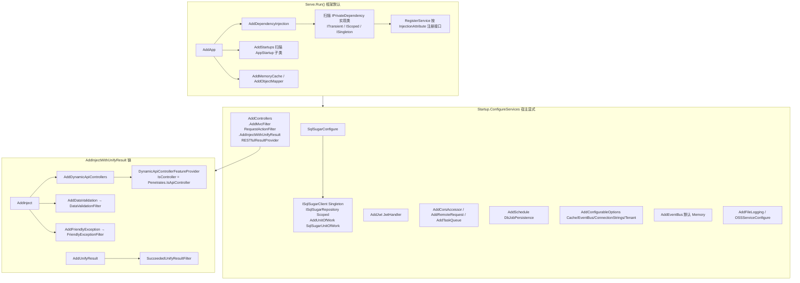
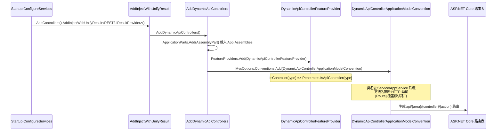
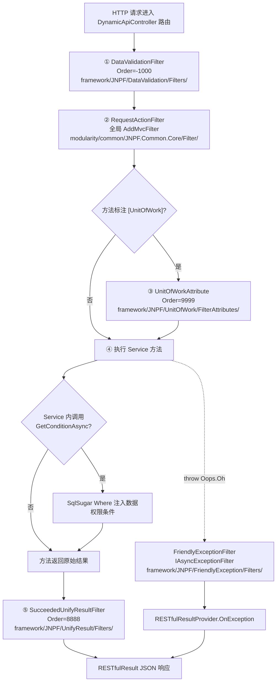
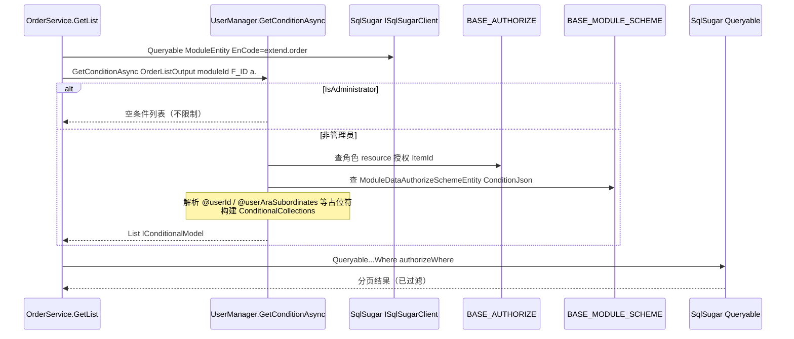
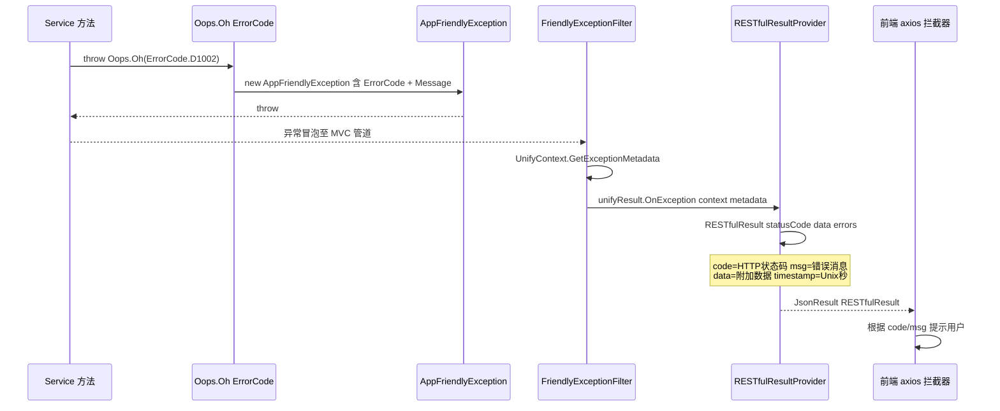
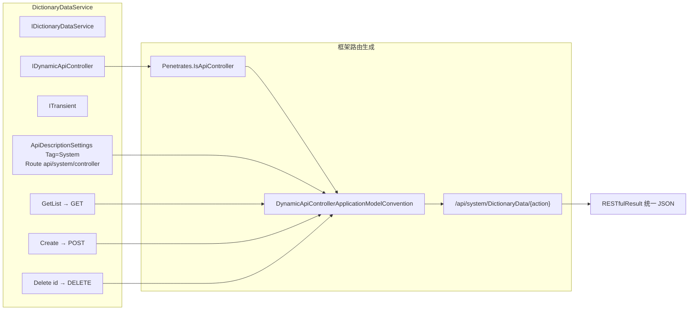

# 【专项文档02】JNPF v5.2 低代码平台 — 应用服务架构深度解剖

> **适用源码**：JNPF v5.2  
> **源码仓库**：`d:\JNPF-v52\backend`  
> **文档编号**：v52-arch-02  
> **文档版本**：v2.0-final  
> **文档状态**：已审核通过  
> **编写日期**：2026-05-24  
> **审核人**：—  
> **批准日期**：—  

**分析范围**：`modularity/` 业务 Service 层共享横切机制——依赖注入、AOP 过滤器、事务、数据权限、错误处理、导入导出、ID 生成、API 规范  
**排除范围**：具体业务模块 CRUD 逻辑（见专项 03）；前端交互（见专项 04）  

**交叉引用**：[01-core-framework.md](./01-core-framework.md) — `Serve.Run()` 双入口、`RESTfulResult` 统一响应、`IDynamicApiController` / `DynamicApiControllerFeatureProvider` 路由生成  

**v5.2 环境锚点**（迁移/部署以 `:30000` 为准）：

| 服务 | 地址 | 说明 |
|------|------|------|
| 后端 API | `http://localhost:30000` | 迁移/部署实际端口 |
| 主 WEB | `http://localhost:3100` | `jnpf-web-vue3` |
| 前端 dev 代理 | `/dev` → `:30000` | `vite.config.ts` `server.proxy` |
| launchSettings | `:5000` | **仅本地调试**，生产文档禁止以 `:5000` 描述 API |

---

## 文档范围

v3.6 假设存在独立 Application 层（Controller → Application Service → Domain）。**v5.2 无独立 Application 层**：业务 `*Service` 实现 `IDynamicApiController` 后直接暴露 HTTP 端点。本篇聚焦所有 Service 共享的横切关注点。

**v5.2 核心变更摘要**：

| 维度 | v5.6 旧假设 | v5.2 实测 |
|------|------------|----------|
| API 暴露 | 手写 Controller | `IDynamicApiController` + 框架扫描 |
| 数据权限 | 独立 Filter | **无**独立 Filter；`IUserManager.GetConditionAsync` 在 Service 查询中注入 SqlSugar 条件 |
| 事务 | 多种方式 | `[UnitOfWork]` + `SqlSugarUnitOfWork` |
| 错误 | 各异 | `Oops.Oh(ErrorCode.xxx)` → `FriendlyExceptionFilter` → `RESTfulResultProvider` |
| 事件总线 | 可能 RabbitMQ | 默认 **Memory**（见 [01-core-framework.md §1.1](./01-core-framework.md)） |

---

## 第一章：依赖注入与服务注册架构

### 1.1 DI 容器注册全景

v5.2 DI 分两层：**框架层约定扫描**（`Serve.Run()` → `AddApp()` → `AddDependencyInjection()`）与 **宿主层显式注册**（`Startup.ConfigureServices`）。

#### 图1-1 DI 注册全景图



**框架约定扫描**（`framework/JNPF/DependencyInjection/Extensions/DependencyInjectionServiceCollectionExtensions.cs`）：

```csharp
// AddInnerDependencyInjection() 核心逻辑
var injectTypes = App.EffectiveTypes
    .Where(u => typeof(IPrivateDependency).IsAssignableFrom(u) && u.IsClass && !u.IsInterface && !u.IsAbstract)
    .OrderBy(u => GetOrder(u));

foreach (var type in injectTypes)
{
    // 排除 IDynamicApiController — 它用于 API 识别，不作为 DI 接口注册
    var canInjectInterfaces = interfaces.Where(u => u != typeof(IDynamicApiController) && ...);
    var dependencyType = interfaces.Last(u => lifetimeInterfaces.Contains(u)); // ITransient/IScoped/ISingleton
    RegisterService(services, dependencyType, type, injectionAttribute, canInjectInterfaces);
}
```

**典型 Service 注册模式**（以 `DictionaryDataService` 为例）：

```csharp
public class DictionaryDataService : IDictionaryDataService, IDynamicApiController, ITransient
```

- `ITransient` → `ServiceLifetime.Transient`
- `IDictionaryDataService` → 业务接口注入
- `IDynamicApiController` → **不参与 DI 注册**，仅用于 MVC 控制器识别

#### 本节核心表清单

| 表名 | 说明 |
|------|------|
| — | 本章为 DI/注册层，无直接数据库表 |

#### 本节关键代码路径索引

| 路径 | 说明 |
|------|------|
| `framework/JNPF/App/Extensions/AppServiceCollectionExtensions.cs` | `AddApp()` → `AddDependencyInjection()` |
| `framework/JNPF/DependencyInjection/Extensions/DependencyInjectionServiceCollectionExtensions.cs` | 约定扫描 `IPrivateDependency` |
| `application/JNPF.API.Entry/Startup.cs` | `ConfigureServices` 宿主显式注册 |
| `application/JNPF.API.Entry/Extensions/SqlSugarConfigureExtensions.cs` | SqlSugar + UnitOfWork 注册 |

---

### 1.2 Service 自动注册为 API 的机制

v5.2 中，满足以下任一条件的 public 类被识别为 API 控制器（`Penetrates.IsApiController`）：

1. 实现 `IDynamicApiController`（**业务 Service 主流方式**）
2. 继承 `ControllerBase`（非 `Controller` 子类）
3. 标注 `[DynamicApiController]`

**DynamicApiController 注册链**（交叉引用 [01-core-framework.md §第三章](./01-core-framework.md)）：



**`DynamicApiControllerFeatureProvider`**（`framework/JNPF/DynamicApiController/Providers/DynamicApiControllerFeatureProvider.cs`）：

```csharp
protected override bool IsController(TypeInfo typeInfo)
{
    return Penetrates.IsApiController(typeInfo);
}
```

**排除规则**：不实现 `IDynamicApiController`、非 public、抽象类、泛型类、值类型 → 不会被注册为 API。纯内部 Helper 只需不实现 `IDynamicApiController` 且不继承 `ControllerBase`。

**HTTP 动词推断**（`Penetrates.VerbToHttpMethods`）：方法名前缀 `Get*` → GET、`Create/Add/Post*` → POST、`Update/Put*` → PUT、`Delete/Remove*` → DELETE；可用 `[HttpGet]` / `[HttpPost]` 等显式覆盖。

#### 本节核心表清单

| 表名 | 说明 |
|------|------|
| — | API 注册机制无直接表依赖 |

#### 本节关键代码路径索引

| 路径 | 说明 |
|------|------|
| `framework/JNPF/DynamicApiController/Dependencies/IDynamicApiController.cs` | 标记接口（空接口） |
| `framework/JNPF/DynamicApiController/Internal/Penetrates.cs` | `IsApiController` 判定 |
| `framework/JNPF/DynamicApiController/Providers/DynamicApiControllerFeatureProvider.cs` | MVC FeatureProvider |
| `framework/JNPF/DynamicApiController/Conventions/DynamicApiControllerApplicationModelConvention.cs` | 路由/动词/参数绑定 |
| `modularity/system/JNPF.Systems/System/DictionaryDataService.cs` | Service + IDynamicApiController 典型示例 |

---

### 1.3 服务生命周期管理

| 生命周期 | 标记接口 | v5.2 典型用途 |
|----------|----------|--------------|
| **Transient** | `ITransient` | 绝大多数 `*Service`（每次请求新建） |
| **Scoped** | `IScoped` | 请求级共享状态（较少用于 Service） |
| **Singleton** | `ISingleton` | `ISqlSugarClient`（SqlSugarScope）、缓存管理器、Options |

**常见错误**：在 `ITransient` Service 中注入 `Scoped` 服务会被 DI 容器拒绝；在 Singleton 中持有 Scoped 实例会导致数据串租户。

#### 本节核心表清单

| 表名 | 说明 |
|------|------|
| — | 生命周期配置无直接表 |

#### 本节关键代码路径索引

| 路径 | 说明 |
|------|------|
| `framework/JNPF/DependencyInjection/Extensions/DependencyInjectionServiceCollectionExtensions.cs` | `TryGetServiceLifetime()` |
| `application/JNPF.API.Entry/Extensions/SqlSugarConfigureExtensions.cs` | `ISqlSugarClient` Singleton 注册 |

---

## 第二章：AOP 横切机制全集

### 2.1 AOP 拦截器架构（诚实清单）

> **重要澄清**：v5.2 **不存在**名为「数据权限过滤器」「防重复提交过滤器」「接口限流过滤器」的全局 MVC Filter 类。数据权限在 Service 查询阶段通过 `IUserManager.GetConditionAsync` 编程式注入；防重复提交与接口限流在源码中**未检出**独立 Filter 实现（【待源码验证】是否由网关/Nginx 层承担）。

#### 图2-1 AOP 过滤器执行顺序图



#### 过滤器诚实清单

| 过滤器 | 类型 | 文件路径 | 触发方式 | Order | 核心逻辑 |
|--------|------|----------|----------|-------|----------|
| **DataValidationFilter** | `IAsyncActionFilter` | `framework/JNPF/DataValidation/Filters/DataValidationFilter.cs` | `AddDataValidation()` 全局 | **-1000** | ModelState / 友好验证异常 → 规范化 400 响应 |
| **RequestActionFilter** | `IAsyncActionFilter` | `modularity/common/JNPF.Common.Core/Filter/RequestActionFilter.cs` | `Startup` `.AddMvcFilter<RequestActionFilter>()` | 0（默认） | 请求完成后异步写 **BASE_SYS_LOG**（EventBus `Log:CreateReLog`）；`[OperateLog]` 写操作日志 |
| **UnitOfWorkAttribute** | `IAsyncActionFilter` + Attribute | `framework/JNPF/UnitOfWork/FilterAttributes/UnitOfWorkAttribute.cs` | 方法/类 `[UnitOfWork]` | **9999** | 调用 `IUnitOfWork.BeginTransaction/Commit/Rollback` |
| **SucceededUnifyResultFilter** | `IAsyncActionFilter` | `framework/JNPF/UnifyResult/Filters/SucceededUnifyResultFilter.cs` | `AddUnifyResult()` 全局 | **8888** | 成功响应包装为 `RESTfulResult` |
| **FriendlyExceptionFilter** | `IAsyncExceptionFilter` | `framework/JNPF/FriendlyException/Filters/FriendlyExceptionFilter.cs` | `AddFriendlyException()` 全局 | — | 捕获 `AppFriendlyException` → `RESTfulResultProvider.OnException` |
| ~~数据权限 Filter~~ | — | **不存在** | — | — | 见 §2.2 `UserManager.GetConditionAsync` |
| ~~防重复提交 Filter~~ | — | **未检出** | — | — | 【待源码验证】 |
| ~~接口限流 Filter~~ | — | **未检出** | — | — | 【待源码验证】 |

**RequestActionFilter 注册**（`application/JNPF.API.Entry/Startup.cs` L96-98）：

```csharp
services.AddControllers()
    .AddMvcFilter<RequestActionFilter>()
    .AddInjectWithUnifyResult<RESTfulResultProvider>()
```

#### 本节核心表清单

| 表名 | 说明 |
|------|------|
| **BASE_SYS_LOG** | `RequestActionFilter` 经 EventBus 异步写入（Type=5 请求日志，Type=3 操作日志） |
| **BASE_API_LOG** | `ApiLogEntity` 映射；部分 API 日志场景使用 |

#### 本节关键代码路径索引

| 路径 | 说明 |
|------|------|
| `modularity/common/JNPF.Common.Core/Filter/RequestActionFilter.cs` | 全局请求/操作日志 |
| `framework/JNPF/DataValidation/Filters/DataValidationFilter.cs` | 入参验证 |
| `framework/JNPF/UnitOfWork/FilterAttributes/UnitOfWorkAttribute.cs` | 声明式事务 |
| `framework/JNPF/UnifyResult/Filters/SucceededUnifyResultFilter.cs` | 成功响应规范化 |
| `framework/JNPF/FriendlyException/Filters/FriendlyExceptionFilter.cs` | 全局异常捕获 |

---

### 2.2 数据权限深度分析

v5.2 **无独立数据权限 Filter**。权限 SQL 在 Service 查询前由 `IUserManager.GetConditionAsync<T>()` 生成 `List<IConditionalModel>`，传入 SqlSugar `.Where(authorizeWhere)`。

#### 数据权限相关表

| 表名 | Entity | 关键字段 |
|------|--------|----------|
| **BASE_AUTHORIZE** | `AuthorizeEntity` | `F_OBJECT_ID`（角色/用户）、`F_ITEM_ID`（资源 ID）、`F_ITEM_TYPE`（`resource` 表示数据权限方案） |
| **BASE_MODULE_SCHEME** | `ModuleDataAuthorizeSchemeEntity` | `F_MODULE_ID`、`F_CONDITION_JSON`（规则 JSON）、`F_ALL_DATA`（1=全部数据） |
| **BASE_MODULE_AUTHORIZE** | `ModuleDataAuthorizeEntity` | 模块字段级权限配置（非运行时 SQL 注入主路径） |
| **BASE_MODULE** | `ModuleEntity` | `F_EN_CODE` 模块编码，Service 据此查 `moduleId` |

#### 图2-2 数据权限 SQL 注入时序图



**Service 侧调用示例**（`modularity/extend/JNPF.Extend/OrderService.cs` L80-85）：

```csharp
var menu = await _repository.AsSugarClient().Queryable<ModuleEntity>()
    .FirstAsync(x => x.EnCode == "extend.order");
if (_userManager.User.IsAdministrator == 0)
    authorizeWhere = await _userManager.GetConditionAsync<OrderListOutput>(menu.Id, "F_ID", true, "a.");
var pageList = await _repository.AsSugarClient().Queryable<OrderEntity, ...>(...)
    .Where((a, b) => a.DeleteMark == null).Where(authorizeWhere)
    ...
```

**数据权限类型与 SQL 转换**（`UserManager.GetConditionAsync` 内，`modularity/common/JNPF.Common.Core/Manager/User/UserManager.cs` L525+）：

| 配置值 | 含义 | 转换方式 |
|--------|------|----------|
| `F_ALL_DATA = 1` 或 `EnCode = jnpf_alldata` | 全部数据 | 仅排除 `f_id = 0` 占位 |
| `@userId` | 当前用户 | 字段 = 当前 UserId |
| `@userAraSubordinates` | 本人及下属 | UserId + Subordinates IN |
| `@organizeId` | 本部门 | 组织 ID 匹配 |
| 自定义 ConditionJson | 自定义规则 | 按 `QueryType` + `ConditionalType` 动态组装 |

#### 本节核心表清单

| 表名 | 说明 |
|------|------|
| **BASE_AUTHORIZE** | 角色/用户与数据权限方案关联 |
| **BASE_MODULE_SCHEME** | 数据权限方案与条件 JSON |
| **BASE_MODULE_AUTHORIZE** | 模块字段级权限定义 |
| **BASE_MODULE** | 模块主键，Service 查询 moduleId |

#### 本节关键代码路径索引

| 路径 | 说明 |
|------|------|
| `modularity/common/JNPF.Common.Core/Manager/User/UserManager.cs` | `GetConditionAsync<T>()` |
| `modularity/common/JNPF.Common.Core/Manager/User/IUserManager.cs` | 接口定义 |
| `modularity/system/JNPF.Systems.Entitys/Entity/System/ModuleDataAuthorizeSchemeEntity.cs` | `BASE_MODULE_SCHEME` |
| `modularity/system/JNPF.Systems.Entitys/Entity/Permission/AuthorizeEntity.cs` | `BASE_AUTHORIZE` |
| `modularity/extend/JNPF.Extend/OrderService.cs` | 数据权限调用示例 |

---

### 2.3 操作日志 AOP

`RequestActionFilter.OnActionExecutionAsync` 在 Action 执行**之后**（`await next()` 返回后）通过 `IEventPublisher` 发布日志事件：

| 场景 | EventBus 事件 | 日志 Type | 触发条件 |
|------|--------------|-----------|----------|
| 所有 API 请求 | `Log:CreateReLog` | 5（请求日志） | 未标注 `[IgnoreLog]` |
| 业务操作 | `Log:CreateOpLog` | 3（操作日志） | Action 标注 `[OperateLog(ModuleName=...)]` |

写入策略：**异步 EventBus**（默认 Memory 总线，见 [01-core-framework.md](./01-core-framework.md) §1.1），不阻塞 HTTP 响应；失败仅 `_logger.LogError`。

主键 ID 使用 `SnowflakeIdHelper.NextId()`（`RequestActionFilter.cs` L78）。

#### 本节核心表清单

| 表名 | 说明 |
|------|------|
| **BASE_SYS_LOG** | `SysLogEntity`；`F_Type` 区分日志类型 |
| **BASE_API_LOG** | `ApiLogEntity`；接口级详细日志 |

#### 本节关键代码路径索引

| 路径 | 说明 |
|------|------|
| `modularity/common/JNPF.Common.Core/Filter/RequestActionFilter.cs` | 请求/操作日志 AOP |
| `modularity/system/JNPF.Systems.Entitys/Entity/System/SysLogEntity.cs` | `BASE_SYS_LOG` Entity |
| `modularity/system/JNPF.Systems.Entitys/Entity/System/ApiLogEntity.cs` | `BASE_API_LOG` Entity |

---

### 2.4 防重复提交

**源码检索结论**：`modularity/` 与 `framework/JNPF` 下**未检出**名为 `PreventDuplicate` / `RepeatSubmit` 的全局 Filter 或 Attribute。

可能的替代机制（局部、非全局）：

- 前端按钮防抖 + Token 校验
- 业务层 `ErrorCode.D1408`（并发锁定）在在线开发模块使用
- 【待源码验证】Redis 分布式锁是否在特定 Service 内联实现

#### 本节核心表清单

| 表名 | 说明 |
|------|------|
| — | 无专用防重复提交表 |

#### 本节关键代码路径索引

| 路径 | 说明 |
|------|------|
| — | 全局防重复提交 Filter **不存在** |

---

### 2.5 事务管理（UnitOfWork）

#### 注册

`application/JNPF.API.Entry/Extensions/SqlSugarConfigureExtensions.cs` L44：

```csharp
services.AddUnitOfWork<SqlSugarUnitOfWork>(); // 事务与工作单元注册
```

#### 实现

`modularity/common/JNPF.Common/UnitOfWork/SqlSugarUnitOfWork.cs`：

```csharp
public void BeginTransaction(FilterContext context, UnitOfWorkAttribute unitOfWork)
    => _sqlSugarClient.AsTenant().BeginTran();

public void CommitTransaction(FilterContext resultContext, UnitOfWorkAttribute unitOfWork)
    => _sqlSugarClient.AsTenant().CommitTran();

public void RollbackTransaction(FilterContext resultContext, UnitOfWorkAttribute unitOfWork)
    => _sqlSugarClient.AsTenant().RollbackTran();
```

#### 使用方式

在 Service 方法上标注 `[UnitOfWork]`（`UnitOfWorkAttribute` 同时是 Filter，Order=9999）：

```csharp
// modularity/system/JNPF.Systems/System/ModuleService.cs L648-650
[HttpDelete("{id}")]
[UnitOfWork]
public async Task Delete(string id) { ... }
```

```csharp
// modularity/system/JNPF.Systems/System/DictionaryDataService.cs L377-379
[HttpPost("Actions/Import")]
[UnitOfWork]
public async Task ActionsImport(IFormFile file, int type) { ... }
```

**声明式 vs 编程式**：

| 方式 | 用法 | 适用场景 |
|------|------|----------|
| 声明式 | `[UnitOfWork]` on 方法/类 | 多表写操作、导入批量入库 |
| 编程式 | `_sqlSugarClient.AsTenant().BeginTran()` | 【待源码验证】少数手动事务场景 |

`UnitOfWorkAttribute` 支持 `UseAmbientTransaction` 启用 `TransactionScope` 分布式事务（默认 false）。

#### 本节核心表清单

| 表名 | 说明 |
|------|------|
| — | UnitOfWork 为 ORM 事务层，无专用表 |

#### 本节关键代码路径索引

| 路径 | 说明 |
|------|------|
| `framework/JNPF/UnitOfWork/FilterAttributes/UnitOfWorkAttribute.cs` | 声明式事务 Filter |
| `modularity/common/JNPF.Common/UnitOfWork/SqlSugarUnitOfWork.cs` | SqlSugar 事务实现 |
| `application/JNPF.API.Entry/Extensions/SqlSugarConfigureExtensions.cs` | `AddUnitOfWork<SqlSugarUnitOfWork>()` |
| `framework/JNPF/UnitOfWork/Extensions/UnitOfWorkServiceCollectionExtensions.cs` | 扩展方法定义 |

---

## 第三章：错误处理机制

### 3.1 Oops.Oh 模式

v5.2 统一业务异常抛出：`throw Oops.Oh(ErrorCode.xxx)` 或 `throw Oops.Oh("自定义消息")`。

#### ErrorCode 枚举

定义路径：`modularity/common/JNPF.Common/Enums/ErrorCode.cs`，标注 `[ErrorCodeType]`，各成员用 `[ErrorCodeItemMetadata("消息")]` 绑定用户可见文案。

**代表性错误码**（Auth 段 D1000 系列）：

| 枚举值 | 用户消息 |
|--------|----------|
| `D1000` | 账号或密码错误 |
| `D1002` | 记录不存在 |
| `D1006` | 数据已存在 |
| `D1013` | 操作失败！您没有权限操作 |
| `D1016` | 没有权限 |
| `COM1000` | 新增数据失败 |
| `COM1001` | 修改数据失败 |
| `COM1002` | 删除数据失败 |

完整列表见源码（2600+ 行），按模块分段：D1xxx Auth、D2xxx 机构、D3xxx 字典、D4xxx 菜单、D5xxx 用户、WFxxxx 工作流等。

#### Oops.Oh 实现要点

`framework/JNPF/FriendlyException/Oops.cs`：

```csharp
// 抛出错误码异常
public static AppFriendlyException Oh(object errorCode, params object[] args)
{
    var (ErrorCode, Message) = GetErrorCodeMessage(errorCode, null, args);
    var friendlyException = new AppFriendlyException(Message, errorCode) { ErrorCode = ErrorCode };
    if (_friendlyExceptionSettings.ThrowBah == true)
    {
        friendlyException.StatusCode(StatusCodes.Status400BadRequest);
        friendlyException.ValidationException = true;
    }
    return friendlyException;
}

// 抛出字符串异常
public static AppFriendlyException Oh(string errorMessage, params object[] args)
{
    var friendlyException = new AppFriendlyException(MontageErrorMessage(errorMessage, default, null, args), default);
    ...
    return friendlyException;
}

// 业务验证异常（400）
public static AppFriendlyException Bah(object errorCode, params object[] args)
{
    var friendlyException = Oh(errorCode, typeof(ValidationException), args)
        .StatusCode(StatusCodes.Status400BadRequest);
    friendlyException.ValidationException = true;
    return friendlyException;
}
```

**StatusCode 链式调用**（`framework/JNPF/FriendlyException/Extensions/AppFriendlyExceptionExtensions.cs`）：

```csharp
public static AppFriendlyException StatusCode(this AppFriendlyException exception,
    int statusCode = StatusCodes.Status500InternalServerError)
{
    exception.StatusCode = statusCode;
    return exception;
}
```

#### Service 实测示例

**OAuth 登录**（`modularity/oauth/JNPF.OAuth/OAuthService.cs`）：

```csharp
if (!_sqlSugarClient.Ado.IsValidConnection()) throw Oops.Oh(ErrorCode.D1032);
_ = user ?? throw Oops.Oh(ErrorCode.D1000);
```

**菜单删除**（`modularity/system/JNPF.Systems/System/ModuleService.cs` L653-654）：

```csharp
if (entity == null || await _repository.IsAnyAsync(x => x.ParentId == id && x.DeleteMark == null))
    throw Oops.Oh(ErrorCode.D1039);
```

**字典导入**（`modularity/system/JNPF.Systems/System/DictionaryDataService.cs` L382-383）：

```csharp
if (!fileType.ToLower().Equals(ExportFileType.bdd.ToString()))
    throw Oops.Oh(ErrorCode.D3006);
```

### 3.2 全局异常处理链路

#### 图3-1 异常处理链路图



**FriendlyExceptionFilter 关键分支**（`framework/JNPF/FriendlyException/Filters/FriendlyExceptionFilter.cs` L119-127）：

```csharp
// WebAPI + 启用规范化
context.Result = unifyResult.OnException(context, exceptionMetadata);
```

**RESTfulResultProvider.OnException**（`framework/JNPF/UnifyResult/Providers/RESTfulResultProvider.cs` L21-29）：

```csharp
public IActionResult OnException(ExceptionContext context, ExceptionMetadata metadata)
{
    return new JsonResult(RESTfulResult(metadata.StatusCode, data: metadata.Data, errors: metadata.Errors)
        , UnifyContext.GetSerializerSettings(context));
}
```

**统一响应结构**（`framework/JNPF/UnifyResult/Internal/RESTfulResult.cs`）：

```csharp
public class RESTfulResult<T>
{
    public int? code { get; set; }      // HTTP 或业务状态码
    public object msg { get; set; }   // 错误或成功消息
    public T data { get; set; }
    public object extras { get; set; }
    public long timestamp { get; set; }
}
```

交叉引用：[01-core-framework.md §第五章](./01-core-framework.md) 统一响应与 `UseUnifyResultStatusCodes` 中间件（401 → code=600「登录过期」）。

#### 本节核心表清单

| 表名 | 说明 |
|------|------|
| — | ErrorCode 为枚举+配置，无独立表；可选 `ErrorCodeMessageSettings` JSON 扩展 |

#### 本节关键代码路径索引

| 路径 | 说明 |
|------|------|
| `framework/JNPF/FriendlyException/Oops.cs` | `Oh` / `Bah` / `Text` |
| `modularity/common/JNPF.Common/Enums/ErrorCode.cs` | 系统错误码枚举 |
| `framework/JNPF/FriendlyException/Filters/FriendlyExceptionFilter.cs` | 全局异常 Filter |
| `framework/JNPF/UnifyResult/Providers/RESTfulResultProvider.cs` | 异常→JSON 转换 |
| `framework/JNPF/UnifyResult/Internal/RESTfulResult.cs` | 响应 DTO |

---

## 第四章：通用服务基础设施

### 4.1 导入导出引擎

| 组件 | 版本/路径 | 用途 |
|------|----------|------|
| **NPOI** | `modularity/common/JNPF.Common/Security/ExcelExportHelper.cs` | Excel 导出（HSSF/XSSF） |
| **文件导入** | `IFileManager.Import()` | 字典等模块 `.bdd` 格式导入 |

**导入链路**（`DictionaryDataService.ActionsImport`）：

1. 前端 `IFormFile` 上传 → `[HttpPost("Actions/Import")]`
2. 扩展名校验（`.bdd`）→ 失败 `Oops.Oh(D3006)`
3. `_fileManager.Import(file)` 解析 JSON
4. 业务校验 → `[UnitOfWork]` 批量入库
5. 失败聚合 → `Oops.Oh(COM1018, 错误列表)`

**导出链路**：Service 查询 → `ExcelExportHelper.Export(list, excelConfig, path)` → 文件下载 API（`FileService`）。

### 4.2 文件存储服务

`Startup.cs` L258：`services.OSSServiceConfigure()` 注册对象存储。

| 策略 | 配置 | 实现 |
|------|------|------|
| 本地磁盘 | `AppOptions` | `IFileManager` 默认实现 |
| MinIO / OSS | OSS 配置节 | 【待源码验证】`OSSServiceConfigure` 具体 Provider |

`FileService`（`modularity/system/JNPF.Systems/Common/FileService.cs`）实现 `IDynamicApiController`，路由 `api/[controller]`，提供上传/下载/预览。

文件元数据：多数场景文件名存业务表字段，**无统一 BASE_FILE 主表**（【待源码验证】扩展模块是否有独立文件表）。

### 4.3 ID 生成策略

**主键策略**：字符串 Snowflake ID，由 `SnowflakeIdHelper.NextId()` 生成。

`modularity/common/JNPF.Common/Security/SnowflakeIdHelper.cs`：

- 基于 **Yitter.IdGenerator**（`YitIdHelper`）
- WorkerId 通过 Redis 注册（`CacheOptions.ip/port/password`，`RegisterOne` native DLL）
- 返回 `string` 类型 ID

**Entity 基类自动赋值**（`modularity/common/JNPF.Common/Contracts/TenantCLDSEntityBase.cs`）：

```csharp
public virtual void Creator()
{
    ...
    this.Id = SnowflakeIdHelper.NextId();
    ...
}

public virtual void Create()
{
    ...
    this.Id = this.Id == null ? SnowflakeIdHelper.NextId() : this.Id;
    ...
}
```

继承链：`TenantCLDSEntityBase` → `TenantEntityBase<string>` → 业务 Entity（如 `UserEntity`、`AuthorizeEntity`）。

### 4.4 数据字典服务

| 表名 | Entity | 关键字段 |
|------|--------|----------|
| **BASE_DICTIONARY_TYPE** | `DictionaryTypeEntity` | `F_EN_CODE`、`F_FULL_NAME` |
| **BASE_DICTIONARY_DATA** | `DictionaryDataEntity` | `F_DICTIONARY_TYPE_ID`、`F_EN_CODE`、`F_FULL_NAME` |

缓存策略：字典读取经 `IDictionaryDataService` / `IDictionaryTypeService`；具体 Redis 缓存键【待源码验证】是否在 `CacheManager` 层封装。

### 4.5 接口限流

**源码检索结论**：框架层与 `JNPF.Common.Core` **未检出**专用限流 Filter 或中间件。

可能的限流点：

- `ErrorCode.D9002`「此IP未在白名单中」— IP 白名单而非 QPS 限流
- 反向代理 / API 网关层【待部署验证】

#### 本节核心表清单

| 表名 | 说明 |
|------|------|
| **BASE_DICTIONARY_TYPE** | 字典分类 |
| **BASE_DICTIONARY_DATA** | 字典项 |
| **BASE_SYS_LOG** | 操作/请求日志（导入导出审计） |

#### 本节关键代码路径索引

| 路径 | 说明 |
|------|------|
| `modularity/common/JNPF.Common/Security/ExcelExportHelper.cs` | NPOI 导出 |
| `modularity/common/JNPF.Common/Security/SnowflakeIdHelper.cs` | 雪花 ID |
| `modularity/common/JNPF.Common/Contracts/TenantCLDSEntityBase.cs` | 创建时自动 NextId |
| `modularity/system/JNPF.Systems/Common/FileService.cs` | 文件上传下载 API |
| `modularity/system/JNPF.Systems/System/DictionaryDataService.cs` | 字典 CRUD + 导入 |

---

## 第五章：API 规范与接口设计

### 5.1 IDynamicApiController API 设计规范

#### 图5-1 Service → API 自动生成机制图



**路由规则**：

| 规则 | 说明 | 示例 |
|------|------|------|
| 默认路由模板 | `api/[controller]` 或类上 `[Route]` | `[Route("api/system/[controller]")]` |
| Controller 名 | 去 `Service`/`AppService` 后缀 | `DictionaryDataService` → `DictionaryData` |
| HTTP 方法 | 方法名前缀推断或 `[HttpGet]` 等 | `GetList` → GET；`Create` → POST |
| 自定义 Action 路由 | `[HttpGet("{id}")]` | `GetInfo(string id)` → GET `.../DictionaryData/{id}` |
| 统一响应 | `RESTfulResultProvider.OnSucceeded` | `{ code:200, data:{...}, msg:"操作成功", timestamp }` |

**统一响应格式**（交叉引用 [01-core-framework.md](./01-core-framework.md)）：

```json
{
  "code": 200,
  "msg": "操作成功",
  "data": { },
  "extras": null,
  "timestamp": 1716518400
}
```

特殊 Header `jnpf_api` 存在时，`OnSucceeded` 直接返回原始 `data` 不包装（`RESTfulResultProvider.cs` L40-42）。

### 5.2 Swagger 文档配置

- `AddInject()` → `AddSpecificationDocuments()` 注册 OpenAPI
- `DynamicApiControllerApplicationModelConvention` 读取 `[ApiDescriptionSettings(Tag, Name, Order)]` 分组
- `Startup.Configure` → `UseKnife4UI` 路由前缀 `/newapi`
- `services.AddCachingSwaggerProvider()` 缓存 Swagger 文档

Service 类示例：

```csharp
[ApiDescriptionSettings(Tag = "System", Name = "DictionaryData", Order = 203)]
[Route("api/system/[controller]")]
public class DictionaryDataService : IDictionaryDataService, IDynamicApiController, ITransient
```

#### 本节核心表清单

| 表名 | 说明 |
|------|------|
| — | API 规范层无直接表 |

#### 本节关键代码路径索引

| 路径 | 说明 |
|------|------|
| `framework/JNPF/DynamicApiController/Conventions/DynamicApiControllerApplicationModelConvention.cs` | 路由/分组/Swagger |
| `framework/JNPF/UnifyResult/Providers/RESTfulResultProvider.cs` | 统一响应 |
| `framework/JNPF/SpecificationDocument/Builders/SpecificationDocumentBuilder.cs` | OpenAPI 构建 |
| `application/JNPF.API.Entry/Startup.cs` | Knife4UI + Swagger 缓存 |

---

## 关键代码路径速查表（本篇专用）

| # | 路径/类 | 用途 |
|---|---------|------|
| 1 | `modularity/common/JNPF.Common.Core/Filter/RequestActionFilter.cs` | 全局请求/操作日志 AOP |
| 2 | `framework/JNPF/DynamicApiController/Dependencies/IDynamicApiController.cs` | Service → API 标记接口 |
| 3 | `modularity/common/JNPF.Common/UnitOfWork/SqlSugarUnitOfWork.cs` | SqlSugar 事务 UnitOfWork |
| 4 | `framework/JNPF/FriendlyException/Oops.cs` + `modularity/common/JNPF.Common/Enums/ErrorCode.cs` | 错误抛出与错误码 |
| 5 | `framework/JNPF/UnifyResult/Internal/RESTfulResult.cs` | 统一响应 DTO |
| 6 | `application/JNPF.API.Entry/Startup.cs` `ConfigureServices` | DI + Filter + EventBus 注册 |
| 7 | `modularity/common/JNPF.Common.Core/Manager/User/UserManager.cs` `GetConditionAsync` | 数据权限（非 Filter） |
| 8 | `modularity/common/JNPF.Common.Core/Filter/RequestActionFilter.cs` | 操作日志 AOP |

---

## 本篇产出清单

| 产出项 | 数量 | 位置 |
|--------|------|------|
| DI 注册全景图 | 1 | §1.1 图1-1 |
| Service → API 机制图 | 1 | §1.2 sequenceDiagram + §5.1 图5-1 |
| AOP 拦截器架构图 | 1 | §2.1 图2-1 |
| 数据权限 SQL 注入时序图 | 1 | §2.2 图2-2 |
| 全局异常处理链路图 | 1 | §3.2 图3-1 |
| 核心代码片段 | ≥10 | 各章源码引用 |
| 涉及数据库表 | ≥5 | BASE_SYS_LOG、BASE_API_LOG、BASE_AUTHORIZE、BASE_MODULE_SCHEME、BASE_MODULE_AUTHORIZE、BASE_MODULE、BASE_DICTIONARY_* |

---

> 编写依据：v5.2 源码实测（2026-05-24）；禁止引用 [`../archive/pre-v52-rewrite/`](../archive/pre-v52-rewrite/) 旧正文。
