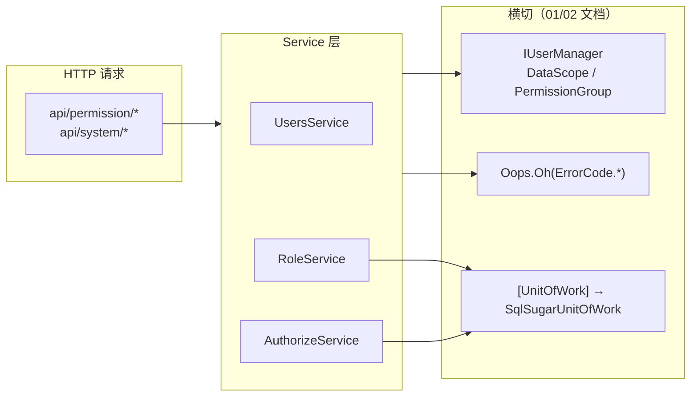
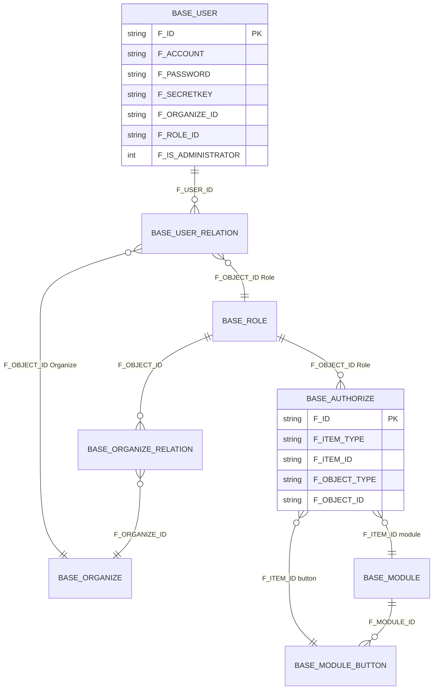
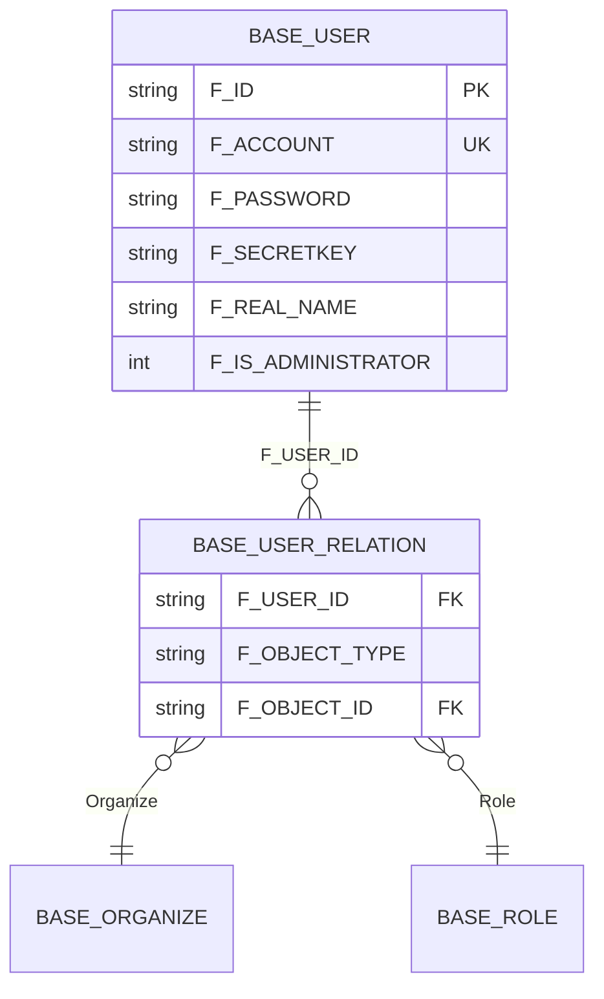
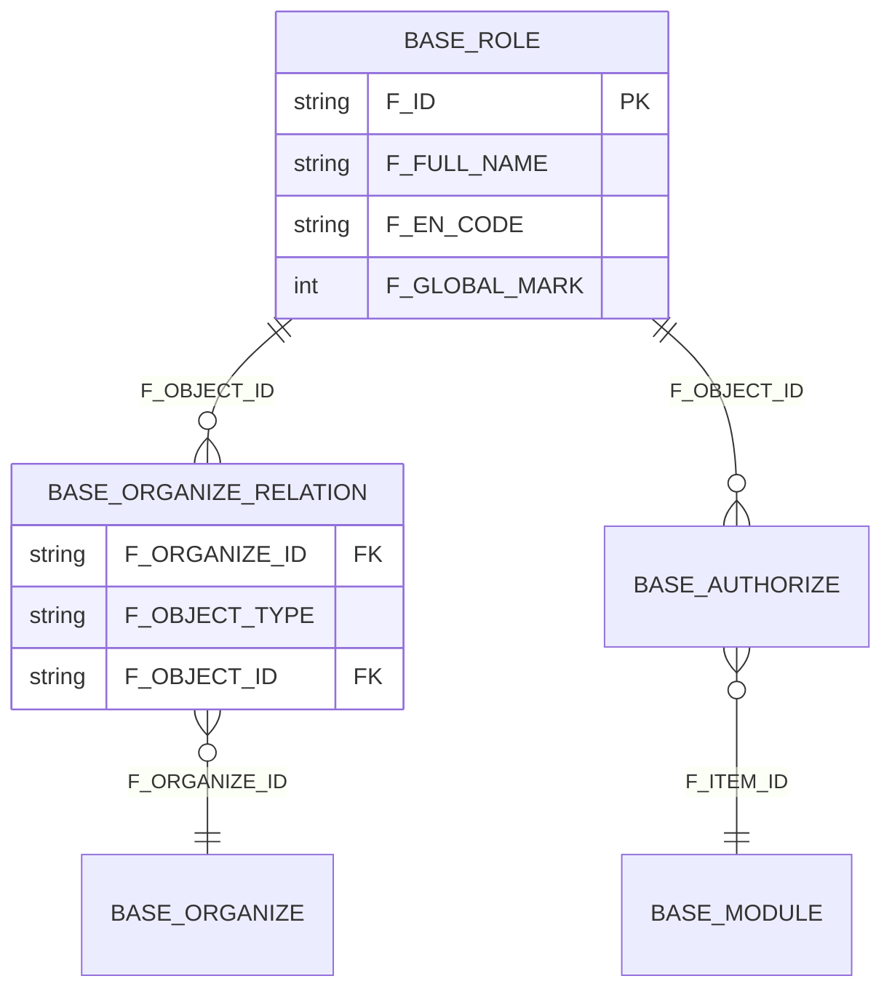
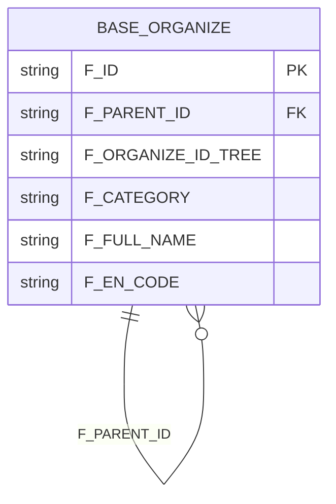
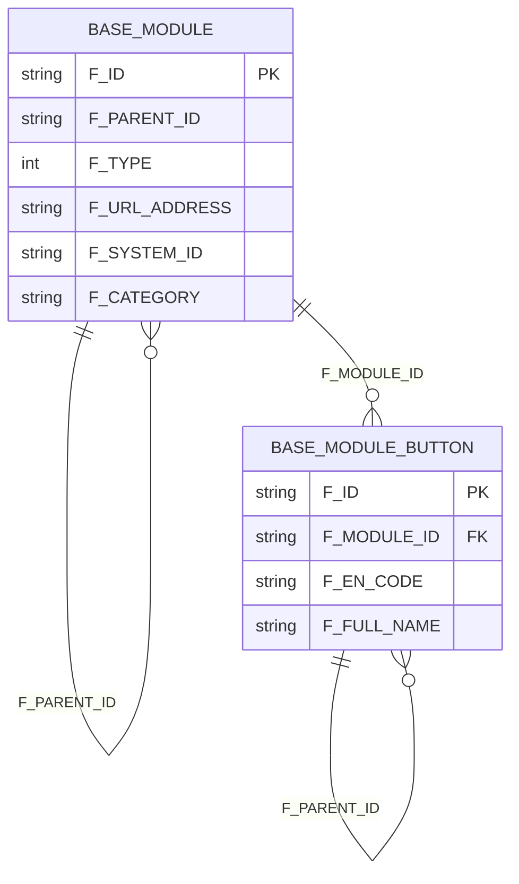
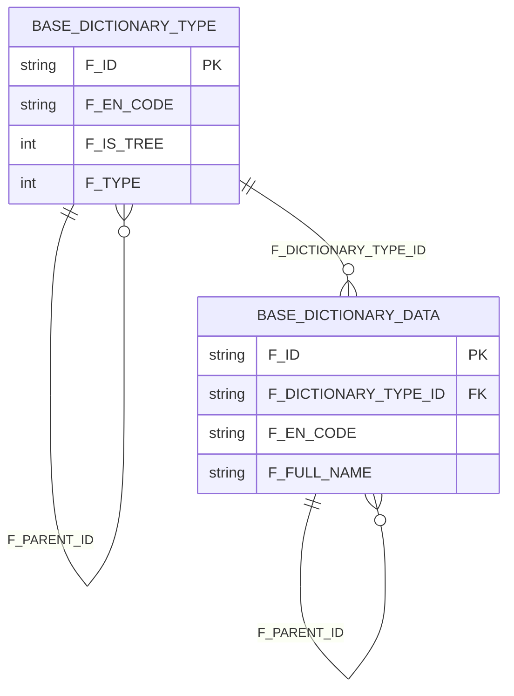
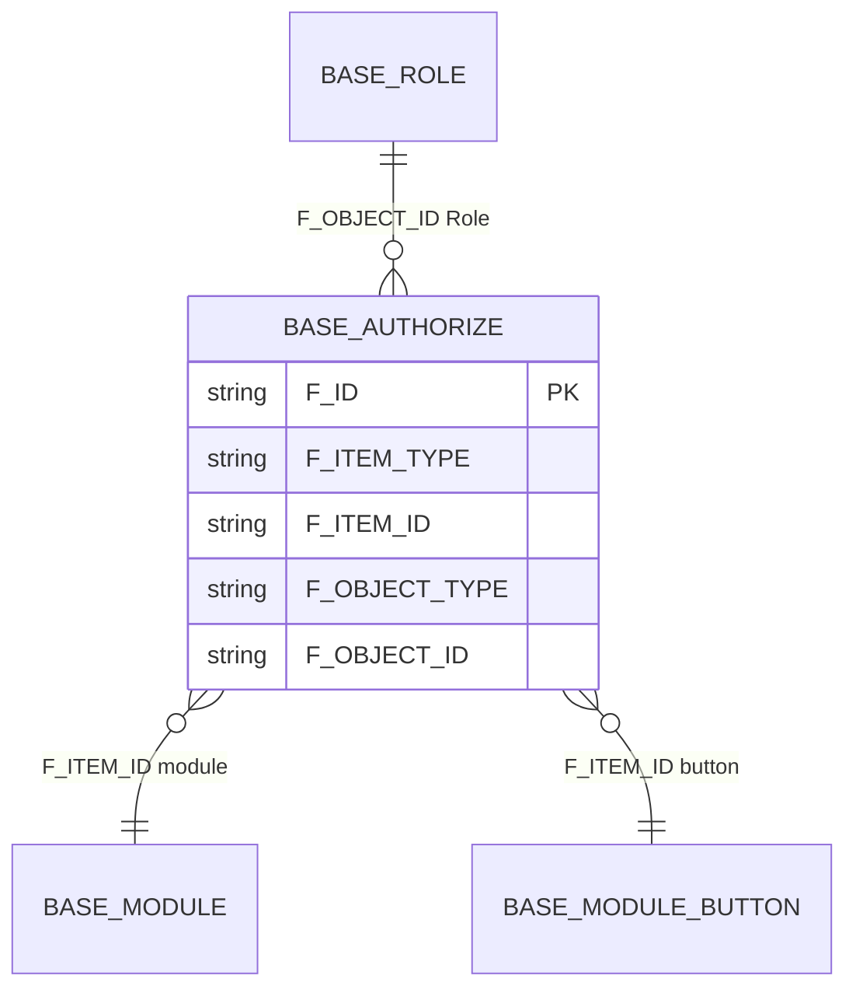
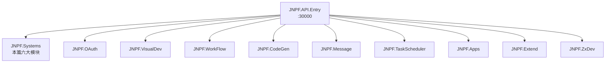

# 【专项文档03】JNPF v5.2 低代码平台 — 业务模块架构深度解剖

> **适用版本**：JNPF v5.2  
> **源码仓库**：`d:\JNPF-v52\backend`  
> **文档编号**：v52-arch-03  
> **文档版本**：v2.0-final  
> **编写日期**：2026-05-24  
> **审核状态**：已审核（2026-05-24）  

> **分析范围**：`modularity/system/JNPF.Systems` 权限与系统管理六大模块（用户、角色、组织、菜单、字典、授权）  
> **排除范围**：前端页面细节（见专项 04）、VisualDev/WorkFlow 业务实现（本章仅概览）  
> **交叉引用**：[01-core-framework.md](01-core-framework.md)（DynamicApiController、Oops.Oh、UnitOfWork、JWT）· [02-application-services.md](02-application-services.md)（IUserManager.DataScope、分级数据权限、事务 AOP）  

---

## 第零章：范围、约束与横切机制

### 0.1 v5.2 表名与 API 约束

| 约束项 | v5.2 实测值 | 禁止项 |
|--------|-------------|--------|
| 菜单表 | **BASE_MODULE** | ~~sys_menu~~、~~BASE_MENU~~ |
| 按钮表 | **BASE_MODULE_BUTTON** | ~~sys_button~~、~~BASE_BUTTON~~ |
| 权限关联 | **BASE_AUTHORIZE** | 臆造权限表名 |
| 字段前缀 | **F_**（如 `F_ACCOUNT`、`F_ITEM_TYPE`） | 无前缀驼峰列名 |
| HTTP 入口 | `*Service : IDynamicApiController` 自动生成 | 手写 Controller |

路由命名：`[ApiDescriptionSettings(Name = "...")]` 覆盖控制器名（如 `ModuleService` → 路由前缀 `api/system/Menu`），详见 [01-core-framework.md §5](01-core-framework.md)。

### 0.2 横切机制与本篇模块的关系



- **数据权限**：非管理员通过 `_userManager.DataScope`（组织级 Select/Add/Edit/Delete）过滤列表与写操作，见 [02-application-services.md §2.2（数据权限）](./02-application-services.md#22-aop-横切机制全集)。
- **功能权限**：角色/岗位/用户与菜单/按钮/列/表单/资源的多对多关联写入 **BASE_AUTHORIZE**，运行时由 `ModuleService.GetUserModuleList` 等读取。
- **事务**：`RoleService.Create/Delete`、`ModuleService.Creater/Delete`、`AuthorizeService.SavePortalAuthorize` 等标注 `[UnitOfWork]`，由框架 `SqlSugarUnitOfWork` 拦截提交/回滚（[01-core-framework.md §7](01-core-framework.md)）。

### 0.3 权限域总览 ER 图（图0-1）



**本节核心表清单**

| 表名 | 用途 |
|------|------|
| **BASE_USER** | 用户主档 |
| **BASE_USER_RELATION** | 用户↔组织/角色/岗位/分组 |
| **BASE_ROLE** | 角色 |
| **BASE_ORGANIZE** | 组织树 |
| **BASE_ORGANIZE_RELATION** | 角色/岗位↔组织 |
| **BASE_AUTHORIZE** | 权限项↔授权对象 |
| **BASE_MODULE** | 菜单/模块 |
| **BASE_MODULE_BUTTON** | 按钮权限 |

**本节关键代码路径索引**

| 路径 | 说明 |
|------|------|
| `modularity/system/JNPF.Systems/` | 本篇全部 Service 实现 |
| `modularity/system/JNPF.Systems.Entitys/Entity/` | Entity 与 `[SugarTable("BASE_*")]` |
| `framework/JNPF/DynamicApiController/` | 动态 API 路由约定 |
| `modularity/common/JNPF.Common.Core/Manager/User/IUserManager.cs` | 用户上下文与 DataScope |

---

## 第一章：用户管理（UsersService）

### 1.1 核心数据表

| 表名 | Entity | 关键字段 |
|------|--------|----------|
| **BASE_USER** | `UserEntity` | `F_ACCOUNT`、`F_REAL_NAME`、`F_PASSWORD`、`F_SECRETKEY`、`F_ORGANIZE_ID`、`F_ROLE_ID`、`F_IS_ADMINISTRATOR`、`F_LOCK_MARK` |
| **BASE_USER_RELATION** | `UserRelationEntity` | `F_USER_ID`、`F_OBJECT_TYPE`（Organize/Role/Position/Group）、`F_OBJECT_ID` |

公共审计字段（各表继承 `TenantCLDSEntityBase`）：`F_ID`、`F_SORT_CODE`、`F_ENABLED_MARK`、`F_DELETE_MARK`、`F_CREATOR_TIME`、`F_TENANT_ID`。

#### 图1-1 用户模块 ER



### 1.2 后端 API 清单

Service：`modularity/system/JNPF.Systems/Permission/UsersService.cs`  
路由前缀：`api/permission/Users`（`[ApiDescriptionSettings(Name = "Users")]`）

| 自动生成路由 | HTTP | Service 方法 | 功能 |
|--------------|------|--------------|------|
| `api/permission/Users` | GET | `GetList` | 分页用户列表（组织过滤 + DataScope） |
| `api/permission/Users/{id}` | GET | `GetInfo` | 用户详情 |
| `api/permission/Users` | POST | `Create` | 新建用户（密码 MD5+Secretkey） |
| `api/permission/Users/{id}` | PUT | `Update` | 编辑用户 |
| `api/permission/Users/{id}` | DELETE | `Delete` | 软删除 |
| `api/permission/Users/{id}/Actions/ResetPassword` | POST | `ResetPassword` | 重置密码 |
| `api/permission/Users/Selector` | GET | `GetSelector` | 用户下拉 |

### 1.3 核心业务逻辑

#### 1.3.1 密码加密（MD5 + Secretkey）

新建用户时生成随机 `F_SECRETKEY`，密码算法为 **双重 MD5 再拼接 Secretkey**：

```
F_PASSWORD = MD5( MD5(明文密码) + F_SECRETKEY )
```

登录校验在 `OAuthService.Login` 使用 **单次 MD5 + Secretkey**（与存储算法不同，存储时已做过内层 MD5）：

```
encryptPassword = MD5( input.password + user.Secretkey )
```

与 [01-core-framework.md §6](01-core-framework.md) OAuth 链路交叉引用。

#### 1.3.2 查询流程（分页 + 数据权限）

`GetList` 通过 `UserRelationEntity` 子查询关联组织，非管理员追加 `dataScope.Contains(x.ObjectId)` 过滤（见代码片段 1-2）。

#### 1.3.3 新增流程

1. 多租户账号额度校验 → `Oops.Oh(D1041)`  
2. 账号唯一性 → `Oops.Oh(D1003)`  
3. 写入 **BASE_USER** + **BASE_USER_RELATION**（角色/岗位/组织/分组）  
4. 可选第三方同步（钉钉/企业微信）

### 1.4 核心代码片段

**代码片段 1-1：新建用户 — 密码 MD5+Secretkey**

```csharp
// modularity/system/JNPF.Systems/Permission/UsersService.cs — Create()
entity.Secretkey = Guid.NewGuid().ToString();                                    // ★ 随机密钥

var defaultPassWord = await _repository.AsSugarClient().Queryable<SysConfigEntity>()
    .Where(it => it.Key.Equals("newUserDefaultPassword"))
    .Select(it => it.Value).FirstAsync();

entity.Password = MD5Encryption.Encrypt(                                         // ★ 双重 MD5 + Secretkey
    MD5Encryption.Encrypt(defaultPassWord) + entity.Secretkey);

await _repository.AsInsertable(entity).CallEntityMethod(m => m.Creator()).ExecuteCommandAsync();
// 批量写入 BASE_USER_RELATION：Role / Position / Organize / Group
await _userRelationService.Create(userRelationList);
```

**代码片段 1-2：列表查询 — IUserManager.DataScope 过滤**

```csharp
// modularity/system/JNPF.Systems/Permission/UsersService.cs — GetList()
var dataScope = _userManager.DataScope.Where(x => x.Select).Select(x => x.organizeId).Distinct().ToList();

data = await _repository.AsQueryable()
    .Where(a => a.DeleteMark == null && !a.Account.Equals("admin"))
    .WhereIF(!_userManager.IsAdministrator, a =>
        SqlFunc.Subqueryable<UserRelationEntity>()
            .Where(x => dataScope.Contains(x.ObjectId) && x.UserId.Equals(a.Id)).Any())  // ★ 分级数据权限
    .ToPagedListAsync(input.currentPage, input.pageSize);
```

**代码片段 1-3：登录密码校验（OAuth 交叉引用）**

```csharp
// modularity/oauth/JNPF.OAuth/OAuthService.cs — Login()
var encryptPasswod = MD5Encryption.Encrypt(input.password + user.Secretkey);       // ★ 登录侧算法
var userAnyPwd = await _sqlSugarClient.Queryable<UserEntity>()
    .FirstAsync(u => u.Account == input.account && u.Password == encryptPasswod && u.DeleteMark == null);
if (userAnyPwd.IsNullOrEmpty()) throw Oops.Oh(ErrorCode.D1000);
```

**本节核心表清单**：**BASE_USER**、**BASE_USER_RELATION**

**本节关键代码路径索引**

| 路径 | 类/方法 |
|------|---------|
| `modularity/system/JNPF.Systems/Permission/UsersService.cs` | `GetList`、`Create`、`Delete`、`ResetPassword` |
| `modularity/system/JNPF.Systems.Entitys/Entity/Permission/UserEntity.cs` | `UserEntity` → **BASE_USER** |
| `modularity/system/JNPF.Systems.Entitys/Entity/Permission/UserRelationEntity.cs` | `UserRelationEntity` → **BASE_USER_RELATION** |
| `modularity/oauth/JNPF.OAuth/OAuthService.cs` | `Login` 密码校验 |

---

## 第二章：角色管理（RoleService）

### 2.1 核心数据表

| 表名 | Entity | 关键字段 |
|------|--------|----------|
| **BASE_ROLE** | `RoleEntity` | `F_FULL_NAME`、`F_EN_CODE`、`F_TYPE`、`F_GLOBAL_MARK`（1=全局/0=组织） |
| **BASE_ORGANIZE_RELATION** | `OrganizeRelationEntity` | `F_ORGANIZE_ID`、`F_OBJECT_TYPE=Role`、`F_OBJECT_ID` |
| **BASE_AUTHORIZE** | `AuthorizeEntity` | 角色拥有的 menu/module/button/column/form/resource 项 |

#### 图2-1 角色模块 ER



### 2.2 后端 API 清单

Service：`modularity/system/JNPF.Systems/Permission/RoleService.cs`  
路由前缀：`api/permission/Role`

| 自动生成路由 | HTTP | Service 方法 | 功能 |
|--------------|------|--------------|------|
| `api/permission/Role` | GET | `GetList` | 角色分页（组织树 + DataScope） |
| `api/permission/Role/{id}` | GET | `GetInfo` | 角色详情 |
| `api/permission/Role` | POST | `Create` | 新建角色 `[UnitOfWork]` |
| `api/permission/Role/{id}` | PUT | `Update` | 更新角色 |
| `api/permission/Role/{id}` | DELETE | `Delete` | 删除角色（校验 BASE_AUTHORIZE 引用） |
| `api/permission/Role/Selector` | GET | `GetSelector` | 角色下拉 |

### 2.3 核心业务逻辑

- **新建**：全局角色（`F_GLOBAL_MARK=1`）仅超管可建；组织角色写入 **BASE_ORGANIZE_RELATION**；`[UnitOfWork]` 保证角色与关系同事务。
- **删除**：通过 `AuthorizeService.GetAuthorizeItemIds` 检查 module/button/column/form/resource 引用，任一非空则 `Oops.Oh(D1603~D1607)`；存在 **BASE_USER_RELATION** 中 Role 引用则 `D1607`。
- **查询**：联结 **BASE_ORGANIZE_RELATION** 按组织过滤；非管理员受 `DataScope.Select` 约束。

### 2.4 核心代码片段

**代码片段 2-1：新建角色 — DataScope + UnitOfWork**

```csharp
// modularity/system/JNPF.Systems/Permission/RoleService.cs — Create()
[HttpPost("")]
[UnitOfWork]                                                                       // ★ 事务（02 文档 SqlSugarUnitOfWork）
public async Task Create([FromBody] RoleCrInput input)
{
    if (input.globalMark == 1 && !_userManager.IsAdministrator)
        throw Oops.Oh(ErrorCode.D1612);

    if (!_userManager.DataScope.Any(it => orgIdList.Contains(it.organizeId) && it.Add)
        && !_userManager.IsAdministrator)
        throw Oops.Oh(ErrorCode.D1013);                                            // ★ 分级权限

    await _repository.AsSugarClient().Insertable(entity).CallEntityMethod(m => m.Creator()).ExecuteCommandAsync();
    // 组织角色：写入 BASE_ORGANIZE_RELATION（F_OBJECT_TYPE=Role）
    await _repository.AsSugarClient().Insertable(oreList).CallEntityMethod(m => m.Creator()).ExecuteCommandAsync();
}
```

**代码片段 2-2：删除角色 — BASE_AUTHORIZE 级联校验**

```csharp
// modularity/system/JNPF.Systems/Permission/RoleService.cs — Delete()
List<string>? items = await _authorizeService.GetAuthorizeItemIds(entity.Id, "module");
if (items.Count > 0) throw Oops.Oh(ErrorCode.D1606);                               // ★ 菜单权限未清

items = await _authorizeService.GetAuthorizeItemIds(entity.Id, "button");
if (items.Count > 0) throw Oops.Oh(ErrorCode.D1604);

if (await _repository.AsSugarClient().Queryable<UserRelationEntity>()
    .AnyAsync(u => u.ObjectType == "Role" && u.ObjectId == id))
    throw Oops.Oh(ErrorCode.D1607);                                                // ★ 仍有用户绑定

await _repository.AsSugarClient().Updateable(entity).CallEntityMethod(m => m.Delete())...
```

**本节核心表清单**：**BASE_ROLE**、**BASE_ORGANIZE_RELATION**、**BASE_AUTHORIZE**（引用校验）

**本节关键代码路径索引**

| 路径 | 类/方法 |
|------|---------|
| `modularity/system/JNPF.Systems/Permission/RoleService.cs` | `GetList`、`Create`、`Delete` |
| `modularity/system/JNPF.Systems.Entitys/Entity/Permission/RoleEntity.cs` | **BASE_ROLE** |
| `modularity/system/JNPF.Systems.Entitys/Entity/Permission/OrganizeRelationEntity.cs` | **BASE_ORGANIZE_RELATION** |

---

## 第三章：组织机构管理（OrganizeService）

### 3.1 核心数据表

| 表名 | Entity | 关键字段 |
|------|--------|----------|
| **BASE_ORGANIZE** | `OrganizeEntity` | `F_PARENT_ID`、`F_ORGANIZE_ID_TREE`、`F_CATEGORY`（company/department）、`F_EN_CODE`、`F_FULL_NAME`、`F_MANAGER_ID` |

树形存储：**物化路径** — `F_ORGANIZE_ID_TREE` 存逗号分隔的祖先→自身 ID 链（如 `rootId,childId,selfId`），查询子树用 `Contains` 或 SqlSugar `ToChildList`/`ToParentList`。

#### 图3-1 组织树 ER



### 3.2 后端 API 清单

Service：`modularity/system/JNPF.Systems/Permission/OrganizeService.cs`  
路由前缀：`api/permission/Organize`

| 自动生成路由 | HTTP | Service 方法 | 功能 |
|--------------|------|--------------|------|
| `api/permission/Organize` | GET | `GetList` | 组织树列表（DataScope 过滤） |
| `api/permission/Organize/Tree` | GET | `GetTree` | 组织树 |
| `api/permission/Organize/{id}` | GET | `GetInfo` | 组织详情 |
| `api/permission/Organize` | POST | `Create` | 新建组织（维护 F_ORGANIZE_ID_TREE） |
| `api/permission/Organize/{id}` | PUT | `Update` | 更新（父级变更重建路径） |
| `api/permission/Organize/{id}` | DELETE | `Delete` | 删除 |
| `api/permission/Organize/Selector/{id}` | GET | `GetSelector` | 公司下拉 |

### 3.3 核心业务逻辑

- **列表**：`GetList` 读取全量后在内存 `ToTree("-1")` 组装；非管理员 `dataScope.Contains(a.Id)`；关键字用 `TreeWhere` 保留匹配节点及其祖先。
- **新建**：校验父节点 `DataScope.Add`；自底向上拼接 `F_ORGANIZE_ID_TREE`；非超管自动写入 **BASE_ORGANIZE_ADMINISTRATOR** 分级管理记录。
- **性能**：列表一次查全表 + 内存构树；大规模组织可【待源码验证】是否引入缓存或懒加载。

### 3.4 核心代码片段

**代码片段 3-1：新建组织 — F_ORGANIZE_ID_TREE 物化路径**

```csharp
// modularity/system/JNPF.Systems/Permission/OrganizeService.cs — Create()
if (!_userManager.DataScope.Any(it => it.organizeId == input.parentId && it.Add)
    && !_userManager.IsAdministrator)
    throw Oops.Oh(ErrorCode.D1013);

List<string>? idList = new List<string> { entity.Id };
if (entity.ParentId != "-1")
{
    var ids = _repository.AsSugarClient().Queryable<OrganizeEntity>()
        .ToParentList(it => it.ParentId, entity.ParentId).Select(x => x.Id).ToList();  // ★ 祖先链
    idList.AddRange(ids);
}
idList.Reverse();
entity.OrganizeIdTree = string.Join(",", idList);                                  // ★ 物化路径写入 BASE_ORGANIZE
await _repository.AsSugarClient().Insertable(entity).CallEntityMethod(m => m.Create()).ExecuteReturnEntityAsync();
```

**代码片段 3-2：组织列表 — DataScope + 内存构树**

```csharp
// modularity/system/JNPF.Systems/Permission/OrganizeService.cs — GetList()
var dataScope = _userManager.DataScope.Where(x => x.Select).Select(x => x.organizeId).Distinct().ToList();

List<OrganizeListOutput>? data = await _repository.AsQueryable().Where(t => t.DeleteMark == null)
    .WhereIF(!_userManager.IsAdministrator, a => dataScope.Contains(a.Id))          // ★ 分级可见范围
    .ToListAsync();

return new { list = data.OrderBy(x => x.sortCode).ToList().ToTree("-1") };         // ★ 内存构树
```

**本节核心表清单**：**BASE_ORGANIZE**

**本节关键代码路径索引**

| 路径 | 类/方法 |
|------|---------|
| `modularity/system/JNPF.Systems/Permission/OrganizeService.cs` | `GetList`、`Create`、`Update`、`GetSubsidiary` |
| `modularity/system/JNPF.Systems.Entitys/Entity/Permission/OrganizeEntity.cs` | **BASE_ORGANIZE** |

---

## 第四章：菜单/模块管理（ModuleService + ModuleButtonService）

### 4.1 核心数据表

| 表名 | Entity | 关键字段 |
|------|--------|----------|
| **BASE_MODULE** | `ModuleEntity` | `F_PARENT_ID`、`F_TYPE`（1=类别/2=页面/3=功能/4=字典）、`F_FULL_NAME`、`F_EN_CODE`、`F_URL_ADDRESS`、`F_CATEGORY`（Web/App）、`F_SYSTEM_ID`、权限开关 `F_IS_*_AUTHORIZE` |
| **BASE_MODULE_BUTTON** | `ModuleButtonEntity` | `F_MODULE_ID`、`F_PARENT_ID`、`F_EN_CODE`、`F_FULL_NAME`、`F_URL_ADDRESS` |

#### 图4-1 菜单与按钮 ER



### 4.2 后端 API 清单

| Service | 路由前缀 | 说明 |
|---------|----------|------|
| `ModuleService` | `api/system/Menu` | `Name = "Menu"` 覆盖控制器名（见下表说明） |
| `ModuleButtonService` | `api/system/ModuleButton` | 按钮 CRUD |

**ModuleService 主要 API**

| 自动生成路由 | HTTP | Service 方法 | 功能 |
|--------------|------|--------------|------|
| `api/system/Menu/ModuleBySystem/{systemId}` | GET | `GetList` | 按系统列菜单树（BASE_AUTHORIZE 过滤） |
| `api/system/Menu/{id}` | GET | `GetInfo_Api` | 菜单详情 |
| `api/system/Menu` | POST | `Creater` | 新增菜单 `[UnitOfWork]` |
| `api/system/Menu/{id}` | PUT | `Update` | 更新菜单 |
| `api/system/Menu/{id}` | DELETE | `Delete` | 删除菜单及子资源 |

**ModuleButtonService 主要 API**

| 自动生成路由 | HTTP | Service 方法 | 功能 |
|--------------|------|--------------|------|
| `api/system/ModuleButton/{moduleId}/List` | GET | `GetList` | 模块下按钮树 |
| `api/system/ModuleButton` | POST | `Create` | 新增按钮 |
| `api/system/ModuleButton/{id}` | PUT | `Update` | 更新按钮 |
| `api/system/ModuleButton/{id}` | DELETE | `Delete` | 删除按钮 |

> **路由名 ≠ 类名（ModuleService → Menu）**  
> 类名 `ModuleService` 按默认规则会生成 `Module`，但源码通过 `[ApiDescriptionSettings(Name = "Menu")]`（`ModuleService.cs` L32）+ `[Route("api/system/[controller]")]` 将路由前缀固定为 **`api/system/Menu`**，与 v3.6 前端/菜单 API 路径兼容。前端实际请求为 `api/system/Menu/...`，**不是** `api/system/Module/...`。二次开发勿按类名猜路由。

### 4.3 核心业务逻辑

- **F_TYPE 语义**：`ModuleEntity.Type` — 1 目录、2 页面、3 功能模块、4 字典类菜单（创建时复制模板按钮）。
- **运行时菜单**：`GetUserModuleList` 读取 `_userManager.PermissionGroup`（角色 ID 集合），联结 **BASE_AUTHORIZE**（`F_ITEM_TYPE=module`）过滤可见菜单；超管跳过过滤。
- **前端路由映射**（端到端简述，详图见专项 04）：

```
BASE_MODULE.F_URL_ADDRESS = "/system/user"
  → 登录后 GET /api/oauth/CurrentUser 返回 menuList（含 path/component）
  → permission store 调用 filterAsyncRouter 将 component 字符串映射为 () => import('@/views/...')
  → router.addRoute 注册动态路由
  → 侧边栏渲染后访问 /system/user
```

完整时序见 [04-application-frontend-deep-dive.md §2.1](./04-application-frontend-deep-dive.md)。

### 4.4 核心代码片段

**代码片段 4-1：管理端列表 — BASE_AUTHORIZE 过滤**

```csharp
// modularity/system/JNPF.Systems/System/ModuleService.cs — GetList(systemId, input)
authorIds = await _repository.AsSugarClient().Queryable<AuthorizeEntity>()
    .Where(x => x.ItemType.Equals("module") && x.ObjectType.Equals("Role")
        && _userManager.PermissionGroup.Contains(x.ObjectId))
    .Select(x => x.ItemId).ToListAsync();                                          // ★ 当前用户角色可见菜单 ID

if (!_userManager.IsAdministrator)
    data = data.FindAll(x => authorIds.Contains(x.Id));
return new { list = treeList.ToTree("-1") };
```

**代码片段 4-2：运行时用户菜单 — PermissionGroup + BASE_AUTHORIZE**

```csharp
// modularity/system/JNPF.Systems/System/ModuleService.cs — GetUserModuleList()
var pIds = _userManager.PermissionGroup;
var mIdList = await _repository.AsSugarClient().Queryable<AuthorizeEntity>()
    .Where(a => pIds.Contains(a.ObjectId)).Where(a => a.ItemType == "module")
    .Select(a => a.ItemId).ToListAsync();                                           // ★ 角色→菜单

var menus = await _repository.AsQueryable()
    .Where(a => a.SystemId.Equals(userSystemId) && mIdList.Contains(a.Id)
        && a.EnabledMark == 1 && a.Category.Equals(type) && a.DeleteMark == null)
    .ToListAsync();
```

**代码片段 4-3：新增按钮**

```csharp
// modularity/system/JNPF.Systems/System/ModuleButtonService.cs — Create()
var entity = input.Adapt<ModuleButtonEntity>();
if (await _repository.IsAnyAsync(x => (x.EnCode == input.enCode || x.FullName == input.fullName)
    && x.DeleteMark == null && x.ModuleId == input.moduleId))
    throw Oops.Oh(ErrorCode.COM1004);
await _repository.AsInsertable(entity).CallEntityMethod(m => m.Creator()).ExecuteCommandAsync();  // ★ BASE_MODULE_BUTTON
```

**本节核心表清单**：**BASE_MODULE**、**BASE_MODULE_BUTTON**

**本节关键代码路径索引**

| 路径 | 类/方法 |
|------|---------|
| `modularity/system/JNPF.Systems/System/ModuleService.cs` | `GetList`、`Creater`、`GetUserModuleList` |
| `modularity/system/JNPF.Systems/System/ModuleButtonService.cs` | `GetList`、`Create` |
| `modularity/system/JNPF.Systems.Entitys/Entity/System/ModuleEntity.cs` | **BASE_MODULE** |
| `modularity/system/JNPF.Systems.Entitys/Entity/System/ModuleButtonEntity.cs` | **BASE_MODULE_BUTTON** |

---

## 第五章：数据字典（DictionaryTypeService + DictionaryDataService）

### 5.1 核心数据表

| 表名 | Entity | 关键字段 |
|------|--------|----------|
| **BASE_DICTIONARY_TYPE** | `DictionaryTypeEntity` | `F_PARENT_ID`、`F_FULL_NAME`、`F_EN_CODE`、`F_IS_TREE`、`F_TYPE`（1=系统/0=业务）、`F_Zx_DataType` |
| **BASE_DICTIONARY_DATA** | `DictionaryDataEntity` | `F_DICTIONARY_TYPE_ID`、`F_PARENT_ID`、`F_FULL_NAME`、`F_EN_CODE`、`F_SIMPLE_SPELLING`、`F_IS_DEFAULT` |

#### 图5-1 字典 ER



### 5.2 后端 API 清单

| Service | 路由前缀 | 主要方法 |
|---------|----------|----------|
| `DictionaryTypeService` | `api/system/DictionaryType` | `GetList_Api`、`Create_Api`、`Update_Api`、`Delete_Api` |
| `DictionaryDataService` | `api/system/DictionaryData` | `GetList_Api`、`GetListAll`、`Creater`、`Update`、`Delete` |

| 自动生成路由 | HTTP | Service 方法 | 功能 |
|--------------|------|--------------|------|
| `api/system/DictionaryType` | GET | `GetList_Api` | 分类树 |
| `api/system/DictionaryType` | POST | `Create_Api` | 新增分类 |
| `api/system/DictionaryData/{dictionaryTypeId}` | GET | `GetList_Api` | 分类下字典项 |
| `api/system/DictionaryData/All` | GET | `GetListAll` | 全量字典（前端缓存常用） |
| `api/system/DictionaryData` | POST | `Creater` | 新增字典项 |

### 5.3 核心业务逻辑

- **多级隔离**：`F_Zx_DataType` / `ZxDataTypeEnum` 区分 Framework / System / Tenant / TenantSystem，创建时写入不同 `F_TENANT_ID`、`F_Zx_SystemId` 组合。
- **唯一性**：`CheckDataAsync` 按数据类型作用域校验 `F_EN_CODE`/`F_FULL_NAME` 唯一。
- **缓存**：`GetListAll` 一次返回分类+数据，前端通常本地缓存；服务端无独立 Redis 字典缓存层【以源码为准】。

### 5.4 核心代码片段

**代码片段 5-1：字典分类创建 — 数据域隔离**

```csharp
// modularity/system/JNPF.Systems/System/DictionaryTypeService.cs — Create_Api()
ZxDataTypeEnum dataType = (ZxDataTypeEnum)entity.ZxDataType;
switch (dataType)
{
    case ZxDataTypeEnum.TenantSystem:
        entity.TenantId = _userManager.TenantId;                                   // ★ 租户+系统隔离
        entity.ZxSystemId = _userManager.BizSystemId;
        break;
    case ZxDataTypeEnum.Framework:
        entity.TenantId = null;
        entity.ZxSystemId = null;
        break;
}
await _repository.AsInsertable(entity).CallEntityMethod(m => m.Creator()).ExecuteCommandAsync();
```

**代码片段 5-2：字典项唯一性 — 按 ZxDataType 分域校验**

```csharp
// modularity/system/JNPF.Systems/System/DictionaryDataService.cs — CheckDataAsync()
if (type == ZxDataTypeEnum.TenantSystem)
{
    if (await _repository.IsAnyAsync(x => x.EnCode == input.enCode
        && x.DictionaryTypeId == input.dictionaryTypeId && x.DeleteMark == null
        && x.TenantId == _userManager.TenantId && x.ZxSystemId == _userManager.BizSystemId))
        throw Oops.Oh(ErrorCode.D3003);                                            // ★ 租户+系统域内唯一
}
```

**本节核心表清单**：**BASE_DICTIONARY_TYPE**、**BASE_DICTIONARY_DATA**

**本节关键代码路径索引**

| 路径 | 类/方法 |
|------|---------|
| `modularity/system/JNPF.Systems/System/DictionaryTypeService.cs` | `Create_Api`、`GetList_Api` |
| `modularity/system/JNPF.Systems/System/DictionaryDataService.cs` | `Creater`、`GetListAll`、`CheckDataAsync` |
| `modularity/system/JNPF.Systems.Entitys/Entity/System/DictionaryTypeEntity.cs` | **BASE_DICTIONARY_TYPE** |
| `modularity/system/JNPF.Systems.Entitys/Entity/System/DictionaryDataEntity.cs` | **BASE_DICTIONARY_DATA** |

---

## 第六章：权限管理（AuthorizeService）

### 6.1 核心数据表

**BASE_AUTHORIZE**（`AuthorizeEntity`）— 通用权限关联表：

| 字段 | 含义 | 典型取值 |
|------|------|----------|
| `F_ITEM_TYPE` | 权限项类型 | `system`、`module`、`button`、`column`、`form`、`resource`、`portalManage` |
| `F_ITEM_ID` | 权限项主键 | 对应 **BASE_MODULE** / **BASE_MODULE_BUTTON** 等表的 `F_ID` |
| `F_OBJECT_TYPE` | 授权对象类型 | `Role`、`Position`、`User` |
| `F_OBJECT_ID` | 授权对象主键 | 角色/岗位/用户 `F_ID` |

#### 图6-1 授权模型 ER



### 6.2 后端 API 清单

Service：`modularity/system/JNPF.Systems/Permission/AuthorizeService.cs`  
路由前缀：`api/permission/Authority`（`Name = "Authority"`）

| 自动生成路由 | HTTP | Service 方法 | 功能 |
|--------------|------|--------------|------|
| `api/permission/Authority/Model/{itemId}/{objectType}` | GET | `GetModelList` | 读取某模块已授权对象 ID |
| `api/permission/Authority/Model/{itemId}` | PUT | `UpdateModel` | 批量设置功能权限（写 BASE_AUTHORIZE） |
| `api/permission/Authority/Data/{objectId}/Values` | POST | `GetDataValues` | 权限配置树（模块/按钮/列/表单/资源） |
| `api/permission/Authority/Data/{objectId}` | PUT | `UpdateData` | 保存数据权限方案 |
| `api/permission/Authority/Data/Batch` | PUT | `BatchData` | 批量数据权限 |

### 6.3 核心业务逻辑

#### 6.3.1 写入流程（UpdateModel）

1. 开启 **SqlSugar Ado 手动事务**（`BeginTran`/`CommitTran`/`RollbackTran`）  
2. 按 `itemId` 删除旧 **BASE_AUTHORIZE** 行  
3. 批量插入新行（`F_ITEM_TYPE` + `F_OBJECT_TYPE` + `F_OBJECT_ID`）  
4. 事务提交成功后调用 `ForcedRefresh` — 通过 **WebSocket**（`IMHandler.SendMessageAsync`，`method: "logout"`）通知受影响在线用户重新登录，并清理 Redis 在线用户/用户登录缓存（`AuthorizeService.cs` L930+）  

> **为何不用 `[UnitOfWork]`？（源码实测说明）**  
> `UpdateModel` 在同一方法内对 **BASE_AUTHORIZE** 执行「先删后插」批量替换，使用 `_authorizeRepository.AsSugarClient().Ado.BeginTran()` 显式包裹 DB 操作；`ForcedRefresh` 放在 `try/catch` **事务块之外**，仅在 `CommitTran` 成功后执行 WebSocket 踢线与缓存清理。若 DB 回滚则不会误通知用户。  
> 同项目其他写操作（如 `RoleService.Create`）仍推荐 `[UnitOfWork]` 声明式事务；此处为历史/场景化写法，二次开发新增类似「DB 提交 + 后置通知」接口时可参照此模式或重构为 `[UnitOfWork]` + 事务提交后事件。

#### 6.3.2 读取流程（GetDataValues）

聚合 **BASE_MODULE**、**BASE_MODULE_BUTTON**、列/表单/资源实体，与 `GetAuthorizeListByObjectId(objectId)` 已勾选 ID 合并，供权限配置 UI 渲染。

#### 6.3.3 与登录链路关系

用户登录后 `_userManager.PermissionGroup` 填充角色 ID；`ModuleService.GetUserModuleList` 查询 **BASE_AUTHORIZE** 得到可见 `F_ITEM_ID` 列表。接口级 RBAC（JwtHandler）当前未生效，见 [01-core-framework.md 已知问题](01-core-framework.md)。

### 6.4 核心代码片段

**代码片段 6-1：设置功能权限 — 写 BASE_AUTHORIZE**

```csharp
// modularity/system/JNPF.Systems/Permission/AuthorizeService.cs — UpdateModel()
[HttpPut("Model/{itemId}")]
public async Task UpdateModel(string itemId, [FromBody] AuthorizeModelInput input)
{
    _authorizeRepository.AsSugarClient().Ado.BeginTran();
    input.objectId.ForEach(item =>
    {
        authorizeList.Add(new AuthorizeEntity
        {
            ItemId = itemId,
            ItemType = input.itemType,        // ★ module / button / column / form / resource
            ObjectId = item,
            ObjectType = input.objectType,    // ★ Role / Position / User
        });
    });
    await _authorizeRepository.DeleteAsync(a => a.ItemId == itemId);               // ★ 先删后插
    await _authorizeRepository.AsSugarClient().Insertable(authorizeList)
        .CallEntityMethod(m => m.Creator()).ExecuteCommandAsync();
    _authorizeRepository.AsSugarClient().Ado.CommitTran();
    await ForcedRefresh(input.objectId);  // ★ 事务外：WebSocket logout + Redis 在线用户缓存清理
}
```

> 完整源码含 `try/catch` + `RollbackTran`（L527-565）；`ForcedRefresh` 在 catch 块外，保证仅提交成功后通知在线用户。

**代码片段 6-2：读取权限配置树 — F_ITEM_TYPE 分组**

```csharp
// modularity/system/JNPF.Systems/Permission/AuthorizeService.cs — GetDataValues()
List<AuthorizeEntity>? authorizeList = await this.GetAuthorizeListByObjectId(objectId);
List<string>? checkModuleList = authorizeList.Where(o => o.ItemType.Equals("module")).Select(m => m.ItemId).ToList();
List<string>? checkButtonList = authorizeList.Where(o => o.ItemType.Equals("button")).Select(m => m.ItemId).ToList();
// ... column / form / resource 同理，驱动权限树勾选状态
```

**代码片段 6-3：按角色查询已授权项**

```csharp
// modularity/system/JNPF.Systems/Permission/AuthorizeService.cs — GetAuthorizeItemIds()
public async Task<List<string>> GetAuthorizeItemIds(string roleId, string itemType)
{
    return await _authorizeRepository.AsQueryable()
        .Where(a => a.ObjectId == roleId && a.ItemType == itemType)
        .Select(it => it.ItemId).ToListAsync();                                    // ★ RoleService.Delete 级联校验入口
}
```

**本节核心表清单**：**BASE_AUTHORIZE**

**本节关键代码路径索引**

| 路径 | 类/方法 |
|------|---------|
| `modularity/system/JNPF.Systems/Permission/AuthorizeService.cs` | `UpdateModel`、`GetDataValues`、`GetAuthorizeItemIds` |
| `modularity/system/JNPF.Systems.Entitys/Entity/Permission/AuthorizeEntity.cs` | **BASE_AUTHORIZE** |
| `modularity/system/JNPF.Systems/System/ModuleService.cs` | `GetUserModuleList`（运行时读授权） |

---

## 第七章：modularity 其他业务模块概览

以下模块由 `application/JNPF.API.Entry/JNPF.API.Entry.csproj` 引用，本篇仅列职责与入口，深度分析见后续专项文档。

| 模块目录 | 主项目 | 职责摘要 | 典型 Service |
|----------|--------|----------|--------------|
| `modularity/oauth/` | JNPF.OAuth | 登录、Token、第三方 OAuth、Ticket | `OAuthService` |
| `modularity/visualdev/` | JNPF.VisualDev | 低代码表单/列表设计器、在线开发 | `VisualDevService` |
| `modularity/engine/` | JNPF.VisualDev.Engine | 可视化运行时引擎、动态表单解析 | `RunService` 等 |
| `modularity/workflow/` | JNPF.WorkFlow | 流程定义、待办、审批 | `FlowTemplateService`、`FlowTaskService` |
| `modularity/codegen/` | JNPF.CodeGen | 代码生成（Velocity `.vm` 模板） | `CodeGenService` |
| `modularity/message/` | JNPF.Message | 站内信、短信、邮件、Webhook | `MessageService` |
| `modularity/taskscheduler/` | JNPF.TaskScheduler | 定时任务管理 | `TimeTaskService` |
| `modularity/app/` | JNPF.Apps | 应用/门户/工作台 | `AppDataService` |
| `modularity/extend/` | JNPF.Extend | 扩展业务（BigData、Email 等） | 各 Extend Service |
| `modularity/inteAssistant/` | JNPF.InteAssistant | 智能助手集成 | `InteAssistantService` |
| `modularity/zxdev/` | JNPF.ZxDev | 项目定制扩展（多系统/数据类型） | 各 ZxDev Service |



**本节核心表清单**：各模块表名见对应 Entity `[SugarTable]`，不在本篇展开。

**本节关键代码路径索引**

| 路径 | 说明 |
|------|------|
| `application/JNPF.API.Entry/JNPF.API.Entry.csproj` | 宿主引用的全部 modularity 项目 |
| `modularity/{module}/JNPF.{Module}/` | 各模块 Service 实现目录 |

---

## 附录 A：六大模块 API 路由速查

| 模块 | 路由前缀 | Service 文件 | 路由覆盖说明 |
|------|----------|--------------|--------------|
| 用户 | `api/permission/Users` | `Permission/UsersService.cs` | `[Route("api/permission/[controller]")]` → Users |
| 角色 | `api/permission/Role` | `Permission/RoleService.cs` | 默认去 Service 后缀 |
| 组织 | `api/permission/Organize` | `Permission/OrganizeService.cs` | 同上 |
| 菜单 | `api/system/Menu` | `System/ModuleService.cs` | **★ `Name="Menu"` 覆盖**；非 `Module` |
| 按钮 | `api/system/ModuleButton` | `System/ModuleButtonService.cs` | 类名与路由一致 |
| 字典分类 | `api/system/DictionaryType` | `System/DictionaryTypeService.cs` | — |
| 字典数据 | `api/system/DictionaryData` | `System/DictionaryDataService.cs` | — |
| 权限 | `api/permission/Authority` | `Permission/AuthorizeService.cs` | **★ `Name="Authority"` 覆盖** |

---

## 附录 B：文档自检清单

- [x] 表名均为 **BASE_***，字段 **F_** 前缀
- [x] API 指向 Service 方法，无手写 Controller
- [x] ≥6 模块深度分析（用户/角色/组织/菜单+按钮/字典/授权）
- [x] ≥6 张 ER 图（图0-1 ~ 图6-1）
- [x] ≥12 处代码片段（1-1 ~ 6-3 共 14 段）
- [x] 每章含「本节核心表清单」「本节关键代码路径索引」
- [x] 交叉引用 01/02（Oops.Oh、UnitOfWork、IUserManager.DataScope）
- [x] 未使用 sys_* / BASE_MENU / BASE_BUTTON 旧名

---

## 版本历史

| 版本 | 日期 | 说明 |
|------|------|------|
| v2.0-final | 2026-05-24 | 审核通过：修正 02 §2.2 交叉引用；补充 UpdateModel 手动事务说明、ForcedRefresh WebSocket 机制、Menu 路由覆盖与前端映射示例 |
| v2.0-draft | 2026-05-24 | 初稿：六大 system 模块深度解剖 + modularity 概览 |
