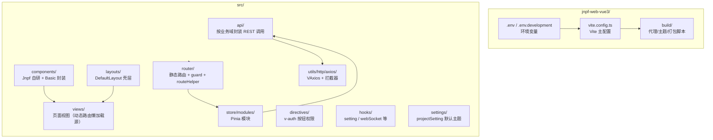
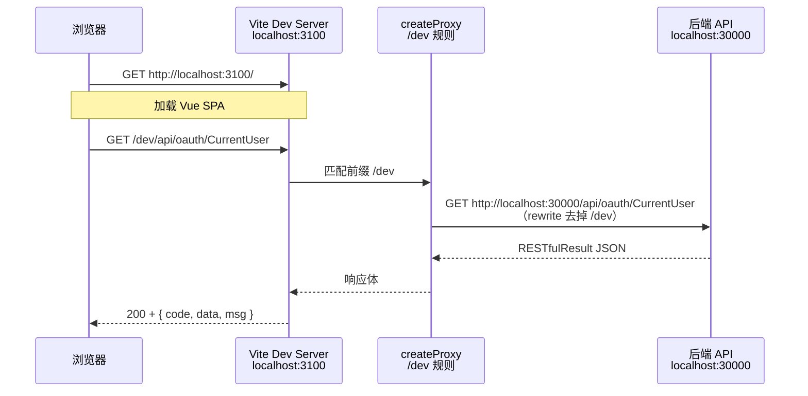
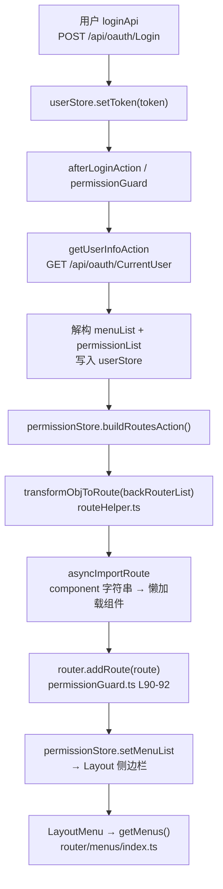
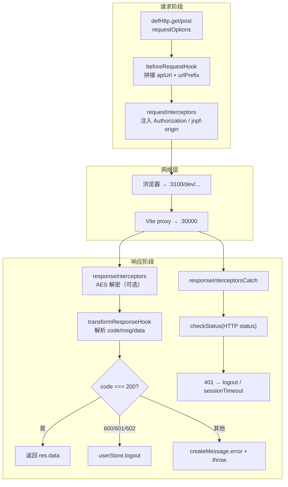
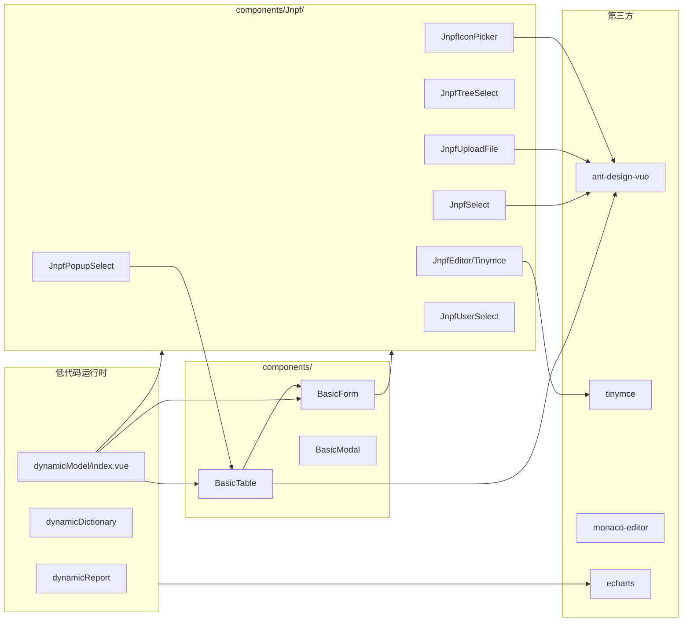

# 【专项文档04】JNPF v5.2 低代码平台 — 应用前端架构深度解剖

> **适用版本**：JNPF v5.2  
> **后端源码仓库**：`d:\JNPF-v52\backend`  
> **前端源码路径**：`d:\JNPF-v52\jnpf-web-vue3\`（**独立于主仓库**，下文路径均相对此前端工程根目录，以 `jnpf-web-vue3/` 为前缀）  
> **文档编号**：v52-arch-04  
> **文档版本**：v2.0-final  
> **编写日期**：2026-05-24  
> **审核状态**：已审核通过（2026-05-24）  
> **编写依据**：v5.2 前端源码实测 + 后端 `OAuthService.GetCurrentUser` 源码交叉验证  

---

## 已知问题与注意事项

> **⚠️ 前端源码不在主仓库**  
> 主仓库 `web/` 目录仅含已构建的静态 dist 与 SQL 脚本；**可维护的前端源码**位于外部路径 `d:\JNPF-v52\jnpf-web-vue3\`。本文档所有前端文件路径、行号、配置值均来自该外部工程 v5.2.0 实测。

> **⚠️ v5.2 环境锚点（编写强制）**  
> 开发环境前端端口 **`:3100`**，API 前缀 **`/dev`**，Vite 代理目标 **`http://localhost:30000`**。禁止在本文档正文中将其他端口或宿主项目名作为前端代理目标。

---

## 文档范围

本篇聚焦 v5.2 **主 WEB 前端**（`jnpf-web-vue3`）的工程化架构、路由鉴权、HTTP 封装、Pinia 状态、公共组件与 Layout 主题。

| 纳入范围 | 排除范围 |
|----------|----------|
| Vite 构建与 dev 代理 | UniApp H5（`:3800`） |
| 动态路由 / 菜单 / 按钮权限 | 数字大屏 DataV 设计器细节（见专项 05） |
| Axios + Token 生命周期 | 报表设计器内部实现 |
| Jnpf 自研组件体系 | `web/` 下已编译 dist 字节码分析 |

**v5.2 环境锚点**：

| 服务 | 地址 | 配置来源 |
|------|------|----------|
| 主 WEB 开发服务 | `http://localhost:3100` | `.env` → `VITE_PORT=3100` |
| 前端 API 前缀 | `/dev` | `.env.development` → `VITE_GLOB_API_URL=/dev` |
| dev 代理目标 | `http://localhost:30000` | `.env.development` → `VITE_PROXY` |
| 报表 dev 代理 | `/reportDev` → `:32000` | 同上 |
| WebSocket | `ws://localhost:30000` | `.env.development` → `VITE_GLOB_WEBSOCKET_URL` |

---

## 第一章：前端工程架构

### 1.1 技术栈版本（package.json 实测）

| 类别 | 依赖 | 版本 | 用途 |
|------|------|------|------|
| 框架 | `vue` | **^3.4.27** | 组合式 API 运行时 |
| 路由 | `vue-router` | **^4.3.2** | Hash 路由 + 动态注册 |
| 状态 | `pinia` | **^2.1.3** | 全局 Store |
| UI | `ant-design-vue` | **^4.2.3** | 基础 UI 组件 |
| 图标 | `@ant-design/icons-vue` | **^7.0.1** | Ant Design Vue 图标 |
| HTTP | `axios` | **^1.4.0** | 请求客户端（经 `VAxios` 二次封装） |
| 构建 | `vite` | **^4.5.3** | 开发服务器 + 生产打包 |
| 语言 | `typescript` | **^5.4.5** | 类型系统 |
| 工程版本 | `jnpf-web-vue3` | **5.2.0** | `package.json` `version` 字段 |

### 1.2 前端项目结构全景（图1-1）

**图1-1 jnpf-web-vue3/src/ 目录职责全景**



| 目录 | 职责 | 关键入口 |
|------|------|----------|
| `api/` | 封装后端 REST 路径；OAuth、系统、工作流等分域 | `api/basic/user.ts` |
| `router/` | 静态路由表、守卫、`transformObjToRoute` 动态组件映射 | `router/guard/permissionGuard.ts` |
| `store/modules/` | 用户/权限/布局/多页签等 Pinia 模块 | `user.ts`、`permission.ts` |
| `utils/http/axios/` | `defHttp` 单例、拦截器、业务码处理 | `index.ts` |
| `components/Jnpf/` | 低代码表单/列表运行时组件 | `registerGlobComp.ts` |
| `layouts/default/` | 侧边栏 + 顶栏 + 多页签 + 内容区 | `layouts/default/index.vue` |
| `views/` | 业务页面；`import.meta.glob` 动态匹配 | `views/**/*.{vue,tsx}` |
| `build/vite/proxy.ts` | `createProxy(VITE_PROXY)` 代理规则生成 | `build/vite/proxy.ts` |

### 1.3 构建与环境配置

#### 1.3.1 `.env` — 端口与站点标识

```1:8:d:\JNPF-v52\jnpf-web-vue3\.env
# 端口号
VITE_PORT = 3100

# 网站标题
VITE_GLOB_APP_TITLE = JNPF快速开发平台

# 简称，用于配置文件名字 不要出现空格、数字开头等特殊字符
VITE_GLOB_APP_SHORT_NAME = jnpf
```

- `VITE_PORT = 3100`：Vite dev server 监听端口，由 `vite.config.ts` 的 `server.port` 读取。
- `VITE_GLOB_APP_SHORT_NAME = jnpf`：生产运行时全局配置对象名 **`window.__PRODUCTION__JNPF__CONF__`** 的生成依据（见 `build/getConfigFileName.ts`）。

#### 1.3.2 `.env.development` — 开发代理与 API 前缀

```4:23:d:\JNPF-v52\jnpf-web-vue3\.env.development
# 本地开发代理，可以解决跨域及多地址代理
# 如果接口地址匹配到，则会转发到http://localhost:30000，防止本地出现跨域问题
# 可以有多个，注意多个不能换行，否则代理将会失效
VITE_PROXY = [["/dev","http://localhost:30000"], ["/reportDev","http://localhost:32000"]]

# 是否删除Console.log
VITE_DROP_CONSOLE = false

# 接口地址
# 如果没有跨域问题，直接在这里配置即可
VITE_GLOB_API_URL=/dev

# 报表接口
VITE_GLOB_REPORT_API_URL=/reportDev

# WebSocket基础地址
VITE_GLOB_WEBSOCKET_URL='ws://localhost:30000'
```

解读：

| 变量 | 值 | 作用 |
|------|-----|------|
| `VITE_PROXY` | `[["/dev","http://localhost:30000"], ...]` | 交给 `createProxy` 生成 Vite `server.proxy` |
| `VITE_GLOB_API_URL` | `/dev` | **相对路径前缀**，非直连后端地址；Axios 拼接后为 `/dev/api/oauth/...` |
| `VITE_GLOB_REPORT_API_URL` | `/reportDev` | 报表专用 `reportHttp` 实例前缀 |
| `VITE_GLOB_WEBSOCKET_URL` | `ws://localhost:30000` | WebSocket 基址 |

#### 1.3.3 `vite.config.ts` — 代理挂载

```30:62:d:\JNPF-v52\jnpf-web-vue3\vite.config.ts
  const { VITE_PORT, VITE_PUBLIC_PATH, VITE_PROXY, VITE_DROP_CONSOLE } = viteEnv;

  const isBuild = command === 'build';

  return {
    base: VITE_PUBLIC_PATH,
    root,
    // ...
    server: {
      https: false,
      host: true,
      port: VITE_PORT,
      // Load proxy configuration from .env
      proxy: createProxy(VITE_PROXY),
      open: true,
    },
```

`createProxy` 实现（路径前缀剥离 + WebSocket 透传）：

```18:33:d:\JNPF-v52\jnpf-web-vue3\build\vite\proxy.ts
export function createProxy(list: ProxyList = []) {
  const ret: ProxyTargetList = {};
  for (const [prefix, target] of list) {
    const isHttps = httpsRE.test(target);
    ret[prefix] = {
      target: target,
      changeOrigin: true,
      ws: true,
      rewrite: path => path.replace(new RegExp(`^${prefix}`), ''),
      ...(isHttps ? { secure: false } : {}),
    };
  }
  return ret;
}
```

**图1-2 前端环境配置与代理流程**



示例：`defHttp.get({ url: '/api/oauth/CurrentUser' })` → 实际请求 URL = `apiUrl` + url = `/dev` + `/api/oauth/CurrentUser` → 浏览器发往 `:3100` → Vite 代理至 `:30000/api/oauth/CurrentUser`。

#### 1.3.4 生产环境配置

`.env.production` 中 `VITE_GLOB_API_URL` **留空**，部署时由运维在打包产物 `_app.config.js` 中注入，或通过 Nginx 反向代理统一前缀。

生产运行时读取逻辑（`src/utils/env.ts`）：

```17:38:d:\JNPF-v52\jnpf-web-vue3\src\utils\env.ts
export function getAppEnvConfig() {
  const ENV_NAME = getConfigFileName(import.meta.env);

  const ENV = (import.meta.env.DEV
    ? (import.meta.env as unknown as GlobEnvConfig)
    : window[ENV_NAME as any]) as unknown as GlobEnvConfig;
  // ...
  return {
    VITE_GLOB_APP_TITLE,
    VITE_GLOB_API_URL,
    VITE_GLOB_REPORT_API_URL,
    VITE_GLOB_APP_SHORT_NAME,
    VITE_GLOB_API_URL_PREFIX,
    VITE_GLOB_WEBSOCKET_URL,
  };
}
```

打包脚本 `build/script/buildConf.ts` 生成 `dist/_app.config.js`，内容形态：

```javascript
window.__PRODUCTION__JNPF__CONF__={"VITE_GLOB_API_URL":"","VITE_GLOB_REPORT_API_URL":"",...};
Object.freeze(window.__PRODUCTION__JNPF__CONF__);
```

变量名生成规则（`build/getConfigFileName.ts`）：

```5:7:d:\JNPF-v52\jnpf-web-vue3\build\getConfigFileName.ts
export const getConfigFileName = (env: Record<string, any>) => {
  return `__PRODUCTION__${env.VITE_GLOB_APP_SHORT_NAME || '__APP'}__CONF__`.toUpperCase().replace(/\s/g, '');
};
```

`vite-plugin-html` 在 build 时将 `_app.config.js` 注入 `index.html`（`build/vite/plugin/html.ts` L27-35），使生产环境可在**不重新打包**的情况下修改 API 地址。

### 1.4 端口与代理速查表

| 环境 | 前端端口 | API 前缀 | 代理/转发目标 | 说明 |
|------|----------|----------|---------------|------|
| 开发 | `:3100` | `/dev` | `http://localhost:30000` | Vite `createProxy` |
| 开发（报表） | `:3100` | `/reportDev` | `http://localhost:32000` | `reportHttp` 实例 |
| 生产 | 部署端口（Nginx/IIS） | 由 `_app.config.js` 或 Nginx 配置 | 反向代理至 `:30000` | `VITE_GLOB_API_URL` 可为空或绝对 URL |

### 本章小结

#### 本节核心表清单

本篇为纯前端章节，不直接读写数据库。前端间接消费的后端表：

| 表名 | 关联场景 |
|------|----------|
| **BASE_MODULE** | 菜单树 → 动态路由（经 `/api/oauth/CurrentUser` 返回 `menuList`） |
| **BASE_MODULE_BUTTON** | 按钮权限 → `permissionList[].button` |
| **BASE_SYSTEM** | 多应用系统切换（`userInfo.systemIds`） |

#### 本节关键代码路径索引

| 路径 | 说明 |
|------|------|
| `jnpf-web-vue3/.env` | `VITE_PORT=3100` |
| `jnpf-web-vue3/.env.development` | `VITE_PROXY`、`VITE_GLOB_API_URL=/dev` |
| `jnpf-web-vue3/vite.config.ts` | `server.port`、`server.proxy` |
| `jnpf-web-vue3/build/vite/proxy.ts` | `createProxy()` |
| `jnpf-web-vue3/build/getConfigFileName.ts` | 生产全局变量名 |
| `jnpf-web-vue3/build/script/buildConf.ts` | `_app.config.js` 生成 |
| `jnpf-web-vue3/src/utils/env.ts` | `getAppEnvConfig()` |
| `jnpf-web-vue3/src/hooks/setting/index.ts` | `useGlobSetting()` |

---

## 第二章：路由与鉴权体系

### 2.1 菜单数据来源与 API 调用链

前端**不直接**调用菜单 CRUD 接口获取导航树；菜单在登录后随 **`GET /api/oauth/CurrentUser`** 一次性返回。

**前端 API 定义**（`src/api/basic/user.ts`）：

```6:22:d:\JNPF-v52\jnpf-web-vue3\src\api\basic\user.ts
enum Api {
  Prefix = '/api/oauth',
  Login = '/api/oauth/Login',
  Logout = '/api/oauth/Logout',
  GetUserInfo = '/api/oauth/CurrentUser',
  Unlock = '/api/oauth/LockScreen',
}
// ...
export function getUserInfo() {
  const systemCode = getJnpfAppId() ? getJnpfAppId().replace('JNPF_APP_', '') : '';
  return defHttp.get({ url: Api.GetUserInfo, data: { systemCode } });
}
```

**后端对应**（主仓库 `modularity/oauth/JNPF.OAuth/OAuthService.cs`）：

- 类标注 `[Route("api/[controller]")]` → 路由前缀 **`/api/oauth`**
- 方法 `[HttpGet("CurrentUser")]` → **`GET /api/oauth/CurrentUser`**
- 菜单：`loginOutput.menuList = (await _moduleService.GetUserModuleListByIds(...)).ToTree("-1")`（L388）
- 按钮权限：`loginOutput.permissionList` 由 `BASE_MODULE` + `BASE_MODULE_BUTTON` 等聚合（L527-541）

**Store 写入**（`src/store/modules/user.ts` → `getUserInfoAction`）：

```165:176:d:\JNPF-v52\jnpf-web-vue3\src\store\modules\user.ts
      const res = await getUserInfo();
      const { userInfo, sysConfigInfo, menuList = [], permissionList = [] } = res.data;
      if (!menuList.length) {
        this.resetToken();
        return Promise.reject('您的权限不足，请联系管理员');
      }
      // ...
      this.setPermissionList(permissionList);
      this.setBackMenuList(menuList);
      this.setBackRouterList(menuList);
```

### 2.2 动态路由注册全流程（图2-1）

**图2-1 动态路由注册流程**



**`permissionStore.buildRoutesAction`** 核心逻辑：

```61:72:d:\JNPF-v52\jnpf-web-vue3\src\store\modules\permission.ts
    async buildRoutesAction(): Promise<AppRouteRecordRaw[]> {
      const userStore = useUserStore();
      const backRouterList = toRaw(userStore.getBackRouterList);

      // 动态引入组件
      let routeList = transformObjToRoute(backRouterList);
      let routes: AppRouteRecordRaw[] = [];
      routes = [PAGE_NOT_FOUND_ROUTE, ...routeList];

      this.setMenuList(backRouterList as Menu[]);
      routeList = flatMultiLevelRoutes(routeList);
```

**`transformObjToRoute` 菜单类型映射**（`routeHelper.ts`）：

| `BASE_MODULE.F_TYPE`（后端 type） | 前端 component 标识 | 目标 |
|-----------------------------------|---------------------|------|
| 1 | 目录 | 递归子节点 |
| 2 | 视图路径字符串 | `import.meta.glob('../../views/**')` 动态匹配 |
| 3 / 9 | `ONLINE_MODEL` | `views/common/dynamicModel/index.vue` |
| 4 | `ONLINE_DICT` | 动态字典 |
| 5 | `ONLINE_DATA_REPORT` | 数据报表 |
| 6 | 外链 DataV | `globSetting.dataVUrl` |
| 7 | `IFRAME` | 内嵌 iframe |
| 8 | `ONLINE_PORTAL` | 门户 |
| 10 | `ONLINE_REPORT` | 报表 |

路由 meta 携带 `modelId`（对应 **BASE_MODULE** 主键），供 `v-auth` 指令匹配按钮权限。

### 2.3 路由守卫深度分析

**文件**：`src/router/guard/permissionGuard.ts` — `createPermissionGuard(router)`

**白名单路由**（无需 Token 即可访问）：

```10:14:d:\JNPF-v52\jnpf-web-vue3\src\router\guard\permissionGuard.ts
const LOGIN_PATH = PageEnum.BASE_LOGIN;
const SSO_PATH = PageEnum.BASE_SSO;
const BASE_FORM_SHORT_LINK_PATH = PageEnum.BASE_FORM_SHORT_LINK;

const whitePathList: PageEnum[] = [LOGIN_PATH, SSO_PATH, BASE_FORM_SHORT_LINK_PATH, PageEnum.FLOW_FILE, PageEnum.FLOW_CHART];
```

| 场景 | 处理逻辑 | 代码位置 |
|------|----------|----------|
| 白名单 | 直接 `next()`；已登录访问登录页则 `afterLoginAction` 跳首页 | L28-41 |
| 无 Token | 跳转 `LOGIN_PATH`，携带 `redirect` 查询参数 | L44-64 |
| 有 Token 首次进入 | `getUserInfoAction()` 拉用户信息 | L73-80 |
| 动态路由未注册 | `buildRoutesAction()` + `router.addRoute()` | L83-96 |
| 404 重定向 | 动态路由添加后 `next({ path: to.fullPath, replace: true })` | L98-100 |

**Token 过期处理**（两层机制）：

1. **HTTP 401**：`checkStatus.ts` → `userStore.logout(true)` 或 `setSessionTimeout(true)`（取决于 `sessionTimeoutProcessing` 配置）
2. **业务码 600/601/602**：`axios/index.ts` → `ResultEnum.TOKEN_TIMEOUT` 等 → `userStore.logout(true)`

**页面缓存（keep-alive）**：`multipleTab` Store 维护 `cacheTabList`；路由 meta `ignoreKeepAlive: true` 的页面不进入缓存（`store/modules/multipleTab.ts` L70-76）。实际 `<keep-alive>` 挂载于 `layouts/page/index.vue`（由 `LayoutContent` 引入），非 `content/index.vue` 本身：

```4:7:d:\JNPF-v52\jnpf-web-vue3\src\layouts\page\index.vue
      <keep-alive v-if="openCache" :include="getCaches">
        <component :is="Component" :key="route.fullPath" />
      </keep-alive>
      <component v-else :is="Component" :key="route.fullPath" />
```

`getCaches` 来自 `tabStore.getCachedTabList`；`openCache` 依赖 `getOpenKeepAlive && getShowMultipleTab`（多页签开启时才缓存）。

### 2.4 权限指令 v-auth

**文件**：`src/directives/permission.ts`（注册名 **`v-auth`**，非 `v-permission`）

```9:41:d:\JNPF-v52\jnpf-web-vue3\src\directives\permission.ts
function hasBtnP(modelId, value?: string): boolean {
  if (!value) return true;
  if (!modelId) return false;
  const userStore = useUserStoreWithOut();
  const permissionList = userStore.getPermissionList;
  const list = permissionList.filter(o => o.modelId === modelId);
  // ...
  const btnList = list[0] && list[0].button ? list[0].button : [];
  const hasPermission = btnList.some(btn => btn.enCode === value);
  return hasPermission;
}
// ...
export function setupPermissionDirective(app: App) {
  app.directive('auth', authDirective);
}
```

- **modelId 来源**：当前路由 `meta.modelId`（来自 **BASE_MODULE** 记录 id）
- **按钮编码**：`permissionList[].button[].enCode`（来自 **BASE_MODULE_BUTTON.F_EN_CODE**）
- **无权限行为**：`mounted` 时从 DOM 移除元素（非 disabled）

使用示例：`<a-button v-auth="'btn_add'">新增</a-button>`

### 本章小结

#### 本节核心表清单

| 表名 | 关键字段 | 前端消费方式 |
|------|----------|--------------|
| **BASE_MODULE** | `F_ID`、`F_TYPE`、`F_EN_CODE`、`F_URL_ADDRESS`、`F_PARENT_ID` | `menuList` → `transformObjToRoute` → 路由 + 侧边栏 |
| **BASE_MODULE_BUTTON** | `F_MODULE_ID`、`F_EN_CODE` | `permissionList[].button` → `v-auth` |
| **BASE_MODULE_COLUMN** | `F_MODULE_ID` | `permissionList[].column` → 列表列显隐 |
| **BASE_MODULE_FORM** | `F_MODULE_ID` | `permissionList[].form` → 表单字段权限 |
| **BASE_SYSTEM** | `F_ID`、`F_EN_CODE` | `userInfo.systemIds` 多应用切换 |

#### 本节关键代码路径索引

| 路径 | 类/函数 |
|------|---------|
| `jnpf-web-vue3/src/api/basic/user.ts` | `getUserInfo()` → `/api/oauth/CurrentUser` |
| `jnpf-web-vue3/src/store/modules/user.ts` | `getUserInfoAction`、`afterLoginAction` |
| `jnpf-web-vue3/src/store/modules/permission.ts` | `buildRoutesAction` |
| `jnpf-web-vue3/src/router/guard/permissionGuard.ts` | `createPermissionGuard` |
| `jnpf-web-vue3/src/router/helper/routeHelper.ts` | `transformObjToRoute`、`asyncImportRoute` |
| `jnpf-web-vue3/src/router/menus/index.ts` | `getMenus` |
| `jnpf-web-vue3/src/directives/permission.ts` | `setupPermissionDirective`、`hasBtnP` |
| `modularity/oauth/JNPF.OAuth/OAuthService.cs` | `GetCurrentUser` |
| `modularity/system/JNPF.Systems/System/ModuleService.cs` | `GetUserModuleListByIds` |

---

## 第三章：HTTP 请求封装与 Token 管理

### 3.1 Axios 封装架构（图3-1）

**图3-1 Axios 拦截器与响应处理流程**



**业务响应格式**：后端 `RESTfulResult<T>` 统一 `{ code, data, msg }`；前端 `ResultEnum.SUCCESS = 200`。

```4:9:d:\JNPF-v52\jnpf-web-vue3\src\enums\httpEnum.ts
export enum ResultEnum {
  SUCCESS = 200,
  TOKEN_TIMEOUT = 600,
  TOKEN_LOGGED = 601,
  TOKEN_ERROR = 602,
}
```

**transformResponseHook — code/msg 处理**：

```57:90:d:\JNPF-v52\jnpf-web-vue3\src\utils\http\axios\index.ts
    const { code, msg } = res.data;

    const hasSuccess = res.data && isObject(res.data) && Reflect.has(res.data, 'code') && code === ResultEnum.SUCCESS;
    if (hasSuccess) {
      return res.data;
    }

    let errorMsg = '';
    switch (code) {
      case ResultEnum.TOKEN_TIMEOUT:
      case ResultEnum.TOKEN_LOGGED:
      case ResultEnum.TOKEN_ERROR:
        errorMsg = msg || t('sys.api.timeoutMessage');
        const userStore = useUserStoreWithOut();
        userStore.setToken(undefined);
        userStore.logout(true);
        break;
      default:
        errorMsg = msg || t('sys.api.apiRequestFailed');
    }
    // ... createMessage / createErrorModal
    throw new Error(errorMsg);
```

**请求拦截器 — Token 与租户标识**：

```147:157:d:\JNPF-v52\jnpf-web-vue3\src\utils\http\axios\index.ts
  requestInterceptors: (config, options) => {
    (config as Recordable).headers['jnpf-origin'] = 'pc';
    (config as Recordable).headers['vue-version'] = '3';
    (config as Recordable).headers['Accept-Language'] = locale.replace('_', '-');
    const token = getToken();
    if (token && (config as Recordable)?.requestOptions?.withToken !== false) {
      (config as Recordable).headers.Authorization = options.authenticationScheme ? `${options.authenticationScheme} ${token}` : token;
    }
    return config;
  },
```

- **`authenticationScheme` 与 `Bearer` 前缀**：`createAxios` 默认 `authenticationScheme: ''`，axios **不再二次拼接** scheme；但登录接口 `OAuthService.Login` 返回的 `token` 字段已含 `Bearer` 前缀（`modularity/oauth/JNPF.OAuth/OAuthService.cs` L1008：`string.Format("Bearer {0}", accessToken)`）。前端 `userStore.setToken(token)` 原样缓存后，请求头实际为 `Authorization: Bearer {jwt}`，与 [01-core-framework.md §6.1](./01-core-framework.md) 中 `JwtBearer` 中间件及 `JWTEncryption.GetJwtBearerToken` 的默认 `tokenPrefix = "Bearer "` 解析一致。**二次开发注意**：若自行构造 Token 仅存裸 JWT，须将 axios 改为 `authenticationScheme: 'Bearer'`，或登录响应格式与官方保持一致。
- **`jnpf-origin` / `vue-version` 请求头**：主 WEB 固定注入 `jnpf-origin: pc`、`vue-version: 3`。后端 `UserManager.UserOrigin`（`modularity/common/JNPF.Common.Core/Manager/User/UserManager.cs` L292-294）读取 `jnpf-origin`，`OAuthService.GetCurrentUser` 据此选择 PC 端 `systemId` 或 App 端 `appSystemId`（L391）；低代码 `RunService` 按 `pc`/`app` 切换列配置与数据权限模板。UniApp 等端需注入对应值，不可省略。
- `apiUrl` 来自 `useGlobSetting().apiUrl` → 开发环境为 `/dev`。

**HTTP 状态码处理**（`checkStatus.ts`）：

| HTTP 状态 | 行为 |
|-----------|------|
| 401 | 清除 Token；`ROUTE_JUMP` 模式调用 `logout(true)` |
| 403 | 提示 `errMsg403` |
| 500 | 提示 `errMsg500` |

### 3.2 Token 管理

| 项目 | 实现 |
|------|------|
| 存储键 | `TOKEN_KEY = 'TOKEN__'`（`enums/cacheEnum.ts` L2，双下划线，与 `USER__INFO__`、`PERMISSIONS__INFO__` 等同命名模式） |
| 存储介质 | 默认 `localStorage`（`projectSetting.permissionCacheType = CacheTypeEnum.LOCAL`） |
| 读取 | `getToken()` → `getAuthCache(TOKEN_KEY)` |
| 写入 | 登录成功 `userStore.setToken(token)` → `setAuthCache` |
| 过期检测 | 业务码 600/601/602 或 HTTP 401 |
| 退出清理 | `resetToken()` 清 Token + 用户信息 + 跳转登录页；`logout()` 额外调用 `GET /api/oauth/Logout` |
| 调试定位 | 浏览器 DevTools → Application → Local Storage → 键名 **`TOKEN__`**（非 `token` / `access_token`） |

**权限数据同域缓存**：

| 键 | 常量 | 内容 |
|----|------|------|
| Token | `TOKEN__` | 含 `Bearer ` 前缀的完整 Authorization 值（来自登录响应） |
| 用户信息 | `USER__INFO__` | `UserInfo` |
| 按钮/列/表单权限 | `PERMISSIONS__INFO__` | `PermissionInfo[]` |

**与后端 JWT 过期链路交叉引用**：前端 600/601/602 与 HTTP 401 为客户端侧检测；服务端 Token 签名密钥、`ClockSkew` 及刷新逻辑见 [01-core-framework.md §6.1–§6.2](./01-core-framework.md) 与 `application/JNPF.API.Entry/Configurations/JWT.json`（`ExpiredTime`、`ClockSkew`）。业务登录过期分钟数另由 **BASE_SYS_CONFIG** 的 `tokenTimeout` 控制（01 §6.2）。

### 3.3 双 Http 实例

```277:284:d:\JNPF-v52\jnpf-web-vue3\src\utils\http\axios\index.ts
export const defHttp = createAxios();

// 报表接口
export const reportHttp = createAxios({
  requestOptions: {
    apiUrl: globSetting.reportApiUrl,
  },
});
```

- `defHttp`：`apiUrl = /dev`（开发）
- `reportHttp`：`apiUrl = /reportDev` → 代理至 `:32000`

### 本章小结

#### 本节核心表清单

| 表名 | 关联场景 |
|------|----------|
| **BASE_USER** | 登录 `POST /api/oauth/Login` 校验账号 |
| **BASE_TENANT** | 请求头/Token 内嵌租户标识（后端 JWT 解析） |

#### 本节关键代码路径索引

| 路径 | 说明 |
|------|------|
| `jnpf-web-vue3/src/utils/http/axios/index.ts` | `defHttp`、`transformResponseHook` |
| `jnpf-web-vue3/src/utils/http/axios/checkStatus.ts` | HTTP 401/403/500 |
| `jnpf-web-vue3/src/enums/httpEnum.ts` | `ResultEnum` |
| `jnpf-web-vue3/src/utils/auth/index.ts` | `getToken`、`setAuthCache` |
| `jnpf-web-vue3/src/settings/projectSetting.ts` | `permissionCacheType`、`sessionTimeoutProcessing` |
| `jnpf-web-vue3/src/hooks/setting/index.ts` | `useGlobSetting().apiUrl` |

---

## 第四章：状态管理架构

### 4.1 Store 模块清单

| 模块 id | 文件 | 核心 state | 核心 actions | 职责 |
|---------|------|------------|--------------|------|
| `app-user` | `store/modules/user.ts` | `token`、`userInfo`、`permissionList`、`backRouterList` | `login`、`getUserInfoAction`、`logout` | 认证与用户上下文 |
| `app-permission` | `store/modules/permission.ts` | `menuList`、`isDynamicAddedRoute` | `buildRoutesAction`、`setMenuList` | 动态路由与菜单 |
| `app` | `store/modules/app.ts` | `projectConfig`、`darkMode`、`pageLoading` | `setProjectConfig`、`resetAllState` | 布局/主题/系统配置 |
| `app-multiple-tab` | `store/modules/multipleTab.ts` | `tabList`、`cacheTabList` | `addTab`、`closeTab`、`updateCacheTab` | 多页签 + keep-alive |
| `app-base` | `store/modules/base.ts` | 字典/缓存数据 | `resetState` | 全局字典缓存 |
| `app-organize` | `store/modules/organize.ts` | 组织树缓存 | `resetState` | 组织架构数据 |
| `app-locale` | `store/modules/locale.ts` | 当前语言 | `setLocale` | i18n |
| `app-lock` | `store/modules/lock.ts` | 锁屏状态 | `setLockInfo` | 锁屏 |
| `app-error-log` | `store/modules/errorLog.ts` | Ajax 错误列表 | `addAjaxErrorInfo` | 前端错误收集 |
| `app-generator` | `store/modules/generator.ts` | 代码生成器状态 | — | 在线开发辅助 |

### 4.2 user 模块（深度）

**登录链路**：`login()` → `loginApi` → `setToken` → `afterLoginAction()` → `getUserInfoAction()` → 若尚未注册动态路由则 `permissionStore.buildRoutesAction()` + `router.addRoute()`。

**关键 getter**：

- `getBackRouterList`：供 `permissionStore.buildRoutesAction` 消费
- `getPermissionList`：供 `v-auth` 消费；优先内存，fallback `localStorage`

### 4.3 permission 模块（深度）

- **`buildRoutesAction`**：唯一动态路由构建入口；将 `backRouterList` 转为 `AppRouteRecordRaw[]` 并同步 `menuList`
- **`isDynamicAddedRoute`**：防止重复 `addRoute`；退出登录时需 `resetState()`

### 4.4 app 模块（深度）

- **`setProjectConfig({ sysConfigInfo })`**：`getUserInfoAction` 成功后写入后端系统配置（Logo、版权、导航等）
- **getter 链**：`getMenuSetting`、`getHeaderSetting`、`getMultiTabsSetting` 供 Layout 各子组件读取

### 4.5 multipleTab 模块（深度）

- **`tabList`**：已打开路由快照；可持久化至 `MULTIPLE_TABS_KEY`
- **`updateCacheTab`**：遍历 tab，将 `meta.ignoreKeepAlive !== true` 的路由 `name` 加入 `cacheTabList`，供 `layouts/page/index.vue` 中 `<keep-alive :include="getCaches">` 消费（见 §2.3）

### 本章小结

#### 本节核心表清单

| 表名 | Store 字段映射 |
|------|----------------|
| **BASE_MODULE** | `user.backRouterList` / `permission.menuList` |
| **BASE_MODULE_BUTTON** 等 | `user.permissionList` |
| **BASE_SYS_CONFIG** | `app.projectConfig.sysConfigInfo` |

#### 本节关键代码路径索引

| 路径 | 说明 |
|------|------|
| `jnpf-web-vue3/src/store/index.ts` | Pinia 根实例 |
| `jnpf-web-vue3/src/store/modules/user.ts` | 用户/权限数据中枢 |
| `jnpf-web-vue3/src/store/modules/permission.ts` | 路由/菜单 |
| `jnpf-web-vue3/src/store/modules/app.ts` | 布局配置 |
| `jnpf-web-vue3/src/store/modules/multipleTab.ts` | 页签缓存 |

---

## 第五章：公共组件体系

### 5.1 自研公共组件清单与依赖关系（图5-1）

**图5-1 核心公共组件依赖关系**



**全局注册入口**：`src/components/registerGlobComp.ts` — `registerGlobComp(app)` 在 `main.ts` 调用，注册全部 `Jnpf*` 组件及 Ant Design Vue 基础组件。

| 组件名 | 路径 | 功能 | 第三方依赖 |
|--------|------|------|------------|
| `BasicTable` | `components/Table/src/BasicTable.vue` | 列表 + 搜索表单 + 分页 | `ant-design-vue` Table、`BasicForm` |
| `BasicForm` | `components/Form/src/BasicForm.vue` | 动态表单渲染 | `ant-design-vue` Form |
| `JnpfSelect` | `components/Jnpf/Select/` | 下拉选择 | `ant-design-vue` Select |
| `JnpfTreeSelect` | `components/Jnpf/TreeSelect/` | 树形选择 | `ant-design-vue` TreeSelect |
| `JnpfUploadFile` | `components/Jnpf/Upload/src/UploadFile.vue` | 文件上传 | 自研 `FileUploader` + `globSetting.uploadUrl` |
| `JnpfIconPicker` | `components/Jnpf/IconPicker/` | 图标选择器 | `@iconify/iconify` |
| `JnpfEditor` | `components/Tinymce/index`（别名） | 富文本 | `tinymce ^5.10.7` |
| `JnpfPopupSelect` | `components/Jnpf/PopupSelect/` | 弹窗选择 | `BasicModal` + `BasicTable` |
| `JnpfUserSelect` | `components/Jnpf/Organize/` | 用户/组织选择 | 组织 API |
| Code 编辑器 | 在线开发模块引用 | 代码编辑 | `monaco-editor ^0.38.0` |

### 5.2 核心组件深度分析

#### 5.2.1 BasicTable — 列表组件

- **Props**：通过 `BasicTableProps`（`useTable` hook 传入）配置 `columns`、`api`（列表接口）、`useSearchForm` 等
- **Events**：`change`（分页/排序）、搜索表单 `@submit`
- **核心逻辑**：`useDataSource` 调用传入的 `api` 方法；与 `BasicForm` 联动构建查询条件
- **使用场景**：系统管理 CRUD 页、低代码 `dynamicModel` 列表视图

#### 5.2.2 JnpfUploadFile — 文件上传

- **Props**：`uploadFileProps`（`value`、`type`、`limit`、`pathType` 等）
- **Events**：`update:value`、`change`
- **上传地址**：`useGlobSetting().uploadUrl` = `VITE_GLOB_API_URL + '/api/file/Uploader'` → 开发环境 `/dev/api/file/Uploader`
- **核心逻辑**：`FileUploader` 分片上传 → `POST /api/file/Uploader/{type}` → 后端 `FileService.Uploader` 返回 `FileControlsModel`（`name`/`fileName`/`url` 等）→ 前端写入 `fileList` → 表单字段绑定 **JSON 数组**（非独立文件主表外键）
- **存储说明**：v5.2 **无统一 BASE_FILE 主表**（与 [02-application-services.md §4.2](./02-application-services.md) 一致）；物理文件由 `IFileManager` 写入 `JNPF_App.SystemPath` 配置目录，元数据随业务表字段持久化

#### 5.2.3 JnpfTreeSelect — 树形选择

- 消费组织/部门/自定义树 API；支持异步加载子节点
- 低代码表单设计器中 `type='treeSelect'` 字段运行时映射此组件

#### 5.2.4 v-auth 与组件联动

列表页操作列按钮通常写法：

```vue
<a-button v-auth="'btn_edit'" @click="handleEdit">编辑</a-button>
```

`modelId` 由当前菜单路由 meta 注入，无需手动传递。

### 本章小结

#### 本节核心表清单

| 表名 | 组件消费场景 |
|------|--------------|
| **BASE_MODULE** | 低代码 `ONLINE_MODEL` 路由 → `dynamicModel` 渲染 |
| **BASE_VISUAL_DEV** | 门户/可视化组件配置（VisualPortal 组件族） |
| （无统一文件主表） | 上传结果 JSON 存业务表字段；物理路径见 `FileService` + `02 §4.2` |

#### 本节关键代码路径索引

| 路径 | 说明 |
|------|------|
| `jnpf-web-vue3/src/components/registerGlobComp.ts` | 全局组件注册表 |
| `jnpf-web-vue3/src/components/Table/src/BasicTable.vue` | 列表 |
| `jnpf-web-vue3/src/components/Form/src/BasicForm.vue` | 表单 |
| `jnpf-web-vue3/src/components/Jnpf/Upload/src/UploadFile.vue` | 上传 |
| `jnpf-web-vue3/src/views/common/dynamicModel/index.vue` | 低代码运行时容器 |

---

## 第六章：布局与主题系统

### 6.1 Layout 布局组件分析

**根布局**：`layouts/default/index.vue` — `DefaultLayout`

```1:12:d:\JNPF-v52\jnpf-web-vue3\src\layouts\default\index.vue
<template>
  <Layout :class="getClass" v-bind="lockEvents">
    <LayoutFeatures />
    <LayoutHeader fixed v-if="getShowFullHeaderRef" />
    <Layout :class="[layoutClass]">
      <LayoutSideBar v-if="getShowSidebar || getIsMobile" />
      <Layout :class="`${prefixCls}-main`">
        <LayoutMultipleHeader />
        <LayoutContent />
      </Layout>
    </Layout>
  </Layout>
</template>
```

| 子组件 | 路径 | 职责 |
|--------|------|------|
| `LayoutSideBar` | `layouts/default/sider/index.vue` | 侧边栏容器 |
| `LayoutMenu` | `layouts/default/menu/index.vue` | 菜单渲染（`BasicMenu` / `SimpleMenu`） |
| `LayoutHeader` | `layouts/default/header/index.vue` | 顶栏（用户、消息、全屏） |
| `LayoutMultipleHeader` | `layouts/default/header/MultipleHeader.vue` | 多页签栏 |
| `LayoutContent` | `layouts/default/content/index.vue` | 挂载 `PageLayout`（`layouts/page/index.vue` 内含 `<keep-alive>`） |
| `LayoutFeatures` | `layouts/default/feature/index.vue` | 设置抽屉、锁屏等 |

**菜单数据流**：`permissionStore.getMenuList` → `router/menus/getMenus()` → `LayoutMenu` → `useSplitMenu` 处理分割菜单/混合模式。

### 6.2 主题系统

**默认配置**：`src/settings/projectSetting.ts`

| 配置项 | 默认值 | 说明 |
|--------|--------|------|
| `themeColor` | `build/config/themeConfig.primaryColor` | 主题色 |
| `permissionCacheType` | `CacheTypeEnum.LOCAL` | 权限缓存 localStorage |
| `sessionTimeoutProcessing` | `ROUTE_JUMP` | 会话超时跳登录页 |
| `menuSetting` | 见文件 L40+ | 菜单模式、宽度、折叠 |
| `multiTabsSetting` | 见文件 L80+ | 多页签开关与缓存 |

**动态主题**：

- `appStore.setDarkMode` → 写入 `localStorage` `__APP__DARK__MODE__`
- Less 变量：`build/generate/generateModifyVars.ts` + `vite.config.ts` `css.preprocessorOptions.less.modifyVars`
- 运行时切换：`layouts/default/setting/SettingDrawer.tsx` — 修改 `projectConfig` 并持久化至 `PROJ_CFG_KEY`

**系统级 Logo/标题**：来自 `getUserInfoAction` 返回的 `sysConfigInfo`（后端 **BASE_SYS_CONFIG**），非纯前端主题。

### 本章小结

#### 本节核心表清单

| 表名 | 布局/主题关联 |
|------|---------------|
| **BASE_MODULE** | 侧边栏菜单树数据源 |
| **BASE_SYS_CONFIG** | 登录 Logo、系统名称、导航图标 |
| **BASE_SYSTEM** | 顶栏多应用切换列表 |

#### 本节关键代码路径索引

| 路径 | 说明 |
|------|------|
| `jnpf-web-vue3/src/layouts/default/index.vue` | DefaultLayout 根 |
| `jnpf-web-vue3/src/layouts/default/menu/index.vue` | 侧边栏菜单 |
| `jnpf-web-vue3/src/layouts/default/setting/SettingDrawer.tsx` | 主题设置抽屉 |
| `jnpf-web-vue3/src/settings/projectSetting.ts` | 默认布局/主题 |
| `jnpf-web-vue3/build/generate/generateModifyVars.ts` | Ant Design Less 变量 |
| `jnpf-web-vue3/build/config/themeConfig.ts` | 主色配置 |

---

## 附录 A：v5.2 前端自检清单

| # | 检查项 | 本文档状态 |
|---|--------|------------|
| 1 | 前端端口 `:3100` | ✅ `.env` 实测 |
| 2 | API 前缀 `/dev` + 代理 `:30000` | ✅ 图1-2 + 源码 |
| 3 | 全文零命中禁止项 | ✅ 正文未出现禁止端口/宿主名 |
| 4 | 动态路由链路完整 | ✅ 图2-1 |
| 5 | Axios code/msg 处理 | ✅ §3.1 + `ResultEnum` |
| 6 | 菜单来自 BASE_MODULE | ✅ OAuthService 交叉验证 |
| 7 | 图表 ≥ 5 | ✅ 图1-1/1-2/2-1/3-1/5-1 |
| 8 | 核心代码片段 ≥ 12 | ✅ 各章源码块 |
| 9 | 每章含表清单 + 路径索引 | ✅ |
| 10 | 外部源码路径注明 | ✅ 文档头 |

---

## 附录 B：与专项 01 的衔接

| 前端机制 | 后端对应（专项 01） |
|----------|---------------------|
| `/dev/api/oauth/*` | `OAuthService` — `[Route("api/[controller]")]` + `IDynamicApiController` |
| `{ code, data, msg }` | `RESTfulResult<T>` 统一响应 |
| JWT Authorization 头 | 登录响应已含 `Bearer {jwt}`；`JwtBearer` + `JwtHandler.AutoRefreshToken`（01 §6.1–§6.2） |
| `jnpf-origin: pc` | `UserManager.UserOrigin` → PC/App 系统 ID 与低代码列配置分支 |
| 菜单 `menuList` | `ModuleService.GetUserModuleListByIds` → **BASE_MODULE** |

---

## 本会话结论（episodic 索引友好）

- **决策**：04 审核三项确认已闭合——`TOKEN__` 为源码实测键名；`Bearer` 前缀由登录响应嵌入而非 axios 拼接；无 `BASE_FILE` 主表与 02 §4.2 对齐
- **交付物**：`docs/architecture/v52/04-application-frontend-deep-dive.md`（v2.0-final）、`02-application-services.md`（v2.0-final）
- **禁止项**：文档正文禁止旧版调试端口及后端宿主项目名作为前端代理目标
- **待审/阻塞**：外部前端仓库与主仓库同步策略待团队确认
- **下一步**：进入专项 05/06/07/08（大屏、UniApp、缓存、消息队列）
