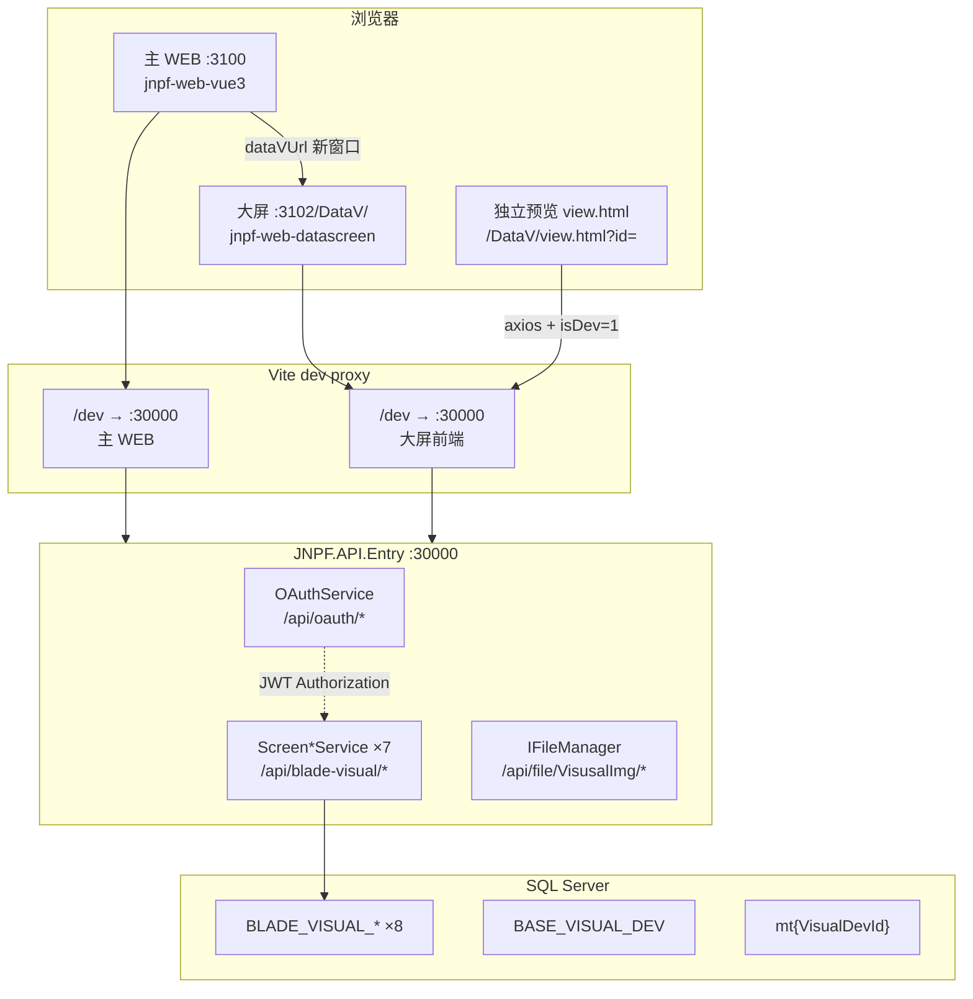
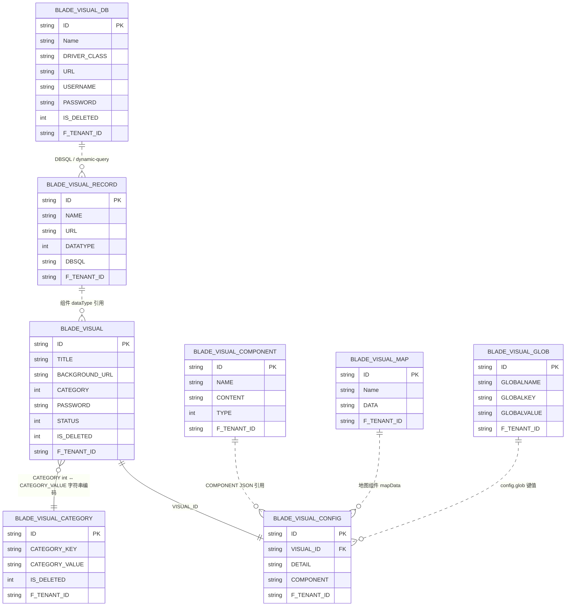
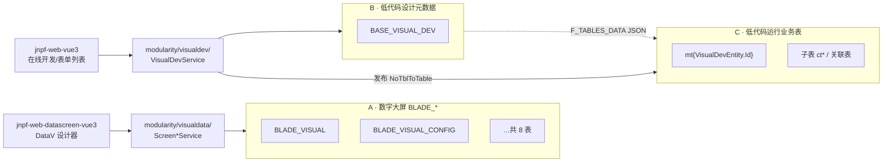
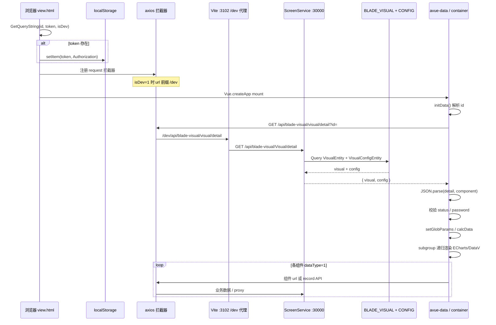

# 【专项文档05】JNPF v5.2 低代码平台 — 大屏与可视化深度解剖

> **适用版本**：JNPF v5.2  
> **后端源码仓库**：`d:\JNPF-v52\backend`  
> **大屏前端源码路径**：`d:\JNPF-v52\jnpf-web-datascreen\`（**独立于主仓库**，下文路径均相对此前端工程根目录，以 `jnpf-web-datascreen-vue3/` 为前缀）  
> **文档编号**：v52-arch-05  
> **文档版本**：v2.0-final  
> **编写日期**：2026-05-24  
> **审核状态**：2026-05-24 审核通过（4 处确认项已闭合）  
> **编写依据**：v5.2 后端 `modularity/visualdata/` 源码 + 外部大屏前端 v5.2.0 实测 + 主 WEB `dataVUrl` 交叉验证  

---

## 已知问题与注意事项

> **⚠️ 大屏前端源码不在主仓库**  
> 主仓库 `web/` 目录仅含已构建静态 dist 与 SQL 脚本；**可维护的大屏前端源码**位于外部路径 `d:\JNPF-v52\jnpf-web-datascreen\`。本文档所有大屏前端文件路径、行号、配置值均来自该外部工程 v5.2.0 实测。

> **⚠️ 端口职责（编写强制）**  
> **`:3102` 仅为大屏前端 Vite 开发服务**，不提供 REST API。所有大屏 REST 接口由后端 **`JNPF.API.Entry`（`:30000`）** 暴露，统一前缀 **`/api/blade-visual/`**。禁止在正文将 `:3102` 描述为 API 宿主。

> **⚠️ JNPF.VisualData 默认未启用**  
> `application/JNPF.API.Entry/JNPF.API.Entry.csproj` **默认不引用** `JNPF.VisualData`；备份工程 `JNPF - Backup.API.Entry.csproj` 已包含引用。未添加引用时，大屏前端请求 `/api/blade-visual/*` 将 404。

> **⚠️ DDL 未纳入主 init 脚本**  
> 在 `web/jnpf_sundial_init.sql` 中**未检索到** `BLADE_VISUAL_*` 建表语句。表结构以下文 Entity `[SugarTable]` 映射为准，完整 DDL 标注 **【待 DDL 验证】**。

> **操作手册交叉引用**（使用者视角，非架构正文）：[`docs/架构迭代/6、培训与操作手册/4、手册二-数字大屏全部功能操作手册.md`](../../架构迭代/6、培训与操作手册/4、手册二-数字大屏全部功能操作手册.md)

---

## 文档范围

| 纳入范围 | 排除范围 |
|----------|----------|
| `modularity/visualdata/` 7 个 `*Service` 与 8 张 `BLADE_*` 表 | 主 WEB 路由/Axios 细节（见 [04-application-frontend-deep-dive.md](04-application-frontend-deep-dive.md)） |
| 独立大屏前端 `jnpf-web-datascreen-vue3` 设计器与 `view.html` 渲染 | VisualDev 表单/列表运行时（`BASE_VISUAL_DEV`，本章仅边界对比） |
| 主 WEB 经 `dataVUrl` 跳转大屏 | 报表模块（`:8200` / ReportServer） |
| 三套表体系边界（BLADE / BASE_VISUAL_DEV / mt{ID}） | v3.6 旧拓扑 |

**v5.2 环境锚点**：

| 服务 | 地址 | 配置来源 |
|------|------|----------|
| 后端 API | `http://localhost:30000` | `JNPF.API.Entry` Kestrel / IIS 部署 |
| 主 WEB 开发服务 | `http://localhost:3100` | `jnpf-web-vue3/.env` → `VITE_PORT=3100` |
| **大屏前端开发服务** | `http://localhost:3102/DataV/` | `jnpf-web-datascreen-vue3/vite.config.js` → `server.port: 8100` |
| 大屏前端 API 前缀（dev） | `/dev` + `/api/blade-visual` | `.env.development` → `VITE_APP_API=/dev`；`public/config.js` → `url: '/api/blade-visual'` |
| dev 代理目标 | `http://localhost:30000` | `.env.development` → `VITE_PROXY=http://localhost:30000` |
| 主 WEB → 大屏跳转 | `http://localhost:3102/DataV/view/{id}?token=…` | `jnpf-web-vue3/src/hooks/setting/index.ts` → `dataVUrl` |

> **脚注**：`launchSettings.json` 中 `:5000` 为 Visual Studio 本地调试端口，**非 v5.2 生产/文档拓扑**（与 [02-application-services.md](02-application-services.md) 一致）。

---

## 第一章：大屏架构总览

### 1.1 部署拓扑（图1-1）

**图1-1 v5.2 数字大屏部署拓扑**



**关键结论**：

1. **大屏是独立前端工程**，与主 WEB（专项 04）并列部署；生产环境通常将大屏 `dist/` 挂到同一域名的 `/DataV/` 路径。
2. **API 始终落在 `:30000`**，经 Vite 代理前缀 `/dev` 剥离后转发；生产环境由 Nginx/IIS 将 `/api/blade-visual` 反代至 API 宿主。
3. **JWT 共享**：主 WEB 跳转时在 URL 携带 `token`，大屏 `view.html` / `view.vue` 写入 `localStorage`，后续 axios 拦截器注入 `Authorization` 头。

### 1.2 后端模块工程结构

`modularity/visualdata/` 采用两项目模式，与 JNPF 其他业务模块一致：

| 项目 | 路径 | 职责 |
|------|------|------|
| `JNPF.VisualData` | `modularity/visualdata/JNPF.VisualData/` | 7 个 `*Service : IDynamicApiController` |
| `JNPF.VisualData.Entitys` | `modularity/visualdata/JNPF.VisualData.Entitys/` | 8 个 Entity + DTO + `ScreenImgEnum` |

### 1.3 启用 JNPF.VisualData（必做）

默认 `JNPF.API.Entry.csproj` **不含** VisualData 引用；`JNPF - Backup.API.Entry.csproj` 第 331 行已包含正确引用：

```xml
<ProjectReference Include="..\..\modularity\visualdata\JNPF.VisualData\JNPF.VisualData.csproj" />
```

**启用步骤**：

1. 编辑 `application/JNPF.API.Entry/JNPF.API.Entry.csproj`，在 `<ItemGroup>` 的 `ProjectReference` 列表中追加上述一行（建议放在 `JNPF.VisualDev` 引用之前或之后均可）。
2. 执行 `dotnet build application/JNPF.API.Entry/JNPF.API.Entry.csproj`，确认编译通过。
3. 启动 API 后访问 Knife4jUI（`/newapi`），在 Tag **`BladeVisual`** 下应出现 7 组接口。
4. 确认数据库已存在 `BLADE_VISUAL_*` 表（**【待 DDL 验证】**）；若缺失，需从 JNPF 官方大屏 SQL 包或备份库导入。

### 1.4 统一路由约定

所有 7 个 Service 共享路由模板（以 `ScreenService` 为例）：

```30:32:modularity/visualdata/JNPF.VisualData/ScreenService.cs
[ApiDescriptionSettings(Tag = "BladeVisual", Name = "Visual", Order = 160)]
[Route("api/blade-visual/[controller]")]
public class ScreenService : IDynamicApiController, ITransient
```

- **`[controller]`** 由 `[ApiDescriptionSettings(Name = "...")]` 覆盖类名，生成如 `api/blade-visual/Visual`、`api/blade-visual/category`。
- ASP.NET Core 路由**大小写不敏感**；大屏前端 `src/api/*.js` 使用小写路径（如 `/visual/list`），与后端 `Visual` 等价。
- 框架机制详见 [01-core-framework.md §5](01-core-framework.md)（`DynamicApiControllerFeatureProvider`）。

#### 本节核心表清单

| 表名 | 说明 |
|------|------|
| （本章为架构层，无直接表操作） | 表清单见第三章 |

#### 本节关键代码路径索引

| 路径 | 说明 |
|------|------|
| `application/JNPF.API.Entry/JNPF.API.Entry.csproj` | 默认**无** VisualData 引用 |
| `application/JNPF.API.Entry/JNPF - Backup.API.Entry.csproj` | 含 VisualData 引用的备份 csproj |
| `modularity/visualdata/JNPF.VisualData/*.cs` | 7 个 Screen*Service |
| `modularity/visualdata/JNPF.VisualData.Entitys/Entity/*.cs` | 8 个 Entity |

---

## 第二章：大屏前端工程架构

### 2.1 技术栈（package.json 实测）

| 类别 | 依赖 | 版本 | 用途 |
|------|------|------|------|
| 框架 | `vue` | **^3.4.27** | 设计器 / 预览运行时 |
| UI | `element-plus` | **^2.7.5** | 管理页表单与列表 |
| 低代码 UI | `@smallwei/avue` | **^3.4.8** | 表单/表格封装 |
| **DataV 组件** | **`@kjgl77/datav-vue3`** | **^1.5.0** | 边框/装饰/水位等大屏特效组件 |
| 图表 | `echarts`（CDN） | 5.4.0 | `public/view.html` 引入 |
| HTTP | `axios` | 0.19.0 | 请求客户端 |
| 构建 | `vite` | **^4.4.6** | dev `:3102` + 生产打包 |
| 工程版本 | `jnpf-web-datascreen-vue3` | **5.2.0** | `package.json` `version` |

### 2.2 构建与环境配置

#### 2.2.1 `.env.development`

```1:11:jnpf-web-datascreen-vue3/.env.development
# 开发环境配置
VITE_APP_ENV = 'development'

VITE_PROXY = "http://localhost:30000"

#接口地址
VITE_APP_API= /dev

#页面基础路径
VITE_APP_BASE= /DataV/
```

#### 2.2.2 `vite.config.js` — 端口与代理

```31:43:jnpf-web-datascreen-vue3/vite.config.js
    server: {
      https: false,
      host: true,
      port: 3102,
      proxy: {
        "/dev": {
          target: VITE_PROXY,//代理接口
          changeOrigin: true,
          rewrite: (path) => path.replace(/^\/dev/, ""),
        },
      },
      open: true, //vite项目启动时自动打开浏览器
    },
```

- **`base: '/DataV/'`**（来自 `VITE_APP_BASE`）：History 路由与静态资源均以 `/DataV/` 为前缀。
- **代理链路**：浏览器请求 `http://localhost:3102/dev/api/blade-visual/visual/list` → Vite 剥离 `/dev` → `http://localhost:30000/api/blade-visual/visual/list`。

#### 2.2.3 `public/config.js` — 运行时 API 根路径

```1:8:jnpf-web-datascreen-vue3/public/config.js
const baseUrl = '/api/blade-visual'
window.$website = {
  isDemo: false,
  ...
  url: baseUrl,
```

#### 2.2.4 `src/config.js` — 拼接 dev 前缀

```6:7:jnpf-web-datascreen-vue3/src/config.js
export const website = window.$website
export const url = import.meta.env.VITE_APP_API + website.url
```

开发环境最终 API 根：`/dev/api/blade-visual`；生产环境（无 `VITE_APP_API`）为 `/api/blade-visual`。

### 2.3 前端目录与路由

**图2-1 大屏前端页面路由（registerConfig.js）**

| 路径（相对 `/DataV/`） | 组件 | 功能 |
|------------------------|------|------|
| `/` | `page/list/index.vue` | 大屏列表 / 创建 |
| `/category` | `page/list/category.vue` | 分类管理 |
| `/db` | `page/list/db.vue` | 数据源（BLADE_VISUAL_DB） |
| `/map` | `page/list/map.vue` | 地图配置 |
| `/glob` | `page/list/glob.vue` | 全局变量 |
| `/components` | `page/list/components.vue` | 组件库 |
| `/record` | `page/list/record.vue` | 数据集 |
| `/build/:id` | `page/build.vue` | 可视化设计器 |
| `/view/:id` | `page/view.vue` | SPA 内预览 |
| `view.html?id=` | `public/view.html` | **独立全屏预览页**（无 Vue Router） |

路由注册见 `jnpf-web-datascreen-vue3/src/registerConfig.js` 的 `registerRouters()`。

### 2.4 HTTP 封装与跨域代理

`src/axios.js` 在请求拦截器中：

1. 将相对 URL 前缀为 `window.$glob.url`（来自大屏 config JSON 的 `url` 字段）。
2. 若请求头含 `proxy: true`，改写为 `POST {configUrl}/visual/proxy`，由后端 `ScreenService.GetApiData` 代为请求外部 URL（解决浏览器 CORS）。

```57:71:jnpf-web-datascreen-vue3/src/axios.js
  if (config.headers.proxy) {
    ...
    config.url = configUrl + '/visual/proxy'
    config.method = 'post';
    config.data = form
  }
  const token = localStorage.getItem("token") || ''
  config.headers['Authorization'] = config.headers['Authorization'] ? config.headers['Authorization'] : token
```

#### 本节核心表清单

| 表名 | 说明 |
|------|------|
| （纯前端章节） | 消费的 API 对应 **BLADE_VISUAL_*** 表，见第三、四章 |

#### 本节关键代码路径索引

| 路径 | 说明 |
|------|------|
| `jnpf-web-datascreen-vue3/vite.config.js` | `port: 8100`、`base`、`/dev` 代理 |
| `jnpf-web-datascreen-vue3/.env.development` | `VITE_APP_API`、`VITE_PROXY`、`VITE_APP_BASE` |
| `jnpf-web-datascreen-vue3/public/config.js` | `window.$website.url = '/api/blade-visual'` |
| `jnpf-web-datascreen-vue3/src/config.js` | `url = VITE_APP_API + website.url` |
| `jnpf-web-datascreen-vue3/src/axios.js` | Token、`/visual/proxy` 改写 |
| `jnpf-web-datascreen-vue3/src/registerConfig.js` | 路由注册、`DataVVue3` 插件 |
| `jnpf-web-datascreen-vue3/src/api/*.js` | 7 域 REST 封装 |

---

## 第三章：数据模型 — BLADE_VISUAL_* 八表

> **【待 DDL 验证】**：以下字段来自 Entity `[SugarColumn]` 映射；`web/jnpf_sundial_init.sql` 未包含这些表的 `CREATE TABLE`，部署时需单独导入 DDL。

### 3.1 ER 关系图（图3-1）

**图3-1 BLADE_VISUAL_* 实体关系**



### 3.2 各表字段说明

#### **BLADE_VISUAL** — 大屏主表

实体：`VisualEntity`（`modularity/visualdata/JNPF.VisualData.Entitys/Entity/VisualEntity.cs`）

| 字段 | 类型 | 说明 |
|------|------|------|
| **ID** | string PK | 雪花 ID；`Create()` 中 `SnowflakeIdHelper.NextId()` |
| **TITLE** | string | 大屏标题 |
| **BACKGROUND_URL** | string | 缩略图/背景；默认 `/api/file/VisusalImg/BiVisualPath/bg/bg1.png` |
| **CATEGORY** | int | 分类编码（默认 `1`）；`GetList` 按 int 等值过滤；**非**与分类表 SQL JOIN |
| **PASSWORD** | string | 发布预览密码 |
| **STATUS** | int | 1=已发布，0=未发布；预览时 `container.initData` 校验 |
| **IS_DELETED** | int | 逻辑删除 |
| **F_TENANT_ID** | string | 租户；`[Tenant(ClaimConst.TENANTID)]` |

```11:13:modularity/visualdata/JNPF.VisualData.Entitys/Entity/VisualEntity.cs
[SugarTable("BLADE_VISUAL")]
[Tenant(ClaimConst.TENANTID)]
public class VisualEntity : ITenantFilter
```

#### **BLADE_VISUAL_CONFIG** — 画布与组件 JSON

实体：`VisualConfigEntity`（`modularity/visualdata/JNPF.VisualData.Entitys/Entity/VisualConfigEntity.cs`）

| 字段 | C# 类型 | 说明 |
|------|---------|------|
| **ID** | string | PK |
| **VISUAL_ID** | string | FK → **BLADE_VISUAL.ID** |
| **DETAIL** | string | 画布配置 JSON（宽高、主题、缩放、全局脚本等） |
| **COMPONENT** | string | 组件树 JSON 数组（设计器 `nav` 数据源） |

**字段长度（【待 DDL 验证】）**：`DETAIL`、`COMPONENT` 在 Entity 中为无长度限制的 `string`，`[SugarColumn]` 未指定 `ColumnDataType`；SqlSugar 映射 SQL Server 时默认 **`nvarchar(max)`**（上限约 2GB）。大型大屏（50+ 组件）JSON 通常远小于此上限；若实际 DDL 为 `nvarchar(4000)` 等定长类型则存在截断风险——部署前须核对真实 DDL。

`ScreenService.Save()` 在同一事务内插入 **BLADE_VISUAL** + **BLADE_VISUAL_CONFIG**。

#### **BLADE_VISUAL_CATEGORY** — 大屏分类

实体：`VisualCategoryEntity`（`modularity/visualdata/JNPF.VisualData.Entitys/Entity/VisualCategoryEntity.cs`）

| 字段 | C# 类型 | 说明 |
|------|---------|------|
| **CATEGORY_KEY** | string | 分类**显示名**（Tab 标签）；`GetSelector` 中映射为 `fullName` |
| **CATEGORY_VALUE** | string | 分类**编码字符串**（如 `"1"`、`"2"`）；`GetSelector` 中映射为树节点 `id` |

**CATEGORY 与 CATEGORY_VALUE 关联机制（已源码验证）**：

- **列表分页**（`ScreenService.GetList`）：`BLADE_VISUAL.CATEGORY`（int）与查询参数 `category`（int）做 **int 等值**比较；缺省 `category=1`。
- **下拉树**（`ScreenService.GetSelector`）：大屏节点 `parentId = SqlFunc.ToString(v.Category)`（int → 字符串）；分类节点 `id = v.CategoryValue`。树挂载依赖 **`Category.ToString()` 与 `CategoryValue` 字符串相等**（如 `Category=1` ↔ `CategoryValue="1"`），**不是** int 与显示名匹配，也**无**数据库层隐式类型转换 JOIN。
- Entity 注释将 `CATEGORY_VALUE` 标为「分类名称」与运行时用法不一致——以 **Selector 树 id 编码**为准。

#### **BLADE_VISUAL_DB** — 外部数据源连接

| 字段 | 说明 |
|------|------|
| **DRIVER_CLASS** | 驱动类名；`ScreenDataSourceService.ToDbTytpe()` 映射 SqlSugar `DbType` |
| **URL / USERNAME / PASSWORD** | 连接串三要素 |
| **IS_DELETED** | 逻辑删除 |

#### **BLADE_VISUAL_RECORD** — 数据集（API/SQL/静态）

| 字段 | 说明 |
|------|------|
| **DATATYPE** | 0=静态，1=API，2=SQL 等（前端 `dataType`） |
| **URL / DATAMETHOD / DATAHEADER** | API 型数据集 |
| **DBSQL / FSQL** | SQL 型数据集 |
| **PROXY** | 是否走后端 `/visual/proxy` |
| **WSURL** | WebSocket 地址 |

#### **BLADE_VISUAL_GLOB** — 全局变量

| 字段 | 说明 |
|------|------|
| **GLOBALNAME / GLOBALKEY / GLOBALVALUE** | 设计器「全局变量」页维护；运行时注入 `window.$glob` |

#### **BLADE_VISUAL_COMPONENT** — 自定义组件库

| 字段 | 说明 |
|------|------|
| **CONTENT** | 组件 JSON 模板 |
| **TYPE** | 分类筛选 |

#### **BLADE_VISUAL_MAP** — 地图 GeoJSON

实体：`VisualMapEntity`（`modularity/visualdata/JNPF.VisualData.Entitys/Entity/VisualMapEntity.cs`）

| 字段 | C# 类型 | 说明 |
|------|---------|------|
| **Name** | string | 地图名称 |
| **DATA** | string | GeoJSON 字符串；`ScreenMapConfigService.GetDataInfo` 原样返回 |

**字段长度（【待 DDL 验证】）**：`DATA` 同为无长度 `string`，SqlSugar 默认映射 **`nvarchar(max)`**；中国省级全量 GeoJSON 约 3–5MB，一般可存；须核对实际 DDL 非定长截断类型。

### 3.3 多租户隔离

| Entity | `[Tenant(ClaimConst.TENANTID)]` | 自动租户过滤 |
|--------|--------------------------------|--------------|
| `VisualEntity` | ✅ | 是；`F_TENANT_ID` |
| `VisualMapEntity` | ✅ | 是 |
| `VisualDBEntity` | ✅ | 是 |
| `VisualRecordEntity` | ✅ | 是 |
| `VisualComponentEntity` | ✅ | 是 |
| `VisualConfigEntity` | ❌（仅有 `F_TENANT_ID` 列） | 随 **VISUAL_ID** 联查主表间接隔离 |
| `VisualCategoryEntity` | ❌ | **【待 DDL 验证】** 分类是否按租户分表/分数据 |
| `VisualGlobalEntity` | ❌ | 同上 |

**结论**：租户 A 在 **BLADE_VISUAL** 下创建的大屏，经 SqlSugar `[Tenant]` 过滤器**不可被租户 B 的 API 列表/详情读取**（与 system 模块租户模型一致）。`VisualConfigEntity` 无独立 `[Tenant]`，通过 `ScreenService.GetInfo` 按 `VISUAL_ID` 与已过滤的主表一并返回。分类表、全局变量表若为多租户共用，需在部署 DDL 中确认 **F_TENANT_ID** 列约束。

#### 本节核心表清单

| 表名 | Entity 类 | Service |
|------|-----------|---------|
| **BLADE_VISUAL** | `VisualEntity` | `ScreenService` |
| **BLADE_VISUAL_CONFIG** | `VisualConfigEntity` | `ScreenService`（联表） |
| **BLADE_VISUAL_CATEGORY** | `VisualCategoryEntity` | `ScreenCategoryService` |
| **BLADE_VISUAL_DB** | `VisualDBEntity` | `ScreenDataSourceService` |
| **BLADE_VISUAL_RECORD** | `VisualRecordEntity` | `ScreenRecordService` |
| **BLADE_VISUAL_GLOB** | `VisualGlobalEntity` | `ScreenGlobalService` |
| **BLADE_VISUAL_COMPONENT** | `VisualComponentEntity` | `ScreenComponentService` |
| **BLADE_VISUAL_MAP** | `VisualMapEntity` | `ScreenMapConfigService` |

#### 本节关键代码路径索引

| 路径 | 说明 |
|------|------|
| `modularity/visualdata/JNPF.VisualData.Entitys/Entity/VisualEntity.cs` | `[SugarTable("BLADE_VISUAL")]` |
| `modularity/visualdata/JNPF.VisualData.Entitys/Entity/VisualConfigEntity.cs` | `DETAIL` / `COMPONENT` JSON 列 |
| `modularity/visualdata/JNPF.VisualData/ScreenService.cs` | `GetList`/`GetSelector`/`GetApiData` |
| `web/jnpf_sundial_init.sql` | **不含** BLADE 表 DDL（已检索） |

---

## 第四章：后端 API 全量路由表

> 完整路径 = `http://localhost:30000` + 下表「路由」列。dev 环境下大屏前端实际请求 = `/dev` + 路由。

### 4.1 ScreenService（Name = Visual）

| 方法 | 路由 | Service 方法 | 说明 |
|------|------|--------------|------|
| GET | `/api/blade-visual/Visual/list` | `GetList` | 分页列表；`category` 默认 1 |
| GET | `/api/blade-visual/Visual/detail` | `GetInfo` | 返回 `{ visual, config }` |
| GET | `/api/blade-visual/Visual/category` | `GetCategoryList` | 单条分类 |
| GET | `/api/blade-visual/Visual/{type}` | `GetImgFileList` | 背景/素材列表 |
| GET | `/api/blade-visual/Visual/{type}/{fileName}` | `GetImgFile` | 读图片流；`[AllowAnonymous]` |
| GET | `/api/blade-visual/Visual/selector` | `GetSelector` | 分类+大屏树 |
| GET | `/api/blade-visual/Visual/proxy` | `GetApiData` | 服务端 HTTP 代理（CORS） |
| POST | `/api/blade-visual/Visual/save` | `Save` | 新建大屏+配置 |
| POST | `/api/blade-visual/Visual/update` | `Update` | 更新大屏/配置 JSON |
| POST | `/api/blade-visual/Visual/remove` | `Remove` | 逻辑删除 |
| POST | `/api/blade-visual/Visual/copy` | `Copy` | 复制大屏 |
| POST | `/api/blade-visual/Visual/put-file/{type}` | `SaveFile` | 上传素材；`[AllowAnonymous]` |

**Save 事务核心逻辑**：

```265:280:modularity/visualdata/JNPF.VisualData/ScreenService.cs
    [HttpPost("save")]
    public async Task<dynamic> Save([FromBody] ScreenCrInput input)
    {
        VisualEntity? entity = input.visual.Adapt<VisualEntity>();
        VisualConfigEntity? configEntity = input.config.Adapt<VisualConfigEntity>();
        try
        {
            _db.BeginTran();
            VisualEntity? newEntity = await _visualRepository.AsInsertable(entity).CallEntityMethod(m => m.Create()).ExecuteReturnEntityAsync();
            configEntity.VisualId = newEntity.Id;
            await _visualRepository.AsSugarClient().Insertable(configEntity).CallEntityMethod(m => m.Create()).ExecuteCommandAsync();
            _db.CommitTran();
            return new { id = newEntity.Id };
```

### 4.2 ScreenCategoryService（Name = category）

| 方法 | 路由 | Service 方法 |
|------|------|--------------|
| GET | `/api/blade-visual/category/page` | `GetPagetList` |
| GET | `/api/blade-visual/category/list` | `GetList` |
| GET | `/api/blade-visual/category/detail` | `GetInfo` |
| POST | `/api/blade-visual/category/save` | `Create` |
| POST | `/api/blade-visual/category/update` | `Update` |
| POST | `/api/blade-visual/category/remove` | `Delete` |

### 4.3 ScreenComponentService（Name = component）

| 方法 | 路由 | Service 方法 |
|------|------|--------------|
| GET | `/api/blade-visual/component/list` | `GetList` |
| GET | `/api/blade-visual/component/detail` | `GetInfo` |
| POST | `/api/blade-visual/component/submit` | `Submit` |
| POST | `/api/blade-visual/component/save` | `Create` |
| POST | `/api/blade-visual/component/update` | `Update` |
| POST | `/api/blade-visual/component/remove` | `Delete` |

### 4.4 ScreenDataSourceService（Name = db）

| 方法 | 路由 | Service 方法 | 说明 |
|------|------|--------------|------|
| GET | `/api/blade-visual/db/list` | `GetList` | 数据源分页 |
| GET | `/api/blade-visual/db/detail` | `GetInfo` | 详情 |
| GET | `/api/blade-visual/db/db-list` | `GetDBList` | 库表列表 |
| POST | `/api/blade-visual/db/submit` | `Submit` | 新增/更新合一 |
| POST | `/api/blade-visual/db/save` | `Create` | 新增 |
| POST | `/api/blade-visual/db/update` | `Update` | 更新 |
| POST | `/api/blade-visual/db/remove` | `Delete` | 逻辑删除 |
| POST | `/api/blade-visual/db/db-test` | `Test` | 测试连接 |
| POST | `/api/blade-visual/db/dynamic-query` | `Query` | 动态 SQL 执行 |

### 4.5 ScreenGlobalService（Name = visual-global）

| 方法 | 路由 | Service 方法 |
|------|------|--------------|
| GET | `/api/blade-visual/visual-global/list` | `GetList` |
| GET | `/api/blade-visual/visual-global/detail` | `GetInfo` |
| POST | `/api/blade-visual/visual-global/save` | `Create` |
| POST | `/api/blade-visual/visual-global/update` | `Update` |
| POST | `/api/blade-visual/visual-global/remove` | `Delete` |

### 4.6 ScreenMapConfigService（Name = Map）

| 方法 | 路由 | Service 方法 |
|------|------|--------------|
| GET | `/api/blade-visual/Map/list` | `GetList` |
| GET | `/api/blade-visual/Map/detail` | `GetInfo` |
| GET | `/api/blade-visual/Map/data` | `GetDataInfo` |
| POST | `/api/blade-visual/Map/save` | `Create` |
| POST | `/api/blade-visual/Map/update` | `Update` |
| POST | `/api/blade-visual/Map/remove` | `Delete` |

> **【已知缺陷 · 已源码验证】**：前端 `jnpf-web-datascreen-vue3/src/api/map.js` 的 `getList` 请求 **`GET /api/blade-visual/map/lazy-list`**（`baseUrl + '/lazy-list'`），后端 `ScreenMapConfigService` **仅实现** `[HttpGet("list")]` → **`/api/blade-visual/Map/list`**，**不存在 `lazy-list` Action**。Furion/ASP.NET Core 路由**不会**将 `lazy-list` 自动映射到 `list`；`map`/`Map` 控制器段大小写不敏感，但 Action 名必须精确匹配。地图管理列表页调用 `getList` 时将 **404**。
>
> **修复方向（二选一）**：① 前端 `map.js` 将 `lazy-list` 改为 `list`；② 后端新增 `[HttpGet("lazy-list")]` 别名转发至 `GetList`。

| 前端调用 | 后端实际路由 | 状态 |
|----------|--------------|------|
| `GET .../map/lazy-list` | — | ❌ 404 |
| `GET .../map/list` | `ScreenMapConfigService.GetList` | ✅ |

### 4.7 ScreenRecordService（Name = record）

| 方法 | 路由 | Service 方法 |
|------|------|--------------|
| GET | `/api/blade-visual/record/list` | `GetList` |
| GET | `/api/blade-visual/record/detail` | `GetInfo` |
| POST | `/api/blade-visual/record/submit` | `Submit` |
| POST | `/api/blade-visual/record/save` | `Create` |
| POST | `/api/blade-visual/record/update` | `Update` |
| POST | `/api/blade-visual/record/remove` | `Delete` |

### 4.8 前端 API 封装对照

| 前端文件 | baseUrl 后缀 | 对应 Service |
|----------|--------------|--------------|
| `src/api/visual.js` | `/visual` | `ScreenService` |
| `src/api/category.js` | `/category` | `ScreenCategoryService` |
| `src/api/component.js` | `/component` | `ScreenComponentService` |
| `src/api/db.js` | `/db` | `ScreenDataSourceService` |
| `src/api/glob.js` | `/visual-global` | `ScreenGlobalService` |
| `src/api/map.js` | `/map` | `ScreenMapConfigService` |
| `src/api/record.js` | `/record` | `ScreenRecordService` |

#### 本节核心表清单

| 表名 | 主要读写 Service |
|------|------------------|
| **BLADE_VISUAL** / **BLADE_VISUAL_CONFIG** | `ScreenService` |
| **BLADE_VISUAL_CATEGORY** | `ScreenCategoryService` |
| **BLADE_VISUAL_COMPONENT** | `ScreenComponentService` |
| **BLADE_VISUAL_DB** | `ScreenDataSourceService` |
| **BLADE_VISUAL_GLOB** | `ScreenGlobalService` |
| **BLADE_VISUAL_MAP** | `ScreenMapConfigService` |
| **BLADE_VISUAL_RECORD** | `ScreenRecordService` |

#### 本节关键代码路径索引

| 路径 | 说明 |
|------|------|
| `modularity/visualdata/JNPF.VisualData/ScreenService.cs` | 大屏 CRUD + proxy + 文件 |
| `modularity/visualdata/JNPF.VisualData/ScreenDataSourceService.cs` | `db-test`、`dynamic-query` |
| `jnpf-web-datascreen-vue3/src/api/*.js` | 7 域 REST 封装 |

---

## 第五章：三套表体系边界 — 大屏 vs 低代码可视化

本章明确 v5.2 中**三套互不复用**的数据存储体系，避免与 VisualDev（专项 03 仅概览）混淆。

### 5.1 对比总表（图5-1）

**图5-1 三套可视化相关表体系**



| 维度 | A · BLADE_VISUAL_* | B · BASE_VISUAL_DEV | C · mt{ID} |
|------|-------------------|---------------------|------------|
| **模块** | `JNPF.VisualData` | `JNPF.VisualDev` | 由 VisualDev 发布时动态建表 |
| **前端** | `jnpf-web-datascreen-vue3` | `jnpf-web-vue3` 在线开发 | 生成的业务页面 |
| **API 前缀** | `/api/blade-visual/` | `/api/visualdev/` 等 | `/api/{模块}/` 代码生成 Service |
| **存储内容** | 大屏画布 JSON、DataV 组件 | 表单/列表/流程表单设计 JSON | 业务行数据 |
| **典型 Entity** | `VisualEntity` | `VisualDevEntity` | 运行时动态（无固定 Entity 类名） |
| **是否默认启用** | csproj **需手动引用** | Entry **默认引用** | 随 VisualDev 发布创建 |

### 5.2 BASE_VISUAL_DEV — 低代码可视化开发

```9:10:modularity/visualdev/JNPF.VisualDev.Entitys/Entity/VisualDevEntity.cs
[SugarTable("BASE_VISUAL_DEV")]
public class VisualDevEntity : CLDSEntityBase
```

关键字段：

| 字段 | 说明 |
|------|------|
| **F_FULL_NAME / F_EN_CODE** | 功能名称与编码 |
| **F_TYPE** | 1=Web设计，3=流程表单，4=Web表单 |
| **F_WEB_TYPE** | 1=纯表单，2=表单+列表，3=系统表单，4=数据视图 |
| **F_FORM_DATA / F_COLUMN_DATA** | 表单/列表设计 JSON |
| **F_TABLES_DATA** | 关联物理表 JSON |

**与大屏无关**：主 WEB 菜单中的「在线开发」走 VisualDev 链路，**不会**读写 `BLADE_VISUAL_*`。

### 5.3 mt{ID} — 低代码动态业务表

发布无表 VisualDev 功能时，`VisualDevService` 将主表命名为 **`mt` + VisualDev 主键**：

```734:737:modularity/visualdev/JNPF.VisualDev/VisualDevService.cs
        if (!tInfo.IsHasTable && !entity.WebType.Equals(4))
        {
            string? mTableName = "mt" + entity.Id; // 主表名称
            VisualDevEntity? res = await NoTblToTable(entity, mTableName);
```

- **命名规则**：`mt{VisualDevEntity.Id}`（雪花 ID 字符串拼接）。
- **用途**：存储低代码表单提交的业务行；字段由设计器字段定义动态生成。
- **与 BLADE 无关**：大屏组件若需业务数据，应通过 **BLADE_VISUAL_RECORD**（API/SQL）或 **ScreenService.GetApiData** 代理访问业务 API，而非直接读 `mt*` 表。

### 5.4 与专项 04 的交叉引用 — 主 WEB 与门户

主 WEB（[04-application-frontend-deep-dive.md](04-application-frontend-deep-dive.md)）通过 **`globSetting.dataVUrl`** 打开大屏，**不在主 WEB SPA 内嵌 DataV 设计器**（设计器为独立 `:3102` 工程）：

```31:32:jnpf-web-vue3/src/hooks/setting/index.ts
    // 大屏应用前端路径
    dataVUrl: isDevMode() ? 'http://localhost:3102/DataV/' : prodUrlPrefix + '/DataV/',
```

#### 5.4.1 门户（VisualPortal）与大屏的关系

| 集成方式 | 组件/配置 | 行为 |
|----------|-----------|------|
| **链接跳转** | `VisualPortal/Portal/Link/index.vue`，`type == 6` | 打开 `${dataVUrl}view/{moduleId}?token={token}` — **新窗口/路由跳转**，非 iframe 内嵌 |
| **外链占位符** | 同上，`type == 7` 或 `linkType == '2'` | URL 中 `${dataV}`、`${jnpfToken}` 替换为 `dataVUrl` 与当前 Token |
| **iframe 门户块** | `VisualPortal/Portal/HIframe/index.vue` | 门户设计器 **`jnpfKey == 'iframe'`** 组件；`:src` 填任意 URL — **可手动填大屏预览地址**实现嵌入 |
| **大屏侧 iframe** | 设计器组件库「iframe」块（`public/config.js` `baseList`） | 在大屏画布内嵌第三方页面，与门户无关 |

**典型门户大屏链接**（`Link` 组件 `init()`）：

```47:51:jnpf-web-vue3/src/components/VisualPortal/Portal/Link/index.vue
    if (props.type == 6) {
      let propertyJson = props.propertyJson ? JSON.parse(props.propertyJson) : null,
        moduleId = '';
      if (propertyJson) moduleId = propertyJson.moduleId || '';
      path = `${globSetting.dataVUrl}view/${moduleId}?token=${getToken()}`;
```

- **默认推荐**：门户「大屏链接」类型（`type=6`）→ 全屏跳转至 `:3102/DataV/view/{id}`。
- **嵌入需求**：在门户设计器拖入 **iframe 组件**，URL 填 `${dataV}/view/{id}?token=${jnpfToken}`（或生产绝对路径）；主 WEB 通过 `HIframe` 渲染 `<iframe :src="value">`。
- **权限**：大屏菜单仍走 **BASE_MODULE** 授权（见 [03-application-modules-deep-dive.md](03-application-modules-deep-dive.md) §4.1）；门户内 iframe/链接携带 Token，预览页 `view.html` 以 query `token` 或 Header 鉴权。

#### 本节核心表清单

| 表名 | 体系 | 说明 |
|------|------|------|
| **BLADE_VISUAL_*** ×8 | A · 大屏 | 本章专项 |
| **BASE_VISUAL_DEV** | B · 低代码元数据 | VisualDev 设计器 |
| **mt{ID}** | C · 低代码业务 | 发布后动态建表 |

#### 本节关键代码路径索引

| 路径 | 说明 |
|------|------|
| `modularity/visualdev/JNPF.VisualDev.Entitys/Entity/VisualDevEntity.cs` | `BASE_VISUAL_DEV` |
| `modularity/visualdev/JNPF.VisualDev/VisualDevService.cs` | `mt` + Id 建表 |
| `jnpf-web-vue3/src/hooks/setting/index.ts` | `dataVUrl` |
| `jnpf-web-vue3/src/components/VisualPortal/Portal/Link/index.vue` | 大屏外链跳转 |

---

## 第六章：设计器与配置 JSON

### 6.1 设计器能力清单

设计器入口：`/DataV/build/:id`（`page/build.vue` + `page/group/container.vue`）。

| 能力 | 实现位置 | 数据落库 |
|------|----------|----------|
| 画布缩放 / 网格 | `container.vue` `containerStyle` | **BLADE_VISUAL_CONFIG.DETAIL** |
| 组件拖拽 | `vue3-sketch-ruler` + `avue-draggable` | **COMPONENT** JSON |
| 图层 / 分组 | `page/group/layer.vue`、`subgroup.vue` | **COMPONENT** JSON |
| 属性面板 | `page/setup/*.vue` | 组件项 `option` 字段 |
| 数据源绑定 | `page/setup/database.vue` | 引用 **BLADE_VISUAL_RECORD** |
| 全局变量 | `page/setup/glob.vue` | **BLADE_VISUAL_GLOB** + config.glob |
| 主题 | `page/setup/theme.vue` | **DETAIL** 内 `themeId` |
| 自动保存 | `window.$website.autoSave` | 定时 `visual/update` |

### 6.2 配置 JSON 结构范例

`ScreenService.Save` 创建时，`config.detail` 由前端 `option/config.js` 的 `config` 对象序列化：

```json
{
  "name": "示例大屏",
  "width": 1920,
  "height": 1080,
  "screen": "x",
  "backgroundColor": "rgba(3, 12, 59, 1)",
  "backgroundImage": "/api/file/VisusalImg/...",
  "themeId": 1,
  "glob": [],
  "group": [{ "name": "主屏幕", "id": "", "isname": false }],
  "query": "function(){ return window.$glob.params || {} }",
  "header": "function(){ return window.$glob.params || {} }",
  "style": "",
  "before": ""
}
```

`config.component` 为组件数组，每项含 `index`（UUID）、`component.name`（如 `bar`、`datav`、`borderBox`）、`option`、`dataType`、`dataMethod`、`url` 等。

### 6.3 @kjgl77/datav-vue3 组件

`registerConfig.js` 中 `app.use(DataVVue3)` 注册 DataV 边框/装饰组件。设计器左侧「边框」「装饰」类组件的 `component.name` 为 `borderBox` / `decoration`，`option.type` 对应 1–12 子类型（见 `public/config.js` `baseList`）。

ECharts 类组件位于 `src/echart/packages/`，在 `container.init()` 中与 `src/components/` 合并注册。

#### 本节核心表清单

| 表名 | 字段 | 说明 |
|------|------|------|
| **BLADE_VISUAL_CONFIG** | **DETAIL** | 画布全局 JSON |
| **BLADE_VISUAL_CONFIG** | **COMPONENT** | 组件树 JSON |
| **BLADE_VISUAL** | **TITLE**, **BACKGROUND_URL**, **STATUS** | 列表元数据 |

#### 本节关键代码路径索引

| 路径 | 说明 |
|------|------|
| `jnpf-web-datascreen-vue3/src/page/build.vue` | 设计器壳 |
| `jnpf-web-datascreen-vue3/src/page/group/container.vue` | 画布核心 |
| `jnpf-web-datascreen-vue3/src/option/config.js` | 默认画布 config |
| `jnpf-web-datascreen-vue3/public/config.js` | 组件 palette `baseList` |
| `jnpf-web-datascreen-vue3/src/api/visual.js` | `addObj` / `updateComponent` |

---

## 第七章：渲染引擎与 view.html 时序

### 7.1 两种预览入口

| 入口 | URL 模式 | 技术栈 |
|------|----------|--------|
| SPA 预览 | `/DataV/view/:id` | Vue Router + `page/view.vue` |
| 独立预览 | `/DataV/view.html?id={id}&token={jwt}&isDev=1` | 静态 HTML + CDN Vue/Avue |

主 WEB 外链与门户默认使用 **`view/`** 路径（见 5.4），对应 SPA 路由；`view.html` 用于免构建壳层嵌入或全屏投屏。

### 7.2 view.html 渲染时序（图7-1）

**图7-1 view.html 大屏渲染 sequenceDiagram**



### 7.3 container.initData 核心逻辑

```310:321:jnpf-web-datascreen-vue3/src/page/group/container.vue
      } else if (id) {
        getObj(id).then(res => {
          const data = res.data.data;
          this.contain.obj = data;
          config = data.config;
          contain = {
            config: JSON.parse(config.detail) || {},
            component: JSON.parse(config.component) || []
          }
          this.contain.config = Object.assign({}, defaultConfig, contain.config);
          this.contain.visual = data.visual;
          document.title = this.$website.title + '-' + data.visual.title
```

**发布校验**（同文件后续逻辑）：

- `visual.status == 0` → 弹窗「大屏还没有发布」
- `visual.password` 非空 → `$prompt` 密码框

### 7.4 view.html 独立页差异

```87:91:jnpf-web-datascreen-vue3/public/view.html
    axios.interceptors.request.use(function (config) {
      if (GetQueryString('isDev')) config.url = '/dev' + config.url;
      config.headers['Authorization'] = token
      return config
```

- **`isDev=1`**：请求前缀 `/dev`，走 Vite 代理至 `:30000`（开发环境必带）。
- 生产部署 `view.html` 时去掉 `isDev`，`config.js` 的 `url='/api/blade-visual'` 由同源 Nginx 反代 API。

### 7.5 数据刷新机制

| 方式 | 配置字段 | 实现 |
|------|----------|------|
| 轮询 | 组件 `time`（毫秒） | `calcData()` 内 `setInterval` |
| API | `dataType=1`, `url` | axios GET/POST |
| SQL | `dataType=2`, 关联 record | `POST /db/dynamic-query` |
| WebSocket | `wsUrl` | mqtt.js（`package.json` 依赖） |
| 跨域 API | `headers.proxy=true` | `ScreenService.GetApiData`（见 §7.6） |

### 7.6 GetApiData（`/visual/proxy`）实现与安全

**路由**：`GET /api/blade-visual/Visual/proxy` → `ScreenService.GetApiData(ScreenProxyInput input)`。

```205:254:modularity/visualdata/JNPF.VisualData/ScreenService.cs
    [HttpGet("proxy")]
    public async Task<dynamic> GetApiData([FromQuery] ScreenProxyInput input)
    {
        // ... 解析 headers；无 Authorization 时注入 _userManager.ToKen
        var httpRequest = new HttpRequestPart();
        switch (input.method.ToUpper()) { /* GET/POST/PUT/DELETE */ }
        // ... SetBody(input.data) 或 SetBody(input.Params)
        return await httpRequest.SetRetryPolicy(3, 1000).SendAsync();
    }
```

| 维度 | 源码行为 | 风险/说明 |
|------|----------|-----------|
| **URL 白名单** | **无**；`input.url` 原样请求 | **SSRF**：可探测内网、`file://` 等（取决于 `HttpRequestPart` 实现） |
| **超时** | DTO 有 `timeout` 默认 `3`，**方法内未使用** | 实际超时由 Furion `HttpRequestPart` 默认策略决定 |
| **重试** | `SetRetryPolicy(3, 1000)` — 最多 3 次、间隔 1s | 失败请求放大 |
| **请求体** | `data`（Dictionary）或 `Params`；支持 form 头 | 无显式大小限制 |
| **鉴权** | 未传 `Authorization` header 时自动附加当前用户 Token | 代理请求携带登录态，可访问用户有权 API |
| **HTTP 方法** | GET / POST / PUT / DELETE | 无 HEAD 等限制 |

**生产建议**：网关层限制 `/api/blade-visual/Visual/proxy` 访问角色；或改造为 URL 白名单 + 禁用内网段；`ScreenProxyInput.timeout` 应接入 `HttpRequestPart`（当前为死字段）。

#### 本节核心表清单

| 表名 | 读取时机 |
|------|----------|
| **BLADE_VISUAL** | `GetInfo` → 标题、状态、密码 |
| **BLADE_VISUAL_CONFIG** | `GetInfo` → detail/component JSON |
| **BLADE_VISUAL_RECORD** | 组件 init 按 recordId 拉取 |
| **BLADE_VISUAL_GLOB** | `getList` 注入 `window.$glob` |

#### 本节关键代码路径索引

| 路径 | 说明 |
|------|------|
| `jnpf-web-datascreen-vue3/public/view.html` | 独立预览 + isDev 代理 |
| `jnpf-web-datascreen-vue3/src/page/view.vue` | SPA 预览入口 |
| `jnpf-web-datascreen-vue3/src/page/group/container.vue` | `initData` 拉取 detail |
| `jnpf-web-datascreen-vue3/src/mixins/index.js` | 设计/预览公用 mixin |
| `modularity/visualdata/JNPF.VisualData/ScreenService.cs` | `GetInfo`, `GetApiData` |

---

## 第八章：二次开发与扩展点

### 8.1 后端扩展

| 扩展场景 | 推荐做法 |
|----------|----------|
| 新增大屏 API | 在 `JNPF.VisualData` 新增 `*Service : IDynamicApiController`，保持 `[Route("api/blade-visual/[controller]")]` |
| 自定义数据源驱动 | 扩展 `ScreenDataSourceService.ToDbTytpe()` / `ToConnectionString()` |
| 素材存储 | 复用 `IFileManager` + `FileVariable.BiVisualPath`（与 `put-file` 一致） |
| 权限收紧 | 移除 Action 上 `[AllowAnonymous]`（如 `put-file`、图片 GET） |

### 8.2 前端扩展

| 扩展场景 | 推荐做法 |
|----------|----------|
| 新增图表组件 | 在 `src/echart/packages/` 或 `src/components/` 注册，`container.init()` 自动 `$component` |
| 自定义 DataV 块 | 参考 `public/config.js` `baseList` 追加 palette 项 |
| 嵌入主 WEB iframe | 主 WEB 菜单 URL 填 `${dataV}/view/{id}?token=${jnpfToken}` |
| 生产 API 地址 | 修改部署目录 `config.js` 的 `url`（无需重编译，若仅改 public 配置） |

### 8.3 已知局限与缺陷

1. **模块默认未引用**：新人 clone 后易遇 404，必须按 §1.3 启用。
2. **DDL 缺失于 init 脚本**：需单独维护大屏表迁移（**【待 DDL 验证】**）。
3. **`/map/lazy-list` 前后端不一致（已知缺陷）**：前端 `map.js` 调 `lazy-list`，后端仅 `list`；地图列表 404，见 §4.6。
4. **大屏与 VisualDev 数据隔离**：不可期望 `BASE_VISUAL_DEV` 与大屏 JSON 互通。
5. **dynamic-query 安全风险**：`ScreenDataSourceService.Query` 执行任意 SQL，生产需限制权限与 SQL 审计。
6. **proxy SSRF 风险**：`GetApiData` 无 URL 白名单、未使用 `timeout` 字段，见 §7.6。
7. **CATEGORY 字段语义**：Entity 注释与 Selector 用法不一致，分类编码须保证 `CategoryValue` 与 `Visual.Category` 字符串形式一致。

---

## 附录 A：深度自检清单

- [x] 端到端链路：主 WEB `dataVUrl` → `:3102` 设计器 → `/dev` 代理 → `:30000` `/api/blade-visual/Visual/detail` → **BLADE_VISUAL** + **CONFIG**
- [x] 8 张 **BLADE_** 表及关键字段
- [x] 图1-1 部署拓扑、图3-1 ER、图7-1 view.html 时序
- [x] 7 Service 全路由表 + 文件路径可检索
- [x] 扩展点与局限（§8）
- [x] **【待 DDL 验证】** 已标注；DETAIL/COMPONENT/DATA 默认 `nvarchar(max)` 推断已说明
- [x] **`/map/lazy-list` 已知缺陷** 已记录（§4.6、§8.3）
- [x] **CATEGORY ↔ CATEGORY_VALUE** 关联机制已源码验证（§3.2）
- [x] **多租户** §3.3；**门户/iframe** §5.4.1；**proxy 安全** §7.6
- [x] `:5000` 仅脚注，正文用 `:30000` / `:3102`

---

## 附录 B：相关文档索引

| 文档 | 关系 |
|------|------|
| [04-application-frontend-deep-dive.md](04-application-frontend-deep-dive.md) | 主 WEB；`dataVUrl`、`:3100`、OAuth Token |
| [03-application-modules-deep-dive.md](03-application-modules-deep-dive.md) | Systems 权限；大屏菜单授权走 **BASE_MODULE** |
| [02-application-services.md](02-application-services.md) | DynamicApi、事务、`:5000` 脚注 |
| [01-core-framework.md](01-core-framework.md) | `IDynamicApiController` 路由生成 |
| 操作手册 · 数字大屏 | 使用者操作步骤（非架构正文） |

---

> **文档维护**：启用 VisualData 引用或 DDL 入库后，请更新 §1.3、第三章 DDL 状态；修复 `lazy-list` 后更新 §4.6、§8.3 缺陷条目。
