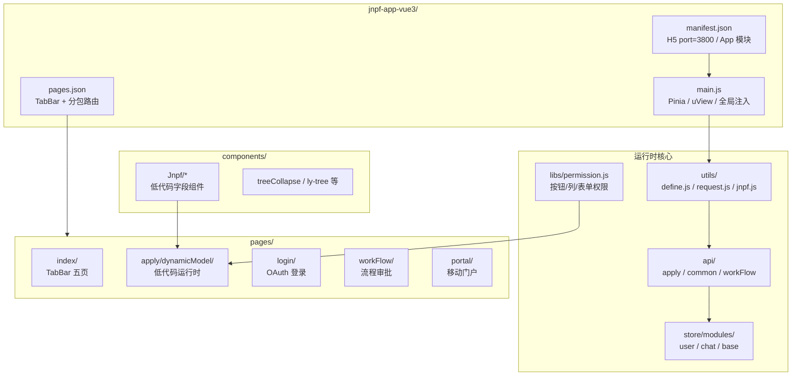
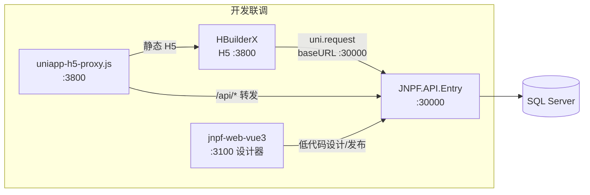
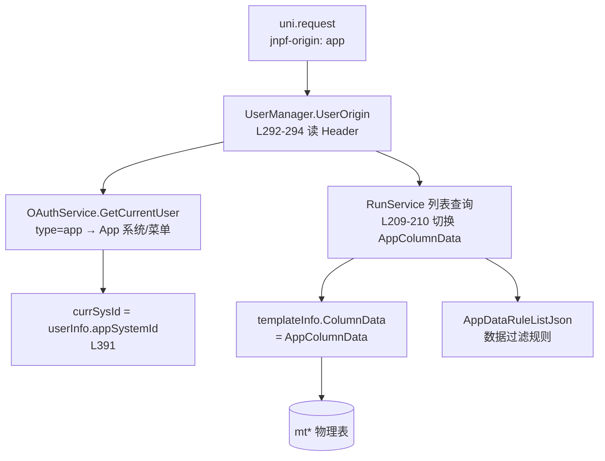
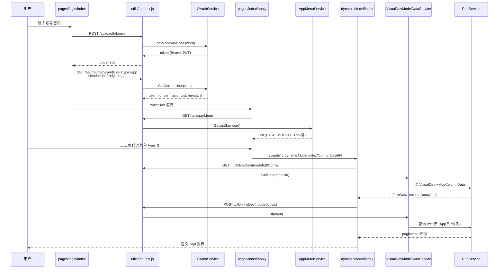

# 【专项文档06】JNPF v5.2 低代码平台 — 移动端（UniApp）深度解剖

> **适用版本**：JNPF v5.2  
> **后端源码仓库**：`d:\JNPF-v52\backend`  
> **前端源码路径**：`d:\JNPF-v52\jnpf-app-vue3\`（**独立于主仓库**，下文路径均相对此前端工程根目录，以 `jnpf-app-vue3/` 为前缀）  
> **文档编号**：v52-arch-06  
> **文档版本**：v2.0-final  
> **编写日期**：2026-05-24  
> **审核状态**：已审核通过（2026-05-24）  
> **编写依据**：v5.2 UniApp 前端源码实测 + 后端 `OAuthService.GetCurrentUser` / `RunService` / `AppMenuService` 交叉验证  
> **交叉引用**：[04-application-frontend-deep-dive.md §3.1](./04-application-frontend-deep-dive.md)（主 WEB `jnpf-origin: pc` 机制）；[手册三-UniApp低代码移动APP生成操作手册.md](../../架构迭代/6、培训与操作手册/3、手册三-UniApp低代码移动APP生成操作手册.md)（环境启动与发布操作）

---

## 已知问题与注意事项

> **⚠️ 前端源码不在主仓库**  
> 主仓库 `web/` 目录仅含已构建的静态 dist 与 SQL 脚本；**可维护的 UniApp 前端源码**位于外部路径 `d:\JNPF-v52\jnpf-app-vue3\`。本文档所有前端文件路径、行号、配置值均来自该外部工程 v5.2 实测。

> **⚠️ 工程名与常见误解**  
> 移动端工程目录为 **`jnpf-app-vue3`**（非 `jnpf-app-uniapp`）。与主 WEB 工程 `jnpf-web-vue3` 并列，同属 v5.2 前端产品线。

> **⚠️ v5.2 环境锚点（编写强制）**  
> UniApp H5 开发端口 **`:3800`**（`manifest.json` → `h5.devServer.port`）；API 直连 **`http://localhost:30000`**（`utils/define.js` 开发环境 `baseURL`）。禁止在本文档正文中将 `:3100` 或 `localhost:5000` 作为移动端 API 宿主。

> **⚠️ 无根级 package.json**  
> `jnpf-app-vue3/` 根目录**不存在** `package.json`（仅有 `uni_modules/*/package.json` 与 `node_modules/crypto-js`）。H5 开发/打包须通过 **HBuilderX** 导入工程；命令行快速联调可使用 **`uniapp-h5-proxy.js`**（见 §2.3），**不可**使用 `npm run dev`。

---

## 文档范围

本篇聚焦 v5.2 **UniApp 移动端运行时**（`jnpf-app-vue3`）的工程结构、构建启动、HTTP 封装、`jnpf-origin: app` 后端联动、App 菜单与低代码 `dynamicModel` 运行时。

| 纳入范围 | 排除范围 |
|----------|----------|
| HBuilderX / H5 `:3800` 联调 | 主 WEB 设计器（见 [04](./04-application-frontend-deep-dive.md)） |
| `pages.json` TabBar 与分包 | 数字大屏 DataV（见专项 05） |
| `uni.request` + Token 生命周期 | App/小程序原生打包证书流程（见手册三 §7） |
| `pages/apply/dynamicModel/` 低代码运行时 | `web/` 下已编译 dist 字节码分析 |
| `GET /api/app/Menu` App 菜单 | PC 端 `GET /api/system/Menu` |

**v5.2 环境锚点**：

| 服务 | 地址 | 配置来源 |
|------|------|----------|
| 后端 API | `http://localhost:30000` | `JNPF.API.Entry` 默认端口 |
| UniApp H5 开发服务 | `http://localhost:3800` | `manifest.json` → `h5.devServer.port` |
| 主 WEB 开发服务（设计端） | `http://localhost:3100` | `jnpf-web-vue3/.env` → `VITE_PORT=3100` |
| UniApp 开发 API 基址 | `http://localhost:30000` | `utils/define.js` → `baseURL`（非 `/dev` 代理前缀） |
| WebSocket（消息） | `ws://localhost:30000/api/message/websocket` | `utils/define.js` → `webSocketUrl` |

---

## 第一章：UniApp 工程架构

### 1.1 技术栈与工程特征

| 类别 | 依赖/配置 | 版本/值 | 用途 |
|------|-----------|---------|------|
| 框架 | UniApp + Vue | Vue **3**（`manifest.json` → `vueVersion: "3"`） | 跨端运行时 |
| UI | `vk-uview-ui`（`uni_modules/vk-uview-ui`） | uView 系 | 移动端基础 UI |
| 状态 | Pinia | `store/index.js` + `store/modules/*` | 用户/聊天等全局状态 |
| HTTP | `uni.request` | `utils/request.js` 封装 | 请求客户端 |
| 低代码组件 | `components/Jnpf/*` | easycom 自动注册 | 表单/列表字段渲染 |
| 下拉刷新 | `mescroll-uni` | `uni_modules/mescroll-uni` | 列表分页 |
| 构建工具 | HBuilderX | — | 运行/发行 H5、App、小程序 |
| 工程版本标识 | `define.sysVersion` | **V5.2** | `utils/define.js` L19 |

**与主 WEB 的关键差异**：主 WEB 使用 Vite + TypeScript + Ant Design Vue + axios（端口 `:3100`、代理前缀 `/dev`）；UniApp 使用 HBuilderX 构建链 + JavaScript + uView + `uni.request`（端口 `:3800`、API 直连 `:30000`）。

### 1.2 工程目录全景（图1-1）

**图1-1 jnpf-app-vue3/ 目录职责全景**



| 目录 | 职责 | 关键入口 |
|------|------|----------|
| `utils/define.js` | 环境常量：`baseURL`、WebSocket、上传地址 | 开发 `baseURL = http://localhost:30000` |
| `utils/request.js` | `uni.request` 封装；注入 `jnpf-origin: app` | 全局 `request()` |
| `api/apply/apply.js` | App 菜单 `GET /api/app/Menu` | `getMenuList()` |
| `api/apply/visualDev.js` | 低代码 CRUD `/api/visualdev/OnlineDev/{modelId}/...` | `getConfigData()` / `getModelList()` |
| `api/common.js` | OAuth 登录、`GetCurrentUser?type=app` | `login()` / `getCurrentUser()` |
| `pages/index/apply.vue` | 「应用」Tab：App 菜单网格 + 跳转 dynamicModel | `handelClick()` |
| `pages/apply/dynamicModel/` | 低代码列表/表单/详情运行时 | `index.vue` / `form.vue` / `detail.vue` |
| `components/Jnpf/` | 移动端低代码字段组件（Parser 驱动） | `Parser/index.vue` |
| `libs/permission.js` | 按钮/列/表单权限（替代 PC `v-auth`） | `hasBtnP()` / `getPermission()` |
| `store/modules/user.js` | Token、用户信息、菜单缓存 | `getCurrentUser()` action |

### 1.3 pages.json 路由与 TabBar

UniApp 采用 **`pages.json`** 静态路由（非 vue-router）。主包首屏为登录页；TabBar 五页位于 `pages/index/`。

**TabBar 结构**（`pages.json` L559–593）：

| 序号 | pagePath | 文案键 | 职责 |
|------|----------|--------|------|
| 1 | `pages/index/index` | `app.tabBar.home` | 首页（移动门户） |
| 2 | `pages/index/workFlow` | `app.tabBar.workFlow` | 协同办公入口 |
| 3 | `pages/index/apply` | `app.tabBar.apply` | **低代码 App 菜单**（核心 Tab） |
| 4 | `pages/index/message` | `app.tabBar.message` | 消息/IM |
| 5 | `pages/index/my` | `app.tabBar.my` | 个人中心 |

**低代码分包**（`subPackages` → `root: "pages/apply"`）：

| 路径 | 用途 |
|------|------|
| `pages/apply/dynamicModel/index` | 低代码列表/纯表单入口 |
| `pages/apply/dynamicModel/form` | 新增/编辑表单 |
| `pages/apply/dynamicModel/detail` | 详情页 |
| `pages/apply/dynamicModel/scanForm` | 扫码/预览表单 |

**easycom 组件自动注册**（`pages.json` L2–7）：

```json
"^Jnpf(.*)": "@/components/Jnpf/$1/index.vue",
"^jnpf-(.*)": "@/components/Jnpf/$1/index.vue"
```

低代码 Parser 渲染 `<JnpfInput>` 等标签时，无需手动 import。

#### 1.3.1 分包策略与小程序限制

v5.2 实测 `pages.json` 中 `subPackages` 含 **`pages/portal`**、**`pages/message`**、**`pages/apply`** 等根目录；低代码运行时位于 **`pages/apply`** 分包（L328+），与主包 TabBar 页分离。

| 平台 | 限制 | v5.2 工程现状 |
|------|------|---------------|
| 微信小程序 | 主包 ≤ 2MB；单个分包 ≤ 2MB；总包 ≤ 20MB（2024 规范，以微信官方为准） | `pages/apply/dynamicModel/` + `components/Jnpf/` 体量较大，**小程序发行前须 HBuilderX「发行 → 小程序」查看体积报告** |
| 进一步拆分 | 可按业务域新增 `subPackages` root | 源码**未**再拆 `dynamicModel` 子分包；二次开发若超 2MB 可将 `components/Jnpf` 或部分 `pages/apply` 页迁入新 root |

H5 / App 打包不受微信 2MB 限制；架构文档以 H5 `:3800` + App 原生包为主验证路径。

**本章小结**：UniApp 工程以 HBuilderX 为构建入口，路由由 `pages.json` 声明；低代码运行时集中在 `pages/apply/dynamicModel/` 分包，与主 WEB 的 `src/views/common/dynamicModel/` 职责对等、路径不同。

#### 本节核心表清单

| 表名 | 用途（移动端间接关联） |
|------|------------------------|
| **BASE_MODULE** | App 菜单节点（`F_CATEGORY='App'`），由 `AppDataService.GetAppMenuList` 查询 |
| **BASE_SYSTEM** | App 应用系统（`appSystemId`），菜单按 `F_SYSTEM_ID` 过滤 |

#### 本节关键代码路径索引

| 路径 | 说明 |
|------|------|
| `jnpf-app-vue3/manifest.json` | H5 端口 3800、Vue3、App 模块 |
| `jnpf-app-vue3/pages.json` | TabBar、分包、easycom |
| `jnpf-app-vue3/main.js` | 全局注入 `define` / `request` / `$permission` |
| `modularity/app/JNPF.Apps/AppDataService.cs` L200–242 | `GetAppMenuList` 查询 **BASE_MODULE** |

---

## 第二章：构建与开发环境

### 2.1 HBuilderX 构建链（唯一正式路径）

| 步骤 | 操作 | 产出 |
|------|------|------|
| 1 | HBuilderX → 文件 → 导入 → 选择 `jnpf-app-vue3/` | 工程载入 |
| 2 | 运行 → 运行到浏览器 → Chrome | H5 dev `:3800` |
| 3 | 发行 → 网站-H5 | `unpackage/dist/build/web/` 静态包 |

**根目录无 `package.json` 的实测结论**：Glob 扫描 `jnpf-app-vue3/package.json` 结果为 **0**（仅 `uni_modules/*/package.json` 存在）。因此：

- ❌ `npm run dev` / `pnpm dev` — 不可用  
- ✅ HBuilderX「运行到浏览器」— 开发 H5  
- ✅ HBuilderX「发行 → 网站-H5」— 生产静态资源  

### 2.2 manifest.json — H5 端口与路由模式

```200:207:d:\JNPF-v52\jnpf-app-vue3\manifest.json
    "h5" : {
        "devServer" : {
            "port" : 3800
        },
        "title" : "jnpf java vue3版",
        "router" : {
            "mode" : "history"
        },
```

- `port: 3800`：HBuilderX 运行 H5 时监听端口，访问 `http://localhost:3800`。
- `router.mode: history`：H5 使用 History 路由（与主 WEB Hash 模式不同）。
- `vueVersion: "3"`（L199）：与 `main.js` 中 `#ifdef VUE3` 分支一致。

**与 `pages.json` 的关系（已确认）**：v5.2 工程 `pages.json` **无** `h5` 配置段（全文件 grep 零命中）；H5 devServer 端口**仅**在 `manifest.json` → `h5.devServer.port` 声明。HBuilderX 以 **manifest 为准**；勿在 `pages.json` 重复配置以免混淆。

### 2.3 uniapp-h5-proxy.js（命令行快速联调）

当开发者不打开 HBuilderX、仅需预览已发行 H5 包时，可使用操作手册中的 proxy 脚本：

| 项 | 值 |
|----|-----|
| 脚本路径 | `D:\temp\v52-migration\phase5\uniapp-h5-proxy.js` |
| 静态根 | `jnpf-app-vue3/unpackage/dist/build/web` |
| 监听端口 | **3800** |
| API 转发 | `/api/*` → `http://localhost:30000` |

```powershell
# 前提：HBuilderX 已「发行 → 网站-H5」
node D:\temp\v52-migration\phase5\uniapp-h5-proxy.js
```

**局限**（手册三 §2.4.3）：

| 局限 | 说明 |
|------|------|
| 无热更新 | 改源码后须重新发行 H5 并重启 proxy |
| 依赖发行包 | `unpackage/dist/build/web` 不存在则 404 |
| 仅 H5 | 不能替代 App/小程序真机调试 |
| **CORS** | 浏览器访问 `:3800`，API 经 Node 反代至 `:30000` → **同源请求，无浏览器跨域**（脚本将 `/api/*` 转发，删除 `Origin` 头后服务端请求） |

**对比 HBuilderX 直连模式**：HBuilderX 运行 H5 时页面在 `:3800`、XHR 直连 `http://localhost:30000` → **跨域**。后端须启用 CORS：`Startup.cs` → `services.AddCorsAccessor()` + `app.UseCorsAccessor()`（`application/JNPF.API.Entry/Startup.cs` L80、L288），具体允许源见框架 `CorsAccessor` 配置（通常开发环境允许任意源）。

### 2.4 utils/define.js — 环境常量

```1:28:d:\JNPF-v52\jnpf-app-vue3\utils\define.js
/* process.env.NODE_ENV设置生产环境模式 */
// #ifndef MP
const baseURL = process.env.NODE_ENV === "production" ? "" : "http://localhost:30000"
const webSocketUrl = process.env.NODE_ENV === "production" ? "/websocket" :
	"ws://localhost:30000/api/message/websocket"
const report = process.env.NODE_ENV === 'production' ? '/Report' : 'http://localhost:8200'
const flow = process.env.NODE_ENV === 'production' ? '' : 'http://localhost:3100'
// #endif
// ...
const define = {
	copyright: "Copyright @ 2024 引迈信息技术有限公司版权所有",
	sysVersion: "V5.2",
	baseURL, // 接口前缀
	report,
	flow,
	webSocketUrl,
	comUploadUrl: baseURL + '/api/file/Uploader/',
	timeout: 1000000,
	// ...
}
```

| 变量 | 开发值 | 说明 |
|------|--------|------|
| `baseURL` | `http://localhost:30000` | **直连后端**，无 `/dev` 代理前缀 |
| `webSocketUrl` | `ws://localhost:30000/api/message/websocket` | IM 消息 WebSocket |
| `report` | `http://localhost:8200` | **报表前端静态站点**（iframe/跳转用，见 §2.4.1） |
| `flow` | `http://localhost:3100` | 流程设计预览跳转主 WEB |
| `comUploadUrl` | `baseURL + '/api/file/Uploader/'` | 文件上传 |
| 生产 `baseURL` | `""`（空字符串） | 与 API 同域部署，相对路径请求 |

#### 2.4.1 `report` 端口 8200 与 32000 的关系（已确认）

审核问题「8200 vs 01 文档 :32000」：**二者职责不同，非笔误**。

| 端口/前缀 | 角色 | PC 主 WEB | UniApp |
|-----------|------|-----------|--------|
| **`:8200`** | **报表设计/预览前端**静态站点 URL | `globSetting.report`（`jnpf-web-vue3/src/hooks/setting/index.ts` L36） | `define.report`（`utils/define.js` L6） |
| **`:32000`** / `/reportDev` | **报表 REST API**（`reportHttp`） | `.env.development` → `VITE_PROXY` 第二项 → `reportHttp` | **未在 define.js 配置**；移动端若需调报表 API 须二次开发补前缀 |
| **`:30007`** / ReportServer | 旧版数据报表服务 | `globSetting.reportServer` L34 | 移动端未单独配置 |

**结论**：UniApp `localhost:8200` 与 PC 端 `globSetting.report` **一致**，指向报表**前端**；01 文档 `:32000` 描述的是 **reportDev API 代理**，与 `define.report` 无冲突。生产环境两者均为相对路径 `/Report`（与 API 同域）。

**与主 WEB 对比**：主 WEB 开发环境 API 为相对前缀 `/dev`（Vite 代理剥离后转发 `:30000`）；UniApp 开发环境 **直接写绝对地址** `http://localhost:30000`，HBuilderX H5 运行时需后端 CORS 或使用 proxy 脚本（§2.3）。

**图2-1 移动端开发环境拓扑**



**本章小结**：UniApp 无 npm 脚本入口；H5 开发端口固定 `:3800`；API 在 `define.js` 中直连 `:30000`，与主 WEB 的 Vite `/dev` 代理模式不同。

#### 本节核心表清单

| 表名 | 用途 |
|------|------|
| **BASE_SYS_CONFIG** | 系统名称、验证码开关等（登录页 `getSystemConfig` 读取） |

#### 本节关键代码路径索引

| 路径 | 说明 |
|------|------|
| `jnpf-app-vue3/manifest.json` L200–207 | H5 devServer.port |
| `jnpf-app-vue3/utils/define.js` | baseURL / WebSocket |
| `docs/架构迭代/6、培训与操作手册/3、手册三-UniApp低代码移动APP生成操作手册.md` §2.4 | proxy 启动说明 |

---

## 第三章：HTTP 封装与 jnpf-origin 联动

### 3.1 utils/request.js — uni.request 封装

```28:78:d:\JNPF-v52\jnpf-app-vue3\utils\request.js
function request(config) {
	config.options = Object.assign(defaultOpt, config.options)
	const token = uni.getStorageSync('token') || ''
	const locale = getBackLocale()
	let header = {
		"Content-Type": "application/json;charset=UTF-8",
		"jnpf-origin": "app",
		"vue-version": "3",
		"Accept-Language": locale,
		...config.header
	}
	if (token) header['Authorization'] = token
	let url = config.url.indexOf('http') > -1 ? config.url : host + config.url
	// ...
	return new Promise((resolve, reject) => {
		uni.request({
			url: url,
			data: config.data || null,
			method: config.method || 'GET',
			header: header,
			timeout: define.timeout,
			success: res => {
				uni.hideLoading()
				if (res.statusCode === 200) {
					if (res.data.code == 200) {
						resolve(res.data)
					} else {
						ajaxError(res.data)
						reject(res.data.msg)
					}
				}
				// ...
			},
			// ...
		})
	})
}
```

| 行为 | 实现 |
|------|------|
| 请求头 `jnpf-origin` | 固定 **`app`**（与主 WEB `pc` 对称，见 [04 §3.1](./04-application-frontend-deep-dive.md)） |
| 请求头 `vue-version` | **`3`** |
| Authorization | `uni.getStorageSync('token')` 原样注入（含 `Bearer` 前缀，来自登录响应） |
| 业务成功码 | `res.data.code == 200` |
| Token 失效 | 业务码 **600 / 601 / 602** → 清缓存 → `uni.reLaunch` 登录页 |

### 3.2 jnpf-origin 后端处理链（图3-1）

**图3-1 jnpf-origin: app 请求头后端分支**



#### 3.2.1 UserManager.UserOrigin

```292:294:d:\JNPF-v52\backend\modularity\common\JNPF.Common.Core\Manager\User\UserManager.cs
    public string UserOrigin
    {
        get => _httpContext?.Request.Headers["jnpf-origin"];
    }
```

#### 3.2.2 OAuthService.GetCurrentUser — type=app

前端调用（`api/common.js` L289–295）：

```javascript
export function getCurrentUser() {
	return request({
		url: '/api/oauth/CurrentUser?type=' + 'app',
		// ...
	})
}
```

后端（`OAuthService.cs` L322–327, L391）：

- 路由：`GET /api/oauth/CurrentUser`（`OAuthService.GetCurrentUser(string type, string systemCode)`）
- `type=app` 规范化为 `"App"`；菜单走 App 端逻辑
- `currSysId = UserOrigin.Equals("pc") ? systemId : appSystemId` — App 端取 **`appSystemId`**
- 应用系统列表过滤：`type.Equals("App")` 时排除 `mainSystem`（L374）

#### 3.2.3 RunService — AppColumnData 切换

```209:210:d:\JNPF-v52\backend\modularity\visualdev\JNPF.VisualDev\RunService.cs
        bool udp = _userManager.UserOrigin == "pc" ? templateInfo.ColumnData.useDataPermission : templateInfo.AppColumnData.useDataPermission;
        templateInfo.ColumnData = _userManager.UserOrigin == "pc" ? templateInfo.ColumnData : templateInfo.AppColumnData;
```

当 `jnpf-origin: app` 时：

- 列表列配置、搜索项、排序规则来自 **`F_APP_COLUMN_DATA`**（实体字段 `VisualDevEntity.AppColumnData`）
- 数据权限开关读 `AppColumnData.useDataPermission`
- 数据过滤规则读 `AppDataRuleListJson`（L227）

**设计端对应关系**：主 WEB 设计器发布勾选「移动端」时，移动端列/搜索/按钮配置写入 **BASE_VISUAL_DEV.F_APP_COLUMN_DATA**；与 PC 端 **F_COLUMN_DATA** 并存，运行时由 `UserOrigin` 选择。

**JSON 结构（已确认）**：`F_APP_COLUMN_DATA` 与 `F_COLUMN_DATA` **反序列化为同一模型** `ColumnDesignModel`（`modularity/engine/JNPF.VisualDev.Engine/Core/TemplateParsingBase.cs` L489–493）：

```489:493:d:\JNPF-v52\backend\modularity\engine\JNPF.VisualDev.Engine\Core\TemplateParsingBase.cs
        if (!string.IsNullOrWhiteSpace(entity.ColumnData)) ColumnData = entity.ColumnData.ToObject<ColumnDesignModel>();
        // ...
        if (!string.IsNullOrWhiteSpace(entity.AppColumnData)) AppColumnData = entity.AppColumnData.ToObject<ColumnDesignModel>();
```

字段结构相同（含 `columnList`、`searchList`、`useDataPermission` 等）；**内容**针对移动端列宽/搜索项/按钮布局单独配置，非另一套 schema。App 端缺省时会从 PC `columnList` 按 `prop` 合并补列（同文件 L495–499）。

**本章小结**：移动端每个 API 请求强制携带 `jnpf-origin: app`；后端据此切换 App 系统 ID、App 菜单权限、低代码 App 列配置与数据规则。该机制与 [04 §3.1](./04-application-frontend-deep-dive.md) 主 WEB `jnpf-origin: pc` 完全对称，**不可省略**。

#### 本节核心表清单

| 表名 | 关键字段 | 用途 |
|------|----------|------|
| **BASE_VISUAL_DEV** | F_ID, F_COLUMN_DATA, **F_APP_COLUMN_DATA**, F_APP_DATA_RULE | 低代码 PC/App 双端列配置 |
| **BASE_USER** | F_Id, F_AppSystemId, F_SystemId | App/PC 当前应用系统 |
| **BASE_SYS_CONFIG** | tokenTimeout, enableVerificationCode | Token 与验证码策略 |

#### 本节关键代码路径索引

| 路径 | 说明 |
|------|------|
| `jnpf-app-vue3/utils/request.js` | jnpf-origin: app 注入 |
| `jnpf-app-vue3/api/common.js` L289–295 | GetCurrentUser?type=app |
| `modularity/common/JNPF.Common.Core/Manager/User/UserManager.cs` L292–294 | UserOrigin |
| `modularity/oauth/JNPF.OAuth/OAuthService.cs` L322–327, L391 | GetCurrentUser App 分支 |
| `modularity/visualdev/JNPF.VisualDev/RunService.cs` L209–227 | AppColumnData 切换 |

---

## 第四章：认证、菜单与 TabBar 导航

### 4.1 登录流程

| 步骤 | 前端 | 后端 |
|------|------|------|
| 1 | `pages/login/index.vue` 收集账号密码 | — |
| 2 | `api/common.js` → `POST /api/oauth/Login` | `OAuthService.Login` |
| 3 | 响应 `token` 写入 `uni.setStorageSync('token')` | JWT 含 Bearer 前缀 |
| 4 | `store/modules/user.js` → `getCurrentUser()` | `GET /api/oauth/CurrentUser?type=app` |
| 5 | 缓存 `userInfo` / `permissionList` / `menuList` | 返回 App 端菜单与按钮权限 |
| 6 | `uni.switchTab` → TabBar 首页 | — |

登录页验证码图片地址：`define.baseURL + imgUrl`（直连 `:30000`）。

### 4.2 App 菜单 API — 非 system/Menu

**关键结论**：移动端「应用」Tab 菜单来自 **`GET /api/app/Menu`**（`AppMenuService.GetList`），**不是** PC 端 `GET /api/system/Menu`。

```1:11:d:\JNPF-v52\jnpf-app-vue3\api\apply\apply.js
import request from '@/utils/request'
// 获取应用菜单
export function getMenuList(data) {
	return request({
		url: '/api/app/Menu',
		method: 'get',
		data,
		options: {
			load: false
		}
	})
}
```

后端（`AppMenuService.cs` L18–46）：

```csharp
[ApiDescriptionSettings(Tag = "App", Name = "Menu", Order = 800)]
[Route("api/App/[controller]")]
public class AppMenuService : IDynamicApiController, ITransient
{
    [HttpGet("")]
    public async Task<dynamic> GetList(string keyword)
    {
        List<AppMenuListOutput>? list = (await _appDataService.GetAppMenuList(keyword)).Adapt<List<AppMenuListOutput>>();
        return new { list = list.ToTree("-1") };
    }
}
```

`AppDataService.GetAppMenuList`（L200–242）查询条件：

- `Category == "App"`（**BASE_MODULE.F_CATEGORY**）
- `SystemId == _userManager.User.AppSystemId`
- 非管理员按 **BASE_AUTHORIZE** 模块权限过滤

**扩展 API**（同一 Service 族）：

| API | 用途 |
|-----|------|
| `GET /api/app/Menu/getChildList/{id}` | 目录子菜单 |
| `GET /api/app/Menu/getMenuList?keyword=` | 关键字搜索 |

### 4.3 「应用」Tab 菜单点击与路由

`pages/index/apply.vue` → `handelClick(item)` 按 `item.type` 分支：

| type | 行为 | 目标 |
|------|------|------|
| 1 | 目录 | `getChildList` → `/pages/apply/catalog/index` |
| 2 | 普通页面 | `item.urlAddress` 直接 navigate |
| **3 / 9** | **低代码功能/流程表单** | `/pages/apply/dynamicModel/index?config={base64(item)}` |
| 5 | 报表 | `/pages/apply/externalLink/index`（嵌入 Report） |
| 7 | 外链 | externalLink |
| 8 | 门户 | `/pages/portal/scanPortal/index` |

低代码入口核心代码（L283–295）：

```javascript
if (item.type == 3 || item.type == 9) {
    this.modelId = item.moduleId;
    uni.navigateTo({
        url: "/pages/apply/dynamicModel/index?config=" +
            this.jnpf.base64.encode(JSON.stringify(item)),
    });
}
```

### 4.4 移动端权限模型

PC 端使用 `v-auth` 指令 + `usePermission().hasBtnP()`（[04 §4](./04-application-frontend-deep-dive.md)）。

移动端等价物为 **`libs/permission.js`**，挂载为 `$permission`：

| 方法 | 用途 |
|------|------|
| `hasBtnP(enCode, menuIds)` | 按钮权限 |
| `hasP(enCode, menuIds)` | 列权限 |
| `hasFormP(enCode, menuIds)` | 表单字段权限 |
| `getPermission(columnData, menuId, getScriptFunc)` | 列表页批量计算可见按钮/列 |

权限数据来源：`getCurrentUser` 响应的 `permissionList` → `uni.setStorageSync('permissionList')`（`store/modules/user.js` L44–50）。

**本章小结**：登录后 `type=app` 拉取 App 专用用户上下文；「应用」Tab 通过 `GET /api/app/Menu` 渲染 **BASE_MODULE(App)** 树；低代码菜单项 type=3/9 跳转 `pages/apply/dynamicModel/`。

#### 本节核心表清单

| 表名 | 关键字段 | 用途 |
|------|----------|------|
| **BASE_MODULE** | F_ID, F_CATEGORY(`App`), F_TYPE, F_MODULE_ID, F_SYSTEM_ID | App 菜单树 |
| **BASE_AUTHORIZE** | F_OBJECT_ID, F_ITEM_ID, F_ITEM_TYPE(`module`) | 菜单授权 |
| **BASE_USER** | F_AppSystemId | 当前 App 应用系统 |

#### 本节关键代码路径索引

| 路径 | 说明 |
|------|------|
| `jnpf-app-vue3/pages/login/index.vue` | 登录 UI |
| `jnpf-app-vue3/store/modules/user.js` | getCurrentUser / permissionList |
| `jnpf-app-vue3/api/apply/apply.js` | getMenuList → /api/app/Menu |
| `jnpf-app-vue3/pages/index/apply.vue` L252–335 | handelClick 路由分支 |
| `modularity/app/JNPF.Apps/AppMenuService.cs` | GET /api/app/Menu |
| `modularity/app/JNPF.Apps/AppDataService.cs` L200–242 | GetAppMenuList |

---

## 第五章：低代码 dynamicModel 运行时

### 5.1 与主 WEB 路径对照

| 维度 | 主 WEB（jnpf-web-vue3） | UniApp（jnpf-app-vue3） |
|------|-------------------------|-------------------------|
| 页面路径 | `src/views/common/dynamicModel/` | `pages/apply/dynamicModel/` |
| 路由方式 | vue-router 动态路由 `/model/{enCode}` | `uni.navigateTo` + query `config=base64` |
| 入口组件 | `dynamicModel/index.vue`（`<component :is>`） | `dynamicModel/index.vue`（`Form` / `List` v-if） |
| API 封装 | `api/onlineDev/visualDev.ts` | `api/apply/visualDev.js` |
| **API 路径** | `/api/visualdev/OnlineDev/{modelId}/...` | **相同** |
| 请求头 | `jnpf-origin: pc` | `jnpf-origin: app` |

主 WEB 入口（`jnpf-web-vue3/src/views/common/dynamicModel/index.vue`）通过 `useRoute` 读 `meta.modelId`；UniApp 通过 `onLoad(obj)` 解码 `config` 参数获取 `moduleId` / `menuId`。

### 5.2 dynamicModel 页面加载流程

`pages/apply/dynamicModel/index.vue` 核心逻辑：

```43:80:d:\JNPF-v52\jnpf-app-vue3\pages\apply\dynamicModel\index.vue
		onLoad(obj) {
			baseStore.getDictionaryDataAll()
			this.config = JSON.parse(this.jnpf.base64.decode(obj.config)) || {};
			this.isPreview = this.config.isPreview || false;
			this.enableFlow = this.config.type === 9 ? 1 : 0;
			this.title = this.config.fullName || "";
			this.menuId = this.config.id || "";
			uni.setNavigationBarTitle({ title: this.title });
			if (!this.enableFlow) return this.getConfigData();
			this.flowId = this.config.moduleId
			this.getModelId()
		},
		methods: {
			getConfigData() {
				getConfigData(this.config.moduleId, undefined).then((res) => {
					if (res.code !== 200 || !res.data) return this.handleError('暂无此页面')
					// ...
					this.modelId = this.config.moduleId;
					this.webType = this.config.webType;
				});
			},
```

| webType | 渲染组件 | 说明 |
|---------|----------|------|
| 1 | `components/form/index.vue` | 纯表单 |
| 2 / 4 | `components/list/index.vue` | 列表 + 搜索/排序 |

### 5.3 低代码 REST API（与 PC 同路径）

`api/apply/visualDev.js` 封装（均由 `request.js` 注入 `jnpf-origin: app`）：

| 方法 | HTTP | 路径 |
|------|------|------|
| `getConfigData(modelId, type)` | GET | `/api/visualdev/OnlineDev/{modelId}/Config?type={type}` |
| `getModelList(modelId, data)` | POST | `/api/visualdev/OnlineDev/{modelId}/List` |
| `createModel(modelId, data)` | POST | `/api/visualdev/OnlineDev/{modelId}` |
| `updateModel(modelId, data)` | PUT | `/api/visualdev/OnlineDev/{modelId}/{id}` |
| `getModelInfo(modelId, id)` | GET | `/api/visualdev/OnlineDev/{modelId}/{id}` |
| `deteleModel(data, id)` | POST | `/api/visualdev/OnlineDev/batchDelete/{id}` |

后端主服务：`VisualDevModelDataService`（`modularity/visualdev/JNPF.VisualDev/VisualDevModelDataService.cs` L46–48）：

```csharp
[Route("api/visualdev/[controller]")]
public class VisualDevModelDataService : IDynamicApiController, ITransient
```

动态路由展开为 `/api/visualdev/OnlineDev/{modelId}/List` 等 — **UniApp 与 PC 共用此 Service**。

### 5.4 VisualdevModelAppService — 存在但非默认路径

后端另存在 App 专用 Service（`VisualdevModelAppService.cs` L29–31）：

```csharp
[Route("api/visualdev/OnlineDev/[controller]")]
public class VisualdevModelAppService : IDynamicApiController, ITransient
```

路由前缀为 **`/api/visualdev/OnlineDev/App/`**（如 `GET /api/visualdev/OnlineDev/App/{modelId}/Config`）。

**实测结论**：`jnpf-app-vue3` 全工程 **未调用** `/api/visualdev/OnlineDev/App/` 路径；`api/apply/visualDev.js` 与 PC 一样走 **`/api/visualdev/OnlineDev/{modelId}/...`**，依赖 `jnpf-origin: app` 触发 `RunService` 的 App 列配置分支。`VisualdevModelAppService` 为历史/备用 API，二次开发默认应遵循现有前端路径，避免重复实现。

### 5.5 列表运行时与权限

`pages/apply/dynamicModel/components/list/index.vue`：

- 使用 `mescroll-uni` 上拉加载 → `getModelList(modelId, { page, rows, menuId, queryJson })`
- 搜索/排序读取 `config.columnData`（后端已按 App 列配置返回）
- 按钮可见性：`this.$permission.getPermission(columnData, menuId, getScriptFunc)`

子页面：

| 页面 | 路径 | 用途 |
|------|------|------|
| 表单 | `dynamicModel/form.vue` | 新增/编辑 |
| 详情 | `dynamicModel/detail.vue` | 只读详情 |
| 扫码 | `dynamicModel/scanForm.vue` | 扫码填报 |

### 5.6 端到端时序（图5-1）

**图5-1 登录 → App 菜单 → dynamicModel 列表时序**



**本章小结**：UniApp 低代码运行时与 PC 共享 `VisualDevModelDataService` API 路径，通过 `jnpf-origin: app` 区分 App 列配置；页面位于 `pages/apply/dynamicModel/` 分包，由「应用」Tab 菜单 type=3/9 跳入。

#### 本节核心表清单

| 表名 | 关键字段 | 用途 |
|------|----------|------|
| **BASE_VISUAL_DEV** | F_ID, F_EN_CODE, F_WEB_TYPE, F_APP_COLUMN_DATA | 低代码功能定义 |
| **BASE_MODULE** | F_MODULE_ID → VisualDev F_ID | App 菜单关联低代码功能 |
| **mt{ID}** | 业务物理表 | 低代码 CRUD 目标表（与 PC 共用） |

#### 本节关键代码路径索引

| 路径 | 说明 |
|------|------|
| `jnpf-app-vue3/pages/apply/dynamicModel/index.vue` | 运行时入口 |
| `jnpf-app-vue3/pages/apply/dynamicModel/components/list/index.vue` | 列表+搜索 |
| `jnpf-app-vue3/api/apply/visualDev.js` | OnlineDev API 封装 |
| `jnpf-web-vue3/src/views/common/dynamicModel/index.vue` | PC 对照入口 |
| `modularity/visualdev/JNPF.VisualDev/VisualDevModelDataService.cs` | 共用 OnlineDev API |
| `modularity/visualdev/JNPF.VisualDev/VisualdevModelAppService.cs` | App 专用 API（非默认） |
| `modularity/visualdev/JNPF.VisualDev/RunService.cs` L209–232 | App 列/规则/数据权限 |

---

## 第六章：PC 端与 App 端对照

### 6.1 综合对照表

| 维度 | 主 WEB（jnpf-web-vue3） | UniApp（jnpf-app-vue3） |
|------|-------------------------|-------------------------|
| **开发端口** | `:3100` | `:3800` |
| **构建工具** | Vite + `package.json` scripts | HBuilderX（无根 package.json） |
| **API 基址（开发）** | `/dev` → 代理 `:30000` | 直连 `http://localhost:30000` |
| **HTTP 客户端** | axios（`VAxios`） | `uni.request`（`utils/request.js`） |
| **jnpf-origin** | `pc` | **`app`** |
| **GetCurrentUser** | `type` 默认 Web/pc | **`type=app`** |
| **菜单 API** | 登录响应 `menuList` / system 模块 | **`GET /api/app/Menu`** |
| **低代码 API** | `/api/visualdev/OnlineDev/{id}/...` | **同路径** |
| **列配置来源** | `F_COLUMN_DATA` | **`F_APP_COLUMN_DATA`** |
| **权限机制** | `v-auth` 指令 + `usePermission` | **`$permission.hasBtnP`** + storage |
| **UI 组件库** | Ant Design Vue + Jnpf | **uView (vk-uview-ui)** + Jnpf |
| **低代码页面路径** | `src/views/common/dynamicModel/` | `pages/apply/dynamicModel/` |
| **路由** | vue-router Hash + 动态注册 | pages.json + navigateTo |
| **设计器** | ✅ 内置 | ❌ 无（消费发布结果） |

### 6.2 数据互通

- 低代码功能在 **主 WEB :3100** 设计并发布（勾选 pc / app）
- 发布写入 **BASE_MODULE**（`F_CATEGORY='App'`）与 **mt{ID}** 物理表
- UniApp 只读运行时消费同一 `modelId`、同一物理表
- 详细操作见 [手册三 §3–§6](../../架构迭代/6、培训与操作手册/3、手册三-UniApp低代码移动APP生成操作手册.md)

**本章小结**：两端 API 宿主均为 `:30000`，差异集中在端口、HTTP 封装、jnpf-origin、菜单 API 与 UI 组件体系；低代码数据层完全共用。

#### 本节核心表清单

| 表名 | 用途 |
|------|------|
| **BASE_VISUAL_DEV** | PC/App 双端列配置共存 |
| **BASE_MODULE** | PC(`Web`) 与 App 菜单分 Category |

#### 本节关键代码路径索引

| 路径 | 说明 |
|------|------|
| [04-application-frontend-deep-dive.md](./04-application-frontend-deep-dive.md) | 主 WEB 全栈对照 |
| `jnpf-app-vue3/utils/request.js` vs `jnpf-web-vue3/src/utils/http/axios/index.ts` | HTTP 差异 |

---

## 第七章：二次开发扩展点与局限

### 7.1 扩展点

| 场景 | 推荐做法 |
|------|----------|
| 新增 App 菜单类型 | 扩展 `pages/index/apply.vue` → `handelClick` 分支；后端 **BASE_MODULE.F_TYPE** 约定一致 |
| 新增低代码字段组件 | 在 `components/Jnpf/` 新增目录 + `pages.json` easycom 已覆盖 `Jnpf*` |
| 切换 API 环境 | 修改 `utils/define.js` 的 `baseURL`（生产部署改为同域 `""`） |
| 自定义 App 列逻辑 | 后端 `RunService` App 分支；或设计器 App 列配置 |
| 按钮权限 | 调用 `$permission.getPermission()`，勿硬编码按钮 |

### 7.2 已知局限

| 局限 | 说明 |
|------|------|
| 无 npm 热更新 | 须 HBuilderX 运行/发行；proxy 模式无热更新 |
| 开发 CORS | **HBuilderX 直连** `:30000` 时须 `Startup` 启用 `AddCorsAccessor`（见 §2.3）；**proxy 模式**（`:3800` 反代）无跨域问题 |
| 微信小程序包体积 | `pages/apply` + `Jnpf` 组件分包可能接近 2MB 上限（见 §1.3.1） |
| VisualdevModelAppService 未使用 | 现有前端不走 `/OnlineDev/App/`，勿与新路径混用 |
| 设计器缺失 | 移动端不可设计低代码，须回主 WEB :3100 |
| 部分 PC 组件无 App 版 | 设计器 App 预览可发现不支持控件 |

### 7.3 验证清单

| # | 检查项 | 命令/操作 |
|---|--------|-----------|
| 1 | 后端 API 可达 | `dotnet run --project application/JNPF.API.Entry/JNPF.API.Entry.csproj` → `:30000` |
| 2 | H5 启动 | HBuilderX 运行到浏览器 → `http://localhost:3800` |
| 3 | 登录 + CurrentUser | DevTools Network 见 `jnpf-origin: app`、`type=app` |
| 4 | App 菜单 | `GET /api/app/Menu` 返回 `list` 树 |
| 5 | 低代码列表 | 点击应用 Tab 菜单 → `OnlineDev/{id}/List` POST 200 |

**本章小结**：二次开发应复用 `request.js` 的 app 头、App 菜单 API 与现有 dynamicModel 路径；环境切换仅改 `define.js`。

#### 本节核心表清单

| 表名 | 用途 |
|------|------|
| **BASE_MODULE** | 扩展菜单 type 时维护 |
| **BASE_VISUAL_DEV** | 扩展 webType/组件时维护 |

#### 本节关键代码路径索引

| 路径 | 说明 |
|------|------|
| `jnpf-app-vue3/utils/define.js` | 环境切换 |
| `jnpf-app-vue3/components/Jnpf/` | 字段组件扩展 |
| [手册三](../../架构迭代/6、培训与操作手册/3、手册三-UniApp低代码移动APP生成操作手册.md) | 操作验证 |

---

## 附录 A：深度自检清单

| # | 检查项 | 本文档 |
|---|--------|--------|
| 1 | 端到端调用链路 | ✅ 图5-1 登录→菜单→dynamicModel |
| 2 | 数据库表与关键字段 | ✅ 每章核心表清单 |
| 3 | 技术图 | ✅ 图1-1 架构、图2-1 拓扑、图3-1 jnpf-origin、图5-1 时序 |
| 4 | 可验证文件路径/类名 | ✅ 前后端路径均已标注 |
| 5 | 扩展点 | ✅ §7.1 |
| 6 | 性能/设计局限 | ✅ §7.2 |
| 7 | report 8200 vs 32000 | ✅ §2.4.1 职责区分 |
| 8 | manifest vs pages.json H5 端口 | ✅ §2.2 |
| 9 | CORS proxy vs 直连 | ✅ §2.3 / §7.2 |

---

## 附录 B：相关文档索引

| 文档 | 关系 |
|------|------|
| [04-application-frontend-deep-dive.md](./04-application-frontend-deep-dive.md) | 主 WEB 前端；§3.1 jnpf-origin: pc |
| [03-application-modules-deep-dive.md](./03-application-modules-deep-dive.md) | App 模块 `JNPF.Apps` |
| [02-application-services.md](./02-application-services.md) | VisualDev / OAuth 服务总览 |
| [手册三-UniApp低代码移动APP生成操作手册.md](../../架构迭代/6、培训与操作手册/3、手册三-UniApp低代码移动APP生成操作手册.md) | 操作步骤与环境 |
| [ARCHITECTURE_DOC_RULES.md](../ARCHITECTURE_DOC_RULES.md) | 编写铁律 |

---

## 本会话结论（episodic 索引友好）

- **决策**：`define.report :8200` 为报表**前端** URL，与 PC 一致；`:32000` 为 PC 专用 reportDev **API**；`F_APP_COLUMN_DATA` 与 `F_COLUMN_DATA` 同为 `ColumnDesignModel`
- **交付物**：`docs/architecture/v52/06-mobile-uniapp-deep-dive.md`（v2.0-final）
- **禁止项**：根目录 `npm run dev`；将 `VisualdevModelAppService` 路径当作默认前端调用
- **下一步**：05 大屏文档待集中审核

---

*文档结束 · v52-arch-06 · v2.0-final · 2026-05-24*
