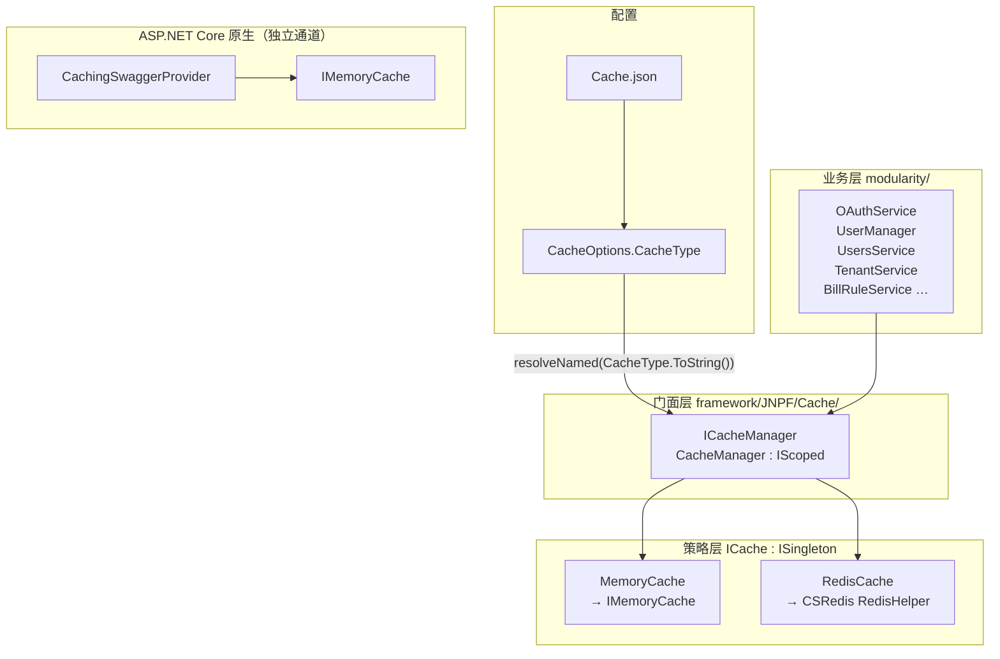
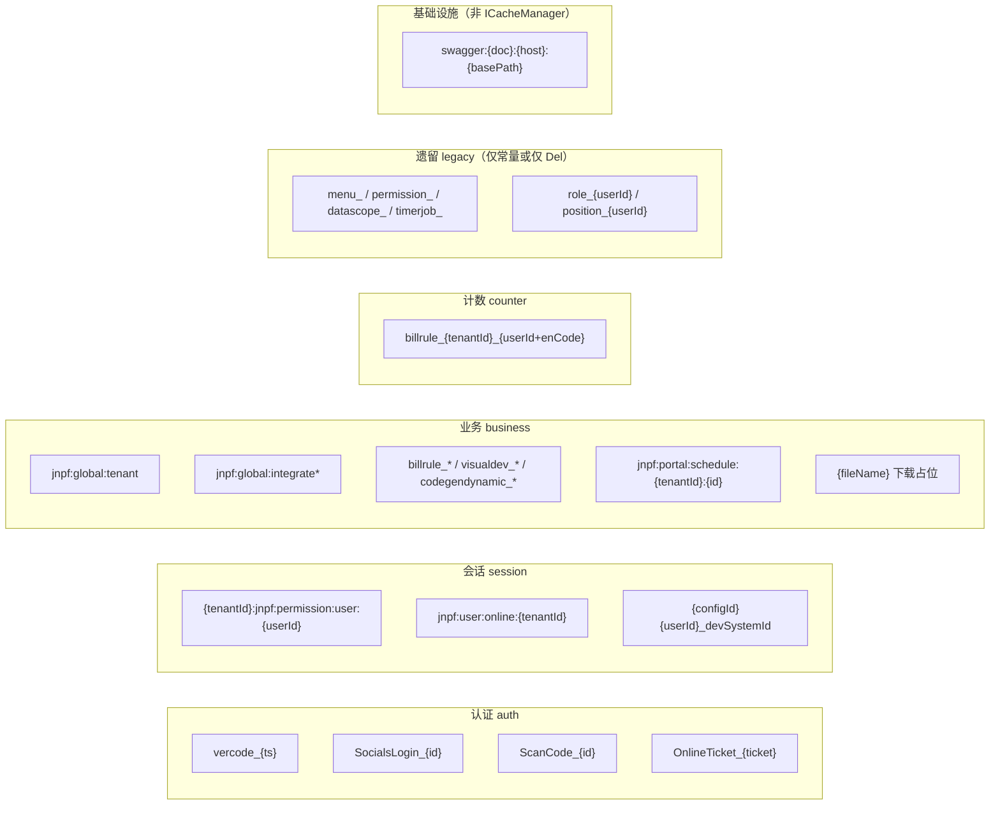
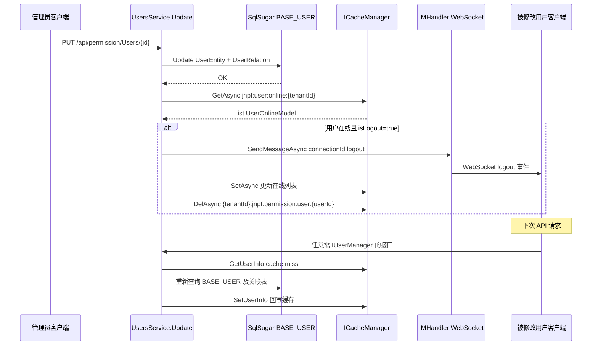

# 【专项文档07】JNPF v5.2 低代码平台 — 缓存中间件深度解剖

> **适用版本**：JNPF v5.2  
> **源码仓库**：`d:\JNPF-v52\backend`  
> **文档编号**：v52-arch-07  
> **文档版本**：v2.0-final  
> **编写日期**：2026-05-24  
> **审核状态**：已审核通过（2026-05-24）  
> **编写依据**：v5.2 源码全量扫描 `ICacheManager` / `ICache` 引用 + `CommonConst` 键常量 + `Configurations/Cache.json` 实测  

**交叉引用**：

| 专项 | 衔接点 |
|------|--------|
| [01-core-framework.md](./01-core-framework.md) | `Serve.Run()` → `AddApp()` → `AddMemoryCache()`；JWT / `JwtHandler` |
| [02-application-services.md](./02-application-services.md) | `ICacheManager` 作为 Scoped 服务被各 `*Service` 注入 |
| [03-application-modules-deep-dive.md](./03-application-modules-deep-dive.md) | **BASE_USER**、**BASE_SYS_CONFIG**、**BASE_MODULE**、**BASE_TENANT** 与缓存失效联动 |

**v5.2 环境锚点**（API 端口仅作部署参考）：

| 服务 | 地址 | 说明 |
|------|------|------|
| 后端 API | `http://localhost:30000` | 缓存管理 API：`GET /api/system/CacheManage` |
| 主 WEB dev 代理 | `/dev` → `:30000` | 前端不直接操作缓存层 |

---

## 已知问题与注意事项

> **⚠️ 配置来源不是 appsettings.json**  
> 缓存类型与 Redis 连接参数来自 `application/JNPF.API.Entry/Configurations/Cache.json`（经 `AddConfigurableOptions<CacheOptions>()` 绑定）。默认 `CacheType` 为 **`MemoryCache`**，非 Redis。

> **⚠️ Redis Del 前缀不一致（设计缺陷）**  
> `RedisCache.Get()` / `Set()` 经 `GetPrefix(key)` 追加 `{domain}:`` 前缀；`Del()` / `DelAsync()` **未调用** `GetPrefix`，直接 `RedisHelper.Del(key)`。切换 Redis 后，通过 `ICacheManager.Del` 删除的键可能与写入键不在同一命名空间。

> **⚠️ DataInterfaceService 远端数据缓存 Get/Set 键格式不一致**  
> `GetDynamicDataCache` 使用 `{0}{1}_{2}_{3}`（含 `dynamicId`）；`SetDynamicDataCache` 格式串仅 `{0}{1}_{2}` 却传入 4 个参数，**写入键与读取键不匹配**，缓存几乎永远 miss。【待源码验证：是否为历史 copy-paste 笔误】

> **⚠️ devSystemId 键在 SqlSugarRepository 与 UserManager 不一致**  
> 写入：`{configId}{userId}_devSystemId`（`UserManager.BizSystemId`、`OAuthService.Login`）；读取：`{userId}_devSystemId`（`SqlSugarRepository` 子系统过滤）。多库场景下子系统过滤可能失效。

> **⚠️ ICacheManager 与 IMemoryCache 并存**  
> 业务缓存走 `ICacheManager` → `ICache` 策略；Swagger 文档缓存走 ASP.NET Core 原生 `IMemoryCache`（`CachingSwaggerProvider`），二者**不共享**键空间与配置。

> **⚠️ 遗留键常量未使用**  
> `CommonConst` 中 `menu_`、`permission_`、`datascope_`、`timerjob_` 在全仓库 **零引用**（仅常量定义）；`role_`、`position_` 仅有 `Del` 无 `Set`。

---

## 文档范围

| 纳入范围 | 排除范围 |
|----------|----------|
| `framework/JNPF/Cache/*` 抽象与实现 | Redis 集群运维 / 哨兵部署手册 |
| `Cache.json` 配置与 DI 注册链 | 前端 Pinia `permissionCacheType`（localStorage，见专项 04） |
| `CommonConst` 全量缓存键清单与分类 | CSRedis 库本身 API 文档 |
| Cache-Aside 一致性（用户更新场景） | 布隆过滤器（**本系统未实现**） |
| `SysCacheService` 运维 API | `HttpRuntimeCache`（OAuth 第三方 SDK 内部，非 JNPF 主缓存） |

---

## 第一章：缓存中间件架构

### 1.1 配置来源与默认值

缓存配置独立文件 `application/JNPF.API.Entry/Configurations/Cache.json`：

```1:9:application/JNPF.API.Entry/Configurations/Cache.json
{
  "Cache": {
    "CacheType": "MemoryCache", // MemoryCache
    "ip": "127.0.0.1",
    "port": 6379,
    "RedisConnectionString": "{0}:{1}, poolsize=500,ssl=false,defaultDatabase=7"

  }
}
```

绑定类 `CacheOptions`（`framework/JNPF/Cache/CacheOptions.cs`）：

| 字段 | 类型 | 说明 |
|------|------|------|
| `CacheType` | `enum CacheType` | `MemoryCache`（默认）或 `RedisCache` |
| `ip` / `port` / `password` | string / int / string | Redis 连接；`RedisConnectionString` 模板 `{0}:{1}` 占位 |
| `RedisConnectionString` | string | 传入 `CSRedisClient` 构造函数 |

宿主 `Startup.ConfigureServices` 显式注册：

```91:94:application/JNPF.API.Entry/Startup.cs
        services.AddConfigurableOptions<CacheOptions>();
        services.AddConfigurableOptions<EventBusOptions>();
        services.AddConfigurableOptions<SqlSugar.ConnectionStringsOptions>();
        services.AddConfigurableOptions<TenantOptions>();
```

> `Startup.cs` L233 处 `// services.AddMemoryCache()` 为注释；实际注册在框架 `AddApp()` 内完成（见 §1.3）。

### 1.2 类层次与策略模式

**图1-1 缓存中间件类层次与调用链**



| 类型 | 文件 | 生命周期 | 职责 |
|------|------|----------|------|
| `ICacheManager` | `framework/JNPF/Cache/ICacheManager.cs` | Scoped（`CacheManager : IScoped`） | 业务统一入口；过滤 `mini-profiler` 键 |
| `ICache` | `framework/JNPF/Cache/ICache.cs` | — | Get/Set/Del/Incrby/SetNx/GetAllKeys 抽象 |
| `MemoryCache` | `framework/JNPF/Cache/MemoryCache.cs` | Singleton | 包装 `Microsoft.Extensions.Caching.Memory.IMemoryCache` |
| `RedisCache` | `framework/JNPF/Cache/RedisCache.cs` | Singleton | CSRedis；Get/Set 加 domain 前缀 |
| `CacheManager` | `framework/JNPF/Cache/CacheManager.cs` | Scoped | 按 `CacheType` 解析命名 `ICache` 实现 |

`CacheManager` 构造函数通过命名 DI 解析具体实现：

```24:30:framework/JNPF/Cache/CacheManager.cs
    public CacheManager(
        IOptions<CacheOptions> cacheOptions,
        Func<string, ISingleton, object> resolveNamed)
    {
        _cacheOptions = cacheOptions.Value;
        _cache = resolveNamed(_cacheOptions.CacheType.ToString(), default) as ICache;
    }
```

`CacheType.MemoryCache` → 类名 `MemoryCache`；`CacheType.RedisCache` → `RedisCache`。二者均标记 `ISingleton`，由框架 `AddDependencyInjection()` 按类名注册。

### 1.3 DI 注册链

| 步骤 | 位置 | 动作 |
|------|------|------|
| 1 | `Serve.Run()` → `AddApp()` | `framework/JNPF/App/Extensions/AppServiceCollectionExtensions.cs` L190 |
| 2 | `AddMemoryCache()` | 注册 ASP.NET Core `IMemoryCache`（供 `MemoryCache` 与 Swagger 共用底层存储） |
| 3 | `AddDependencyInjection()` | 扫描 `MemoryCache` / `RedisCache` / `CacheManager` |
| 4 | `Startup.ConfigureServices` | `AddConfigurableOptions<CacheOptions>()` |
| 5 | `Startup.ConfigureServices` L263 | `AddCachingSwaggerProvider()` 替换 `ISwaggerProvider` |

```186:194:framework/JNPF/App/Extensions/AppServiceCollectionExtensions.cs
        // 注册全局配置选项
        services.AddConfigurableOptions<AppSettingsOptions>();

        // 注册内存和分布式内存
        services.AddMemoryCache();
        services.AddDistributedMemoryCache();

        // 注册全局依赖注入
        services.AddDependencyInjection();
```

### 1.4 MemoryCache 与 RedisCache 行为差异

#### 1.4.1 MemoryCache 实现要点

- `Set` 将值包装为 `ICacheEntry` 再存入 `IMemoryCache`（L153–156）。
- `Get<T>` 取回 `ICacheEntry` 再解包 `.Value`（L123–125）。
- `Incrby` / `SetNx` → `NotImplementedException`（计数与分布式锁仅 Redis 可用）。
- `GetAllKeys()` 通过反射读取 `IMemoryCache` 内部私有字段 `_entries`（L198–204），**依赖 `Microsoft.Extensions.Caching.Memory` 内部实现**，非公开 API。
- **v5.2 实测（.NET 6）**：当前 SDK 下 `_entries` 字段仍存在，`GetAllCacheKeys()` → `SysCacheService.GetList` / `ClearAll` / `DelByPatternAsync` **可正常工作**。
- **升级风险（中）**：.NET 主版本或 `Microsoft.Extensions.Caching.Memory` 包升级时，若 `_entries` 重命名/移除，反射将返回 `null` 并抛异常。**建议**：框架升级后优先回归 `GET /api/system/CacheManage` 与 `POST .../Actions/ClearAll`。
- `DelByPatternAsync` 用 `StartsWith(pattern)` 前缀匹配后批量 Del。

#### 1.4.2 RedisCache 前缀机制

```27:31:framework/JNPF/Cache/RedisCache.cs
    private string GetPrefix(string key)
    {
        var conn = connectionStrings.DefaultConnectionConfig;
        return conn.Domain.Replace(".", "") + ":" + key;
    }
```

- `Domain` 来自 `ConnectionStrings.json` → `DefaultConnectionConfig.Domain`（如 `demo.jnpfsoft.com` → `demojnpfsoftcom:jnpf:global:tenant`）。
- **Get / Set / Exists / Incrby / SetNx / GetCacheOutTime** 均调用 `GetPrefix`。
- **Del / DelAsync**（L37–48）**未**调用 `GetPrefix` — 见文档头已知问题。

#### 1.4.3 能力对照表

| 能力 | MemoryCache | RedisCache |
|------|-------------|------------|
| 分布式共享 | ✗ 进程内 | ✓ |
| `Incrby` 流水号 | ✗ 抛异常 | ✓ |
| `SetNx` 分布式锁 | ✗ 抛异常 | ✓ |
| Key 前缀隔离 | ✗ | ✓（Domain 前缀，Del 除外） |
| 模式删除 | `StartsWith` 本地扫描 | `RedisHelper.KeysAsync` |

### 1.5 ICacheManager 与 IMemoryCache 分离（Swagger）

Swagger 不使用 `ICacheManager`，直接注入 `IMemoryCache`：

```16:30:application/JNPF.API.Entry/Infrastructure/CachingSwaggerProvider.cs
    public CachingSwaggerProvider(ISwaggerProvider innerProvider, IMemoryCache cache)
    {
        _innerProvider = innerProvider;
        _cache = cache;
    }

    public OpenApiDocument GetSwagger(string documentName, string host = null, string basePath = null)
    {
        var cacheKey = $"swagger:{documentName}:{host}:{basePath}";

        return _cache.GetOrCreate(cacheKey, entry =>
        {
            entry.AbsoluteExpirationRelativeToNow = CacheDuration;
            return _innerProvider.GetSwagger(documentName, host, basePath);
        });
    }
```

注册扩展 `SwaggerServiceExtensions.AddCachingSwaggerProvider()` 在 `AddSwaggerGen` 之后、`Startup` L263 调用；缓存 TTL **30 分钟**，与业务 `ICacheManager` 键空间完全隔离。

### 本章小结

#### 本节核心表清单

| 表名 | 与缓存层关联 |
|------|-------------|
| **BASE_SYS_CONFIG** | `Key=tokentimeout` → 用户会话缓存 TTL（`UserManager.GetUserInfo` → `SetUserInfo`） |
| **BASE_TENANT** | 租户元数据经远程接口拉取后写入 `jnpf:global:tenant` 列表缓存 |

#### 本节关键代码路径索引

| 路径 | 说明 |
|------|------|
| `application/JNPF.API.Entry/Configurations/Cache.json` | 缓存类型与 Redis 参数 |
| `framework/JNPF/Cache/CacheOptions.cs` | 配置绑定类 |
| `framework/JNPF/Cache/CacheManager.cs` | 门面 + 命名解析 |
| `framework/JNPF/Cache/MemoryCache.cs` | 内存实现 |
| `framework/JNPF/Cache/RedisCache.cs` | Redis 实现 + GetPrefix |
| `framework/JNPF/App/Extensions/AppServiceCollectionExtensions.cs` L190 | AddMemoryCache |
| `application/JNPF.API.Entry/Startup.cs` L91、L263 | CacheOptions + Swagger 缓存 |
| `application/JNPF.API.Entry/Infrastructure/CachingSwaggerProvider.cs` | IMemoryCache 独立通道 |

---

## 第二章：缓存键全量清单

### 2.1 完整键清单（源码扫描）

键常量定义于 `modularity/common/JNPF.Common/Const/CommonConst.cs`；下表为 v5.2 仓库 **全部** `ICacheManager` 读写键模式（含动态后缀）。

**图2-1 缓存键分类总览**



| # | 键模式 | 分类 | 操作 | 值类型 / 用途 | TTL | 写入方 | 读取方 |
|---|--------|------|------|---------------|-----|--------|--------|
| 1 | `jnpf:global:tenant` | business | G/S | `List<GlobalTenantCacheModel>` 全局租户连接与模块清单 | 无显式过期 | `OAuthService.SetTenantCache` | `TenantManager.ChangTenant`、`SqlSugarRepository`、`RunService` |
| 2 | `{tenantId}:jnpf:permission:user:{userId}` | session | G/S/D | `UserInfoModel` 登录态用户聚合（角色/组织/数据范围） | **BASE_SYS_CONFIG** `tokentimeout` 分钟 | `UserManager.GetUserInfo` → `SetUserInfo` | `UserManager.GetUserInfo`、`OAuthService` |
| 3 | `jnpf:user:online:{tenantId}` | session | G/S/D | `List<UserOnlineModel>` WebSocket 在线用户 | 无显式过期 | `OAuthService.SetOnlineUserList` | `OAuthService`、`UsersCurrentService`、`UsersService` 踢人 |
| 4 | `vercode_{timestamp}` | auth | G/S/D | 图形验证码字符串 | 5 min | `GeneralCaptcha.SetCode` | `OAuthService.GetCode`、`UsersCurrentService` |
| 5 | `billrule_{tenantId}_{userId}{enCode}` | counter | G/S/E | 单据流水号占位（防刷新跳号） | 3 min | `BillRuleService.GetBillNumber` | 同上 |
| 6 | `visualdev_{tenantId}_{renderKey}_{fieldKey}` | business | G/S | 在线开发表单控件远端/组织/用户选项 | 3 min ~ 7 day | `FormDataParsing` | `FormDataParsing`、`VisualDevModelDataService` |
| 7 | `visualdev__address1` / `_address2` / `_userSelect` / `_usersSelect` | business | G/S | 地址级联、用户选择器模板数据 | 7 day / 30 min | `FormDataParsing` | 同上 |
| 8 | `codegendynamic_{tenantId}_{key}_{dynamicId}` | business | **G** | 代码生成远端静态数据 | 3 min | — | `DataInterfaceService.GetDynamicDataCache` |
| 9 | `codegendynamic_{tenantId}_{key}` ⚠️ | business | **S** | 同上（**Set 键缺 dynamicId，与 G 不匹配**） | 3 min | `DataInterfaceService.SetDynamicDataCache` | — |
| 10 | `codegendynamic_{suffix}_{tenantId}` 等 | business | G/S | 代码生成控件解析缓存 | 各异 | `ControlParsing` | 同上 |
| 11 | `jnpf:portal:schedule:{tenantId}:{scheduleId}` | business | G/S/D | 门户日程推送时间字符串 | 1 day | `ScheduleService`、`ScheduleJob` | `ScheduleService` 定时推送 |
| 12 | `jnpf:global:integrate:{tenantId}` | business | G/S | 集成助手运行态 | — | `InteAssistantWayEventSubscriber`、`ExecutionQueue` 等 | 集成引擎 |
| 13 | `jnpf:global:integrate:retry:{tenantId}` | business | G/S/D | 集成重试队列 | — | `IntegrateTaskService` | `InteAssistantProgramStartupJob` |
| 14 | `jnpf:global:integrate:webhook:{inteId}:{randomStr}` | business | G/S/D | WebHook 租户映射 | 5 min | `WebHookService` | 同上 |
| 15 | `jnpf:global:integrate:webhook:{randomStr}` | business | G/S/D | WebHook 回调临时映射 | 5 min | `WebHookService` | 同上 |
| 16 | `OnlineTicket_{online_ticket}` | auth | G/S/D | SSO 在线票据 → `ConfigId` | 未设 TTL | `OAuthService.Login` | `OAuthService` 票据校验 |
| 17 | `SocialsLogin_{snowflakeId}` | auth | G/S | 第三方社交登录票据 `SocialsLoginTicketModel` | `OAuthOptions.TicketTimeout` | `OAuthService` | `OAuthService` 回调 |
| 18 | `ScanCode_{snowflakeId}` | auth | G/S | 扫码登录 `ScanCodeLoginConfigModel` | 动态 / 2 min | `OAuthService` | 扫码轮询 |
| 19 | `{configId}{userId}_devSystemId` | session | G/S | 当前子系统 `BizSystemId`（多库切换） | 无 | `OAuthService.Login`、`UserManager.BizSystemId` | `UserManager` |
| 20 | `{userId}_devSystemId` ⚠️ | session | **G only** | 子系统 ID（**与 #19 键不一致**） | — | — | `SqlSugarRepository` 过滤器 |
| 21 | `{fileName}` / `{fileName}.zip` | session | S/D | 文件下载加密链接占位（空字符串） | 无 | `FileService.DownloadUrl` | 下载校验 |
| 22 | `role_{userId}` | legacy | **D only** | 历史角色缓存（**无 Set 引用**） | — | — | `RoleService.DelRole` |
| 23 | `position_{userId}` | legacy | **D only** | 历史岗位缓存（**无 Set 引用**） | — | — | `PositionService.DelPosition` |
| 24 | `menu_` | legacy | **无** | 常量已定义，**全仓库零引用** | — | — | — |
| 25 | `permission_` | legacy | **无** | 同上 | — | — | — |
| 26 | `datascope_` | legacy | **无** | 同上 | — | — | — |
| 27 | `timerjob_` | legacy | **无** | 同上 | — | — | — |
| 28 | `swagger:{documentName}:{host}:{basePath}` | infra | G/C | OpenAPI 文档（**IMemoryCache**，非 ICacheManager） | 30 min | `CachingSwaggerProvider` | Knife4jUI |

**分类汇总**：

| 分类 | 键数量（约） | 典型场景 |
|------|-------------|----------|
| **auth** | 4 组模式 | 验证码、社交/扫码/SSO 票据 |
| **session** | 3 组模式 | 用户登录态、在线列表、子系统切换 |
| **business** | 10+ 组模式 | 租户、集成、在线开发、日程、文件 |
| **counter** | 1 组 | 单据流水号占位 |
| **legacy** | 6 常量 | v3.x 遗留，v5.2 基本无效 |
| **infra** | 1 组 | Swagger 文档缓存 |

### 2.2 键常量源码索引

```34:142:modularity/common/JNPF.Common/Const/CommonConst.cs
    /// <summary>
    /// 全局租户缓存.
    /// </summary>
    public const string GLOBALTENANT = "jnpf:global:tenant";
    // ...
    public const string CACHEKEYUSER = "jnpf:permission:user";
    public const string CACHEKEYMENU = "menu_";
    public const string CACHEKEYPERMISSION = "permission_";
    public const string CACHEKEYDATASCOPE = "datascope_";
    public const string CACHEKEYCODE = "vercode_";
    public const string CACHEKEYBILLRULE = "billrule_";
    public const string CACHEKEYONLINEUSER = "jnpf:user:online";
    public const string CACHEKEYPOSITION = "position_";
    public const string CACHEKEYROLE = "role_";
    public const string VISUALDEV = "visualdev_";
    public const string CodeGenDynamic = "codegendynamic_";
    public const string CACHEKEYTIMERJOB = "timerjob_";
    public const string CACHEKEYSCHEDULE = "jnpf:portal:schedule";
```

### 2.3 运维 API：SysCacheService

`modularity/system/JNPF.Systems/System/SysCacheService.cs` 暴露 DynamicApi：

| 方法 | 路由 | 说明 |
|------|------|------|
| `GetList` | `GET /api/system/CacheManage` | 按当前 `TenantId` 过滤 `GetAllCacheKeys()` |
| `GetInfo` | `GET /api/system/CacheManage/{name}` | 读取单键 JSON |
| `DelCache` | `DELETE /api/system/CacheManage/{name}` | 删除单键 |
| `DelAllCache` | `POST /api/system/CacheManage/Actions/ClearAll` | 批量清理 |

**MemoryCache 模式下的已知缺陷（已确认）**：

`GetList` 源码 **无** `CacheOptions.CacheType` 分支，两种模式均执行：

```68:79:modularity/system/JNPF.Systems/System/SysCacheService.cs
    public async Task<dynamic> GetList([FromQuery] CacheListInput input)
    {
        var tenantId = _userManager.TenantId;
        var keys = _cacheManager.GetAllCacheKeys().FindAll(q => q.Contains(tenantId));
        // ...
            model.cacheSize = await RedisHelper.StrLenAsync(key);
```

- `RedisHelper` 仅在 `RedisCache` 单例构造时 `Initialization`（`framework/JNPF/Cache/RedisCache.cs` L18–19）；默认 **`MemoryCache`** 时 `CacheManager` 不解析 `RedisCache`，静态 `RedisHelper` **可能未初始化**。
- **风险**：管理员打开「系统管理 → 缓存管理」列表页时，`StrLenAsync` 可能抛异常或返回无效值。
- **生产建议**：MemoryCache 部署下**勿依赖**该页面的 `cacheSize` 列；二次开发应读取 `CacheOptions.CacheType`，Memory 模式下用序列化长度估算或隐藏该列。

`GetAllCacheKeys()` 在 MemoryCache 下依赖 §1.4.1 反射实现；RedisCache 下走 `RedisHelper.Keys("*")`（含 Domain 前缀），两种模式行为不同但接口相同。

### 本章小结

#### 本节核心表清单

| 表名 | 缓存关联 |
|------|----------|
| **BASE_USER** | 用户缓存 `{tenantId}:jnpf:permission:user:{userId}` 的数据源 |
| **BASE_MODULE** | 用户缓存内嵌菜单/模块 ID 列表（非独立 menu_ 键） |
| **BASE_ROLE** / **BASE_ORGANIZE** / **BASE_POSITION** | 聚合写入 UserInfoModel，非独立 permission_ 键 |
| **BASE_BILLRULE** | `billrule_*` 流水号缓存的数据库回源 |
| **BASE_TENANT** | `jnpf:global:tenant` 列表元素来源 |
| **BASE_SCHEDULE** | `jnpf:portal:schedule:*` 推送时间缓存 |

#### 本节关键代码路径索引

| 路径 | 说明 |
|------|------|
| `modularity/common/JNPF.Common/Const/CommonConst.cs` | 键常量定义 |
| `modularity/system/JNPF.Systems/System/SysCacheService.cs` | 缓存运维 API |
| `modularity/system/JNPF.Systems/System/DataInterfaceService.cs` L1888–1904 | Get/Set 键不一致 |
| `modularity/system/JNPF.Systems/System/BillRuleService.cs` L318–341 | billrule_ 计数缓存 |
| `modularity/system/JNPF.Systems/Common/FileService.cs` L190–228 | 文件下载占位键 |
| `modularity/system/JNPF.Systems/Permission/RoleService.cs` L841–845 | role_ 仅 Del |
| `modularity/system/JNPF.Systems/Permission/PositionService.cs` L580–584 | position_ 仅 Del |

---

## 第三章：Cache-Aside 模式与一致性

### 3.1 本系统采用的缓存模式

JNPF v5.2 **未实现** Cache-Through、Write-Behind 或布隆过滤器（Bloom Filter）。全仓库无 `Bloom` / `布隆` 相关实现。

实际模式为 **Cache-Aside（旁路缓存）**：

1. **读**：先 `ICacheManager.Get`；miss 则查 SqlSugar **BASE_*** 表，组装 DTO 后 `Set` 回写。
2. **写**：先写数据库，再 **Del** 或 **Set** 相关键（无统一事务绑定）。
3. **过期**：依赖 `TimeSpan` 绝对过期或 **BASE_SYS_CONFIG** 动态 TTL。

### 3.2 用户更新一致性流程（端到端）

**图3-1 用户资料变更 → 缓存失效 → 强制下线时序**



关键代码 — `UsersService` 更新后删用户缓存并 WebSocket 踢人：

```1406:1423:modularity/system/JNPF.Systems/Permission/UsersService.cs
            // 修改该用户信息，该用户会立即退出登录
            var onlineCacheKey = string.Format("{0}:{1}", CommonConst.CACHEKEYONLINEUSER, _userManager.TenantId);
            var list = await _cacheManager.GetAsync<List<UserOnlineModel>>(onlineCacheKey);
            if (list != null && list.Any())
            {
                var user = list.Find(it => it.tenantId == _userManager.TenantId && it.userId == id);
                if (user != null && isLogout)
                {
                    await _imHandler.SendMessageAsync(user.connectionId, new { method = "logout", msg = "用户信息已变更，请重新登录！" }.ToJsonString());

                    // 删除在线用户ID
                    list.RemoveAll((x) => x.connectionId == user.connectionId);
                    await _cacheManager.SetAsync(onlineCacheKey, list);

                    // 删除用户登录信息缓存
                    var cacheKey = string.Format("{0}:{1}:{2}", _userManager.TenantId, CommonConst.CACHEKEYUSER, user.userId);
                    await _cacheManager.DelAsync(cacheKey);
                }
            }
```

用户缓存 **写入** — `UserManager.GetUserInfo` Cache-Aside 读路径：

```330:418:modularity/common/JNPF.Common.Core/Manager/User/UserManager.cs
        var userCache = string.Format("{0}:{1}:{2}", TenantId, CommonConst.CACHEKEYUSER, UserId);
        // ... 从 BASE_USER / BASE_ORGANIZE / BASE_ROLE 等组装 UserInfoModel ...
        var sysConfigInfo = await _repository.AsSugarClient().Queryable<SysConfigEntity>().FirstAsync(s => s.Category.Equals("SysConfig") && s.Key.ToLower().Equals("tokentimeout"));
        // ...
        data.overdueTime = TimeSpan.FromMinutes(sysConfigInfo.Value.ParseToDouble());
        // ...
        // 根据系统配置过期时间自动过期
        await SetUserInfo(userCache, data, TimeSpan.FromMinutes(sysConfigInfo.Value.ParseToDouble()));
```

### 3.3 与 OAuth / Tenant 的交叉引用

| 场景 | 服务 | 缓存行为 |
|------|------|----------|
| 登录成功 | `OAuthService.Login` | 写 `devSystemId`；可选写 `OnlineTicket_`；补全 `jnpf:global:tenant` |
| 获取当前用户 | `OAuthService.GetCurrentUser` → `UserManager.GetUserInfo` | 读/写 `{tenantId}:jnpf:permission:user:{userId}` |
| 租户切换 | `TenantManager.ChangTenant` | 优先读 `jnpf:global:tenant`，miss 则 HTTP 拉租户接口 |
| 租户元数据变更 | `TenantService.UpdateTenantCache` | 更新 `jnpf:global:tenant` 列表中对应项 |
| 权限变更踢人 | `AuthorizeService` / `UserRelationService` / `PermissionGroupService` | 同样 Del 用户缓存 + 在线列表 |

OAuth 侧用户缓存删除封装：

```1196:1203:modularity/oauth/JNPF.OAuth/OAuthService.cs
    private async Task<bool> DelUserInfo(string tenantId, string userId)
    {
        string cacheKey = string.Format("{0}:{1}:{2}", tenantId, CommonConst.CACHEKEYUSER, userId);
        return await _cacheManager.DelAsync(cacheKey);
    }
```

租户缓存写入（登录后）：

```1210:1224:modularity/oauth/JNPF.OAuth/OAuthService.cs
    private async Task<bool> IsAnyByTenantIdAsync(string tenantId)
    {
        string cacheKey = string.Format("{0}", CommonConst.GLOBALTENANT);
        var list = await _cacheManager.GetAsync<List<GlobalTenantCacheModel>>(cacheKey);
        return list != null ? list.Any(it => it.TenantId.Equals(tenantId)) : false;
    }
    // SetTenantCache 同文件 — 追加或更新 GlobalTenantCacheModel 列表
```

#### 3.3.1 无显式 TTL 键的生命周期与自愈

§2.1 中多项键调用 `SetAsync(key, value)` **未传入 `TimeSpan`**，在 MemoryCache 下等价于**进程生命周期内有效**；Redis 模式下为**无过期**。

| 键模式 | 写入方 | 丢失场景 | 自愈 / 影响 |
|------|--------|----------|-------------|
| `jnpf:global:tenant` | `OAuthService.SetGlobalTenantCache` | 进程重启 / Redis flush | `TenantManager.ChangTenant` 缓存 miss 或列表无该租户时 → `GetTenant(tenantId)` HTTP 拉取（L135–137）；任意用户**登录成功**也会向列表追加/更新该租户（L279–309） |
| `OnlineTicket_{ticket}` | `OAuthService.Login` L894（`OAuthOptions.Enabled` 单点登录） | 同上 | **无自动重建**；`Logout/auth2` 依赖该键解析 `tenantId`（L1064–1067），丢失后 SSO 登出链路失效，用户须重新登录 |
| `{configId}{userId}_devSystemId` | `OAuthService.Login` L891 | 同上 | miss 时 `UserManager.BizSystemId` 回退 JWT Claim；子系统过滤可能短暂不一致直至重新登录 |
| `jnpf:user:online:{tenantId}` | 登录 / WebSocket | 进程重启 | `OnlineUserJob` 启动时扫描清理；用户重新登录重建在线列表 |

**结论**：租户全局列表具备 **Cache-Aside + HTTP 回源 + 登录补写** 三重自愈；`OnlineTicket_` **不具备**自愈，单点登录场景对缓存持久性敏感。MemoryCache 多实例部署时，上述无 TTL 键**不跨实例共享**（见 §3.4）。

#### 3.3.2 与专项 08（事件机制）的边界

缓存失效与 **EventBus 无直接订阅关系**（专项 08 结论：默认 Memory Channel，8 个事件 Id 均不涉及 `ICacheManager`）。

图3-1 中 `IMHandler.SendMessageAsync` 推送 WebSocket `logout` 属于 **即时消息通道**（`JNPF.Extras.WebSockets`），与 EventBus 并行存在：用户更新路径为 **DB → Del 缓存 → WebSocket 踢人**，而非「发事件 → 订阅者删缓存」。集成助手场景下 EventBus（`Inte:CreateInte`）与缓存键 `jnpf:global:integrate:{tenantId}` 的联动见 [08-mq-and-events-deep-dive.md §5](08-mq-and-events-deep-dive.md)。

### 3.4 一致性风险与局限

| 风险 | 说明 |
|------|------|
| 无 DB-Cache 原子性 | 数据库提交成功但 `DelAsync` 失败时，旧缓存仍可被读取至 TTL 过期 |
| 无布隆过滤器 | 不存在穿透保护；恶意 key 直达 DB（影响较小，键空间可控） |
| MemoryCache 多实例 | 默认 MemoryCache 时，多 API 实例间缓存**不共享**，在线用户列表可能不一致 |
| Redis Del 无前缀 | 切换 Redis 后 Del 可能删错键或删不掉（见 §1.4.2） |
| 权限数据内嵌 UserInfo | 菜单/按钮权限在 `UserInfoModel` 内，**非**独立 `permission_` 键；改 **BASE_MODULE** 需 Del 用户缓存才生效 |

### 3.5 二次开发建议

1. **新增业务缓存**：在 `CommonConst` 追加前缀常量；键名含 `{tenantId}` 便于 `SysCacheService.GetList` 租户过滤。
2. **失效策略**：写 **BASE_*** 表后显式 `_cacheManager.DelAsync`；敏感数据（用户/权限）参考 `UsersService` 踢人链路。
3. **切换 Redis 完整 Checklist**（生产前逐项确认）：

| 步骤 | 操作 | 说明 |
|------|------|------|
| ① | 修改 `Configurations/Cache.json` | `"CacheType": "RedisCache"`；填写 `ip` / `port`；有密码时在 `CacheOptions.password` 对应 JSON 字段补全（格式化串 `{0}:{1}` 第三参为 password） |
| ② | 确认 `Configurations/ConnectionStrings.json` | `DefaultConnectionConfig.Domain` **必填** — `RedisCache.GetPrefix` 用 `Domain.Replace(".","")+":"+key` 作物理键前缀，多环境隔离依赖此字段 |
| ③ | 验证 Redis 连通 | 启动 API 后任意写缓存接口（如登录）→ Redis CLI `KEYS *` 应见 `{domain}:jnpf:*` 形态 |
| ④ | **修复 Del 前缀缺陷** | 切换 Redis 后须验证 `ICacheManager.DelAsync` 能否删除已写入键（当前 `RedisCache.Del` 未调 `GetPrefix`，可能导致删不掉 — 见 §1.4.2、§4.4）；生产前建议补丁或统一经 Get 再 Del 带前缀键 |
| ⑤ | 回归运维 API | `GET /api/system/CacheManage` 在 Redis 模式下 `StrLenAsync` 正常；Memory 模式见 §2.3 限制 |
| ⑥ | 多实例部署 | Redis 启用后在线用户、租户列表、用户会话可跨实例共享；确认 `singleLogin` / WebSocket 仍按预期踢人 |
| ⑦ | .NET 升级 | 若仍保留 MemoryCache 分支，回归 §1.4.1 `GetAllKeys` 反射 |

4. **勿用遗留键**：不要复用 `menu_` / `permission_` 等未使用常量，避免与历史运维脚本混淆。

### 本章小结

#### 本节核心表清单

| 表名 | 一致性场景 |
|------|------------|
| **BASE_USER** | 用户更新 → Del 用户缓存 |
| **BASE_SYS_CONFIG** | `tokentimeout` 控制用户缓存 TTL；`singleLogin` 影响登录踢人（OAuth 层，见专项 01） |
| **BASE_USER_RELATION** | 角色/组织变更 → 触发用户缓存 Del |
| **BASE_TENANT** | 租户缓存列表与远程同步 |
| **BASE_MODULE** | 菜单变更后需 Del 相关用户缓存（无独立 menu_ 键） |

#### 本节关键代码路径索引

| 路径 | 说明 |
|------|------|
| `modularity/common/JNPF.Common.Core/Manager/User/UserManager.cs` | GetUserInfo Cache-Aside |
| `modularity/oauth/JNPF.OAuth/OAuthService.cs` | 登录写缓存 / DelUserInfo |
| `modularity/system/JNPF.Systems/Permission/UsersService.cs` | 用户更新失效 |
| `modularity/common/JNPF.Common.Core/Manager/Tenant/TenantManager.cs` | 租户 Cache-Aside |
| `modularity/system/JNPF.Systems/Common/TenantService.cs` | UpdateTenantCache |
| `modularity/system/JNPF.Systems/Permission/AuthorizeService.cs` | 授权变更踢人 |

---

## 第四章：典型机制源码摘录

### 4.1 验证码 Cache-Aside

```118:122:modularity/common/JNPF.Common/Captcha/General/GeneralCaptcha.cs
    public async Task<bool> SetCode(string timestamp, string code, TimeSpan timeSpan)
    {
        string cacheKey = string.Format("{0}{1}", CommonConst.CACHEKEYCODE, timestamp);
        return await _cacheManager.SetAsync(cacheKey, code, timeSpan);
    }
```

登录校验读键：`OAuthService.GetCode` → 同一 `vercode_{timestamp}` 模式。

### 4.2 单据流水号计数缓存

```318:339:modularity/system/JNPF.Systems/System/BillRuleService.cs
    public async Task<string> GetBillNumber(string enCode, bool isCache = false)
    {
        string cacheKey = string.Format("{0}{1}_{2}", CommonConst.CACHEKEYBILLRULE, _userManager.TenantId, _userManager.UserId + enCode);
        // isCache=true 时 Exists → Get 或 DB 取号后 SetAsync(3min)
        // isCache=false 时每次 DB 取号但仍 Set 3min（占位）
```

数据源：**BASE_BILLRULE**（`BillRuleService.GetNumber`）。

### 4.3 DataInterfaceService 键不匹配（潜在 Bug）

```1888:1904:modularity/system/JNPF.Systems/System/DataInterfaceService.cs
    private async Task<List<StaticDataModel>> GetDynamicDataCache(string key, string dynamicId)
    {
        string cacheKey = string.Format("{0}{1}_{2}_{3}", CommonConst.CodeGenDynamic, _userManager.TenantId, key, dynamicId);
        return await _cacheManager.GetAsync<List<StaticDataModel>>(cacheKey);
    }

    private async Task<bool> SetDynamicDataCache(string key, string dynamicId, List<StaticDataModel> list)
    {
        string cacheKey = string.Format("{0}{1}_{2}", CommonConst.CodeGenDynamic, _userManager.TenantId, key, dynamicId);
        return await _cacheManager.SetAsync(cacheKey, list, TimeSpan.FromMinutes(3));
    }
```

- **Get 键**：`codegendynamic_{tenantId}_{key}_{dynamicId}`
- **Set 键**：格式串仅 3 占位，第 4 参数 `dynamicId` 被忽略 → `codegendynamic_{tenantId}_{key}`
- **后果**：Set 后 Get 永远 miss，每次回源 **BASE_DATAINTERFACE** 或远端 HTTP。

### 4.4 Redis Del 无前缀（源码证据）

```37:40:framework/JNPF/Cache/RedisCache.cs
    public long Del(params string[] key)
    {
        return RedisHelper.Del(key);
    }
```

对比同文件 L119–121 `Get` 中 `key = GetPrefix(key)` — **不一致**。

### 4.5 在线用户与会话双键联动

在线列表键：`jnpf:user:online:{tenantId}`（`OAuthService.GetOnlineUserList` L1179–1182）。

用户会话键：`{tenantId}:jnpf:permission:user:{userId}`。

踢人时**两键均可能变更**：先从在线列表 Remove，再 Del 用户会话。

### 本章小结

#### 本节核心表清单

| 表名 | 机制 |
|------|------|
| **BASE_DATAINTERFACE** | DataInterface 远端数据回源（缓存 bug 时每次都查） |
| **BASE_BILLRULE** | 流水号 DB 序列表 |
| **BASE_SYS_CONFIG** | 验证码开关、Token 超时 |

#### 本节关键代码路径索引

| 路径 | 说明 |
|------|------|
| `modularity/common/JNPF.Common/Captcha/General/GeneralCaptcha.cs` | vercode_ 写入 |
| `modularity/system/JNPF.Systems/System/BillRuleService.cs` | billrule_ 计数 |
| `modularity/system/JNPF.Systems/System/DataInterfaceService.cs` | codegendynamic_ bug |
| `framework/JNPF/Cache/RedisCache.cs` L37–40 vs L119–121 | Del/Get 前缀差异 |
| `modularity/engine/JNPF.VisualDev.Engine/Core/FormDataParsing.cs` | visualdev_ 大量缓存读写 |

---

## 附录 A：v5.2 缓存中间件自检清单

| # | 检查项 | 本文档状态 |
|---|--------|------------|
| 1 | 配置来自 `Cache.json` 非 appsettings | ✅ §1.1 |
| 2 | 默认 MemoryCache | ✅ Cache.json 实测 |
| 3 | CacheManager 命名解析 DI | ✅ §1.2 图1-1 |
| 4 | AddMemoryCache 在 AddApp | ✅ §1.3 |
| 5 | Redis GetPrefix 与 Del 不一致 | ✅ 已知问题 + §4.4 |
| 6 | 键清单覆盖用户给定全部模式 | ✅ §2.1 表 28 行 |
| 7 | 键分类 auth/session/business/counter/legacy | ✅ 图2-1 |
| 8 | Cache-Aside + 用户更新时序图 | ✅ 图3-1 |
| 9 | 无布隆过滤器 | ✅ §3.1 |
| 10 | 交叉引用 01/02/03 OAuth UserManager TenantService | ✅ §3.3 |
| 11 | 表名 BASE_* 无 sys_* | ✅ 全文章节表清单 |
| 12 | 代码片段 ≥ 6 | ✅ ≥ 10 处源码块 |
| 13 | Mermaid 图 ≥ 3 | ✅ 图1-1 / 2-1 / 3-1 |
| 14 | DataInterfaceService 键 bug | ✅ §2.1 #8/#9 + §4.3 |
| 15 | ICacheManager vs IMemoryCache Swagger | ✅ §1.5 |
| 16 | 每章含表清单 + 路径索引 | ✅ |
| 17 | API 端口 :30000 仅锚点 | ✅ 文档头 |
| 18 | 遗留 menu_/permission_/datascope_/timerjob_ | ✅ §2.1 #24–27 |
| 19 | role_/position_ 仅 Del | ✅ §2.1 #22–23 |

---

## 附录 B：与专项 01 / 02 / 03 的衔接

| 缓存机制 | 关联专项 |
|----------|----------|
| JWT + 用户缓存 TTL | 01 §6 JWT；**BASE_SYS_CONFIG** `tokentimeout` |
| `ICacheManager` Scoped 注入 | 02 §1 DI 全景；各 `*Service` 构造函数 |
| **BASE_USER** 更新踢人 | 03 Permission 模块 `UsersService` |
| **BASE_TENANT** 多租户 | 03 + `TenantManager.ChangTenant` |
| 前端权限 localStorage | 04 §3.2 `permissionCacheType`（与后端 ICacheManager **独立**） |
| EventBus 与缓存边界 | 08 §5 集成助手 `jnpf:global:integrate:*`；用户踢人走 WebSocket 非 EventBus |

---

## 附录 C：深度自检（ARCHITECTURE_DOC_RULES §三）

- [x] 端到端调用链路：用户更新 → Del 缓存 → WebSocket 踢人（§3.2）
- [x] 数据库表与关键字段：各章「本节核心表清单」
- [x] 技术图：图1-1 架构、图2-1 分类、图3-1 一致性时序
- [x] 可验证路径与类名：全篇索引表
- [x] 扩展点：§3.5 二次开发建议
- [x] 性能/设计局限：§3.4、Redis Del、MemoryCache 多实例
- [x] 【待源码验证】已闭合：DataInterfaceService bug、SysCacheService MemoryCache + StrLenAsync、GetAllKeys .NET 6 可用性、无 TTL 键自愈

---

*文档结束 · v52-arch-07 · v2.0-final · 2026-05-24*
