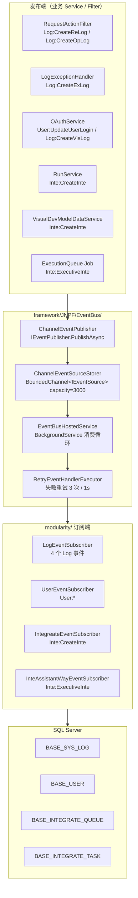
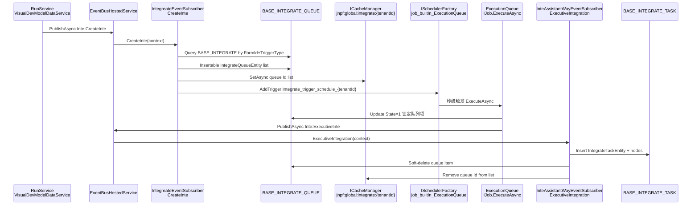
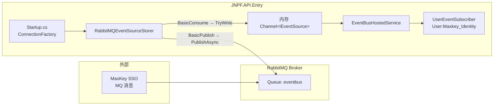

# 【专项文档08】JNPF v5.2 低代码平台 — 消息队列与事件机制深度解剖

> **适用版本**：JNPF v5.2  
> **后端源码仓库**：`d:\JNPF-v52\backend`  
> **文档编号**：v52-arch-08  
> **文档版本**：v2.0-final  
> **编写日期**：2026-05-24  
> **审核状态**：已审核通过（2026-05-24）  
> **编写依据**：v5.2 后端源码实测（`EventBus.json`、`Startup.cs`、EventBus 框架与 4 个 Subscriber）  
> **交叉引用**：[专项 01 §1.1 EventBus Memory](01-core-framework.md#11-技术栈版本实测)、[专项 07 缓存与集成助手 Key](07-cache-middleware-deep-dive.md)（§2.1 键清单、`jnpf:global:integrate:*`）

---

## 已知问题与注意事项

> **⚠️ v5.2 默认未启用传统 MQ**  
> 经源码分析，v5.2 默认未启用传统 MQ，使用 **Memory Channel EventBus**。`application/JNPF.API.Entry/Configurations/EventBus.json` 中 `EventBusType` 实测值为 `"Memory"`；`Startup.cs` L179 仅在 `EventBusType != Memory` 时才进入 RabbitMQ 分支。

> **⚠️ infrastructure RabbitMQ 包无源码**  
> `infrastructure/JNPF.Extras.EventBus.RabbitMQ/` 目录仅含 `.csproj`，引用 `RabbitMQ.Client` **6.4.0**，**无 `.cs` 实现文件**。实际 RabbitMQ 存储器实现在 `modularity/common/JNPF.Common.Core/EventBus/Storers/RabbitMQEventSourceStorer.cs`。

> **⚠️ EventBusType 枚举含 Redis/Kafka，但无实现**  
> `EventBusOptions.cs` 中 `EventBusType` 枚举定义 `Memory | RabbitMQ | Redis | Kafka`；`Startup.cs` 的 `switch` 仅处理 `RabbitMQ` 分支。项目中 **无 MassTransit、MediatR、Kafka 客户端** 引用（全仓库 grep 零命中）。

> **⚠️ TaskQueue ≠ EventBus**  
> `Startup.cs` L86 独立注册 `services.AddTaskQueue()`，与 `AddEventBus()`（L175）并行存在；二者均基于 `System.Threading.Channels`，但接口、HostedService、业务用途完全不同（见 §7）。

---

## 文档范围

本篇聚焦 v5.2 **进程内事件总线**、**可选 RabbitMQ 存储器**、**集成助手事件链**及 **TaskQueue 对比**。

| 纳入范围 | 排除范围 |
|----------|----------|
| `framework/JNPF/EventBus/` 内核 | MassTransit / MediatR（未引入） |
| 4 个 `IEventSubscriber` 实现与 8 个事件 Id | Kafka / Redis EventBus 后端（enum 占位） |
| 6 个发布点 + ExecutionQueue 调度桥接 | RabbitMQ 运维部署手册 |
| TaskQueue 与 EventBus 职责对比 | 前端 WebSocket 推送（见专项 01 §WebSocket） |

**v5.2 环境锚点**：

| 配置项 | 实测值 | 配置来源 |
|--------|--------|----------|
| EventBus 后端 | `Memory` | `Configurations/EventBus.json` → `EventBusType` |
| Channel 默认容量 | `3000` | `EventBusOptionsBuilder.ChannelCapacity` 默认值 |
| RabbitMQ 路由键 | `"eventbus"` | `Startup.cs` L198 `RabbitMQEventSourceStorer(factory, "eventbus", 3000)` |
| 集成助手缓存 Key | `jnpf:global:integrate:{tenantId}` | `CommonConst.INTEASSISTANT` + 租户 Id（与专项 07 对齐） |

---

## 第一章：v5.2 事件总线现状与架构定位

### 1.1 核心结论（源码锚定）

经源码分析，v5.2 **默认未启用传统 MQ**，使用 **Memory Channel EventBus**：

1. **配置层**：`EventBus.json` 中 `EventBusType: "Memory"`，RabbitMQ 连接字段（`HostName`/`UserName`/`Password`）存在但**不会被读取**。
2. **注册层**：`Startup.cs` → `services.AddEventBus(...)` 默认注入 `ChannelEventSourceStorer` + `ChannelEventPublisher`（`EventBusServiceCollectionExtensions.AddInternalService`）。
3. **运行层**：`EventBusHostedService` 作为 `BackgroundService` 循环从 `IEventSourceStorer.ReadAsync` 取事件，匹配 `[EventSubscribe("EventId")]` 标注的订阅方法并执行。
4. **可选 RabbitMQ**：仅当运维将 `EventBusType` 改为 `RabbitMQ` 时，`Startup.cs` L183–205 才创建 `RabbitMQEventSourceStorer` 并通过 `options.ReplaceStorer(...)` 替换默认存储器（详见 §6）。

**图1-1 v5.2 默认 EventBus 架构（场景 B：Memory Channel）**



| 组件 | 路径 | 职责 |
|------|------|------|
| `IEventPublisher` | `framework/JNPF/EventBus/Dependencies/IEventPublisher.cs` | 发布接口；默认实现 `ChannelEventPublisher` |
| `IEventSourceStorer` | `framework/JNPF/EventBus/Storers/IEventSourceStorer.cs` | 事件读写抽象；默认 `ChannelEventSourceStorer` |
| `IEventSubscriber` | `framework/JNPF/EventBus/Dependencies/IEventSubscriber.cs` | 订阅者标记接口；实现类由 DI 扫描注入 `EventBusHostedService` |
| `EventBusOptions` | `modularity/common/JNPF.Common.Core/EventBus/EventBusOptions.cs` | 绑定 `EventBus.json` |
| `RetryEventHandlerExecutor` | `modularity/common/JNPF.Common.Core/EventBus/RetryEventHandlerExecutor.cs` | `Startup` 注册；调用 `Retry.InvokeAsync(..., 3, 1000)` |

### 1.2 与专项 01 的关系

| 专项 01 条目 | 本篇对应 |
|--------------|----------|
| §1.1 技术栈 — EventBus 默认 **Memory** | 本章 §1.1 源码验证 |
| §7.1 缓存 Key — `jnpf:global:*` | 集成助手队列缓存 `jnpf:global:integrate:{tenantId}`（§5.2，与专项 07 对齐） |
| §7.2 日志 — `RequestActionFilter` → EventBus | §4.1 发布点详述 |

### 1.3 默认配置文件

```1:8:application/JNPF.API.Entry/Configurations/EventBus.json
{
  "EventBus": {
    "EventBusType": "Memory", //Memory,RabbitMQ,Redis
    "HostName": "192.168.0.232",
    "UserName": "jnpf",
    "Password": "jnpf@2019"
  }
}
```

> RabbitMQ 连接字段在 `EventBusType=Memory` 时**不参与运行时逻辑**；切换至 RabbitMQ 后 `HostName`/`UserName`/`Password` 才传入 `ConnectionFactory`（§6.2）。

### 本章小结

#### 本节核心表清单

| 表名 | 关联 |
|------|------|
| **BASE_SYS_LOG** | 4 个 `Log:*` 事件最终 INSERT 目标 |
| **BASE_USER** | `User:UpdateUserLogin` 更新登录字段 |

#### 本节关键代码路径索引

| 路径 | 说明 |
|------|------|
| `application/JNPF.API.Entry/Configurations/EventBus.json` | EventBusType 默认 Memory |
| `application/JNPF.API.Entry/Startup.cs` L174–216 | AddEventBus 注册 |
| `framework/JNPF/EventBus/Extensions/EventBusServiceCollectionExtensions.cs` | 默认 Storer/Publisher 注入 |
| `modularity/common/JNPF.Common.Core/EventBus/EventBusOptions.cs` | Options + EventBusType 枚举 |

---

## 第二章：框架层 EventBus 内核

### 2.1 发布链路：ChannelEventPublisher

`ChannelEventPublisher.PublishAsync(IEventSource)` 将事件写入 `IEventSourceStorer`，不直接调用订阅者——解耦发布与消费。

```27:30:framework/JNPF/EventBus/Internal/ChannelEventPublisher.cs
    public async Task PublishAsync(IEventSource eventSource)
    {
        await _eventSourceStorer.WriteAsync(eventSource, eventSource.CancellationToken);
    }
```

`EventBusServiceCollectionExtensions.AddInternalService` 注册单例：

- `IEventSourceStorer` → `ChannelEventSourceStorer(ChannelCapacity)`，默认容量 **3000**
- `IEventPublisher` → `ChannelEventPublisher`

### 2.2 存储层：ChannelEventSourceStorer

基于 `System.Threading.Channels.BoundedChannel<IEventSource>`，超出容量时 `FullMode.Wait` 阻塞写入。

```23:33:framework/JNPF/EventBus/Storers/ChannelEventSourceStorer.cs
    public ChannelEventSourceStorer(int capacity)
    {
        // 配置通道，设置超出默认容量后进入等待
        var boundedChannelOptions = new BoundedChannelOptions(capacity)
        {
            FullMode = BoundedChannelFullMode.Wait
        };

        // 创建有限容量通道
        _channel = Channel.CreateBounded<IEventSource>(boundedChannelOptions);
    }
```

#### 2.2.1 Channel 容量配置与修改方式

`ChannelCapacity` **不在** `EventBus.json` 中，由 `EventBusOptionsBuilder.ChannelCapacity` 控制（默认 **3000**）。修改方式：在 `application/JNPF.API.Entry/Startup.cs` 的 `AddEventBus` 委托中赋值：

```csharp
services.AddEventBus(options =>
{
    options.ChannelCapacity = 10000; // 示例：扩大待处理队列
    // ... 现有 RabbitMQ 门控、LogEnabled、RetryEventHandlerExecutor
});
```

**语义**：3000 为 Channel **积压上限**（待消费事件条数），非每秒吞吐。`FullMode.Wait` 下队列满时 `PublishAsync` 阻塞等待（详见 §8.4.1）。

### 2.3 消费层：EventBusHostedService

`EventBusHostedService` 在构造函数中扫描所有 `IEventSubscriber` 实现，反射获取贴有 `[EventSubscribe]` 的方法，包装为 `EventHandlerWrapper` 存入 `ConcurrentDictionary`。

消费主循环（`BackgroundProcessing`）：

1. `await _eventSourceStorer.ReadAsync(stoppingToken)` 阻塞读取
2. 按 `EventId` 匹配 `_eventHandlers`（支持 Order 排序、FuzzyMatch 正则）
3. 经 `IEventHandlerExecutor`（默认 `RetryEventHandlerExecutor`）执行订阅方法
4. 可选 GC 回收（`GCCollect` 配置项）

```157:183:framework/JNPF/EventBus/HostedServices/EventBusHostedService.cs
    protected async override Task ExecuteAsync(CancellationToken stoppingToken)
    {
        Log(LogLevel.Information, "EventBus hosted service is running.");
        // ...
        while (!stoppingToken.IsCancellationRequested)
        {
            await BackgroundProcessing(stoppingToken);
        }
    }

    private async Task BackgroundProcessing(CancellationToken stoppingToken)
    {
        // 从事件存储器中读取一条
        var eventSource = await _eventSourceStorer.ReadAsync(stoppingToken);
        // ...
    }
```

### 2.4 失败重试：RetryEventHandlerExecutor

```11:19:modularity/common/JNPF.Common.Core/EventBus/RetryEventHandlerExecutor.cs
    public async Task ExecuteAsync(EventHandlerExecutingContext context, Func<EventHandlerExecutingContext, Task> handler)
    {
        // 如果执行失败，每隔 1s 重试，最多三次
        await Retry.InvokeAsync(
            async () =>
        {
            await handler(context);
        }, 3, 1000);
    }
```

### 2.5 MessageCenter 静态入口

`framework/JNPF/EventBus/MessageCenter.cs` 提供 `MessageCenter.PublishAsync(...)` 静态方法，内部 `App.GetRequiredService<IEventPublisher>()`。业务代码普遍通过构造函数注入 `IEventPublisher`，而非 MessageCenter。

### 本章小结

#### 本节核心表清单

本章为纯框架机制，不直接落库。

#### 本节关键代码路径索引

| 路径 | 说明 |
|------|------|
| `framework/JNPF/EventBus/Internal/ChannelEventPublisher.cs` | 默认发布者 |
| `framework/JNPF/EventBus/Storers/ChannelEventSourceStorer.cs` | 默认 Memory 存储 |
| `framework/JNPF/EventBus/HostedServices/EventBusHostedService.cs` | 后台消费 + 订阅扫描 |
| `framework/JNPF/EventBus/Builders/EventBusOptionsBuilder.cs` | ChannelCapacity=3000 |
| `framework/JNPF/EventBus/MessageCenter.cs` | 静态 Publish 入口 |

---

## 第三章：事件清单与订阅者

### 3.1 完整事件清单（8 个 EventId）

**表3-1 v5.2 EventBus 事件全量清单**

| # | EventId | 事件源类型 | 订阅者 | 订阅方法 | 落库/副作用 |
|---|---------|-----------|--------|----------|-------------|
| 1 | `Log:CreateReLog` | `LogEventSource` | `LogEventSubscriber` | `CreateLog` | INSERT **BASE_SYS_LOG**（Type=5 请求日志） |
| 2 | `Log:CreateExLog` | `LogEventSource` | `LogEventSubscriber` | `CreateLog` | INSERT **BASE_SYS_LOG**（Type=4 异常日志） |
| 3 | `Log:CreateVisLog` | `LogEventSource` | `LogEventSubscriber` | `CreateLog` | INSERT **BASE_SYS_LOG**（Type=1 登录日志） |
| 4 | `Log:CreateOpLog` | `LogEventSource` | `LogEventSubscriber` | `CreateLog` | INSERT **BASE_SYS_LOG**（Type=3 操作日志） |
| 5 | `User:UpdateUserLogin` | `UserEventSource` | `UserEventSubscriber` | `UpdateUserLoginInfo` | UPDATE **BASE_USER** 登录字段 |
| 6 | `User:Maxkey_Identity` | `ChannelEventSource`（外部 MQ） | `UserEventSubscriber` | `ReceiveUserInfo` | INSERT/UPDATE **BASE_USER**（MaxKey SSO 同步） |
| 7 | `Inte:CreateInte` | `InteEventSource` | `IntegreateEventSubscriber` | `CreateInte` | INSERT **BASE_INTEGRATE_QUEUE** + 缓存 + 调度触发器 |
| 8 | `Inte:ExecutiveInte` | `InteAssistantWayEventSource` | `InteAssistantWayEventSubscriber` | `ExecutiveIntegration` | INSERT **BASE_INTEGRATE_TASK** + 软删队列项 |

> `User:Maxkey_Identity` **仅在外部 MQ 模式有意义**：`RabbitMQEventSourceStorer` 收到无 `EventId` 的消息时，自动映射为该 EventId（§6.3）。Memory 模式下无发布点。

### 3.2 四个订阅者类

| 订阅者 | 命名空间 | 路径 | 实现接口 |
|--------|----------|------|----------|
| `LogEventSubscriber` | `JNPF.EventHandler` | `modularity/common/JNPF.Common.Core/EventBus/LogEventSubscriber.cs` | `IEventSubscriber, ISingleton` |
| `UserEventSubscriber` | `JNPF.EventHandler` | `modularity/common/JNPF.Common.Core/EventBus/UserEventSubscriber.cs` | `IEventSubscriber, ISingleton` |
| `IntegreateEventSubscriber` | `JNPF.EventHandler` | `modularity/common/JNPF.Common.Core/EventBus/IntegreateEventSubscriber.cs` | `IEventSubscriber, ISingleton, IDisposable` |
| `InteAssistantWayEventSubscriber` | `JNPF.InteAssistant.Engine` | `modularity/inteAssistant/JNPF.InteAssistant.Engine/InteAssistantWayEventSubscriber.cs` | `IEventSubscriber, ISingleton, IDisposable` |

`LogEventSubscriber.CreateLog` 四事件合一处理：

```45:59:modularity/common/JNPF.Common.Core/EventBus/LogEventSubscriber.cs
    [EventSubscribe("Log:CreateReLog")]
    [EventSubscribe("Log:CreateExLog")]
    [EventSubscribe("Log:CreateVisLog")]
    [EventSubscribe("Log:CreateOpLog")]
    public async Task CreateLog(EventHandlerExecutingContext context)
    {
        var log = (LogEventSource)context.Source;
         
        if (log.TenantId.IsNotEmptyOrNull())
        {
            await _tenantManager.ChangTenant(_sqlSugarClient, log.TenantId);
        }

        await _sqlSugarClient.CopyNew().Insertable(log.Entity).IgnoreColumns(ignoreNullColumn: true).ExecuteCommandAsync();
    }
```

### 3.3 事件源（EventSource）类型

| 类 | 路径 | 关键字段 |
|----|------|----------|
| `LogEventSource` | `.../Sources/LogEventSource.cs` | `TenantId`, `Entity: SysLogEntity` |
| `UserEventSource` | `.../Sources/UserEventSource.cs` | `TenantId`, `Entity: UserEntity` |
| `InteEventSource` | `.../Sources/InteEventSource.cs` | `UserId`, `TenantId`, `Model: InteAssiEventModel` |
| `InteAssistantWayEventSource` | `.../Sources/InteAssistantWayEventSource.cs` | `TenantId`, `QueueId` |

### 本章小结

#### 本节核心表清单

| 表名 | 关键字段 |
|------|----------|
| **BASE_SYS_LOG** | F_Id, F_User_Id, F_Type（1登录/3操作/4异常/5请求）, F_Request_URL, F_Json |
| **BASE_USER** | F_Id, F_LastLogTime, F_LastLogIP, F_LogSuccessCount, F_FirstLogTime |
| **BASE_INTEGRATE** | F_Id, F_FormId, F_TriggerType, F_Type, F_TemplateJson, F_EnabledMark |
| **BASE_INTEGRATE_QUEUE** | F_Id, F_IntegrateId, F_State（0等待/1执行中）, F_Description |
| **BASE_INTEGRATE_TASK** | F_Id, F_IntegrateId, F_Data, F_TemplateJson, F_ResultType |

#### 本节关键代码路径索引

| 路径 | 说明 |
|------|------|
| `modularity/common/JNPF.Common.Core/EventBus/LogEventSubscriber.cs` | 日志四事件 |
| `modularity/common/JNPF.Common.Core/EventBus/UserEventSubscriber.cs` | 用户登录 + MaxKey |
| `modularity/common/JNPF.Common.Core/EventBus/IntegreateEventSubscriber.cs` | 集成触发 |
| `modularity/inteAssistant/JNPF.InteAssistant.Engine/InteAssistantWayEventSubscriber.cs` | 集成执行 |

---

## 第四章：发布点全景

### 4.1 日志类发布点

#### 4.1.1 RequestActionFilter — 请求日志 + 操作日志

注册：`Startup.cs` L97 → `.AddMvcFilter<RequestActionFilter>()`。

| 事件 | 触发条件 | Type 值 |
|------|----------|---------|
| `Log:CreateReLog` | 每个未被 `[IgnoreLogAttribute]` 标记的 Action 执行完毕 | 5 |
| `Log:CreateOpLog` | 额外贴有 `[OperateLogAttribute]` 的 Action | 3 |

```76:93:modularity/common/JNPF.Common.Core/Filter/RequestActionFilter.cs
                await _eventPublisher.PublishAsync(new LogEventSource("Log:CreateReLog", tenantId, new SysLogEntity
                {
                    Id = SnowflakeIdHelper.NextId(),
                    UserId = userId,
                    UserName = string.Format("{0}/{1}", userName, userAccount),
                    Type = 5,
                    IPAddress = ipAddress,
                    // ...
                    RequestTarget = context.ActionDescriptor.DisplayName,
                    Json = result?.ToJsonString()
                }));
```

#### 4.1.2 LogExceptionHandler — 异常日志

注册：`LogExceptionHandler : IGlobalExceptionHandler, ISingleton`（框架 FriendlyException 管道自动发现）。

```51:65:modularity/common/JNPF.Common.Core/Filter/LogExceptionHandler.cs
            await _eventPublisher.PublishAsync(new LogEventSource("Log:CreateExLog", tenantId, new SysLogEntity
            {
                Id = SnowflakeIdHelper.NextId(),
                // ...
                Type = 4,
                Json = context.Exception.Message + "\n" + context.Exception.StackTrace + "\n" + context.Exception.TargetSite.GetParameters().ToString(),
                CreatorTime = DateTime.Now
            }));
```

#### 4.1.3 OAuthService — 登录日志 + 用户登录信息

| 事件 | 方法 | 说明 |
|------|------|------|
| `User:UpdateUserLogin` | `Login` 成功分支 L950 | 更新 **BASE_USER** 首/末登录 IP、时间、成功次数 |
| `Log:CreateVisLog` | `AddLoginLog` L1379 | 写入登录审计（Type=1） |

```950:960:modularity/oauth/JNPF.OAuth/OAuthService.cs
            await _eventPublisher.PublishAsync(new UserEventSource("User:UpdateUserLogin", tenantId, new UserEntity
            {
                Id = user.Id,
                FirstLogIP = user.FirstLogIP ?? ip,
                FirstLogTime = user.FirstLogTime ?? DateTime.Now,
                PrevLogTime = user.LastLogTime,
                PrevLogIP = user.LastLogIP,
                LastLogTime = DateTime.Now,
                LastLogIP = ip,
                LogSuccessCount = user.LogSuccessCount + 1
            }));
```

### 4.2 集成助手发布点

#### 4.2.1 RunService — 低代码运行时 CRUD 触发

路径：`modularity/visualdev/JNPF.VisualDev/RunService.cs`

| TriggerType | 业务操作 | 行号（约） |
|-------------|----------|-----------|
| 1 | 新增（CreateHaveTableSql 事务提交前） | L765 |
| 2 | 修改（Update 事务提交前） | L1036 |
| 3 | 删除 | L1851 |
| 5 | 批量删除 | L2007 |

触发条件：`dataInput.isInteAssis == true`（新增/修改/批量删）或删除流程无条件发布。

```765:771:modularity/visualdev/JNPF.VisualDev/RunService.cs
                await _eventPublisher.PublishAsync(new InteEventSource("Inte:CreateInte", _userManager.UserId, _userManager.TenantId, new InteAssiEventModel
                {
                    ModelId = templateEntity.Id,
                    Data = dataInput.data,
                    DataId = mainId,
                    TriggerType = 1,
                }));
```

#### 4.2.2 VisualDevModelDataService — 导入批量触发

路径：`modularity/visualdev/JNPF.VisualDev/VisualDevModelDataService.cs` L1360

- `TriggerType = 4`（批量新增/导入）
- `input.isInteAssis == true`

#### 4.2.3 ExecutionQueue — 调度 Job 桥接（非 taskscheduler 直发 EventBus）

**关键设计**：`taskscheduler` 模块的 `ScheduleService` **不直接**调用 `IEventPublisher`。集成助手执行链路由内置 Job `ExecutionQueue` 间接发布 `Inte:ExecutiveInte`。

| 项 | 值 |
|----|-----|
| JobDetail Id | `job_builtIn_ExecutionQueue` |
| 类 | `modularity/inteAssistant/JNPF.InteAssistant.Engine/ExecutionQueue.cs` |
| 触发器 Id 模式 | `Integrate_trigger_schedule_{tenantId}` |
| 发布事件 | `Inte:ExecutiveInte` |

```108:119:modularity/inteAssistant/JNPF.InteAssistant.Engine/ExecutionQueue.cs
            if (result)
            {
                var triggerId = string.Format("Integrate_trigger_schedule_{0}", tenantId);
                var scheduleResult = _schedulerFactory.TryGetJob("job_builtIn_ExecutionQueue", out var scheduler);
                // 先暂停触发器
                scheduler.PauseTrigger(triggerId);
                // 添加集成助手 任务方法 订阅
                await _eventPublisher.PublishAsync(new InteAssistantWayEventSource("Inte:ExecutiveInte", tenantId, entity.Id));
            }
```

### 4.3 发布点汇总表

**表4-1 发布点 → 事件映射**

| 发布类 | 路径 | 注入字段 | 发布事件 |
|--------|------|----------|----------|
| `RequestActionFilter` | `modularity/common/JNPF.Common.Core/Filter/RequestActionFilter.cs` | `IEventPublisher _eventPublisher` | `Log:CreateReLog`, `Log:CreateOpLog` |
| `LogExceptionHandler` | `modularity/common/JNPF.Common.Core/Filter/LogExceptionHandler.cs` | `IEventPublisher _eventPublisher` | `Log:CreateExLog` |
| `OAuthService` | `modularity/oauth/JNPF.OAuth/OAuthService.cs` | `IEventPublisher _eventPublisher` | `User:UpdateUserLogin`, `Log:CreateVisLog` |
| `RunService` | `modularity/visualdev/JNPF.VisualDev/RunService.cs` | `IEventPublisher _eventPublisher` | `Inte:CreateInte`（TriggerType 1/2/3/5） |
| `VisualDevModelDataService` | `modularity/visualdev/JNPF.VisualDev/VisualDevModelDataService.cs` | `IEventPublisher _eventPublisher` | `Inte:CreateInte`（TriggerType 4） |
| `ExecutionQueue` | `modularity/inteAssistant/JNPF.InteAssistant.Engine/ExecutionQueue.cs` | `IEventPublisher _eventPublisher` | `Inte:ExecutiveInte` |

### 本章小结

#### 本节核心表清单

| 表名 | 写入路径 |
|------|----------|
| **BASE_SYS_LOG** | LogEventSubscriber ← 3 个 Filter/Service 发布点 |
| **BASE_USER** | UserEventSubscriber ← OAuthService |
| **BASE_INTEGRATE_QUEUE** | IntegreateEventSubscriber ← RunService / VisualDevModelDataService |

#### 本节关键代码路径索引

| 路径 | 说明 |
|------|------|
| `modularity/common/JNPF.Common.Core/Filter/RequestActionFilter.cs` | MVC Filter 请求/操作日志 |
| `modularity/common/JNPF.Common.Core/Filter/LogExceptionHandler.cs` | 全局异常日志 |
| `modularity/oauth/JNPF.OAuth/OAuthService.cs` | 登录日志 + 用户登录字段 |
| `modularity/visualdev/JNPF.VisualDev/RunService.cs` | 低代码 CRUD 集成触发 |
| `modularity/visualdev/JNPF.VisualDev/VisualDevModelDataService.cs` | 导入集成触发 |
| `modularity/inteAssistant/JNPF.InteAssistant.Engine/ExecutionQueue.cs` | Schedule Job → EventBus 桥接 |

---

## 第五章：集成助手事件链（Inte:CreateInte → Inte:ExecutiveInte）

### 5.1 端到端流程

**图5-1 Inte:CreateInte 事件链 sequenceDiagram**



### 5.2 缓存 Key 与专项 07 交叉引用

集成助手队列 Id 列表缓存于：

```
Key = "{CommonConst.INTEASSISTANT}:{tenantId}"
    = "jnpf:global:integrate:{tenantId}"
```

| 操作 | 类 | 方法 | 说明 |
|------|-----|------|------|
| 写入 | `IntegreateEventSubscriber` | `CreateInte` L240–244 | 队列 INSERT 成功后追加 Id |
| 读取 | `ExecutionQueue` | `ExecuteAsync` L87–88 | 过滤待执行队列 |
| 校验 | `InteAssistantWayEventSubscriber` | `ExecutiveIntegration` L89 | 要求 Id 同时在 DB 与缓存中 |
| 移除 | `InteAssistantWayEventSubscriber` | L148–149 | 执行完成后 RemoveAll |

> 完整 Redis/MemoryCache 切换与 Key 命名规范见 **[专项 07 缓存中间件深度解剖](07-cache-middleware-deep-dive.md)** §2.1 及 **[专项 01 §7.1](01-core-framework.md#71-redis-封装层分析)**。

### 5.3 IntegreateEventSubscriber.CreateInte 核心逻辑

1. 按 `InteAssiEventModel.TriggerType` 与 `ModelId`（FormId）查询 **BASE_INTEGRATE** 中 `Type=1`（事件触发）、`EnabledMark=1`、未删除记录。
2. 按触发类型（新增/修改/删除/批量/规则匹配）构建 `IntegrateQueueEntity` 列表。
3. `Insertable(inteQueueList)` 写入 **BASE_INTEGRATE_QUEUE**。
4. 写入缓存 Key `jnpf:global:integrate:{tenantId}`。
5. 向内置 Job `job_builtIn_ExecutionQueue` 动态添加/启动触发器 `Integrate_trigger_schedule_{tenantId}`（秒级 `AlterToSecondly()`）。

### 5.4 ExecutionQueue 与 Schedule 的关系

| 问题 | 答案 |
|------|------|
| taskscheduler 是否直接 Publish EventBus？ | **否**。`ScheduleService` 使用 `ITaskQueue` 做异步任务（§7），与 EventBus 无关 |
| 谁发布 `Inte:ExecutiveInte`？ | 仅 `ExecutionQueue.ExecuteAsync` |
| Job 如何被激活？ | `IntegreateEventSubscriber` 动态 `AddTrigger`；`IntegrateTiming` / `WebHookService` 亦可启动同一触发器 |
| 并发控制 | `[JobDetail(..., Concurrent = false)]` + 执行前 `PauseTrigger` |

### 5.5 InteAssistantWayEventSubscriber 执行逻辑

`ExecutiveIntegration` 在缓存与 DB 双重校验通过后：

1. 读取 **BASE_INTEGRATE_QUEUE** + **BASE_INTEGRATE** 模板
2. 调用 `InteAssistantRun.InteAssiTaskOutline` / `GetIntegrateNodeList` 组装节点
3. INSERT **BASE_INTEGRATE_TASK** 及节点表
4. 软删除队列项（`DeleteMark=1`）
5. 更新缓存；若队列空则 `RemoveTrigger`

### 本章小结

#### 本节核心表清单

| 表名 | 关键字段 |
|------|----------|
| **BASE_INTEGRATE** | F_FormId, F_TriggerType, F_Type, F_TemplateJson |
| **BASE_INTEGRATE_QUEUE** | F_IntegrateId, F_State, F_Description（JSON 载荷） |
| **BASE_INTEGRATE_TASK** | F_IntegrateId, F_Data, F_ProcessId, F_ResultType |

#### 本节关键代码路径索引

| 路径 | 说明 |
|------|------|
| `modularity/common/JNPF.Common.Core/EventBus/IntegreateEventSubscriber.cs` | Inte:CreateInte 订阅 |
| `modularity/inteAssistant/JNPF.InteAssistant.Engine/ExecutionQueue.cs` | Schedule → Inte:ExecutiveInte |
| `modularity/inteAssistant/JNPF.InteAssistant.Engine/InteAssistantWayEventSubscriber.cs` | 集成任务实例化 |
| `modularity/common/JNPF.Common/Const/CommonConst.cs` | INTEASSISTANT Key 常量 |

---

## 第六章：可选 RabbitMQ 路径（默认未启用）

### 6.1 状态说明

v5.2 **默认配置下 RabbitMQ 未启用**。本章描述 `EventBusType=RabbitMQ` 时的代码路径，供分布式部署或 MaxKey SSO 外部消息接入参考。

**图6-1 可选 RabbitMQ EventBus 路径**



### 6.2 Startup.cs 注册分支

```174:216:application/JNPF.API.Entry/Startup.cs
        // 注册EventBus服务
        services.AddEventBus(options =>
        {
            var config = App.GetOptions<EventBusOptions>();

            if (config.EventBusType != EventBusType.Memory)
            {
                switch (config.EventBusType)
                {
                    case EventBusType.RabbitMQ:
                        var factory = new RabbitMQ.Client.ConnectionFactory
                        {
                            HostName = config.HostName,
                            UserName = config.UserName,
                            Password = config.Password,
                        };
                        var rbmqEventSourceStorer = new RabbitMQEventSourceStorer(factory, "eventbus", 3000);
                        options.ReplaceStorer(serviceProvider =>
                        {
                            return rbmqEventSourceStorer;
                        });
                        break;
                }
            }

            options.UseUtcTimestamp = false;
            options.LogEnabled = true;
            options.AddExecutor<RetryEventHandlerExecutor>();
        });
```

> `EventBusType.Redis` / `EventBusType.Kafka`：**无 case 分支**，行为等同 Memory 默认 Storer。

### 6.3 RabbitMQEventSourceStorer 双工设计

路径：`modularity/common/JNPF.Common.Core/EventBus/Storers/RabbitMQEventSourceStorer.cs`

| 方向 | 机制 |
|------|------|
| **消费（入站）** | `BasicConsume` → 反序列化 `ChannelEventSource` → `_channel.Writer.TryWrite` → 仍由 `EventBusHostedService` 消费 |
| **发布（出站）** | `ChannelEventSource` → `JsonSerializer.Serialize` → `BasicPublish` 至队列 `eventbus` |
| **MaxKey 映射** | 若反序列化后 `EventId` 为空 → 强制 `User:Maxkey_Identity`，Payload 为原始 JSON 字符串 |

```88:106:modularity/common/JNPF.Common.Core/EventBus/Storers/RabbitMQEventSourceStorer.cs
        consumer.Received += (ch, ea) =>
        {
            var stringEventSource = Encoding.UTF8.GetString(ea.Body.ToArray());
            var eventSource = JsonSerializer.Deserialize<ChannelEventSource>(stringEventSource);

            // 判断到是单点登录服务端信息
            if (eventSource.EventId.IsNullOrEmpty()) eventSource = new ChannelEventSource("User:Maxkey_Identity", stringEventSource);

            // 写入内存管道存储器
            _channel.Writer.TryWrite(eventSource);
            _model.BasicAck(ea.DeliveryTag, false);
        };
```

### 6.4 infrastructure 包说明

```1:11:infrastructure/JNPF.Extras.EventBus.RabbitMQ/JNPF.Extras.EventBus.RabbitMQ.csproj
<Project Sdk="Microsoft.NET.Sdk">
	<PropertyGroup>
		<Description>JNPF 事件总线 RabbitMQ 插件。</Description>
	</PropertyGroup>
	<ItemGroup>
		<PackageReference Include="RabbitMQ.Client" Version="6.4.0" />
	</ItemGroup>
</Project>
```

该包**仅锁定 NuGet 版本**；`RabbitMQ.Client` 类型引用实际发生在 `JNPF.Common.Core` 的 `RabbitMQEventSourceStorer.cs` 中。

### 6.5 切换清单（运维）

| 步骤 | 操作 |
|------|------|
| 1 | 部署 RabbitMQ 并创建可访问 vhost/用户 |
| 2 | 修改 `EventBus.json` → `"EventBusType": "RabbitMQ"`，填写连接信息 |
| 3 | 重启 `JNPF.API.Entry` |
| 4 | 验证 `EventBusHostedService` 日志 + 测试 `User:Maxkey_Identity` 或业务 Publish |

### 本章小结

#### 本节核心表清单

| 表名 | RabbitMQ 关联 |
|------|-----------------|
| **BASE_USER** | `User:Maxkey_Identity` → CREATE/UPDATE/DELETE/PASSWORD 同步 |
| **BASE_SYS_CONFIG** | 新用户默认密码 `newUserDefaultPassword`（CREATE_ACTION 时使用） |

#### 本节关键代码路径索引

| 路径 | 说明 |
|------|------|
| `application/JNPF.API.Entry/Startup.cs` L174–216 | RabbitMQ 条件注册 |
| `modularity/common/JNPF.Common.Core/EventBus/Storers/RabbitMQEventSourceStorer.cs` | 唯一 RabbitMQ 实现 |
| `infrastructure/JNPF.Extras.EventBus.RabbitMQ/JNPF.Extras.EventBus.RabbitMQ.csproj` | 仅 PackageReference |
| `modularity/common/JNPF.Common.Core/EventBus/UserEventSubscriber.cs` | MaxKey 消费逻辑 |

---

## 第七章：TaskQueue 与 EventBus 对比

### 7.1 并行注册

`Startup.cs` 同时注册两套 Channel 基础设施：

```85:89:application/JNPF.API.Entry/Startup.cs
        // 任务队列
        services.AddTaskQueue();

        // 任务调度
        services.AddSchedule(options => options.AddPersistence<DbJobPersistence>());
```

二者**不共享** Channel 实例、接口或 HostedService。

### 7.2 架构对比

**表7-1 TaskQueue vs EventBus**

| 维度 | EventBus | TaskQueue |
|------|----------|-----------|
| 命名空间 | `JNPF.EventBus` | `JNPF.TaskQueue` |
| 核心接口 | `IEventPublisher` / `IEventSubscriber` | `ITaskQueue` |
| 消息模型 | `IEventSource` + EventId 路由 | `TaskWrapper` + `Action<IServiceProvider>` 委托 |
| 消费者 | `EventBusHostedService` — 反射匹配 `[EventSubscribe]` | `TaskQueueHostedService` — 直接执行委托 |
| 典型用途 | 日志异步落库、集成助手、用户登录更新 | 工作流异步、Schedule 后台任务、延迟执行 |
| 失败策略 | `RetryEventHandlerExecutor`（3 次/1s） | 委托内自行处理 |
| 业务发布 | Filter/Service 注入 `IEventPublisher` | `TaskQueued.Enqueue` 或注入 `ITaskQueue` |

### 7.3 TaskQueue 内核

```44:56:framework/JNPF/TaskQueue/Dependencies/TaskQueue.cs
    public Guid Enqueue(Action<IServiceProvider> taskHandler, int delay = 0, string channel = null)
    {
        if (taskHandler == default)
        {
            throw new ArgumentNullException(nameof(taskHandler));
        }
        return EnqueueAsync((serviceProvider, token) =>
        {
            taskHandler(serviceProvider);
            return ValueTask.CompletedTask;
        }, delay, channel)
        .AsTask().GetAwaiter().GetResult();
    }
```

已知 `ITaskQueue` 注入使用方：

| 类 | 路径 | 用途 |
|----|------|------|
| `ScheduleService` | `modularity/system/JNPF.Systems/System/ScheduleService.cs` | 调度任务异步执行 |
| `FlowTaskManager` | `modularity/workflow/JNPF.WorkFlow/Manager/FlowTaskManager.cs` | 工作流异步处理 |

> **集成助手执行链不走 TaskQueue**，而走 Schedule Job（`ExecutionQueue`）+ EventBus（`Inte:ExecutiveInte`）。

### 7.4 选型建议（二次开发）

| 场景 | 推荐机制 |
|------|----------|
| 多订阅者广播、事件 Id 路由 | EventBus + `[EventSubscribe]` |
| 单任务后台执行、需 DI Scope | TaskQueue.EnqueueAsync |
| 定时/持久化调度 | `AddSchedule` + `IJob`（如 ExecutionQueue） |
| 跨进程/跨实例 | EventBus + RabbitMQ Storer（需改配置） |

### 本章小结

#### 本节核心表清单

TaskQueue 本身不绑定固定表；调用方决定落库目标（如工作流 **BASE_WORKFLOW** 相关表）。

#### 本节关键代码路径索引

| 路径 | 说明 |
|------|------|
| `framework/JNPF/TaskQueue/Dependencies/TaskQueue.cs` | Channel 实现 |
| `framework/JNPF/TaskQueue/HostedServices/TaskQueuedHostedService.cs` | 后台消费 |
| `framework/JNPF/TaskQueue/TaskQueued.cs` | 静态 Enqueue 入口 |
| `modularity/system/JNPF.Systems/System/ScheduleService.cs` | TaskQueue 业务使用示例 |

---

## 第八章：二次开发与扩展点

### 8.1 新增自定义事件（标准步骤）

1. **定义 EventSource** — 实现 `IEventSource`，放 `modularity/common/JNPF.Common.Core/EventBus/Sources/` 或业务模块。
2. **定义 Subscriber** — 类实现 `IEventSubscriber, ISingleton`，方法贴 `[EventSubscribe("Your:EventId")]`。
3. **发布** — 在 Service/Filter 构造函数注入 `IEventPublisher`，调用 `PublishAsync(new YourEventSource(...))`。
4. **验证** — 见 §8.1.1 EventBus 日志查看方式；失败时 `RetryEventHandlerExecutor` 自动重试 3 次。

#### 8.1.1 EventBus 日志查看方式

`Startup.cs` L212 设置 `options.LogEnabled = true`，日志经 ASP.NET Core 标准 `ILogger<EventBusService>` 输出（分类名 **`EventBusService`**，`framework/JNPF/EventBus/Internal/Logging.cs`），**无独立 EventBus 日志文件**——落点取决于宿主 Serilog/Console 配置（与 API 主日志相同管道）。

| 级别 | 典型消息 | 含义 |
|------|----------|------|
| Information | `EventBus hosted service is running.` | 后台消费服务启动 |
| Warning | `Subscriber with event ID <{EventId}> was not found.` | 发布了无订阅者的事件 |
| Warning | `Retrying {times}/{total} times for {EventId}` | `RetryEventHandlerExecutor` 重试中 |
| Error | `Error occurred executing in {EventId}.` | 订阅方法抛异常（含堆栈） |

排查步骤：在 Serilog/Console 日志配置中确保 `EventBusService` 分类或默认 `Information` 级别可见（日志管道见 [01-core-framework.md §7](01-core-framework.md)）→ 复现发布 → 在 Console 或 `logs/` 目录检索上述关键字。

### 8.2 替换 EventBus 存储器

```csharp
services.AddEventBus(options =>
{
    options.ReplaceStorer(_ => new YourCustomStorer(capacity));
});
```

`IEventSourceStorer` 契约：`WriteAsync` + `ReadAsync`（`framework/JNPF/EventBus/Storers/IEventSourceStorer.cs`）。

### 8.3 已知局限

| 局限 | 说明 |
|------|------|
| Memory 模式无持久化 | 进程崩溃时 Channel 内未消费事件丢失 |
| 无 Outbox 模式 | 业务事务与事件发布非原子；集成场景依赖 Retry + 队列 State 防重 |
| Redis/Kafka enum 占位 | 切换无效，需自行实现 `IEventSourceStorer` 并 `ReplaceStorer` |
| LogEventSubscriber 静态 SqlSugar | 见 §8.3.1 — `ChangTenant` 作用于共享 `SqlSugarScope`，INSERT 经 `CopyNew()` 隔离 |

#### 8.3.1 LogEventSubscriber 多租户与 CopyNew（已确认）

```49:59:modularity/common/JNPF.Common.Core/EventBus/LogEventSubscriber.cs
    public async Task CreateLog(EventHandlerExecutingContext context)
    {
        var log = (LogEventSource)context.Source;
        if (log.TenantId.IsNotEmptyOrNull())
        {
            await _tenantManager.ChangTenant(_sqlSugarClient, log.TenantId);
        }
        await _sqlSugarClient.CopyNew().Insertable(log.Entity).IgnoreColumns(ignoreNullColumn: true).ExecuteCommandAsync();
    }
```

- **`CopyNew()` 作用**：SqlSugar 从当前 `SqlSugarScope` **克隆出独立 `SqlSugarClient` 实例**（独立连接上下文），`Insertable` 在克隆客户端上执行，**不共享** Scope 上的当前连接状态。
- **`ChangTenant` 风险**：`_sqlSugarClient` 为 **static** 共享 Scope；`EventBusHostedService` 对 Handler 使用 `Parallel.ForEach` + `TaskFactory.StartNew`（L226–327），**不同事件的处理可能并发**。多租户日志同时消费时，`ChangTenant(_sqlSugarClient, tenantId)` 可能在 INSERT 前**竞态修改**共享 Scope 的租户连接。
- **v5.2 实测影响**：常规负载下日志写入以单租户 burst 为主，问题不易暴露；**高并发多租户**场景建议二次开发改为：在 `CreateLog` 内全程使用 `_sqlSugarClient.CopyNew()` 后再 `ChangTenant(copy, tenantId)`，避免 static Scope 共享。

### 8.4 性能注意

#### 8.4.1 Channel 容量与 HTTP 阻塞（已确认）

| 环节 | 行为 | 源码 |
|------|------|------|
| 发布 | `RequestActionFilter` **await** `PublishAsync`（L76、L100） | 请求线程等待写入 Channel |
| 队列满 | `BoundedChannelFullMode.Wait` → `WriteAsync` 阻塞直至有空位 | `ChannelEventSourceStorer` L26–28、L50 |
| 消费 | `EventBusHostedService` 单循环 `ReadAsync` → 分发 Handler | L166–169、L183 |

- **3000 含义**：待处理事件**积压上限**，非「每秒 3000」吞吐指标。消费慢于生产时积压增长，满 3000 后**所有** `await PublishAsync` 的 HTTP 请求（含日志）将**同步等待**，API 响应延迟上升。
- **v5.2 生产评估**：常规企业 OA 并发下不易持续打满 3000；集成助手 burst（`Inte:CreateInte`）+ 全量请求日志同时高峰时需关注。
- **建议**：监控 Channel 积压（可通过日志延迟、API P99 间接判断）；高并发部署在 `Startup.AddEventBus` 中增大 `options.ChannelCapacity`（§2.2.1），或降低日志发布频率（`[IgnoreLog]` 已用于部分接口）。

#### 8.4.2 集成助手 CreateInte 与消费延迟（已确认）

`IntegreateEventSubscriber.CreateInte` 为 **`async Task`**，HTTP 自调用使用 **`await PostAsStringAsync`**（L162–169、L218、L327–346），**非**同步 `.Result` 阻塞线程池。

但单次 `TriggerType=3` 可能串行 **多次** HTTP 自调用（新增 → List 查询 → Delete），单次事件处理耗时可达秒级；在 `EventBusHostedService` 单线程 `ReadAsync` 循环下，**后续事件（含日志）排队延迟**增大。

**风险**：集成助手活跃时，`Log:CreateReLog` 等事件写入 **BASE_SYS_LOG** 可能延迟数秒，属设计取舍而非死锁。Mitigation：集成逻辑已通过 `ExecutionQueue` Job 二次异步（`Inte:ExecutiveInte`），但 `CreateInte` 本身仍在 EventBus 消费路径上。

### 本章小结

#### 本节核心表清单

扩展事件时由开发者自选落库表；日志/集成/用户类事件分别锚定 **BASE_SYS_LOG**、**BASE_INTEGRATE_***、**BASE_USER**。

#### 本节关键代码路径索引

| 路径 | 说明 |
|------|------|
| `framework/JNPF/EventBus/Attributes/EventSubscribeAttribute.cs` | 订阅特性 |
| `framework/JNPF/EventBus/Storers/IEventSourceStorer.cs` | 自定义存储器接口 |
| `framework/JNPF/EventBus/Builders/EventBusOptionsBuilder.cs` | ReplaceStorer / AddExecutor |

---

## 附录 A：v5.2 EventBus 自检清单

| # | 检查项 | 本文档状态 |
|---|--------|------------|
| 1 | `EventBus.json` EventBusType=Memory 实测 | ✅ §1.3 |
| 2 | 开篇声明默认 Memory Channel | ✅ §1.1 |
| 3 | 8 个 EventId 全量清单 | ✅ 表3-1 |
| 4 | 4 个 Subscriber 类 | ✅ §3.2 |
| 5 | 6 个发布点 | ✅ 表4-1 |
| 6 | ExecutionQueue 桥接（非 taskscheduler 直发） | ✅ §4.2.3 / §5.4 |
| 7 | TaskQueue 独立章节 | ✅ 第七章 |
| 8 | RabbitMQ 可选路径 + infrastructure 无源码 | ✅ 第六章 |
| 9 | 无 MassTransit/MediatR/Kafka 实现 | ✅ 文档头 + §6.2 |
| 10 | Mermaid 图 ≥ 3 | ✅ 图1-1 / 图5-1 / 图6-1 |
| 11 | 代码片段 ≥ 8 | ✅ 各章源码块 |
| 12 | 每章含表清单 + 路径索引 | ✅ |
| 13 | 交叉引用 01 §1.1 / 07 缓存 Key | ✅ §1.2 / §5.2 |
| 14 | ChannelCapacity 配置方式 | ✅ §2.2.1 |
| 15 | EventBus 日志查看 | ✅ §8.1.1 |
| 16 | 三处性能/线程确认已闭合 | ✅ §8.3.1 / §8.4.1 / §8.4.2 |

---

## 附录 B：与专项 01 / 07 的衔接

| 本篇机制 | 专项文档对应 |
|----------|--------------|
| EventBus 默认 Memory | [专项 01 §1.1 技术栈](01-core-framework.md#11-技术栈版本实测) |
| EventBus Startup 注册 | [专项 01 Startup EventBus 说明](01-core-framework.md) L396–407 |
| `jnpf:global:integrate:{tenantId}` | [专项 07 缓存中间件深度解剖](07-cache-middleware-deep-dive.md) §2.1；[专项 01 §7.1 Key 命名](01-core-framework.md#71-redis-封装层分析) |
| RequestActionFilter 日志 | [专项 01 §7.2 日志体系](01-core-framework.md#72-日志体系) |
| Schedule + ExecutionQueue | [专项 03 应用模块](03-application-modules-deep-dive.md) inteAssistant 章节 |

---

## 附录 C：关键代码路径速查表（本篇专用）

| # | 路径/类 | 用途 |
|---|---------|------|
| 1 | `application/JNPF.API.Entry/Configurations/EventBus.json` | EventBusType 配置 |
| 2 | `application/JNPF.API.Entry/Startup.cs` L86, L174–216 | TaskQueue + EventBus 注册 |
| 3 | `framework/JNPF/EventBus/` | EventBus 内核 |
| 4 | `modularity/common/JNPF.Common.Core/EventBus/` | Options、Storer、Subscriber、Sources |
| 5 | `modularity/inteAssistant/JNPF.InteAssistant.Engine/ExecutionQueue.cs` | 集成队列 Job |
| 6 | `modularity/inteAssistant/JNPF.InteAssistant.Engine/InteAssistantWayEventSubscriber.cs` | 集成执行订阅 |
| 7 | `framework/JNPF/TaskQueue/` | 独立任务队列 |
| 8 | `infrastructure/JNPF.Extras.EventBus.RabbitMQ/` | RabbitMQ.Client 版本锁定（无 .cs） |

---

## 本会话结论（episodic 索引友好）

- **决策**：08 审核三项确认已闭合——Channel 满时 await PublishAsync 阻塞 HTTP；LogEventSubscriber CopyNew 隔离 INSERT 但 ChangTenant 共享 Scope 有竞态；CreateInte 为 async HTTP 但拉长单消费者队列
- **交付物**：`docs/architecture/v52/08-mq-and-events-deep-dive.md`（v2.0-final）
- **禁止项**：不得声称默认启用 RabbitMQ；不得混淆 TaskQueue 与 EventBus
- **下一步**：05 / 06 待集中审核

---

*文档结束 · v52-arch-08 · v2.0-final · 2026-05-24*
