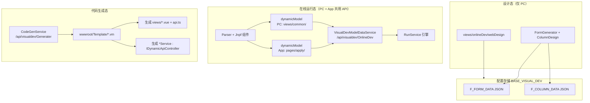
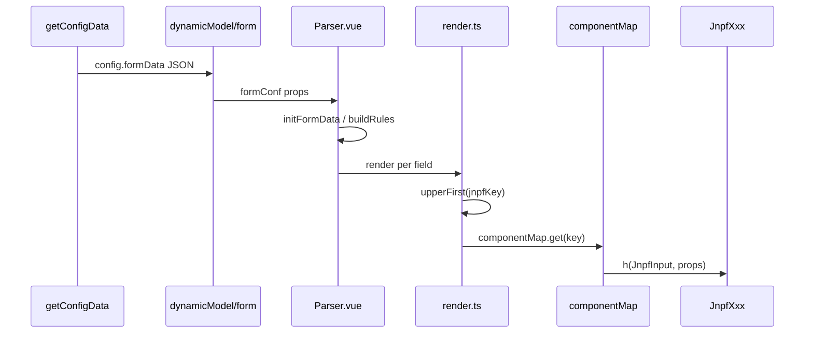
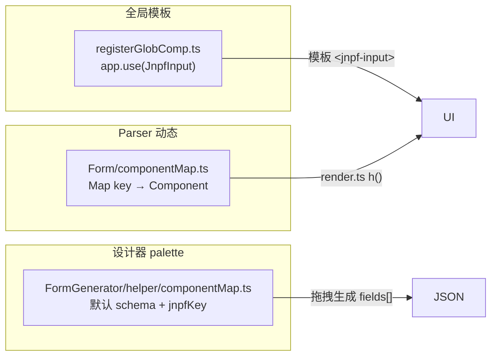
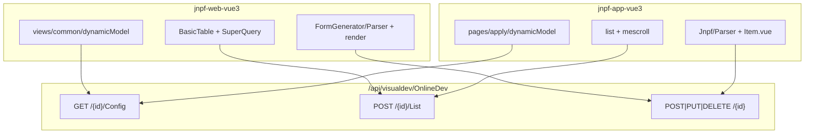

# 【专项文档09】JNPF v5.2 低代码平台 — 前端运行时深度解剖

> **适用版本**：JNPF v5.2  
> **后端源码仓库**：`d:\JNPF-v52\backend`  
> **PC 前端路径**：`d:\JNPF-v52\jnpf-web-vue3\`  
> **移动端路径**：`d:\JNPF-v52\jnpf-app-vue3\`（**无 `src/` 根**）  
> **文档编号**：v52-arch-09  
> **文档版本**：v2.0-final  
> **编写日期**：2026-05-24  
> **审核状态**：2026-05-24 审核通过（4 处确认项已闭合）  
> **编写依据**：PC/UniApp 前端运行时源码 + 后端 `VisualDevModelDataService` / `RunService` / `CodeGenService` 交叉验证  

> **与 04 / 06 / 10 的边界**  
> - [04-application-frontend-deep-dive.md](04-application-frontend-deep-dive.md)：主 WEB **工程化**（Vite、路由、Axios、Layout）— 本篇**不重复**  
> - [06-mobile-uniapp-deep-dive.md](06-mobile-uniapp-deep-dive.md)：UniApp **工程与 App 菜单** — 本篇补齐 **Parser/组件/列表** 机制  
> - [10-workflow-engine-deep-dive.md](10-workflow-engine-deep-dive.md)：流程引擎 — 本篇仅说明 `webType=3/9` 与 `dynamicModel` 入口  
> - 编写指南原 **09=后端代码生成、10=前端代码生成**；本篇合并为 **运行时 + 代码生成** 一章（§8）

---

## 已知问题与注意事项

> **⚠️ 双工程、无共享 npm 包**  
> PC（`jnpf-web-vue3`）与 UniApp（`jnpf-app-vue3`）**各自维护一套** `components/Jnpf/` 与 Parser，仅共享 **FormData/columnData JSON 协议** 与 **OnlineDev REST API**，不存在 monorepo 公共组件库。

> **⚠️ 不存在 `registerComponent` API**  
> 源码中表单运行时组件注册为 **`registerGlobComp.ts`（全局）** + **`Form/src/componentMap.ts`（Parser 动态映射）**；文档与代码检索勿使用虚构函数名。

> **⚠️ `RunService` 不直接暴露 REST**  
> 前端 `/api/visualdev/OnlineDev/*` 由 **`VisualDevModelDataService`** 代理；引擎实现在 `modularity/visualdev/JNPF.VisualDev/RunService.cs`。

> **⚠️ 环境锚点**  
> PC 开发 `:3100` + API 前缀 `/dev` → `:30000`；UniApp H5 `:3800` + 直连 `:30000`（见 04/06）。

---

## 第一章：运行时架构总览

### 1.1 两条运行路径（图1-1）

**图1-1 低代码前端运行态 vs 代码生成态**



| 路径 | 何时使用 | 前端入口 | 后端 API |
|------|----------|----------|----------|
| **在线运行态** | 菜单 `ONLINE_MODEL` / App type=3/9，未下载代码 | `dynamicModel/index.vue` | `/api/visualdev/OnlineDev/{modelId}/*` |
| **代码生成态** | 在线开发「代码生成」下载/覆盖到工程 | 生成的 `views/{module}/index.vue` | 生成的 `/api/{namespace}/{Entity}/*` |

两套前端页面结构**同构**（BasicTable + Parser + SuperQuery），在线态走统一 `dynamicModel`，生成态为静态 Vue 文件。

### 1.2 webType 与视图切换

| webType | 含义 | PC 组件 | 说明 |
|---------|------|---------|------|
| **1** | 纯表单 | `dynamicModel/form/index.vue` | 无列表 |
| **2** | 表单 + 列表 | `dynamicModel/list/index.vue` | 最常见 |
| **3** | 流程表单 | 同 2 + `enableFlow=1` | 关联 [10-workflow-engine-deep-dive.md](10-workflow-engine-deep-dive.md) |
| **4** | 行内编辑列表 | `list/index.vue`（`columnData.type=4`） | 表格内编辑 |

PC 入口 `dynamicModel/index.vue` 按 `route.meta` / `getConfigData` 切换：

```12:13:d:\JNPF-v52\jnpf-web-vue3\src\views\common\dynamicModel\index.vue
  import Form from './form/index.vue';
  import List from './list/index.vue';
```

```57:59:d:\JNPF-v52\jnpf-web-vue3\src\views\common\dynamicModel\index.vue
    state.enableFlow = route.meta.type === 9 ? 1 : 0;
    if (!state.enableFlow) return getConfig(route.meta.relationId);
    getModelId(route.meta.relationId);
```

UniApp 对照见 [06 §5](06-mobile-uniapp-deep-dive.md)（`config` base64 传参 vs PC `meta.modelId`）。

#### 本节核心表清单

| 表名 | 字段 |
|------|------|
| **BASE_VISUAL_DEV** | **F_FORM_DATA**、**F_COLUMN_DATA**、**F_WEB_TYPE**、**F_ENABLE_FLOW** |

#### 本节关键代码路径索引

| 路径 | 说明 |
|------|------|
| `jnpf-web-vue3/src/views/common/dynamicModel/index.vue` | PC 运行时路由容器 |
| `jnpf-app-vue3/pages/apply/dynamicModel/index.vue` | App 运行时入口 |
| `modularity/visualdev/JNPF.VisualDev/VisualDevModelDataService.cs` | OnlineDev API |

---

## 第二章：共享 JSON 协议 — FormData 与 columnData

### 2.1 FormData 结构（表单设计 JSON）

存储列：**BASE_VISUAL_DEV.F_FORM_DATA**（字符串 JSON）。运行时 `getConfigData` 返回 `config.formData`，再 `JSON.parse`。

| 顶层键 | 说明 |
|--------|------|
| `fields[]` | 字段树（含布局容器 `row`/`card`/`tab`/`tableGrid`） |
| `labelWidth` / `labelPosition` | 表单布局 |
| `funcs.onLoad` / `beforeSubmit` / `afterSubmit` | 字符串脚本，经 `getScriptFunc` 执行 |
| `className` | 自定义样式类 |

每个字段节点：

| 键 | 说明 |
|----|------|
| `__config__.jnpfKey` | 控件类型键（如 `input`、`relationForm`） |
| `__config__.label` / `required` / `regList` | 标签与校验 |
| `__vModel__` | **前端 formData 键名**（camelCase，如 `userName`） |
| `__config__.defaultValue` | 默认值 |
| `on` | 事件函数字符串（`change` 等） |

### 2.2 columnData 结构（列表设计 JSON）

存储列：**BASE_VISUAL_DEV.F_COLUMN_DATA**。运行时 `list/index.vue`：

```javascript
state.columnData = JSON.parse(state.config.columnData)
```

| 字段 | 说明 |
|------|------|
| `type` | **1** 普通 / **2** 左侧树 / **3** 分组树表 / **4** 行内编辑 / **5** 视图列表 |
| `columnList[]` | 列定义（`prop`、`jnpfKey`、`width`、`fixed`） |
| `searchList[]` | 搜索区字段（映射 `BasicForm` schema） |
| `hasSuperQuery` | 是否显示高级查询 |
| `childTableStyle` | 子表展示样式 |
| `showSummary` / `defaultSortConfig` | 合计行、默认排序 |
| `funcs.afterOnload` | 列表加载后脚本 |

### 2.3 字段名映射：__vModel__ ↔ 物理列（已源码验证）

| 层 | 命名 |
|----|------|
| 前端 `formData` | `state.formData[__vModel__]`，**无 `F_` 前缀** |
| 设计 JSON | `__vModel__` 通常 camelCase（设计器自动生成 `field` + 数字） |
| 无表发布 **mt{ID}** | 建表时 `field.field = item.__vModel__` **原样**作列名（`VisualDevService` L1709） |
| 有表模式 | 列名来自物理表 DDL；`FormDataParsing` 按 `__vModel__` 映射 |
| 系统列 | 主键 **f_id** / **F_ID** 由 `NoTblToTable` **单独追加**（L1699），不占用用户 `__vModel__` |

**命名冲突（问题 2 · 已源码验证）**：

- 后端 **未发现** `__vModel__` 黑名单或保留字校验（无 `id`/`createTime`/`f_flow_id` 拦截逻辑）。
- 若手动将 `__vModel__` 设为与系统列同名（如 `f_flow_id`），`NoTblToTable` 可能尝试重复建列或与 `SyncField` 追加列冲突 → **【待 DDL 验证】** 取决于数据库是否允许重复列名。
- 设计器侧仅有**同表单内** `__vModel__` 唯一性约束（右侧面板引用字段时按 id 匹配），**不**校验 SQL 保留字。
- **建议**：业务字段使用设计器默认 `field{N}` 命名；勿手改为 `id`、`f_id`、`f_tenant_id` 等系统列名。

关联子表/关联表单特殊键（PC `render.ts`）：

```73:76:d:\JNPF-v52\jnpf-web-vue3\src\components\FormGenerator\src\helper\render.ts
      if (['relationForm', 'popupSelect'].includes(jnpfKey)) {
        dataObject['field'] = confClone.__config__.tableName
          ? confClone.__vModel__ + '_jnpfTable_' + confClone.__config__.tableName + (confClone.__config__.isSubTable ? '0' : '1')
          : confClone.__vModel__;
```

### 2.4 FormData JSON 典型片段（示例）

以下为精简示例（非完整导出），展示栅格 + 输入 + 下拉 + 子表布局：

```json
{
  "labelWidth": 100,
  "labelPosition": "right",
  "gutter": 15,
  "fields": [
    {
      "__config__": { "jnpfKey": "row", "layout": "rowFormItem", "children": [
        {
          "__config__": { "jnpfKey": "input", "label": "客户名称", "required": true, "span": 12 },
          "__vModel__": "customerName",
          "placeholder": "请输入"
        },
        {
          "__config__": { "jnpfKey": "select", "label": "状态", "span": 12, "dataType": "dictionary" },
          "__vModel__": "status",
          "options": []
        }
      ]},
      "type": "default"
    },
    {
      "__config__": { "jnpfKey": "table", "label": "明细", "children": [
        {
          "__config__": { "jnpfKey": "inputNumber", "label": "数量", "isSubTable": true, "parentVModel": "detailTable" },
          "__vModel__": "qty"
        }
      ]},
      "__vModel__": "detailTable"
    }
  ],
  "funcs": { "onLoad": "", "beforeSubmit": "", "afterSubmit": "" }
}
```

运行时：`getConfigData` → `JSON.parse(config.formData)` → 传入 `Parser` 的 `formConf` prop。

#### 本节核心表清单

**BASE_VISUAL_DEV**（**F_FORM_DATA**、**F_COLUMN_DATA**、**F_APP_COLUMN_DATA** App 列配置）

#### 本节关键代码路径索引

| 路径 | 说明 |
|------|------|
| `modularity/visualdev/JNPF.VisualDev.Entitys/Entity/VisualDevEntity.cs` | 配置存储实体 |
| `modularity/engine/JNPF.VisualDev.Engine/Core/FormDataParsing.cs` | vModel → 列名 |
| `jnpf-web-vue3/src/views/common/dynamicModel/list/index.vue` | columnData 消费 |

---

## 第三章：PC 表单运行时 — Parser 与 render 链

### 3.1 组件职责

| 文件 | 职责 |
|------|------|
| `components/FormGenerator/src/components/Parser.vue` | **主 Parser**：TSX 递归 `fields[]`，挂载校验、脚本、布局 |
| `components/FormGenerator/src/helper/render.ts` | 单字段 `h(Comp, props)` |
| `components/Form/src/componentMap.ts` | `jnpfKey` → Vue 组件 |
| `views/common/dynamicModel/list/detail/Parser.vue` | 详情只读（委托 `Item.vue`） |

### 3.2 渲染流水线（图3-1）

**图3-1 FormData → Parser → Jnpf 组件**



### 3.3 render.ts 核心映射规则

```101:105:d:\JNPF-v52\jnpf-web-vue3\src\components\FormGenerator\src\helper\render.ts
      const jnpfKey = upperFirst(props.conf.__config__.jnpfKey) === 'Table' ? 'InputTable' : upperFirst(props.conf.__config__.jnpfKey);
      const Comp = componentMap.get(jnpfKey as ComponentType) as ReturnType<typeof defineComponent>;
      if (!Comp) return null;
      const realDataObject = getRealProps(dataObject, props.conf.__config__.jnpfKey);
      return h(Comp, realDataObject as any);
```

规则摘要：

- `jnpfKey='table'` → componentMap 键 **`InputTable`**
- 其余：`upperFirst(jnpfKey)` → 如 `input` → `Input` → `JnpfInput`
- 布局容器（`row`/`card`/`tab`/`collapse`/`steps`/`tableGrid`）在 **Parser.vue 内 TSX 直接渲染**，不走 componentMap

### 3.4 Parser 运行时能力

- **`provide('parameter', { formData, setFormData, setShowOrHide, setRequired, setDisabled, onlineUtils })`** — 供字段脚本调用
- **`buildRules(fields)`** — 由 `__config__.regList` 生成 Ant Design Form 规则（非 `utils/formValidate.ts`）
- **动态选项**：`dyOptionsList` 控件异步拉字典/数据接口（`getDataInterfaceRes`）
- **表单脚本**：`formConf.funcs.onLoad` 等经 `getScriptFunc`（`utils/jnpf.ts`）动态执行

### 3.5 提交链路

`dynamicModel/form` / `list` 弹窗表单：

1. `Parser` 暴露 `submit` → 校验 `formRules`
2. `beforeSubmit` 脚本
3. `createModel` / `updateModel` → `POST/PUT /api/visualdev/OnlineDev/{modelId}`

### 3.6 Parser 递归深度（已源码验证）

PC `Parser.vue` 通过 `renderChildren` → `renderFormItem(config.children)` **无最大深度常量**：

```318:321:d:\JNPF-v52\jnpf-web-vue3\src\components\FormGenerator\src\components\Parser.vue
      function renderChildren(scheme) {
        const config = scheme.__config__;
        if (!Array.isArray(config.children)) return null;
        return renderFormItem(config.children);
```

| 项 | 结论 |
|----|------|
| 深度限制 | **无** `maxDepth` / 递归计数 |
| 嵌套来源 | `row`/`card`/`tab`/`collapse`/`steps`/`tableGrid` 的 `children[]` |
| 极端嵌套 | 10+ 层可能导致渲染变慢；**非**硬栈溢出防护；业务中罕见 |
| Mobile | `Item.vue` 同样递归，**无**深度上限 |

#### 本节核心表清单

—（运行时无独立表；读写 **BASE_VISUAL_DEV** 配置 + 业务表/mt{ID}）

#### 本节关键代码路径索引

| 路径 | 说明 |
|------|------|
| `jnpf-web-vue3/src/components/FormGenerator/src/components/Parser.vue` | 主 Parser |
| `jnpf-web-vue3/src/components/FormGenerator/src/helper/render.ts` | 字段 render |
| `jnpf-web-vue3/src/components/FormGenerator/src/helper/transform.ts` | `getRealProps` |
| `jnpf-web-vue3/src/utils/jnpf.ts` | `getScriptFunc`、`onlineUtils` |

---

## 第四章：Jnpf 字段组件体系

### 4.1 三层注册机制（图4-1）

**图4-1 Jnpf 组件注册**



| 层级 | 文件 | 扩展 API |
|------|------|----------|
| 全局 | `components/registerGlobComp.ts` | 新增 `app.use(NewComp)` |
| Parser | `components/Form/src/componentMap.ts` | `add(key, Comp)` / `del(key)` |
| 设计器 | `FormGenerator/src/helper/componentMap.ts` | 追加 palette 项 + 同步 L2 |

**注意**：`JnpfRelationForm`、`JnpfInputTable` 在 componentMap 中注册，但**未**全部列入 `registerGlobComp`（仅 Parser 路径使用）。

### 4.2 PC componentMap 映射表（节选）

| jnpfKey | Map 键 | 组件 |
|---------|--------|------|
| `input` | `Input` | `JnpfInput` |
| `textarea` | `Textarea` | `JnpfTextarea` |
| `select` | `Select` | `JnpfSelect` |
| `datePicker` | `DatePicker` | `JnpfDatePicker` |
| `table` | `InputTable` | `JnpfInputTable` |
| `relationForm` | `RelationForm` | `JnpfRelationForm` |
| `createUser` | `CreateUser` | `JnpfOpenData` |
| `billRule` | `BillRule` | `JnpfInput`（readonly） |
| `organizeSelect` | `OrganizeSelect` | `JnpfOrganizeSelect` |
| `popupSelect` | `PopupSelect` | `JnpfPopupSelect` |

完整 palette 见 `FormGenerator/src/helper/componentMap.ts`（40+ `jnpfKey` 定义）。

### 4.3 PC 组件目录

`jnpf-web-vue3/src/components/Jnpf/` 子目录（聚合导出 `index.ts`）：

Alert, AreaSelect, AutoComplete, Barcode, Button, Calculate, Cascader, Checkbox, ColorPicker, Cron, DatePicker, Divider, IconPicker, Iframe, Input, InputNumber, InputTable, Link, Location, NumberRange, OpenData, Organize, PopupAttr, PopupSelect, Qrcode, Radio, Rate, RelationForm, RelationFormAttr, Select, Sign, Signature, Slider, Switch, Text, TextTag, TreeSelect, Upload

### 4.4 移动端 Jnpf（对照）

| 维度 | PC | UniApp |
|------|-----|--------|
| 目录 | `src/components/Jnpf/` | `components/Jnpf/` |
| 注册 | `registerGlobComp` + componentMap | `pages.json` easycom：`^Jnpf(.*)` → `@/components/Jnpf/$1/index.vue` |
| Parser | TSX + `render.ts` | `components/Jnpf/Parser/index.vue` + **`Item.vue`**（`v-if jnpfKey` 分支） |
| UI 基座 | Ant Design Vue | uView（`vk-uview-ui`） |

Mobile Parser 同样执行 `initFormData` / `buildRules` / `buildOptions`，协议与 PC 一致：

```69:74:d:\JNPF-v52\jnpf-app-vue3\components\Jnpf\Parser\index.vue
			this.beforeInit(data.formConfCopy.fields)
			this.initRelationForm(data.formConfCopy.fields)
			this.initFormData(data.formConfCopy.fields, data.formData, data.tableRefs)
			this.buildRules(this.$u.deepClone(data.formConfCopy.fields), data.rules)
			this.buildOptions(data.formConfCopy.fields, data.options, data.formData)
```

#### 本节核心表清单

—

#### 本节关键代码路径索引

| 路径 | 说明 |
|------|------|
| `jnpf-web-vue3/src/components/Form/src/componentMap.ts` | Parser 映射 |
| `jnpf-web-vue3/src/components/registerGlobComp.ts` | 全局注册 |
| `jnpf-app-vue3/components/Jnpf/Parser/Item.vue` | Mobile 字段分支 |
| `jnpf-app-vue3/pages.json` | easycom 规则 |

---

## 第五章：PC 列表运行时 — columnData → BasicTable

### 5.1 栈组件

| 组件/Hook | 路径 | 用途 |
|-----------|------|------|
| `BasicTable` | `components/Table/` | 表格壳 |
| `useTable` | `components/Table/src/hooks/useTable.ts` | 分页、加载、`api: getModelList` |
| `BasicForm` + `useForm` | `components/Form/` | 搜索区 |
| `SuperQueryModal` | `components/CommonModal/src/SuperQueryModal.vue` | 高级查询 |
| `ColumnDesign` | `components/ColumnDesign/` | **设计态**；运行态只消费 JSON |

### 5.2 list/index.vue 初始化

1. `getConfigData(modelId)` → `config.columnData` / `config.formData`
2. `JSON.parse(columnData)` → `state.columnData`
3. 由 `columnList` 生成 `columns` / `searchSchemas`
4. `useTable({ api: getModelList, ... })` 绑定 **POST `/api/visualdev/OnlineDev/{modelId}/List`**

### 5.3 columnData.type 运行时行为

| type | 行为 |
|------|------|
| **1** | 标准列表 + 弹窗表单 |
| **2** | 左侧树 + 列表（`jnpf-content-wrapper-left`） |
| **3** / **5** | 树表 / 视图列表（`isTreeTable: true`） |
| **4** | 行内编辑（`columnData.type === 4` 模板分支） |

`getTableBindValue` 片段（排序、树表、ellipsis）：

```825:847:d:\JNPF-v52\jnpf-web-vue3\src\views\common\dynamicModel\list\index.vue
    const defaultSortConfig = (state.columnData.defaultSortConfig || []).map(o => (o.sort === 'desc' ? '-' : '') + o.field);
    const data: any = {
      pagination: unref(getPagination),
      searchInfo: unref(searchInfo),
      defSort: { sidx: defaultSortConfig.join(',') },
      // ...
      ellipsis: !!state.columnData.showOverflow,
      isTreeTable: [3, 5].includes(state.columnData.type),
```

### 5.4 SuperQuery 高级查询与安全（已源码验证）

| 步骤 | 实现 |
|------|------|
| 入口 | 工具栏 `columnData.hasSuperQuery` → `openSuperQuery` |
| UI | `SuperQueryModal` + `ColumnDesign/.../ConditionMain.vue` |
| 提交 | `handleSuperQuery(superQueryJson)` → `searchInfo.superQueryJson` → `reload()` |
| 方案持久化 | `api/system/advancedQuery`（按 menuId 存方案） |

**SQL 注入（问题 3 · 已源码验证）**：

在线列表 SuperQuery **不走**工作流 `ConditionNodeJudge` 式 `select * from ... where {0}` 字符串拼接（对比 [10 §5.8](10-workflow-engine-deep-dive.md)）。

主路径：

1. `RunService.GetListResult` 读取 `superQueryJson`
2. `SuperQueryHelper.GetSuperQueryInput` 将 `item.field` 映射到 `entityInfo.Columns` 的 `DbColumnName`；**未知字段 `continue` 跳过**
3. 输出 `List<IConditionalModel>`（SqlSugar `ConditionalModel`：`FieldName` + `FieldValue` + `ConditionalType`）
4. SqlSugar 生成 **参数化 WHERE**，非用户可控列名直接拼入 SQL 字符串

| 对比项 | SuperQuery（在线列表） | 工作流条件分支 |
|--------|------------------------|----------------|
| 条件构造 | `ConditionalModel` + 列元数据映射 | 部分路径拼 SQL 片段 |
| 字段白名单 | 实体列 `DbColumnName` 映射 | 视节点配置而定 |
| 风险等级 | **低～中**（依赖列映射完整性） | **中**（见 10 文档） |

**注意**：`SuperQueryHelper.GetUserRelationByUserId`（L316 附近）存在 `string.Format` 拼 SQL，用于**用户关系**辅助查询，**非** SuperQuery 主列表路径；二次开发勿混用。

### 5.5 列单元格 jnpfKey 渲染

列表 bodyCell 按列 `jnpfKey` 分支（`relationForm`、`uploadImg`、`switch` 等），与表单组件视觉一致但**只读/轻交互**；复杂列走 `components/Table/src/components/editable`（行内编辑 type=4）。

#### 本节核心表清单

**BASE_VISUAL_DEV.F_COLUMN_DATA**；列表数据来自 **RunService.GetListResult** 查询的业务表/mt{ID}

#### 本节关键代码路径索引

| 路径 | 说明 |
|------|------|
| `jnpf-web-vue3/src/views/common/dynamicModel/list/index.vue` | 列表运行时主文件 |
| `jnpf-web-vue3/src/components/CommonModal/src/SuperQueryModal.vue` | 高级查询 |
| `jnpf-web-vue3/src/components/Table/src/hooks/useTable.ts` | 表格 Hook |

---

## 第六章：PC 与移动端运行时对照

### 6.1 共享层（协议 + API）

| 共享项 | 说明 |
|--------|------|
| FormData / columnData JSON | 同一 schema（`__config__.jnpfKey`、`__vModel__`） |
| OnlineDev REST | `/api/visualdev/OnlineDev/{modelId}/Config|List|...` |
| jnpfKey 枚举 | input/select/table/relationForm 等两端对齐 |
| 后端引擎 | 同一 `RunService`；App 列配置走 **F_APP_COLUMN_DATA** + `jnpf-origin: app`（[06 §4](06-mobile-uniapp-deep-dive.md)） |

### 6.2 差异层（实现独立）

| 维度 | PC | UniApp |
|------|-----|--------|
| 入口参数 | `route.meta.relationId` / `modelId` | `onLoad` → base64 `config` |
| 列表分页 | `BasicTable` + `useTable` | `mescroll-uni` + 自研 list 组件 |
| 高级查询 | SuperQueryModal + 方案保存 | **无** SuperQuery 方案 UI（简化搜索 Parser） |
| 权限按钮 | `usePermission` + 列按钮 JSON | `$permission.getPermission(columnData, menuId)` |
| 独有能力 | ColumnDesign、ViewList、数据管理 `isDataManage` | `scanForm.vue`、批量 mixin |

### 6.3 App 端 jnpfKey 能力缺口（已源码验证）

对比 PC `Form/src/componentMap.ts` 与 App `components/Jnpf/Parser/Item.vue`：

| jnpfKey | PC | App | 说明 |
|---------|----|----|------|
| `cron` | ✅ `JnpfCron` | ❌ 无组件目录 | 定时表达式仅 PC |
| `iframe` | ✅ `JnpfIframe` | ❌ 无组件目录 | 内嵌页仅 PC |
| `iconPicker` | ✅ | ❌ Item.vue 无分支 | 图标选择仅 PC |
| `numberRange` | ✅ | ❌ | 数字范围仅 PC |
| `dateRange` / `timeRange` | ✅ | ❌ | 范围选择仅 PC |
| `monthPicker` / `weekPicker` | ✅ | ❌ | 月/周选择仅 PC |
| `tableGrid` | ✅ Parser 布局 | ❌ 无 `tableGrid` 分支 | App 用 `row`/`card` 替代 |
| `signature` / `sign` / `location` / `editor` | ✅ | ✅ | App **已支持**（Item.vue L196–216） |
| `alert` / `link` / `button` | ✅ | ✅ | App 展示/交互类已支持 |
| SuperQuery 方案 UI | ✅ | ❌ | App 仅简化搜索（§6.2） |

**评估建议**：移动端表单设计时，在 PC 设计器将上述 PC-only 控件的 `__config__.visibility` 设为不含 `app`，或改用 App 等价控件（如单 `datePicker` 替代 `dateRange`）。

### 6.4 统一总结图（图6-1）

**图6-1 PC / App 运行时对照**



#### 本节核心表清单

**BASE_VISUAL_DEV**；App 列配置 **F_APP_COLUMN_DATA**

#### 本节关键代码路径索引

| 路径 | 说明 |
|------|------|
| [04-application-frontend-deep-dive.md §3](04-application-frontend-deep-dive.md) | PC 路由 → dynamicModel |
| [06-mobile-uniapp-deep-dive.md §5](06-mobile-uniapp-deep-dive.md) | App dynamicModel 流程 |
| `jnpf-app-vue3/api/apply/visualDev.js` | Mobile OnlineDev 封装 |

---

## 第七章：后端 API 与 RunService 引擎层

### 7.1 VisualDevModelDataService 路由

```46:48:modularity/visualdev/JNPF.VisualDev/VisualDevModelDataService.cs
[ApiDescriptionSettings(Tag = "VisualDev", Name = "OnlineDev", Order = 172)]
[Route("api/visualdev/[controller]")]
public class VisualDevModelDataService : IDynamicApiController, ITransient
```

实际前缀：**`/api/visualdev/OnlineDev`**

### 7.2 前端 API 对照表

封装文件：`jnpf-web-vue3/src/api/onlineDev/visualDev.ts`

| 前端函数 | HTTP | 后端方法 |
|----------|------|----------|
| `getConfigData(modelId)` | GET `/{modelId}/Config` | `GetVisualDevModelDataConfig` |
| `getModelList(data)` | POST `/{modelId}/List` | `_runService.GetListResult` |
| `createModel(modelId, data)` | POST `/{modelId}` | 新建 |
| `updateModel(modelId, data)` | PUT `/{modelId}/{id}` | 更新 |
| `getModelInfo(modelId, id)` | GET `/{modelId}/{id}` | 详情 |
| `delModel` | DELETE `/{modelId}/{id}` | 删除 |

```86:100:d:\JNPF-v52\jnpf-web-vue3\src\api\onlineDev\visualDev.ts
export function getConfigData(modelId, data = {}) {
  return defHttp.get({ url: Api.OnlinePrefix + `/${modelId}/Config`, data });
}
export function getModelList(data) {
  return defHttp.post({ url: Api.OnlinePrefix + `/${data.modelId}/List`, data });
}
```

### 7.3 RunService 职责（不暴露 REST）

路径：`modularity/visualdev/JNPF.VisualDev/RunService.cs`

| 方法 | 用途 |
|------|------|
| `GetListResult` | 列表查询、排序、superQueryJson 解析 |
| `SaveFlowFormData` | 流程表单写业务表（[10 §8](10-workflow-engine-deep-dive.md)） |
| `Create` / `Update` / `Delete` | 在线表单 CRUD |
| `NoTblToTable` | 无表发布 → **mt{ID}** 建表 |

配置读取：`GetVisualDevModelDataConfig` 将 **VisualDevEntity** 适配为前端 `config`（含 `formData`、`columnData` 字符串）。

#### 本节核心表清单

| 表名 | 说明 |
|------|------|
| **BASE_VISUAL_DEV** | 功能元数据 |
| **mt{ID}** / 业务物理表 | 运行数据 |

#### 本节关键代码路径索引

| 路径 | 说明 |
|------|------|
| `modularity/visualdev/JNPF.VisualDev/VisualDevModelDataService.cs` | OnlineDev API |
| `modularity/visualdev/JNPF.VisualDev/RunService.cs` | 引擎 |
| `jnpf-web-vue3/src/api/onlineDev/visualDev.ts` | PC API 封装 |

---

## 第八章：代码生成 — 后端 + 前端产物

> 编写指南原 **09 后端代码生成** 主题；与在线运行态对照见 §1.1。

### 8.0 前置条件与入口（已源码验证）

| 项 | 说明 |
|----|------|
| **必须先发布** | 在线开发列表行操作「代码生成」按钮 `:disabled="!record.isRelease"`（`webDesign/index.vue` L163–165） |
| **入口位置** | PC 主 WEB → **在线开发** → `views:onlineDev:webDesign` 列表页 → 行内 **代码生成** |
| **后端校验** | `CodeGenService.DownloadCode` 要求 `FormData` 非空；`webType=2` 时 `ColumnData` 非空（L117–121） |
| **表结构** | `Tables` 非空（已绑定物理表或 mt{ID}）；无表功能须先完成发布建表 |

前端 API：`POST /api/visualdev/Generater/{id}/Actions/DownloadCode`（`visualDev.ts` → `GenPrefix`）。

### 8.1 CodeGenService

| 项 | 值 |
|----|-----|
| 类 | `modularity/codegen/JNPF.CodeGen/CodeGenService.cs` |
| 路由 | `[Route("api/visualdev/[controller]")]` + `Name = "Generater"` → **`/api/visualdev/Generater`** |
| 接口 | `IDynamicApiController` |
| 引擎 | `IViewEngine` + Apache Velocity `.vm` 模板 |

前端入口：`views/onlineDev/webDesign` → 代码预览/下载；API `visualDev.ts` → `GenPrefix = '/api/visualdev/Generater'`。

### 8.2 模板目录

`application/JNPF.API.Entry/wwwroot/Template/`

| 分类 | 路径示例 |
|------|----------|
| 后端单表 | `1-SingleTable/Service.cs.vm`、`Entity.cs.vm`、`CrInput.cs.vm` |
| 主从/辅表 | `2-MainBelt/`、`3-Auxiliary/`、`4-MainBeltVice/`、`5-PrimarySecondary/` |
| PC Vue3 | `vue3/index.vue.vm`、`Form.vue.vm`、`api.ts.vm`、`columnList.ts.vm`、`superQueryJson.ts.vm` |
| 行内编辑 | `*/InlineEditor/Service.cs.vm` |
| Mobile | `appIndex.vue.vm`、`appForm.vue.vm`、`vue3/app*.vue.vm` |
| 工作流表单 | `WorkflowForm.vue.vm`、`vue3/WorkFlow/` |

### 8.3 后端生成模式（已源码验证）

**模式 A：DynamicApi Service（v5.2 默认）** — **非**传统 Controller。

```66:67:application/JNPF.API.Entry/wwwroot/Template/1-SingleTable/Service.cs.vm
[Route("api/@(Model.Type == 3 ? Model.NameSpace+ "/Form" : Model.NameSpace)/[controller]")]
public class @(Model.ClassName)Service : I@(Model.ClassName)Service, IDynamicApiController, ITransient
```

Entity 列名保留 **F_** 前缀：

```29:29:application/JNPF.API.Entry/wwwroot/Template/1-SingleTable/Entity.cs.vm
    @:[SugarColumn(ColumnName = "@(column.OriginalColumnName)")]
```

流程表单额外列 **F_Flow_Task_Id** / **F_Flow_Id**（模板 L156+）。

### 8.4 前端生成模式

生成物与 `dynamicModel/list/index.vue` **结构同构**：

- `index.vue` — BasicTable + SuperQuery + 工具栏
- `Form.vue` — Parser 或静态表单
- `api.ts` — 指向生成的 DynamicApi Service 路由（非 OnlineDev）
- `columnList.ts` / `superQueryJson.ts` — 列与高级查询常量

**在线态 vs 生成态选择**：

| 场景 | 推荐 |
|------|------|
| 快速迭代、菜单已绑 ONLINE_MODEL | 在线 `dynamicModel` |
| 需深度定制、纳入 CI、离线部署 | 代码生成后改生成 Vue/Service |
| 二次开发扩展 Parser | 在线态 + `componentMap.add`；生成态改 `.vm` 模板 |

### 8.5 生成 Service 的 DI 与项目引用（问题 4 · 已源码验证）

| 项 | 说明 |
|----|------|
| **无需 Startup 手写注册** | 生成 `*Service : IDynamicApiController, ITransient` 后，Furion `AddDependencyInjection()` 按 `ITransient` **约定扫描**自动注册（同 [01 §5](01-core-framework.md)） |
| **API 自动暴露** | `DynamicApiControllerApplicationModelConvention` 扫描已注册 Service，生成 REST 路由 |
| **必须手动做的** | 将生成 csproj **`ProjectReference` 到 `JNPF.API.Entry.csproj`**（或纳入已有 modularity 项目）；否则程序集不在扫描范围 |
| **菜单/权限** | ZIP 内 **BASE_MODULE** INSERT 脚本须自行执行（§8.6） |

### 8.6 菜单 SQL

生成包常含菜单 INSERT，目标表 **BASE_MODULE**（非 `sys_menu`）。具体 SQL 以生成 ZIP 内脚本为准；字段前缀须符合 [03-application-modules-deep-dive.md](03-application-modules-deep-dive.md)。

#### 本节核心表清单

| 表名 | 说明 |
|------|------|
| **BASE_VISUAL_DEV** | 生成数据源 |
| **BASE_MODULE** | 生成菜单 |

#### 本节关键代码路径索引

| 路径 | 说明 |
|------|------|
| `modularity/codegen/JNPF.CodeGen/CodeGenService.cs` | 生成入口 |
| `application/JNPF.API.Entry/wwwroot/Template/` | Velocity 模板 |
| `modularity/visualdev/JNPF.VisualDev.Engine/CodeGen/` | 生成引擎辅助 |

---

## 第九章：二次开发与扩展

### 9.1 新增 jnpfKey 字段类型（推荐步骤）

1. **PC 组件**：`components/Jnpf/NewField/index.vue`
2. **componentMap**：`Form/src/componentMap.ts` → `componentMap.set('NewField', JnpfNewField)`
3. **全局（可选）**：`registerGlobComp.ts` → `app.use(JnpfNewField)`
4. **设计器 palette**：`FormGenerator/helper/componentMap.ts` 增加 schema（`jnpfKey: 'newField'`）
5. **Mobile**：`jnpf-app-vue3/components/Jnpf/NewField/` + `Parser/Item.vue` 增加分支
6. **后端导入**（若涉及）：`Entity.cs.vm` / `FormDataParsing` 字段类型分支

### 9.2 扩展列表列渲染

- 在线态：改 `dynamicModel/list/index.vue` bodyCell 或封装列组件
- 生成态：改 `vue3/index.vue.vm` 后重新生成

### 9.3 校验与工具选型

| 工具 | 适用场景 |
|------|----------|
| Parser `buildRules` + `regList` | **低代码动态表单**（主路径） |
| `utils/formValidate.ts` | 系统管理/工作流固定表单 |
| `utils/jnpf.ts` `getScriptFunc` | 字段/表单级 JS 脚本 |

### 9.4 已知局限

1. **双份 Jnpf 实现**：PC/App 新控件须各维护一份（缺口见 §6.3）。
2. **无共享运行时包**：JSON 协议是唯一契约。
3. **SuperQuery 仅 PC 完整**：App 无方案持久化 UI。
4. **生成代码覆盖策略**：重新生成会覆盖 `.vm` 产出文件，手写改动需备份或使用别名扩展。
5. **`__vModel__` 无保留字校验**：手改字段名可能与系统列冲突（§2.3）。
6. **Parser 无递归深度上限**：极端嵌套影响性能（§3.6）。

---

## 附录 A：深度自检清单

- [x] 在线态 vs 生成态双路径（§1.1）
- [x] FormData/columnData JSON 协议 + **__vModel__ ↔ 物理列** + FormData 示例（§2.3–§2.4）
- [x] Parser 递归深度 + SuperQuery 安全 + vModel 冲突（§2.3、§3.6、§5.4）
- [x] App jnpfKey 能力缺口表（§6.3）
- [x] 代码生成前置条件 + DI 自动注册（§8.0、§8.5）
- [x] Parser → render → componentMap 链（§3）+ 源码行号
- [x] Jnpf 三层注册 + PC/App 对照（§4、§6）
- [x] 列表/SuperQuery/useTable（§5）
- [x] VisualDevModelDataService / RunService 分层（§7）
- [x] CodeGen DynamicApi Service 模式（§8）
- [x] 与 04/06/10 交叉引用，无重复工程化章节
- [x] `:5000` / `sys_*` / `appsettings.json` 零命中
- [x] 图1-1、3-1、6-1
- [x] 审核 4 处确认项已闭合（2026-05-24）

---

## 附录 B：相关文档索引

| 文档 | 关系 |
|------|------|
| [04-application-frontend-deep-dive.md](04-application-frontend-deep-dive.md) | 主 WEB 工程、路由、Axios |
| [06-mobile-uniapp-deep-dive.md](06-mobile-uniapp-deep-dive.md) | UniApp 工程、App 菜单、dynamicModel 入口 |
| [03-application-modules-deep-dive.md](03-application-modules-deep-dive.md) | **BASE_MODULE**、**BASE_VISUAL_DEV** |
| [05-visual-data-deep-dive.md](05-visual-data-deep-dive.md) | 大屏 BLADE_*，与低代码表单隔离 |
| [10-workflow-engine-deep-dive.md](10-workflow-engine-deep-dive.md) | webType=3/9、SaveFlowFormData |
| [02-application-services.md](02-application-services.md) | DynamicApiController 规范 |

---

> **文档维护**：新增 jnpfKey 或 OnlineDev API 变更后，请同步 §4 映射表、§6.3 缺口表、§7.2 路由表。
