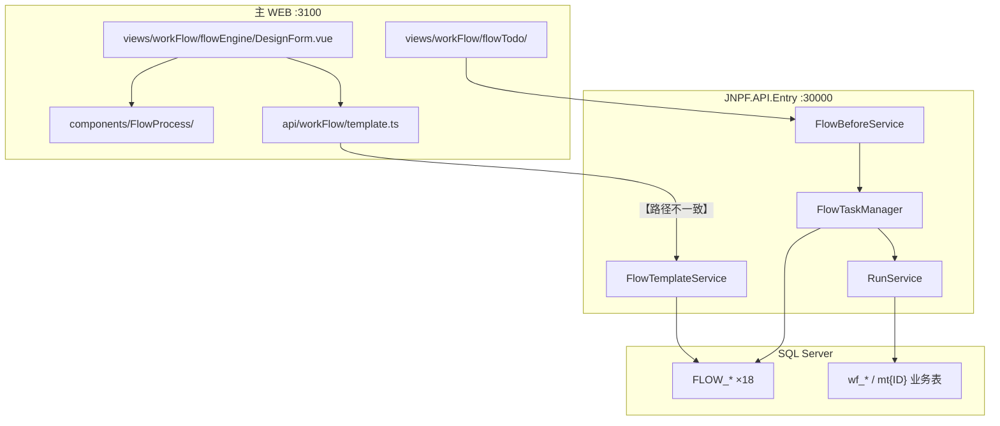
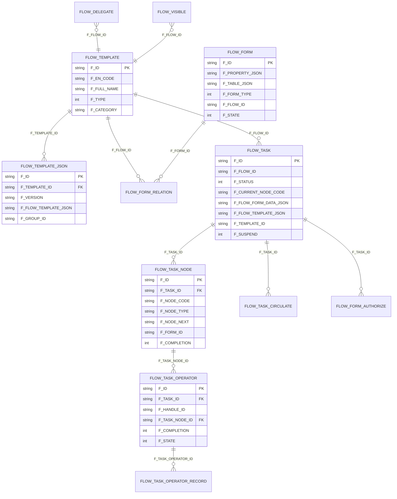
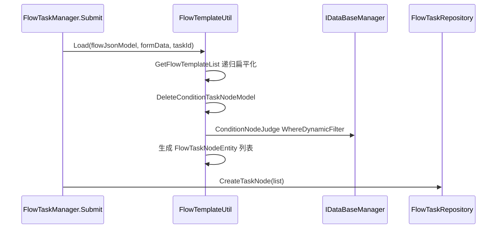
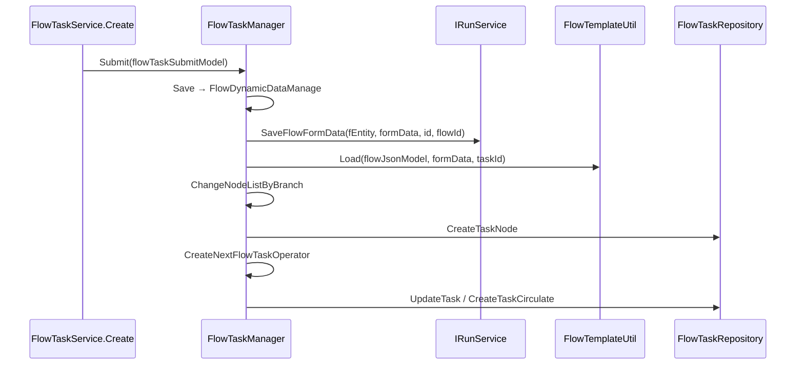
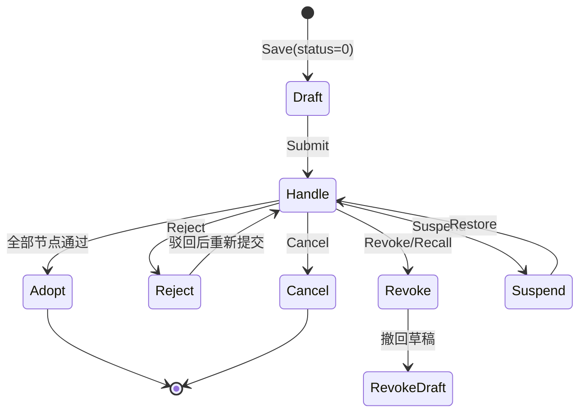
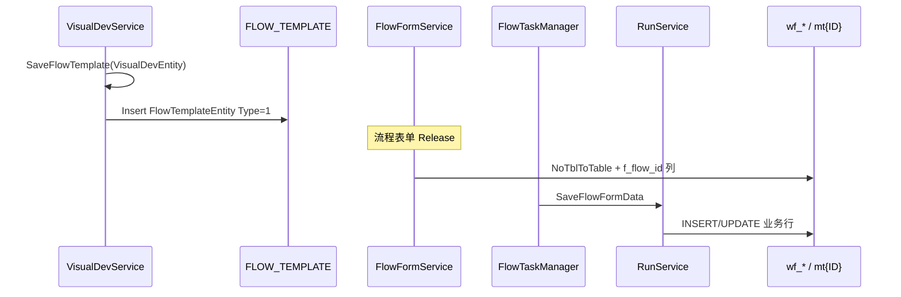

# 【专项文档10】JNPF v5.2 低代码平台 — 工作流引擎深度解剖

> **适用版本**：JNPF v5.2  
> **后端源码仓库**：`d:\JNPF-v52\backend`  
> **主 WEB 前端源码路径**：`d:\JNPF-v52\jnpf-web-vue3\`（**独立于主仓库**，下文路径均相对此前端工程根目录）  
> **文档编号**：v52-arch-10  
> **文档版本**：v2.0-final  
> **编写日期**：2026-05-24  
> **审核状态**：2026-05-24 审核通过（5 处确认项已闭合）  
> **编写依据**：v5.2 后端 `modularity/workflow/` + `modularity/engine/` 源码实测 + 主 WEB 流程设计器前端交叉验证  

> **与编写指南第三部分编号说明**  
> 编写指南原映射为：09=后端代码生成、10=前端代码生成、11=低代码平台能力（含工作流 §3）。本篇按第三批**业务优先级**独立成篇（工作流引擎）；09/11 仍待编写。交叉引用：[03-application-modules-deep-dive.md](03-application-modules-deep-dive.md)（Systems 权限）· [04-application-frontend-deep-dive.md](04-application-frontend-deep-dive.md)（主 WEB）· [05-visual-data-deep-dive.md](05-visual-data-deep-dive.md)（大屏，与工作流无直接耦合）。

---

## 已知问题与注意事项

> **⚠️ 端口职责（编写强制）**  
> 工作流 REST 由 **`JNPF.API.Entry`（`:30000`）** 暴露；主 WEB 开发 **`http://localhost:3100`**（Vite proxy `/dev` → `:30000`）。禁止在正文将 `:5000` 作生产 API 宿主。

> **⚠️ FLOW_* DDL 未纳入主 init 脚本**  
> `web/jnpf_sundial_init.sql` **未检索到** `FLOW_*` 建表语句。表结构以下文 Entity `[SugarTable]` 映射为准，完整 DDL 标注 **【待 DDL 验证】**。

> **⚠️ 前后端 API 路径不一致（已知缺陷 · 优先确认）**  
> v52 主 WEB `src/api/workFlow/template.ts` 使用 **`/api/workflow/template`**；本仓库后端 `FlowTemplateService` 路由为 **`/api/workflow/Engine/FlowTemplate`**。同理 `task.ts`/`operator` 与 `FlowTask`/`FlowBefore` 前缀不同。仅 **`/api/flowForm/Form`** 前后端一致。未对齐时流程设计器/待办页将 404——见 §4.8。

> **⚠️ 技术选型**  
> 全 solution **无** Activiti / Flowable / Camunda / Elsa NuGet 依赖。引擎为 **自研 JSON 状态机**；前端 `FlowProcess` 组件为 BPMN **可视化**层，后端消费 JSON 树而非 BPMN XML。

---

## 第一章：工作流引擎总览

### 1.1 在四层架构中的位置

| 层级 | 路径 | 工作流相关 |
|------|------|------------|
| 应用宿主 | `application/JNPF.API.Entry/` | **默认引用** `JNPF.WorkFlow`（`JNPF.API.Entry.csproj` L332） |
| 业务模块 | `modularity/workflow/` | 三项目：`JNPF.WorkFlow` / `.Interfaces` / `.Entitys` |
| 运行时引擎 | `modularity/engine/JNPF.VisualDev.Engine/` | `IRunService.SaveFlowFormData` 写业务表 |
| 主 WEB 前端 | `jnpf-web-vue3/src/views/workFlow/` | 设计器、发起、待办、监控 |

### 1.2 部署拓扑（图1-1）

**图1-1 工作流端到端拓扑**



### 1.3 引擎分层

| 层 | 核心类 | 职责 |
|----|--------|------|
| **定义层** | `FlowTemplateService`、`FlowTemplateEntity`、`FlowTemplateJsonEntity` | 流程模板 CRUD、版本、发布 |
| **解析层** | `FlowTemplateUtil.Load()` | JSON 树 → `FlowTaskNodeEntity` 扁平列表；条件分支裁剪 |
| **运行时层** | `FlowTaskManager` | 发起/审批/驳回/撤回/转审/挂起；`CreateNextFlowTaskOperator` 状态转移 |
| **持久层** | `FlowTaskRepository` | 任务/节点/经办/记录 CRUD |
| **表单层** | `FlowFormService`、`IRunService` | 流程表单发布；业务数据读写 |
| **辅助 Util** | `FlowTaskNodeUtil`、`FlowTaskUserUtil`、`FlowTaskMsgUtil`、`FlowTaskOtherUtil` | 分支、审批人、消息、表单权限 |

### 1.4 与第三方 BPM 对比

| 维度 | JNPF v5.2 实测 | Activiti/Flowable 典型 |
|------|----------------|----------------------|
| 流程定义存储 | `FLOW_TEMPLATE_JSON.F_FLOW_TEMPLATE_JSON`（JSON 树） | BPMN 2.0 XML |
| 运行时 | C# `FlowTaskManager` 手动推进 | 引擎 RuntimeService |
| 条件分支 | `IDataBaseManager.WhereDynamicFilter` 动态 SQL | UEL / DMN |
| NuGet | **无** BPM 包（`JNPF.WorkFlow.csproj` 仅 ProjectReference） | activiti-engine 等 |

#### 本节核心表清单

| 表名 | 说明 |
|------|------|
| **FLOW_TEMPLATE** | 流程模板主表 |
| **FLOW_TEMPLATE_JSON** | 流程 JSON 定义（多版本） |
| **FLOW_TASK** | 流程实例 |

#### 本节关键代码路径索引

| 路径 | 说明 |
|------|------|
| `modularity/workflow/JNPF.WorkFlow/JNPF.WorkFlow.csproj` | 模块依赖（含 `JNPF.VisualDev.Engine`） |
| `application/JNPF.API.Entry/JNPF.API.Entry.csproj` | 默认启用 WorkFlow 引用 |
| `modularity/workflow/JNPF.WorkFlow/Manager/FlowTaskManager.cs` | 运行时中枢（~2390 行） |

---

## 第二章：模块结构与 Service 清单

### 2.1 三项目布局

```
modularity/workflow/
├── JNPF.WorkFlow/              # Service、Manager、Repository、WorkFlowForm 示例
├── JNPF.WorkFlow.Interfaces/   # IFlowTaskManager、IFlowTaskRepository 等
└── JNPF.WorkFlow.Entitys/      # Entity、DTO、Enum、Model（节点属性 JSON）
```

### 2.2 实现 `IDynamicApiController` 的 Service（10 个）

| Service | `[Route]` | `Name` | 实际 URL 前缀 |
|---------|-----------|--------|---------------|
| `FlowTemplateService` | `api/workflow/Engine/[controller]` | `FlowTemplate` | `/api/workflow/Engine/FlowTemplate` |
| `FlowTaskService` | 同上 | `FlowTask` | `/api/workflow/Engine/FlowTask` |
| `FlowBeforeService` | 同上 | `FlowBefore` | `/api/workflow/Engine/FlowBefore` |
| `FlowLaunchService` | 同上 | `FlowLaunch` | `/api/workflow/Engine/FlowLaunch` |
| `FlowMonitorService` | 同上 | `FlowMonitor` | `/api/workflow/Engine/FlowMonitor` |
| `FlowDelegateService` | 同上 | `FlowDelegate` | `/api/workflow/Engine/FlowDelegate` |
| `FlowCommentService` | 同上 | `FlowComment` | `/api/workflow/Engine/FlowComment` |
| `FlowFormService` | `api/flowForm/Form` | `Form` | `/api/flowForm/Form` |
| `LeaveApplyService` | `api/workflow/Form/[controller]` | `LeaveApply` | 系统表示例 |
| `SalesOrderService` | 同上 | `SalesOrder` | 系统表示例 |

Furion 动态 API：`[controller]` 由 `[ApiDescriptionSettings(Name=...)]` 覆盖类名。

### 2.3 核心 Manager / Repository

| 类 | 路径 | 行级职责 |
|----|------|----------|
| `FlowTaskManager` | `Manager/FlowTaskManager.cs` | `Save`/`Submit`/`Audit`/`Reject`/`Revoke`/`Transfer`/`Suspend` |
| `FlowTemplateUtil` | `Manager/FlowTemplateUtil.cs` | `Load()` 解析 JSON → 节点实体 |
| `FlowTaskRepository` | `Repository/FlowTaskRepository.cs` | 列表、详情、经办记录、模板 JSON 查询 |
| `FlowTaskNodeUtil` | `Manager/FlowTaskNodeUtil.cs` | 分支变更、驳回、分流完成判定 |
| `FlowTaskUserUtil` | `Manager/FlowTaskUserUtil.cs` | 按 assignee 类型生成 `FlowTaskOperatorEntity` |
| `FlowTaskOtherUtil` | `Manager/FlowTaskOtherUtil.cs` | 表单权限、跨节点字段映射 |
| `FlowTaskMsgUtil` | `Manager/FlowTaskMsgUtil.cs` | 节点消息、事件通知 |

#### 本节核心表清单

—（本章为代码结构，表见第三章）

#### 本节关键代码路径索引

| 路径 | 说明 |
|------|------|
| `modularity/workflow/JNPF.WorkFlow/Service/FlowTemplateService.cs` | 模板 CRUD、`Release`/`Stop` |
| `modularity/workflow/JNPF.WorkFlow/Service/FlowBeforeService.cs` | 审批 30+ 端点 |
| `modularity/workflow/JNPF.WorkFlow/Service/FlowTaskService.cs` | `Create` → `FlowTaskManager.Submit` |

---

## 第三章：数据模型 — FLOW_* 十八表

> **【待 DDL 验证】**：以下字段来自 Entity `[SugarColumn]`；`web/jnpf_sundial_init.sql` 未包含 FLOW 表 DDL。

### 3.1 ER 关系图（图3-1）

**图3-1 FLOW_* 核心实体关系**



### 3.2 十八表清单

| # | 表名 | Entity | 用途 |
|---|------|--------|------|
| 1 | **FLOW_TEMPLATE** | `FlowTemplateEntity` | 模板主表；`F_TYPE` 0=发起流程/1=功能流程 |
| 2 | **FLOW_TEMPLATE_JSON** | `FlowTemplateJsonEntity` | 版本化 JSON 定义 |
| 3 | **FLOW_FORM** | `FlowFormEntity` | 流程表单；`F_FORM_TYPE` 1=系统/2=自定义 |
| 4 | **FLOW_FORM_RELATION** | `FlowFormRelationEntity` | 表单-流程关联 |
| 5 | **FLOW_FORM_AUTHORIZE** | `FlowFormAuthorizeEntity` | 节点级表单字段读写权限 |
| 6 | **FLOW_TASK** | `FlowTaskEntity` | 流程实例 |
| 7 | **FLOW_TASK_NODE** | `FlowTaskNodeEntity` | 实例节点快照 |
| 8 | **FLOW_TASK_OPERATOR** | `FlowTaskOperatorEntity` | 待办经办 |
| 9 | **FLOW_TASK_OPERATOR_RECORD** | `FlowTaskOperatorRecordEntity` | 审批操作记录 |
| 10 | **FLOW_TASK_OPERATOR_USER** | `FlowTaskOperatorUserEntity` | 依次审批队列 |
| 11 | **FLOW_TASK_CIRCULATE** | `FlowTaskCirculateEntity` | 抄送 |
| 12 | **FLOW_LAUNCH_USER** | `FlowUserEntity` | 发起人组织上下文 |
| 13 | **FLOW_VISIBLE** | `FlowVisibleEntity` | 发起/协管可见范围 |
| 14 | **FLOW_DELEGATE** | `FlowDelegateEntity` | 委托 |
| 15 | **FLOW_CANDIDATES** | `FlowCandidatesEntity` | 候选人 |
| 16 | **FLOW_REJECT_DATA** | `FlowRejectDataEntity` | 驳回快照 |
| 17 | **FLOW_EVENT_LOG** | `FlowEventLogEntity` | 节点事件日志 |
| 18 | **FLOW_COMMENT** | `FlowCommentEntity` | 流程评论 |

公共基类字段（`CLDEntityBase` / `CLDSEntityBase`）：**F_ID**、**F_CREATOR_TIME**、**F_CREATOR_USER_ID**、**F_ENABLED_MARK**、**F_DELETE_MARK** 等。

### 3.3 业务表联动字段

流程表单发布（`FlowFormService.Release`）或 VisualDev 无表转有表时，业务表追加：

| 列名 | 用途 |
|------|------|
| **f_flow_task_id** | 关联 **FLOW_TASK.F_ID** |
| **f_flow_id** | 关联流程引擎/模板 ID |

列表查询时 `RunService.GetPIdsByFlowIds()` 通过 **f_flow_id** 过滤流程中的业务行。

#### 本节核心表清单

上表 18 张 **FLOW_*** 全覆盖。

#### 本节关键代码路径索引

| 路径 | 说明 |
|------|------|
| `modularity/workflow/JNPF.WorkFlow.Entitys/Entity/FlowTaskEntity.cs` | 实例主表字段 |
| `modularity/workflow/JNPF.WorkFlow.Entitys/Entity/FlowTemplateJsonEntity.cs` | JSON 定义列 |
| `web/jnpf_sundial_init.sql` | **不含** FLOW DDL（已检索） |

---

## 第四章：后端 API 全量路由

### 4.1 FlowTemplateService — 流程设计

| 方法 | 路由 | Service 方法 | 说明 |
|------|------|--------------|------|
| GET | `/api/workflow/Engine/FlowTemplate/GetList` | `GetList` | 分页列表 |
| GET | `/api/workflow/Engine/FlowTemplate/GetInfo` | `GetInfo` | 详情 |
| GET | `/api/workflow/Engine/FlowTemplate/Selector` | `Selector` | 下拉 |
| GET | `/api/workflow/Engine/FlowTemplate/GetFlowJsonList` | `GetFlowJsonList` | 版本 JSON 列表 |
| GET | `/api/workflow/Engine/FlowTemplate/getFlowIdByCode/{code}` | `GetFlowIdByCode` | 编码查 ID |
| POST | `/api/workflow/Engine/FlowTemplate/Create` | `Create` | 新建模板 |
| POST | `/api/workflow/Engine/FlowTemplate/Release/{id}` | `Release` | 发布 |
| POST | `/api/workflow/Engine/FlowTemplate/Stop/{id}` | `Stop` | 停用 |
| PUT | `/api/workflow/Engine/FlowTemplate/Update` | `Update` | 更新 |
| DELETE | `/api/workflow/Engine/FlowTemplate/{id}` | `Delete` | 删除 |

> Furion 默认 Action 名入 URL；上表为典型形态，Knife4j 以实际 Swagger 为准。

### 4.2 FlowTaskService — 发起/提交

| 方法 | 路由 | Service 方法 |
|------|------|--------------|
| POST | `/api/workflow/Engine/FlowTask` | `Create` → `FlowTaskManager.Save`/`Submit` |
| PUT | `/api/workflow/Engine/FlowTask/{id}` | `Update` |

```36:48:modularity/workflow/JNPF.WorkFlow/Service/FlowTaskService.cs
    [HttpPost("")]
    public async Task<dynamic> Create([FromBody] FlowTaskSubmitModel flowTaskSubmit)
    {
        try
        {
            // ...
            if (flowTaskSubmit.status == 0)
                return await _flowTaskManager.Save(flowTaskSubmit);
            else
                return await _flowTaskManager.Submit(flowTaskSubmit);
```

### 4.3 FlowBeforeService — 审批（核心）

| 方法 | 路由 | Service 方法 |
|------|------|--------------|
| GET | `.../FlowBefore/List/{category}` | 待办列表 |
| GET | `.../FlowBefore/{id}` | 待办详情 |
| POST | `.../FlowBefore/Audit/{taskOperatorId}` | 同意 |
| POST | `.../FlowBefore/Reject/{taskOperatorId}` | 驳回 |
| POST | `.../FlowBefore/Recall/{taskRecordId}` | 撤回 |
| POST | `.../FlowBefore/Cancel/{taskId}` | 作废 |
| POST | `.../FlowBefore/Transfer/{taskOperatorId}` | 转审 |
| POST | `.../FlowBefore/Assign/{taskId}` | 指派 |
| POST | `.../FlowBefore/Suspend/{taskId}` | 挂起 |
| POST | `.../FlowBefore/Restore/{taskId}` | 恢复 |
| POST | `.../FlowBefore/BatchOperation` | 批量审批 |

### 4.4 FlowLaunchService — 我发起的

| 方法 | 路由 | Service 方法 |
|------|------|--------------|
| GET | `.../FlowLaunch/GetList` | 列表 |
| PUT | `.../FlowLaunch/{id}/Actions/Withdraw` | `FlowTaskManager.Revoke` |
| POST | `.../FlowLaunch/Press/{id}` | 催办 |
| DELETE | `.../FlowLaunch/{id}` | 删除 |

### 4.5 FlowFormService — 流程表单

| 方法 | 路由 | 说明 |
|------|------|------|
| GET/POST/PUT/DELETE | `/api/flowForm/Form/*` | 标准 CRUD |
| POST | `/api/flowForm/Form/Release/{id}` | 发布；`FormType=2` 时 `NoTblToTable` 建 **wf_*** 表 |
| GET | `/api/flowForm/Form/GetFormById/{id}` | 按 ID 取表单 |

### 4.6 FlowMonitorService / FlowDelegateService / FlowCommentService

| Service | 典型路由 | 职责 |
|---------|----------|------|
| `FlowMonitorService` | `GetList`、`{taskNodeId}/EventLog` | 监控、事件日志 |
| `FlowDelegateService` | CRUD、`getflow`、`Stop/{id}` | 委托 |
| `FlowCommentService` | CRUD | 评论 |

### 4.7 前端 API 封装对照

| 前端文件 | Prefix（v52 实测） | 后端本仓库 |
|----------|-------------------|------------|
| `src/api/workFlow/template.ts` | `/api/workflow/template` | `/api/workflow/Engine/FlowTemplate` ❌ |
| `src/api/workFlow/task.ts` | `/api/workflow/task` | `/api/workflow/Engine/FlowTask` ❌ |
| `src/api/workFlow/task.ts`（operator） | `/api/workflow/operator` | `/api/workflow/Engine/FlowBefore` ❌ |
| `src/api/workFlow/formDesign.ts` | `/api/flowForm/Form` | `/api/flowForm/Form` ✅ |
| `src/api/workFlow/flowMonitor.ts` | 监控相关 | `FlowMonitorService` ❌ 前缀待核 |
| `src/api/workFlow/trigger.ts` | 触发器 | 前端节点类型；后端 enum 仅 6 种 |

### 4.8 【已知缺陷】前后端 API 路径不一致

**前端**（`template.ts` L3-4）：

```3:7:d:\JNPF-v52\jnpf-web-vue3\src\api\workFlow\template.ts
enum Api {
  Prefix = '/api/workflow/template',
  CommentPrefix = '/api/workflow/comment',
  WebhookPrefix = '/api/workflow/Hooks',
}
```

**后端**（`FlowTemplateService.cs` L31-32）：

```31:32:modularity/workflow/JNPF.WorkFlow/Service/FlowTemplateService.cs
[ApiDescriptionSettings(Tag = "WorkflowTemplate", Name = "FlowTemplate", Order = 301)]
[Route("api/workflow/Engine/[controller]")]
```

| 差异项 | 前端 | 后端 |
|--------|------|------|
| 路径段 | `/api/workflow/template` | `/api/workflow/Engine/FlowTemplate` |
| 保存流程 JSON | `POST .../Save` | 本仓库需核对是否存在同名 Action **【待源码验证】** |
| 版本列表 | `GET .../Version/{id}` | 本仓库 `GetFlowJsonList` 等 **【待对齐验证】** |

**修复方向（三选一）**：① 前端 API Prefix 改为 `Engine/FlowTemplate` 等；② 后端新增 `[Route("api/workflow/template")]` 别名 Service；③ 网关/Nginx 重写规则。

#### 本节核心表清单

| 表名 | 主要读写 Service |
|------|------------------|
| **FLOW_TEMPLATE** / **FLOW_TEMPLATE_JSON** | `FlowTemplateService` |
| **FLOW_TASK** / **FLOW_TASK_NODE** / **FLOW_TASK_OPERATOR** | `FlowTaskService`、`FlowBeforeService` |
| **FLOW_FORM** | `FlowFormService` |

#### 本节关键代码路径索引

| 路径 | 说明 |
|------|------|
| `modularity/workflow/JNPF.WorkFlow/Service/*.cs` | 7 个 Engine Service |
| `jnpf-web-vue3/src/api/workFlow/*.ts` | 前端 REST 封装 |

---

## 第五章：引擎核心 — 定义解析与实例运行时

### 5.1 流程定义：JSON 树结构

- 存储列：**FLOW_TEMPLATE_JSON.F_FLOW_TEMPLATE_JSON**
- 模型类：`FlowTemplateJsonModel`（`childNode`、`conditionNodes`、`properties`）
- 节点属性：`StartProperties`、`ApproversProperties` 等（`Entitys/Model/Properties/`）

### 5.2 FlowTemplateUtil.Load — 解析流水线（图5-1）

**图5-1 模板 JSON → 实例节点**



```64:110:modularity/workflow/JNPF.WorkFlow/Manager/FlowTemplateUtil.cs
    public void Load(FlowJsonModel flowJsonModel, string formData, string taskId, bool isDeleteCondition = true, string nodeCode = "")
    {
        flowTaskNodeEntityList = new List<FlowTaskNodeEntity>();
        // ...
        GetFlowTemplateAll(flowTemplateJsonModel, this.taskNodeList, flowTemplateJsonModelList, childNodeIdList, taskId);
        if (isDeleteCondition)
        {
            DeleteConditionTaskNodeModel(taskNodeList, formData, taskId, nodeCode);
            // ...
            foreach (var item in this.taskNodeList)
            {
                var flowTaskNodeEntity = new FlowTaskNodeEntity();
                flowTaskNodeEntity.NodeCode = item.nodeId;
                flowTaskNodeEntity.NodeType = item.type;
                flowTaskNodeEntity.NodeNext = item.nextNodeId;
                // ...
                flowTaskNodeEntityList.Add(flowTaskNodeEntity);
            }
            this.startNode = this.flowTaskNodeEntityList.Find(m => FlowTaskNodeTypeEnum.start.ParseToString().Equals(m.NodeType));
        }
    }
```

**条件分支**：`DeleteConditionTaskNodeModel` → `ConditionNodeJudge` 调用 `IDataBaseManager.WhereDynamicFilter()` 对表单数据求值，**非** JS 引擎（`FlowTemplateUtil.cs` 虽 import `JSEngine` 但未调用）。

### 5.3 FlowTaskManager.Submit — 发起时序（图5-2）

**图5-2 流程发起**



```288:349:modularity/workflow/JNPF.WorkFlow/Manager/FlowTaskManager.cs
    public async Task<dynamic> Submit(FlowTaskSubmitModel flowTaskSubmitModel)
    {
        // ...
        flowTaskParamter.flowTaskEntity = await this.Save(flowTaskSubmitModel);
        flowTemplateUtil.Load(flowEngineEntity, flowTaskSubmitModel.formData.ToJsonString(), flowTaskParamter.flowTaskEntity.Id);
        flowTaskParamter.flowTaskNodeEntityList = flowTemplateUtil.flowTaskNodeEntityList;
        await flowTaskNodeUtil.ChangeNodeListByBranch(flowTaskParamter);
        await _flowTaskRepository.CreateTaskNode(flowTaskParamter.flowTaskNodeEntityList);
        await CreateNextFlowTaskOperator(flowTaskParamter, 1, 2);
```

### 5.4 FlowDynamicDataManage — 业务表单持久化

```2125:2144:modularity/workflow/JNPF.WorkFlow/Manager/FlowTaskManager.cs
    private async Task<string> FlowDynamicDataManage(FlowTaskSubmitModel flowTaskSubmitModel)
    {
        var startProperties = flowTaskSubmitModel.flowJsonModel.flowTemplateJson.ToObject<FlowTemplateJsonModel>().properties.ToObject<StartProperties>();
        var fEntity = _flowTaskRepository.GetFlowFromEntity(startProperties.formId);
        var formOperates = startProperties.formOperates.ToObject<List<FormOperatesModel>>();
        var systemControlList = formOperates.Where(x => !x.write).Select(x => x.id).ToList();
        await _runService.SaveFlowFormData(fEntity, flowTaskSubmitModel.formData.ToJsonString(), id, flowTaskSubmitModel.flowId, isUpdate, systemControlList);
        return id;
    }
```

### 5.5 CreateNextFlowTaskOperator — 状态转移核心

私有方法 `CreateNextFlowTaskOperator(FlowTaskParamter, handleStatus, type)`（L1737+）：

- 根据当前节点 `NodeNext` 找下一节点
- 处理或签/会签/依次审批（`ApproversProperties.counterSign`）、**分流合流**（`FlowTaskNodeUtil.IsShuntNodeCompletion`）、**subFlow** 子流程实例创建
- 更新 **FLOW_TASK.F_CURRENT_NODE_CODE**、**F_STATUS**
- 结束节点设置 `Status=Adopt(2)`
- 生成 **FLOW_TASK_OPERATOR** 待办行

### 5.6 AutoAudit — 自动审批（已源码验证）

`Submit`、`Audit` 等推进流程末尾均调用 `AutoAudit(flowTaskParamter)`（如 `Submit` L420–421）。**不是**“第一个节点固定跳过”，而是对**当前未完成的待办**按节点属性 **agreeRules** 判断是否自动调用 `Audit(..., isAuto: true)`。

| agreeRule 值 | 含义（`ApproversProperties.agreeRules`） |
|--------------|------------------------------------------|
| `"2"` | 经办人 **= 流程发起人**（`CreatorUserId`）时自动通过 |
| `"3"` | 经办人在**上一节点**已有同意记录时自动通过 |
| `"4"` | 经办人在**本流程任意节点**已有同意记录时自动通过 |
| （另） | `HandleId == "jnpf"` → 超管占位经办，自动“默认审批通过” |
| （另） | `isTimeOut == true` → 超时自动审批（见 §5.9） |

前置条件：节点开启 `hasAgreeRule`；且下一节点**不是**候选人/异常节点（`GetCandidates` 返回空）。若下一节点需选分支或候选人，自动审批不触发（除非 `jnpf` 超管替换经办人）。

```2075:2110:modularity/workflow/JNPF.WorkFlow/Manager/FlowTaskManager.cs
                    if (approverPropertiers.hasAgreeRule)
                    {
                        foreach (var agreeRule in approverPropertiers.agreeRules)
                        {
                            if (agreeRule == "2")
                            {
                                isAuto = item.HandleId == flowTaskParamter.flowTaskEntity.CreatorUserId;
                                if (isAuto) break;
                            }
                            // agreeRule "3" / "4" ...
                        }
                    }
                    if (isAuto || item.HandleId.Equals("jnpf") || isTimeOut)
                    {
                        await this.Audit(flowTaskParamterAuto, true);
                    }
```

### 5.7 子流程 — 实例记录与父流程回调

**无独立子流程表**。子流程与父流程均为 **FLOW_TASK** 行，通过 **F_PARENT_ID** 标记层级：

| 字段 | 说明 |
|------|------|
| **FLOW_TASK.F_PARENT_ID** | `"0"`=顶级；子流程实例 = 父 **FLOW_TASK.F_ID** |
| **FLOW_TASK.F_FULL_NAME** | 子流程标题后缀 `(子流程)`（`Save` L262） |
| **FLOW_TASK.F_IS_ASYNC** | 同步/异步子流程；同步完成时回调父流程 |

到达 **subFlow** 节点时，`CreateNextFlowTaskOperator` 创建子 **FLOW_TASK** 并 `Submit` 子实例。子流程全部 **Adopt** 后，`InsertSubFlowNextNode` 将父流程 **subFlow** 节点 `Completion=1`，再对父流程调用 `Audit` 推进至 **NodeNext**：

```1988:2024:modularity/workflow/JNPF.WorkFlow/Manager/FlowTaskManager.cs
    private async Task InsertSubFlowNextNode(FlowTaskEntity childFlowTaskEntity)
    {
        var parentFlowTask = _flowTaskRepository.GetTaskFirstOrDefault(childFlowTaskEntity.ParentId);
        var parentSubFlowNode = (await _flowTaskRepository.GetTaskNodeList(...)).Find(x =>
            x.NodePropertyJson.ToObject<ChildTaskProperties>().childTaskId.Contains(childFlowTaskEntity.Id));
        if (!childFlowTaskAll.Any(x => x.Status != FlowTaskStatusEnum.Adopt.ParseToInt() && list.Contains(x.Id)))
        {
            parentSubFlowNode.Completion = 1;
            await _flowTaskRepository.UpdateTaskNode(parentSubFlowNode);
        }
        if (parentSubFlowNode.Completion == 1 && isShuntNodeCompletion)
        {
            // ...
            await this.Audit(flowTaskParamter);
        }
    }
```

> **术语说明**：v5.2 **无 `FLOW_INSTANCE` 表**；流程实例即 **FLOW_TASK**（审核问题 2/3 中的 “INSTANCE” 应读作 **FLOW_TASK**）。

### 5.8 条件分支求值（已源码验证）

条件**不**存于独立 `FLOW_NODE` 表，而在模板/实例 JSON 的 **`conditionNodes[].properties`**（`ConditionProperties`）及 **FLOW_TASK_NODE.F_NODE_PROPERTY_JSON**。

求值引擎：**自研**，拼接 SQL 后调用 `IDataBaseManager.WhereDynamicFilter(link, sql)`；**非** DynamicExpresso/Flee/Activiti UEL。

| 变量来源 | 获取方式 |
|----------|----------|
| 表单字段 | `formDataJson` → `GetConditionValue(field, jnpfKey, ...)` |
| 系统控件 | `SysWidgetFormValue(taskId, jnpfKey, ...)` |
| 聚合 | 部分场景 `JsEngineUtil.AggreFunction(field)` |

```436:520:modularity/workflow/JNPF.WorkFlow/Manager/FlowTemplateUtil.cs
    private bool ConditionNodeJudge(string formDataJson, GropsItem conditions, string taskId)
    {
        expression.AppendFormat("select * from base_user where  ");
        foreach (ConditionsItem flowNodeWhereModel in conditions.groups)
        {
            var formValue = GetConditionValue(..., formData, flowNodeWhereModel.field, taskId, ...);
            // 拼接 symbol / fieldValue → SQL 片段
        }
        flag = _dataBaseManager.WhereDynamicFilter(link, expression.ToString());
    }
```

`Load()` 阶段 `DeleteConditionTaskNodeModel` 裁剪未命中分支，仅保留命中 `condition` 链路的节点进入 **FLOW_TASK_NODE**。

### 5.9 超时提醒与催办

| 能力 | 实现 | 说明 |
|------|------|------|
| **超时提醒** | `TimeoutOrRemind`（L2172+） | 读取节点 `timeLimitConfig` / `noticeConfig`；经 **`ITaskQueue.EnqueueAsync`** 延迟执行（与 [08-mq-and-events-deep-dive.md](08-mq-and-events-deep-dive.md) TaskQueue 一致） |
| **超时自动审批** | `AutoAudit(..., isTimeOut: true)` | 限时到达后自动 `Audit`，意见为“超时审批通过” |
| **催办** | `FlowLaunchService.Press/{id}` | 对我发起的流程发送催办消息 |

`Submit`/`Audit` 创建待办后，对每个节点待办调用 `TimeoutOrRemind`（L398–399）。

### 5.10 审批 Audit / 驳回 Reject

- `Audit`：更新表单（`SaveFlowFormData` + 节点字段权限）→ `CreateNextFlowTaskOperator` → `AutoAudit`
- `Reject`：`FlowTaskNodeUtil.RejectManager` → 可写 **FLOW_REJECT_DATA** 快照
- `Revoke`/`Recall`/`Cancel`：实例 **F_STATUS** → 对应枚举值

#### 本节核心表清单

| 表名 | 写入时机 |
|------|----------|
| **FLOW_TASK** | `Save`/`Submit`/`Audit` |
| **FLOW_TASK_NODE** | `Submit` 后 `CreateTaskNode` |
| **FLOW_TASK_OPERATOR** | `CreateNextFlowTaskOperator` |
| **FLOW_TASK_OPERATOR_RECORD** | 每次 Audit/Reject/Transfer |
| **FLOW_REJECT_DATA** | 驳回快照 |

#### 本节关键代码路径索引

| 路径 | 说明 |
|------|------|
| `modularity/workflow/JNPF.WorkFlow/Manager/FlowTaskManager.cs` | 全生命周期 |
| `modularity/workflow/JNPF.WorkFlow/Manager/FlowTemplateUtil.cs` | JSON 解析 |
| `modularity/visualdev/JNPF.VisualDev/RunService.cs` | `SaveFlowFormData` L869+ |

---

## 第六章：状态机与节点类型

### 6.1 任务状态 FlowTaskStatusEnum

| 值 | 枚举 | 含义 |
|----|------|------|
| 0 | `Draft` | 草稿 |
| 1 | `Handle` | 进行中 |
| 2 | `Adopt` | 已通过（完成） |
| 3 | `Reject` | 已驳回 |
| 4 | `Revoke` | 已撤回 |
| 5 | `Cancel` | 已作废 |
| 6 | `Suspend` | 挂起 |
| 7 | `RevokeDraft` | 撤回草稿 |

存储列：**FLOW_TASK.F_STATUS**；当前步骤 **F_CURRENT_NODE_CODE**（运行时 `ThisStepId`）。

**图6-1 流程实例状态机（FLOW_TASK.F_STATUS）**



> 节点级完成度见 **FLOW_TASK_NODE.F_COMPLETION**、**FLOW_TASK_OPERATOR.F_COMPLETION**（§6.5），与任务级 **F_STATUS** 分层维护。

### 6.2 节点类型 FlowTaskNodeTypeEnum（后端）

| 值 | 说明 |
|----|------|
| `start` | 开始 |
| `approver` | 审批 |
| `subFlow` | 子流程 |
| `condition` | 条件 |
| `timer` | 定时器 |
| `end` | 结束 |

### 6.3 前端 FlowProcess 节点 vs 后端 enum

前端 `components/FlowProcess/src/bpmn/config/index.ts` 含 **Trigger、Webhook、Schedule、AddData** 及 **Exclusive/Inclusive/Parallel Gateway** 等 BPMN 元素；后端 `FlowTaskNodeTypeEnum` **仅 6 种**运行时类型。设计器保存时由 `BPMNTreeBuilder.constructTree()` 将画布转换为 **`FlowTemplateJsonModel` JSON 树**（见 §7.4），网关语义在 JSON 中体现为 **conditionNodes / 分流（isShunt）**，而非 BPMN XML 原语。

### 6.4 并行网关 vs 分流合流（已源码验证）

| 维度 | 前端 BPMN | 后端运行时 |
|------|-----------|------------|
| **ParallelGateway** | `bpmn:ParallelGateway`、`hasGatewayType` 含 `typeParallel` | **无** `parallelGateway` 节点 enum |
| **并行语义** | 画布上网关 + 合流（confluence） | **分流/合流**：`FlowTemplateJsonModel.isShunt`、`conditionNodes`；`FlowTaskNodeUtil.IsShuntNodeCompletion` 判定合流是否完成 |
| **会签** | 审批节点属性 | `ApproversProperties`：`counterSign` 0=或签/1=会签/2=依次审批 |

**结论**：不支持 Activiti 式 **Parallel Gateway** 独立节点类型；并行审批通过 **会签** 实现，并行分支通过 **conditionNodes 分流 + 合流节点** 实现。纯 BPMN 并行网关导出 JSON 后须验证是否被 `constructTree` 正确降级为分流结构。

### 6.5 经办与节点完成度

| 实体 | 字段 | 含义 |
|------|------|------|
| `FlowTaskNodeEntity` | **F_COMPLETION** | 0 未处理 / 1 已审 / -1 驳回 |
| `FlowTaskOperatorEntity` | **F_COMPLETION**、**F_STATE** | 待办是否完成 |
| `FlowTaskOperatorRecordEntity` | **F_HANDLE_STATUS** | 0–13 多种操作类型 |

#### 本节核心表清单

**FLOW_TASK**、**FLOW_TASK_NODE**、**FLOW_TASK_OPERATOR**、**FLOW_TASK_OPERATOR_RECORD**

#### 本节关键代码路径索引

| 路径 | 说明 |
|------|------|
| `modularity/workflow/JNPF.WorkFlow.Entitys/Enum/FlowTaskStatusEnum.cs` | 任务状态 |
| `modularity/workflow/JNPF.WorkFlow.Entitys/Enum/FlowTaskNodeTypeEnum.cs` | 节点类型 |
| `jnpf-web-vue3/src/components/FlowProcess/` | 设计器节点 palette |

---

## 第七章：流程设计器与主 WEB 页面

### 7.1 页面路由

| 路径 | 用途 |
|------|------|
| `views/workFlow/flowEngine/` | 流程引擎列表 + `DesignForm.vue` |
| `views/workFlow/formDesign/` | 流程表单设计 |
| `views/workFlow/flowLaunch/` | 发起 |
| `views/workFlow/flowTodo/` / `flowDoing/` / `flowDone/` | 待办/在办/已办 |
| `views/workFlow/flowMonitor/` | 监控 |
| `views/workFlow/flowChart/` | 流程图 |
| `views/workFlow/workFlowForm/dynamicForm/` | 动态表单运行时 |

### 7.2 FlowProcess 设计器

- 目录：`components/FlowProcess/`（~134 文件）
- 主画布：`src/index.vue`
- BPMN 工具：`src/bpmn/modelUtil.ts`、`nodeUtil.ts`
- 属性面板：`src/propPanel/`（`ApproverNode`、`SubFlowNode` 等）

`DesignForm.vue` 两步向导：流程建模 → 发布范围；调用 `getFlowInfo`、`saveFlow`、`getVersionList`（**依赖 §4.8 API 对齐**）。

### 7.4 设计器保存格式（已源码验证）

| 阶段 | 格式 | 说明 |
|------|------|------|
| **画布** | bpmn-js 内存模型 + `jnpfData` 扩展 | `FlowProcess/src/bpmn/index.vue` |
| **保存** | **`FlowTemplateJsonModel` JSON 树** | `BPMNTreeBuilder.constructTree()` → `childNode` / `conditionNodes` / `properties` |
| **持久化** | **FLOW_TEMPLATE_JSON.F_FLOW_TEMPLATE_JSON** | 字符串 JSON，**非** BPMN 2.0 XML 标准存储 |
| **BPMN XML** | 设计器内部可生成 `bpmn2:*` 元素 | 用于可视化/导出中间态；**后端 `FlowTemplateUtil.Load` 不解析 XML** |

保存链路：`DesignForm.vue` → `saveFlow` API → 后端写入 **FLOW_TEMPLATE_JSON**（**依赖 §4.8 路径对齐**）。

### 7.5 运行时表单 Hook

- `views/workFlow/workFlowForm/hooks/useFlowForm.ts`：表单与流程实例联动
- 动态表单：`dynamicForm/index.vue` + VisualDev Engine 渲染

#### 本节核心表清单

—（前端章节）

#### 本节关键代码路径索引

| 路径 | 说明 |
|------|------|
| `jnpf-web-vue3/src/views/workFlow/flowEngine/DesignForm.vue` | 设计器入口 |
| `jnpf-web-vue3/src/components/FlowProcess/src/bpmn/utils/constructTreeUtil.ts` | JSON 树构建 |
| `jnpf-web-vue3/src/views/workFlow/workFlowForm/hooks/useFlowForm.ts` | 运行时 Hook |

---

## 第八章：与 VisualDev / 低代码表单集成

### 8.1 集成时序（图8-1）

**图8-1 VisualDev 启用流程**



### 8.2 VisualDevService.SaveFlowTemplate

在线开发启用流程时，同步插入 **FLOW_TEMPLATE**（功能流程 `Type=1`）：

```2261:2285:modularity/visualdev/JNPF.VisualDev/VisualDevService.cs
    private async Task SaveFlowTemplate(VisualDevEntity input)
    {
        if (!(await _visualDevRepository.AsSugarClient().Queryable<FlowTemplateEntity>().AnyAsync(x => x.Id.Equals(input.Id))))
        {
            // ...
            var flowTemplateEntity = input.Adapt<FlowTemplateEntity>();
            flowTemplateEntity.EnabledMark = 0;
            flowTemplateEntity.Type = 1;
            flowTemplateEntity.Category = flowTypeId;
            var result = await _visualDevRepository.AsSugarClient().Insertable(flowTemplateEntity).CallEntityMethod(m => m.Create()).ExecuteReturnEntityAsync();
```

### 8.3 业务表与 FLOW_TASK 关联（已源码验证）

流程实例表为 **FLOW_TASK**（无 `FLOW_INSTANCE`）。业务数据在 **mt{VisualDevId}**、**wf_*** 或 VisualDev 主表上，通过下列列关联：

| 业务表列 | 关联目标 | 写入时机 |
|----------|----------|----------|
| **f_flow_task_id** | **FLOW_TASK.F_ID**（实例主键；`SaveFlowFormData` 的 `mainId` 参数） | 发起/保存表单时 |
| **f_flow_id** | 流程引擎/模板 ID（`flowId` 参数，对应 **FLOW_TEMPLATE** / 版本 JSON 组） | 同上 |

```869:884:modularity/visualdev/JNPF.VisualDev/RunService.cs
        if (templateInfo.visualDevEntity != null && templateInfo.visualDevEntity.EnableFlow.Equals(1))
        {
            if (!tableList.Any(x => SqlFunc.ToLower(x.field) == "f_flow_task_id"))
                _databaseService.AddTableColumn(link, templateInfo.MainTableName, ...);
            if (!tableList.Any(x => SqlFunc.ToLower(x.field) == "f_flow_id"))
                _databaseService.AddTableColumn(link, templateInfo.MainTableName, ...);
            dictionarySql[templateInfo.MainTableName].First().Add("f_flow_task_id", mainId);
            dictionarySql[templateInfo.MainTableName].First().Add("f_flow_id", allDataMap["flowId"]);
        }
```

**反查审批历史**：`FLOW_TASK_OPERATOR_RECORD` → **F_TASK_ID** = **FLOW_TASK.F_ID**；业务行经 **f_flow_task_id** 关联同一实例。列表页 `RunService.GetPIdsByFlowIds()` 用 **f_flow_id** 批量过滤流程中的业务主键。

**FLOW_TASK 冗余 JSON**：**F_FLOW_FORM_DATA_JSON** 存表单快照；权威业务数据仍在业务表行。

### 8.4 表单类型

| F_FORM_TYPE | 说明 | 运行时 |
|-------------|------|--------|
| 1 | 系统表单 | 独立 Service（如 `LeaveApplyService`） |
| 2 | 自定义表单 | `PropertyJson` + VisualDev Engine；发布建 **wf_*** 表 |

### 8.5 与专项 03/05 边界

- **BASE_VISUAL_DEV** / **mt{ID}**：低代码元数据与运行业务表，见 [05-visual-data-deep-dive.md §5](05-visual-data-deep-dive.md)（与大屏 **BLADE_*** 隔离）
- 功能流程列表权限仍走 **BASE_MODULE** / **BASE_AUTHORIZE**（[03-application-modules-deep-dive.md](03-application-modules-deep-dive.md)）

#### 本节核心表清单

| 表名 | 体系 |
|------|------|
| **FLOW_TEMPLATE** | 工作流定义 |
| **BASE_VISUAL_DEV** | 低代码设计元数据 |
| **wf_*** / **mt{ID}** | 流程业务数据 |

#### 本节关键代码路径索引

| 路径 | 说明 |
|------|------|
| `modularity/visualdev/JNPF.VisualDev/VisualDevService.cs` | `SaveFlowTemplate` L2261 |
| `modularity/workflow/JNPF.WorkFlow/Service/FlowFormService.cs` | `Release` |
| `modularity/visualdev/JNPF.VisualDev/RunService.cs` | `SaveFlowFormData` L869；`GetPIdsByFlowIds` |

---

## 第九章：二次开发与扩展

### 9.1 后端扩展

| 场景 | 做法 |
|------|------|
| 新增流程 API | 在 `JNPF.WorkFlow` 新增 `*Service : IDynamicApiController`，保持 `[Route("api/workflow/Engine/[controller]")]` |
| 自定义系统表单 | 在 `WorkFlowForm/` 新增 Service，路由 `api/workflow/Form/[controller]` |
| 自定义节点行为 | 扩展 `FlowTaskManager.CreateNextFlowTaskOperator` 或新增 `FlowTaskNodeTypeEnum` + `FlowTemplateUtil` 分支 |
| 条件表达式 | 扩展 `FlowTemplateUtil.ConditionNodeJudge` / `IDataBaseManager.WhereDynamicFilter` |

### 9.2 前端扩展

| 场景 | 做法 |
|------|------|
| 新节点类型 | `FlowProcess/src/propPanel/` + `componentMap.ts`；**须同步后端 enum** |
| 自定义审批页 | 扩展 `useFlowForm.ts` 或 `dynamicForm` |
| API 对齐 | 统一 `src/api/workFlow/*.ts` Prefix 与后端 Engine 路由（§4.8） |

### 9.3 已知局限与缺陷

1. **FLOW DDL 缺失于 init 脚本**（**【待 DDL 验证】**）。
2. **前后端 API 路径不一致**（§4.8）：`/api/workflow/template` vs `/api/workflow/Engine/FlowTemplate`。
3. **前端节点类型 ⊃ 后端 enum**（§6.3）：Trigger/Webhook 等可能无完整运行时。
4. **无 BPMN Parallel Gateway 运行时节点**（§6.4）：并行靠会签 + JSON 分流合流。
5. **`FlowFormService.Stop(string id)` 方法体为空**（`FlowFormService.cs` L438–442）。
6. **`FlowDelegateService.Stop` 方法命名为 `Create`**（命名错误）。
7. **`TimeoutOrRemind` 含 `Console.WriteLine` 调试输出**（`FlowTaskManager.cs` L2181）。
8. **Webhook 路径**：前端 `/api/workflow/Hooks` vs 后端 `VisualDev/WebHookService` — 模块/路径不一致。

---

## 附录 A：深度自检清单

- [x] 端到端链路：设计器 → API → `FlowTaskManager.Submit` → **FLOW_TASK** + 业务表
- [x] 18 张 **FLOW_** 表及关键字段
- [x] 图1-1 拓扑、图3-1 ER、图5-1/5-2 时序、**图6-1 状态机**
- [x] **AutoAudit agreeRules**、**子流程 F_PARENT_ID**、**条件 WhereDynamicFilter**、**f_flow_task_id 关联** 已闭合
- [x] **超时/催办** §5.9；**设计器 JSON 非 BPMN XML** §7.4
- [x] 10 Service 路由 + 前后端对照表
- [x] 自研 JSON 状态机 vs 第三方 BPM 对比
- [x] VisualDev 集成 `SaveFlowTemplate` / `SaveFlowFormData`
- [x] **【待 DDL 验证】**、**API 不一致已知缺陷** 已标注
- [x] `:5000` 零命中；API `:30000`、主 WEB `:3100`

---

## 附录 B：相关文档索引

| 文档 | 关系 |
|------|------|
| [03-application-modules-deep-dive.md](03-application-modules-deep-dive.md) | **BASE_MODULE** 菜单、**BASE_AUTHORIZE** |
| [04-application-frontend-deep-dive.md](04-application-frontend-deep-dive.md) | 主 WEB、`:3100`、OAuth Token |
| [05-visual-data-deep-dive.md](05-visual-data-deep-dive.md) | 大屏 **BLADE_***，与工作流隔离 |
| [08-mq-and-events-deep-dive.md](08-mq-and-events-deep-dive.md) | `ITaskQueue` 用于超时提醒 |
| [02-application-services.md](02-application-services.md) | DynamicApi、`[UnitOfWork]` |

---

> **文档维护**：前后端 API 对齐或 FLOW DDL 入库后，请更新 §4.8、§9.3。
